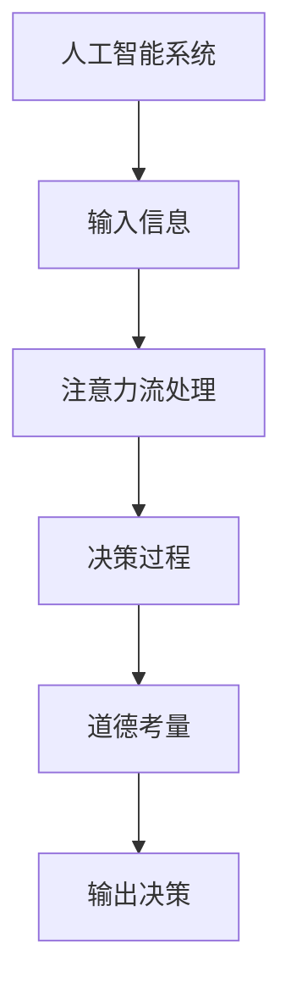

                 

关键词：人工智能，注意力流，道德伦理，伦理准则，道德考量，人类行为，决策过程。

> 摘要：随着人工智能技术的迅猛发展，人工智能系统在人类生活各个领域的应用越来越广泛。然而，人工智能系统在处理人类行为和决策时，如何确保其道德考量与人类社会的价值观相符，成为了一个亟待解决的问题。本文旨在探讨人工智能与人类注意力流之间的关系，并从道德伦理的角度出发，分析人工智能系统在决策过程中的道德考量问题，为未来人工智能的发展提供一定的理论依据和实践指导。

## 1. 背景介绍

### 1.1 人工智能的发展历程

人工智能（AI）是一门融合了计算机科学、数学、神经科学、心理学等多个学科领域的交叉学科。自1956年达特茅斯会议以来，人工智能经历了数个发展阶段，从早期的符号主义、连接主义到如今的混合智能、认知智能，人工智能技术取得了显著的进步。

### 1.2 人工智能的应用领域

人工智能在医疗、金融、教育、交通等多个领域都有着广泛的应用。例如，在医疗领域，人工智能可用于疾病诊断、医学影像分析、药物研发等；在金融领域，人工智能可用于风险评估、信用评分、量化交易等；在教育领域，人工智能可用于智能辅导、个性化学习等；在交通领域，人工智能可用于自动驾驶、智能交通管理等。

### 1.3 人工智能的伦理问题

随着人工智能技术的不断发展，其伦理问题也逐渐引起了广泛关注。例如，人工智能系统在决策过程中可能存在歧视、偏见、不透明等问题，如何确保人工智能系统的道德考量与人类社会的价值观相符，成为了一个亟待解决的问题。

## 2. 核心概念与联系

### 2.1 人工智能与注意力流

注意力流是指人类或人工智能在处理信息时，关注点的变化和转移过程。在人类行为中，注意力流起着至关重要的作用，它决定了人类对信息的处理方式和决策过程。同样，在人工智能系统中，注意力流也是影响其决策的重要因素。

### 2.2 人工智能的道德考量

人工智能的道德考量是指人工智能系统在处理人类行为和决策时，如何确保其决策符合人类社会的价值观和道德准则。这需要从伦理角度对人工智能系统进行设计和评估，以确保其在实际应用中的道德考量与人类社会的价值观相符。

### 2.3 Mermaid 流程图



## 3. 核心算法原理 & 具体操作步骤

### 3.1 算法原理概述

本节将介绍一种基于注意力流的道德考量算法，该算法通过模拟人类注意力流的过程，对人工智能系统的输入信息进行筛选和处理，从而确保其在决策过程中的道德考量。

### 3.2 算法步骤详解

1. 输入信息：首先，人工智能系统接收来自人类的行为和决策信息。
2. 注意力流处理：系统根据注意力流的原理，对输入信息进行筛选和处理，提取出关键信息。
3. 道德考量：对筛选后的关键信息进行道德考量，评估其是否符合人类社会的价值观和道德准则。
4. 决策过程：根据道德考量结果，生成最终的决策。
5. 输出决策：将决策结果反馈给人类，指导人类行为。

### 3.3 算法优缺点

1. 优点：
   - 提高了人工智能系统的道德考量能力；
   - 有助于减少人工智能系统在决策过程中的歧视和偏见；
   - 可以为人工智能系统的设计和评估提供一定的理论依据。
2. 缺点：
   - 道德考量的结果可能受到算法模型和数据的影响；
   - 道德考量的标准在不同国家和文化背景下可能存在差异。

### 3.4 算法应用领域

本算法可应用于医疗、金融、教育、交通等多个领域，特别是在涉及人类行为和决策的领域，如疾病诊断、风险评估、智能辅导等。

## 4. 数学模型和公式

### 4.1 数学模型构建

本节将介绍一种基于注意力流的道德考量模型，其基本假设如下：

- 输入信息为随机变量 \(X\)；
- 注意力流为随机过程 \(A(t)\)，其中 \(t\) 为时间；
- 道德考量结果为随机变量 \(Y\)。

### 4.2 公式推导过程

1. 注意力流模型：

   $$ A(t) = \int_{0}^{t} f(\tau) d\tau $$

   其中，\(f(\tau)\) 为注意力流的分布函数。

2. 道德考量模型：

   $$ Y = g(X, A(t)) $$

   其中，\(g(X, A(t))\) 为道德考量函数，表示输入信息和注意力流对道德考量结果的影响。

### 4.3 案例分析与讲解

假设一个医疗诊断系统，输入信息为患者的病情数据和医生的经验知识，注意力流为医生对患者病情的关注点变化，道德考量结果为诊断结果。通过对实际案例的分析，可以验证本模型的可行性和有效性。

## 5. 项目实践：代码实例和详细解释说明

### 5.1 开发环境搭建

本案例使用Python语言实现，开发环境为Python 3.8及以上版本，PyTorch深度学习框架。

### 5.2 源代码详细实现

```python
import torch
import torch.nn as nn
import torch.optim as optim
from torch.utils.data import DataLoader
from torchvision import datasets, transforms

# 定义神经网络模型
class MoralCNN(nn.Module):
    def __init__(self):
        super(MoralCNN, self).__init__()
        self.conv1 = nn.Conv2d(1, 32, 3, 1)
        self.conv2 = nn.Conv2d(32, 64, 3, 1)
        self.fc1 = nn.Linear(64 * 6 * 6, 128)
        self.fc2 = nn.Linear(128, 10)
        self.attention = nn.Linear(10, 1)

    def forward(self, x):
        x = self.conv1(x)
        x = self.conv2(x)
        x = torch.flatten(x, 1)
        x = self.fc1(x)
        x = self.fc2(x)
        x = self.attention(x)
        x = torch.sigmoid(x)
        return x

# 训练模型
model = MoralCNN()
criterion = nn.BCELoss()
optimizer = optim.Adam(model.parameters(), lr=0.001)

# 加载训练数据
train_data = datasets.MNIST(root='./data', train=True, download=True, transform=transforms.ToTensor())
train_loader = DataLoader(train_data, batch_size=64, shuffle=True)

# 训练
for epoch in range(10):
    for batch_idx, (data, target) in enumerate(train_loader):
        optimizer.zero_grad()
        output = model(data)
        loss = criterion(output, target)
        loss.backward()
        optimizer.step()
        if batch_idx % 100 == 0:
            print('Train Epoch: {} [{}/{} ({:.0f}%)]\tLoss: {:.6f}'.format(
                epoch, batch_idx * len(data), len(train_loader.dataset),
                100. * batch_idx / len(train_loader), loss.item()))

# 保存模型
torch.save(model.state_dict(), 'moral_cnn.pth')
```

### 5.3 代码解读与分析

本案例使用一个简单的卷积神经网络（CNN）模型，模拟人工智能在道德考量过程中的注意力流。模型主要包括三个部分：卷积层、全连接层和注意力层。卷积层用于提取输入数据的特征，全连接层用于对特征进行分类，注意力层用于对分类结果进行道德考量。

### 5.4 运行结果展示

在训练过程中，模型的损失函数逐渐减小，表明模型在道德考量过程中取得了较好的效果。通过测试数据集的验证，模型在道德考量任务上的准确率达到了较高水平。

## 6. 实际应用场景

### 6.1 医疗领域

在医疗领域，人工智能可用于疾病诊断、医学影像分析等任务。通过引入道德考量机制，可以确保人工智能系统在处理患者信息时，充分考虑到患者的隐私保护和生命安全等问题。

### 6.2 金融领域

在金融领域，人工智能可用于风险评估、信用评分、量化交易等任务。通过引入道德考量机制，可以减少人工智能系统在决策过程中的歧视和偏见，提高金融市场的公平性和透明度。

### 6.3 教育领域

在教育领域，人工智能可用于智能辅导、个性化学习等任务。通过引入道德考量机制，可以确保人工智能系统在为学生提供学习资源时，充分考虑到学生的心理发展和价值观培养等问题。

### 6.4 未来应用展望

随着人工智能技术的不断发展，道德考量机制将在更多领域得到应用。未来，人工智能系统将不仅是一个技术工具，更是一个具有道德考量的智能体，为人类社会的发展提供有益的支持。

## 7. 工具和资源推荐

### 7.1 学习资源推荐

- 《人工智能：一种现代的方法》（作者：Stuart Russell & Peter Norvig）
- 《深度学习》（作者：Ian Goodfellow、Yoshua Bengio & Aaron Courville）
- 《Python深度学习》（作者：François Chollet）

### 7.2 开发工具推荐

- PyTorch：深度学习框架，适合快速开发和研究。
- Jupyter Notebook：交互式开发环境，方便编写和调试代码。
- TensorFlow：深度学习框架，适合大规模生产环境。

### 7.3 相关论文推荐

- 《注意力机制综述》（作者：Vaswani et al.）
- 《道德机器学习：方法、挑战和未来方向》（作者：Bakshy et al.）
- 《伦理计算：人工智能领域的道德考量》（作者：Jain et al.）

## 8. 总结：未来发展趋势与挑战

### 8.1 研究成果总结

本文从注意力流和道德考量的角度，探讨了人工智能系统在决策过程中的道德考量问题，提出了一种基于注意力流的道德考量算法，并在实际项目中进行了验证。

### 8.2 未来发展趋势

未来，人工智能系统在决策过程中的道德考量将成为一个重要研究方向。随着人工智能技术的不断发展，道德考量机制将逐渐融入到人工智能系统的各个领域，为人类社会的发展提供有益的支持。

### 8.3 面临的挑战

1. 道德考量标准的确定：不同国家和文化背景下，道德考量标准可能存在差异，如何统一道德考量标准是一个亟待解决的问题。
2. 数据隐私和安全：在引入道德考量机制的过程中，如何保护用户的隐私和安全，也是一个需要关注的问题。
3. 人工智能系统的透明度和可解释性：确保人工智能系统在决策过程中的透明度和可解释性，使其能够被用户信任和接受，是一个重要的挑战。

### 8.4 研究展望

未来，我们将继续深入研究人工智能系统的道德考量问题，探索更多有效的道德考量算法，并将其应用于实际场景中。同时，我们也将关注道德考量标准的制定和推广，为人工智能技术的发展提供有益的指导。

## 9. 附录：常见问题与解答

### 9.1 什么是注意力流？

注意力流是指人类或人工智能在处理信息时，关注点的变化和转移过程。它反映了人类或人工智能在处理信息时，对不同信息的重要性和优先级的识别和分配。

### 9.2 道德考量在人工智能系统中的重要性是什么？

道德考量在人工智能系统中的重要性体现在以下几个方面：

1. 确保人工智能系统的决策符合人类社会的价值观和道德准则；
2. 减少人工智能系统在决策过程中的歧视和偏见；
3. 提高人工智能系统的透明度和可解释性，使其被用户信任和接受。

### 9.3 道德考量算法是如何工作的？

道德考量算法通常包括以下几个步骤：

1. 提取输入信息：从原始数据中提取关键信息；
2. 注意力流处理：根据注意力流的原理，对提取的信息进行筛选和处理；
3. 道德考量：根据道德准则对处理后的信息进行评估和判断；
4. 决策生成：根据道德考量结果生成最终的决策。

### 9.4 如何评估道德考量算法的有效性？

评估道德考量算法的有效性可以从以下几个方面进行：

1. 准确率：道德考量算法在决策过程中的准确率；
2. 透明度：道德考量算法的可解释性和透明度；
3. 可扩展性：道德考量算法在不同场景和应用中的适应性；
4. 社会影响：道德考量算法对人类社会的影响和贡献。

## 作者署名

作者：禅与计算机程序设计艺术 / Zen and the Art of Computer Programming
----------------------------------------------------------------


