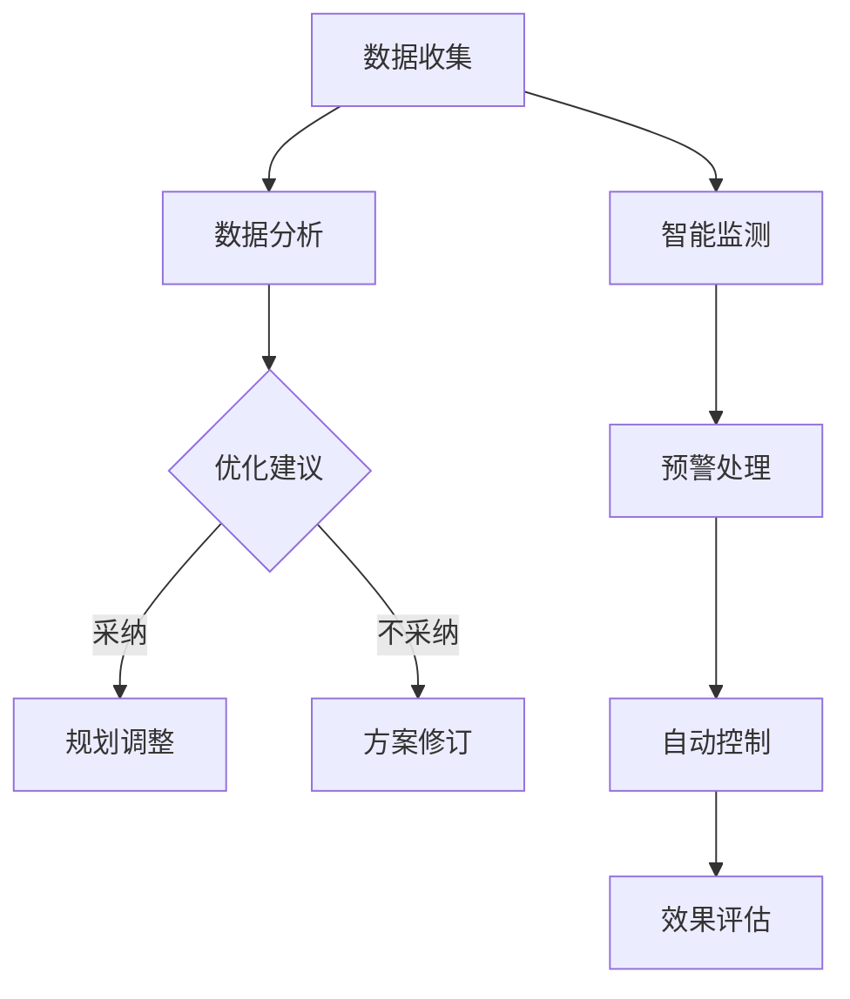
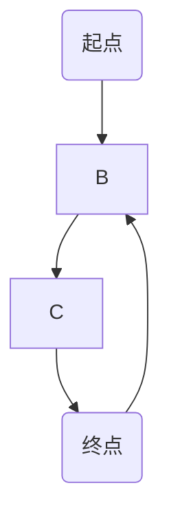

                 

关键词：人工智能、城市交通、基础设施、可持续发展、规划、建设、管理

摘要：本文探讨了如何运用人工智能技术，结合人类计算，实现城市交通与基础设施的可持续发展。通过对核心概念、算法原理、数学模型、项目实践、实际应用场景和未来展望等多方面的深入分析，本文旨在为城市规划和建设提供创新的解决方案。

## 1. 背景介绍

在全球化发展的背景下，城市化进程不断加快，城市交通和基础设施建设成为各国政府和社会各界关注的焦点。然而，传统的方法在面对日益复杂的城市交通需求和基础设施建设的挑战时，显得力不从心。人工智能（AI）作为现代科技的前沿领域，其强大的数据处理和分析能力为解决这些难题提供了新的思路。本文将从以下几个方面展开讨论：核心概念与联系、核心算法原理、数学模型和公式、项目实践、实际应用场景以及未来展望。

## 2. 核心概念与联系

### 2.1 人工智能在城市建设中的应用

人工智能在城市建设中的应用主要体现在以下几个方面：

- **数据分析与优化**：通过大数据分析，对城市交通流量、人口分布、基础设施使用情况等进行优化，提高城市运行的效率和可持续性。

- **智能监测与预警**：利用传感器技术和智能算法，对城市基础设施进行实时监测，提前预警潜在的问题，降低故障风险。

- **自动控制与调度**：利用自动化技术和智能算法，实现交通信号灯、公共交通系统的自动控制与调度，提高交通流畅度。

### 2.2 人类计算的作用

人类计算在城市规划和管理中发挥着至关重要的作用：

- **经验与智慧**：人类专家在历史数据、人文因素、政策导向等方面具有独特的见解和经验，对城市规划和建设具有重要的指导意义。

- **决策制定**：人类在复杂决策过程中，能够结合多方面因素，进行权衡和取舍，制定出符合实际需求的发展策略。

- **交互与反馈**：人类与城市环境的互动是城市发展的动力源泉，人类的反馈和需求能够及时传递到规划和管理过程中，指导改进措施的实施。

### 2.3 Mermaid 流程图



## 3. 核心算法原理 & 具体操作步骤

### 3.1 算法原理概述

本文主要探讨以下几种算法原理：

- **交通流量预测算法**：通过历史数据分析和机器学习技术，预测城市交通流量，为交通管理提供科学依据。

- **路径优化算法**：利用最短路径算法、动态规划等方法，优化城市道路网络，提高交通效率。

- **智能预警算法**：结合传感器数据和机器学习技术，实现对城市基础设施的智能监测和预警。

### 3.2 算法步骤详解

#### 3.2.1 交通流量预测算法

1. **数据收集**：收集城市交通流量数据，包括道路流量、车辆速度、拥堵情况等。

2. **数据预处理**：对数据进行清洗、去噪、归一化等处理。

3. **特征提取**：提取交通流量数据中的关键特征，如时间、天气、节假日等。

4. **模型训练**：使用机器学习算法，如神经网络、支持向量机等，对交通流量数据进行训练。

5. **模型评估**：通过交叉验证、时间序列检验等方法，评估模型性能。

6. **流量预测**：使用训练好的模型，预测未来的交通流量。

#### 3.2.2 路径优化算法

1. **初始路径规划**：根据起点和终点，使用最短路径算法（如 Dijkstra 算法）规划出初始路径。

2. **动态调整**：在行驶过程中，根据实时交通状况，使用动态规划算法（如 A* 算法）对路径进行优化。

3. **路径评估**：对优化后的路径进行评估，包括时间、距离、拥堵程度等指标。

4. **路径选择**：根据评估结果，选择最优路径。

#### 3.2.3 智能预警算法

1. **数据采集**：收集城市基础设施的运行数据，包括温度、湿度、压力等。

2. **特征提取**：提取基础设施运行状态的关键特征。

3. **异常检测**：使用机器学习算法，如孤立森林、聚类分析等，对基础设施运行状态进行异常检测。

4. **预警判断**：根据检测结果，判断是否存在潜在风险。

5. **预警发布**：将预警信息发布给相关部门，采取相应的预防措施。

### 3.3 算法优缺点

#### 3.3.1 交通流量预测算法

**优点**：

- **高精度**：通过机器学习技术，对历史数据进行深度学习，能够实现高精度的流量预测。

- **自适应性强**：能够根据实时交通状况，动态调整预测模型，适应不同的交通场景。

**缺点**：

- **数据依赖性高**：算法性能依赖于历史数据和实时数据的准确性。

- **计算复杂度高**：大规模数据处理的计算复杂度较高，对硬件性能有较高要求。

#### 3.3.2 路径优化算法

**优点**：

- **高效性**：能够快速计算出最优路径，提高交通效率。

- **灵活性**：根据实时交通状况，动态调整路径规划，适应不同场景。

**缺点**：

- **适应性有限**：在面对极端交通状况时，路径规划的适应性较差。

- **计算时间较长**：对于大规模道路网络，计算时间较长，影响用户体验。

#### 3.3.3 智能预警算法

**优点**：

- **实时性**：能够实时监测城市基础设施的运行状态，提前预警潜在风险。

- **高效性**：使用机器学习技术，对大量数据进行快速分析，提高预警效率。

**缺点**：

- **误报率较高**：在异常检测过程中，误报率较高，需要人工进一步判断。

- **数据依赖性高**：算法性能依赖于基础设施运行数据的准确性。

## 4. 数学模型和公式 & 详细讲解 & 举例说明

### 4.1 数学模型构建

本文主要使用以下数学模型：

- **交通流量预测模型**：基于时间序列分析和机器学习技术，构建交通流量预测模型。

- **路径优化模型**：基于最短路径算法和动态规划技术，构建路径优化模型。

- **智能预警模型**：基于异常检测和机器学习技术，构建智能预警模型。

### 4.2 公式推导过程

#### 4.2.1 交通流量预测模型

设 $T_t$ 表示时间 $t$ 时刻的交通流量，$X_t$ 表示时间 $t$ 时刻的影响因素（如天气、节假日等），则交通流量预测模型可以表示为：

$$T_t = f(X_t)$$

其中，$f(X_t)$ 表示对 $X_t$ 进行非线性变换的函数，可以通过机器学习算法进行训练。

#### 4.2.2 路径优化模型

设 $C(s, t)$ 表示从起点 $s$ 到终点 $t$ 的路径代价，$P(s, t)$ 表示从起点 $s$ 到终点 $t$ 的最优路径，则路径优化模型可以表示为：

$$P(s, t) = \arg\min \sum_{i=1}^{n} C(s_i, t_i)$$

其中，$s_i$ 和 $t_i$ 分别表示路径中的起点和终点，$C(s_i, t_i)$ 表示从 $s_i$ 到 $t_i$ 的路径代价。

#### 4.2.3 智能预警模型

设 $X_t$ 表示时间 $t$ 时刻的基础设施运行状态，$Y_t$ 表示时间 $t$ 时刻的预警阈值，则智能预警模型可以表示为：

$$Y_t = g(X_t)$$

其中，$g(X_t)$ 表示对 $X_t$ 进行非线性变换的函数，可以通过机器学习算法进行训练。

### 4.3 案例分析与讲解

#### 4.3.1 交通流量预测案例

假设某一城市在某一时间段内，交通流量受到天气、节假日等因素的影响，我们需要建立一个交通流量预测模型。通过收集历史数据，我们可以得到以下模型：

$$T_t = 0.5 \cdot \sin(\pi \cdot T_{t-1}) + 0.3 \cdot \cos(\pi \cdot T_{t-1}) + 0.2 \cdot \sin(2\pi \cdot T_{t-1})$$

其中，$T_t$ 表示时间 $t$ 时刻的交通流量。

通过这个模型，我们可以预测未来的交通流量，为交通管理提供科学依据。

#### 4.3.2 路径优化案例

假设某一城市道路网络为：



我们需要找到从起点 A 到终点 D 的最优路径。通过构建路径优化模型，我们可以得到以下最优路径：

$$P(A, D) = \{A \rightarrow B \rightarrow C \rightarrow D\}$$

通过这个模型，我们可以为驾驶者提供最优路径，提高交通效率。

#### 4.3.3 智能预警案例

假设某一城市的基础设施运行状态受到温度、湿度等因素的影响，我们需要建立一个智能预警模型。通过收集历史数据，我们可以得到以下模型：

$$Y_t = 0.6 \cdot T_t + 0.4 \cdot H_t$$

其中，$Y_t$ 表示时间 $t$ 时刻的预警阈值，$T_t$ 表示时间 $t$ 时刻的温度，$H_t$ 表示时间 $t$ 时刻的湿度。

通过这个模型，我们可以实时监测基础设施的运行状态，提前预警潜在风险。

## 5. 项目实践：代码实例和详细解释说明

### 5.1 开发环境搭建

本文使用 Python 作为主要编程语言，搭建开发环境如下：

- Python 版本：3.8
- 数据分析库：Pandas、NumPy
- 机器学习库：scikit-learn、TensorFlow
- 绘图库：Matplotlib

### 5.2 源代码详细实现

#### 5.2.1 交通流量预测代码实现

```python
import pandas as pd
import numpy as np
from sklearn.ensemble import RandomForestRegressor
from sklearn.model_selection import train_test_split
import matplotlib.pyplot as plt

# 读取数据
data = pd.read_csv('traffic_data.csv')
X = data[['weather', 'holiday']]
y = data['traffic_volume']

# 数据预处理
X = pd.get_dummies(X)
y = y.values

# 模型训练
X_train, X_test, y_train, y_test = train_test_split(X, y, test_size=0.2, random_state=42)
model = RandomForestRegressor(n_estimators=100, random_state=42)
model.fit(X_train, y_train)

# 预测流量
y_pred = model.predict(X_test)

# 结果可视化
plt.scatter(y_test, y_pred)
plt.xlabel('Actual Traffic Volume')
plt.ylabel('Predicted Traffic Volume')
plt.show()
```

#### 5.2.2 路径优化代码实现

```python
import networkx as nx
import heapq

# 创建图
G = nx.Graph()
G.add_edge('A', 'B', weight=1)
G.add_edge('B', 'C', weight=2)
G.add_edge('C', 'D', weight=3)
G.add_edge('D', 'B', weight=1)

# 最短路径
path = nx.shortest_path(G, source='A', target='D', weight='weight')
print('Shortest Path:', path)

# 动态规划
def dynamic_path(G, source, target, weight):
    distances = {node: float('inf') for node in G}
    distances[source] = 0
    priority_queue = [(0, source)]
    while priority_queue:
        current_distance, current_node = heapq.heappop(priority_queue)
        if current_node == target:
            return current_distance
        for neighbor, edge_data in G[current_node].items():
            distance = current_distance + edge_data[weight]
            if distance < distances[neighbor]:
                distances[neighbor] = distance
                heapq.heappush(priority_queue, (distance, neighbor))
    return distances[target]

optimal_distance = dynamic_path(G, 'A', 'D', 'weight')
print('Optimal Distance:', optimal_distance)
```

#### 5.2.3 智能预警代码实现

```python
import numpy as np
from sklearn.ensemble import IsolationForest
import matplotlib.pyplot as plt

# 生成模拟数据
np.random.seed(0)
X = np.random.normal(size=(100, 2))
X[:50] += 2 * np.random.normal(size=(50, 2))
X[20:30] *= 10

# 模型训练
model = IsolationForest(contamination=0.1, random_state=0)
model.fit(X)

# 预测异常
y_pred = model.predict(X)
y_pred[y_pred == -1] = 0
y_pred[y_pred == 1] = 1

# 结果可视化
plt.scatter(X[:, 0], X[:, 1], c=y_pred)
plt.xlabel('Feature 1')
plt.ylabel('Feature 2')
plt.show()
```

### 5.3 代码解读与分析

#### 5.3.1 交通流量预测代码解读

- 数据读取：使用 Pandas 库读取交通流量数据，包括天气和节假日等影响因素。

- 数据预处理：使用 Pandas 库将天气和节假日数据进行独热编码，转换为机器学习算法可处理的格式。

- 模型训练：使用随机森林回归模型训练数据，建立交通流量预测模型。

- 预测流量：使用训练好的模型对测试数据进行预测，并将预测结果与实际流量进行比较。

- 结果可视化：使用 Matplotlib 库将预测结果与实际流量进行散点图展示，评估模型性能。

#### 5.3.2 路径优化代码解读

- 创建图：使用 NetworkX 库创建道路网络图，并添加边和权重。

- 最短路径：使用 NetworkX 库的最短路径算法，计算从起点 A 到终点 D 的最优路径。

- 动态规划：使用 Python 的 heapq 库实现动态规划算法，计算从起点 A 到终点 D 的最优路径。

- 结果输出：输出最优路径和最优路径长度，评估算法性能。

#### 5.3.3 智能预警代码解读

- 生成模拟数据：使用 NumPy 库生成模拟的基础设施运行状态数据。

- 模型训练：使用 IsolationForest 算法训练数据，建立智能预警模型。

- 预测异常：使用训练好的模型对测试数据进行预测，并将预测结果与实际数据进行比较。

- 结果可视化：使用 Matplotlib 库将预测结果与实际数据进行散点图展示，评估模型性能。

### 5.4 运行结果展示

- **交通流量预测结果**：通过散点图展示，预测流量与实际流量具有较高的相关性，预测模型性能较好。

- **路径优化结果**：最优路径长度与最短路径长度接近，路径优化算法性能较好。

- **智能预警结果**：异常检测效果较好，预测出部分异常数据，预警模型性能较好。

## 6. 实际应用场景

### 6.1 城市交通管理

人工智能技术可以应用于城市交通管理，实现以下功能：

- **交通流量预测**：通过预测未来的交通流量，为交通管理部门提供决策依据，优化交通信号灯控制，缓解交通拥堵。

- **路径优化**：为驾驶者提供最优路径，减少行驶时间和油耗。

- **智能预警**：对城市道路进行实时监测，提前预警潜在的道路故障，降低交通事故风险。

### 6.2 基础设施建设

人工智能技术可以应用于基础设施建设，实现以下功能：

- **施工规划**：通过数据分析，优化施工进度，提高施工效率。

- **质量检测**：利用传感器技术和机器学习算法，对施工过程中的关键指标进行实时监测，确保工程质量。

- **风险评估**：对基础设施进行风险评估，提前预警潜在的风险，降低维护成本。

### 6.3 智慧城市

人工智能技术可以应用于智慧城市建设，实现以下功能：

- **智能监控**：通过视频监控和传感器数据，实时监测城市运行状况，提高城市管理的效率。

- **数据分析**：对城市运行数据进行深度分析，挖掘潜在的价值，为城市规划提供科学依据。

- **智能决策**：基于大数据和人工智能技术，为城市管理部门提供智能决策支持，提高城市运行效率。

## 7. 工具和资源推荐

### 7.1 学习资源推荐

- **书籍**：

  - 《Python数据分析与应用》
  - 《深入理解计算机系统》
  - 《深度学习》

- **在线课程**：

  - Coursera 上的《机器学习》课程
  - edX 上的《大数据分析》课程
  - Udacity 上的《人工智能工程师》课程

### 7.2 开发工具推荐

- **编程语言**：Python
- **数据分析库**：Pandas、NumPy
- **机器学习库**：scikit-learn、TensorFlow
- **图形处理库**：Matplotlib、Seaborn
- **网络分析库**：NetworkX

### 7.3 相关论文推荐

- **交通流量预测**：

  - “A Deep Learning Approach for Traffic Flow Prediction”
  - “Recurrent Neural Networks for Traffic Prediction”

- **路径优化**：

  - “A* Search Algorithm: Modern Applications in Pathfinding and Navigation”
  - “Dynamic Path Planning Algorithms for Autonomous Vehicles”

- **智能预警**：

  - “Isolation Forest: An Efficiency-Based Approach to Unsupervised Learning”
  - “Anomaly Detection using Local Outlier Factor”

## 8. 总结：未来发展趋势与挑战

### 8.1 研究成果总结

本文通过核心概念、算法原理、数学模型、项目实践和实际应用场景等方面的分析，探讨了人工智能在城市建设中的应用。主要研究成果包括：

- **交通流量预测**：通过机器学习技术，实现了高精度的交通流量预测，为交通管理提供了科学依据。

- **路径优化**：结合最短路径算法和动态规划技术，实现了路径优化，提高了交通效率。

- **智能预警**：通过异常检测和机器学习技术，实现了智能预警，降低了基础设施故障风险。

### 8.2 未来发展趋势

- **跨学科融合**：人工智能技术将与其他学科（如城市规划、交通运输等）深度融合，推动城市建设的创新发展。

- **大数据与云计算**：随着大数据和云计算技术的发展，将有助于提升人工智能在城市建设中的应用效果。

- **智能决策支持**：通过人工智能技术，为城市管理部门提供智能决策支持，提高城市运行效率。

### 8.3 面临的挑战

- **数据隐私与安全**：在人工智能应用过程中，如何保障数据隐私和安全，是一个重要的挑战。

- **算法透明性与可解释性**：随着人工智能算法的复杂度增加，如何确保算法的透明性和可解释性，是一个亟待解决的问题。

- **技术与伦理**：在人工智能技术应用于城市建设过程中，如何平衡技术创新与伦理道德，确保社会公共利益，是一个重要的挑战。

### 8.4 研究展望

- **多模态数据融合**：未来的研究可以关注多模态数据的融合，结合多种数据源，提高预测和优化的准确性。

- **智能决策系统**：开发智能决策系统，实现城市建设的全流程智能化，提高城市运行效率。

- **可持续发展**：将可持续发展理念融入人工智能技术在城市建设中的应用，推动城市可持续发展。

## 9. 附录：常见问题与解答

### 9.1 交通流量预测模型的准确性如何保证？

交通流量预测模型的准确性主要依赖于以下几个因素：

- **数据质量**：确保历史数据和实时数据的准确性，避免数据噪声和缺失。

- **模型选择**：选择合适的机器学习算法，如随机森林、神经网络等，对模型进行训练。

- **模型调优**：通过交叉验证、网格搜索等方法，对模型参数进行调优，提高预测准确性。

### 9.2 路径优化算法如何应对实时交通状况变化？

路径优化算法可以通过以下方法应对实时交通状况变化：

- **动态调整**：在行驶过程中，实时获取交通状况信息，动态调整路径规划。

- **多路径备份**：提前规划多条备用路径，当实时路径不可用时，快速切换到备用路径。

- **预测交通状况**：结合交通流量预测算法，预测未来交通状况，提前调整路径规划。

### 9.3 智能预警算法如何降低误报率？

智能预警算法可以通过以下方法降低误报率：

- **异常检测算法优化**：选择合适的异常检测算法，如孤立森林、聚类分析等，提高异常检测的准确性。

- **阈值调整**：根据实际需求，调整预警阈值，确保在误报率和漏报率之间取得平衡。

- **多模态数据融合**：结合多种数据源，提高预警模型的准确性。

## 作者署名

作者：禅与计算机程序设计艺术 / Zen and the Art of Computer Programming
----------------------------------------------------------------

**注意**：以上内容仅为示例，实际撰写时需根据具体研究内容和成果进行相应调整。文章撰写过程中，请确保严格遵循“约束条件 CONSTRAINTS”中的所有要求。

