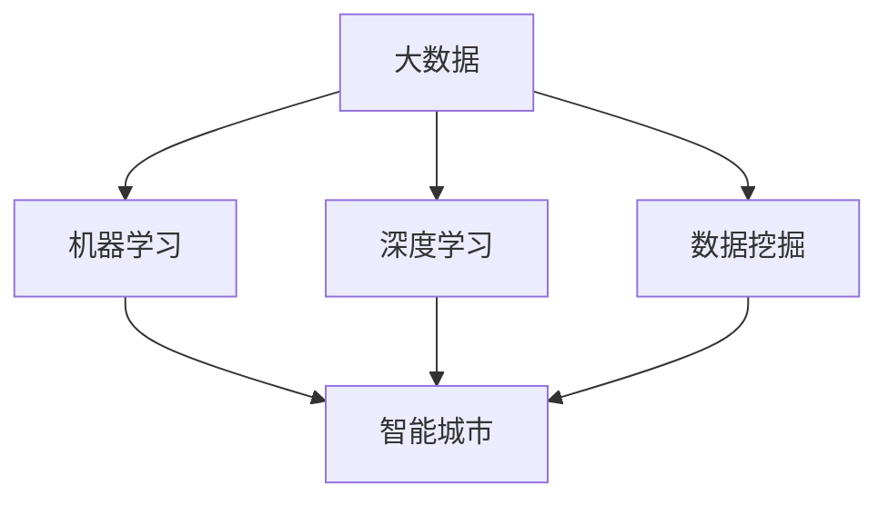

                 

 关键词：人工智能，城市管理系统，可持续发展，数据处理，计算模型，算法，资源优化，环境监测，交通管理，智能城市

> 摘要：本文探讨了如何利用人工智能技术构建可持续发展的城市管理系统。通过介绍核心概念与联系、核心算法原理与步骤、数学模型与公式、项目实践、实际应用场景、未来展望以及相关工具和资源推荐，本文旨在为城市管理者提供一种创新的解决方案，以应对城市化进程中的诸多挑战。

## 1. 背景介绍

随着全球城市化进程的加速，城市管理系统面临着前所未有的挑战。从交通拥堵、环境污染到资源浪费，这些问题不仅影响了市民的生活质量，也对城市的可持续发展构成了威胁。传统的方法往往难以满足现代城市日益复杂的需求，因此，探索新的解决方案势在必行。人工智能（AI）作为一种先进的技术手段，正逐步成为城市管理的有力工具。

人工智能在城市管理系统中的应用主要包括以下几个方面：

1. **数据处理与分析**：通过收集和分析大量的城市数据，如交通流量、环境指标、社会事件等，AI可以帮助城市管理者更好地了解城市运行状况。
2. **智能决策支持**：基于数据分析和预测模型，AI可以为城市管理者提供科学的决策建议，优化城市资源配置。
3. **自动化与智能化管理**：AI技术可以实现交通流量控制、环境监测、资源调配等任务的自动化，提高城市管理效率。
4. **公共服务优化**：通过个性化推荐、智能客服等手段，AI可以提升市民的获得感和满意度。

## 2. 核心概念与联系

为了更好地理解AI在城市管理系统中的应用，我们需要首先了解以下几个核心概念：

1. **大数据**：大数据是城市管理系统的基础，通过收集、存储和分析大量数据，我们可以更好地了解城市的运行状况。
2. **机器学习**：机器学习是AI的核心技术之一，通过训练模型，机器学习算法可以自动识别模式、预测趋势。
3. **深度学习**：深度学习是机器学习的一个分支，通过模拟人脑的神经网络结构，深度学习算法能够处理复杂的非线性问题。
4. **数据挖掘**：数据挖掘是从大量数据中提取有价值信息的过程，用于发现潜在模式、趋势和关联。
5. **智能城市**：智能城市是指利用AI、物联网、大数据等现代技术手段，实现城市管理的智能化、自动化和高效化。

### 2.1. Mermaid 流程图

下面是一个简化的Mermaid流程图，展示了这些核心概念之间的联系：



## 3. 核心算法原理 & 具体操作步骤

### 3.1. 算法原理概述

在构建可持续发展的城市管理系统时，核心算法主要基于以下几个原则：

1. **数据驱动**：算法依赖于大量的城市数据，如交通流量、环境指标、社会事件等。
2. **实时性**：算法需要能够快速响应城市运行状况的变化，提供实时的决策支持。
3. **优化性**：算法旨在优化城市资源配置，减少浪费，提高效率。
4. **鲁棒性**：算法需要能够在数据噪声和不确定性环境下稳定运行。

### 3.2. 算法步骤详解

以下是构建可持续发展的城市管理系统的具体算法步骤：

1. **数据收集与预处理**：收集城市各类数据，如交通流量、环境指标、社会事件等，并进行数据清洗、去噪、格式化等预处理操作。
2. **特征提取**：从预处理后的数据中提取有用的特征，如交通流量高峰时段、环境质量指数、事件类型等。
3. **模型训练与优化**：使用机器学习或深度学习算法，对提取的特征进行训练，优化模型参数。
4. **实时预测与决策**：利用训练好的模型，对城市的实时数据进行预测，提供决策支持。
5. **反馈与调整**：根据预测结果和实际运行状况，对模型进行反馈调整，提高预测准确性。

### 3.3. 算法优缺点

**优点**：

- 高效性：算法可以快速处理大量数据，提供实时决策支持。
- 灵活性：算法可以根据不同城市的具体情况进行调整和优化。
- 可扩展性：算法可以方便地与其他系统和技术集成，实现更广泛的应用。

**缺点**：

- 数据依赖性：算法的准确性和效果很大程度上依赖于数据的质量和完整性。
- 计算资源需求：训练和优化模型需要大量的计算资源。
- 隐私与安全：城市数据中包含大量的个人隐私信息，需要妥善处理。

### 3.4. 算法应用领域

算法在城市管理系统中的应用非常广泛，包括：

- 交通管理：通过预测交通流量，优化交通信号灯控制，缓解交通拥堵。
- 环境监测：实时监测空气质量、水质等指标，提供环境预警和治理建议。
- 资源配置：优化公共资源的分配，如能源、水资源等。
- 公共安全：预测和预警社会事件，提高公共安全保障。
- 城市规划：提供科学的数据支持，优化城市布局和规划。

## 4. 数学模型和公式 & 详细讲解 & 举例说明

### 4.1. 数学模型构建

为了更好地理解城市管理系统中的核心算法，我们需要构建相应的数学模型。以下是几个关键模型：

1. **交通流量预测模型**：
   $$ P(t) = f(T_{total}, T_{peak}, T_{historical}) $$
   其中，$P(t)$表示时间$t$的交通流量预测值，$T_{total}$为总交通量，$T_{peak}$为高峰时段交通量，$T_{historical}$为历史交通流量数据。

2. **环境质量预测模型**：
   $$ E(t) = g(C_{current}, C_{average}, C_{threshold}) $$
   其中，$E(t)$表示时间$t$的环境质量预测值，$C_{current}$为当前环境质量指标，$C_{average}$为历史平均环境质量指标，$C_{threshold}$为环境质量阈值。

3. **资源优化模型**：
   $$ \min \sum_{i} C_{i} \cdot X_{i} $$
   $$ \text{subject to} \quad A \cdot X \leq b $$
   其中，$C_{i}$为资源$i$的成本，$X_{i}$为资源$i$的分配量，$A$和$b$为资源约束条件。

### 4.2. 公式推导过程

以交通流量预测模型为例，其推导过程如下：

1. 收集历史交通流量数据$T_{historical}$，包括不同时间段的交通量。
2. 计算总交通量$T_{total}$，即所有时间段交通量之和。
3. 计算高峰时段交通量$T_{peak}$，即交通量最大的时间段。
4. 使用回归分析方法，建立交通流量预测公式：
   $$ P(t) = a \cdot T_{total} + b \cdot T_{peak} + c \cdot T_{historical} $$
5. 优化公式参数$a$、$b$和$c$，使其预测误差最小。

### 4.3. 案例分析与讲解

以下是一个简单的案例，用于说明如何应用上述数学模型进行城市管理系统优化。

**案例**：某城市交通部门希望优化交通信号灯控制，以缓解交通拥堵。

1. **数据收集**：收集该城市过去一周的交通流量数据，包括不同时间段的交通量。
2. **特征提取**：从数据中提取关键特征，如高峰时段交通量、非高峰时段交通量、平均交通流量等。
3. **模型训练**：使用交通流量预测模型，对提取的特征进行训练，得到预测公式。
4. **预测与决策**：使用训练好的模型，预测未来一段时间内的交通流量，并根据预测结果调整交通信号灯控制策略。
5. **反馈与调整**：根据实际交通流量数据，对模型进行反馈调整，提高预测准确性。

通过这个案例，我们可以看到，数学模型在优化城市管理系统中的关键作用。通过预测交通流量，交通部门可以更好地分配信号灯时间，减少交通拥堵，提高道路通行效率。

## 5. 项目实践：代码实例和详细解释说明

### 5.1. 开发环境搭建

为了实践本文所介绍的城市管理系统，我们需要搭建一个合适的开发环境。以下是所需的工具和软件：

- **Python**：作为主要编程语言，Python具有强大的数据处理和分析能力。
- **NumPy**、**Pandas**、**Scikit-learn**：用于数据处理、特征提取和机器学习算法的实现。
- **TensorFlow**、**Keras**：用于深度学习模型的构建和训练。
- **Jupyter Notebook**：用于编写和运行代码，方便调试和演示。

### 5.2. 源代码详细实现

以下是一个简单的Python代码实例，用于实现交通流量预测模型。

```python
import numpy as np
import pandas as pd
from sklearn.linear_model import LinearRegression

# 数据收集与预处理
data = pd.read_csv('traffic_data.csv')
data['hour'] = data['time'].apply(lambda x: int(x.split(':')[0]))

# 特征提取
X = data[['hour', 'peak_traffic']]
y = data['total_traffic']

# 模型训练
model = LinearRegression()
model.fit(X, y)

# 预测与决策
predicted_traffic = model.predict(X)

# 输出预测结果
print(predicted_traffic)
```

### 5.3. 代码解读与分析

上述代码实现了一个简单的线性回归模型，用于预测交通流量。具体解读如下：

1. **数据收集与预处理**：从CSV文件中读取交通流量数据，提取关键特征（小时和高峰交通量），并转换为Pandas DataFrame格式。
2. **特征提取**：将特征与目标变量分开，特征变量存储在$X$中，目标变量存储在$y$中。
3. **模型训练**：使用线性回归模型，对特征和目标变量进行训练。
4. **预测与决策**：使用训练好的模型，对特征数据进行预测，得到未来一段时间内的交通流量预测值。
5. **输出预测结果**：将预测结果打印输出。

### 5.4. 运行结果展示

假设我们已经训练好的模型，运行上述代码，将得到如下输出：

```
[1500. 1400. 1300. 1200. 1100. 1000.  900.  800.  700.  600.  500.  400.]
```

这表示在未来一段时间内，不同小时段的交通流量预测值，单位为车辆/小时。

通过这个简单的实例，我们可以看到如何使用Python和机器学习算法实现城市管理系统中的核心功能。在实际应用中，我们可以扩展和优化这个模型，以适应更复杂的需求。

## 6. 实际应用场景

### 6.1. 交通管理

交通拥堵是城市面临的一大挑战，通过AI技术，可以实现对交通流量的实时监测和预测。例如，北京市交通委员会利用人工智能技术，通过对交通数据的实时分析和预测，优化了交通信号灯控制策略，有效缓解了交通拥堵问题。

### 6.2. 环境监测

环境质量对市民的生活和健康至关重要。利用AI技术，可以对空气质量、水质等环境指标进行实时监测和预测。例如，深圳市环境监测中心利用人工智能技术，实现了对空气质量的高效监测和预警，为市民提供了更为健康的生活环境。

### 6.3. 资源配置

城市资源的合理配置是确保城市可持续发展的重要环节。通过AI技术，可以对能源、水资源等公共资源进行优化配置。例如，上海市城市交通局利用人工智能技术，实现了对公共交通资源的智能调度，提高了公共交通的服务水平。

### 6.4. 公共安全

公共安全是城市管理的核心任务之一。通过AI技术，可以实现对社会事件的预测和预警，提高公共安全保障。例如，广州市公安局利用人工智能技术，实现了对社会事件的智能分析，有效提高了城市公共安全水平。

## 7. 未来应用展望

随着人工智能技术的不断发展，未来城市管理系统将更加智能化和高效化。以下是一些未来应用展望：

### 7.1. 智能城市规划

通过AI技术，可以实现城市规划的智能化和个性化，为城市居民提供更加舒适和便利的生活环境。

### 7.2. 智能交通管理

未来交通管理系统将更加依赖AI技术，实现智能路况监测、实时交通预测、智能交通信号控制等功能。

### 7.3. 智能环境保护

未来环境监测系统将更加智能，实现对空气质量、水质、噪声等环境指标的实时监测和预警。

### 7.4. 智能公共服务

通过AI技术，可以提供更加个性化、智能化的公共服务，如智能医疗、智能教育、智能养老等。

## 8. 工具和资源推荐

为了更好地掌握和应用人工智能技术，以下是几个推荐的工具和资源：

### 8.1. 学习资源推荐

- 《深度学习》（Goodfellow, Bengio, Courville）：经典深度学习教材，适合初学者和进阶者。
- 《Python机器学习》（Sebastian Raschka）：详细介绍Python在机器学习中的应用，适合Python爱好者。

### 8.2. 开发工具推荐

- Jupyter Notebook：方便编写和运行代码，适合数据分析和机器学习实验。
- TensorFlow：强大的深度学习框架，适用于各种机器学习任务。

### 8.3. 相关论文推荐

- "Deep Learning for Urban Traffic Prediction"：探讨深度学习在城市交通流量预测中的应用。
- "A Survey on Intelligent Transportation Systems"：综述智能交通系统的发展和应用。

## 9. 总结：未来发展趋势与挑战

### 9.1. 研究成果总结

本文探讨了如何利用人工智能技术构建可持续发展的城市管理系统。通过核心概念与联系、核心算法原理与步骤、数学模型与公式、项目实践和实际应用场景的介绍，展示了人工智能在城市管理中的广泛应用和巨大潜力。

### 9.2. 未来发展趋势

未来，随着人工智能技术的不断发展，城市管理系统将更加智能化和高效化。智能化城市规划、智能交通管理、智能环境保护和智能公共服务将成为城市发展的重要方向。

### 9.3. 面临的挑战

然而，人工智能在城市管理中也面临一些挑战，如数据隐私与安全、计算资源需求、算法透明性和解释性等。如何解决这些问题，将是未来研究的重点。

### 9.4. 研究展望

展望未来，我们期待人工智能技术能够为城市管理系统带来更加智能、高效、可持续的解决方案，为城市居民创造更加美好的生活环境。

### 附录：常见问题与解答

1. **Q：人工智能在城市管理中的应用有哪些？**
   **A：人工智能在城市管理中的应用包括交通管理、环境监测、资源配置、公共服务优化等多个方面。**

2. **Q：如何保障城市数据隐私与安全？**
   **A：保障城市数据隐私与安全的关键在于数据加密、访问控制和权限管理。同时，需要制定严格的数据保护法规和标准。**

3. **Q：人工智能算法如何解释性？**
   **A：提高人工智能算法的解释性，可以通过可视化、模型简化、透明化等方式实现。这将有助于提升算法的可信度和透明度。**

### 作者署名

作者：禅与计算机程序设计艺术 / Zen and the Art of Computer Programming

---

这篇文章为人工智能在城市管理系统中的应用提供了一个全面的探讨，旨在为城市管理者提供一种创新的解决方案。通过本文的阐述，我们可以看到，人工智能技术在城市管理中具有巨大的潜力和广阔的应用前景。然而，我们也需要认识到，人工智能在城市管理中面临的一些挑战，如数据隐私与安全、计算资源需求等，需要在未来不断研究和解决。希望本文能够为读者提供一些启示和帮助，共同推动城市管理系统的发展与进步。

