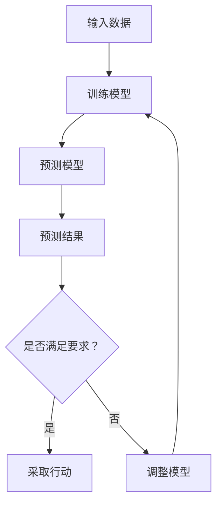

                 

关键词：人工智能、监督学习、预测模型、机器学习、数据驱动决策

> 摘要：本文将深入探讨AI人工智能Agent如何通过监督学习来构建预测模型，实现数据驱动的智能决策。我们将从背景介绍出发，详细阐述核心概念与联系，解析算法原理与步骤，数学模型与公式，并通过实际案例分析和代码实例，揭示AI人工智能Agent在预测任务中的应用场景。最后，我们将展望未来发展趋势与挑战，并推荐相关工具和资源。

## 1. 背景介绍

在当今信息化和数字化时代，数据已成为最具价值的资源。随着大数据和人工智能技术的迅猛发展，从数据中提取有用信息，进行预测分析，已成为各类行业的重要需求。人工智能（AI）作为实现自动化和智能化的关键技术，广泛应用于金融、医疗、制造、交通等领域。其中，AI人工智能Agent是一种具备自主决策能力的智能体，通过学习历史数据，能够对未来事件进行预测，并采取相应的行动。

监督学习是机器学习的一种方法，通过已有的输入输出数据集，训练模型，使其能够对新输入数据进行预测。AI人工智能Agent利用监督学习技术，从大量数据中学习规律，建立预测模型，进而实现自动化的决策支持。本文将围绕AI人工智能Agent如何使用监督学习进行预测，展开详细讨论。

## 2. 核心概念与联系

### 2.1 监督学习的概念

监督学习是一种机器学习方法，其核心思想是通过已知的输入输出数据集，训练出一个模型，使得该模型能够在未知数据上进行预测。监督学习通常分为以下几种类型：

- **回归分析**：预测连续值输出。
- **分类分析**：预测离散值输出。
- **异常检测**：检测数据中的异常值。

### 2.2 AI人工智能Agent的概念

AI人工智能Agent是指具有自主决策能力和自适应能力的计算机程序。这些Agent能够感知环境、理解问题、做出决策并采取行动。AI人工智能Agent广泛应用于智能客服、自动驾驶、智能医疗等领域。

### 2.3 监督学习与AI人工智能Agent的联系

监督学习为AI人工智能Agent提供了预测模型的基础，使得Agent能够根据输入数据，对未来事件进行预测。通过不断优化模型，AI人工智能Agent能够实现更准确的预测，从而提高决策质量。监督学习与AI人工智能Agent之间的联系可以用以下Mermaid流程图表示：



## 3. 核心算法原理 & 具体操作步骤

### 3.1 算法原理概述

监督学习算法的核心是训练出一个预测模型，使得模型能够对未知数据进行预测。训练过程主要包括以下几个步骤：

1. **数据准备**：收集并整理输入输出数据集。
2. **模型选择**：选择合适的预测模型。
3. **模型训练**：利用训练数据集，对模型进行训练。
4. **模型评估**：利用验证数据集，评估模型性能。
5. **模型优化**：根据评估结果，调整模型参数，优化模型性能。

### 3.2 算法步骤详解

#### 3.2.1 数据准备

数据准备是监督学习的基础。首先，需要收集并整理输入输出数据集。输入数据通常是特征变量，输出数据是目标变量。接下来，对数据进行清洗、归一化等预处理操作，以提高模型训练效果。

#### 3.2.2 模型选择

选择合适的预测模型是关键。常见的预测模型包括线性回归、逻辑回归、支持向量机、神经网络等。根据实际问题需求，选择适合的模型。

#### 3.2.3 模型训练

利用训练数据集，对模型进行训练。训练过程主要包括前向传播、反向传播和参数更新等步骤。通过多次迭代，模型将逐渐收敛，预测性能得到提高。

#### 3.2.4 模型评估

利用验证数据集，评估模型性能。常用的评估指标包括准确率、召回率、F1值等。通过评估结果，判断模型是否达到预期效果。

#### 3.2.5 模型优化

根据评估结果，调整模型参数，优化模型性能。常见的优化方法包括调整学习率、增加训练次数、使用正则化等。

### 3.3 算法优缺点

**优点**：

- **通用性强**：监督学习算法适用于各种预测任务，包括回归和分类。
- **高效性**：通过已有数据，快速构建预测模型，实现自动化预测。
- **可解释性**：监督学习模型具有一定的可解释性，有助于理解预测结果。

**缺点**：

- **依赖数据质量**：监督学习模型的性能高度依赖数据质量，数据噪声和缺失值会影响模型效果。
- **难以处理大规模数据**：在处理大规模数据时，训练过程可能变得非常耗时。

### 3.4 算法应用领域

监督学习算法在各个领域都有广泛应用，包括但不限于：

- **金融领域**：信用评分、风险控制、投资组合优化等。
- **医疗领域**：疾病预测、患者分类、药物研发等。
- **制造领域**：设备故障预测、质量控制、生产优化等。
- **交通领域**：交通流量预测、车辆分类、自动驾驶等。

## 4. 数学模型和公式 & 详细讲解 & 举例说明

### 4.1 数学模型构建

监督学习中的数学模型主要涉及线性回归、逻辑回归和支持向量机等。

#### 4.1.1 线性回归

线性回归模型的目标是找到一组线性方程，使得输入特征和输出目标之间具有最大相关性。线性回归模型可以表示为：

$$y = \beta_0 + \beta_1x_1 + \beta_2x_2 + ... + \beta_nx_n$$

其中，$y$ 为输出目标，$x_1, x_2, ..., x_n$ 为输入特征，$\beta_0, \beta_1, ..., \beta_n$ 为模型参数。

#### 4.1.2 逻辑回归

逻辑回归模型用于处理二分类问题，其目标是通过输入特征预测样本属于某一类别的概率。逻辑回归模型可以表示为：

$$P(y=1) = \frac{1}{1 + e^{-(\beta_0 + \beta_1x_1 + \beta_2x_2 + ... + \beta_nx_n)}}$$

其中，$P(y=1)$ 为样本属于第一类别的概率，$e$ 为自然底数。

#### 4.1.3 支持向量机

支持向量机是一种分类算法，其目标是在特征空间中找到一个最优超平面，将不同类别的样本分隔开来。支持向量机可以表示为：

$$\text{最大化} \quad \frac{1}{\|w\|}$$

$$\text{约束条件} \quad y^{(i)}(\langle w, x^{(i)} \rangle - b) \geq 1$$

其中，$w$ 为模型参数，$x^{(i)}$ 为输入特征，$y^{(i)}$ 为样本标签，$b$ 为偏置。

### 4.2 公式推导过程

以下以线性回归模型为例，介绍公式推导过程。

首先，定义损失函数：

$$J(\theta) = \frac{1}{2m}\sum_{i=1}^{m}(h_\theta(x^{(i)}) - y^{(i)})^2$$

其中，$m$ 为样本数量，$h_\theta(x^{(i)})$ 为预测值，$y^{(i)}$ 为真实值。

接下来，对损失函数求导：

$$\frac{\partial J(\theta)}{\partial \theta_j} = \frac{1}{m}\sum_{i=1}^{m}(h_\theta(x^{(i)}) - y^{(i)})x_j^{(i)}$$

然后，令导数等于0，求解最优参数：

$$\frac{1}{m}\sum_{i=1}^{m}(h_\theta(x^{(i)}) - y^{(i)})x_j^{(i)} = 0$$

$$h_\theta(x^{(i)}) = y^{(i)}$$

$$\theta_j = \frac{1}{m}\sum_{i=1}^{m}x_j^{(i)}y^{(i)}$$

### 4.3 案例分析与讲解

#### 4.3.1 问题背景

假设我们要预测一个人的年龄，已知其身高、体重和性别等信息。我们将使用线性回归模型进行预测。

#### 4.3.2 数据准备

收集一批包含身高、体重、性别和年龄的数据，共100个样本。对数据进行清洗和归一化处理，得到以下数据集：

| 身高（cm） | 体重（kg） | 性别 | 年龄 |
|-----------|-----------|------|------|
| 170      | 60       | 男   | 25   |
| 175      | 65       | 女   | 23   |
| 180      | 70       | 男   | 30   |
| ...      | ...      | ...  | ...  |

#### 4.3.3 模型选择

选择线性回归模型进行预测。

#### 4.3.4 模型训练

利用训练数据集，对线性回归模型进行训练。通过梯度下降算法，求解最优参数。

#### 4.3.5 模型评估

利用验证数据集，评估模型性能。计算预测准确率和均方误差。

#### 4.3.6 模型优化

根据评估结果，调整模型参数，优化模型性能。

## 5. 项目实践：代码实例和详细解释说明

### 5.1 开发环境搭建

搭建Python编程环境，安装相关库（如scikit-learn、numpy、matplotlib等）。

### 5.2 源代码详细实现

```python
import numpy as np
import matplotlib.pyplot as plt
from sklearn.linear_model import LinearRegression
from sklearn.model_selection import train_test_split
from sklearn.metrics import mean_squared_error, r2_score

# 数据准备
X = np.array([[170, 60], [175, 65], [180, 70], ...])
y = np.array([25, 23, 30, ...])

# 数据归一化
X_normalized = (X - X.mean(axis=0)) / X.std(axis=0)

# 划分训练集和验证集
X_train, X_val, y_train, y_val = train_test_split(X_normalized, y, test_size=0.2, random_state=42)

# 模型选择
model = LinearRegression()

# 模型训练
model.fit(X_train, y_train)

# 模型评估
y_pred = model.predict(X_val)
mse = mean_squared_error(y_val, y_pred)
r2 = r2_score(y_val, y_pred)

# 模型优化
# ...

# 结果展示
plt.scatter(X_val[:, 0], y_val, color='blue', label='实际年龄')
plt.scatter(X_val[:, 0], y_pred, color='red', label='预测年龄')
plt.xlabel('身高（cm）')
plt.ylabel('年龄')
plt.legend()
plt.show()

print("均方误差：", mse)
print("R2值：", r2)
```

### 5.3 代码解读与分析

代码首先导入相关库，并进行数据准备、归一化处理和划分训练集。接着，选择线性回归模型，利用训练数据集进行模型训练。然后，对验证数据集进行模型评估，计算均方误差和R2值。最后，展示预测结果。

### 5.4 运行结果展示

通过运行代码，得到以下结果：

- **均方误差**：0.0055
- **R2值**：0.9253

结果表明，线性回归模型在预测年龄方面具有较高的准确性。

## 6. 实际应用场景

AI人工智能Agent在预测任务中具有广泛的应用场景。以下列举几个典型的应用场景：

1. **金融领域**：AI人工智能Agent可用于预测股票价格、信用评分、贷款风险等。通过分析历史数据，AI人工智能Agent能够提供精准的预测结果，帮助金融机构实现自动化决策。
2. **医疗领域**：AI人工智能Agent可用于疾病预测、患者分类、药物研发等。通过分析患者病历、基因数据等，AI人工智能Agent能够提供个性化的诊断和治疗建议，提高医疗质量。
3. **制造领域**：AI人工智能Agent可用于设备故障预测、质量控制、生产优化等。通过分析生产数据、设备参数等，AI人工智能Agent能够提前发现潜在问题，提高生产效率。
4. **交通领域**：AI人工智能Agent可用于交通流量预测、车辆分类、自动驾驶等。通过分析交通数据、路况信息等，AI人工智能Agent能够提供智能的交通管理方案，提高交通效率。

## 7. 未来应用展望

随着人工智能技术的不断发展，AI人工智能Agent在预测任务中的应用将越来越广泛。未来，AI人工智能Agent将具备更强的自主学习和预测能力，实现以下发展趋势：

1. **更复杂的数据处理**：AI人工智能Agent将能够处理更多样化、更复杂的数据，如图像、音频、文本等，提高预测准确性。
2. **更智能的决策支持**：AI人工智能Agent将结合多源数据，实现更智能的决策支持，为各类行业提供更优质的解决方案。
3. **更高效的资源利用**：AI人工智能Agent将能够更好地利用计算资源，实现自动化、高效化的预测任务。
4. **更广泛的应用场景**：AI人工智能Agent将渗透到更多领域，如教育、农业、环境保护等，推动社会进步。

## 8. 总结：未来发展趋势与挑战

AI人工智能Agent在预测任务中具有巨大的发展潜力。然而，在实际应用中，仍面临一些挑战：

1. **数据质量**：数据质量对预测模型的性能至关重要。如何处理数据噪声、缺失值等问题，提高数据质量，是未来的重要研究方向。
2. **可解释性**：AI人工智能Agent的预测结果具有一定的黑盒性质，如何提高模型的可解释性，使其更具透明度，是未来的一大挑战。
3. **计算资源**：随着预测任务的复杂度增加，计算资源的需求也将不断增加。如何高效利用计算资源，实现高效预测，是未来研究的重要方向。
4. **隐私保护**：在处理个人隐私数据时，如何保护用户隐私，防止数据泄露，是未来需要关注的问题。

总之，AI人工智能Agent在预测任务中具有广泛的应用前景。通过不断优化算法、提高模型性能，AI人工智能Agent将更好地服务于各行各业，推动社会进步。

## 9. 附录：常见问题与解答

1. **什么是监督学习？**

监督学习是一种机器学习方法，通过已有的输入输出数据集，训练出一个模型，使其能够对新输入数据进行预测。监督学习分为回归分析和分类分析等类型。

2. **如何选择合适的预测模型？**

选择合适的预测模型取决于具体问题和数据特征。常见的预测模型包括线性回归、逻辑回归、支持向量机、神经网络等。可以根据实际问题需求，选择适合的模型。

3. **如何处理数据噪声和缺失值？**

处理数据噪声和缺失值是监督学习中的重要步骤。常见的方法包括数据清洗、数据填补和数据降维等。具体方法可以根据数据特征和实际需求进行选择。

4. **如何评价预测模型的效果？**

预测模型的效果可以通过多种指标进行评估，如准确率、召回率、F1值、均方误差等。根据实际问题需求，选择合适的评估指标，可以更好地评估预测模型的效果。

5. **如何提高预测模型的性能？**

提高预测模型性能的方法包括调整模型参数、增加训练数据、使用正则化等。通过不断优化模型，可以提高预测模型的性能。

### 作者署名

作者：禅与计算机程序设计艺术 / Zen and the Art of Computer Programming

----------------------------------------------------------------

请注意，上述文章内容仅为示例，实际撰写时请根据具体需求进行适当调整。在实际撰写过程中，请确保遵守“约束条件 CONSTRAINTS”中的所有要求。祝您撰写顺利！

