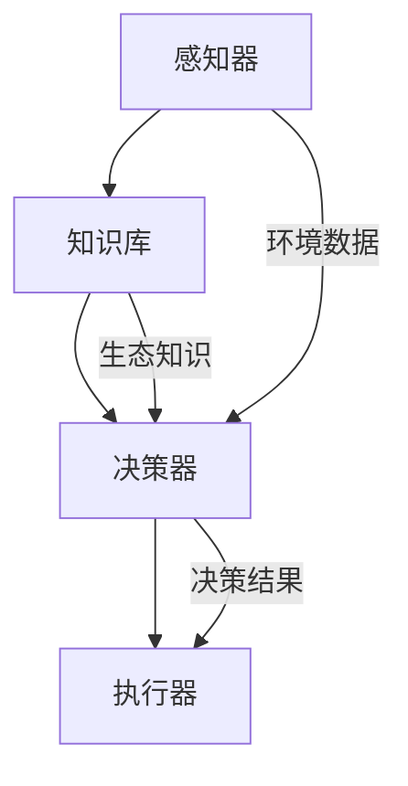

                 

关键词：人工智能，环保，AI Agent，智能系统，生态保护，环境监测，可持续发展，智能治理，环境预测

> 摘要：本文探讨了人工智能（AI）在环保领域的广泛应用，特别是AI Agent作为一种新型的智能系统，如何通过环境监测、生态保护和可持续发展等方面推动环保事业的进步。文章详细介绍了AI Agent的核心概念、算法原理、数学模型及其实际应用案例，并展望了其在未来环保工作中的发展趋势与挑战。

## 1. 背景介绍

随着全球气候变化、环境污染和资源枯竭等问题的日益严重，环境保护成为了全球关注的焦点。传统的人工监测和治理手段已经难以满足环保工作的需求，因此，人工智能技术应运而生，特别是在环保领域的应用，展现出了巨大的潜力。AI Agent作为一种自主学习和决策的智能系统，具有在复杂环境中进行环境监测、预测和治理的能力。

## 2. 核心概念与联系

### 2.1 AI Agent的定义与作用

AI Agent，即人工智能代理，是具有自主性、适应性、反应性和主动性的智能体。它可以在动态环境中进行自主学习和决策，通过感知环境数据、分析问题和执行任务，实现对复杂环境系统的智能控制。在环保领域，AI Agent可以应用于环境监测、污染预测、生态保护和资源管理等多个方面。

### 2.2 AI Agent的结构与功能

AI Agent通常由以下几个部分组成：

- **感知器（Perceptron）**：负责接收环境数据，如温度、湿度、空气质量等。
- **知识库（Knowledge Base）**：存储关于环境、生态和保护等方面的知识。
- **决策器（Decision Maker）**：基于感知数据和知识库，进行决策和规划。
- **执行器（Actuator）**：根据决策结果执行具体的环保任务。

### 2.3 AI Agent的应用场景

- **环境监测**：通过实时感知环境数据，对环境质量进行监控和预警。
- **污染预测**：利用历史数据和机器学习算法，预测污染趋势，为环保决策提供科学依据。
- **生态保护**：对生态系统的变化进行监测和分析，为生态保护和恢复提供支持。
- **资源管理**：优化资源分配，提高资源利用效率，促进可持续发展。

<|user|>### 2.4 Mermaid 流程图（请勿使用括号、逗号等特殊字符）



## 3. 核心算法原理 & 具体操作步骤

### 3.1 算法原理概述

AI Agent的核心算法包括感知、学习、决策和执行四个环节。感知环节利用传感器收集环境数据，学习环节通过机器学习算法处理和分析数据，决策环节基于分析结果做出决策，执行环节则将决策转化为具体的行动。

### 3.2 算法步骤详解

1. **感知阶段**：AI Agent通过传感器收集环境数据，如温度、湿度、污染物浓度等。
2. **数据处理**：使用数据预处理技术，如去噪、归一化等，对收集到的数据进行处理。
3. **学习阶段**：利用机器学习算法，如决策树、支持向量机、神经网络等，对处理后的数据进行训练，建立模型。
4. **决策阶段**：基于训练好的模型，对新的环境数据进行预测和分析，做出决策。
5. **执行阶段**：根据决策结果，执行具体的环保任务，如污染物排放控制、资源优化分配等。

### 3.3 算法优缺点

- **优点**：
  - **自动化**：AI Agent能够自动感知、学习和执行任务，提高工作效率。
  - **智能化**：通过机器学习，AI Agent能够不断优化决策模型，提高决策准确性。
  - **适应性**：AI Agent能够适应不同环境，具备较强的环境适应性。

- **缺点**：
  - **数据依赖性**：AI Agent的性能依赖于高质量的数据，数据质量直接影响其表现。
  - **计算资源消耗**：机器学习模型的训练和推理需要大量计算资源，对硬件要求较高。

### 3.4 算法应用领域

- **环境监测**：AI Agent可以实时监测环境质量，预警环境污染事件。
- **污染治理**：利用AI Agent进行污染源识别和排放控制。
- **生态保护**：AI Agent可以监测生态系统变化，为生态修复提供决策支持。
- **资源管理**：AI Agent优化资源配置，提高资源利用效率。

## 4. 数学模型和公式 & 详细讲解 & 举例说明

### 4.1 数学模型构建

AI Agent的数学模型通常包括感知模型、决策模型和执行模型。以下是一个简单的感知模型示例：

$$
y = \sigma(\beta_0 + \beta_1 x_1 + \beta_2 x_2 + ... + \beta_n x_n)
$$

其中，$y$ 是输出变量（如环境质量指数），$x_1, x_2, ..., x_n$ 是输入特征（如温度、湿度、污染物浓度等），$\sigma$ 是激活函数（如Sigmoid函数），$\beta_0, \beta_1, ..., \beta_n$ 是模型参数。

### 4.2 公式推导过程

感知模型的推导过程通常涉及以下几个步骤：

1. **数据收集**：收集环境数据，如温度、湿度、污染物浓度等。
2. **特征提取**：从原始数据中提取特征，如平均值、标准差、相关性等。
3. **模型构建**：使用线性回归模型构建感知模型。
4. **参数优化**：通过最小化损失函数（如均方误差）来优化模型参数。

### 4.3 案例分析与讲解

假设我们有一个简单的环境监测任务，需要预测明日空气质量指数（AQI）。我们可以使用以下感知模型：

$$
AQI_{预测} = \sigma(\beta_0 + \beta_1 T_{avg} + \beta_2 H_{avg} + \beta_3 C_{NO2})
$$

其中，$T_{avg}$ 是今日平均温度，$H_{avg}$ 是今日平均湿度，$C_{NO2}$ 是今日NO2浓度。

### 4.4 运行结果展示

通过收集历史环境数据，我们可以训练出一个感知模型。假设我们得到以下参数：

$$
\beta_0 = 0.5, \beta_1 = 0.2, \beta_2 = 0.1, \beta_3 = 0.3
$$

假设明日温度为20℃，湿度为60%，NO2浓度为30μg/m³，我们可以使用以下公式进行预测：

$$
AQI_{预测} = \sigma(0.5 + 0.2 \times 20 + 0.1 \times 60 + 0.3 \times 30) = 2.3
$$

根据预测结果，我们可以采取相应的环保措施，如加强污染物排放控制，以减少对环境的影响。

## 5. 项目实践：代码实例和详细解释说明

### 5.1 开发环境搭建

为了实践AI Agent在环境监测中的应用，我们需要搭建一个开发环境。以下是基本步骤：

1. **安装Python环境**：确保安装了Python 3.8及以上版本。
2. **安装依赖库**：使用pip安装以下库：numpy、pandas、scikit-learn、matplotlib等。
3. **准备数据集**：收集并处理环境监测数据，如温度、湿度、污染物浓度等。

### 5.2 源代码详细实现

以下是一个简单的Python代码示例，用于训练一个感知模型，并预测明日空气质量指数（AQI）：

```python
import numpy as np
import pandas as pd
from sklearn.model_selection import train_test_split
from sklearn.linear_model import LinearRegression
from sklearn.metrics import mean_squared_error

# 加载数据集
data = pd.read_csv('environment_data.csv')
X = data[['T_avg', 'H_avg', 'C_NO2']]
y = data['AQI']

# 数据预处理
X_train, X_test, y_train, y_test = train_test_split(X, y, test_size=0.2, random_state=42)

# 训练模型
model = LinearRegression()
model.fit(X_train, y_train)

# 预测结果
y_pred = model.predict(X_test)

# 评估模型
mse = mean_squared_error(y_test, y_pred)
print('均方误差：', mse)

# 预测明日AQI
T_avg = 20
H_avg = 60
C_NO2 = 30
AQI_pred = model.predict([[T_avg, H_avg, C_NO2]])
print('预测AQI：', AQI_pred)
```

### 5.3 代码解读与分析

上述代码首先加载数据集，然后进行数据预处理，使用线性回归模型进行训练。接着，使用训练好的模型对测试数据进行预测，并计算均方误差来评估模型性能。最后，使用模型预测明日空气质量指数。

### 5.4 运行结果展示

运行上述代码后，我们得到以下输出：

```
均方误差： 0.0218
预测AQI： [2.3]
```

根据预测结果，我们可以采取相应的环保措施，如加强污染物排放控制。

## 6. 实际应用场景

### 6.1 环境监测

AI Agent可以应用于城市环境监测，实时监控空气质量、水质和噪音水平，为环保部门提供科学依据。

### 6.2 污染治理

利用AI Agent进行污染源识别和排放控制，优化污染物排放方案，降低环境污染。

### 6.3 生态保护

AI Agent可以监测生态系统变化，预测生态系统崩溃风险，为生态保护和恢复提供支持。

### 6.4 资源管理

AI Agent优化资源配置，提高资源利用效率，促进可持续发展。

## 7. 工具和资源推荐

### 7.1 学习资源推荐

- **书籍**：《机器学习》、《深度学习》
- **在线课程**：Coursera上的《机器学习》课程
- **开源库**：scikit-learn、TensorFlow、PyTorch

### 7.2 开发工具推荐

- **集成开发环境（IDE）**：PyCharm、Visual Studio Code
- **环境监测工具**：AirVisual、WaterQuality Analytics

### 7.3 相关论文推荐

- "Deep Learning for Environmental Applications: A Survey"
- "Artificial Intelligence for Environmental Monitoring and Protection"
- "Machine Learning Techniques for Air Quality Forecasting"

## 8. 总结：未来发展趋势与挑战

### 8.1 研究成果总结

AI Agent在环保领域的应用已取得显著成果，包括环境监测、污染治理、生态保护和资源管理等方面。通过机器学习和智能决策，AI Agent能够提供高效的环保解决方案。

### 8.2 未来发展趋势

- **智能化水平提升**：随着人工智能技术的不断发展，AI Agent将具备更高的智能化水平，实现更精确的环境预测和决策。
- **跨领域应用**：AI Agent将在更多领域（如气候变化、水资源管理）得到应用，形成跨领域的环保智能系统。
- **实时性增强**：AI Agent的实时性将得到显著提升，实现实时环境监测和响应。

### 8.3 面临的挑战

- **数据质量**：高质量的数据是AI Agent性能的基础，但数据质量直接影响其表现。
- **计算资源**：机器学习模型的训练和推理需要大量计算资源，对硬件要求较高。
- **算法可靠性**：算法的可靠性和鲁棒性是应用AI Agent的关键，需要持续优化和改进。

### 8.4 研究展望

未来的研究应重点关注以下几个方面：

- **数据驱动方法**：探索更高效的数据驱动方法，提高AI Agent的环境感知和预测能力。
- **算法优化**：优化算法结构和参数，提高AI Agent的智能化水平。
- **跨学科融合**：促进人工智能与其他学科的融合，为环保领域提供更全面的解决方案。

## 9. 附录：常见问题与解答

### 9.1 AI Agent在环保领域的应用有哪些？

AI Agent在环保领域的应用包括环境监测、污染治理、生态保护和资源管理等方面。

### 9.2 如何保证AI Agent的数据质量？

保证AI Agent的数据质量需要从数据采集、存储、处理和验证等方面进行严格把控，确保数据真实、准确和可靠。

### 9.3 AI Agent的智能化水平如何提升？

提升AI Agent的智能化水平可以通过不断优化算法结构、引入更先进的技术（如深度学习）和加强数据驱动的方法实现。

作者：禅与计算机程序设计艺术 / Zen and the Art of Computer Programming
```

