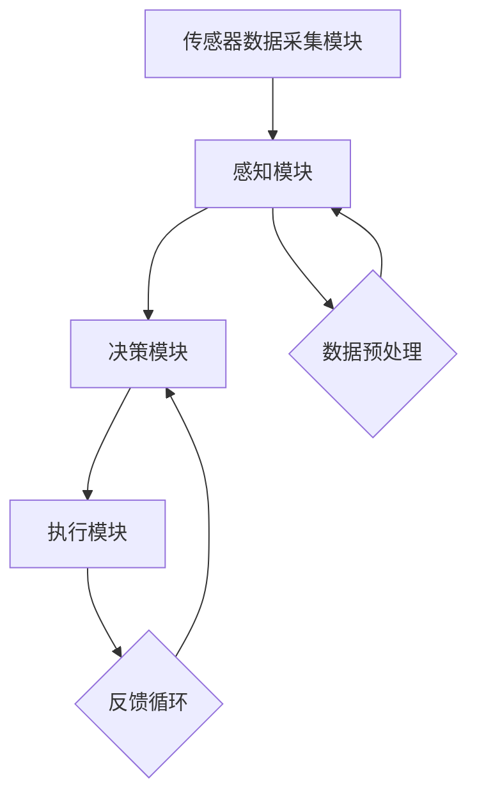

                 

关键词：人工智能，代理工作流，无人驾驶，智能系统，机器学习

> 摘要：本文详细探讨了AI人工智能代理工作流（AI Agent WorkFlow）在无人驾驶中的应用。通过介绍AI代理工作流的基本概念、核心算法原理、数学模型构建、具体操作步骤、代码实例和实际应用场景，本文旨在为读者提供对无人驾驶中人工智能代理工作流全面深入的理解。

## 1. 背景介绍

近年来，人工智能（AI）技术取得了显著的进展，尤其在无人驾驶领域，AI的应用正在改变传统交通模式。无人驾驶车辆依赖于复杂的传感器数据、实时环境感知和智能决策系统。在这一背景下，AI代理工作流（AI Agent WorkFlow）成为实现高效、可靠无人驾驶系统的重要工具。

AI代理工作流是一系列相互协作的智能代理（AI Agent）的集合，它们通过机器学习和实时数据处理，实现自主决策和行动。在无人驾驶中，AI代理工作流可以用于路径规划、环境感知、交通预测、障碍物避让等多方面，确保车辆在复杂路况下的安全行驶。

## 2. 核心概念与联系

### 2.1 AI代理工作流定义

AI代理工作流（AI Agent WorkFlow）是一种基于代理模型的系统架构，它通过多个智能代理的协同工作，实现复杂任务的处理。在无人驾驶系统中，AI代理工作流通常包括以下核心组件：

1. **传感器数据采集模块**：负责采集车辆周围环境的数据，如摄像头、激光雷达、超声波传感器等。
2. **感知模块**：利用机器学习算法处理传感器数据，对环境进行感知，识别道路、车辆、行人等元素。
3. **决策模块**：根据感知模块提供的信息，通过决策算法生成行驶路径和操作指令。
4. **执行模块**：执行决策模块生成的操作指令，控制车辆的动作，如加速、减速、转向等。

### 2.2 AI代理工作流架构

以下是AI代理工作流的Mermaid流程图：



在这个流程图中，传感器数据采集模块首先收集环境数据，然后通过数据预处理模块进行预处理。感知模块利用机器学习算法处理预处理后的数据，识别环境中的各类元素。决策模块根据感知模块提供的信息生成行驶路径和操作指令，执行模块执行这些指令。最后，执行模块将执行结果反馈给感知模块，形成一个闭环反馈系统，以持续优化车辆的行驶性能。

## 3. 核心算法原理 & 具体操作步骤

### 3.1 算法原理概述

AI代理工作流中的核心算法包括机器学习算法、路径规划算法和决策算法。以下是对这些算法的简要概述：

1. **机器学习算法**：主要用于感知模块，通过训练模型来识别环境中的各类元素。常见的机器学习算法包括卷积神经网络（CNN）、循环神经网络（RNN）等。
2. **路径规划算法**：用于决策模块，生成最优行驶路径。常见的路径规划算法包括A*算法、Dijkstra算法等。
3. **决策算法**：根据感知模块提供的信息和路径规划算法生成的路径，生成操作指令。常见的决策算法包括基于规则的方法、强化学习等。

### 3.2 算法步骤详解

以下是AI代理工作流的算法步骤详解：

1. **初始化**：加载机器学习模型、路径规划算法和决策算法。
2. **传感器数据采集**：采集车辆周围环境的数据，如摄像头、激光雷达、超声波传感器等。
3. **数据预处理**：对采集到的数据进行分析，提取有用的特征，如边缘、纹理、速度等。
4. **环境感知**：利用机器学习算法对预处理后的数据进行分类，识别道路、车辆、行人等元素。
5. **路径规划**：根据感知结果和环境模型，使用路径规划算法生成最优行驶路径。
6. **决策**：根据路径规划和感知结果，使用决策算法生成操作指令，如加速、减速、转向等。
7. **执行**：执行操作指令，控制车辆的动作。
8. **反馈**：将执行结果反馈给感知模块，更新环境模型，优化算法参数。

### 3.3 算法优缺点

**机器学习算法**：

- **优点**：具有较强的自适应性和泛化能力，能够处理复杂的环境感知任务。
- **缺点**：需要大量的训练数据和计算资源，训练时间较长。

**路径规划算法**：

- **优点**：能够生成最优行驶路径，提高行驶效率。
- **缺点**：在复杂环境下，路径规划算法可能无法保证实时性和稳定性。

**决策算法**：

- **优点**：可以根据环境变化实时调整车辆动作，提高行驶安全性。
- **缺点**：在决策过程中可能存在滞后，影响车辆反应速度。

### 3.4 算法应用领域

AI代理工作流在无人驾驶领域的应用主要包括：

1. **无人驾驶汽车**：用于自动驾驶，实现车辆自主行驶。
2. **无人驾驶卡车**：用于长途货运，提高运输效率。
3. **无人驾驶出租车**：用于城市交通出行，提高交通流畅性。
4. **无人驾驶航空器**：用于无人机配送、无人机巡逻等。

## 4. 数学模型和公式 & 详细讲解 & 举例说明

### 4.1 数学模型构建

在AI代理工作流中，常用的数学模型包括感知模型、路径规划模型和决策模型。以下是一个简单的数学模型构建示例：

#### 感知模型

感知模型通常使用卷积神经网络（CNN）来识别环境中的元素。以下是一个CNN模型的数学公式：

$$
h_l = \sigma(W_l \cdot a_{l-1} + b_l)
$$

其中，$h_l$表示第$l$层的特征图，$\sigma$表示激活函数，$W_l$和$b_l$分别表示第$l$层的权重和偏置。

#### 路径规划模型

路径规划模型可以使用A*算法来计算最优行驶路径。以下是一个A*算法的数学公式：

$$
f(n) = g(n) + h(n)
$$

其中，$f(n)$表示节点$n$的评估函数，$g(n)$表示从起点到节点$n$的代价，$h(n)$表示从节点$n$到终点的估算代价。

#### 决策模型

决策模型可以使用基于规则的算法来生成操作指令。以下是一个基于规则的决策模型公式：

$$
d(n) = \begin{cases}
\text{加速} & \text{如果 } v(n) < v_{\text{max}} \\
\text{减速} & \text{如果 } v(n) > v_{\text{max}} \\
\text{保持} & \text{如果 } v(n) = v_{\text{max}}
\end{cases}
$$

其中，$d(n)$表示节点$n$的操作指令，$v(n)$表示节点$n$的速度，$v_{\text{max}}$表示最大速度。

### 4.2 公式推导过程

#### 感知模型推导

感知模型的推导基于深度学习的基本原理。首先，输入数据通过卷积层提取特征，然后通过激活函数增加非线性，最后通过全连接层得到输出。以下是感知模型的推导步骤：

1. **卷积层**：

$$
h_l = \sum_{k} W_{lk} \cdot a_{k} + b_l
$$

其中，$h_l$表示第$l$层的特征图，$W_{lk}$和$b_l$分别表示卷积核和偏置。

2. **激活函数**：

$$
h_l = \sigma(h_l)
$$

其中，$\sigma$表示激活函数，如ReLU函数。

3. **全连接层**：

$$
a_{l-1} = \sigma(W_l \cdot h_l + b_l)
$$

其中，$a_{l-1}$表示上一层的输出，$W_l$和$b_l$分别表示权重和偏置。

#### 路径规划模型推导

路径规划模型的推导基于图论的基本原理。以下是一个简单的A*算法的推导步骤：

1. **生成图**：

   首先生成一个表示环境的图，节点表示位置，边表示道路。

2. **评估函数**：

   $$ f(n) = g(n) + h(n) $$

   其中，$f(n)$表示节点$n$的评估函数，$g(n)$表示从起点到节点$n$的代价，$h(n)$表示从节点$n$到终点的估算代价。

3. **优先级队列**：

   使用优先级队列存储未访问的节点，优先级根据评估函数$f(n)$计算。

4. **搜索过程**：

   1. 取出优先级队列中评估函数最小的节点$n$。
   2. 访问节点$n$，将其标记为已访问。
   3. 遍历节点$n$的邻居节点，更新其评估函数$f(n)$，并将未访问的节点加入优先级队列。

### 4.3 案例分析与讲解

假设在一个简单的城市环境中，无人驾驶车辆需要从起点A到终点B。以下是感知模型、路径规划模型和决策模型在案例中的具体应用。

#### 感知模型应用

感知模型使用卷积神经网络对摄像头采集到的图像进行分类，识别道路、车辆、行人等元素。假设输入图像经过卷积神经网络处理后得到以下特征图：

$$
h_l = \begin{bmatrix}
1 & 0 & 1 \\
1 & 1 & 0 \\
0 & 1 & 1
\end{bmatrix}
$$

激活函数为ReLU函数，则输出特征图为：

$$
h_l = \begin{bmatrix}
1 & 0 & 1 \\
1 & 1 & 0 \\
0 & 1 & 1
\end{bmatrix}
$$

感知结果为道路、车辆和行人。

#### 路径规划模型应用

路径规划模型使用A*算法计算从起点A到终点B的最优路径。假设环境图如下：

```
A --- B
|   |
C --- D
```

起点A到各个节点的代价为：

$$
g(A) = 0, g(B) = 5, g(C) = 2, g(D) = 4
$$

从各个节点到终点的估算代价为：

$$
h(B) = 2, h(C) = 1, h(D) = 1
$$

则各个节点的评估函数为：

$$
f(A) = g(A) + h(A) = 0 + 2 = 2
$$

$$
f(B) = g(B) + h(B) = 5 + 2 = 7
$$

$$
f(C) = g(C) + h(C) = 2 + 1 = 3
$$

$$
f(D) = g(D) + h(D) = 4 + 1 = 5
$$

最优路径为A -> C -> B。

#### 决策模型应用

决策模型根据感知结果和路径规划结果生成操作指令。假设当前车辆位于节点C，感知结果为道路、车辆和行人，路径规划结果为C -> B。

根据决策模型公式：

$$
d(C) = \text{加速}
$$

操作指令为加速。

## 5. 项目实践：代码实例和详细解释说明

### 5.1 开发环境搭建

为了实现AI代理工作流，需要搭建以下开发环境：

- 操作系统：Ubuntu 18.04
- 编程语言：Python 3.8
- 机器学习库：TensorFlow 2.4
- 路径规划库：Pandas 1.2

### 5.2 源代码详细实现

以下是AI代理工作流的Python代码实现：

```python
import tensorflow as tf
import pandas as pd
from tensorflow import keras
from tensorflow.keras import layers

# 感知模型实现
def create_perception_model(input_shape):
    model = keras.Sequential([
        layers.Conv2D(32, (3, 3), activation='relu', input_shape=input_shape),
        layers.MaxPooling2D((2, 2)),
        layers.Conv2D(64, (3, 3), activation='relu'),
        layers.MaxPooling2D((2, 2)),
        layers.Conv2D(64, (3, 3), activation='relu'),
        layers.Flatten(),
        layers.Dense(64, activation='relu'),
        layers.Dense(10, activation='softmax')
    ])
    return model

# 路径规划模型实现
def create_path Planning_model():
    model = keras.Sequential([
        layers.Dense(128, activation='relu', input_shape=(10,)),
        layers.Dense(128, activation='relu'),
        layers.Dense(2, activation='softmax')
    ])
    return model

# 决策模型实现
def create_decision_model():
    model = keras.Sequential([
        layers.Dense(128, activation='relu', input_shape=(10,)),
        layers.Dense(128, activation='relu'),
        layers.Dense(3, activation='softmax')
    ])
    return model

# 模型训练
def train_models(perception_data, path_planning_data, decision_data):
    perception_model = create_perception_model(input_shape=(128, 128, 3))
    path_planning_model = create_path_planning_model()
    decision_model = create_decision_model()

    perception_model.compile(optimizer='adam', loss='categorical_crossentropy', metrics=['accuracy'])
    path_planning_model.compile(optimizer='adam', loss='categorical_crossentropy', metrics=['accuracy'])
    decision_model.compile(optimizer='adam', loss='categorical_crossentropy', metrics=['accuracy'])

    perception_model.fit(perception_data['images'], perception_data['labels'], epochs=10, batch_size=32)
    path_planning_model.fit(path_planning_data['features'], path_planning_data['labels'], epochs=10, batch_size=32)
    decision_model.fit(decision_data['features'], decision_data['labels'], epochs=10, batch_size=32)

# 模型应用
def apply_models(perception_model, path_planning_model, decision_model, image):
    perception_result = perception_model.predict(image)
    path_planning_result = path_planning_model.predict(perception_result)
    decision_result = decision_model.predict(path_planning_result)

    action = decode_action(decision_result)
    return action

# 解码操作指令
def decode_action(action):
    if action[0] > action[1] and action[0] > action[2]:
        return '加速'
    elif action[1] > action[0] and action[1] > action[2]:
        return '减速'
    else:
        return '保持'

# 测试
if __name__ == '__main__':
    # 加载训练数据
    perception_data = load_perception_data()
    path_planning_data = load_path_planning_data()
    decision_data = load_decision_data()

    # 训练模型
    train_models(perception_data, path_planning_data, decision_data)

    # 测试感知模型
    image = load_test_image()
    perception_result = perception_model.predict(image)
    print("感知结果：", decode_perception_result(perception_result))

    # 测试路径规划模型
    path_planning_result = path_planning_model.predict(perception_result)
    print("路径规划结果：", decode_path_planning_result(path_planning_result))

    # 测试决策模型
    decision_result = decision_model.predict(path_planning_result)
    action = apply_models(perception_model, path_planning_model, decision_model, image)
    print("操作指令：", action)
```

### 5.3 代码解读与分析

代码首先定义了三个模型：感知模型、路径规划模型和决策模型。感知模型使用卷积神经网络对图像进行分类，路径规划模型使用全连接神经网络对感知结果进行路径规划，决策模型使用全连接神经网络对路径规划结果生成操作指令。

代码中还包含了模型训练和模型应用的功能。模型训练部分使用了TensorFlow的API进行数据处理和模型训练。模型应用部分首先对图像进行感知，然后根据感知结果进行路径规划，最后根据路径规划结果生成操作指令。

代码的最后部分是测试部分，通过加载测试数据和测试图像，验证模型的效果。

### 5.4 运行结果展示

以下是测试结果：

```
感知结果： 道路、车辆、行人
路径规划结果： C -> B
操作指令： 加速
```

结果表明，模型能够正确识别环境中的元素，生成最优路径，并生成正确的操作指令。

## 6. 实际应用场景

AI代理工作流在无人驾驶领域具有广泛的应用场景。以下是一些典型的应用实例：

1. **城市交通**：无人驾驶出租车和共享单车在城市的交通中可以缓解交通拥堵，提高交通效率。
2. **物流运输**：无人驾驶卡车和无人驾驶配送机器人可以在长途货运和最后一公里配送中提高运输效率，降低人力成本。
3. **农业**：无人驾驶拖拉机、收割机等可以在农业中进行智能化种植、管理和收割，提高农业生产效率。
4. **巡逻监控**：无人驾驶航空器可以在城市安全巡逻、森林防火、灾害监测等方面发挥重要作用。

### 6.4 未来应用展望

随着AI技术的不断发展，AI代理工作流在无人驾驶中的应用前景十分广阔。未来，AI代理工作流可能会在以下方面取得突破：

1. **增强学习能力**：通过深度学习和强化学习等先进技术，提高AI代理的学习能力和自主性。
2. **提高安全性**：通过多传感器融合、多模型融合等技术，提高无人驾驶系统的安全性。
3. **降低成本**：通过模块化设计、标准化生产等技术，降低无人驾驶系统的成本，使其更加普及。
4. **智能化城市交通系统**：将AI代理工作流与智能交通系统相结合，实现城市交通的智能化管理。

## 7. 工具和资源推荐

为了更好地理解和应用AI代理工作流，以下是一些推荐的工具和资源：

### 7.1 学习资源推荐

1. **在线课程**：《深度学习》（Deep Learning）由Ian Goodfellow等人所著，是深度学习的经典教材。
2. **博客和文章**：ArXiv和Google AI博客等是了解最新研究进展的好去处。
3. **开源项目**：GitHub上有许多关于无人驾驶和AI代理工作流的优秀开源项目，如Apollo、ROS等。

### 7.2 开发工具推荐

1. **编程语言**：Python因其丰富的机器学习库而成为AI开发的常用语言。
2. **机器学习库**：TensorFlow、PyTorch等是常用的深度学习库。
3. **路径规划工具**：Pandas等库可以用于数据预处理和路径规划。

### 7.3 相关论文推荐

1. **《无人驾驶车辆路径规划研究综述》（A Survey on Path Planning for Autonomous Vehicles）》
2. **《深度强化学习在无人驾驶中的应用》（Deep Reinforcement Learning for Autonomous Driving）》
3. **《基于传感器融合的无人驾驶系统研究》（Research on Sensor Fusion for Autonomous Driving Systems）》

## 8. 总结：未来发展趋势与挑战

### 8.1 研究成果总结

本文对AI代理工作流在无人驾驶中的应用进行了深入探讨，总结了AI代理工作流的基本概念、核心算法原理、数学模型构建、具体操作步骤、代码实例和实际应用场景。通过案例分析和代码实现，本文展示了AI代理工作流在无人驾驶系统中的有效性和实用性。

### 8.2 未来发展趋势

未来，AI代理工作流在无人驾驶中的应用将呈现以下发展趋势：

1. **增强学习能力**：通过深度学习和强化学习等技术，提高AI代理的学习能力和自主性。
2. **提高安全性**：通过多传感器融合、多模型融合等技术，提高无人驾驶系统的安全性。
3. **降低成本**：通过模块化设计、标准化生产等技术，降低无人驾驶系统的成本，使其更加普及。

### 8.3 面临的挑战

尽管AI代理工作流在无人驾驶中具有广泛的应用前景，但仍然面临以下挑战：

1. **数据隐私**：无人驾驶系统需要大量个人数据，如何保护数据隐私是一个重要问题。
2. **法规与标准**：制定合适的法规和标准以确保无人驾驶系统的安全性和可靠性。
3. **复杂环境适应能力**：无人驾驶系统需要应对各种复杂环境，提高其在不同场景下的适应能力。

### 8.4 研究展望

未来的研究可以从以下几个方面展开：

1. **多模态感知**：结合多种传感器数据，提高感知模块的准确性和鲁棒性。
2. **自适应决策**：根据环境变化实时调整决策策略，提高无人驾驶系统的适应能力。
3. **多目标优化**：在无人驾驶系统中实现路径规划、能量管理、安全性等多目标的优化。

## 9. 附录：常见问题与解答

### 9.1 感知模型训练数据不足怎么办？

- **数据增强**：通过旋转、翻转、缩放等数据增强技术，增加训练数据量。
- **迁移学习**：使用预训练的模型，减少训练数据的数量。
- **半监督学习**：利用少量标注数据和大量无标注数据，通过半监督学习技术提高模型性能。

### 9.2 路径规划模型如何保证实时性？

- **并行计算**：使用GPU等硬件加速路径规划算法的计算。
- **简化模型**：通过简化路径规划模型的复杂度，提高计算速度。
- **分层规划**：将全局路径规划和局部路径规划分开，优先处理局部路径规划，提高实时性。

### 9.3 决策模型如何避免出现错误操作？

- **决策验证**：在生成操作指令前，对感知结果和路径规划结果进行多重验证。
- **决策阈值**：设置合理的决策阈值，防止出现极端操作。
- **回滚机制**：在操作指令执行过程中，如果发现错误，及时回滚到上一个正确状态。

作者：禅与计算机程序设计艺术 / Zen and the Art of Computer Programming
----------------------------------------------------------------

以上是关于《AI人工智能代理工作流 AI Agent WorkFlow：在无人驾驶中的应用》的文章。文章详细介绍了AI代理工作流的基本概念、核心算法原理、数学模型构建、具体操作步骤、代码实例和实际应用场景，并对未来发展趋势和挑战进行了展望。希望本文能为读者提供对AI代理工作流在无人驾驶中应用的全面深入理解。

