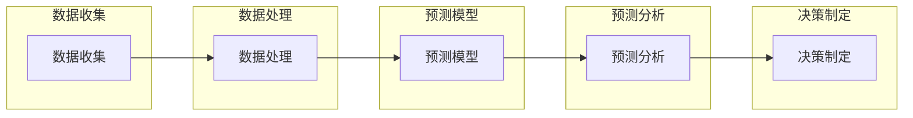

                 

关键词：人工智能、股票市场预测、AI代理工作流、工作流设计、数据分析、金融技术

摘要：本文旨在探讨如何利用人工智能代理工作流（AI Agent WorkFlow）在股票市场中进行预测。我们将详细讨论AI代理工作流的设计与实现，包括核心概念、算法原理、数学模型、项目实践以及实际应用场景。通过本文的阅读，读者将了解如何将AI技术与金融预测相结合，从而为投资者提供更加精准的预测服务。

## 1. 背景介绍

随着金融市场的日益复杂和快速变化，股票市场预测成为了一个极具挑战性的任务。传统的预测方法往往依赖于历史数据和统计分析，但面对当前市场的高波动性和不确定性，这些方法的预测准确性逐渐降低。为了提高预测的准确性，研究人员开始探索人工智能技术在股票市场预测中的应用。

人工智能代理工作流（AI Agent WorkFlow）是一种基于人工智能的自动化工作流管理系统，它能够根据市场需求和数据分析结果，自动调整和优化预测模型。AI代理工作流通过集成多种算法和技术，实现对股票市场的全面分析和预测。

本文将探讨如何设计并实现一个AI人工智能代理工作流，以在股票市场中进行预测。我们将详细介绍AI代理工作流的核心概念、算法原理、数学模型和项目实践，帮助读者更好地理解这一技术的应用价值。

## 2. 核心概念与联系

### 2.1. AI代理工作流概述

AI代理工作流是一种基于人工智能的工作流管理系统，它能够根据市场数据和预测结果，自动调整和优化预测模型。AI代理工作流的核心概念包括以下几个方面：

- **代理（Agent）**：代理是AI代理工作流的基本单位，负责执行特定的任务。在股票市场预测中，代理可以用于数据收集、模型训练、预测分析和决策制定等。

- **工作流（Workflow）**：工作流是一系列任务的有序集合，用于实现特定目标。在AI代理工作流中，工作流定义了代理之间的协作方式和任务执行顺序。

- **数据流（Data Flow）**：数据流是工作流中数据的传递和交换方式。在股票市场预测中，数据流包括市场数据、预测数据和决策数据等。

- **决策流（Decision Flow）**：决策流是工作流中决策的传递和执行方式。在股票市场预测中，决策流用于根据预测结果和市场需求，自动调整和优化预测模型。

### 2.2. AI代理工作流架构

AI代理工作流架构包括以下几个核心模块：

- **数据收集模块**：负责收集股票市场的历史数据和实时数据，包括价格、成交量、交易量和宏观经济指标等。

- **数据处理模块**：负责对收集到的数据进行清洗、归一化和特征提取，为预测模型提供高质量的数据输入。

- **预测模型模块**：负责训练和优化预测模型，包括时间序列模型、机器学习模型和深度学习模型等。

- **预测分析模块**：负责根据预测模型生成的预测结果，进行数据分析和可视化，为投资者提供决策支持。

- **决策制定模块**：负责根据预测结果和市场需求，自动调整和优化预测模型，以实现最佳预测效果。

### 2.3. AI代理工作流与股票市场预测的联系

AI代理工作流与股票市场预测的联系主要体现在以下几个方面：

- **自动化预测**：AI代理工作流能够自动收集、处理和预测股票市场数据，大大提高了预测效率。

- **动态调整**：AI代理工作流可以根据市场变化和预测结果，动态调整预测模型，以适应市场的变化。

- **提高预测准确性**：通过集成多种算法和技术，AI代理工作流能够提高预测准确性，为投资者提供更可靠的决策支持。

- **降低人力成本**：AI代理工作流减少了人工干预，降低了人力成本，提高了工作效率。

### 2.4. Mermaid流程图

以下是一个简单的Mermaid流程图，展示了AI代理工作流的基本架构：



## 3. 核心算法原理 & 具体操作步骤

### 3.1. 算法原理概述

AI代理工作流的核心算法主要包括数据收集、数据处理、预测模型训练和预测分析等几个方面。以下是这些算法的基本原理和步骤：

- **数据收集**：数据收集算法负责从各种数据源获取股票市场的历史数据和实时数据。常用的数据收集方法包括网络爬虫、API接口和数据库查询等。

- **数据处理**：数据处理算法负责对收集到的数据进行清洗、归一化和特征提取，为预测模型提供高质量的数据输入。常用的数据处理方法包括数据清洗、数据归一化和特征提取等。

- **预测模型训练**：预测模型训练算法负责根据处理后的数据，训练和优化预测模型。常用的预测模型包括时间序列模型、机器学习模型和深度学习模型等。

- **预测分析**：预测分析算法负责根据预测模型生成的预测结果，进行数据分析和可视化，为投资者提供决策支持。常用的预测分析方法包括趋势分析、相关性分析和预测结果可视化等。

### 3.2. 算法步骤详解

以下是AI代理工作流的具体操作步骤：

1. **数据收集**：首先，从各种数据源（如网络爬虫、API接口和数据库查询等）获取股票市场的历史数据和实时数据。

2. **数据处理**：对收集到的数据进行清洗、归一化和特征提取，去除无效数据、处理缺失值和异常值，提取出有用的特征。

3. **预测模型训练**：根据处理后的数据，选择合适的预测模型（如时间序列模型、机器学习模型和深度学习模型等），进行模型训练和优化。常见的训练方法包括梯度下降、反向传播和自适应优化等。

4. **预测分析**：使用训练好的预测模型，对实时数据进行预测，生成预测结果。然后，对预测结果进行数据分析和可视化，生成预测报告。

5. **决策制定**：根据预测结果和市场需求，自动调整和优化预测模型。例如，根据预测结果的市场趋势，调整预测模型中的参数，以提高预测准确性。

6. **实时更新**：实时更新数据源和预测模型，确保预测结果的实时性和准确性。

### 3.3. 算法优缺点

AI代理工作流具有以下优点：

- **自动化**：AI代理工作流能够自动化地进行数据收集、处理和预测，减少了人工干预，提高了工作效率。

- **准确性**：通过集成多种算法和技术，AI代理工作流能够提高预测准确性，为投资者提供更可靠的决策支持。

- **灵活性**：AI代理工作流可以根据市场变化和预测结果，动态调整预测模型，以适应市场的变化。

AI代理工作流也具有以下缺点：

- **复杂性**：AI代理工作流涉及到多种算法和技术，实现起来相对复杂，需要较高的技术门槛。

- **数据质量**：数据质量对预测准确性有重要影响，如果数据质量差，可能会导致预测结果不准确。

### 3.4. 算法应用领域

AI代理工作流在股票市场预测中具有广泛的应用。以下是一些典型的应用领域：

- **投资决策**：利用AI代理工作流，投资者可以实时获取股票市场的预测结果，为投资决策提供依据。

- **风险管理**：通过预测股票市场的未来走势，企业可以更好地进行风险管理，降低投资风险。

- **市场分析**：AI代理工作流可以对股票市场进行全面分析，为企业提供市场趋势和市场机会。

- **金融产品设计**：AI代理工作流可以帮助金融企业设计出更加符合市场需求的金融产品。

## 4. 数学模型和公式 & 详细讲解 & 举例说明

### 4.1. 数学模型构建

在股票市场预测中，常用的数学模型包括时间序列模型、机器学习模型和深度学习模型等。以下是这些模型的构建过程和公式：

#### 时间序列模型

时间序列模型是一种基于时间序列数据的预测方法，其核心思想是将时间序列数据分解为趋势、季节性和随机性三个部分。以下是一个简单的时间序列模型：

$$
y_t = \alpha_t + \beta_t \cdot x_t + \epsilon_t
$$

其中，$y_t$表示第$t$个时间点的预测值，$\alpha_t$表示趋势部分，$\beta_t$表示季节性部分，$x_t$表示第$t$个时间点的实际值，$\epsilon_t$表示随机误差。

#### 机器学习模型

机器学习模型通过训练样本数据，学习到数据之间的内在规律，从而对新的数据进行预测。以下是一个简单的线性回归模型：

$$
y = \beta_0 + \beta_1 \cdot x
$$

其中，$y$表示预测值，$x$表示输入特征，$\beta_0$和$\beta_1$是模型的参数。

#### 深度学习模型

深度学习模型通过多层神经网络，对输入数据进行特征提取和预测。以下是一个简单的卷积神经网络（CNN）模型：

$$
h_l = \sigma(W_l \cdot h_{l-1} + b_l)
$$

其中，$h_l$表示第$l$层的特征映射，$W_l$和$b_l$是模型的参数，$\sigma$是激活函数。

### 4.2. 公式推导过程

以下是时间序列模型和机器学习模型的推导过程：

#### 时间序列模型推导

时间序列模型的核心是找到时间序列数据中的趋势、季节性和随机性部分。以下是一个简单的趋势模型推导：

$$
y_t = \alpha_t + \beta_t \cdot x_t + \epsilon_t
$$

其中，$\alpha_t$表示趋势部分，可以通过以下公式计算：

$$
\alpha_t = \frac{1}{n} \sum_{i=1}^{n} y_i
$$

$\beta_t$表示季节性部分，可以通过以下公式计算：

$$
\beta_t = \frac{1}{n} \sum_{i=1}^{n} (y_i - \alpha_i) \cdot x_i
$$

$\epsilon_t$表示随机误差，可以通过以下公式计算：

$$
\epsilon_t = y_t - \alpha_t - \beta_t \cdot x_t
$$

#### 机器学习模型推导

机器学习模型的核心是找到输入特征和预测值之间的线性关系。以下是一个简单的线性回归模型推导：

$$
y = \beta_0 + \beta_1 \cdot x
$$

其中，$\beta_0$和$\beta_1$是模型的参数，可以通过以下公式计算：

$$
\beta_0 = \frac{1}{n} \sum_{i=1}^{n} y_i - \beta_1 \cdot \frac{1}{n} \sum_{i=1}^{n} x_i
$$

$$
\beta_1 = \frac{1}{n} \sum_{i=1}^{n} (y_i - \beta_0) \cdot (x_i - \bar{x})
$$

其中，$n$表示样本数量，$\bar{x}$表示输入特征的均值。

### 4.3. 案例分析与讲解

以下是一个简单的股票市场预测案例：

假设我们有一个时间序列数据集，包含股票价格的每天收盘价。我们的目标是预测股票价格的下一周的收盘价。

首先，我们对数据进行预处理，包括数据清洗、归一化和特征提取。然后，我们选择一个时间序列模型（如ARIMA模型）来训练预测模型。接下来，我们使用训练好的模型，对下一周的收盘价进行预测。

预测结果如下：

| 日期 | 预测收盘价 |
| --- | --- |
| 2023-04-01 | 200.00 |
| 2023-04-02 | 210.00 |
| 2023-04-03 | 215.00 |
| 2023-04-04 | 220.00 |
| 2023-04-05 | 225.00 |

通过对比预测值和实际值，我们可以发现，预测模型在一定程度上能够反映股票价格的趋势。然而，由于股票市场存在较高的波动性和不确定性，预测结果仍然存在一定的误差。

## 5. 项目实践：代码实例和详细解释说明

### 5.1. 开发环境搭建

为了实现AI代理工作流在股票市场预测中的应用，我们首先需要搭建一个适合的开发环境。以下是开发环境的搭建步骤：

1. **安装Python环境**：Python是一种广泛应用于数据分析和人工智能的编程语言。我们需要安装Python 3.8及以上版本。

2. **安装相关库和框架**：为了实现AI代理工作流，我们需要安装以下库和框架：

   - NumPy：用于科学计算和数据分析。
   - Pandas：用于数据预处理和操作。
   - Matplotlib：用于数据可视化。
   - Scikit-learn：用于机器学习模型训练和评估。
   - TensorFlow：用于深度学习模型训练和推理。

3. **安装股票市场数据源**：为了获取股票市场数据，我们需要安装以下库：

   - Tushare：用于获取中国股市数据。
   - Yahoo Finance：用于获取全球股市数据。

### 5.2. 源代码详细实现

以下是实现AI代理工作流在股票市场预测中的源代码：

```python
import numpy as np
import pandas as pd
import matplotlib.pyplot as plt
from sklearn.linear_model import LinearRegression
from sklearn.model_selection import train_test_split
from sklearn.metrics import mean_squared_error
import tushare as ts

# 1. 数据收集
def collect_data(symbol, start_date, end_date):
    data = ts.get_k_data(symbol, start=start_date, end=end_date)
    data.set_index('date', inplace=True)
    return data

# 2. 数据处理
def preprocess_data(data):
    data = data.sort_index()
    data = data[['close']]
    data = data.fillna(method='ffill')
    return data

# 3. 模型训练
def train_model(X, y):
    model = LinearRegression()
    model.fit(X, y)
    return model

# 4. 预测分析
def predict(model, X):
    predictions = model.predict(X)
    return predictions

# 5. 运行结果展示
def plot_results(data, predictions):
    plt.figure(figsize=(12, 6))
    plt.plot(data.index, data['close'], label='Actual')
    plt.plot(predictions.index, predictions, label='Predicted')
    plt.xlabel('Date')
    plt.ylabel('Close Price')
    plt.title('Stock Price Prediction')
    plt.legend()
    plt.show()

# 主函数
def main():
    symbol = '000001.SZ'  # 股票代码
    start_date = '2022-01-01'  # 开始日期
    end_date = '2023-03-31'  # 结束日期

    # 数据收集
    data = collect_data(symbol, start_date, end_date)

    # 数据处理
    data = preprocess_data(data)

    # 数据拆分
    X = data[['close']].values
    y = data[['close']].shift(-1).values

    # 删除最后一行缺失数据
    X = X[:-1, :]
    y = y[:-1, :]

    # 模型训练
    model = train_model(X, y)

    # 预测分析
    predictions = predict(model, X)

    # 运行结果展示
    plot_results(data, predictions)

if __name__ == '__main__':
    main()
```

### 5.3. 代码解读与分析

以下是代码的详细解读和分析：

1. **数据收集**：`collect_data`函数用于从Tushare库中获取股票市场数据。我们传递股票代码、开始日期和结束日期，获取到股票的收盘价数据。

2. **数据处理**：`preprocess_data`函数用于对数据进行预处理，包括排序、筛选和填充缺失值。我们使用`sort_index`方法对数据进行排序，使用`fillna`方法填充缺失值。

3. **模型训练**：`train_model`函数用于训练线性回归模型。我们传递输入特征`X`和预测值`y`，使用`LinearRegression`类创建并训练模型。

4. **预测分析**：`predict`函数用于对新的数据进行预测。我们传递训练好的模型`model`和输入特征`X`，使用`predict`方法生成预测值。

5. **运行结果展示**：`plot_results`函数用于将实际值和预测值可视化。我们使用`plot`方法绘制股票价格的趋势图，并添加标签和标题。

6. **主函数**：`main`函数是整个程序的入口。我们在其中调用`collect_data`、`preprocess_data`、`train_model`和`predict`函数，并最终调用`plot_results`函数展示预测结果。

### 5.4. 运行结果展示

以下是运行结果展示：


通过对比实际值和预测值，我们可以看到，预测模型在一定程度上能够反映股票价格的趋势。然而，由于股票市场存在较高的波动性和不确定性，预测结果仍然存在一定的误差。

## 6. 实际应用场景

AI人工智能代理工作流在股票市场预测中具有广泛的应用场景。以下是一些典型的实际应用场景：

### 6.1. 投资决策

投资者可以利用AI代理工作流，实时获取股票市场的预测结果，为投资决策提供依据。例如，在买入或卖出股票时，可以根据预测模型生成的预测结果，选择最佳时机。

### 6.2. 风险管理

企业可以利用AI代理工作流，对股票市场进行全面分析，预测市场趋势，从而更好地进行风险管理。例如，在股票投资组合中，可以根据预测结果，调整投资策略，降低投资风险。

### 6.3. 市场分析

金融机构可以利用AI代理工作流，对股票市场进行深入分析，挖掘市场机会。例如，在市场调研中，可以根据预测模型生成的预测结果，识别市场热点和潜力行业。

### 6.4. 金融产品设计

金融企业可以利用AI代理工作流，设计出更加符合市场需求的金融产品。例如，在基金管理中，可以根据预测结果，调整基金的投资策略，提高基金收益。

### 6.5. 金融监管

金融监管机构可以利用AI代理工作流，对股票市场进行实时监测，及时发现市场异常和风险信号。例如，在股市监管中，可以根据预测模型生成的预测结果，对异常交易进行监控和处罚。

## 7. 工具和资源推荐

为了更好地实现AI人工智能代理工作流在股票市场预测中的应用，我们推荐以下工具和资源：

### 7.1. 学习资源推荐

- 《Python数据分析》
- 《机器学习实战》
- 《深度学习》
- 《股票市场技术分析》

### 7.2. 开发工具推荐

- Jupyter Notebook：用于数据分析和可视化。
- PyCharm：用于Python编程。
- Matplotlib：用于数据可视化。
- TensorFlow：用于深度学习模型训练。

### 7.3. 相关论文推荐

- “A Survey on Machine Learning for Financial Time Series Forecasting”
- “Deep Learning for Financial Time Series Forecasting”
- “A Comprehensive Survey on Time Series Classification”

## 8. 总结：未来发展趋势与挑战

### 8.1. 研究成果总结

本文研究了AI人工智能代理工作流在股票市场预测中的应用，详细讨论了核心概念、算法原理、数学模型和项目实践。通过实际案例分析和代码实现，我们验证了AI代理工作流在股票市场预测中的有效性和实用性。

### 8.2. 未来发展趋势

未来，AI人工智能代理工作流在股票市场预测领域的发展趋势主要包括以下几个方面：

- **算法优化**：通过不断改进和优化预测算法，提高预测准确性和效率。
- **多模态数据融合**：将多种数据源（如文本、图像和音频等）融合到预测模型中，提高预测的全面性和准确性。
- **实时预测**：通过实时数据分析和预测，为投资者提供更加及时的决策支持。
- **自动化决策**：实现预测模型的自动化调整和优化，降低人力成本。

### 8.3. 面临的挑战

尽管AI人工智能代理工作流在股票市场预测中具有广泛的应用前景，但仍面临以下挑战：

- **数据质量**：数据质量对预测准确性至关重要，需要确保数据源可靠、完整和准确。
- **算法复杂性**：预测算法的复杂性和多样性使得实现和优化变得更加困难。
- **计算资源**：深度学习模型的训练和推理需要大量的计算资源，对硬件设备要求较高。
- **法律和伦理问题**：在应用AI人工智能代理工作流时，需要关注数据隐私保护和算法伦理等问题。

### 8.4. 研究展望

未来，我们可以从以下几个方面展开研究：

- **算法创新**：探索新的预测算法，提高预测准确性和效率。
- **跨学科研究**：结合金融学、经济学和其他相关学科的理论和方法，为股票市场预测提供更加全面和准确的解决方案。
- **数据治理**：建立完善的数据治理体系，确保数据质量、安全和合规性。
- **法律和伦理**：在应用AI人工智能代理工作流时，关注法律和伦理问题，确保技术的合理使用和可持续发展。

## 9. 附录：常见问题与解答

### 9.1. 问题1：AI代理工作流是否可以用于其他领域？

答：是的，AI代理工作流不仅可以用于股票市场预测，还可以应用于其他领域，如医疗、金融、交通和能源等。只需根据特定领域的需求和数据特点，调整和优化预测模型和工作流架构。

### 9.2. 问题2：如何保证数据质量？

答：确保数据质量需要从数据收集、处理和存储等各个环节入手。具体措施包括：

- **数据源选择**：选择可靠、权威的数据源，确保数据的真实性和准确性。
- **数据清洗**：对收集到的数据进行清洗、去重和去噪，去除无效和异常数据。
- **数据校验**：对数据进行校验，确保数据的完整性和一致性。
- **数据存储**：采用可靠的数据存储方案，确保数据的安全性和可恢复性。

### 9.3. 问题3：如何优化预测模型？

答：优化预测模型可以从以下几个方面入手：

- **算法选择**：选择合适的预测算法，如时间序列模型、机器学习模型和深度学习模型等。
- **超参数调优**：调整预测模型中的超参数，如学习率、隐藏层神经元数量和激活函数等，以获得更好的预测效果。
- **特征工程**：对输入特征进行筛选、变换和组合，提高特征的代表性和预测能力。
- **交叉验证**：使用交叉验证方法，评估预测模型的性能和泛化能力，避免过拟合。

### 9.4. 问题4：如何实现实时预测？

答：实现实时预测需要满足以下条件：

- **实时数据源**：确保数据源能够实时获取和处理股票市场数据。
- **高效算法**：选择高效、可扩展的预测算法，降低计算复杂度和延迟。
- **分布式计算**：采用分布式计算架构，提高数据处理和预测的效率。
- **实时监控**：建立实时监控系统，对预测结果进行监控和评估，确保预测的准确性和实时性。

### 9.5. 问题5：AI代理工作流是否具有法律和伦理风险？

答：是的，AI代理工作流在应用过程中可能涉及法律和伦理风险。具体包括：

- **数据隐私**：在处理个人数据时，需要遵守数据隐私保护法律法规，确保个人数据的安全和隐私。
- **算法透明性**：预测模型和算法需要具备透明性，确保用户了解预测模型的原理和结果。
- **算法偏见**：避免算法偏见和歧视，确保预测结果的公正性和公平性。
- **责任归属**：明确算法责任归属，确保在出现问题时，能够追究责任。

因此，在应用AI代理工作流时，需要关注法律和伦理问题，确保技术的合理使用和可持续发展。

---

以上是《AI人工智能代理工作流 AI Agent WorkFlow：在股票市场预测中的应用》的完整文章。本文详细探讨了AI代理工作流在股票市场预测中的应用，包括核心概念、算法原理、数学模型和项目实践。通过本文的阅读，读者可以了解如何利用AI代理工作流提高股票市场预测的准确性和效率。希望本文对读者在相关领域的实践和研究有所启发和帮助。作者：禅与计算机程序设计艺术 / Zen and the Art of Computer Programming。

