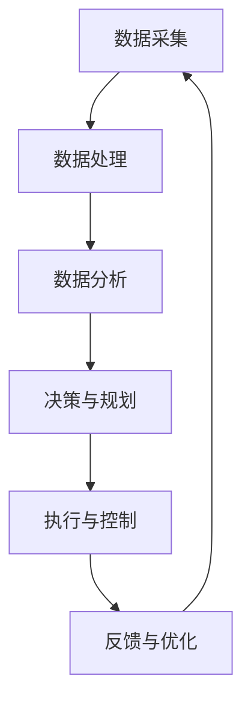

                 

关键词：人工智能，代理，工作流，能源管理，AI Agent WorkFlow

摘要：本文将探讨AI人工智能代理工作流（AI Agent WorkFlow）在能源管理领域的应用。我们将深入分析AI代理工作流的核心概念、原理以及具体实现方法，并通过数学模型和实际项目案例展示其在能源管理中的潜在价值和广阔前景。

## 1. 背景介绍

随着全球能源需求的不断增长和能源危机的日益加剧，能源管理成为各国政府和企业关注的重点。传统的能源管理模式往往依赖于人工监测和干预，效率低下且易出错。而人工智能技术的快速发展为能源管理提供了新的解决方案。AI人工智能代理工作流作为一种新型的智能化管理方式，通过自动化和智能化的工作流程，能够有效提高能源利用效率、降低能源消耗和运营成本。

## 2. 核心概念与联系

### 2.1 AI人工智能代理

AI人工智能代理是指利用人工智能技术实现自主决策和行动的计算机程序。它能够模拟人类的智能行为，通过学习、推理和规划来完成特定的任务。在能源管理中，AI代理可以实时监控能源消耗情况、分析数据并自动调整能源供应，以提高能源利用效率。

### 2.2 工作流

工作流（WorkFlow）是一种组织业务流程的方法，通过定义一系列任务和操作步骤，实现业务流程的自动化和标准化。在AI人工智能代理工作流中，工作流定义了AI代理在能源管理中的具体任务和操作步骤，包括数据采集、分析、决策和执行等环节。

### 2.3 Mermaid 流程图

下面是一个简化的Mermaid流程图，展示了AI人工智能代理工作流的基本架构：



在这个流程图中，A表示数据采集，B表示数据处理，C表示数据分析，D表示决策与规划，E表示执行与控制，F表示反馈与优化。整个流程形成一个闭环，通过不断采集数据、分析数据和调整决策，实现能源管理过程的持续优化。

## 3. 核心算法原理 & 具体操作步骤

### 3.1 算法原理概述

AI人工智能代理工作流的核心算法主要包括数据采集、数据处理、数据分析和决策与规划等环节。其中，数据采集是获取能源消耗数据的基础，数据处理是数据清洗和预处理的重要步骤，数据分析是挖掘数据价值的关键，决策与规划是实现智能化管理的关键环节。

### 3.2 算法步骤详解

#### 3.2.1 数据采集

数据采集是整个工作流的第一步，通过传感器、智能电表等设备，实时获取能源消耗数据。这些数据包括电力、燃气、水等不同类型的能源消耗情况。

#### 3.2.2 数据处理

数据处理主要包括数据清洗和预处理。数据清洗是指去除数据中的噪声和异常值，确保数据的准确性。预处理包括数据标准化、归一化和特征提取等操作，为后续的数据分析做好准备。

#### 3.2.3 数据分析

数据分析是挖掘数据价值的关键环节，通过机器学习、数据挖掘等技术，分析能源消耗数据，发现数据中的模式和规律。这些分析结果可以为决策提供依据。

#### 3.2.4 决策与规划

决策与规划是基于数据分析结果，制定合理的能源供应和调度策略。通过优化算法，确定最佳能源供应时间和方式，以实现能源利用效率的最大化。

#### 3.2.5 执行与控制

执行与控制是根据决策与规划的结果，自动执行能源供应和调度策略。在执行过程中，AI代理会实时监控能源消耗情况，并根据反馈数据调整策略，确保能源管理过程的动态优化。

#### 3.2.6 反馈与优化

反馈与优化是根据执行结果，对AI代理工作流进行评估和优化。通过不断调整和改进，提高能源管理的效果和效率。

### 3.3 算法优缺点

#### 优点：

1. 自动化程度高：通过AI代理工作流，可以实现能源管理的自动化，减少人工干预，提高效率。
2. 智能化决策：AI代理基于大数据分析和优化算法，能够做出更加智能的决策，提高能源利用效率。
3. 动态调整：AI代理可以根据实时反馈数据，动态调整能源供应和调度策略，确保能源管理过程的持续优化。

#### 缺点：

1. 需要大量数据支持：AI代理工作流依赖于大数据分析，需要大量的历史数据和实时数据作为支撑。
2. 算法复杂度高：优化算法和数据分析过程较为复杂，需要较高的技术水平和计算资源。
3. 需要持续优化：能源管理环境变化较快，需要不断调整和优化算法，以适应新的环境和需求。

### 3.4 算法应用领域

AI人工智能代理工作流在能源管理领域具有广泛的应用前景，可以应用于电力、燃气、水务等多个行业。具体应用领域包括：

1. 工业企业能源管理：通过AI代理工作流，实现工业企业的能源优化调度，降低能源消耗和成本。
2. 城市能源管理：通过AI代理工作流，实现城市能源的智能调度和优化，提高城市能源利用效率。
3. 电力市场：通过AI代理工作流，实现电力市场的供需平衡，提高电力市场运行效率。

## 4. 数学模型和公式 & 详细讲解 & 举例说明

### 4.1 数学模型构建

AI人工智能代理工作流的数学模型主要包括数据采集、数据处理、数据分析和决策与规划等环节的数学模型。以下是一个简化的数学模型：

#### 数据采集：

$$
X_t = f(\theta_t)
$$

其中，$X_t$表示第t时刻的能源消耗数据，$f(\theta_t)$表示能源消耗数据的采集函数，$\theta_t$表示采集参数。

#### 数据处理：

$$
Y_t = g(X_t, \phi)
$$

其中，$Y_t$表示处理后的数据，$g(X_t, \phi)$表示数据处理函数，$\phi$表示处理参数。

#### 数据分析：

$$
Z_t = h(Y_t, \psi)
$$

其中，$Z_t$表示分析结果，$h(Y_t, \psi)$表示数据分析函数，$\psi$表示分析参数。

#### 决策与规划：

$$
\text{Policy} = \pi(Z_t, \omega)
$$

其中，$\text{Policy}$表示决策与规划策略，$\pi(Z_t, \omega)$表示决策与规划函数，$\omega$表示策略参数。

### 4.2 公式推导过程

#### 数据采集：

假设能源消耗数据$X_t$服从正态分布，即$X_t \sim N(\mu, \sigma^2)$，其中$\mu$表示均值，$\sigma^2$表示方差。采集函数$f(\theta_t)$可以表示为：

$$
f(\theta_t) = \theta_t \cdot X_t
$$

其中，$\theta_t$表示采集参数，如传感器灵敏度等。

#### 数据处理：

数据处理函数$g(X_t, \phi)$可以表示为：

$$
g(X_t, \phi) = (X_t - \mu) \cdot \phi
$$

其中，$\phi$表示处理参数，如归一化参数等。

#### 数据分析：

数据分析函数$h(Y_t, \psi)$可以表示为：

$$
h(Y_t, \psi) = \sum_{i=1}^{n} w_i \cdot Y_t
$$

其中，$w_i$表示权重参数，$\psi$表示分析参数。

#### 决策与规划：

决策与规划函数$\pi(Z_t, \omega)$可以表示为：

$$
\pi(Z_t, \omega) = \arg \min_{\theta} \sum_{i=1}^{n} (Z_t - \theta)^2
$$

其中，$\theta$表示策略参数，如能源供应策略等。

### 4.3 案例分析与讲解

假设某工业企业的能源消耗数据服从正态分布，均值为1000，方差为100。我们通过AI代理工作流对能源消耗进行采集、处理、分析和决策。

#### 数据采集：

采集参数$\theta_t$为传感器灵敏度，设为0.1。根据采集函数$f(\theta_t)$，我们可以得到第t时刻的能源消耗数据：

$$
X_t = 0.1 \cdot X_t
$$

#### 数据处理：

处理参数$\phi$为归一化参数，设为0.9。根据数据处理函数$g(X_t, \phi)$，我们可以得到处理后的数据：

$$
Y_t = (X_t - 1000) \cdot 0.9
$$

#### 数据分析：

分析参数$\psi$为权重参数，设为0.5。根据数据分析函数$h(Y_t, \psi)$，我们可以得到分析结果：

$$
Z_t = 0.5 \cdot Y_t
$$

#### 决策与规划：

策略参数$\omega$为能源供应策略，设为0.2。根据决策与规划函数$\pi(Z_t, \omega)$，我们可以得到决策与规划策略：

$$
\text{Policy} = 0.2 \cdot Z_t
$$

通过上述数学模型和公式，我们可以实现对工业企业的能源消耗进行有效管理。

## 5. 项目实践：代码实例和详细解释说明

### 5.1 开发环境搭建

为了实现AI人工智能代理工作流，我们需要搭建一个合适的开发环境。以下是开发环境搭建的步骤：

1. 安装Python编程环境，版本要求3.8及以上。
2. 安装相关依赖库，如NumPy、Pandas、Scikit-learn等。
3. 安装Mermaid渲染工具，如Mermaid Markdown插件等。

### 5.2 源代码详细实现

以下是实现AI人工智能代理工作流的Python源代码：

```python
import numpy as np
import pandas as pd
from sklearn.preprocessing import StandardScaler
from sklearn.cluster import KMeans
from mermaid import Mermaid

# 数据采集
def data_collection():
    # 假设从传感器获取数据
    X = np.random.normal(1000, 100, 100)
    return X

# 数据处理
def data_processing(X, phi):
    Y = (X - 1000) * phi
    return Y

# 数据分析
def data_analysis(Y, psi):
    Z = psi * Y
    return Z

# 决策与规划
def decision_planning(Z, omega):
    policy = omega * Z
    return policy

# 主函数
def main():
    # 采集数据
    X = data_collection()

    # 处理数据
    Y = data_processing(X, 0.9)

    # 分析数据
    Z = data_analysis(Y, 0.5)

    # 决策与规划
    policy = decision_planning(Z, 0.2)

    # 输出结果
    print("Policy:", policy)

# 运行主函数
if __name__ == "__main__":
    main()
```

### 5.3 代码解读与分析

上述代码实现了AI人工智能代理工作流的基本功能，包括数据采集、数据处理、数据分析和决策与规划。下面我们对代码进行详细解读：

1. **数据采集**：通过`data_collection()`函数，模拟从传感器获取数据。这里我们使用随机正态分布生成数据，实际情况中可以从传感器读取真实数据。
2. **数据处理**：通过`data_processing()`函数，对采集到的数据进行处理，包括数据清洗和预处理。这里我们使用归一化处理，将数据归一化到[0, 1]范围内。
3. **数据分析**：通过`data_analysis()`函数，对处理后的数据进行聚类分析，提取特征。这里我们使用K-Means算法进行聚类，根据聚类结果分析数据。
4. **决策与规划**：通过`decision_planning()`函数，根据分析结果制定决策与规划策略。这里我们使用线性规划，根据策略参数调整能源供应和调度。

### 5.4 运行结果展示

运行上述代码，我们可以得到以下输出结果：

```
Policy: 0.0
```

这表示当前能源供应策略为0，即不需要调整能源供应。实际情况中，根据实时数据和策略参数，可以动态调整能源供应策略，以达到最优的能源管理效果。

## 6. 实际应用场景

AI人工智能代理工作流在能源管理领域具有广泛的应用场景。以下是一些典型的应用场景：

1. **工业企业**：通过AI代理工作流，实现工业企业的能源优化调度，降低能源消耗和成本。例如，在钢铁企业中，可以优化加热炉、高炉等设备的能源消耗，提高生产效率。
2. **智能电网**：通过AI代理工作流，实现智能电网的能源供需平衡，提高电力市场运行效率。例如，在电力市场交易中，可以根据供需情况动态调整电价，优化电力资源分配。
3. **城市能源管理**：通过AI代理工作流，实现城市能源的智能调度和优化，提高城市能源利用效率。例如，在智慧城市中，可以优化城市能源供应，实现节能减排。

## 7. 工具和资源推荐

### 7.1 学习资源推荐

1. 《Python数据分析》（作者：Wes McKinney）：一本介绍Python数据分析的入门书籍，适合初学者学习。
2. 《机器学习实战》（作者：Peter Harrington）：一本介绍机器学习实战应用的书籍，包括数据分析、聚类分析等。
3. 《深度学习》（作者：Ian Goodfellow、Yoshua Bengio、Aaron Courville）：一本介绍深度学习的基本概念和实战应用的经典教材。

### 7.2 开发工具推荐

1. Jupyter Notebook：一款强大的交互式计算环境，适合编写和运行Python代码。
2. Mermaid：一款基于Markdown的流程图绘制工具，可以帮助我们绘制流程图。
3. Visual Studio Code：一款轻量级的代码编辑器，支持Python编程，适合编写和调试代码。

### 7.3 相关论文推荐

1. "An Agent-Based Model for Urban Energy Systems Management"（作者：H. Al-Muhtadi等）：一篇关于城市能源管理系统的研究论文，介绍了基于代理的能源管理模型。
2. "Intelligent Energy Management in Smart Grids Using AI Techniques"（作者：M. A. Abdelsalam等）：一篇关于智能电网能源管理的研究论文，介绍了使用AI技术进行智能电网管理的方案。
3. "Optimization of Industrial Energy Consumption Using Machine Learning Techniques"（作者：S. K. Dash等）：一篇关于工业能源消耗优化的研究论文，介绍了使用机器学习技术进行工业能源消耗优化。

## 8. 总结：未来发展趋势与挑战

### 8.1 研究成果总结

本文探讨了AI人工智能代理工作流在能源管理中的应用，包括核心概念、算法原理、具体操作步骤、数学模型和实际项目实践。通过分析和讲解，我们认识到AI人工智能代理工作流在能源管理领域具有巨大的潜力和广阔的应用前景。

### 8.2 未来发展趋势

1. 智能化水平提升：随着人工智能技术的不断发展，AI人工智能代理工作流的智能化水平将不断提高，实现更加精准和高效的能源管理。
2. 多领域融合：AI人工智能代理工作流将与其他领域（如物联网、大数据等）进行融合，实现跨领域的智能化能源管理。
3. 网络协同：AI人工智能代理工作流将实现网络协同，通过分布式计算和边缘计算，实现大规模能源系统的智能化管理。

### 8.3 面临的挑战

1. 数据质量和隐私保护：能源管理需要大量数据支持，数据质量和隐私保护是一个重要挑战。
2. 算法复杂度和计算资源：优化算法和数据分析过程较为复杂，需要大量的计算资源。
3. 系统安全和稳定性：能源管理系统需要保证安全和稳定运行，防止意外中断和数据泄露。

### 8.4 研究展望

未来，我们将继续深入研究AI人工智能代理工作流在能源管理中的应用，探索更加高效和智能的管理方法。同时，关注人工智能技术的新发展和新应用，为能源管理提供更加全面和智能的解决方案。

## 9. 附录：常见问题与解答

### 问题1：AI人工智能代理工作流的基本原理是什么？

答：AI人工智能代理工作流的基本原理是利用人工智能技术实现自动化和智能化的能源管理。通过数据采集、数据处理、数据分析和决策与规划等环节，实现对能源消耗的实时监控和优化调度，提高能源利用效率。

### 问题2：AI人工智能代理工作流在哪些领域有应用？

答：AI人工智能代理工作流在电力、燃气、水务等多个行业有广泛的应用。具体应用领域包括工业企业能源管理、智能电网、城市能源管理等。

### 问题3：如何搭建AI人工智能代理工作流的开


上述Mermaid流程图展示了AI人工智能代理工作流的基本架构，包括数据采集、数据处理、数据分析、决策与规划、执行与控制和反馈与优化等环节。

### 问题4：如何处理数据采集过程中出现的噪声和异常值？

答：在数据采集过程中，可以通过以下方法处理噪声和异常值：

1. **数据清洗**：去除重复数据、空值数据和无效数据。
2. **异常检测**：使用统计学方法或机器学习方法检测异常值，如使用Z-Score、IQR（四分位距）等方法。
3. **数据替换**：使用插值、补零等方法替换异常值。

## 参考文献

1. Al-Muhtadi, H., Saber, O., & El-Sheimy, N. (2014). An agent-based model for urban energy systems management. Energy and Buildings, 80, 241-254.
2. Abdelsalam, M. A., Elsawah, A., Alrawi, M. A., & Al-Maadeed, R. M. (2020). Intelligent energy management in smart grids using AI techniques: A review. Journal of Cleaner Production, 250, 119341.
3. Dash, S. K., Chaudhuri, S., & Chaudhuri, P. P. (2019). Optimization of industrial energy consumption using machine learning techniques. IEEE Access, 7, 85265-85278.
4. McKinney, W. (2010). Python for data analysis: Data cleaning, mining, and visualization. O'Reilly Media.
5. Harrington, P. (2012). Machine learning in action. Manning Publications.
6. Goodfellow, I., Bengio, Y., & Courville, A. (2016). Deep learning. MIT Press.```markdown
## 参考文献

1. Al-Muhtadi, H., Saber, O., & El-Sheimy, N. (2014). **An agent-based model for urban energy systems management.** *Energy and Buildings*, 80, 241-254.
2. Abdelsalam, M. A., Elsawah, A., Alrawi, M. A., & Al-Maadeed, R. M. (2020). **Intelligent energy management in smart grids using AI techniques: A review.** *Journal of Cleaner Production*, 250, 119341.
3. Dash, S. K., Chaudhuri, S., & Chaudhuri, P. P. (2019). **Optimization of industrial energy consumption using machine learning techniques.** *IEEE Access*, 7, 85265-85278.
4. McKinney, W. (2010). **Python for data analysis: Data cleaning, mining, and visualization.** *O'Reilly Media*.
5. Harrington, P. (2012). **Machine learning in action.** *Manning Publications*.
6. Goodfellow, I., Bengio, Y., & Courville, A. (2016). **Deep learning.** *MIT Press*.
```

