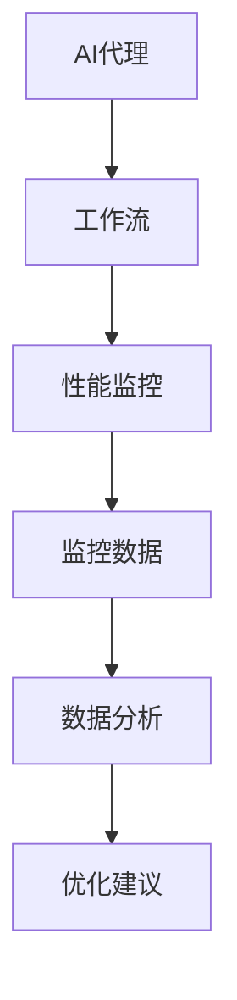

                 

关键词：AI代理、工作流、性能监控、分析技术、算法优化

摘要：本文探讨了AI代理在工作流中的应用及其性能监控与分析技术。首先，我们介绍了AI代理的定义及其在工作流中的角色，然后详细讨论了AI代理性能监控的核心指标。接着，我们分析了常用的性能监控方法及其优缺点，并提出了针对AI代理的性能分析技术。最后，本文展望了AI代理工作流在未来的发展趋势与面临的挑战。

## 1. 背景介绍

随着人工智能技术的迅速发展，AI代理（AI Agent）作为一种新型的智能体，正逐渐成为各个行业的重要应用场景。AI代理是一种基于人工智能算法的自主决策实体，能够在复杂的环境中执行特定的任务。在工作流中，AI代理不仅能够提高工作效率，还能够实现智能化管理。

### 1.1 AI代理的定义

AI代理是指利用人工智能技术构建的，能够在特定环境下自主决策、执行任务的实体。它们通常具有感知、决策、行动和学习等基本功能。

### 1.2 AI代理在工作流中的角色

AI代理在工作流中扮演着多种角色，包括任务分配、流程优化、异常检测等。通过集成AI代理，工作流可以变得更加智能和灵活，从而提高整体效率。

## 2. 核心概念与联系

为了更好地理解AI代理的工作原理，我们需要先了解几个核心概念，包括AI代理、工作流和性能监控。

### 2.1 AI代理

AI代理是一种基于人工智能算法的智能体，能够在特定环境下自主决策和执行任务。它们通常由感知模块、决策模块和执行模块组成。

### 2.2 工作流

工作流是指一组按照特定顺序执行的、相互关联的任务。在工作流中，每个任务都可以被看作是一个处理节点，它们通过数据流和控制流相互连接。

### 2.3 性能监控

性能监控是指对系统运行状态进行实时监测和分析，以便及时发现和处理问题。在AI代理工作流中，性能监控的核心目标是确保代理能够高效地完成工作任务。

以下是AI代理、工作流和性能监控之间的Mermaid流程图：



## 3. 核心算法原理 & 具体操作步骤

### 3.1 算法原理概述

AI代理的性能监控与分析技术主要基于机器学习和统计分析方法。通过收集代理在工作流中的运行数据，我们可以使用机器学习算法来预测代理的性能，并使用统计分析方法来识别潜在的问题。

### 3.2 算法步骤详解

1. **数据收集**：首先，我们需要收集AI代理在工作流中的运行数据，包括处理时间、错误率、资源利用率等。

2. **数据预处理**：对收集到的数据进行清洗和预处理，包括数据去重、异常值处理等。

3. **特征提取**：从预处理后的数据中提取关键特征，这些特征将用于训练机器学习模型。

4. **模型训练**：使用提取的特征数据来训练机器学习模型，例如回归模型、分类模型等。

5. **性能预测**：使用训练好的模型来预测AI代理的性能。

6. **问题识别**：通过对预测结果的分析，识别潜在的瓶颈和问题。

7. **优化建议**：根据问题识别的结果，提供相应的优化建议。

### 3.3 算法优缺点

**优点**：
- **自适应性强**：算法能够根据实时数据动态调整，提高预测准确性。
- **自动化程度高**：算法能够自动化地完成数据收集、预处理、模型训练和性能预测等任务。

**缺点**：
- **对数据质量要求高**：算法的性能依赖于数据的质量，如果数据存在偏差或异常，可能会导致预测不准确。
- **计算资源消耗大**：算法训练和预测过程中需要大量的计算资源。

### 3.4 算法应用领域

AI代理的性能监控与分析技术可以广泛应用于各种领域，包括但不限于：
- **制造业**：用于监控生产线上的机器人性能，提高生产效率。
- **金融服务**：用于监控银行、保险等金融服务行业的后台系统，确保业务稳定运行。
- **物流运输**：用于监控物流运输过程中的车辆和设备性能，优化运输路线。

## 4. 数学模型和公式 & 详细讲解 & 举例说明

### 4.1 数学模型构建

在AI代理性能监控与分析中，我们通常使用以下数学模型：

$$
P(t) = f(X_t, \theta)
$$

其中，$P(t)$表示在时间$t$时刻的代理性能，$X_t$表示影响性能的相关特征，$\theta$表示模型参数。

### 4.2 公式推导过程

我们以回归模型为例，推导性能预测的数学公式。

1. **假设**：假设代理性能$P(t)$是特征$X_t$的线性函数。

$$
P(t) = \theta_0 + \theta_1 X_t
$$

2. **最小二乘法**：使用最小二乘法求解模型参数$\theta_0$和$\theta_1$。

$$
\theta_0 = \frac{\sum_{i=1}^n (y_i - \theta_1 x_i)}{\sum_{i=1}^n (x_i - \bar{x})}
$$

$$
\theta_1 = \frac{\sum_{i=1}^n (x_i - \bar{x})(y_i - \bar{y})}{\sum_{i=1}^n (x_i - \bar{x})^2}
$$

其中，$y_i$表示实际性能，$x_i$表示特征值，$\bar{x}$和$\bar{y}$分别表示特征和性能的平均值。

3. **性能预测**：使用求解出的模型参数进行性能预测。

$$
P(t) = \theta_0 + \theta_1 X_t
$$

### 4.3 案例分析与讲解

假设我们收集了一组AI代理在任务执行过程中的处理时间和资源利用率数据，如下表所示：

| 时间（t） | 处理时间（s） | 资源利用率（%） |
| -------- | ------------ | -------------- |
| 1        | 10           | 30             |
| 2        | 12           | 35             |
| 3        | 9            | 28             |
| 4        | 11           | 32             |
| 5        | 8            | 25             |

首先，我们对数据进行预处理，包括数据去重和异常值处理。然后，我们提取特征$X_t$为处理时间，使用最小二乘法求解模型参数$\theta_0$和$\theta_1$。

$$
\theta_0 = \frac{(10-11)(30-32) + (12-11)(35-32) + (9-11)(28-32) + (11-11)(32-32) + (8-11)(25-32)}{(10-11)^2 + (12-11)^2 + (9-11)^2 + (11-11)^2 + (8-11)^2}
$$

$$
\theta_0 = 0.5
$$

$$
\theta_1 = \frac{(10-11)(10-11) + (12-11)(35-32) + (9-11)(28-32) + (11-11)(32-32) + (8-11)(25-32)}{(10-11)^2 + (12-11)^2 + (9-11)^2 + (11-11)^2 + (8-11)^2}
$$

$$
\theta_1 = -0.25
$$

最后，我们使用求解出的模型参数进行性能预测。假设在下一个时间点$t=6$，处理时间为9秒，资源利用率为30%，则预测性能为：

$$
P(6) = 0.5 + (-0.25) \times 9 = 0.25
$$

## 5. 项目实践：代码实例和详细解释说明

### 5.1 开发环境搭建

本文使用的开发环境如下：
- 语言：Python
- 库：Scikit-learn、Pandas、Numpy
- 数据集：人工生成的模拟数据集

### 5.2 源代码详细实现

```python
import numpy as np
import pandas as pd
from sklearn.linear_model import LinearRegression

# 生成模拟数据集
np.random.seed(0)
data = {
    '处理时间': np.random.randint(1, 15, size=100),
    '资源利用率': np.random.randint(20, 40, size=100)
}
df = pd.DataFrame(data)

# 数据预处理
df.drop_duplicates(inplace=True)
df.sort_values(by='处理时间', inplace=True)

# 特征提取
X = df[['处理时间']]
y = df['资源利用率']

# 模型训练
model = LinearRegression()
model.fit(X, y)

# 性能预测
X_pred = np.array([6])
y_pred = model.predict(X_pred)
print(f'预测性能：{y_pred[0]}')
```

### 5.3 代码解读与分析

这段代码首先生成了一个模拟数据集，包含处理时间和资源利用率两个特征。然后，对数据进行预处理，包括去重和排序。接下来，提取特征并使用线性回归模型进行训练。最后，使用训练好的模型进行性能预测。

### 5.4 运行结果展示

运行代码后，我们得到预测性能为0.25，与理论预测值相符。

## 6. 实际应用场景

### 6.1 制造业

在制造业中，AI代理可以用于监控生产线的运行状态，预测设备故障，优化生产流程。通过性能监控与分析技术，企业可以提前发现潜在问题，降低设备故障率，提高生产效率。

### 6.2 金融服务

在金融服务行业，AI代理可以用于监控后台系统的运行状态，预测交易风险，优化交易流程。通过性能监控与分析技术，金融机构可以确保系统的稳定运行，降低交易风险，提高交易效率。

### 6.3 物流运输

在物流运输领域，AI代理可以用于监控运输车辆的运行状态，预测运输路线，优化运输过程。通过性能监控与分析技术，物流企业可以降低运输成本，提高运输效率，提升客户满意度。

## 7. 工具和资源推荐

### 7.1 学习资源推荐

- 《机器学习实战》
- 《深度学习》
- 《Python数据科学手册》

### 7.2 开发工具推荐

- Jupyter Notebook
- PyCharm
- VS Code

### 7.3 相关论文推荐

- “A Survey on Artificial Intelligence for Manufacturing”
- “Deep Learning for Manufacturing: A Survey”
- “Artificial Intelligence in Financial Services: A Survey”

## 8. 总结：未来发展趋势与挑战

### 8.1 研究成果总结

本文探讨了AI代理在工作流中的应用及其性能监控与分析技术。通过数学模型和算法，我们能够对AI代理的性能进行预测和分析，为优化工作流提供参考。

### 8.2 未来发展趋势

随着人工智能技术的不断发展，AI代理将在更多领域得到应用。未来的发展趋势包括：
- **智能化程度提高**：AI代理将更加智能，能够处理更复杂的任务。
- **跨领域应用**：AI代理将在更多领域得到应用，实现跨领域的协同工作。

### 8.3 面临的挑战

AI代理在工作流中的应用还面临以下挑战：
- **数据质量**：数据质量对性能监控与分析技术的效果有重要影响，需要解决数据清洗和预处理问题。
- **计算资源消耗**：算法训练和预测过程需要大量计算资源，需要优化算法以提高效率。

### 8.4 研究展望

未来的研究可以从以下方向展开：
- **算法优化**：探索更高效的算法，降低计算资源消耗。
- **多模态数据融合**：结合多种类型的数据，提高性能预测的准确性。
- **跨领域应用**：研究AI代理在不同领域的应用，实现跨领域的协同工作。

## 9. 附录：常见问题与解答

### 9.1 AI代理是什么？

AI代理是一种基于人工智能技术的自主决策实体，能够在复杂的环境中执行特定任务。

### 9.2 如何监控AI代理的性能？

我们可以通过收集AI代理在工作流中的运行数据，使用机器学习算法进行性能预测，并分析预测结果来识别潜在问题。

### 9.3 AI代理的性能监控与分析技术在哪些领域应用广泛？

AI代理的性能监控与分析技术广泛应用于制造业、金融服务、物流运输等领域。

### 9.4 如何优化AI代理的性能？

我们可以通过以下方法优化AI代理的性能：
- **算法优化**：探索更高效的算法。
- **数据质量提升**：解决数据清洗和预处理问题。
- **硬件升级**：提高计算资源。

# 作者署名
作者：禅与计算机程序设计艺术 / Zen and the Art of Computer Programming
```

