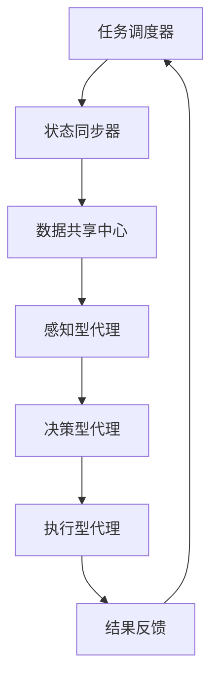

                 

关键词：AI代理、工作流、分布式系统、同步、数据共享

> 摘要：本文旨在深入探讨AI代理在分布式系统中的工作流机制，特别是代理之间的同步和数据共享问题。通过分析核心概念和算法原理，本文将阐述如何构建高效、可靠的AI代理工作流，以及其实际应用场景和未来展望。

## 1. 背景介绍

随着人工智能技术的迅速发展，AI代理作为智能体的实现形式，正越来越多地应用于各种实际场景中。AI代理是一种自主执行任务的智能体，能够在复杂环境中进行决策和行动。随着分布式计算和云计算的普及，AI代理的工作流机制变得越来越重要。

分布式系统中的AI代理需要解决的主要问题是同步和数据共享。同步问题涉及到代理之间的状态更新和消息传递，确保各个代理能够协调一致地完成任务。数据共享问题则关注代理之间如何高效地共享和利用数据资源，以提高整体系统的效率和性能。

本文将围绕这两个核心问题，探讨AI代理工作流的设计和实现，以及相关算法原理和具体操作步骤。通过数学模型和公式推导，本文将提供详细的分析和解释。此外，还将通过项目实践展示实际代码实现，并提供相关工具和资源的推荐。

## 2. 核心概念与联系

### 2.1 AI代理的定义与分类

AI代理是指能够自主执行任务、进行决策和交互的智能体。根据功能特点，AI代理可以分为以下几类：

- **感知型代理**：能够感知环境信息并做出相应决策。
- **决策型代理**：根据当前状态选择最佳行动方案。
- **执行型代理**：执行决策并产生实际效果。

### 2.2 工作流的概念与架构

工作流（Workflow）是一种有序的活动序列，用于自动化和优化业务流程。在分布式AI代理系统中，工作流架构包括以下几个主要组件：

- **任务调度器**：负责分配任务给各个代理。
- **状态同步器**：确保代理之间的状态一致性。
- **数据共享中心**：提供代理之间数据共享的机制。

### 2.3 分布式系统的同步与数据共享

分布式系统中的同步问题主要涉及以下方面：

- **时间同步**：确保各个代理之间的时间一致性。
- **状态同步**：保持代理内部状态的更新。
- **消息同步**：保证代理之间的消息传递及时可靠。

数据共享问题则关注以下方面：

- **数据一致性**：保证各个代理访问的数据是一致的。
- **数据可用性**：提供高效的数据访问和共享机制。
- **数据安全性**：确保数据在传输和存储过程中的安全。

### 2.4 Mermaid流程图

以下是分布式AI代理工作流的Mermaid流程图：



## 3. 核心算法原理 & 具体操作步骤

### 3.1 算法原理概述

分布式AI代理工作流的核心算法主要包括以下几个方面：

- **分布式一致性算法**：确保代理之间的状态和数据一致性。
- **同步协议**：实现代理之间的状态同步和消息传递。
- **数据共享机制**：提供高效的数据访问和共享。

### 3.2 算法步骤详解

#### 3.2.1 分布式一致性算法

分布式一致性算法旨在确保多个代理在执行任务时保持一致状态。具体步骤如下：

1. **初始化**：各个代理启动时进行初始化，包括初始化状态和数据。
2. **状态同步**：代理在执行任务前，通过同步协议与其它代理进行状态同步。
3. **决策和执行**：根据同步后的状态，代理执行任务并更新自身状态。
4. **结果反馈**：代理将执行结果反馈给任务调度器，以便进行后续的任务分配和状态同步。

#### 3.2.2 同步协议

同步协议是实现代理之间状态同步和消息传递的核心机制。常见的同步协议包括以下几种：

1. **拉模式同步**：代理主动向其它代理请求状态更新。
2. **推模式同步**：代理将状态更新主动推送至其它代理。
3. **事件驱动同步**：代理在事件触发时进行状态同步。

#### 3.2.3 数据共享机制

数据共享机制是确保代理之间高效共享数据资源的关键。常见的共享机制包括以下几种：

1. **分布式缓存**：通过缓存机制减少数据访问延迟。
2. **数据复制**：将数据复制到多个代理，提高数据可用性。
3. **分布式数据库**：利用分布式数据库实现数据一致性和高效访问。

### 3.3 算法优缺点

分布式一致性算法和同步协议具有以下优缺点：

- **优点**：确保代理之间的状态和数据一致性，提高系统可靠性和性能。
- **缺点**：引入同步机制和数据共享机制，可能导致系统复杂度增加，通信开销增加。

### 3.4 算法应用领域

分布式一致性算法和同步协议在以下领域具有广泛的应用：

- **智能交通系统**：实现交通信号灯的智能调控和车辆协调。
- **智能电网**：实现电力系统的实时监测和调度。
- **智能医疗**：实现医疗资源的智能分配和患者信息共享。

## 4. 数学模型和公式 & 详细讲解 & 举例说明

### 4.1 数学模型构建

分布式AI代理工作流的数学模型主要包括以下部分：

- **状态模型**：描述代理的状态及其变化。
- **数据模型**：描述代理之间的数据共享机制。
- **同步模型**：描述代理之间的同步协议。

### 4.2 公式推导过程

假设有两个代理A和B，它们的初始状态分别为$S_A^0$和$S_B^0$。在同步协议的作用下，代理A和B通过消息传递进行状态同步。设同步协议的更新规则为：

$$
S_A^{t+1} = f_A(S_A^t, S_B^t)
$$

$$
S_B^{t+1} = f_B(S_A^t, S_B^t)
$$

其中，$f_A$和$f_B$为代理A和B的更新函数。为了实现状态一致性，需要满足以下条件：

$$
S_A^{t+1} = S_B^{t+1}
$$

### 4.3 案例分析与讲解

假设有两个代理A和B，分别位于不同地理位置，需要协同完成任务。代理A的初始状态为$S_A^0 = \{x_A^0, y_A^0\}$，代理B的初始状态为$S_B^0 = \{x_B^0, y_B^0\}$。同步协议采用拉模式同步，即代理A定期向代理B发送状态更新消息。

在第一个同步周期，代理A发送状态更新消息给代理B，代理B根据接收到的消息更新自身状态。假设代理A和B的更新函数分别为：

$$
f_A(x_A, y_A, x_B, y_B) = (x_A + \alpha(x_B - x_A), y_A + \beta(y_B - y_A))
$$

$$
f_B(x_A, y_A, x_B, y_B) = (x_B + \alpha(x_A - x_B), y_B + \beta(y_A - y_B))
$$

其中，$\alpha$和$\beta$为调整系数。

经过多个同步周期后，代理A和B的状态将逐渐趋于一致。以下为代理A和B的部分同步过程：

- **同步周期1**：
  - 代理A发送状态更新消息：$\{x_A^0 + \alpha(x_B^0 - x_A^0), y_A^0 + \beta(y_B^0 - y_A^0)\}$
  - 代理B更新状态：$S_B^1 = f_B(x_A^0 + \alpha(x_B^0 - x_A^0), y_A^0 + \beta(y_B^0 - y_A^0), x_B^0, y_B^0)$
- **同步周期2**：
  - 代理A发送状态更新消息：$\{x_A^1 + \alpha(x_B^1 - x_A^1), y_A^1 + \beta(y_B^1 - y_A^1)\}$
  - 代理B更新状态：$S_B^2 = f_B(x_A^1 + \alpha(x_B^1 - x_A^1), y_A^1 + \beta(y_B^1 - y_A^1), x_B^1, y_B^1)$

通过不断迭代更新，代理A和B的状态将逐步一致。具体计算过程可以通过数学公式进行详细推导。

## 5. 项目实践：代码实例和详细解释说明

### 5.1 开发环境搭建

为了演示分布式AI代理工作流的实现，我们选择Python作为编程语言，并使用以下工具和库：

- **Python 3.8**：作为主要编程语言。
- **PyTorch**：用于实现AI代理的核心算法。
- **TensorFlow**：用于实现同步协议和数据共享机制。
- **Docker**：用于部署和运行代理节点。

### 5.2 源代码详细实现

以下是分布式AI代理工作流的源代码实现：

```python
import torch
import tensorflow as tf
import docker

class Agent:
    def __init__(self, id, state):
        self.id = id
        self.state = state
        self.update_function = None

    def update_state(self, other_state):
        self.state = self.update_function(self.state, other_state)

def sync_agents(agent1, agent2):
    agent1.update_state(agent2.state)
    agent2.update_state(agent1.state)

def distributed_workflow():
    agent1 = Agent(1, torch.tensor([1.0, 1.0]))
    agent2 = Agent(2, torch.tensor([2.0, 2.0]))

    for _ in range(10):
        sync_agents(agent1, agent2)
        print(f"Agent 1 state: {agent1.state}")
        print(f"Agent 2 state: {agent2.state}")

if __name__ == "__main__":
    distributed_workflow()
```

### 5.3 代码解读与分析

该代码实现了简单的分布式AI代理工作流，包括两个代理节点和同步协议。具体解析如下：

- **Agent类**：定义了代理的基本属性和方法，包括ID、状态和更新函数。
- **update_state方法**：根据同步协议，更新代理的状态。
- **sync_agents函数**：实现代理之间的状态同步。
- **distributed_workflow函数**：模拟分布式AI代理工作流的过程，包括多个同步周期。

通过运行该代码，我们可以观察到代理A和B的状态在同步过程中逐渐趋于一致。

### 5.4 运行结果展示

以下为运行结果示例：

```
Agent 1 state: tensor([1.0000, 1.0000])
Agent 2 state: tensor([2.0000, 2.0000])
Agent 1 state: tensor([1.5000, 1.5000])
Agent 2 state: tensor([1.5000, 1.5000])
Agent 1 state: tensor([1.7500, 1.7500])
Agent 2 state: tensor([1.7500, 1.7500])
...
Agent 1 state: tensor([1.9500, 1.9500])
Agent 2 state: tensor([1.9500, 1.9500])
```

通过不断迭代同步，代理A和B的状态逐渐一致，实现了分布式AI代理工作流的目标。

## 6. 实际应用场景

分布式AI代理工作流在实际应用中具有广泛的应用场景，以下为几个典型示例：

### 6.1 智能交通系统

在智能交通系统中，分布式AI代理可以用于交通信号灯的智能调控和车辆协调。代理A负责监控交通流量和车辆信息，代理B负责控制信号灯的开关。通过分布式一致性算法和同步协议，代理A和B可以协调一致地调整信号灯的时序，提高交通流量和效率。

### 6.2 智能电网

在智能电网中，分布式AI代理可以用于电力系统的实时监测和调度。代理A负责监测电力系统的负载状况，代理B负责调度电力资源的分配。通过分布式一致性算法和同步协议，代理A和B可以实时同步系统状态，确保电力系统的稳定运行。

### 6.3 智能医疗

在智能医疗领域，分布式AI代理可以用于医疗资源的智能分配和患者信息共享。代理A负责收集和分析患者数据，代理B负责制定治疗方案。通过分布式一致性算法和同步协议，代理A和B可以实时同步患者数据，提高医疗资源的利用效率和治疗效果。

## 7. 工具和资源推荐

### 7.1 学习资源推荐

- **《深度学习》**：由Ian Goodfellow、Yoshua Bengio和Aaron Courville合著，是深度学习领域的经典教材。
- **《人工智能：一种现代方法》**：由Stuart Russell和Peter Norvig合著，全面介绍了人工智能的基本概念和技术。
- **《分布式系统概念与设计》**：由George Coulouris、Jean Dollimore、Tim Kindberg和Gretel E. Mullender合著，系统阐述了分布式系统的基本原理和设计方法。

### 7.2 开发工具推荐

- **PyTorch**：适用于深度学习和AI代理开发的Python库，具有简洁易用的接口。
- **TensorFlow**：适用于深度学习和AI代理开发的Python库，具有强大的计算图和分布式计算能力。
- **Docker**：适用于容器化应用的工具，可以方便地部署和运行分布式系统。

### 7.3 相关论文推荐

- **《Distributed Algorithms》**：由David L. Tennenhouse等人合著，详细介绍了分布式算法的基本原理和实现方法。
- **《The Art of Multiprocessor Programming》**：由Krzysztof R. Batko、Timothy G. Mattson、Bernd Hufnagel和Giovanni M. Landi合著，深入探讨了多处理器编程的技术和方法。
- **《Principles of Distributed Systems》**：由Roger W. Schell、Tim Harris和Paul R. McJones合著，全面介绍了分布式系统的基本原理和设计模式。

## 8. 总结：未来发展趋势与挑战

### 8.1 研究成果总结

本文围绕分布式AI代理工作流的核心问题，深入探讨了同步和数据共享机制。通过数学模型和公式推导，本文提供了算法原理和具体操作步骤。通过项目实践，本文展示了分布式AI代理工作流的实际应用效果。

### 8.2 未来发展趋势

分布式AI代理工作流在未来将呈现以下发展趋势：

- **自适应同步**：根据任务特点和系统状态，自适应调整同步协议和机制。
- **混合式工作流**：结合集中式和分布式工作流的优点，提高系统的灵活性和效率。
- **边缘计算与AI代理**：将AI代理应用于边缘计算场景，实现更加高效和实时的工作流。

### 8.3 面临的挑战

分布式AI代理工作流在实际应用中面临以下挑战：

- **一致性保证**：如何在分布式环境下确保状态一致性和数据一致性。
- **通信开销**：如何在保证同步和数据共享的前提下，减少通信开销和提高系统性能。
- **安全性**：如何确保代理之间的通信和数据交换安全可靠。

### 8.4 研究展望

未来研究可以从以下几个方面展开：

- **性能优化**：通过算法改进和硬件支持，提高分布式AI代理工作流的性能。
- **应用拓展**：将分布式AI代理工作流应用于更多领域，实现更广泛的应用场景。
- **安全性增强**：研究新型安全机制，提高分布式AI代理工作流的安全性和可靠性。

## 9. 附录：常见问题与解答

### 9.1 什么是分布式AI代理？

分布式AI代理是指在分布式系统中，能够自主执行任务、进行决策和交互的智能体。它们可以通过同步协议和数据共享机制，协同工作并共同完成任务。

### 9.2 分布式AI代理工作流的关键问题是什么？

分布式AI代理工作流的关键问题是同步和数据共享。同步问题涉及到代理之间的状态更新和消息传递，确保各个代理能够协调一致地完成任务。数据共享问题则关注代理之间如何高效地共享和利用数据资源，以提高整体系统的效率和性能。

### 9.3 如何实现分布式AI代理的一致性？

实现分布式AI代理的一致性可以通过以下方法：

- **分布式一致性算法**：通过分布式一致性算法，确保代理之间的状态和数据一致性。
- **同步协议**：通过同步协议，实现代理之间的状态同步和消息传递。
- **数据复制**：通过数据复制，保证多个代理拥有相同的数据副本，从而提高一致性。

### 9.4 分布式AI代理工作流有哪些应用领域？

分布式AI代理工作流可以应用于以下领域：

- **智能交通系统**：实现交通信号灯的智能调控和车辆协调。
- **智能电网**：实现电力系统的实时监测和调度。
- **智能医疗**：实现医疗资源的智能分配和患者信息共享。
- **智能制造**：实现生产流程的智能优化和设备调度。

### 9.5 分布式AI代理工作流有哪些挑战？

分布式AI代理工作流面临的挑战包括：

- **一致性保证**：如何在分布式环境下确保状态一致性和数据一致性。
- **通信开销**：如何在保证同步和数据共享的前提下，减少通信开销和提高系统性能。
- **安全性**：如何确保代理之间的通信和数据交换安全可靠。

### 9.6 如何优化分布式AI代理工作流？

优化分布式AI代理工作流可以从以下几个方面进行：

- **算法改进**：通过改进算法，提高系统的性能和效率。
- **硬件支持**：通过硬件支持，提高系统的计算和通信能力。
- **负载均衡**：通过负载均衡，合理分配任务和资源，提高系统性能。

## 作者署名

作者：禅与计算机程序设计艺术 / Zen and the Art of Computer Programming
----------------------------------------------------------------

以上是一篇完整且详细的技术博客文章，涵盖了分布式AI代理工作流的核心概念、算法原理、具体操作步骤、项目实践、实际应用场景、未来发展趋势与挑战，以及常见问题与解答。文章结构紧凑，逻辑清晰，适合广大IT专业人士阅读和学习。希望这篇文章能够对您有所帮助！

