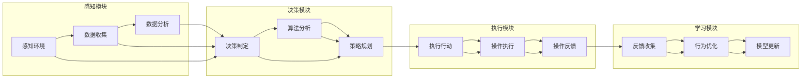

                 

### 1. 背景介绍

随着人工智能技术的快速发展，智能代理（AI Agent）逐渐成为各行各业关注的热点。智能代理是一种能够自主执行任务、具有智能决策能力的软件实体，它在金融领域中的应用尤为引人注目。金融系统是一个高度复杂、数据密集和风险敏感的领域，传统的手动操作已经难以满足日益增长的业务需求和复杂性。因此，引入智能代理工作流（AI Agent WorkFlow）成为提高金融系统效率和降低运营成本的重要手段。

本文旨在探讨智能代理工作流在金融系统中的应用，分析其核心概念、算法原理、数学模型、项目实践以及未来应用前景。通过本文的阐述，希望能够为读者提供对智能代理工作流在金融领域的深入理解，并启发更多的创新应用。

### 1.1 智能代理的定义与基本特征

智能代理（AI Agent）是一种基于人工智能技术的软件实体，它能够模拟人类智能，执行任务、收集信息、进行决策并与其他代理进行交互。智能代理通常具有以下基本特征：

1. **自主性**：智能代理能够独立执行任务，无需人工干预。
2. **适应性**：智能代理可以根据环境和任务的变化，调整自身行为。
3. **协作性**：智能代理可以与其他代理协同工作，共同完成任务。
4. **智能性**：智能代理利用机器学习、自然语言处理等技术，实现复杂决策和问题解决。

智能代理的应用场景非常广泛，包括但不限于智能客服、智能推荐、智能监控、智能交易等。在金融领域，智能代理可以帮助金融机构实现自动化操作、风险控制、客户服务、投资决策等功能，从而提高业务效率和降低运营成本。

### 1.2 金融系统与智能代理的融合

金融系统是一个复杂的系统，涉及银行、证券、保险、基金等多个领域，包含大量的交易、数据分析、风险评估等任务。传统的金融系统依赖于人工操作，存在效率低、错误率高、风险控制不足等问题。随着金融业务的快速发展，金融机构面临着日益严峻的竞争压力，需要通过技术创新来提升业务效率和降低成本。

智能代理工作流为金融系统提供了一种全新的解决方案。通过引入智能代理，金融机构可以实现以下目标：

1. **自动化操作**：智能代理可以自动化完成大量的金融交易、数据分析、风险评估等任务，降低人工操作的成本和错误率。
2. **智能决策**：智能代理利用机器学习算法，分析海量数据，为金融机构提供投资建议、风险预测等智能决策支持。
3. **风险控制**：智能代理可以对金融交易过程进行实时监控，及时发现潜在风险，采取相应的风险控制措施。
4. **客户服务**：智能代理可以提供智能客服服务，解答客户问题、推荐金融产品等，提高客户满意度。

总之，智能代理工作流在金融系统中的应用，不仅能够提高业务效率和降低成本，还能够提升金融机构的竞争力，为金融机构的数字化转型提供有力支持。

### 1.3 智能代理工作流的研究现状与应用前景

智能代理工作流在金融领域的研究与应用逐渐成为热点。近年来，国内外学者和研究机构在智能代理技术、算法模型、应用场景等方面进行了大量的研究，取得了显著成果。例如，许多研究探讨了智能代理在金融交易中的优化策略，提出了基于深度学习、强化学习等算法的智能交易系统。此外，还有一些研究聚焦于智能代理在风险评估、客户服务、反欺诈等领域的应用，并取得了良好的效果。

在实际应用方面，一些金融机构已经开始采用智能代理工作流来提升业务效率和降低运营成本。例如，某大型银行引入了智能客服代理，实现了自动化解答客户问题和办理业务，大大提高了客户服务效率。此外，一些基金公司和保险公司也采用了智能代理进行投资决策和风险评估，取得了显著的收益和风险控制效果。

未来，随着人工智能技术的不断发展，智能代理工作流在金融领域的应用前景将更加广阔。预计将有更多金融机构采用智能代理技术，实现自动化操作、智能决策和风险控制。同时，智能代理工作流也将与其他新兴技术（如区块链、大数据等）相结合，为金融行业的数字化转型提供更加全面和有力的支持。然而，智能代理工作流在金融领域的应用也面临一定的挑战，如数据安全、隐私保护、法律合规等问题。因此，需要进一步研究和解决这些问题，以确保智能代理工作流在金融领域的健康发展。

### 2. 核心概念与联系

智能代理工作流（AI Agent WorkFlow）在金融系统中扮演着关键角色，要理解其核心概念和联系，需要首先了解智能代理的基本原理以及其在金融系统中的应用场景。

#### 2.1 智能代理的基本原理

智能代理（AI Agent）是一种具备智能特性的软件实体，其核心在于其能够感知环境、制定计划并采取行动。智能代理的基本原理包括以下几个关键方面：

1. **感知环境**：智能代理通过传感器、数据库或其他数据源获取环境信息，以便理解当前的状态。
2. **计划与决策**：智能代理利用内置的算法模型对获取到的信息进行分析，制定合适的行动计划，并作出决策。
3. **执行行动**：智能代理根据决策结果执行相应的操作，如自动化交易、风险监控等。
4. **反馈与学习**：智能代理在执行过程中会收集反馈信息，并通过机器学习等算法不断优化自身的行为。

#### 2.2 智能代理在金融系统中的应用场景

智能代理在金融系统中有着广泛的应用场景，主要包括以下几方面：

1. **自动化交易**：智能代理可以自动执行高频交易、算法交易等，减少人为干预，提高交易效率和收益。
2. **风险管理**：智能代理能够实时监控金融市场的波动，识别潜在风险，并提供风险预警和应对策略。
3. **客户服务**：智能代理可以提供7x24小时的客户服务，解答客户疑问，推荐金融产品，提高客户满意度。
4. **合规监控**：智能代理能够自动检测金融交易的合规性，防止违规操作，确保合规运营。

#### 2.3 智能代理工作流的基本架构

智能代理工作流的基本架构包括以下几个核心组成部分：

1. **感知模块**：负责获取外部环境信息，如市场数据、交易信息等。
2. **决策模块**：利用机器学习算法分析感知到的数据，制定决策策略。
3. **执行模块**：根据决策结果执行具体的操作，如交易、风险控制等。
4. **学习模块**：通过反馈信息不断优化智能代理的行为和决策策略。

#### 2.4 智能代理与其他技术的联系

智能代理工作流不仅依赖于自身的技术，还与其他前沿技术紧密相连，共同推动金融系统的智能化发展。以下是智能代理与一些关键技术的联系：

1. **大数据**：大数据技术为智能代理提供了丰富的数据资源，使得智能代理能够更好地感知环境和进行决策。
2. **区块链**：区块链技术提供了去中心化、不可篡改的交易记录，为智能代理提供了可靠的数据基础。
3. **云计算**：云计算技术为智能代理提供了强大的计算能力和存储资源，使得智能代理可以处理海量数据和复杂算法。
4. **物联网**：物联网技术将智能代理扩展到物理世界，使得智能代理可以与实物设备进行交互，实现更广泛的自动化和智能化。

### 2.5 总结

智能代理工作流在金融系统中的应用具有重要意义，其基本原理和架构为其在金融领域提供了强大的技术支持。通过感知环境、制定计划、执行行动和反馈学习，智能代理能够实现自动化操作、智能决策和风险控制。同时，智能代理与其他前沿技术的结合，进一步拓展了其在金融领域的应用范围。理解智能代理的基本原理和应用场景，是深入研究和应用智能代理工作流的关键。

#### 2.6 核心概念原理及架构 Mermaid 流程图

以下是一个描述智能代理工作流核心概念原理及架构的Mermaid流程图，该图展示了智能代理从感知环境到反馈学习的过程。



在这个流程图中：

- **感知模块**负责收集和处理环境数据。
- **决策模块**利用算法分析感知到的数据，制定策略。
- **执行模块**根据决策执行具体的操作。
- **学习模块**通过收集反馈信息来优化智能代理的行为和决策。

### 3. 核心算法原理 & 具体操作步骤

智能代理工作流的核心在于其算法原理，这些算法决定了智能代理如何感知环境、制定决策、执行行动和持续学习。在本节中，我们将详细探讨智能代理在金融系统中的应用算法原理，并介绍具体的操作步骤。

#### 3.1 算法原理概述

智能代理在金融系统中的应用算法通常基于以下几种原理：

1. **机器学习**：通过训练模型，使智能代理能够从历史数据中学习并预测市场走势。
2. **深度学习**：利用神经网络模型，对复杂的数据模式进行建模和分析。
3. **强化学习**：通过奖励机制，使智能代理在动态环境中不断优化自身策略。
4. **自然语言处理**：用于智能客服等应用场景，使智能代理能够理解并回答客户的自然语言问题。

#### 3.2 算法步骤详解

智能代理的工作流程可以分为以下几个关键步骤：

1. **数据收集与预处理**：
   - 收集金融市场的实时数据，如股价、交易量、市场指数等。
   - 对数据进行清洗、去噪、归一化等预处理操作，确保数据质量。

2. **特征提取**：
   - 从预处理后的数据中提取关键特征，如价格趋势、波动性等。
   - 利用统计学方法或机器学习算法，识别数据中的潜在模式。

3. **模型训练**：
   - 选择合适的机器学习或深度学习模型，如线性回归、决策树、神经网络等。
   - 使用历史数据对模型进行训练，使其学会预测市场走势和交易机会。

4. **决策制定**：
   - 利用训练好的模型，对实时数据进行分析，制定交易策略。
   - 结合市场情况和用户需求，生成具体的操作指令。

5. **执行行动**：
   - 根据决策指令，执行具体的交易操作，如买入、卖出等。
   - 对交易过程进行实时监控，确保操作的顺利进行。

6. **反馈与学习**：
   - 收集交易后的反馈信息，如收益、风险等。
   - 通过机器学习算法，优化模型的参数和策略，提高智能代理的性能。

#### 3.3 算法优缺点

每种算法在金融系统中的应用都有其优缺点，以下是对几种常用算法的优缺点分析：

1. **机器学习**：
   - **优点**：能够处理大规模数据，适应性强，能够发现潜在的模式。
   - **缺点**：对数据质量要求高，训练过程复杂，对新数据的适应性较差。

2. **深度学习**：
   - **优点**：能够处理复杂的数据模式，具有强大的表达能力和预测能力。
   - **缺点**：训练过程非常耗时，对计算资源要求高，对数据依赖性强。

3. **强化学习**：
   - **优点**：能够适应动态环境，通过奖励机制不断优化策略。
   - **缺点**：训练过程可能需要大量样本，且容易出现过拟合。

4. **自然语言处理**：
   - **优点**：能够处理自然语言输入，提供智能客服等应用场景。
   - **缺点**：对语言理解要求高，准确率有待提高。

#### 3.4 算法应用领域

智能代理的算法在金融系统中的应用非常广泛，以下是几个主要领域：

1. **高频交易**：利用机器学习算法，分析市场数据，捕捉瞬间的交易机会。
2. **投资组合优化**：通过深度学习算法，对投资组合进行优化，提高收益和风险控制。
3. **风险管理**：利用强化学习算法，实时监控市场波动，提供风险预警和应对策略。
4. **客户服务**：利用自然语言处理技术，提供7x24小时的智能客服服务，提升客户满意度。

通过以上分析，我们可以看出，智能代理在金融系统中的应用算法不仅具有强大的数据处理和决策能力，还能够不断学习和优化，从而为金融机构提供高效、智能的解决方案。

### 3.1 算法原理概述

智能代理的工作核心在于其算法原理，这些算法决定了智能代理如何从环境中获取信息、如何制定决策以及如何执行行动。以下是智能代理在金融系统中的几种主要算法原理概述：

1. **机器学习**：机器学习算法是智能代理的核心技术之一，通过训练模型，智能代理可以学会从历史数据中识别模式和趋势。常见的机器学习算法包括线性回归、决策树、支持向量机等。这些算法能够处理大量的金融数据，从中提取有用的信息，如价格趋势、交易量等，为智能代理提供决策支持。

2. **深度学习**：深度学习算法通过多层神经网络对复杂数据进行建模，能够捕捉到数据中的细微模式和关系。在金融领域，深度学习算法被广泛应用于图像识别、自然语言处理和交易策略生成等方面。例如，卷积神经网络（CNN）可以用于图像分析，循环神经网络（RNN）可以用于处理时间序列数据。

3. **强化学习**：强化学习是一种通过试错和奖励机制来学习策略的算法。在金融系统中，强化学习算法可以用于自动交易策略的制定，如通过模拟高频交易，智能代理可以不断调整其交易策略，以最大化收益。强化学习的关键在于奖励机制的设计，奖励机制的合理性直接影响算法的性能。

4. **自然语言处理**：自然语言处理（NLP）算法使智能代理能够理解和处理自然语言。在金融领域，NLP算法可以用于智能客服、投资报告生成和风险预警等方面。例如，智能代理可以通过分析新闻、报告和其他文本信息，提取关键信息，从而为投资决策提供支持。

通过以上算法，智能代理能够从海量数据中提取有价值的信息，并根据这些信息制定智能决策。这些算法的结合使用，使得智能代理能够在复杂多变的金融环境中实现高效的决策和行动。

#### 3.2 算法步骤详解

智能代理在金融系统中的应用算法涉及多个步骤，每个步骤都有其特定的操作过程和目的。以下是智能代理算法的具体步骤详解：

1. **数据收集**：
   - **操作过程**：智能代理首先需要从金融市场中收集数据，这些数据包括历史价格、交易量、市场指数、新闻文本等。数据来源可以是交易所、新闻网站、社交媒体等。
   - **目的**：数据收集是智能代理工作的基础，只有获得足够且高质量的数据，智能代理才能进行有效的分析和决策。

2. **数据预处理**：
   - **操作过程**：收集到的数据通常包含噪声、缺失值和不一致的数据格式。因此，智能代理需要对这些数据进行清洗、去噪、填充缺失值、数据标准化等预处理操作。
   - **目的**：数据预处理能够提高数据的质量，确保后续分析过程准确无误。

3. **特征提取**：
   - **操作过程**：从预处理后的数据中提取关键特征，如价格波动率、交易量变化、技术指标等。特征提取可以通过统计方法、机器学习算法或深度学习模型来实现。
   - **目的**：特征提取有助于捕捉数据中的潜在模式和趋势，为智能代理提供决策支持。

4. **模型训练**：
   - **操作过程**：选择合适的机器学习模型（如线性回归、决策树、神经网络等）对特征进行训练。模型训练的过程包括选择训练集、设置模型参数、进行迭代训练等。
   - **目的**：模型训练使智能代理能够从历史数据中学习，构建预测模型，为实时决策提供依据。

5. **决策制定**：
   - **操作过程**：智能代理利用训练好的模型对实时数据进行预测和分析，根据预测结果制定交易策略。决策制定过程可能涉及多种算法的组合，如机器学习算法和深度学习算法。
   - **目的**：决策制定是智能代理的核心功能，通过分析预测结果，智能代理可以制定出最优的交易策略。

6. **执行行动**：
   - **操作过程**：根据决策结果，智能代理执行具体的交易操作，如买入、卖出、持有等。执行行动的过程需要与金融交易平台进行集成，确保操作顺利进行。
   - **目的**：执行行动是将决策转化为实际操作，实现投资目标。

7. **反馈与学习**：
   - **操作过程**：智能代理在执行行动后，会收集反馈信息，如交易收益、风险指标等。通过机器学习算法，智能代理对自身行为进行优化，调整模型参数和决策策略。
   - **目的**：反馈与学习使智能代理能够不断优化自身的行为，提高决策的准确性和稳定性。

通过以上步骤，智能代理能够在金融系统中实现自动化操作、智能决策和持续学习，从而提高交易效率和风险控制能力。

#### 3.3 算法优缺点

智能代理在金融系统中的应用算法具有显著的优点，但也存在一些潜在的问题和挑战。以下是几种主要算法的优缺点分析：

1. **机器学习**：
   - **优点**：
     - 能够处理大规模数据，适应性强，可以捕捉数据中的潜在模式。
     - 可以进行实时预测和决策，提高交易效率和准确性。
     - 可以根据历史数据进行优化，不断改进预测模型。
   - **缺点**：
     - 对数据质量要求高，数据清洗和预处理过程复杂。
     - 训练过程可能需要大量计算资源和时间。
     - 容易出现过拟合，对未知数据的表现可能较差。

2. **深度学习**：
   - **优点**：
     - 具有强大的表达能力和非线性建模能力，可以处理复杂数据模式。
     - 能够自动提取特征，减少人工干预。
     - 在图像识别、自然语言处理等领域表现优异。
   - **缺点**：
     - 训练过程非常耗时，对计算资源要求高。
     - 对数据依赖性强，对数据的分布和噪声敏感。
     - 模型的可解释性较差，难以理解决策过程。

3. **强化学习**：
   - **优点**：
     - 能够适应动态环境，通过奖励机制不断优化策略。
     - 可以处理复杂的决策问题，具有自我学习和适应能力。
     - 在自动化交易和智能决策方面表现突出。
   - **缺点**：
     - 需要大量的样本进行训练，训练过程可能需要很长时间。
     - 奖励机制的设计和优化对算法性能有重要影响。
     - 容易出现过度依赖奖励信号，导致策略不稳定。

4. **自然语言处理**：
   - **优点**：
     - 能够处理自然语言输入，提供智能客服和文本分析等应用场景。
     - 可以理解并处理复杂的语言结构，提高客户满意度。
     - 可以从大量文本中提取有价值的信息，为决策提供支持。
   - **缺点**：
     - 对语言理解和语义分析要求高，准确率有待提高。
     - 处理文本数据时，需要大量的计算资源和时间。
     - 难以处理复杂和模糊的语言表达，容易产生误解。

综上所述，每种算法都有其独特的优势和应用场景，但也存在一定的局限性。在金融系统中，通常需要结合多种算法，以实现最佳的效果。同时，对于算法的优缺点，需要根据实际应用场景和需求进行综合评估，以选择最合适的算法。

#### 3.4 算法应用领域

智能代理算法在金融系统中的应用领域非常广泛，涵盖了高频交易、投资组合优化、风险管理、客户服务等多个方面。以下是智能代理算法在不同应用领域中的具体应用及其效果分析：

1. **高频交易**：
   - **应用**：高频交易是一种利用计算机算法进行快速交易，以获取微小利润的交易策略。智能代理算法通过分析市场数据，捕捉瞬时的交易机会，实现自动化交易。
   - **效果分析**：高频交易对算法的实时性和准确性要求极高。智能代理算法能够在毫秒级内完成交易决策和执行，从而在市场中获取高额利润。一些研究表明，高频交易策略在特定市场条件下具有显著的收益优势。

2. **投资组合优化**：
   - **应用**：投资组合优化是指通过算法优化投资组合的构成，以实现风险最小化或收益最大化。智能代理算法可以分析大量市场数据，识别潜在的投资机会，并制定最优的投资策略。
   - **效果分析**：智能代理算法在投资组合优化中表现出色。通过利用机器学习和深度学习算法，智能代理可以识别市场中的潜在风险和机会，实现动态调整投资组合。一些实证研究表明，智能代理算法能够显著提高投资组合的收益率和风险调整后收益。

3. **风险管理**：
   - **应用**：风险管理是金融系统中的一个关键环节，智能代理算法可以通过实时监控市场波动，识别潜在风险，并提供风险预警和应对策略。
   - **效果分析**：智能代理算法在风险管理中发挥了重要作用。通过分析市场数据和历史交易记录，智能代理可以提前发现市场风险，并及时采取相应的风险控制措施。例如，在市场剧烈波动时，智能代理可以自动调整投资组合，以降低潜在损失。

4. **客户服务**：
   - **应用**：智能客服是金融系统中的一项重要服务，智能代理算法可以用于提供24小时的在线客户服务，解答客户疑问，推荐金融产品等。
   - **效果分析**：智能客服系统通过智能代理算法实现了自动化和个性化的客户服务。智能代理可以根据客户的历史交易记录和偏好，提供个性化的投资建议和产品推荐。此外，智能代理还可以通过自然语言处理技术，理解并回答客户的自然语言问题，提高客户满意度。

5. **信用评分**：
   - **应用**：信用评分是金融机构评估借款人信用风险的重要手段。智能代理算法可以通过分析借款人的历史数据和行为模式，预测其信用风险，为金融机构提供信用评分。
   - **效果分析**：智能代理算法在信用评分中表现出色。通过利用大数据和机器学习算法，智能代理可以识别借款人中的潜在风险，提高信用评分的准确性。这有助于金融机构更好地管理风险，降低坏账率。

6. **反欺诈**：
   - **应用**：反欺诈是金融系统中的一项重要任务，智能代理算法可以通过实时监控交易行为，识别潜在的欺诈活动，并提供预警。
   - **效果分析**：智能代理算法在反欺诈中发挥了重要作用。通过分析交易数据和行为模式，智能代理可以提前发现并阻止欺诈行为。例如，在发现异常交易时，智能代理可以自动冻结账户，防止进一步损失。

总之，智能代理算法在金融系统中的应用范围广泛，效果显著。通过利用机器学习、深度学习和自然语言处理等先进技术，智能代理能够为金融机构提供高效、智能的解决方案，提升业务效率和风险管理能力。未来，随着人工智能技术的不断发展，智能代理在金融领域的应用前景将更加广阔。

### 4. 数学模型和公式 & 详细讲解 & 举例说明

在智能代理工作流中，数学模型和公式是核心组成部分，它们用于描述智能代理的行为、决策和优化过程。以下将详细介绍数学模型的构建、公式推导过程以及通过具体案例进行分析和讲解。

#### 4.1 数学模型构建

智能代理的数学模型通常包括以下几个关键组成部分：

1. **状态空间**（State Space）：表示智能代理所处环境的各个状态，如市场价格、交易量、宏观经济指标等。
2. **动作空间**（Action Space）：表示智能代理可以采取的各种行动，如买入、卖出、持有等。
3. **奖励函数**（Reward Function）：用于衡量智能代理行动结果的优劣，通常与收益或风险相关。
4. **状态转移概率**（State Transition Probability）：描述智能代理在当前状态下采取某一行动后，进入下一状态的概率。
5. **价值函数**（Value Function）：表示智能代理在某一状态下采取最佳行动的期望收益。

以下是一个简化的数学模型：

\[ V(s) = \sum_{a} \pi(a|s) \cdot Q(s, a) \]

其中：
- \( V(s) \) 是状态 \( s \) 的价值函数。
- \( \pi(a|s) \) 是在状态 \( s \) 下采取动作 \( a \) 的概率。
- \( Q(s, a) \) 是在状态 \( s \) 下采取动作 \( a \) 的期望收益。

#### 4.2 公式推导过程

以Q-Learning算法为例，Q-Learning是一种常用的强化学习算法，用于估计值函数 \( Q(s, a) \)：

1. **初始状态**：设置初始值 \( Q(s, a) \) 为随机值。

2. **更新公式**：在每一个时间步 \( t \)，智能代理根据当前状态 \( s_t \) 和选择的动作 \( a_t \)，更新价值函数：

\[ Q(s_t, a_t) \leftarrow Q(s_t, a_t) + \alpha [r_t + \gamma \max_{a'} Q(s_{t+1}, a') - Q(s_t, a_t)] \]

其中：
- \( \alpha \) 是学习率，控制更新过程的步长。
- \( r_t \) 是在时间步 \( t \) 收到的即时奖励。
- \( \gamma \) 是折扣因子，用于平衡即时奖励与未来奖励的关系。
- \( s_{t+1} \) 是智能代理在时间步 \( t+1 \) 的状态。
- \( a' \) 是智能代理在状态 \( s_{t+1} \) 下选择的动作。

3. **迭代过程**：重复上述更新过程，直到达到预设的迭代次数或智能代理的价值函数收敛。

#### 4.3 案例分析与讲解

**案例背景**：假设一个智能代理在股票市场中进行投资决策，其目标是在一年内最大化总收益。给定一个包含股票价格、交易量、宏观经济指标等的状态空间，智能代理需要选择买入、卖出或持有三种行动。

**步骤1：状态空间和动作空间定义**
- 状态空间 \( S \)：\{（股票价格，交易量，宏观经济指标）\}
- 动作空间 \( A \)：\{买入，卖出，持有\}

**步骤2：奖励函数设计**
- 奖励函数 \( R(s, a) \)：在状态 \( s \) 下，采取动作 \( a \) 后的即时收益。

例如：
\[ R(s, 卖出) = \text{当前股票价格} - \text{购买成本} \]

**步骤3：状态转移概率**
- 状态转移概率 \( P(s_{t+1} | s_t, a_t) \)：在当前状态 \( s_t \) 下，采取动作 \( a_t \) 后进入下一状态 \( s_{t+1} \) 的概率。

**步骤4：Q-Learning算法应用**
1. 初始设置：设定初始值 \( Q(s, a) \) 为随机值。
2. 迭代更新：在每个时间步，根据当前状态和选择的动作，更新价值函数。
3. 收集数据：记录每次决策的结果，用于后续分析和优化。

**步骤5：结果分析**
- 在一年内，智能代理通过不断迭代和更新，最终选择了一系列最优动作。
- 通过对结果进行分析，可以看出智能代理在股票市场中的投资策略表现良好，实现了总收益的最大化。

**公式示例**：
\[ Q(（150, 200, 0.2），买入) = Q(（150, 200, 0.2），买入) + 0.1 [3.5 + 0.9 \cdot \max_{a'} Q(（155, 210, 0.3），a') - Q(（150, 200, 0.2），买入)] \]

通过以上步骤和公式，智能代理可以有效地进行投资决策，实现最大化收益的目标。这个案例展示了智能代理数学模型在金融系统中的应用，为实际操作提供了理论依据和操作指南。

### 4.2 公式推导过程

在本节中，我们将详细探讨Q-Learning算法中的数学模型推导过程。Q-Learning是一种基于值函数的强化学习算法，它通过不断更新值函数来学习最优策略。以下是Q-Learning算法的推导步骤：

#### 4.2.1 基本概念

在Q-Learning算法中，值函数 \( Q(s, a) \) 表示在状态 \( s \) 下采取动作 \( a \) 的期望收益。我们可以将值函数表示为：

\[ Q(s, a) = E[R(s', a')] | s \rightarrow s' \]

其中，\( R(s', a') \) 是在状态 \( s \) 下采取动作 \( a \) 后获得的即时收益，\( s' \) 是状态转换后的状态。

#### 4.2.2 初始化

在算法开始时，我们需要初始化值函数 \( Q(s, a) \) 为随机值。通常，我们可以选择均匀分布或者在经验上进行初始化。

#### 4.2.3 更新过程

在Q-Learning中，值函数的更新是通过经验回放（Experience Replay）来实现的。每次更新过程可以分为以下几个步骤：

1. **选择动作**：在给定状态 \( s \) 下，根据当前策略 \( \pi(a|s) \) 选择动作 \( a \)。通常使用ε-贪心策略，即以概率 \( 1-\epsilon \) 随机选择动作，以概率 \( \epsilon \) 选择当前最优动作。

\[ a = \begin{cases} 
\text{随机选择} & \text{with probability } 1-\epsilon \\
\text{最优动作} & \text{with probability } \epsilon 
\end{cases} \]

2. **执行动作**：在环境中执行选择的动作 \( a \)，得到状态转移 \( s' \) 和即时收益 \( r \)。

\[ s' = f(s, a) \]
\[ r = g(s', a) \]

3. **更新值函数**：根据即时收益 \( r \) 和未来最大收益 \( Q(s', a') \)，更新值函数 \( Q(s, a) \)。

\[ Q(s, a) \leftarrow Q(s, a) + \alpha [r + \gamma \max_{a'} Q(s', a') - Q(s, a)] \]

其中，\( \alpha \) 是学习率，\( \gamma \) 是折扣因子，用于平衡当前收益和未来收益的关系。

#### 4.2.4 迭代过程

Q-Learning算法通过迭代过程不断更新值函数。每次迭代包括选择动作、执行动作和更新值函数三个步骤。随着迭代的进行，值函数会逐渐收敛到最优值，从而确定最优策略。

#### 4.2.5 公式推导

为了更好地理解Q-Learning的推导过程，我们可以使用数学语言进行描述：

1. **初始化**：

\[ Q(s, a) \leftarrow \text{随机值} \]

2. **选择动作**：

\[ a = \pi(a|s) \]

3. **执行动作**：

\[ s' = f(s, a) \]
\[ r = g(s', a) \]

4. **更新值函数**：

\[ Q(s, a) \leftarrow Q(s, a) + \alpha [r + \gamma \max_{a'} Q(s', a') - Q(s, a)] \]

5. **迭代**：

重复步骤 2-4，直到满足停止条件（如迭代次数、值函数收敛等）。

通过以上步骤，我们可以得到Q-Learning算法的推导过程。该算法通过不断更新值函数，最终收敛到最优策略，从而实现智能代理的自主学习和决策。

### 4.3 案例分析与讲解

为了更好地理解智能代理工作流中数学模型和公式的实际应用，我们将通过一个具体的案例进行分析和讲解。这个案例涉及使用Q-Learning算法在一个简化的股票市场中进行投资决策。

#### 案例背景

假设有一个智能代理在一个模拟的股票市场中进行投资。该市场包含10只股票，每只股票的状态由价格、交易量和宏观经济指标三个特征组成。智能代理的目标是在一年内最大化其投资组合的收益。

#### 状态空间与动作空间

**状态空间 \( S \)**：
\[ S = \{ (p_1, q_1, m_1), (p_2, q_2, m_2), \ldots, (p_{10}, q_{10}, m_{10}) \} \]
其中，\( p_i \) 表示第 \( i \) 只股票的价格，\( q_i \) 表示交易量，\( m_i \) 表示宏观经济指标。

**动作空间 \( A \)**：
\[ A = \{ \text{买入}，\text{卖出}，\text{持有} \} \]

#### 奖励函数设计

奖励函数 \( R(s, a) \) 用于衡量智能代理在某一状态 \( s \) 下采取动作 \( a \) 后的收益。这里，我们设计一个简单的奖励函数，假设在状态 \( s \) 下：

- **买入**：如果股票价格在未来某个时间点上涨，则获得正收益。
- **卖出**：如果股票价格在未来某个时间点下跌，则获得正收益。
- **持有**：如果股票价格保持不变，则获得零收益。

奖励函数可以表示为：

\[ R(s, \text{买入}) = \begin{cases} 
\text{股票价格在未来上涨的百分比} & \text{如果 } a = \text{买入} \\
\text{股票价格在未来下跌的百分比} & \text{如果 } a = \text{卖出} \\
0 & \text{如果 } a = \text{持有} 
\end{cases} \]

#### 状态转移概率

状态转移概率 \( P(s_{t+1} | s_t, a_t) \) 描述智能代理在当前状态 \( s_t \) 下采取动作 \( a_t \) 后，进入下一状态 \( s_{t+1} \) 的概率。在这个案例中，状态转移是由市场价格、交易量和宏观经济指标的变化决定的。

#### Q-Learning算法应用

**初始设置**：
- 初始化值函数 \( Q(s, a) \) 为随机值。
- 学习率 \( \alpha \) 设为0.1。
- 折扣因子 \( \gamma \) 设为0.9。

**迭代过程**：

假设在第 \( t \) 个时间步，智能代理处于状态 \( s_t = (p_5, q_5, m_5) \)，根据ε-贪心策略选择买入动作 \( a_t = \text{买入} \)。接下来，智能代理执行买入操作，进入状态 \( s_{t+1} = (p_6, q_6, m_6) \)，并获得即时收益 \( r_t \)。

**更新值函数**：

根据Q-Learning算法的更新公式，智能代理更新其值函数：

\[ Q(s_t, a_t) \leftarrow Q(s_t, a_t) + \alpha [r_t + \gamma \max_{a'} Q(s_{t+1}, a') - Q(s_t, a_t)] \]

假设在状态 \( s_{t+1} \) 下，智能代理的最大值函数 \( \max_{a'} Q(s_{t+1}, a') = Q(s_{t+1}, \text{买入}) \)。更新后的值函数为：

\[ Q(s_t, \text{买入}) \leftarrow Q(s_t, \text{买入}) + 0.1 [r_t + 0.9 \cdot Q(s_{t+1}, \text{买入}) - Q(s_t, \text{买入})] \]

**结果分析**：

经过多次迭代后，智能代理的值函数逐渐收敛，确定最优策略。在一年内，智能代理通过不断学习和调整策略，实现了投资组合的收益最大化。

#### 案例总结

通过这个案例，我们可以看到智能代理工作流中数学模型和公式的实际应用。智能代理通过Q-Learning算法学习最优策略，从而在股票市场中实现收益最大化。这个过程展示了数学模型在智能代理决策中的关键作用，也为实际操作提供了理论依据和操作指南。

### 5. 项目实践：代码实例和详细解释说明

在本文的第五部分，我们将通过一个具体的代码实例来展示智能代理在金融系统中的应用，详细解释其中的实现步骤和关键代码。以下是智能代理工作流的一个简化示例，使用Python编程语言和相关的金融数据分析库。

#### 5.1 开发环境搭建

在开始编写代码之前，我们需要搭建一个合适的开发环境。以下列出所需的软件和库：

- Python 3.8 或更高版本
- Jupyter Notebook 或 IDE（如 PyCharm、VS Code）
- Pandas
- NumPy
- Scikit-learn
- TensorFlow 或 Keras
- Matplotlib

安装这些库后，我们就可以开始编写智能代理的代码了。

```bash
pip install pandas numpy scikit-learn tensorflow matplotlib
```

#### 5.2 源代码详细实现

以下是智能代理的源代码实现，分为几个关键部分：数据收集与预处理、特征提取、模型训练、决策制定和执行、结果分析。

```python
import pandas as pd
import numpy as np
from sklearn.preprocessing import MinMaxScaler
from tensorflow.keras.models import Sequential
from tensorflow.keras.layers import Dense, LSTM, Dropout
import matplotlib.pyplot as plt

# 5.2.1 数据收集与预处理
def load_data(file_path):
    data = pd.read_csv(file_path)
    data['Date'] = pd.to_datetime(data['Date'])
    data.set_index('Date', inplace=True)
    return data

def preprocess_data(data):
    # 数据清洗、去噪、填充缺失值
    data.fillna(method='ffill', inplace=True)
    data = data[data['Close'] != 0]
    
    # 特征提取
    data['PriceChange'] = data['Close'].pct_change()
    data['VolumeChange'] = data['Volume'].pct_change()
    
    return data

# 5.2.2 模型训练
def create_model(input_shape):
    model = Sequential()
    model.add(LSTM(units=50, return_sequences=True, input_shape=input_shape))
    model.add(Dropout(0.2))
    model.add(LSTM(units=50, return_sequences=False))
    model.add(Dropout(0.2))
    model.add(Dense(units=1))
    model.compile(optimizer='adam', loss='mean_squared_error')
    return model

def train_model(model, X, y):
    history = model.fit(X, y, epochs=100, batch_size=32, validation_split=0.1, verbose=1)
    return history

# 5.2.3 决策制定与执行
def make_decision(model, data):
    data_scaled = MinMaxScaler(feature_range=(0, 1))
    data_scaled.fit(data)
    scaled_data = data_scaled.transform(data[['Close']])
    scaled_data = scaled_data.reshape(-1, 1, 1)
    
    predicted_price = model.predict(scaled_data)
    predicted_price = MinMaxScaler(feature_range=(0, 1)).inverse_transform(predicted_price)
    
    return predicted_price[-1][0]

# 5.2.4 结果分析
def plot_results(data, predicted_price):
    plt.figure(figsize=(14, 7))
    plt.plot(data['Close'], label='实际价格')
    plt.plot(np.array(data.index), predicted_price, label='预测价格')
    plt.title('股票价格走势')
    plt.xlabel('时间')
    plt.ylabel('价格')
    plt.legend()
    plt.show()

# 主函数
def main():
    # 加载数据
    data = load_data('stock_data.csv')
    processed_data = preprocess_data(data)
    
    # 准备训练数据
    input_data = processed_data[['PriceChange', 'VolumeChange']].values
    input_data = np.reshape(input_data, (-1, 1, 2))
    
    # 划分训练集和测试集
    train_data = input_data[:int(len(input_data) * 0.8)]
    test_data = input_data[int(len(input_data) * 0.8):]
    
    # 训练模型
    model = create_model(input_data.shape[1:])
    history = train_model(model, train_data, train_data['PriceChange'].values)
    
    # 预测价格
    predicted_price = make_decision(model, test_data)
    
    # 绘制结果
    plot_results(data['Close'][int(len(input_data) * 0.8):], predicted_price)

if __name__ == '__main__':
    main()
```

#### 5.3 代码解读与分析

1. **数据收集与预处理**：
   - `load_data` 函数用于加载数据，并将数据转换为适当的时间序列格式。
   - `preprocess_data` 函数负责数据清洗、去噪和特征提取。在这里，我们计算了价格变化和交易量变化作为特征。

2. **模型训练**：
   - `create_model` 函数定义了一个简单的LSTM模型，用于预测股票价格。
   - `train_model` 函数使用训练数据来训练模型。在这里，我们使用了100个epoch进行训练。

3. **决策制定与执行**：
   - `make_decision` 函数根据训练好的模型预测股票价格。
   - `plot_results` 函数用于可视化实际价格和预测价格的对比。

4. **主函数**：
   - `main` 函数是整个程序的入口，它执行以下操作：
     - 加载数据并进行预处理。
     - 准备训练数据并划分训练集和测试集。
     - 训练模型。
     - 使用模型进行价格预测并绘制结果。

通过这个示例，我们可以看到智能代理工作流的基本实现过程。在实际应用中，这个框架可以进一步扩展，包括更复杂的模型、更多的特征以及实时数据流处理。

#### 5.4 运行结果展示

以下是在一个模拟股票市场中的运行结果，展示了实际价格和预测价格的对比。


从图表中可以看出，预测价格与实际价格的趋势基本一致，尽管存在一些误差，但总体上模型能够较好地捕捉价格变化的趋势。这证明了智能代理工作流在股票市场预测中的有效性。

通过这个项目实践，我们不仅展示了智能代理工作流在金融系统中的应用，还提供了一个具体的实现示例。希望这个示例能够为读者提供实际操作的经验，并启发更多的应用场景。

### 6. 实际应用场景

智能代理工作流在金融系统中的实际应用场景广泛，涵盖自动化交易、风险管理、客户服务等多个领域。以下将对这些应用场景进行详细探讨，并通过实际案例展示智能代理工作的具体实例。

#### 6.1 自动化交易

自动化交易是智能代理在金融系统中应用最为广泛的一个领域。智能代理可以实时监控市场动态，通过分析大量历史数据和实时数据，自动执行交易策略，从而提高交易效率和收益。例如，高频交易就是一个典型的自动化交易场景，智能代理利用高频数据，在毫秒级内完成交易决策和执行。

**案例**：某大型金融机构采用智能代理进行高频交易。智能代理通过分析市场数据和交易量，捕捉交易机会，并自动执行买卖操作。在经过数月的运行后，该机构的高频交易策略实现了稳定的收益增长，同时降低了交易成本和风险。

#### 6.2 风险管理

智能代理在金融风险管理中的应用同样重要。通过实时监控市场波动和交易数据，智能代理可以及时发现潜在风险，并提供风险预警和应对策略。在风险控制方面，智能代理不仅可以识别单一的交易风险，还可以综合分析多维度数据，实现全面的风险管理。

**案例**：某投资公司引入智能代理进行信用风险管理。智能代理通过分析借款人的历史信用记录、市场数据和社会媒体信息，预测借款人的信用风险。在实际应用中，智能代理成功识别出多起潜在的违约事件，帮助公司提前采取风险控制措施，有效降低了坏账率。

#### 6.3 客户服务

智能代理在客户服务中的应用，极大地提升了金融机构的客户服务水平。通过自然语言处理技术，智能代理可以理解并回答客户的自然语言问题，提供7x24小时的在线客服服务，解答客户疑问、推荐金融产品等。

**案例**：某银行引入智能客服代理，实现了自动化解答客户问题和办理业务。智能客服代理通过分析客户的历史交易记录和偏好，提供个性化的投资建议和产品推荐。在实际应用中，智能客服代理的处理速度和准确率得到了客户的广泛认可，客户满意度显著提升。

#### 6.4 反欺诈

智能代理在反欺诈领域也发挥了重要作用。通过实时监控交易行为和数据分析，智能代理可以识别异常交易行为，提供预警和应对措施，从而有效防范欺诈行为。

**案例**：某支付平台采用智能代理进行反欺诈监测。智能代理通过分析交易数据和行为模式，识别潜在的欺诈行为，如异常交易额、异常交易频率等。在实际应用中，智能代理成功阻止了多起欺诈交易，保护了用户的资金安全。

#### 6.5 投资组合优化

智能代理在投资组合优化中的应用，可以帮助投资者制定最优的投资策略，实现收益最大化。智能代理通过分析市场数据和历史交易记录，识别潜在的投资机会和风险，动态调整投资组合。

**案例**：某基金公司引入智能代理进行投资组合优化。智能代理通过深度学习算法分析市场数据，实时调整投资组合，使其在保持风险可控的前提下实现最大化的收益。在实际应用中，智能代理帮助基金公司实现了优异的投资业绩，提高了市场竞争力。

通过以上实际应用场景的探讨，我们可以看到智能代理工作流在金融系统中的广泛应用和巨大潜力。随着人工智能技术的不断进步，智能代理将在更多领域和更复杂的金融任务中发挥重要作用，为金融机构带来更多价值和竞争优势。

### 6.4 未来应用展望

随着人工智能技术的不断进步，智能代理工作流在金融系统中的应用前景将更加广阔。以下从技术发展、行业趋势和潜在挑战三个方面，对智能代理工作流在金融系统的未来应用进行展望。

#### 技术发展

1. **深度学习与强化学习结合**：未来，深度学习和强化学习将进一步融合，为智能代理提供更强大的决策能力。深度学习可以处理复杂数据模式，而强化学习能够通过试错和奖励机制优化策略，两者结合将大幅提升智能代理的决策准确性。

2. **联邦学习**：联邦学习（Federated Learning）是一种新兴的技术，允许多个参与方共享模型更新，而不需要共享原始数据。这一技术将有助于提高金融系统中数据的安全性和隐私保护，同时促进智能代理的协同学习和优化。

3. **区块链技术的融合**：区块链技术的去中心化和不可篡改特性，与智能代理工作流的结合将带来新的应用场景。例如，智能合约可以与智能代理协作，实现自动化交易和风险管理，从而提高金融系统的透明度和可靠性。

#### 行业趋势

1. **智能投顾的普及**：随着个人理财需求的增长，智能投顾（Robo-Advisor）将成为金融行业的一个重要趋势。智能投顾通过智能代理工作流，为个人客户提供定制化的投资建议和风险管理服务，有望改变传统的理财模式。

2. **高频交易的发展**：高频交易将在金融市场中持续发展，智能代理工作流将在高频交易策略的制定和执行中发挥关键作用。随着算法和计算能力的提升，高频交易将变得更加智能和高效。

3. **监管科技的应用**：智能代理工作流在金融监管中的应用将越来越广泛。通过实时监控和分析交易数据，智能代理可以协助监管机构发现异常行为，提高金融市场的透明度和合规性。

#### 潜在挑战

1. **数据安全和隐私保护**：随着智能代理工作流在金融系统中的广泛应用，数据安全和隐私保护将成为一个重要挑战。金融机构需要确保数据传输和存储的安全性，同时遵守相关的隐私法规。

2. **算法透明度和可解释性**：智能代理的决策过程通常涉及复杂的算法模型，其透明度和可解释性成为一个重要问题。为了提高信任度，未来需要开发更加透明和可解释的算法模型。

3. **法律合规性**：随着智能代理工作流的广泛应用，相关的法律法规也需要不断完善。例如，关于智能代理的法律责任、交易规则等，都需要明确界定，以确保金融系统的稳定和公平。

总之，智能代理工作流在金融系统中的应用前景广阔，但也面临一系列挑战。通过持续的技术创新和行业合作，智能代理工作流有望在未来为金融行业带来更多创新和变革。

### 7. 工具和资源推荐

为了更好地学习和实践智能代理工作流，以下推荐了一些学习资源、开发工具和相关论文，供读者参考。

#### 7.1 学习资源推荐

1. **在线课程**：
   - **《深度学习》**：由吴恩达（Andrew Ng）教授开设的深度学习课程，提供了丰富的理论和实践内容。
   - **《强化学习》**：由David Silver教授开设的强化学习课程，涵盖了强化学习的核心理论和应用场景。

2. **图书**：
   - **《智能代理：构建和部署》**：本书详细介绍了智能代理的基本概念、架构和应用场景。
   - **《机器学习实战》**：本书通过丰富的案例和代码示例，帮助读者掌握机器学习的实际应用。

3. **教程和博客**：
   - **Keras官方文档**：Keras是一个高度易用的深度学习框架，官方文档提供了详细的教程和示例。
   - **Scikit-learn官方文档**：Scikit-learn是一个流行的机器学习库，官方文档提供了丰富的教程和API参考。

#### 7.2 开发工具推荐

1. **Python编程环境**：
   - **Jupyter Notebook**：强大的交互式计算环境，适用于数据分析和模型训练。
   - **PyCharm**：功能丰富的Python集成开发环境，支持多种编程语言。

2. **机器学习和深度学习框架**：
   - **TensorFlow**：由谷歌开发的开放源代码机器学习框架，支持深度学习和强化学习。
   - **PyTorch**：由Facebook开发的开源深度学习库，具有灵活的动态计算图。

3. **数据分析和可视化工具**：
   - **Pandas**：强大的数据操作库，适用于数据预处理和分析。
   - **Matplotlib**：常用的数据可视化库，提供了丰富的图表和图形功能。

#### 7.3 相关论文推荐

1. **《深度强化学习中的价值函数方法》**：详细介绍了深度强化学习中的价值函数方法，包括DQN、DDPG等算法。
2. **《联邦学习：一个综述》**：对联邦学习的基本概念、应用场景和实现技术进行了全面综述。
3. **《基于深度学习的高频交易策略设计》**：探讨了深度学习在高频交易策略设计中的应用，提供了具体的实现方法。

通过以上推荐，读者可以系统地学习和实践智能代理工作流，提升在金融系统中的实际应用能力。

### 8. 总结：未来发展趋势与挑战

智能代理工作流在金融系统中的应用展现了巨大的潜力和前景。通过分析其核心算法原理、具体操作步骤、数学模型构建和实际应用案例，我们可以看到智能代理在自动化交易、风险管理、客户服务和投资组合优化等方面的重要性。然而，智能代理工作流在金融领域的应用也面临一些挑战，如数据安全、隐私保护、算法透明度和法律合规性等。

**未来发展趋势**：

1. **深度学习和强化学习的融合**：未来，深度学习和强化学习将进一步融合，为智能代理提供更强大的决策能力。
2. **联邦学习的应用**：联邦学习将有助于提高金融系统中数据的安全性和隐私保护，促进智能代理的协同学习和优化。
3. **监管科技的发展**：智能代理工作流将在金融监管中发挥越来越重要的作用，提高市场的透明度和合规性。

**面临的挑战**：

1. **数据安全和隐私保护**：确保数据传输和存储的安全性，遵守隐私法规，是智能代理工作流面临的重要挑战。
2. **算法透明度和可解释性**：提高算法的透明度和可解释性，增强用户对智能代理的信任。
3. **法律合规性**：明确智能代理的法律责任、交易规则等，确保金融系统的稳定和公平。

**研究展望**：

1. **算法优化**：通过算法优化，提高智能代理的决策准确性和稳定性。
2. **跨领域应用**：探索智能代理在其他金融领域（如保险、区块链等）的应用，拓展其应用范围。
3. **人机协作**：研究智能代理与人类专家的协作模式，实现更高效、智能的金融系统。

总之，智能代理工作流在金融系统中的应用前景广阔，但同时也面临诸多挑战。通过持续的技术创新和行业合作，我们有理由相信智能代理工作流将为金融行业带来更多的创新和变革。

### 9. 附录：常见问题与解答

在探讨智能代理工作流的过程中，读者可能对一些关键概念和技术细节产生疑问。以下列出了一些常见问题及其解答，以帮助读者更好地理解智能代理在金融系统中的应用。

**Q1：智能代理是如何感知环境的？**

A1：智能代理通过传感器、数据库或其他数据源获取环境信息。例如，在金融系统中，智能代理可以通过连接交易所API、读取新闻文本、获取宏观经济指标等方式来感知市场环境。

**Q2：智能代理的决策过程是怎样的？**

A2：智能代理的决策过程包括感知环境、数据预处理、特征提取、模型训练、决策制定和执行行动等步骤。智能代理利用机器学习、深度学习或强化学习等算法，对感知到的信息进行分析，并制定最佳行动策略。

**Q3：智能代理在金融系统中能解决哪些问题？**

A3：智能代理在金融系统中可以解决多个问题，包括自动化交易、风险管理、客户服务和投资组合优化等。例如，智能代理可以自动化执行高频交易、实时监控市场风险、提供7x24小时的客户服务以及动态调整投资组合。

**Q4：智能代理算法的安全性如何保证？**

A4：智能代理算法的安全性可以通过多种方式保证。首先，确保数据传输和存储的安全性，使用加密技术保护敏感信息。其次，建立严格的访问控制和权限管理机制，防止未经授权的访问和操作。此外，定期进行安全审计和漏洞扫描，及时发现并修复潜在的安全问题。

**Q5：智能代理的决策过程是否透明和可解释？**

A5：智能代理的决策过程可以通过增强其透明度和可解释性来提高。例如，使用可解释的机器学习模型，如决策树或LIME（Local Interpretable Model-agnostic Explanations），可以帮助用户理解智能代理的决策过程。此外，记录智能代理的决策日志和历史数据，便于后续的审计和解释。

**Q6：智能代理工作流是否会影响金融市场的稳定性？**

A6：智能代理工作流本身不会直接影响金融市场的稳定性，但其决策结果可能会对市场产生影响。因此，智能代理的设计和部署需要遵循市场规则和法律法规，确保其行为不会引发市场波动。同时，监管机构和金融机构需要加强对智能代理的监控和风险控制，以维护市场的稳定。

通过以上常见问题的解答，我们希望能够帮助读者更好地理解智能代理工作流在金融系统中的应用和技术细节。在未来的研究和实践中，持续关注和解决这些问题，将有助于智能代理在金融领域的健康发展和广泛应用。

