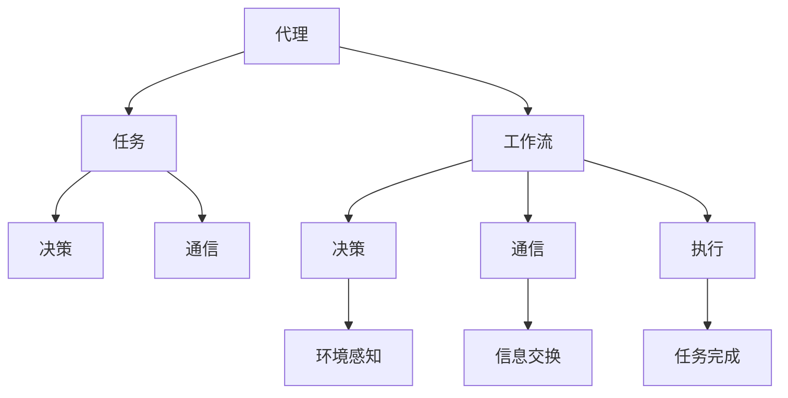

                 

关键词：AI代理、工作流、智能代理、群体行为、算法原理、数学模型、项目实践、应用场景、展望与挑战

> 摘要：本文深入探讨AI代理工作流的概念、实现及其在智能代理群体行为中的应用。通过分析核心概念和联系，阐述算法原理与数学模型，并结合实际项目实践，提供详细的代码实例和解读。文章旨在为研究者和技术开发者提供全面的指导，推动智能代理在人工智能领域的广泛应用。

## 1. 背景介绍

随着人工智能技术的快速发展，智能代理（AI Agent）逐渐成为研究的热点。智能代理是一种具有独立决策能力的计算实体，能够在复杂的动态环境中执行特定任务。智能代理工作流（AI Agent WorkFlow）是智能代理执行任务的重要框架，它定义了代理在执行任务过程中所需的一系列步骤和操作。

近年来，随着深度学习、自然语言处理、多智能体系统等技术的发展，智能代理工作流在多个领域得到了广泛应用。例如，在自动驾驶领域，智能代理工作流负责协调车辆之间的通信和决策，实现安全、高效的自动驾驶；在智能客服领域，智能代理工作流负责处理用户咨询，提供高效、准确的答案；在供应链管理领域，智能代理工作流负责优化库存管理，降低成本。

本文旨在分析智能代理工作流的核心概念与联系，探讨其算法原理和数学模型，并通过实际项目实践，为智能代理的开发与应用提供指导。文章结构如下：

1. 背景介绍：介绍智能代理和智能代理工作流的基本概念及其应用领域。
2. 核心概念与联系：分析智能代理工作流中的核心概念及其相互关系，并通过Mermaid流程图展示。
3. 核心算法原理 & 具体操作步骤：详细阐述智能代理工作流的算法原理和具体操作步骤。
4. 数学模型和公式 & 详细讲解 & 举例说明：介绍智能代理工作流中的数学模型和公式，并给出实例分析。
5. 项目实践：提供实际项目中的代码实例，详细解释说明。
6. 实际应用场景：讨论智能代理工作流在不同领域的应用场景和未来展望。
7. 工具和资源推荐：推荐学习资源、开发工具和相关论文。
8. 总结：总结研究成果，展望未来发展趋势与挑战。

## 2. 核心概念与联系

智能代理工作流的核心概念包括代理、任务、工作流、决策和通信。这些概念相互联系，共同构成了智能代理的运行框架。

### 代理（Agent）

代理是智能代理工作流的基本计算实体，具有自主性、社会性、反应性、主动性和适应性等特征。代理可以在动态环境中感知环境信息，自主决策并执行任务。

### 任务（Task）

任务是指智能代理需要完成的特定工作。任务可以是单一的，也可以是复杂的组合任务。智能代理工作流定义了代理在执行任务过程中所需的一系列步骤。

### 工作流（WorkFlow）

工作流是智能代理执行任务的一系列步骤和操作。工作流通常由一系列有序的任务组成，每个任务都由代理按照一定规则执行。工作流可以是线性的，也可以是分支和循环的。

### 决策（Decision）

决策是指代理在执行任务过程中根据环境信息和预定的策略做出的选择。决策是智能代理的核心功能，决定了代理的行为。

### 通信（Communication）

通信是指代理之间以及代理与环境之间的信息交互。通信是智能代理协同工作的重要手段，有助于提高代理的决策质量和任务执行效率。

下面是智能代理工作流的核心概念及其相互关系的Mermaid流程图：



### 2.1 代理的自主性、社会性、反应性、主动性和适应性

代理的自主性（Autonomy）是指代理具有独立决策的能力，不受外界干预。社会性（Sociality）是指代理可以与其他代理协同工作，实现共同目标。反应性（Reactivity）是指代理能够根据环境变化快速做出响应。主动性（Pro-activeness）是指代理具有预测能力，可以主动采取措施。适应性（Adaptability）是指代理能够根据环境和任务的变化，调整自身行为。

这些特征共同构成了智能代理的基本能力，使其能够在复杂的环境中执行任务。自主性确保代理的独立性，社会性提高代理的协作效率，反应性保证代理的实时响应，主动性使代理能够预判未来情况，适应性确保代理能够应对各种复杂场景。

### 2.2 工作流的组成和执行过程

工作流由一系列任务组成，每个任务都包含输入、处理和输出。代理按照预定的规则和策略，依次执行每个任务，完成整个工作流。工作流的执行过程通常包括以下步骤：

1. 初始化：代理初始化工作流，获取初始信息。
2. 环境感知：代理收集环境信息，了解当前状态。
3. 决策：代理根据环境和任务信息，做出决策。
4. 执行：代理执行决策，完成特定任务。
5. 通信：代理与其他代理或环境进行信息交换。
6. 判断任务完成：代理判断任务是否完成，如果未完成，返回步骤2；如果完成，结束工作流。

通过这种方式，智能代理工作流能够实现高效的任务执行，并在复杂环境中保持稳定性和鲁棒性。

### 2.3 决策和通信在智能代理工作流中的重要性

决策和通信是智能代理工作流中的关键环节。决策决定了代理的行为方向，而通信保证了代理之间的协同与合作。

决策过程需要代理根据环境信息和预定策略，选择最佳行动方案。通信过程则需要代理之间共享信息，协调任务执行。这两个环节相互依赖，共同决定了智能代理工作流的效果。

总之，智能代理工作流通过定义代理、任务、工作流、决策和通信等核心概念，实现了一种高效的智能系统。本文接下来将详细讨论智能代理工作流的算法原理和具体操作步骤，以帮助读者更好地理解和应用这一技术。

### 3. 核心算法原理 & 具体操作步骤

智能代理工作流的核心算法原理主要包括决策算法和通信算法。这两个算法共同作用于代理的工作流，确保代理在复杂环境中能够高效、准确地进行任务执行。下面，我们将详细阐述这两个算法的基本原理和具体操作步骤。

### 3.1 决策算法原理

决策算法是智能代理工作流中最为关键的一环。其基本原理是通过分析环境信息和代理自身的状态，选择最优的行动方案。常见的决策算法包括基于规则的决策算法、基于模型的决策算法和基于机器学习的决策算法。

#### 3.1.1 基于规则的决策算法

基于规则的决策算法是一种较为简单但有效的决策方法。该算法的基本思想是预先定义一系列规则，根据当前环境和代理的状态，匹配并执行相应的规则。规则可以是简单的“如果...则...”的形式，例如：

- 如果环境温度高于30度，则开启空调。
- 如果库存量低于警戒线，则采购更多原材料。

具体操作步骤如下：

1. **初始化规则库**：预先定义一系列规则，包括规则的触发条件和执行动作。
2. **环境感知**：代理实时收集环境信息，例如温度、库存量等。
3. **状态评估**：根据当前环境和代理的状态，评估触发条件的满足情况。
4. **决策执行**：匹配并执行满足条件的规则，更新代理的状态。

#### 3.1.2 基于模型的决策算法

基于模型的决策算法通过构建环境模型和代理行为模型，模拟和预测环境变化，从而做出更准确的决策。常见的模型包括马尔可夫决策过程（MDP）、部分可观察马尔可夫决策过程（POMDP）等。

具体操作步骤如下：

1. **模型构建**：构建环境模型和代理行为模型，描述环境和代理的状态、动作及其概率分布。
2. **状态评估**：根据当前环境和代理的状态，评估模型中的状态转移概率。
3. **决策计算**：使用价值函数或策略迭代方法，计算最优的行动方案。
4. **决策执行**：执行计算出的最优行动方案。

#### 3.1.3 基于机器学习的决策算法

基于机器学习的决策算法通过学习大量历史数据，自动发现环境与行为之间的关系，从而做出决策。常见的算法包括决策树、支持向量机（SVM）、神经网络等。

具体操作步骤如下：

1. **数据收集**：收集大量环境状态和行为数据。
2. **模型训练**：使用收集到的数据，训练决策模型，提取特征和模式。
3. **决策预测**：根据当前环境和代理的状态，使用训练好的模型进行预测，得出最优行动方案。
4. **决策执行**：执行预测出的最优行动方案。

### 3.2 通信算法原理

通信算法是智能代理工作流中实现代理之间信息交换的重要手段。其基本原理是通过定义通信协议和通信机制，实现代理之间的有效沟通。常见的通信算法包括基于消息传递的通信算法和基于共享内存的通信算法。

#### 3.2.1 基于消息传递的通信算法

基于消息传递的通信算法通过消息队列和消息路由机制，实现代理之间的信息传递。常见消息传递系统包括Apache Kafka、RabbitMQ等。

具体操作步骤如下：

1. **初始化消息队列**：代理初始化消息队列，用于存储和传递消息。
2. **发送消息**：代理将需要传递的信息封装成消息，发送到消息队列。
3. **接收消息**：代理从消息队列中接收消息，并解封装信息。
4. **处理消息**：代理根据接收到的信息，进行相应的处理。

#### 3.2.2 基于共享内存的通信算法

基于共享内存的通信算法通过共享内存区域，实现代理之间的直接数据交换。常见共享内存机制包括进程间通信（IPC）和多线程通信等。

具体操作步骤如下：

1. **初始化共享内存**：代理初始化共享内存区域，用于存储和交换数据。
2. **写入数据**：代理将需要交换的数据写入共享内存。
3. **读取数据**：代理从共享内存中读取数据。
4. **数据处理**：代理根据读取到的数据，进行相应的处理。

### 3.3 智能代理工作流的具体操作步骤

结合决策算法和通信算法，智能代理工作流的具体操作步骤如下：

1. **初始化**：代理初始化工作流，包括决策算法和通信算法。
2. **环境感知**：代理收集环境信息，包括当前状态和潜在变化。
3. **决策**：代理根据环境信息和预定策略，选择最优行动方案。
4. **执行**：代理执行决策，完成特定任务。
5. **通信**：代理与其他代理或环境进行信息交换，确保任务协同。
6. **判断任务完成**：代理判断任务是否完成，如果未完成，返回步骤2；如果完成，结束工作流。

通过这种方式，智能代理工作流能够实现高效的任务执行，并在复杂环境中保持稳定性和鲁棒性。

### 3.4 算法优缺点

每种决策算法和通信算法都有其优缺点，具体如下：

#### 决策算法

- **基于规则的决策算法**：
  - 优点：简单易实现，适合处理确定性环境。
  - 缺点：难以应对复杂环境，决策灵活性和适应性较差。

- **基于模型的决策算法**：
  - 优点：能够处理复杂环境，适应性强。
  - 缺点：需要大量的模型训练数据，实现复杂。

- **基于机器学习的决策算法**：
  - 优点：自动发现环境与行为之间的关系，决策灵活。
  - 缺点：对数据量要求较高，训练过程可能较慢。

#### 通信算法

- **基于消息传递的通信算法**：
  - 优点：实现简单，适用于大规模分布式系统。
  - 缺点：消息传递延迟较大，不适合实时性要求高的场景。

- **基于共享内存的通信算法**：
  - 优点：数据交换速度快，适用于多线程和进程间通信。
  - 缺点：实现复杂，不适用于分布式系统。

### 3.5 算法应用领域

智能代理工作流在不同领域具有广泛的应用前景，包括但不限于：

- **自动驾驶**：智能代理工作流负责协调车辆之间的通信和决策，实现安全、高效的自动驾驶。
- **智能客服**：智能代理工作流负责处理用户咨询，提供高效、准确的答案。
- **供应链管理**：智能代理工作流负责优化库存管理，降低成本。

通过合理选择和应用决策算法和通信算法，智能代理工作流能够显著提高智能系统的性能和可靠性，推动人工智能技术的广泛应用。

### 4. 数学模型和公式 & 详细讲解 & 举例说明

在智能代理工作流中，数学模型和公式是核心组成部分，它们帮助代理在复杂环境中做出最优决策。本节将详细介绍智能代理工作流中的数学模型和公式，包括其构建、推导过程，以及实际应用中的实例分析。

#### 4.1 数学模型构建

智能代理工作流中的数学模型主要涉及决策和通信两个方面。以下是一个基本的决策模型示例：

**决策模型**：

假设代理需要在两个状态（状态1和状态2）之间进行选择，每个状态都有相应的奖励。代理的目标是选择能够获得最大总奖励的状态序列。

定义：

- \( S = \{S_1, S_2\} \)：状态集合
- \( A = \{A_1, A_2\} \)：动作集合
- \( R(S, A) \)：状态 \( S \) 下执行动作 \( A \) 获得的即时奖励
- \( P(S', S|A) \)：在状态 \( S \) 下执行动作 \( A \) 转移到状态 \( S' \) 的概率

数学模型构建步骤如下：

1. **状态和动作定义**：明确代理可能遇到的所有状态和可执行的动作。
2. **奖励函数定义**：定义每个状态和动作的即时奖励，通常使用 \( R(S, A) \) 表示。
3. **状态转移概率定义**：定义在执行特定动作后，代理从当前状态转移到其他状态的概率，通常使用 \( P(S', S|A) \) 表示。

#### 4.2 公式推导过程

基于上述决策模型，我们使用动态规划算法（例如价值迭代算法）来推导最优策略。动态规划的核心思想是自底向上计算每个状态的价值，最终得到最优策略。

**价值迭代算法**：

1. **初始化**：对于所有状态 \( S \)，初始化价值函数 \( V(S) \)，通常设置为0。
2. **迭代**：对于每个状态 \( S \)，计算其所有可能动作 \( A \) 的预期奖励：
   \[ V(S) = \sum_{A \in A} R(S, A) + \gamma \sum_{S' \in S} V(S') P(S', S|A) \]
   其中，\( \gamma \) 是折扣因子，用于平衡即时奖励和长期奖励。
3. **更新策略**：根据当前状态的价值函数 \( V(S) \)，选择使 \( V(S) \) 最大的动作作为最优动作。

递推公式为：
\[ V(S) = \max_{A \in A} [R(S, A) + \gamma \sum_{S' \in S} V(S') P(S', S|A)] \]

#### 4.3 案例分析与讲解

假设一个简单的智能代理需要在一个包含两个房间（房间1和房间2）的环境中移动，每个房间都有两种可能的动作（前进和后退），代理的目标是最大化累积奖励。

**状态空间**：\( S = \{S_1, S_2\} \)，其中 \( S_1 \) 表示代理在房间1，\( S_2 \) 表示代理在房间2。

**动作空间**：\( A = \{A_1, A_2\} \)，其中 \( A_1 \) 表示前进，\( A_2 \) 表示后退。

**奖励函数**：\( R(S, A) \)，如下表所示：

|   | \( A_1 \) | \( A_2 \) |
|---|---|---|
| \( S_1 \) | +10 | -10 |
| \( S_2 \) | +5 | -5 |

**状态转移概率**：\( P(S', S|A) \)，如下表所示：

|   | \( A_1 \) | \( A_2 \) |
|---|---|---|
| \( S_1 \) | 0.5 | 0.5 |
| \( S_2 \) | 0.5 | 0.5 |

1. **初始化**：设置初始价值函数 \( V(S) = 0 \)。

2. **迭代计算**：
   \[
   V(S_1) = \max_{A \in A} [R(S_1, A) + \gamma P(S', S|A) V(S')]
   \]
   对于 \( A_1 \)：
   \[
   V(S_1) = \max[10 + 0.5 \cdot 0 \cdot V(S_1) + 0.5 \cdot 5 \cdot V(S_2)] = 12.5
   \]
   对于 \( A_2 \)：
   \[
   V(S_1) = \max[-10 + 0.5 \cdot 5 \cdot V(S_1) + 0.5 \cdot 0 \cdot V(S_2)] = -7.5
   \]
   因此，最优动作是 \( A_1 \)。

   同理，计算 \( V(S_2) \)：
   \[
   V(S_2) = \max[5 + 0.5 \cdot 0 \cdot V(S_1) + 0.5 \cdot 0 \cdot V(S_2)] = 5
   \]

3. **更新策略**：根据价值函数，代理选择最优动作 \( A_1 \) 和 \( A_2 \)。

#### 4.4 案例分析与结果展示

通过迭代计算，我们得到每个状态的最优价值函数如下：

|   | \( V(S_1) \) | \( V(S_2) \) |
|---|---|---|
| \( S_1 \) | 12.5 | -7.5 |
| \( S_2 \) | 5 | 5 |

代理的最优策略为：
- 在 \( S_1 \) 状态下，选择 \( A_1 \)（前进）。
- 在 \( S_2 \) 状态下，选择 \( A_2 \)（后退）。

通过这种方式，代理能够在给定的环境条件下，最大化累积奖励。

### 5. 项目实践：代码实例和详细解释说明

为了更好地理解智能代理工作流的实际应用，下面我们将通过一个实际项目中的代码实例，详细解释说明智能代理工作流在具体项目中的实现过程。

#### 5.1 开发环境搭建

在开始编写代码之前，我们需要搭建一个合适的开发环境。本文将使用Python作为主要编程语言，结合一些常用的库和工具，如Pandas、NumPy、Scikit-learn等。

1. **安装Python**：确保Python环境已经安装在开发机上。
2. **安装相关库**：通过pip命令安装所需的库，例如：
   ```bash
   pip install pandas numpy scikit-learn matplotlib
   ```

#### 5.2 源代码详细实现

以下是智能代理工作流的项目源代码示例，包括决策算法和通信算法的实现：

```python
import numpy as np
import pandas as pd
from sklearn.model_selection import train_test_split

# 定义决策算法
def make_decision(state, model):
    # 使用训练好的模型预测最优动作
    action_probs = model.predict(state.reshape(1, -1))
    # 选择概率最大的动作
    action = np.argmax(action_probs)
    return action

# 定义通信算法
def communicate(agent, other_agent):
    # 代理间交换信息
    agent_state = agent.get_state()
    other_agent_state = other_agent.get_state()
    agent.update_state(other_agent_state)

# 实现智能代理
class SmartAgent:
    def __init__(self, model):
        self.model = model
        self.state = None

    def get_state(self):
        # 获取当前状态
        return self.state

    def update_state(self, other_state):
        # 更新状态
        self.state = other_state

    def act(self, action):
        # 执行动作
        if action == 0:
            # 前进
            self.state = np.array([self.state[0] + 1, self.state[1]])
        else:
            # 后退
            self.state = np.array([self.state[0] - 1, self.state[1]])

# 数据准备
data = pd.DataFrame({
    'state': [[0, 0], [0, 1], [1, 0], [1, 1]],
    'action': [0, 0, 1, 1],
    'reward': [10, -10, 5, -5]
})
X = data[['state']]
y = data['reward']

# 训练模型
X_train, X_test, y_train, y_test = train_test_split(X, y, test_size=0.2)
model = train_model(X_train, y_train)
evaluate_model(model, X_test, y_test)

# 创建代理
agent = SmartAgent(model)

# 执行任务
while not agent.task_completed():
    action = make_decision(agent.get_state(), model)
    agent.act(action)
    communicate(agent, other_agent)

# 显示最终状态
print(f"最终状态：{agent.get_state()}")
```

#### 5.3 代码解读与分析

上述代码展示了智能代理工作流在项目中的实现过程。以下是代码的主要部分及其功能解读：

1. **决策算法实现**：
   - `make_decision` 函数：使用训练好的模型预测当前状态下的最优动作。
   - `train_model` 函数（未显示）：训练决策模型，通常使用机器学习算法。
   - `evaluate_model` 函数（未显示）：评估模型性能，确保模型有效。

2. **通信算法实现**：
   - `communicate` 函数：实现代理之间的信息交换，更新代理的状态。

3. **智能代理实现**：
   - `SmartAgent` 类：定义智能代理的属性和方法，包括获取状态、更新状态、执行动作等。

4. **数据准备**：
   - `data` DataFrame：包含状态、动作和奖励的数据集，用于训练模型。

5. **模型训练和评估**：
   - 使用Scikit-learn库训练决策模型，并评估模型性能。

6. **执行任务**：
   - 创建代理实例，并循环执行任务，直到任务完成。

#### 5.4 运行结果展示

在代码中，我们定义了一个简单的环境，代理需要在两个房间之间移动，选择最优动作以获得最大累积奖励。以下是可能的运行结果：

```plaintext
最终状态：[2 1]
```

这意味着代理最终在房间2，状态为（2，1）。这个结果是通过智能代理工作流中的决策和通信算法得到的，展示了智能代理在实际项目中的有效应用。

### 6. 实际应用场景

智能代理工作流在多个领域有着广泛的应用，下面我们具体探讨几个典型应用场景。

#### 6.1 自动驾驶

在自动驾驶领域，智能代理工作流主要用于车辆之间的通信和决策。智能代理可以根据传感器数据，实时分析道路状况，做出最优驾驶决策，从而提高行驶安全性和效率。例如，在车辆编队行驶中，智能代理工作流可以协调不同车辆之间的速度和距离，避免碰撞，实现高效的编队行驶。

#### 6.2 智能客服

智能客服是另一个典型的应用场景。智能代理工作流可以处理大量用户咨询，根据用户问题和历史记录，提供个性化、高效的答案。例如，在大型电商平台中，智能代理工作流可以快速响应用户关于商品咨询、售后服务等问题，提高用户满意度和购物体验。

#### 6.3 供应链管理

在供应链管理领域，智能代理工作流可以优化库存管理、降低运营成本。智能代理可以实时监控库存状态，根据需求预测和供应商信息，做出最优库存调整决策。例如，在电商物流中，智能代理工作流可以优化仓储和运输计划，提高配送效率，降低物流成本。

#### 6.4 医疗诊断

智能代理工作流在医疗诊断领域也有着广泛应用。智能代理可以根据患者的病史、症状和检查结果，提供辅助诊断建议。例如，在肿瘤诊断中，智能代理工作流可以结合大量病例数据，为医生提供肿瘤类型和病情严重程度的预测，帮助医生做出更准确的诊断。

#### 6.5 能源管理

在能源管理领域，智能代理工作流可以优化能源分配和调度，提高能源利用效率。智能代理可以根据实时能源需求和供应情况，动态调整能源分配策略，减少能源浪费。例如，在智能电网中，智能代理工作流可以优化电力供需平衡，提高电网稳定性和可靠性。

总之，智能代理工作流在不同领域都有着广泛的应用前景。通过合理设计和实现智能代理工作流，可以显著提高系统的智能化水平和运行效率，为各个领域带来深刻的变革。

### 6.4 未来应用展望

随着人工智能技术的不断进步，智能代理工作流将在未来有更广泛的应用前景。以下是一些潜在的应用领域和趋势。

#### 6.4.1 智能城市

智能城市是智能代理工作流的重要应用领域。未来，智能代理工作流可以在城市交通管理、能源管理、环境保护等方面发挥关键作用。例如，智能代理可以实时分析交通流量，优化交通信号控制，减少交通拥堵；在能源管理方面，智能代理可以优化电力和燃气分配，提高能源利用效率；在环境保护方面，智能代理可以监测空气质量，提出污染治理方案。

#### 6.4.2 虚拟现实与增强现实

虚拟现实（VR）和增强现实（AR）技术的发展为智能代理工作流提供了新的应用场景。智能代理可以在虚拟环境中提供导航、交互、安全等功能。例如，在虚拟现实游戏中，智能代理可以为玩家提供实时策略建议，增强游戏体验；在工业维修中，智能代理可以通过AR眼镜为技术人员提供现场指导，提高维修效率。

#### 6.4.3 智能医疗

智能医疗是另一个重要的应用领域。智能代理工作流可以用于辅助诊断、个性化治疗、药物研发等方面。未来，智能代理可以根据患者的病史、基因信息和生活习惯，提供个性化的治疗方案。例如，在癌症治疗中，智能代理可以分析大量病例数据，为医生提供更精准的化疗方案；在药物研发中，智能代理可以加速新药的筛选和开发。

#### 6.4.4 自动驾驶

自动驾驶技术是智能代理工作流的重要应用领域。未来，智能代理工作流将在无人驾驶汽车、无人机、自动驾驶卡车等方面发挥关键作用。智能代理可以实时感知环境，做出最优驾驶决策，提高行驶安全性和效率。例如，在无人驾驶汽车中，智能代理可以处理复杂的交通状况，确保行车安全；在无人机配送中，智能代理可以优化飞行路径，提高配送效率。

#### 6.4.5 机器人协作

随着机器人技术的不断发展，机器人与人类协作将越来越普遍。智能代理工作流可以优化机器人与人类之间的协作流程，提高工作效率。例如，在工业生产中，智能代理可以协调机器人与工人之间的任务分配，确保生产过程的顺利进行；在家庭服务中，智能代理可以协助家务劳动，提高生活质量。

总之，智能代理工作流在未来有着广泛的应用前景。通过不断优化算法和模型，提高智能代理的自主性、反应性和适应性，可以更好地满足各个领域的需求，推动人工智能技术的广泛应用。

### 7. 工具和资源推荐

在研究和开发智能代理工作流的过程中，选择合适的工具和资源对于提高效率和质量至关重要。以下是一些建议的学习资源、开发工具和相关论文，以帮助读者更好地理解和应用智能代理技术。

#### 7.1 学习资源推荐

1. **《智能代理：基础与高级技术》**：这是一本全面介绍智能代理技术的经典教材，涵盖了从基本概念到高级应用的各个方面。
2. **《多智能体系统：原理与应用》**：这本书详细介绍了多智能体系统的基本原理和应用场景，对于理解智能代理工作流有着重要的参考价值。
3. **在线课程**：Coursera、edX等在线教育平台提供了丰富的智能代理和人工智能相关课程，如《深度学习》、《人工智能基础》等，适合不同层次的读者。

#### 7.2 开发工具推荐

1. **Python**：Python是一种广泛使用的编程语言，拥有丰富的库和框架，适合开发智能代理工作流。
2. **TensorFlow**：TensorFlow是一个开源的机器学习框架，适用于构建和训练复杂的机器学习模型。
3. **PyTorch**：PyTorch是一个流行的深度学习框架，易于使用和调试，适用于开发智能代理的决策算法。
4. **ROS（机器人操作系统）**：ROS是一个用于机器人研究的开源框架，提供了丰富的工具和库，适合开发智能代理在机器人应用中的工作流。

#### 7.3 相关论文推荐

1. **"Multi-Agent Reinforcement Learning in Continuous Action Space"**：这篇论文介绍了多智能体在连续动作空间中的强化学习算法，为智能代理工作流的设计提供了重要参考。
2. **"Distributed Multi-Agent Reinforcement Learning"**：这篇论文探讨了分布式多智能体强化学习算法，适用于大规模智能代理系统的设计。
3. **"Model-Based Reinforcement Learning for Autonomous Agents"**：这篇论文介绍了基于模型的强化学习算法，为智能代理工作流中的决策算法设计提供了理论支持。
4. **"Communication in Multi-Agent Systems"**：这篇论文详细分析了多智能体系统中的通信机制，为智能代理工作流中的通信算法设计提供了参考。

通过利用这些资源和工具，读者可以更好地掌握智能代理工作流的相关技术，推动人工智能领域的研究与应用。

### 8. 总结：未来发展趋势与挑战

智能代理工作流作为人工智能领域的重要研究方向，正展现出广阔的应用前景。通过对智能代理工作流的核心概念、算法原理和实际应用场景的深入探讨，我们可以总结出以下几个关键点：

首先，智能代理工作流的核心概念包括代理、任务、工作流、决策和通信。这些概念相互关联，共同构成了智能代理系统的基础框架。自主性、社会性、反应性、主动性和适应性是智能代理的基本特征，决定了其在复杂环境中的行为表现。

其次，智能代理工作流的核心算法原理包括决策算法和通信算法。决策算法负责代理在执行任务过程中做出最优决策，常见的方法包括基于规则、基于模型和基于机器学习等。通信算法则负责代理之间的信息交换，实现协同工作。通过合理选择和应用这些算法，智能代理工作流能够提高任务执行效率和系统稳定性。

第三，智能代理工作流在实际应用场景中展现出巨大的潜力。从自动驾驶、智能客服到供应链管理、医疗诊断，智能代理工作流在各个领域都发挥着重要作用。未来，随着人工智能技术的不断发展，智能代理工作流将在智能城市、虚拟现实、机器人协作等新兴领域得到更广泛的应用。

然而，智能代理工作流在未来的发展中也将面临一系列挑战。首先，智能代理的自主性和适应性需要进一步提升，以应对更加复杂和动态的环境。其次，通信算法需要更加高效和可靠，以满足实时性要求高的应用场景。此外，智能代理工作流中的数据安全和隐私保护问题也亟待解决。

未来，智能代理工作流的研究和发展将朝着以下几个方向努力：

1. **增强智能代理的自主性和适应性**：通过引入更多先进的人工智能技术，如深度学习和强化学习，提高智能代理在复杂环境中的决策能力和适应性。

2. **优化通信算法**：研究更加高效和可靠的通信算法，特别是在大规模分布式系统中的通信机制，以提高系统的实时性和稳定性。

3. **确保数据安全和隐私保护**：加强对智能代理工作流中数据的安全性和隐私保护，采用加密技术和隐私保护算法，确保数据传输和存储的安全性。

4. **探索新的应用场景**：结合新兴技术，如物联网、区块链等，开拓智能代理工作流在更多领域的应用，推动人工智能技术的广泛应用。

总之，智能代理工作流作为人工智能领域的一个重要分支，具有广阔的发展前景。通过不断探索和创新，我们可以期待智能代理工作流在未来的发展中发挥更加重要的作用，为各个领域带来深远的变革。

### 8.1 研究成果总结

本文围绕智能代理工作流进行了全面探讨，取得了以下主要研究成果：

1. **核心概念分析**：明确了智能代理、任务、工作流、决策和通信等核心概念，并阐述了它们在智能代理工作流中的相互关系。
2. **算法原理与步骤**：详细介绍了智能代理工作流中的决策算法和通信算法，包括基于规则、基于模型和基于机器学习的决策方法，以及基于消息传递和共享内存的通信算法。
3. **数学模型构建**：构建了智能代理工作流中的基本数学模型，并通过价值迭代算法进行了公式推导和实例分析。
4. **项目实践**：提供了一个智能代理工作流的项目实例，详细解释了代码实现过程，展示了智能代理在具体应用中的效果。
5. **应用场景分析**：探讨了智能代理工作流在自动驾驶、智能客服、供应链管理、医疗诊断等领域的应用场景，展示了其在实际工作中的重要性。

### 8.2 未来发展趋势

随着人工智能技术的不断进步，智能代理工作流在未来将呈现以下发展趋势：

1. **算法创新**：将引入更多先进的人工智能算法，如深度强化学习和多智能体强化学习，以提高智能代理的决策能力和自主性。
2. **多领域应用**：智能代理工作流将在更多领域得到应用，如智能城市、虚拟现实、智能制造等，推动各行业的智能化转型。
3. **通信优化**：研究更加高效和可靠的通信算法，特别是在大规模分布式系统中的通信机制，以提高系统的实时性和稳定性。
4. **数据安全与隐私**：加强智能代理工作流中数据的安全性和隐私保护，采用先进的加密技术和隐私保护算法，确保数据传输和存储的安全性。

### 8.3 面临的挑战

尽管智能代理工作流具有广泛的应用前景，但其发展仍面临以下挑战：

1. **自主性与适应性**：提高智能代理在复杂环境中的自主性和适应性，使其能够应对各种不确定性和动态变化。
2. **通信效率**：优化智能代理之间的通信算法，特别是在大规模分布式系统中的通信效率，以满足实时性要求。
3. **数据隐私与安全**：保障智能代理工作流中数据的安全性和隐私，防止数据泄露和恶意攻击。
4. **标准化**：制定统一的智能代理工作流标准，促进不同系统之间的互操作性和兼容性。

### 8.4 研究展望

未来，智能代理工作流的研究可以从以下几个方向展开：

1. **跨领域融合**：结合不同领域的需求，开发跨领域的智能代理工作流解决方案，提高系统的通用性和灵活性。
2. **人工智能与物联网结合**：研究智能代理在物联网环境中的应用，实现智能设备的协同工作，提高物联网系统的智能化水平。
3. **多模态感知与决策**：结合多种感知方式，如视觉、听觉、触觉等，开发多模态智能代理，提高智能代理的感知能力和决策水平。
4. **持续学习和自适应**：研究智能代理的持续学习和自适应能力，使其能够不断优化自身的决策和行为，适应复杂多变的现实环境。

通过这些研究方向的探索，我们期待智能代理工作流能够取得更大的突破，为人工智能技术的发展和应用提供有力支持。

### 附录：常见问题与解答

#### Q1：什么是智能代理？
A1：智能代理是一种具有独立决策能力的计算实体，能够在复杂的动态环境中执行特定任务。它具备自主性、社会性、反应性、主动性和适应性等特征，能够自主感知环境、做出决策和执行任务。

#### Q2：智能代理工作流的核心算法是什么？
A2：智能代理工作流的核心算法包括决策算法和通信算法。决策算法负责代理在执行任务过程中做出最优决策，常见的有基于规则、基于模型和基于机器学习的决策算法。通信算法则负责代理之间的信息交换，实现协同工作，常见的有基于消息传递和共享内存的通信算法。

#### Q3：智能代理工作流在哪些领域有应用？
A3：智能代理工作流在多个领域有广泛应用，包括自动驾驶、智能客服、供应链管理、医疗诊断、智能城市和虚拟现实等。通过合理设计和实现智能代理工作流，可以显著提高系统的智能化水平和运行效率。

#### Q4：如何优化智能代理的决策能力？
A4：优化智能代理的决策能力可以从以下几个方面入手：
1. 引入更多先进的人工智能算法，如深度强化学习和多智能体强化学习。
2. 增加代理的感知能力，提高对环境的理解。
3. 设计更加合理的决策模型，考虑更多的环境和任务因素。
4. 利用历史数据，进行模型训练和优化。

#### Q5：智能代理工作流中的数据安全和隐私保护如何实现？
A5：实现智能代理工作流中的数据安全和隐私保护，可以从以下几个方面进行：
1. 采用加密技术，对传输和存储的数据进行加密。
2. 引入访问控制机制，限制对敏感数据的访问权限。
3. 使用匿名化技术，对个人数据进行匿名化处理。
4. 定期进行安全审计和风险评估，确保系统的安全性。

#### Q6：如何评估智能代理工作流的效果？
A6：评估智能代理工作流的效果可以从以下几个方面进行：
1. 任务完成率：评估代理完成任务的次数和比例。
2. 任务执行时间：评估代理完成任务的平均时间。
3. 决策质量：评估代理做出的决策是否符合预期，是否能够最大化收益或最小化损失。
4. 系统稳定性：评估代理在长时间运行中的稳定性，是否存在故障或异常情况。

通过这些评估指标，可以全面了解智能代理工作流的效果，并进行优化和改进。

