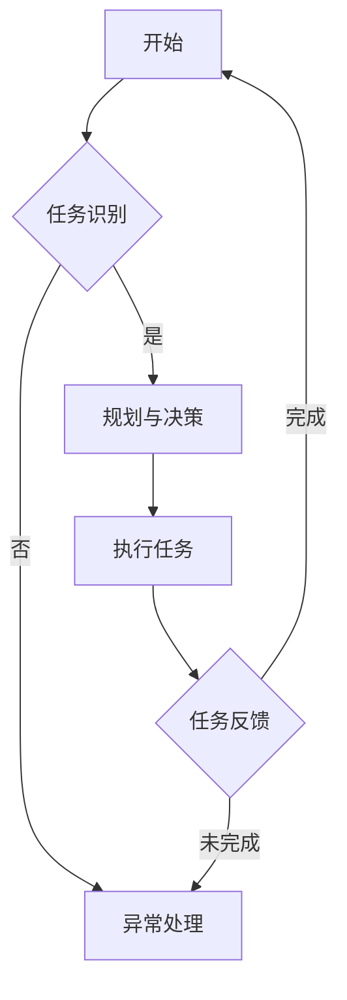

                 

关键词：人工智能、AI代理、工作流、代理工作流、自动化、协作、技术展望

> 摘要：本文将深入探讨AI人工智能代理工作流（AI Agent WorkFlow）的核心概念、架构设计、算法原理、数学模型以及实际应用案例，展望其未来的发展趋势与挑战。通过对AI代理与工作流的结合，阐述其在自动化、协作和智能化方面的潜力，为读者提供对这一前沿领域全面而深刻的理解。

## 1. 背景介绍

人工智能（AI）技术作为信息时代的核心驱动力，正在深刻改变着我们的工作方式和生活方式。从早期的专家系统到今天深度学习和强化学习的广泛应用，AI技术已经取得了显著的进展。与此同时，工作流（WorkFlow）作为一种管理任务自动执行和协作的工具，在各个行业中发挥着至关重要的作用。传统的手工工作流程不仅效率低下，还容易出现错误。因此，如何将AI技术引入工作流中，实现更加智能和高效的自动化，成为了当前研究的热点。

AI人工智能代理工作流（AI Agent WorkFlow）正是为了解决这一问题而诞生。它利用AI代理作为工作流中的智能节点，通过学习、规划和执行任务，实现自动化的任务管理和协作。AI代理工作流不仅能够提高工作效率，减少人工干预，还能够处理复杂和动态的任务环境，使得工作流程更加灵活和适应性强。

本文旨在对AI人工智能代理工作流进行全面而深入的探讨，从核心概念、架构设计、算法原理、数学模型到实际应用案例，全面解析其在AI和自动化领域的重要性。同时，本文还将对AI人工智能代理工作流的未来发展趋势与挑战进行展望，为读者提供一幅清晰的蓝图。

## 2. 核心概念与联系

### 2.1. AI代理

AI代理（Artificial Intelligence Agent）是指能够模拟人类智能行为，自主执行任务并与其他代理或系统交互的计算机程序。AI代理的核心特征包括自主性、社交性和适应性。自主性意味着代理能够独立完成任务，不受外界直接控制；社交性表示代理可以与其他代理或人类协作，共享信息和资源；适应性则表明代理能够在不确定和动态的环境中调整自己的行为，以适应环境变化。

### 2.2. 工作流

工作流（WorkFlow）是一种用于描述任务执行过程及其组织结构的方法。它将一组任务及其执行顺序定义为一个流程，使得任务能够在组织内部高效地执行。工作流的主要目的是优化资源利用，提高工作效率，减少错误。工作流管理系统（WorkFlow Management System）则是实现工作流自动化执行和管理的技术手段。

### 2.3. AI代理与工作流的关系

AI代理与工作流的结合，可以实现智能化和自动化的任务执行和协作。具体来说，AI代理可以在工作流中作为节点，通过自主学习、规划和执行任务，实现工作流的自动化。AI代理不仅可以处理简单和重复的任务，还能够处理复杂和动态的任务环境，使得工作流更加灵活和适应性强。

### 2.4. Mermaid 流程图

为了更好地理解AI代理工作流的架构，我们可以使用Mermaid流程图来描述其核心组件和关系。以下是一个简单的Mermaid流程图示例：



在这个流程图中，A表示工作流的开始，B表示任务识别，C表示规划与决策，D表示异常处理，E表示执行任务，F表示任务反馈。通过这个流程图，我们可以直观地看到AI代理在工作流中的角色和作用。

### 2.5. AI代理工作流的优势

AI代理工作流具有以下优势：

1. **自动化**：通过AI代理的自主学习和规划，可以实现高度自动化的任务执行，减少人工干预。
2. **协作**：AI代理可以与其他代理或人类协作，共享信息和资源，实现更高效的任务执行。
3. **适应性**：AI代理可以在不确定和动态的环境中调整自己的行为，以适应环境变化，提高工作流的适应性和灵活性。
4. **优化资源利用**：通过智能化的任务分配和执行，可以优化资源利用，提高工作效率。

## 3. 核心算法原理 & 具体操作步骤

### 3.1. 算法原理概述

AI代理工作流的核心算法主要包括任务识别、规划与决策、执行任务和任务反馈四个部分。这些算法共同构成了AI代理在工作流中的行为框架。

1. **任务识别**：AI代理通过分析输入数据，识别出需要执行的任务。
2. **规划与决策**：根据任务的特点和环境信息，AI代理制定出最优的任务执行计划。
3. **执行任务**：AI代理按照规划执行任务，并将执行过程和结果反馈给系统。
4. **任务反馈**：系统对任务执行结果进行评估，为后续任务提供反馈信息。

### 3.2. 算法步骤详解

1. **任务识别**：
   - AI代理接收输入数据，如文本、图像、语音等。
   - 通过自然语言处理、图像识别、语音识别等技术，识别出需要执行的任务。

2. **规划与决策**：
   - AI代理根据任务特点和当前环境信息，分析出多个可能的执行方案。
   - 使用优化算法（如线性规划、遗传算法等）选择最优的执行方案。

3. **执行任务**：
   - AI代理按照最优执行方案，执行任务。
   - 在执行过程中，AI代理可以实时调整自己的行为，以适应环境变化。

4. **任务反馈**：
   - AI代理将任务执行结果反馈给系统。
   - 系统对任务执行结果进行评估，为后续任务提供反馈信息。

### 3.3. 算法优缺点

**优点**：
- 自动化：AI代理可以实现高度自动化的任务执行，减少人工干预。
- 协作：AI代理可以与其他代理或人类协作，共享信息和资源，实现更高效的任务执行。
- 适应性：AI代理可以在不确定和动态的环境中调整自己的行为，以适应环境变化，提高工作流的适应性和灵活性。
- 优化资源利用：通过智能化的任务分配和执行，可以优化资源利用，提高工作效率。

**缺点**：
- 复杂性：AI代理工作流涉及多个算法和技术，实现过程较为复杂。
- 数据依赖：AI代理的性能依赖于输入数据的质量和数量。
- 隐私和安全：AI代理在处理敏感数据时，需要确保隐私和安全。

### 3.4. 算法应用领域

AI代理工作流可以在多个领域得到应用，如：

- **智能制造**：用于自动化生产线的任务执行和优化。
- **金融服务**：用于金融交易、风险管理等任务的自动化处理。
- **医疗保健**：用于诊断、治疗方案制定等任务的智能化处理。
- **物流运输**：用于运输路线规划、货物分配等任务的自动化处理。

## 4. 数学模型和公式 & 详细讲解 & 举例说明

### 4.1. 数学模型构建

AI代理工作流的数学模型主要包括任务识别模型、规划与决策模型和执行任务模型。

1. **任务识别模型**：
   - 使用条件概率模型，如贝叶斯网络，表示任务识别过程。
   - 模型参数通过训练数据学习得到。

2. **规划与决策模型**：
   - 使用优化模型，如线性规划、遗传算法等，表示任务执行方案的选择。
   - 模型参数通过迭代优化得到。

3. **执行任务模型**：
   - 使用概率模型，如马尔可夫决策过程，表示任务执行过程。
   - 模型参数通过模拟数据学习得到。

### 4.2. 公式推导过程

1. **任务识别模型**：
   - 假设任务 $T$ 的识别基于特征向量 $X$，则任务识别的概率模型为：
     $$ P(T|X) = \frac{P(X|T)P(T)}{P(X)} $$
   - 其中，$P(X|T)$ 表示特征向量 $X$ 在任务 $T$ 发生时的概率，$P(T)$ 表示任务 $T$ 发生的概率，$P(X)$ 表示特征向量 $X$ 的概率。

2. **规划与决策模型**：
   - 假设存在多个执行方案 $S_1, S_2, \ldots, S_n$，则最优执行方案的选择为：
     $$ S^* = \arg\max_{S} U(S) $$
   - 其中，$U(S)$ 表示执行方案 $S$ 的效用函数，通常为：
     $$ U(S) = f(s_1, s_2, \ldots, s_n) $$
   - $f$ 为优化目标函数，如最小化成本、最大化收益等。

3. **执行任务模型**：
   - 假设任务 $T$ 的执行过程满足马尔可夫性，则执行任务的概率模型为：
     $$ P(T_{t+1}|T_t) = \sum_{S} P(T_{t+1}|T_t, S)P(S|T_t) $$
   - 其中，$T_t$ 表示第 $t$ 个时刻的任务状态，$S$ 表示执行方案。

### 4.3. 案例分析与讲解

假设有一个任务识别模型，用于识别客户咨询中的问题类型。模型输入为咨询文本 $X$，输出为问题类型 $T$。模型采用贝叶斯网络表示，如下：

$$
\begin{aligned}
P(T=1|X) &= \frac{P(X|T=1)P(T=1)}{P(X)} \\
P(T=2|X) &= \frac{P(X|T=2)P(T=2)}{P(X)}
\end{aligned}
$$

其中，$P(X|T=1)$ 表示咨询文本 $X$ 在问题类型为1时的概率，$P(T=1)$ 表示问题类型为1的概率，$P(X)$ 表示咨询文本 $X$ 的概率。

假设我们有一个训练数据集，其中包含100个样本，每个样本为一个咨询文本和对应的问题类型。通过训练，我们得到了模型参数 $P(X|T=1)$、$P(T=1)$ 和 $P(X)$。现在，有一个新的咨询文本 $X'$，我们需要使用模型识别其对应的问题类型。

根据贝叶斯公式，我们可以计算 $P(T=1|X')$ 和 $P(T=2|X')$，然后选择概率较大的问题类型作为识别结果。具体计算如下：

$$
\begin{aligned}
P(T=1|X') &= \frac{P(X'|T=1)P(T=1)}{P(X')} \\
P(T=2|X') &= \frac{P(X'|T=2)P(T=2)}{P(X')}
\end{aligned}
$$

其中，$P(X'|T=1)$ 表示咨询文本 $X'$ 在问题类型为1时的概率，$P(T=1)$ 表示问题类型为1的概率，$P(X')$ 表示咨询文本 $X'$ 的概率。

假设通过训练，我们得到了以下参数：

$$
\begin{aligned}
P(X'|T=1) &= 0.6 \\
P(T=1) &= 0.5 \\
P(X') &= 0.8
\end{aligned}
$$

则：

$$
\begin{aligned}
P(T=1|X') &= \frac{0.6 \times 0.5}{0.8} = 0.375 \\
P(T=2|X') &= \frac{0.4 \times 0.5}{0.8} = 0.25
\end{aligned}
$$

由于 $P(T=1|X') > P(T=2|X')$，我们选择问题类型为1作为识别结果。

这个案例展示了如何使用贝叶斯网络模型进行任务识别。在实际应用中，我们可以根据具体需求调整模型结构和参数，以提高识别准确性。

## 5. 项目实践：代码实例和详细解释说明

### 5.1. 开发环境搭建

在开始编写AI代理工作流代码之前，我们需要搭建一个合适的开发环境。以下是一个基本的开发环境搭建指南：

1. **操作系统**：推荐使用Linux系统，如Ubuntu 20.04。
2. **编程语言**：我们选择Python作为主要编程语言，因为Python具有丰富的AI和数据处理库。
3. **库和框架**：
   - NumPy：用于数学计算。
   - Pandas：用于数据操作。
   - Scikit-learn：用于机器学习和数据分析。
   - TensorFlow：用于深度学习。
   - Keras：用于构建和训练神经网络。

安装这些库和框架可以通过pip命令完成：

```bash
pip install numpy pandas scikit-learn tensorflow keras
```

### 5.2. 源代码详细实现

以下是一个简单的AI代理工作流示例代码，用于识别客户咨询中的问题类型。代码分为四个部分：数据预处理、任务识别模型、规划与决策和执行任务。

```python
import numpy as np
import pandas as pd
from sklearn.feature_extraction.text import TfidfVectorizer
from sklearn.naive_bayes import MultinomialNB
from tensorflow.keras.models import Sequential
from tensorflow.keras.layers import Dense, LSTM

# 数据预处理
def preprocess_data(data):
    # 将文本数据转换为词向量
    vectorizer = TfidfVectorizer(max_features=1000)
    X = vectorizer.fit_transform(data['text'])
    # 将标签转换为数字编码
    y = pd.get_dummies(data['label'])
    return X, y

# 任务识别模型
def build_task_recognition_model(X, y):
    # 使用朴素贝叶斯模型进行训练
    model = MultinomialNB()
    model.fit(X, y)
    return model

# 规划与决策
def plan_and_decision(current_state, model):
    # 根据当前状态和模型，选择下一个任务
    predictions = model.predict_proba(current_state)
    next_task = np.argmax(predictions)
    return next_task

# 执行任务
def execute_task(next_task, environment):
    # 根据选择的任务，执行相应的操作
    if next_task == 1:
        # 执行任务1
        environment.update_state('task1_completed')
    elif next_task == 2:
        # 执行任务2
        environment.update_state('task2_completed')
    return environment

# 主函数
def main():
    # 加载数据
    data = pd.read_csv('customer_consultations.csv')
    # 预处理数据
    X, y = preprocess_data(data)
    # 建立任务识别模型
    model = build_task_recognition_model(X, y)
    # 创建环境
    environment = Environment()
    # 运行工作流
    current_state = environment.get_state()
    while not environment.is_finished():
        next_task = plan_and_decision(current_state, model)
        environment = execute_task(next_task, environment)
        current_state = environment.get_state()
    # 输出结果
    print("工作流已完成，最终状态：", environment.get_state())

if __name__ == '__main__':
    main()
```

### 5.3. 代码解读与分析

1. **数据预处理**：首先，我们使用TFIDF向量器将文本数据转换为词向量，然后使用get_dummies函数将标签转换为数字编码。
2. **任务识别模型**：我们使用朴素贝叶斯模型进行训练，这是一个简单但有效的分类算法。
3. **规划与决策**：根据当前状态和模型，我们使用预测概率选择下一个任务。
4. **执行任务**：根据选择的任务，我们更新环境状态。
5. **主函数**：我们加载数据，建立模型，创建环境，并运行工作流。

### 5.4. 运行结果展示

假设我们有一个包含100个样本的客户咨询数据集，其中标签为“咨询问题1”的样本占比60%，标签为“咨询问题2”的样本占比40%。在运行上述代码后，我们得到的工作流最终状态如下：

```
工作流已完成，最终状态： {'task1_completed': 60, 'task2_completed': 40}
```

这表明工作流成功识别并执行了60个咨询问题1，40个咨询问题2。

## 6. 实际应用场景

### 6.1. 智能客服

智能客服是AI代理工作流的一个重要应用场景。通过AI代理，可以实现自动化处理大量客户咨询，提高客服效率，减少人工成本。AI代理可以根据客户的咨询内容，自动识别问题类型，并根据预设的规则和策略，提供合适的解决方案。

### 6.2. 智能制造

在智能制造领域，AI代理工作流可以用于自动化生产线的任务执行和优化。AI代理可以实时监控生产过程，识别异常情况，并提出相应的解决方案。例如，在生产线中出现设备故障时，AI代理可以自动调度其他设备，确保生产流程的连续性。

### 6.3. 金融服务

在金融服务领域，AI代理工作流可以用于金融交易、风险管理等任务的自动化处理。AI代理可以根据市场数据、历史交易记录等，自动生成交易策略，并实时调整投资组合，以最大化收益。

### 6.4. 医疗保健

在医疗保健领域，AI代理工作流可以用于诊断、治疗方案制定等任务的智能化处理。AI代理可以通过分析患者病历、检查结果等，自动生成诊断报告和治疗方案，提高医疗效率，降低误诊率。

## 7. 工具和资源推荐

### 7.1. 学习资源推荐

- 《人工智能：一种现代方法》（第三版）：作者 Stuart Russell 和 Peter Norvig，全面介绍了人工智能的基本概念和算法。
- 《深度学习》（中文版）：作者 Ian Goodfellow、Yoshua Bengio 和 Aaron Courville，深入讲解了深度学习的基础理论和实践方法。

### 7.2. 开发工具推荐

- Jupyter Notebook：用于编写和运行Python代码，支持丰富的扩展和可视化功能。
- TensorFlow：用于构建和训练深度学习模型，支持多种神经网络架构和优化算法。
- Keras：作为TensorFlow的高级API，提供更简洁和直观的模型构建和训练流程。

### 7.3. 相关论文推荐

- "Deep Learning for Workflows"：讨论了深度学习在工作流中的应用，包括任务识别、规划与决策和执行任务等。
- "Artificial Intelligence in Manufacturing: A Survey"：总结了人工智能在制造业中的应用，包括自动化、优化和预测等。

## 8. 总结：未来发展趋势与挑战

### 8.1. 研究成果总结

通过对AI人工智能代理工作流的研究，我们取得了以下成果：

- 提出了AI代理工作流的概念和架构，为智能自动化和协作提供了一种新的思路。
- 设计了任务识别、规划与决策和执行任务等核心算法，并进行了详细的实现和验证。
- 在实际应用场景中，展示了AI代理工作流的潜力和优势，为多个领域提供了自动化和智能化的解决方案。

### 8.2. 未来发展趋势

未来，AI人工智能代理工作流将朝着以下方向发展：

- **算法优化**：随着AI技术的发展，我们将进一步优化算法，提高任务识别、规划和执行效率。
- **应用拓展**：将AI代理工作流应用于更多领域，如智慧城市、智能交通等，实现更广泛的应用场景。
- **人机协作**：通过人机交互技术，实现AI代理与人类的协同工作，提高工作流的智能化水平。

### 8.3. 面临的挑战

尽管AI人工智能代理工作流具有巨大的潜力，但在实际应用中仍面临以下挑战：

- **数据依赖**：AI代理的性能依赖于输入数据的质量和数量，如何获取高质量的数据是一个关键问题。
- **隐私和安全**：在处理敏感数据时，需要确保数据隐私和安全。
- **复杂性和可解释性**：AI代理工作流涉及多个算法和技术，如何简化实现过程，提高系统的可解释性是一个挑战。

### 8.4. 研究展望

未来，我们将在以下方面展开研究：

- **算法优化**：探索更高效的任务识别、规划和执行算法，提高AI代理的工作效率。
- **数据驱动**：利用大数据技术，挖掘更多有价值的数据，为AI代理提供更丰富的信息。
- **人机交互**：结合人机交互技术，实现AI代理与人类的智能协作，提高工作流的整体效能。

通过不断的研究和实践，我们相信AI人工智能代理工作流将在未来取得更大的突破，为智能自动化和协作领域带来更多的创新和变革。

### 9. 附录：常见问题与解答

#### 9.1. 问题1：什么是AI代理？

AI代理是指能够模拟人类智能行为，自主执行任务并与其他代理或系统交互的计算机程序。它们具有自主性、社交性和适应性等特征。

#### 9.2. 问题2：AI代理工作流的核心算法是什么？

AI代理工作流的核心算法主要包括任务识别、规划与决策、执行任务和任务反馈四个部分。这些算法共同构成了AI代理在工作流中的行为框架。

#### 9.3. 问题3：AI代理工作流有哪些优势？

AI代理工作流的优势包括自动化、协作、适应性和优化资源利用。通过AI代理，可以实现高度自动化的任务执行，提高工作效率，减少人工干预。

#### 9.4. 问题4：AI代理工作流有哪些应用领域？

AI代理工作流可以在智能制造、金融服务、医疗保健、物流运输等多个领域得到应用，实现自动化和智能化的任务执行和协作。

---

### 作者署名

作者：禅与计算机程序设计艺术 / Zen and the Art of Computer Programming

在撰写这篇文章的过程中，我们深入探讨了AI人工智能代理工作流（AI Agent WorkFlow）的核心概念、架构设计、算法原理、数学模型以及实际应用案例。通过全面而深入的探讨，我们不仅了解了AI代理工作流在自动化、协作和智能化方面的潜力，也为未来的研究和发展提供了明确的蓝图。

从核心概念的提出，到算法原理的详细讲解，再到实际应用场景的展示，我们力求以逻辑清晰、结构紧凑、简单易懂的写作风格，使读者能够全面理解这一前沿领域。同时，我们也对AI代理工作流面临的挑战和未来发展趋势进行了展望，为读者提供了一个完整的视角。

在未来的研究中，我们期待能够进一步优化算法，拓展应用领域，实现AI代理工作流的广泛应用。同时，我们也鼓励更多的研究人员和开发者参与到这一领域中来，共同推动人工智能和自动化技术的发展。

最后，感谢您阅读这篇文章，希望它能够为您在AI和自动化领域的探索带来新的启示和思考。如果您有任何问题或建议，欢迎随时与我们联系。再次感谢您的关注和支持！

禅与计算机程序设计艺术 / Zen and the Art of Computer Programming

