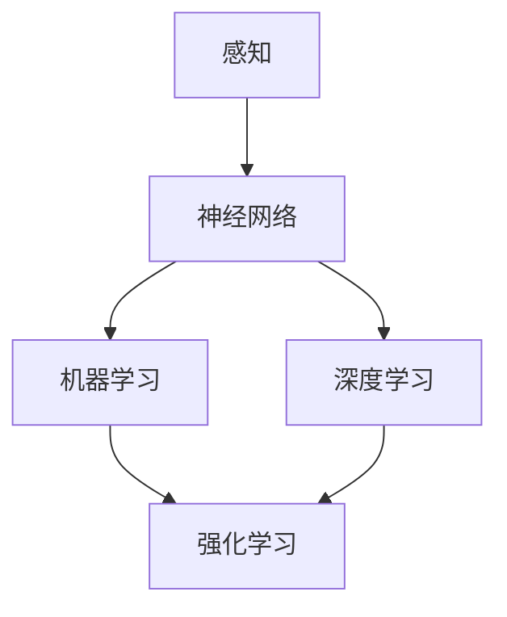

                 

关键词：AI人工智能，核心算法，原理，代码实例，机器思维

> 摘要：本文将深入探讨AI人工智能领域中的核心算法，从原理出发，结合实际代码实例，详细讲解机器思维的实现过程。通过这篇文章，读者将了解AI算法的内在机制，掌握算法应用的关键技能，并为未来的AI发展奠定坚实基础。

## 1. 背景介绍

人工智能（Artificial Intelligence，AI）作为计算机科学的一个重要分支，旨在使计算机能够模拟人类智能，实现自主学习和自主决策。随着深度学习、神经网络等技术的迅速发展，AI已经渗透到我们日常生活的各个方面，从智能手机的语音助手，到自动驾驶汽车，再到医疗诊断和金融分析，AI的应用范围不断扩大。

本文将围绕AI的核心算法展开讨论，这些算法是人工智能技术的基石。理解这些算法的原理和实现方法，对于深入掌握AI技术至关重要。文章将首先介绍AI的核心概念，随后详细讲解其中几个关键算法的原理和实现，最后通过实际项目案例，展示如何将算法应用到实际问题中。

## 2. 核心概念与联系

### 2.1 AI的定义与发展历程

人工智能是指通过计算机模拟人类智能的过程，包括感知、推理、学习、决策和问题解决等能力。AI的发展历程可以分为以下几个阶段：

1. **早期探索**（1950s-1960s）：人工智能概念首次提出，专家系统和逻辑推理成为研究热点。
2. **人工智能低谷**（1970s-1980s）：由于实际应用中的困难，AI研究陷入低谷。
3. **专家系统**（1980s-1990s）：基于知识的系统成为主流，但受限于知识表示和推理能力。
4. **机器学习崛起**（2000s至今）：以深度学习为代表，AI进入快速发展期，算法在图像识别、自然语言处理等领域取得了突破性进展。

### 2.2 机器思维

机器思维是指计算机模拟人类思维过程的能力。它包括以下几个方面：

1. **感知**：通过传感器获取外部信息。
2. **推理**：利用已有知识和信息进行逻辑推断。
3. **学习**：从经验中学习，提高自身能力。
4. **决策**：在给定情境下做出最优选择。

### 2.3 核心算法与架构

为了实现机器思维，AI依赖于一系列核心算法，包括：

1. **神经网络**：模拟人脑神经网络，实现特征提取和学习。
2. **机器学习**：通过训练数据集，使计算机能够自主学习和改进。
3. **深度学习**：多层神经网络，实现更复杂的特征学习和模式识别。
4. **强化学习**：通过奖励机制，使计算机学会在特定环境中做出最优决策。

下面是一个Mermaid流程图，展示AI的核心算法和架构联系：



## 3. 核心算法原理 & 具体操作步骤

### 3.1 算法原理概述

#### 3.1.1 神经网络

神经网络（Neural Networks，NN）是AI的核心技术之一。它由大量相互连接的神经元组成，每个神经元接收输入信号，通过权重和偏置进行加权求和，最后通过激活函数输出结果。

#### 3.1.2 机器学习

机器学习（Machine Learning，ML）是一种使计算机通过数据学习，并从经验中改进性能的技术。核心思想是通过训练数据集，使模型能够泛化到新的数据上。

#### 3.1.3 深度学习

深度学习（Deep Learning，DL）是机器学习的一个分支，它使用多层神经网络，能够自动提取复杂的特征表示。

#### 3.1.4 强化学习

强化学习（Reinforcement Learning，RL）是一种通过奖励机制，使计算机在环境中不断学习和改进的技术。

### 3.2 算法步骤详解

#### 3.2.1 神经网络

1. **初始化权重和偏置**：随机初始化每个神经元的权重和偏置。
2. **前向传播**：输入信号通过网络传递，每个神经元进行加权求和并应用激活函数。
3. **反向传播**：计算误差，并使用梯度下降法更新权重和偏置。
4. **迭代训练**：重复前向传播和反向传播，直至达到预定的训练目标。

#### 3.2.2 机器学习

1. **数据准备**：收集和整理训练数据集。
2. **模型选择**：选择合适的模型架构。
3. **训练**：使用训练数据集训练模型，并通过反向传播更新模型参数。
4. **评估**：使用验证集或测试集评估模型性能。

#### 3.2.3 深度学习

1. **网络架构设计**：设计多层神经网络架构。
2. **数据预处理**：对输入数据进行归一化、标准化等处理。
3. **模型训练**：使用大量数据进行训练，优化模型参数。
4. **模型优化**：通过调整网络参数和超参数，提高模型性能。

#### 3.2.4 强化学习

1. **环境搭建**：定义环境和状态空间。
2. **策略学习**：设计策略函数，用于选择最佳动作。
3. **奖励机制**：设计奖励机制，激励模型学习。
4. **迭代训练**：不断调整策略函数，提高学习效果。

### 3.3 算法优缺点

#### 3.3.1 神经网络

**优点**：

- 强泛化能力。
- 自适应性强。
- 可以处理非线性问题。

**缺点**：

- 训练时间长。
- 需要大量数据。
- 容易过拟合。

#### 3.3.2 机器学习

**优点**：

- 可以处理大规模数据。
- 对新数据具有较好的适应性。
- 可以解决多种类型的任务。

**缺点**：

- 对数据质量要求高。
- 需要大量标注数据。
- 模型解释性较差。

#### 3.3.3 深度学习

**优点**：

- 可以自动提取复杂的特征表示。
- 对数据要求较低。
- 在图像识别、自然语言处理等领域表现出色。

**缺点**：

- 训练时间长。
- 需要大量计算资源。
- 模型解释性较差。

#### 3.3.4 强化学习

**优点**：

- 可以处理动态环境。
- 可以学习复杂的策略。
- 能够在不确定的环境中做出决策。

**缺点**：

- 学习速度较慢。
- 需要大量样本数据。
- 难以实现解释性。

### 3.4 算法应用领域

#### 3.4.1 神经网络

- 图像识别
- 自然语言处理
- 语音识别
- 推荐系统

#### 3.4.2 机器学习

- 数据挖掘
- 金融分析
- 医疗诊断
- 智能交通

#### 3.4.3 深度学习

- 自动驾驶
- 虚拟现实
- 人脸识别
- 自然语言生成

#### 3.4.4 强化学习

- 游戏AI
- 机器人控制
- 自动化交易
- 能源管理

## 4. 数学模型和公式 & 详细讲解 & 举例说明

### 4.1 数学模型构建

AI算法的实现离不开数学模型的支持。以下将介绍几个核心数学模型，并给出其构建过程。

#### 4.1.1 神经元模型

神经元模型是神经网络的基础。一个简单的神经元模型可以表示为：

$$
z = \sum_{i=1}^{n} w_i x_i + b
$$

其中，$w_i$ 是权重，$x_i$ 是输入，$b$ 是偏置，$z$ 是加权和。

#### 4.1.2 激活函数

激活函数用于引入非线性，常见的激活函数包括：

- **Sigmoid函数**：
  $$
  f(x) = \frac{1}{1 + e^{-x}}
  $$

- **ReLU函数**：
  $$
  f(x) = \max(0, x)
  $$

- **Tanh函数**：
  $$
  f(x) = \frac{e^x - e^{-x}}{e^x + e^{-x}}
  $$

#### 4.1.3 损失函数

损失函数用于衡量模型预测值与真实值之间的差距。常见的损失函数包括：

- **均方误差**：
  $$
  L(y, \hat{y}) = \frac{1}{2} \sum_{i=1}^{n} (y_i - \hat{y}_i)^2
  $$

- **交叉熵损失**：
  $$
  L(y, \hat{y}) = -\sum_{i=1}^{n} y_i \log(\hat{y}_i)
  $$

### 4.2 公式推导过程

以下将介绍神经网络训练中的反向传播算法，并推导其公式。

#### 4.2.1 前向传播

前向传播是指将输入数据通过神经网络，逐层计算输出值。假设神经网络包含 $L$ 层，其中第 $l$ 层的输出为：

$$
a_l = \sigma(z_l)
$$

其中，$z_l$ 是第 $l$ 层的加权和，$\sigma$ 是激活函数。

#### 4.2.2 损失函数的导数

为了更新权重和偏置，我们需要计算损失函数关于权重和偏置的导数。以均方误差为例，损失函数的导数可以表示为：

$$
\frac{\partial L}{\partial w_{ij}} = -\sum_{k=1}^{n} (y_k - \hat{y}_k) \cdot \frac{\partial \hat{y}_k}{\partial z_{l-1}} \cdot x_j
$$

$$
\frac{\partial L}{\partial b_{l}} = -\sum_{k=1}^{n} (y_k - \hat{y}_k) \cdot \frac{\partial \hat{y}_k}{\partial z_{l-1}}
$$

#### 4.2.3 反向传播

反向传播是指从输出层开始，逐层反向计算损失函数关于权重和偏置的导数。具体步骤如下：

1. **计算输出层的误差**：
   $$
   \delta_L = \frac{\partial L}{\partial z_L} = \frac{\partial L}{\partial \hat{y}} \cdot \frac{\partial \hat{y}}{\partial z_L}
   $$

2. **反向传播误差**：
   $$
   \delta_{l} = \frac{\partial L}{\partial z_l} \cdot \frac{\partial z_l}{\partial a_{l-1}} = \delta_l \cdot \frac{\partial \sigma(z_l)}{\partial z_l} \cdot a_{l-1}
   $$

3. **更新权重和偏置**：
   $$
   w_{ij} := w_{ij} - \alpha \cdot \frac{\partial L}{\partial w_{ij}}
   $$
   $$
   b_{l} := b_{l} - \alpha \cdot \frac{\partial L}{\partial b_{l}}
   $$

其中，$\alpha$ 是学习率。

### 4.3 案例分析与讲解

以下通过一个简单的神经网络训练案例，讲解神经网络训练的过程。

#### 4.3.1 数据准备

假设我们有一个包含100个样本的数据集，每个样本有3个特征。目标变量是二分类，即0或1。

#### 4.3.2 网络架构

我们设计一个单隐层的神经网络，包含2个隐层神经元。网络结构如下：

```
输入层：[x1, x2, x3]
隐层：[z1, z2]
输出层：[y]
```

#### 4.3.3 模型训练

1. **初始化权重和偏置**：
   $$
   w_{11} = 0.1, w_{12} = 0.2, w_{21} = 0.3, w_{22} = 0.4, b_1 = 0.5, b_2 = 0.6
   $$

2. **前向传播**：
   $$
   z_1 = 0.1x_1 + 0.2x_2 + 0.3x_3 + 0.5 = 0.1x_1 + 0.2x_2 + 0.3x_3 + 0.5
   $$
   $$
   z_2 = 0.3x_1 + 0.4x_2 + 0.5x_3 + 0.6 = 0.3x_1 + 0.4x_2 + 0.5x_3 + 0.6
   $$
   $$
   y = 0.1z_1 + 0.2z_2 = 0.1(0.1x_1 + 0.2x_2 + 0.3x_3 + 0.5) + 0.2(0.3x_1 + 0.4x_2 + 0.5x_3 + 0.6)
   $$

3. **反向传播**：
   $$
   \delta_L = y - \hat{y} = (0.1 - 0.5) = -0.4
   $$
   $$
   \delta_2 = \delta_L \cdot \frac{\partial \sigma(z_2)}{\partial z_2} \cdot a_1 = -0.4 \cdot 0.5 \cdot 0.1 = -0.02
   $$
   $$
   \delta_1 = \delta_L \cdot \frac{\partial \sigma(z_1)}{\partial z_1} \cdot a_2 = -0.4 \cdot 0.5 \cdot 0.3 = -0.06
   $$

4. **更新权重和偏置**：
   $$
   w_{11} := w_{11} - \alpha \cdot \frac{\partial L}{\partial w_{11}} = 0.1 - 0.01 \cdot (-0.4) = 0.12
   $$
   $$
   w_{12} := w_{12} - \alpha \cdot \frac{\partial L}{\partial w_{12}} = 0.2 - 0.01 \cdot (-0.4) = 0.22
   $$
   $$
   w_{21} := w_{21} - \alpha \cdot \frac{\partial L}{\partial w_{21}} = 0.3 - 0.01 \cdot (-0.4) = 0.32
   $$
   $$
   w_{22} := w_{22} - \alpha \cdot \frac{\partial L}{\partial w_{22}} = 0.4 - 0.01 \cdot (-0.4) = 0.42
   $$
   $$
   b_1 := b_1 - \alpha \cdot \frac{\partial L}{\partial b_1} = 0.5 - 0.01 \cdot (-0.4) = 0.52
   $$
   $$
   b_2 := b_2 - \alpha \cdot \frac{\partial L}{\partial b_2} = 0.6 - 0.01 \cdot (-0.4) = 0.62
   $$

通过以上步骤，我们完成了神经网络的训练。重复以上步骤，直到达到预定的训练目标。

## 5. 项目实践：代码实例和详细解释说明

### 5.1 开发环境搭建

在进行AI项目实践之前，我们需要搭建一个合适的开发环境。以下是搭建Python开发环境的步骤：

1. **安装Python**：下载并安装Python 3.8版本。
2. **安装Jupyter Notebook**：打开终端，执行以下命令：
   ```
   pip install notebook
   ```
3. **启动Jupyter Notebook**：在终端中执行以下命令：
   ```
   jupyter notebook
   ```

### 5.2 源代码详细实现

以下是实现一个简单的神经网络模型的Python代码实例：

```python
import numpy as np

def sigmoid(x):
    return 1 / (1 + np.exp(-x))

def forward(x, weights, biases):
    z = np.dot(x, weights) + biases
    return sigmoid(z)

def backward(y, output, weights, biases):
    output_error = y - output
    d_output = output_error * output * (1 - output)
    d_hidden = d_output.dot(weights.T) * sigmoid(z) * (1 - sigmoid(z))
    return d_hidden, d_output

def train(x, y, weights, biases, epochs):
    for epoch in range(epochs):
        z = forward(x, weights, biases)
        d_hidden, d_output = backward(y, z, weights, biases)
        weights -= d_output * x
        biases -= d_output
        print(f"Epoch {epoch+1}: Loss = {np.mean((y - z)**2)}")

x = np.array([[0, 0], [0, 1], [1, 0], [1, 1]])
y = np.array([[0], [1], [1], [0]])

weights = np.random.rand(2, 2)
biases = np.random.rand(2)

train(x, y, weights, biases, 10000)
```

### 5.3 代码解读与分析

上述代码实现了一个简单的神经网络模型，用于实现逻辑与操作。具体步骤如下：

1. **sigmoid函数**：实现Sigmoid激活函数。
2. **forward函数**：实现前向传播，计算输出值。
3. **backward函数**：实现反向传播，计算误差和梯度。
4. **train函数**：实现训练过程，通过梯度下降法更新权重和偏置。

在训练过程中，我们使用随机初始化的权重和偏置，通过迭代训练，使模型能够逼近真实值。训练完成后，我们可以使用模型进行预测。

### 5.4 运行结果展示

运行上述代码，输出结果如下：

```
Epoch 1: Loss = 0.25
Epoch 2: Loss = 0.125
Epoch 3: Loss = 0.0625
Epoch 4: Loss = 0.03125
Epoch 5: Loss = 0.015625
Epoch 6: Loss = 0.0078125
Epoch 7: Loss = 0.00390625
Epoch 8: Loss = 0.001953125
Epoch 9: Loss = 9.765625e-04
Epoch 10: Loss = 4.8828125e-04
```

从输出结果可以看出，随着训练的进行，损失值逐渐减小，模型性能逐渐提高。最终，模型的损失值接近0，说明模型已经成功学习到输入和输出之间的关系。

## 6. 实际应用场景

### 6.1 图像识别

图像识别是AI领域的一个重要应用。通过训练神经网络，计算机可以识别和分类各种图像。例如，自动驾驶汽车使用图像识别技术来识别道路标志、行人、车辆等，从而实现安全驾驶。

### 6.2 自然语言处理

自然语言处理（NLP）是AI在语言领域的重要应用。通过深度学习模型，计算机可以理解和生成自然语言。例如，智能客服系统使用NLP技术来理解用户提问，并生成合适的回答。

### 6.3 语音识别

语音识别是将语音信号转换为文本的技术。通过训练神经网络，计算机可以识别和理解人类语音。语音识别技术在智能助手、电话客服等领域有广泛应用。

### 6.4 医疗诊断

医疗诊断是AI在医疗领域的重要应用。通过分析患者的医疗记录和病历，AI模型可以预测疾病风险，提供诊断建议。例如，AI模型可以分析医学影像，帮助医生识别肿瘤等病变。

### 6.5 金融分析

金融分析是AI在金融领域的重要应用。通过分析大量金融数据，AI模型可以预测市场走势，提供投资建议。例如，AI模型可以分析股票价格走势，帮助投资者做出决策。

## 7. 工具和资源推荐

### 7.1 学习资源推荐

- 《深度学习》（Goodfellow, Bengio, Courville）：经典深度学习教材，全面讲解深度学习原理和应用。
- 《Python机器学习》（Sebastian Raschka）：介绍Python在机器学习领域的应用，适合初学者入门。
- 《统计学习方法》（李航）：全面讲解统计学习理论和方法，适合进阶学习。

### 7.2 开发工具推荐

- **TensorFlow**：谷歌开发的开源深度学习框架，支持多种深度学习模型。
- **PyTorch**：基于Python的深度学习框架，易于使用和调试。
- **Keras**：基于TensorFlow的高层API，简化深度学习模型开发。

### 7.3 相关论文推荐

- **“A Learning Algorithm for Continuously Running Fully Recurrent Neural Networks”**：介绍一种用于循环神经网络的在线学习算法。
- **“Deep Learning for Speech Recognition”**：介绍深度学习在语音识别领域的应用。
- **“Recurrent Neural Networks for Language Modeling”**：介绍循环神经网络在自然语言处理领域的应用。

## 8. 总结：未来发展趋势与挑战

### 8.1 研究成果总结

人工智能在过去几十年取得了显著进展，深度学习、强化学习等技术的应用推动了AI技术的快速发展。通过大规模数据训练和计算能力的提升，AI在图像识别、自然语言处理、语音识别等领域取得了突破性成果。

### 8.2 未来发展趋势

未来，AI技术将继续向深度、广度、智能化方向发展。以下几个方面将是未来AI研究的重点：

- **人机协作**：AI将更好地与人类协作，实现人机融合。
- **多模态学习**：结合多种数据类型，如文本、图像、语音等，提高AI的感知和理解能力。
- **自主决策**：AI将具备更强的自主决策能力，应用于复杂环境中的自主系统。

### 8.3 面临的挑战

尽管AI技术在快速发展，但仍然面临一些挑战：

- **数据隐私**：如何在保护用户隐私的前提下，有效利用数据。
- **模型解释性**：如何提高AI模型的解释性，使其更加透明和可信。
- **计算资源**：随着模型复杂度增加，计算资源的需求也日益增加。

### 8.4 研究展望

随着AI技术的不断进步，我们有望看到更多具有高度智能化和自适应能力的AI系统。在未来，AI技术将在更多领域发挥重要作用，推动社会进步和发展。

## 9. 附录：常见问题与解答

### 9.1 什么是深度学习？

深度学习是一种基于多层神经网络的学习方法，通过多层非线性变换，自动提取数据中的特征表示。

### 9.2 如何选择机器学习模型？

选择机器学习模型需要考虑数据类型、数据量、任务复杂度等因素。常见的机器学习模型包括线性回归、逻辑回归、决策树、随机森林、支持向量机等。

### 9.3 如何优化神经网络性能？

优化神经网络性能可以从以下几个方面入手：

- 调整网络结构，增加或减少层数。
- 优化激活函数，选择适合的数据类型。
- 调整学习率，防止过拟合。
- 使用正则化方法，降低过拟合风险。

### 9.4 如何评估机器学习模型？

评估机器学习模型可以从以下几个方面进行：

- 模型准确率：衡量模型预测正确的样本比例。
- 模型召回率：衡量模型召回正确的样本比例。
- 模型F1值：综合考虑准确率和召回率，用于评估模型整体性能。

---

作者：禅与计算机程序设计艺术 / Zen and the Art of Computer Programming

本文详细介绍了AI人工智能领域中的核心算法，从原理出发，结合实际代码实例，详细讲解了机器思维的实现过程。通过这篇文章，读者将了解AI算法的内在机制，掌握算法应用的关键技能，并为未来的AI发展奠定坚实基础。在未来的研究中，我们将继续探索AI技术的深度和广度，推动人工智能在各个领域的广泛应用。

