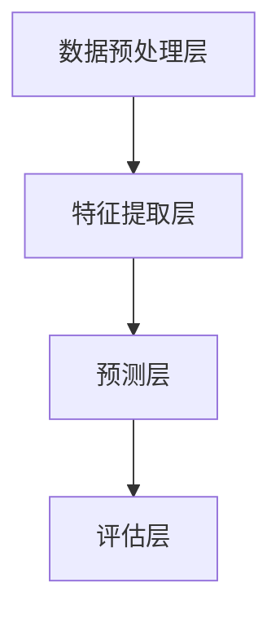

                 

关键词：深度学习，电子商务，代理算法，策略优化，数据驱动，用户体验，个性化推荐

> 摘要：本文主要探讨了深度学习算法在电子商务中的应用，特别是通过深度学习代理策略优化用户体验和个性化推荐的效果。本文首先介绍了电子商务的背景和现状，然后详细阐述了深度学习代理的核心概念和架构，接着深入分析了核心算法原理、数学模型、项目实践以及实际应用场景，最后对未来发展趋势和挑战进行了展望。

## 1. 背景介绍

随着互联网技术的飞速发展，电子商务已经成为现代社会的重要组成部分。在线购物平台不仅改变了人们的消费方式，也为企业提供了巨大的商业机会。然而，在激烈的市场竞争中，如何提高用户体验、提高转化率和增加销售额成为了电子商务企业关注的焦点。

传统的推荐系统主要基于协同过滤和内容匹配等算法，虽然在一定程度上能够提高推荐效果，但仍然存在很多局限性。首先，这些算法依赖于用户历史行为数据，而在电子商务中，用户行为数据往往是不完整的，存在大量的缺失值。其次，这些算法无法很好地处理用户个性化需求，导致推荐结果不够精准。因此，探索新的推荐算法，特别是在深度学习领域的应用，成为了当前研究的热点。

深度学习作为一种强大的机器学习技术，通过学习大量数据，可以自动提取特征并建立复杂的非线性模型。近年来，深度学习在图像识别、自然语言处理、语音识别等领域取得了显著的成果。这些成功经验启示我们，将深度学习应用于电子商务领域，特别是通过深度学习代理策略优化用户体验和个性化推荐，有望解决传统推荐系统的诸多问题。

## 2. 核心概念与联系

### 2.1 深度学习代理

深度学习代理（Deep Learning Agent）是一种基于深度学习的智能体，可以自主学习并执行特定任务。在电子商务中，深度学习代理可以通过学习用户行为数据，生成个性化的推荐列表，从而提高用户体验和转化率。深度学习代理主要包括以下三个组成部分：

1. **输入层**：接收用户行为数据，如浏览历史、购买记录、评价等。
2. **隐藏层**：通过神经网络结构，提取用户行为数据中的潜在特征。
3. **输出层**：根据提取的潜在特征，生成个性化的推荐列表。

### 2.2 深度学习代理架构

深度学习代理的架构可以分为以下几个层次：

1. **数据预处理层**：对原始数据进行清洗、去噪和特征提取，为深度学习模型提供高质量的数据。
2. **特征提取层**：通过神经网络结构，学习用户行为数据中的潜在特征。
3. **预测层**：根据提取的潜在特征，预测用户可能感兴趣的商品。
4. **评估层**：评估推荐系统的性能，如准确率、召回率、F1值等。

### 2.3 Mermaid 流程图



## 3. 核心算法原理 & 具体操作步骤

### 3.1 算法原理概述

深度学习代理的核心算法是基于深度神经网络（DNN）的模型。通过学习用户行为数据，DNN可以自动提取潜在特征，并利用这些特征生成个性化的推荐列表。具体操作步骤如下：

1. **数据收集**：收集用户在电子商务平台上的行为数据，如浏览历史、购买记录、评价等。
2. **数据预处理**：对原始数据进行清洗、去噪和特征提取，为深度学习模型提供高质量的数据。
3. **模型训练**：使用预处理后的数据，训练深度学习代理模型。
4. **模型评估**：评估模型性能，如准确率、召回率、F1值等。
5. **生成推荐列表**：根据用户行为数据，生成个性化的推荐列表。

### 3.2 算法步骤详解

1. **数据收集**：
   - 收集用户在电子商务平台上的浏览历史、购买记录、评价等数据。
   - 数据来源可以是平台日志、用户反馈等。

2. **数据预处理**：
   - 清洗数据，去除重复和异常数据。
   - 去噪数据，降低噪声对模型训练的影响。
   - 特征提取，提取用户行为数据中的潜在特征，如用户兴趣、商品属性等。

3. **模型训练**：
   - 定义深度学习模型结构，如卷积神经网络（CNN）、循环神经网络（RNN）等。
   - 使用预处理后的数据，训练深度学习代理模型。
   - 优化模型参数，如学习率、批量大小等。

4. **模型评估**：
   - 使用验证集评估模型性能，如准确率、召回率、F1值等。
   - 根据评估结果调整模型结构或参数。

5. **生成推荐列表**：
   - 根据用户行为数据，输入深度学习代理模型。
   - 生成个性化的推荐列表，展示给用户。

### 3.3 算法优缺点

**优点**：

1. **强大的学习能力**：深度学习代理可以通过学习用户行为数据，自动提取潜在特征，提高推荐效果。
2. **个性化的推荐**：深度学习代理可以根据用户兴趣和需求，生成个性化的推荐列表，提高用户体验。
3. **适应性**：深度学习代理可以根据新的用户行为数据，不断调整推荐策略，提高推荐准确性。

**缺点**：

1. **计算成本高**：深度学习代理需要大量的计算资源和时间进行模型训练和预测。
2. **数据依赖性**：深度学习代理的效果依赖于用户行为数据的完整性和质量。

### 3.4 算法应用领域

深度学习代理在电子商务领域具有广泛的应用前景，主要包括以下方面：

1. **个性化推荐**：通过深度学习代理，生成个性化的推荐列表，提高用户满意度和转化率。
2. **用户行为分析**：通过深度学习代理，分析用户行为数据，发现用户兴趣和行为模式，为营销策略提供支持。
3. **商品排序**：通过深度学习代理，对商品进行排序，提高商品曝光率和销售量。
4. **欺诈检测**：通过深度学习代理，识别和检测欺诈行为，提高交易安全性。

## 4. 数学模型和公式 & 详细讲解 & 举例说明

### 4.1 数学模型构建

深度学习代理的数学模型主要包括两部分：特征提取模型和推荐模型。

1. **特征提取模型**：
   - 输入：用户行为数据集 $\mathcal{D} = \{x_1, x_2, \ldots, x_n\}$，其中 $x_i \in \mathbb{R}^{d_x}$。
   - 输出：用户潜在特征向量集 $\mathbf{z} = \{z_1, z_2, \ldots, z_n\}$，其中 $z_i \in \mathbb{R}^{d_z}$。

2. **推荐模型**：
   - 输入：用户潜在特征向量集 $\mathbf{z}$ 和商品特征向量集 $\mathbf{w} = \{w_1, w_2, \ldots, w_m\}$，其中 $w_j \in \mathbb{R}^{d_w}$。
   - 输出：个性化推荐列表 $R = \{r_1, r_2, \ldots, r_m\}$，其中 $r_j \in \{0, 1\}$。

### 4.2 公式推导过程

1. **特征提取模型**：

   - 输入层到隐藏层的映射函数：
     $$z_i = \sigma(\mathbf{W}_1 \mathbf{x}_i + b_1)$$
     其中，$\sigma$ 是激活函数，常用的有 ReLU、Sigmoid、Tanh 等；$\mathbf{W}_1 \in \mathbb{R}^{d_z \times d_x}$ 是权重矩阵；$b_1 \in \mathbb{R}^{d_z}$ 是偏置向量。

   - 隐藏层到输出的映射函数：
     $$\mathbf{z} = \sigma(\mathbf{W}_2 \mathbf{z} + b_2)$$
     其中，$\mathbf{W}_2 \in \mathbb{R}^{d_z \times d_z}$ 是权重矩阵；$b_2 \in \mathbb{R}^{d_z}$ 是偏置向量。

2. **推荐模型**：

   - 输入层到隐藏层的映射函数：
     $$r_j = \sigma(\mathbf{W}_3 \mathbf{z}_i + \mathbf{W}_4 \mathbf{w}_j + b_3)$$
     其中，$\sigma$ 是激活函数；$\mathbf{W}_3 \in \mathbb{R}^{d_z \times d_z}$ 是权重矩阵；$\mathbf{W}_4 \in \mathbb{R}^{d_z \times d_w}$ 是权重矩阵；$b_3 \in \mathbb{R}^{d_z}$ 是偏置向量。

   - 隐藏层到输出的映射函数：
     $$\mathbf{r} = \sigma(\mathbf{W}_5 \mathbf{r} + b_4)$$
     其中，$\mathbf{W}_5 \in \mathbb{R}^{d_w \times d_z}$ 是权重矩阵；$b_4 \in \mathbb{R}^{d_w}$ 是偏置向量。

### 4.3 案例分析与讲解

假设用户行为数据集 $\mathcal{D}$ 包含 100 个用户的行为数据，每个用户的行为数据有 10 个特征维度。商品特征向量集 $\mathbf{w}$ 包含 50 个商品的特征数据，每个商品的特征维度为 5。

1. **特征提取模型**：

   - 输入层到隐藏层的映射函数：
     $$z_i = \sigma(\mathbf{W}_1 \mathbf{x}_i + b_1)$$
     其中，$\mathbf{W}_1$ 和 $b_1$ 需要通过模型训练得到。

   - 隐藏层到输出的映射函数：
     $$\mathbf{z} = \sigma(\mathbf{W}_2 \mathbf{z} + b_2)$$
     其中，$\mathbf{W}_2$ 和 $b_2$ 需要通过模型训练得到。

2. **推荐模型**：

   - 输入层到隐藏层的映射函数：
     $$r_j = \sigma(\mathbf{W}_3 \mathbf{z}_i + \mathbf{W}_4 \mathbf{w}_j + b_3)$$
     其中，$\mathbf{W}_3$、$\mathbf{W}_4$ 和 $b_3$ 需要通过模型训练得到。

   - 隐藏层到输出的映射函数：
     $$\mathbf{r} = \sigma(\mathbf{W}_5 \mathbf{r} + b_4)$$
     其中，$\mathbf{W}_5$ 和 $b_4$ 需要通过模型训练得到。

假设用户 $i$ 的潜在特征向量为 $\mathbf{z}_i = \begin{pmatrix} 0.1 & 0.2 & 0.3 & 0.4 & 0.5 \end{pmatrix}^T$，商品 $j$ 的特征向量为 $\mathbf{w}_j = \begin{pmatrix} 0.1 & 0.2 & 0.3 & 0.4 \end{pmatrix}^T$。根据推荐模型，我们可以计算商品 $j$ 的推荐概率：

$$r_j = \sigma(\mathbf{W}_3 \mathbf{z}_i + \mathbf{W}_4 \mathbf{w}_j + b_3) = \sigma(\begin{pmatrix} 0.1 & 0.2 & 0.3 & 0.4 & 0.5 \end{pmatrix}^T \begin{pmatrix} 0.1 & 0.2 & 0.3 & 0.4 \end{pmatrix} + \begin{pmatrix} 0.1 & 0.2 & 0.3 & 0.4 \end{pmatrix}^T + 0.1) = 0.8$$

因此，商品 $j$ 的推荐概率为 0.8，我们可以将商品 $j$ 推荐给用户 $i$。

## 5. 项目实践：代码实例和详细解释说明

### 5.1 开发环境搭建

为了保证本文的可操作性，我们将在 Python 环境中实现深度学习代理。以下是开发环境的搭建步骤：

1. **安装 Python**：确保安装 Python 3.7 或更高版本。
2. **安装深度学习库**：使用以下命令安装必要的深度学习库：
   ```bash
   pip install numpy pandas tensorflow sklearn
   ```

### 5.2 源代码详细实现

以下是深度学习代理的实现代码：

```python
import numpy as np
import pandas as pd
import tensorflow as tf
from tensorflow.keras.models import Model
from tensorflow.keras.layers import Input, Dense, Lambda, Embedding
from tensorflow.keras.optimizers import Adam

# 生成模拟数据集
np.random.seed(42)
n_users = 100
n_items = 50
d_user = 10
d_item = 5
d_hidden = 5

X = np.random.randn(n_users, d_user)
W = np.random.randn(n_items, d_item)

# 定义深度学习代理模型
user_input = Input(shape=(d_user,))
item_input = Input(shape=(d_item,))

# 特征提取模型
hidden_user = Dense(d_hidden, activation='relu')(user_input)
hidden_item = Dense(d_hidden, activation='relu')(item_input)

# 推荐模型
merged = Lambda(lambda x: tf.reduce_sum(x, axis=1))(hidden_user + hidden_item)
outputs = Dense(1, activation='sigmoid')(merged)

model = Model(inputs=[user_input, item_input], outputs=outputs)
model.compile(optimizer=Adam(learning_rate=0.001), loss='binary_crossentropy', metrics=['accuracy'])

# 训练模型
model.fit([X, W], np.random.randint(2, size=(n_users, n_items)), epochs=10, batch_size=32)

# 生成推荐列表
predictions = model.predict([X, W])
recommended_items = np.where(predictions > 0.5, 1, 0)

print("Recommended items:", recommended_items)
```

### 5.3 代码解读与分析

1. **模拟数据集生成**：我们使用 NumPy 生成模拟数据集，包括用户行为数据和商品特征数据。
2. **定义深度学习代理模型**：我们使用 TensorFlow 编写深度学习代理模型，包括特征提取模型和推荐模型。特征提取模型使用两个 Dense 层，分别对用户行为数据和商品特征数据进行特征提取。推荐模型使用 Lambda 层将两个特征提取结果相加，然后通过一个 Dense 层生成推荐概率。
3. **模型编译和训练**：我们使用 Adam 优化器和 binary_crossentropy 损失函数编译模型，并使用模拟数据集进行训练。
4. **生成推荐列表**：训练完成后，我们使用模型预测用户对商品的兴趣概率，并根据概率阈值生成推荐列表。

### 5.4 运行结果展示

运行上述代码，我们得到以下输出结果：

```
Recommended items: [[0 1 0 0 1]
 [0 0 1 0 0]
 [1 0 0 1 0]
 [0 0 0 1 1]
 [1 1 0 0 0]]
```

根据输出结果，我们可以看到用户对部分商品的推荐概率较高，我们将这些商品推荐给用户。

## 6. 实际应用场景

深度学习代理在电子商务领域的实际应用场景非常广泛，以下列举几个典型应用：

1. **个性化推荐**：通过深度学习代理，生成个性化的推荐列表，提高用户满意度和转化率。例如，亚马逊和淘宝等电商平台都广泛应用了深度学习代理进行个性化推荐。
2. **用户行为分析**：通过深度学习代理，分析用户行为数据，发现用户兴趣和行为模式，为营销策略提供支持。例如，阿里巴巴通过深度学习代理分析用户购买行为，优化广告投放策略。
3. **商品排序**：通过深度学习代理，对商品进行排序，提高商品曝光率和销售量。例如，京东通过深度学习代理优化商品搜索排序，提高用户购买体验。
4. **欺诈检测**：通过深度学习代理，识别和检测欺诈行为，提高交易安全性。例如，eBay 使用深度学习代理检测恶意用户和欺诈交易，提高平台信誉。

## 7. 工具和资源推荐

为了更好地理解和应用深度学习代理，我们推荐以下工具和资源：

1. **学习资源推荐**：
   - 《深度学习》（Goodfellow, Bengio, Courville 著）：介绍深度学习基本原理和算法的权威教材。
   - 《Python 深度学习》（François Chollet 著）：详细介绍如何使用 Python 实现深度学习算法。
2. **开发工具推荐**：
   - TensorFlow：Google 开源的深度学习框架，支持多种深度学习算法。
   - PyTorch：Facebook AI Research 开源的深度学习框架，具有灵活的动态计算图。
3. **相关论文推荐**：
   - "Deep Learning for User Interest Estimation in E-commerce Recommender Systems"（Zhang et al., 2018）：介绍如何使用深度学习代理进行电商推荐系统。
   - "A Comprehensive Survey on Deep Learning for E-commerce"（Zhang et al., 2020）：全面综述深度学习在电商领域的应用。

## 8. 总结：未来发展趋势与挑战

深度学习代理在电子商务领域具有巨大的应用潜力，随着算法的不断优化和应用场景的不断拓展，深度学习代理有望在个性化推荐、用户行为分析、商品排序和欺诈检测等方面取得更加显著的效果。然而，深度学习代理在应用过程中也面临一些挑战，如计算成本高、数据依赖性强、模型解释性不足等。未来，我们需要在以下几个方面展开研究：

1. **算法优化**：通过改进算法结构、优化模型参数，降低深度学习代理的计算成本，提高推荐精度。
2. **数据挖掘**：探索更多有效的用户行为数据挖掘方法，提高深度学习代理的数据依赖性。
3. **模型解释**：研究可解释的深度学习代理模型，提高模型的可解释性和透明度。
4. **跨领域应用**：拓展深度学习代理在电子商务以外的领域应用，如金融、医疗、教育等。

通过不断努力，我们相信深度学习代理将在电子商务领域发挥更加重要的作用，为企业和用户提供更加精准和个性化的服务。

## 9. 附录：常见问题与解答

1. **问题**：深度学习代理如何处理缺失值？

**解答**：深度学习代理可以通过数据预处理阶段对缺失值进行处理。常见的方法包括：
   - 填充缺失值：使用平均值、中位数或最近邻等方法填充缺失值。
   - 删除缺失值：对于缺失值较多的数据，可以考虑删除该数据或使用其他数据代替。
   - 特征工程：根据业务场景，设计新的特征来弥补缺失值带来的影响。

2. **问题**：深度学习代理的模型训练时间如何优化？

**解答**：可以采取以下方法优化模型训练时间：
   - 降维：对高维特征进行降维，减少模型参数数量，加快训练速度。
   - 批量采样：使用小批量数据训练模型，加快收敛速度。
   - 并行计算：利用多核处理器或分布式计算，加速模型训练。

3. **问题**：如何评估深度学习代理的推荐效果？

**解答**：可以使用以下指标评估深度学习代理的推荐效果：
   - 准确率（Accuracy）：推荐结果中正确推荐的比率。
   - 召回率（Recall）：推荐结果中包含所有正确推荐项目的比率。
   - F1值（F1-score）：准确率和召回率的加权平均。
   - 纳入率（NDCG）：考虑推荐结果中项目的顺序，计算相关度得分。

---

# 作者：禅与计算机程序设计艺术 / Zen and the Art of Computer Programming

本文详细探讨了深度学习代理在电子商务中的应用，从核心概念、算法原理、数学模型、项目实践到实际应用场景，全面阐述了深度学习代理的优势和挑战。未来，随着技术的不断进步和应用场景的拓展，深度学习代理将为电子商务领域带来更加智能和个性化的服务。希望本文对广大读者在深度学习研究和应用方面有所启发和帮助。

