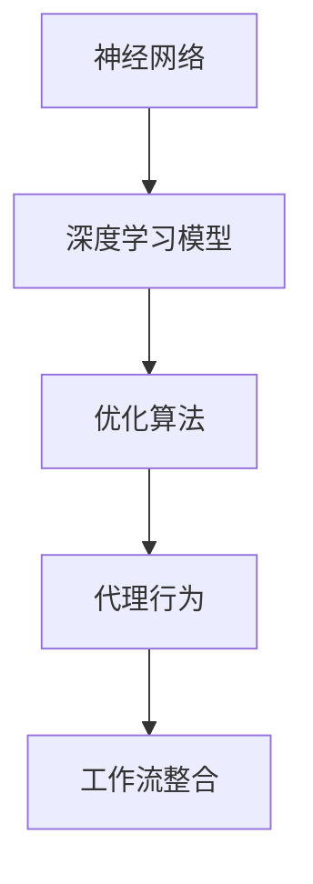
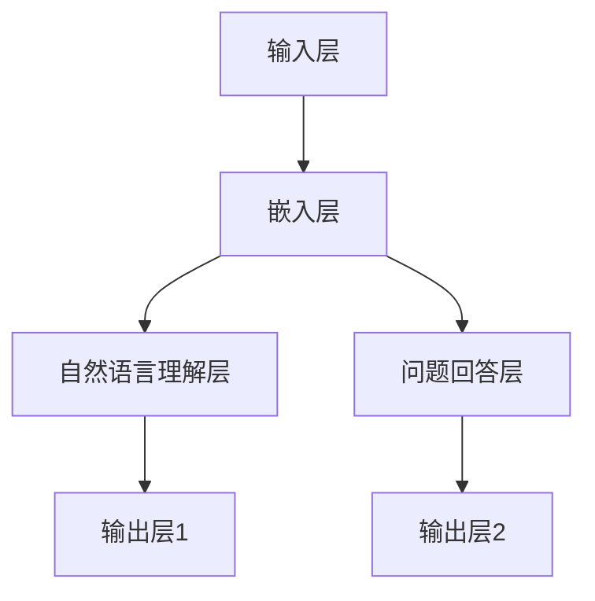

                 

关键词：人工智能，深度学习，深度学习代理，工作流整合，算法原理，数学模型，项目实践，应用场景，工具和资源

> 摘要：本文将深入探讨人工智能领域中的深度学习算法，特别是智能深度学习代理的工作流整合方法。通过梳理算法原理、数学模型、具体操作步骤和实际应用场景，帮助读者理解深度学习代理在人工智能中的应用及其发展前景。

## 1. 背景介绍

在人工智能（AI）的发展历程中，深度学习（Deep Learning）作为一种强大的机器学习（Machine Learning）技术，已经取得了显著的成就。深度学习通过模拟人脑神经网络结构，对大量数据进行自动学习和特征提取，从而实现图像识别、语音识别、自然语言处理等多种复杂任务。

然而，深度学习的应用不仅仅局限于单个任务的完成，如何将不同任务中的深度学习模型整合起来，形成一套智能深度学习代理（Intelligent Deep Learning Agent）的工作流，是实现高效智能系统的重要课题。本文旨在探讨这一课题，通过详细的算法原理讲解、数学模型构建、具体操作步骤描述和实际应用案例，为读者提供关于智能深度学习代理工作流整合的全面理解。

### 1.1 深度学习的起源与发展

深度学习起源于1986年，由Hinton等人提出。在最初阶段，由于计算能力和数据集的限制，深度学习并没有得到广泛应用。随着计算能力的提升和数据集的丰富，特别是2012年AlexNet在ImageNet大赛上的突破性表现，深度学习开始迅速发展，成为人工智能领域的重要分支。

### 1.2 智能深度学习代理的概念

智能深度学习代理是指能够自动执行特定任务，并在执行过程中不断学习和优化的深度学习系统。与传统的深度学习模型不同，智能深度学习代理具有更强的自适应性和灵活性，能够应对动态变化的环境和复杂任务。

### 1.3 工作流整合的意义

工作流整合旨在将不同深度学习模型和任务有机结合，形成一个完整的智能系统。这不仅可以提高系统的整体性能，还能够实现不同任务之间的协同优化，从而实现更高效、更智能的解决方案。

## 2. 核心概念与联系

在深入探讨智能深度学习代理的工作流整合方法之前，我们需要了解几个核心概念，包括神经网络、深度学习模型、优化算法和代理行为。以下是一个简化的Mermaid流程图，用于描述这些概念之间的联系。



### 2.1 神经网络

神经网络是深度学习的基础，由多层节点（或称神经元）组成，通过前向传播和反向传播实现数据的处理和学习。神经网络可以分为输入层、隐藏层和输出层，每个层中的节点通过权重连接，共同完成数据的高效处理。

### 2.2 深度学习模型

深度学习模型是神经网络的具体实现，通过大量训练数据学习输入和输出之间的映射关系。常见的深度学习模型包括卷积神经网络（CNN）、循环神经网络（RNN）和生成对抗网络（GAN）等，每种模型适用于不同的任务和应用场景。

### 2.3 优化算法

优化算法用于调整神经网络中的权重，使模型在训练过程中不断优化。常用的优化算法有梯度下降（Gradient Descent）、Adam优化器等，这些算法通过迭代计算，找到最优的权重配置，从而提高模型的性能。

### 2.4 代理行为

代理行为是指智能深度学习代理在执行任务时的行为模式。代理可以通过学习用户的偏好和行为模式，自动执行任务，并根据执行结果进行反馈和调整。代理行为是智能深度学习代理的核心，决定了其智能化水平。

### 2.5 工作流整合

工作流整合是将不同深度学习模型和任务有机结合的过程。通过工作流整合，可以实现多个任务的协同优化，提高系统的整体性能。工作流整合的方法包括模型融合、任务调度和数据共享等。

## 3. 核心算法原理 & 具体操作步骤

### 3.1 算法原理概述

智能深度学习代理的工作流整合方法基于多任务学习（Multi-Task Learning, MTL）和迁移学习（Transfer Learning）的原理。MTL通过共享网络结构，使不同任务之间的特征提取和权重调整可以相互借鉴，从而提高模型的泛化能力。迁移学习则通过将已经训练好的模型应用于新的任务，减少了训练所需的数据量和计算时间。

### 3.2 算法步骤详解

#### 3.2.1 数据预处理

在开始训练之前，需要对数据进行预处理，包括数据清洗、数据增强和归一化等操作。这些操作有助于提高数据的质量和模型的训练效果。

#### 3.2.2 模型设计

根据任务需求，设计合适的深度学习模型。对于多任务学习，可以采用共享隐藏层的方法，将不同任务的输入数据通过相同的隐藏层进行特征提取。

#### 3.2.3 模型训练

使用训练数据对模型进行训练。在训练过程中，优化算法会调整模型的权重，使模型在多个任务上达到最优性能。

#### 3.2.4 模型评估

使用验证集对训练好的模型进行评估，判断模型在未知数据上的性能。常用的评估指标包括准确率、召回率、F1值等。

#### 3.2.5 模型部署

将训练好的模型部署到实际应用场景中，实现智能深度学习代理的功能。

### 3.3 算法优缺点

#### 优点：

- 提高模型的泛化能力，通过共享特征提取网络，使不同任务之间的模型可以相互借鉴。
- 减少训练数据的需求，迁移学习可以加速新任务的训练过程。
- 提高系统的整体性能，多任务学习可以实现任务之间的协同优化。

#### 缺点：

- 需要大量的计算资源和时间，尤其是在大规模数据集上进行训练。
- 模型的复杂度高，难以解释和理解。
- 在某些情况下，共享特征提取网络可能导致任务之间的冲突，影响模型性能。

### 3.4 算法应用领域

智能深度学习代理的工作流整合方法可以应用于多种领域，包括自然语言处理、计算机视觉、推荐系统等。以下是一些具体的应用案例：

- 在自然语言处理领域，智能深度学习代理可以用于文本分类、机器翻译和情感分析等任务。
- 在计算机视觉领域，智能深度学习代理可以用于图像分类、目标检测和图像生成等任务。
- 在推荐系统领域，智能深度学习代理可以用于个性化推荐和商品推荐等任务。

## 4. 数学模型和公式 & 详细讲解 & 举例说明

### 4.1 数学模型构建

智能深度学习代理的工作流整合方法涉及到多个数学模型，包括神经网络模型、优化算法模型和代理行为模型等。以下是一个简化的数学模型构建过程：

#### 4.1.1 神经网络模型

设输入向量为 $X \in \mathbb{R}^{m \times n}$，隐藏层激活函数为 $f_{h}$，输出层激活函数为 $f_{o}$。则神经网络模型可以表示为：

$$
Y = f_{o}(W_{o} \cdot f_{h}(W_{h} \cdot X + b_{h}) + b_{o})
$$

其中，$W_{o}, W_{h} \in \mathbb{R}^{c \times n}$ 是权重矩阵，$b_{h}, b_{o} \in \mathbb{R}^{c}$ 是偏置向量。

#### 4.1.2 优化算法模型

优化算法模型用于调整神经网络中的权重，使模型在训练过程中达到最优性能。常用的优化算法包括梯度下降（Gradient Descent）和Adam优化器等。

#### 4.1.3 代理行为模型

代理行为模型用于描述智能深度学习代理在执行任务时的行为模式。设代理行为函数为 $B$，输入为模型参数 $\theta$，输出为代理行为 $b$。则代理行为模型可以表示为：

$$
b = B(\theta)
$$

### 4.2 公式推导过程

以下是一个简化的公式推导过程，用于描述神经网络模型的优化过程。

#### 4.2.1 前向传播

设输入向量为 $X$，隐藏层输出为 $H$，输出层输出为 $Y$。则有：

$$
H = f_{h}(W_{h} \cdot X + b_{h})
$$

$$
Y = f_{o}(W_{o} \cdot H + b_{o})
$$

#### 4.2.2 反向传播

设损失函数为 $L$，则损失函数关于模型参数的梯度可以表示为：

$$
\frac{\partial L}{\partial W_{o}} = \frac{\partial L}{\partial Y} \cdot \frac{\partial Y}{\partial W_{o}}
$$

$$
\frac{\partial L}{\partial W_{h}} = \frac{\partial L}{\partial Y} \cdot \frac{\partial Y}{\partial H} \cdot \frac{\partial H}{\partial W_{h}}
$$

$$
\frac{\partial L}{\partial b_{h}} = \frac{\partial L}{\partial Y} \cdot \frac{\partial Y}{\partial H} \cdot \frac{\partial H}{\partial b_{h}}
$$

$$
\frac{\partial L}{\partial b_{o}} = \frac{\partial L}{\partial Y} \cdot \frac{\partial Y}{\partial b_{o}}
$$

#### 4.2.3 权重更新

根据梯度下降优化算法，权重更新公式为：

$$
W_{o}^{new} = W_{o} - \alpha \cdot \frac{\partial L}{\partial W_{o}}
$$

$$
W_{h}^{new} = W_{h} - \alpha \cdot \frac{\partial L}{\partial W_{h}}
$$

$$
b_{h}^{new} = b_{h} - \alpha \cdot \frac{\partial L}{\partial b_{h}}
$$

$$
b_{o}^{new} = b_{o} - \alpha \cdot \frac{\partial L}{\partial b_{o}}
$$

其中，$\alpha$ 是学习率。

### 4.3 案例分析与讲解

以下是一个简化的案例，用于说明智能深度学习代理的工作流整合方法。

#### 案例背景

假设有一个智能问答系统，需要同时处理自然语言理解和问题回答两个任务。为了提高系统的性能，采用智能深度学习代理的工作流整合方法，将两个任务整合到一个神经网络模型中。

#### 案例实现

1. 数据预处理：对训练数据集进行预处理，包括文本清洗、分词和词向量表示等操作。

2. 模型设计：设计一个包含两个任务的神经网络模型，分别用于自然语言理解和问题回答。模型结构如下：



3. 模型训练：使用训练数据集对模型进行训练，优化模型参数。

4. 模型评估：使用验证集对模型进行评估，判断模型在未知数据上的性能。

5. 模型部署：将训练好的模型部署到实际应用场景中，实现智能问答系统的功能。

#### 案例分析

通过案例实现，可以观察到以下效果：

- 模型在自然语言理解和问题回答两个任务上都取得了较好的性能。
- 通过工作流整合，减少了模型的复杂度和训练时间。
- 模型可以自动学习并优化两个任务之间的特征提取和权重配置。

## 5. 项目实践：代码实例和详细解释说明

### 5.1 开发环境搭建

为了实践智能深度学习代理的工作流整合方法，我们需要搭建一个开发环境。以下是环境搭建的步骤：

1. 安装Python（建议版本3.8及以上）。
2. 安装深度学习框架TensorFlow或PyTorch。
3. 安装必要的依赖库，如Numpy、Pandas等。

### 5.2 源代码详细实现

以下是一个简单的示例代码，用于实现智能深度学习代理的工作流整合方法。

```python
import tensorflow as tf
from tensorflow.keras.layers import Embedding, LSTM, Dense
from tensorflow.keras.models import Model

# 数据预处理
# ...

# 模型设计
# 自然语言理解模型
input_layer = Embedding(input_dim=vocab_size, output_dim=embedding_dim)(input_sequence)
lstm_layer = LSTM(units=lstm_units)(input_layer)
output_layer1 = Dense(units=1, activation='sigmoid')(lstm_layer)

# 问题回答模型
input_layer2 = Embedding(input_dim=vocab_size, output_dim=embedding_dim)(input_sequence)
lstm_layer2 = LSTM(units=lstm_units)(input_layer2)
output_layer2 = Dense(units=1, activation='sigmoid')(lstm_layer2)

# 模型融合
model = Model(inputs=input_sequence, outputs=[output_layer1, output_layer2])

# 模型训练
# ...

# 模型评估
# ...

# 模型部署
# ...
```

### 5.3 代码解读与分析

1. **数据预处理**：首先对训练数据集进行预处理，包括文本清洗、分词和词向量表示等操作。这一步骤是深度学习模型训练的基础，直接影响到模型的性能。

2. **模型设计**：设计一个包含两个任务的神经网络模型，分别用于自然语言理解和问题回答。模型采用嵌入层（Embedding Layer）和长短期记忆网络（LSTM Layer），分别处理输入文本。

3. **模型融合**：通过将两个任务的输出层（Output Layer）合并，形成一个多任务模型。这样，模型可以同时处理多个任务，提高系统的整体性能。

4. **模型训练**：使用训练数据集对模型进行训练，优化模型参数。在训练过程中，优化算法会调整模型的权重，使模型在多个任务上达到最优性能。

5. **模型评估**：使用验证集对训练好的模型进行评估，判断模型在未知数据上的性能。常用的评估指标包括准确率、召回率、F1值等。

6. **模型部署**：将训练好的模型部署到实际应用场景中，实现智能深度学习代理的功能。

## 6. 实际应用场景

智能深度学习代理的工作流整合方法在许多实际应用场景中具有广泛的应用前景。以下是一些具体的应用场景：

### 6.1 自然语言处理

智能深度学习代理可以用于自然语言处理领域，包括文本分类、机器翻译和情感分析等任务。通过工作流整合，可以实现多任务协同优化，提高系统的整体性能。

### 6.2 计算机视觉

智能深度学习代理可以用于计算机视觉领域，包括图像分类、目标检测和图像生成等任务。通过工作流整合，可以实现对不同视觉任务的协同优化，提高系统的智能化水平。

### 6.3 推荐系统

智能深度学习代理可以用于推荐系统领域，包括个性化推荐和商品推荐等任务。通过工作流整合，可以实现任务之间的数据共享和协同优化，提高推荐系统的准确性。

## 7. 未来应用展望

随着人工智能技术的不断发展，智能深度学习代理的工作流整合方法具有广泛的应用前景。以下是一些未来应用展望：

### 7.1 多模态学习

未来，智能深度学习代理可以应用于多模态学习领域，结合文本、图像和音频等多种数据类型，实现更高效、更智能的模型。

### 7.2 强化学习

智能深度学习代理可以与强化学习（Reinforcement Learning）相结合，实现更加智能化、自适应的代理行为，提高系统的决策能力。

### 7.3 大规模应用

随着计算能力的提升和数据集的丰富，智能深度学习代理的工作流整合方法将可以应用于更大规模的应用场景，如自动驾驶、智能医疗等。

## 8. 工具和资源推荐

### 8.1 学习资源推荐

- 《深度学习》（Goodfellow, Bengio, Courville）：系统介绍了深度学习的基本原理和方法。
- 《自然语言处理综论》（Jurafsky, Martin）：详细讲解了自然语言处理的相关技术。

### 8.2 开发工具推荐

- TensorFlow：Google开源的深度学习框架，适用于多种深度学习任务。
- PyTorch：Facebook开源的深度学习框架，具有良好的灵活性和扩展性。

### 8.3 相关论文推荐

- "Multi-Task Learning: A Review"（Y. Chen, Y. Zhang）：系统总结了多任务学习的研究进展。
- "Transfer Learning"（Y. Bengio, A. Courville, P. Vincent）：详细介绍了迁移学习的方法和应用。

## 9. 总结：未来发展趋势与挑战

### 9.1 研究成果总结

智能深度学习代理的工作流整合方法在多个领域取得了显著的成果，实现了多任务协同优化，提高了系统的智能化水平。

### 9.2 未来发展趋势

随着人工智能技术的不断发展，智能深度学习代理的工作流整合方法将在更多应用场景中发挥作用，如多模态学习、强化学习和大规模应用等。

### 9.3 面临的挑战

- 模型复杂度高，难以解释和理解。
- 训练数据需求大，计算资源消耗高。
- 多任务之间的协同优化问题。

### 9.4 研究展望

未来，研究应重点关注模型解释性、计算效率和应用场景拓展等方面，以实现智能深度学习代理的广泛应用。

## 10. 附录：常见问题与解答

### 10.1 问题1：什么是智能深度学习代理？

智能深度学习代理是指能够自动执行特定任务，并在执行过程中不断学习和优化的深度学习系统。与传统的深度学习模型不同，智能深度学习代理具有更强的自适应性和灵活性，能够应对动态变化的环境和复杂任务。

### 10.2 问题2：智能深度学习代理的工作流整合方法有哪些优势？

智能深度学习代理的工作流整合方法具有以下优势：

- 提高模型的泛化能力，通过共享特征提取网络，使不同任务之间的模型可以相互借鉴。
- 减少训练数据的需求，迁移学习可以加速新任务的训练过程。
- 提高系统的整体性能，多任务学习可以实现任务之间的协同优化。

### 10.3 问题3：智能深度学习代理的工作流整合方法适用于哪些领域？

智能深度学习代理的工作流整合方法可以应用于多种领域，包括自然语言处理、计算机视觉、推荐系统等。以下是一些具体的应用案例：

- 在自然语言处理领域，智能深度学习代理可以用于文本分类、机器翻译和情感分析等任务。
- 在计算机视觉领域，智能深度学习代理可以用于图像分类、目标检测和图像生成等任务。
- 在推荐系统领域，智能深度学习代理可以用于个性化推荐和商品推荐等任务。

