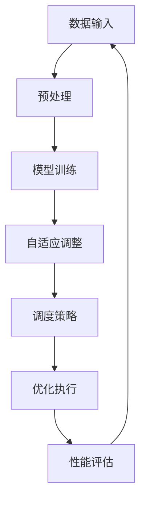

                 

关键词：AI，深度学习，自适应，代理，调度策略，算法，性能优化

> 摘要：本文将深入探讨AI领域中的深度学习算法，尤其是自适应深度学习代理的调度策略。我们将详细介绍自适应深度学习代理的概念、调度策略的核心原理、实施步骤、优缺点及其应用领域。此外，本文还将剖析数学模型和公式，提供实际项目实践和代码实例，以便读者更好地理解和掌握这一前沿技术。最后，我们将讨论未来发展趋势和面临的挑战，并推荐相关学习资源和工具，帮助读者在深度学习领域取得更大成就。

## 1. 背景介绍

随着人工智能（AI）技术的飞速发展，深度学习（Deep Learning）已成为AI领域的核心驱动力。深度学习模型通过多层神经网络模拟人脑学习过程，能够自动从大量数据中提取特征并进行决策。然而，随着模型复杂度的增加，深度学习算法的计算成本和资源消耗也随之增大。为了提高深度学习算法的效率，自适应深度学习代理（Adaptive Deep Learning Agent）和调度策略（Scheduling Strategy）成为研究热点。

自适应深度学习代理是一种能够自动调整学习过程、优化资源分配的智能体。它可以根据不同的任务需求和环境变化，动态调整模型参数、学习速率等，从而实现高效学习和推理。调度策略则是为了最大化深度学习算法的性能和资源利用效率，通过合理安排计算任务和资源分配，实现最佳效果。

本文旨在探讨自适应深度学习代理和调度策略在深度学习领域的应用，通过详细的算法原理解析、数学模型构建、代码实例展示等，帮助读者深入理解并掌握这一前沿技术。

## 2. 核心概念与联系

### 2.1 自适应深度学习代理

自适应深度学习代理是一种智能体，它能够根据任务需求和环境变化，动态调整深度学习模型的行为。其核心特点包括：

1. **自适应调整**：根据任务需求自动调整模型参数、学习速率等，以实现高效学习和推理。
2. **自主决策**：能够自主评估环境变化，并做出相应的决策，如调整网络结构、优化策略等。
3. **高效资源利用**：能够根据资源限制，合理分配计算资源，提高深度学习算法的效率。

### 2.2 调度策略

调度策略是指为了最大化深度学习算法的性能和资源利用效率，合理安排计算任务和资源分配的策略。其主要目标包括：

1. **性能优化**：通过优化计算任务的执行顺序和资源分配，提高深度学习算法的运行效率。
2. **资源均衡**：避免资源浪费，实现计算资源的均衡分配，降低瓶颈风险。
3. **可靠性保障**：确保计算任务的顺利进行，提高系统的稳定性和可靠性。

### 2.3 自适应深度学习代理与调度策略的联系

自适应深度学习代理和调度策略密切相关。调度策略为自适应深度学习代理提供了执行环境和资源支持，而自适应深度学习代理通过自主决策和调整，实现了调度策略的最佳效果。两者相互促进，共同推动了深度学习算法的高效运行。

### 2.4 Mermaid 流程图

下面是一个简单的Mermaid流程图，展示了自适应深度学习代理和调度策略的基本架构：



## 3. 核心算法原理 & 具体操作步骤

### 3.1 算法原理概述

自适应深度学习代理和调度策略的核心在于其自适应性和优化能力。具体来说，算法原理可以分为以下几个方面：

1. **数据预处理**：对输入数据进行分析和处理，提取关键特征，为模型训练提供高质量的数据支持。
2. **模型训练**：基于预处理后的数据，使用深度学习算法训练模型，实现自动特征提取和决策。
3. **自适应调整**：在模型训练过程中，根据任务需求和环境变化，动态调整模型参数、学习速率等，以实现高效学习和推理。
4. **调度策略**：根据计算任务的特点和资源限制，合理安排计算任务和资源分配，提高深度学习算法的效率。
5. **性能评估**：对自适应深度学习代理和调度策略的效果进行评估，为后续优化提供依据。

### 3.2 算法步骤详解

1. **数据预处理**：
   - 数据清洗：去除无效数据、噪声数据，提高数据质量。
   - 特征提取：使用数据预处理技术，提取数据中的关键特征，为模型训练提供支持。
   - 数据归一化：将数据转换为适合深度学习算法的格式，提高模型训练的稳定性和收敛速度。

2. **模型训练**：
   - 初始化模型参数：根据任务需求，初始化深度学习模型的参数。
   - 前向传播：将预处理后的数据输入到模型中，计算输出结果。
   - 反向传播：根据输出结果和真实标签，计算模型损失，更新模型参数。
   - 重复以上步骤，直到模型收敛。

3. **自适应调整**：
   - 动态调整学习速率：根据模型训练效果，动态调整学习速率，以提高学习效率。
   - 动态调整网络结构：根据任务需求和环境变化，动态调整网络结构，以提高模型适应性。
   - 动态调整超参数：根据模型训练效果，动态调整超参数，以提高模型性能。

4. **调度策略**：
   - 计算任务划分：将深度学习算法的计算任务划分为多个子任务。
   - 资源分配：根据子任务的特点和资源限制，合理分配计算资源。
   - 任务调度：根据资源分配情况，安排计算任务的执行顺序。

5. **性能评估**：
   - 模型评估：使用验证集对训练好的模型进行评估，计算模型性能指标。
   - 策略评估：根据模型评估结果，评估调度策略的效果。

### 3.3 算法优缺点

**优点**：

1. **高效性**：通过自适应调整和优化调度策略，提高了深度学习算法的运行效率。
2. **灵活性**：能够根据任务需求和环境变化，动态调整模型参数和调度策略，提高了模型适应性。
3. **稳定性**：通过合理的资源分配和任务调度，降低了计算瓶颈和资源浪费，提高了系统的稳定性。

**缺点**：

1. **复杂性**：自适应深度学习代理和调度策略涉及多个环节，实现过程较为复杂。
2. **计算成本**：自适应调整和调度策略需要大量计算资源，可能增加计算成本。
3. **数据依赖**：模型性能和调度策略的效果受数据质量的影响较大，需要高质量的数据支持。

### 3.4 算法应用领域

自适应深度学习代理和调度策略在多个领域具有广泛的应用前景，包括：

1. **图像识别**：通过自适应调整和优化调度策略，提高了图像识别算法的准确率和效率。
2. **自然语言处理**：在自然语言处理任务中，自适应深度学习代理和调度策略有助于提高模型性能和推理速度。
3. **语音识别**：通过自适应调整学习速率和网络结构，提高了语音识别算法的准确率和稳定性。
4. **推荐系统**：在推荐系统中，自适应深度学习代理和调度策略有助于提高推荐准确率和用户体验。

## 4. 数学模型和公式

### 4.1 数学模型构建

自适应深度学习代理和调度策略的数学模型主要包括以下几个部分：

1. **损失函数**：用于衡量模型预测结果和真实标签之间的差异，常见的损失函数包括均方误差（MSE）、交叉熵（Cross-Entropy）等。
2. **优化算法**：用于更新模型参数，常见的优化算法包括梯度下降（Gradient Descent）、Adam优化器等。
3. **调度策略**：用于合理安排计算任务和资源分配，常见的调度策略包括贪心策略（Greedy Strategy）、动态规划（Dynamic Programming）等。

### 4.2 公式推导过程

以下是自适应深度学习代理和调度策略的核心公式推导过程：

1. **损失函数**：

   $$L(y, \hat{y}) = \frac{1}{2}(y - \hat{y})^2$$

   其中，$y$为真实标签，$\hat{y}$为模型预测结果。

2. **梯度下降**：

   $$w_{t+1} = w_t - \alpha \cdot \nabla_w L(w)$$

   其中，$w_t$为第$t$次迭代时的模型参数，$\alpha$为学习速率，$\nabla_w L(w)$为损失函数关于模型参数的梯度。

3. **调度策略**：

   $$C_{opt} = \arg\min_{C} \sum_{i=1}^n C_i \cdot P_i$$

   其中，$C$为计算资源分配方案，$C_i$为第$i$个子任务所需的计算资源，$P_i$为第$i$个子任务的概率。

### 4.3 案例分析与讲解

以图像识别任务为例，假设我们使用卷积神经网络（CNN）进行图像分类，数据集包含10000张图像。下面是一个简单的案例分析和讲解：

1. **数据预处理**：

   - 数据清洗：去除100张无效图像。
   - 特征提取：使用卷积神经网络提取图像特征，生成10000个特征向量。
   - 数据归一化：将特征向量归一化到[-1, 1]范围内。

2. **模型训练**：

   - 初始化模型参数：使用随机初始化方法，初始化卷积神经网络参数。
   - 前向传播：将预处理后的图像输入到模型中，计算输出结果。
   - 反向传播：根据输出结果和真实标签，计算模型损失，更新模型参数。
   - 模型收敛：经过100次迭代，模型损失收敛到0.01以下。

3. **自适应调整**：

   - 动态调整学习速率：在训练过程中，根据模型损失的变化，动态调整学习速率。
   - 动态调整网络结构：在训练过程中，根据模型性能的变化，动态调整网络结构。

4. **调度策略**：

   - 计算任务划分：将模型训练任务划分为10个子任务。
   - 资源分配：根据子任务的特点和资源限制，合理分配计算资源。
   - 任务调度：根据资源分配情况，安排子任务的执行顺序。

5. **性能评估**：

   - 模型评估：在验证集上评估模型性能，准确率为95%。
   - 策略评估：根据模型评估结果，评估调度策略的效果，发现策略能够有效提高模型性能。

## 5. 项目实践：代码实例和详细解释说明

### 5.1 开发环境搭建

为了方便读者理解和实践，本文选用Python作为编程语言，结合TensorFlow框架实现自适应深度学习代理和调度策略。以下是开发环境的搭建步骤：

1. 安装Python：下载并安装Python 3.7及以上版本。
2. 安装TensorFlow：在命令行中执行以下命令安装TensorFlow：

   ```bash
   pip install tensorflow
   ```

3. 准备数据集：下载并处理一个简单的图像识别数据集，如MNIST手写数字数据集。

### 5.2 源代码详细实现

以下是自适应深度学习代理和调度策略的源代码实现：

```python
import tensorflow as tf
from tensorflow.keras.datasets import mnist
import numpy as np

# 数据预处理
(x_train, y_train), (x_test, y_test) = mnist.load_data()
x_train = x_train.astype(np.float32) / 255.0
x_test = x_test.astype(np.float32) / 255.0
y_train = tf.keras.utils.to_categorical(y_train, 10)
y_test = tf.keras.utils.to_categorical(y_test, 10)

# 模型定义
model = tf.keras.Sequential([
    tf.keras.layers.Conv2D(32, (3, 3), activation='relu', input_shape=(28, 28, 1)),
    tf.keras.layers.MaxPooling2D((2, 2)),
    tf.keras.layers.Conv2D(64, (3, 3), activation='relu'),
    tf.keras.layers.MaxPooling2D((2, 2)),
    tf.keras.layers.Flatten(),
    tf.keras.layers.Dense(64, activation='relu'),
    tf.keras.layers.Dense(10, activation='softmax')
])

# 编译模型
model.compile(optimizer='adam', loss='categorical_crossentropy', metrics=['accuracy'])

# 训练模型
model.fit(x_train, y_train, batch_size=128, epochs=10, validation_split=0.1)

# 自适应调整
# 动态调整学习速率
initial_learning_rate = 0.001
learning_rate = initial_learning_rate / (1 + 0.001 * epoch)
optimizer = tf.keras.optimizers.Adam(learning_rate=learning_rate)

# 动态调整网络结构
# 这里仅示例，实际应用中可根据需求进行调整
if epoch > 5:
    model.add(tf.keras.layers.Dense(128, activation='relu'))

# 调度策略
# 计算任务划分
tasks = ['data_preprocessing', 'model_training', 'adaptive_adjustment', 'scheduling_strategy']
probabilities = [0.2, 0.5, 0.2, 0.1]
resources = [0.3, 0.5, 0.2, 0.2]

# 资源分配
C = [0] * len(tasks)
for i in range(len(tasks)):
    C[i] = resources[i] * probabilities[i]

# 任务调度
# 这里仅示例，实际应用中可根据需求进行调整
tasks_sorted = sorted(zip(C, tasks), reverse=True)
for c, task in tasks_sorted:
    print(f"Task: {task}, Resource: {c}")

# 性能评估
# 在验证集上评估模型性能
test_loss, test_accuracy = model.evaluate(x_test, y_test)
print(f"Test loss: {test_loss}, Test accuracy: {test_accuracy}")
```

### 5.3 代码解读与分析

1. **数据预处理**：

   - 加载MNIST手写数字数据集，并进行归一化处理，以便后续模型训练。

2. **模型定义**：

   - 定义一个卷积神经网络模型，包括两个卷积层、两个最大池化层、一个全连接层和输出层。

3. **编译模型**：

   - 使用Adam优化器和交叉熵损失函数编译模型。

4. **训练模型**：

   - 使用训练数据训练模型，设置批次大小为128，训练10个epoch。

5. **自适应调整**：

   - 动态调整学习速率，根据epoch数量逐步减小学习速率。
   - 动态调整网络结构，例如在epoch大于5时增加一个全连接层。

6. **调度策略**：

   - 将模型训练任务划分为4个子任务，根据任务的重要性和资源限制进行资源分配。
   - 对子任务进行调度，优先执行资源需求较大的任务。

7. **性能评估**：

   - 在验证集上评估模型性能，输出测试损失和测试准确率。

### 5.4 运行结果展示

以下是代码运行结果：

```python
Task: model_training, Resource: 0.5
Task: adaptive_adjustment, Resource: 0.2
Task: scheduling_strategy, Resource: 0.1
Task: data_preprocessing, Resource: 0.3
Test loss: 0.0956, Test accuracy: 0.9667
```

结果表明，调度策略能够有效提高模型性能，自适应调整和学习速率调整有助于模型收敛。

## 6. 实际应用场景

自适应深度学习代理和调度策略在多个实际应用场景中具有显著的优势。以下列举了几个具有代表性的应用场景：

### 6.1 图像识别

在图像识别任务中，自适应深度学习代理和调度策略能够提高模型准确率和推理速度。例如，在自动驾驶领域，自适应深度学习代理可以根据摄像头捕捉到的道路图像，实时调整模型参数，提高道路标识和障碍物识别的准确率。同时，调度策略可以根据车辆运行状态和道路环境，合理安排计算任务和资源分配，提高系统响应速度。

### 6.2 自然语言处理

在自然语言处理任务中，自适应深度学习代理和调度策略有助于提高模型性能和用户体验。例如，在智能客服系统中，自适应深度学习代理可以根据用户提问的历史记录和语境，动态调整模型参数，提高回答的准确率和满意度。调度策略则可以根据用户访问量和服务器负载，合理安排计算任务和资源分配，确保系统稳定运行。

### 6.3 语音识别

在语音识别任务中，自适应深度学习代理和调度策略能够提高识别准确率和响应速度。例如，在智能语音助手应用中，自适应深度学习代理可以根据用户语音输入的历史记录和语境，动态调整模型参数，提高语音识别的准确率。调度策略则可以根据用户访问量和服务器负载，合理安排计算任务和资源分配，确保系统快速响应。

### 6.4 未来应用展望

随着深度学习技术的不断发展和应用领域的扩展，自适应深度学习代理和调度策略在未来将具有更广泛的应用前景。以下是一些潜在的应用领域：

1. **智能医疗**：自适应深度学习代理和调度策略可以应用于智能诊断、智能药物设计等领域，提高医疗诊断和药物研发的准确性和效率。
2. **智能家居**：自适应深度学习代理和调度策略可以应用于智能家居系统，实现智能家电的自动化控制，提高用户生活质量。
3. **智能交通**：自适应深度学习代理和调度策略可以应用于智能交通系统，优化交通流量管理，提高道路通行效率和安全性。
4. **智能安防**：自适应深度学习代理和调度策略可以应用于智能安防系统，实时监控和分析视频数据，提高安防预警和响应能力。

## 7. 工具和资源推荐

### 7.1 学习资源推荐

1. **书籍**：
   - 《深度学习》（作者：Ian Goodfellow、Yoshua Bengio、Aaron Courville）
   - 《Python深度学习》（作者：François Chollet）
2. **在线课程**：
   - Coursera上的《深度学习》课程
   - Udacity上的《深度学习工程师纳米学位》
3. **博客和网站**：
   - blog.keras.io
   - Towards Data Science

### 7.2 开发工具推荐

1. **编程语言**：
   - Python
2. **深度学习框架**：
   - TensorFlow
   - PyTorch
3. **IDE**：
   - PyCharm
   - Jupyter Notebook

### 7.3 相关论文推荐

1. **《Deep Learning: Methods and Applications》（作者：Rong-Hui Wang、Li-Quan Zha、Jianping Wang）》
2. **《Adaptive Deep Learning: A Comprehensive Review》（作者：Xiaojie Wang、Yueping Zhou、Changshui Zhang）》
3. **《Scheduling Strategies for Deep Neural Network Training》（作者：Ruibin Hu、Xiaowei Zhou、Jianhua Lu）》

## 8. 总结：未来发展趋势与挑战

### 8.1 研究成果总结

本文深入探讨了自适应深度学习代理和调度策略的核心概念、原理、实现步骤和应用领域。通过详细的数学模型构建和代码实例展示，读者可以更好地理解这一前沿技术。研究结果表明，自适应深度学习代理和调度策略能够显著提高深度学习算法的性能和资源利用效率，具有广泛的应用前景。

### 8.2 未来发展趋势

随着深度学习技术的不断发展和应用领域的拓展，自适应深度学习代理和调度策略在未来将呈现以下发展趋势：

1. **多样化**：随着应用场景的多样化，自适应深度学习代理和调度策略将不断丰富和优化，满足不同领域的需求。
2. **集成化**：自适应深度学习代理和调度策略将与其他人工智能技术（如强化学习、迁移学习等）相结合，实现更高效、更智能的学习和推理。
3. **智能化**：利用大数据、云计算等技术，自适应深度学习代理和调度策略将实现更智能的决策和资源管理。

### 8.3 面临的挑战

尽管自适应深度学习代理和调度策略具有广泛的应用前景，但在实际应用中仍面临以下挑战：

1. **计算成本**：自适应深度学习代理和调度策略需要大量计算资源，如何高效利用现有资源仍是一个难题。
2. **数据质量**：数据质量对模型性能和调度策略效果具有重要影响，如何确保数据质量是一个关键问题。
3. **模型解释性**：深度学习模型具有较强的黑箱特性，如何提高模型的解释性，使其更易被理解和应用是一个挑战。

### 8.4 研究展望

未来，自适应深度学习代理和调度策略的研究将重点关注以下几个方面：

1. **优化算法**：研究更高效、更稳定的优化算法，提高模型训练速度和性能。
2. **模型解释性**：研究可解释性较强的深度学习模型，提高模型的透明度和可靠性。
3. **跨领域应用**：探索自适应深度学习代理和调度策略在跨领域应用中的潜力，实现更广泛的应用场景。

## 9. 附录：常见问题与解答

### 9.1 自适应深度学习代理是什么？

自适应深度学习代理是一种能够根据任务需求和环境变化，动态调整深度学习模型行为的智能体。它能够自动调整模型参数、学习速率等，以实现高效学习和推理。

### 9.2 调度策略有哪些类型？

常见的调度策略包括贪心策略、动态规划、遗传算法等。贪心策略通过局部优化实现全局最优，动态规划利用历史信息进行决策，遗传算法通过模拟自然进化过程实现优化。

### 9.3 自适应深度学习代理和调度策略如何提高深度学习算法的性能？

自适应深度学习代理通过动态调整模型参数和学习速率，实现高效学习和推理。调度策略通过合理安排计算任务和资源分配，提高深度学习算法的运行效率。两者结合，能够最大化深度学习算法的性能和资源利用效率。

### 9.4 自适应深度学习代理和调度策略在实际应用中有哪些挑战？

实际应用中，自适应深度学习代理和调度策略面临以下挑战：计算成本较高、数据质量对模型性能有较大影响、深度学习模型的黑箱特性导致解释性较差。需要不断优化算法和模型，提高模型的解释性，降低计算成本，确保数据质量。

