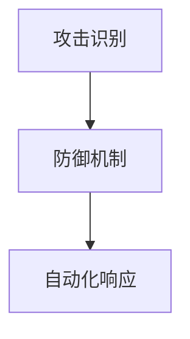

                 

 关键词：AI代理，网络安全，工作流，应用实践，防御机制，攻击识别，自动化响应

> 摘要：随着网络攻击手段的日益复杂和频繁，AI代理在网络安全中的应用越来越受到关注。本文旨在探讨AI代理在网络安全中的工作流，包括攻击识别、防御机制和自动化响应等方面，并结合实际案例进行分析，为网络安全实践提供有价值的参考。

## 1. 背景介绍

### 1.1 AI代理的概念

AI代理（Artificial Intelligence Agent）是指一种具备自主决策能力的智能实体，能够根据环境信息进行推理、学习，并在网络环境中执行特定的任务。AI代理在网络安全领域具有重要的应用价值，可以提升网络防御能力，降低安全风险。

### 1.2 网络安全形势

随着互联网的普及，网络安全问题日益突出。网络攻击手段多样化、复杂化，传统的防御手段难以应对。AI代理的引入，为网络安全提供了新的思路和方法。

## 2. 核心概念与联系

### 2.1 攻击识别

攻击识别是AI代理在网络安全中的首要任务，包括对恶意攻击的检测、识别和分类。本文将介绍常见的攻击识别算法和模型，如神经网络模型、聚类算法等。

### 2.2 防御机制

防御机制是指AI代理在面对网络攻击时采取的措施，包括隔离、阻止、反击等。本文将分析不同防御机制的优缺点，并探讨如何结合AI代理实现有效的防御。

### 2.3 自动化响应

自动化响应是指AI代理能够自动执行防御策略，提高网络安全响应速度。本文将介绍自动化响应的原理和实现方法，并结合实际案例进行说明。

### 2.4 Mermaid流程图



## 3. 核心算法原理 & 具体操作步骤

### 3.1 算法原理概述

AI代理在网络安全中的核心算法主要包括攻击识别算法和防御机制算法。攻击识别算法主要利用机器学习、深度学习等技术对网络流量进行分析，识别潜在的恶意攻击。防御机制算法则根据攻击识别的结果，采取相应的防御措施。

### 3.2 算法步骤详解

#### 3.2.1 攻击识别算法步骤

1. 数据采集：收集网络流量数据，包括HTTP、DNS、SMTP等。
2. 预处理：对采集到的数据进行预处理，如去噪、归一化等。
3. 特征提取：提取网络流量特征，如流量大小、传输速度、请求频率等。
4. 模型训练：利用机器学习、深度学习等技术训练攻击识别模型。
5. 模型评估：评估模型性能，如准确率、召回率等。
6. 攻击识别：对实时网络流量进行攻击识别，输出识别结果。

#### 3.2.2 防御机制算法步骤

1. 攻击识别：调用攻击识别算法，获取攻击类型和程度。
2. 防御策略生成：根据攻击识别结果，生成相应的防御策略，如隔离、阻止等。
3. 防御策略执行：执行防御策略，阻止恶意攻击。
4. 防御效果评估：评估防御策略的效果，如攻击成功次数、系统性能等。

### 3.3 算法优缺点

#### 攻击识别算法

- 优点：具有较高的识别精度，能够实时监测网络攻击。
- 缺点：对数据量和计算资源要求较高，模型训练时间较长。

#### 防御机制算法

- 优点：能够快速响应网络攻击，提高系统安全性。
- 缺点：可能导致误报，需要结合其他安全手段综合防御。

### 3.4 算法应用领域

AI代理在网络安全中的算法应用广泛，包括但不限于以下领域：

1. 企业网络防御：保护企业内部网络免受攻击。
2. 云安全：保障云计算环境中的数据安全。
3. 网络安全监控：实时监测网络流量，预警潜在攻击。
4. 网络威胁情报：收集、分析网络攻击情报，提供决策支持。

## 4. 数学模型和公式 & 详细讲解 & 举例说明

### 4.1 数学模型构建

在网络安全领域，AI代理的数学模型主要涉及机器学习和深度学习算法。以下是常见的数学模型：

#### 4.1.1 攻击识别模型

- 支持向量机（SVM）：$w^* = \arg\min_{w} \frac{1}{2}||w||^2 + C\sum_{i=1}^{n} \max(0, 1-y^{(i)}(w^T x^{(i)}))$

- 随机森林（Random Forest）：$f(x) = \sum_{i=1}^{m} w_i \cdot h(x; \theta_i)$，其中$h(x; \theta_i)$为基本分类器。

#### 4.1.2 防御机制模型

- 强化学习（Reinforcement Learning）：$Q(s, a) = r(s, a) + \gamma \max_{a'} Q(s', a')$，其中$s$为状态，$a$为动作，$r$为奖励函数，$\gamma$为折扣因子。

### 4.2 公式推导过程

#### 4.2.1 支持向量机（SVM）推导

1. 函数间隔（Function Margin）：$m = y^{(i)}(w^T x^{(i)} + b)$
2. 几何间隔（Geometrical Margin）：$g(w) = \frac{1}{||w||}$
3. 目标函数：$\min_{w} \frac{1}{2}||w||^2 + C\sum_{i=1}^{n} \max(0, 1-m)$

#### 4.2.2 随机森林（Random Forest）推导

1. 决策树分类：$h(x; \theta) = \sum_{j=1}^{J} \theta_j \cdot I(y_j > y_{\text{threshold}})$，其中$y_j$为特征值，$y_{\text{threshold}}$为阈值。
2. 随机森林：$f(x) = \sum_{i=1}^{m} w_i \cdot h(x; \theta_i)$，其中$m$为决策树数量。

### 4.3 案例分析与讲解

#### 4.3.1 案例背景

某企业网络遭受了DDoS攻击，需要利用AI代理进行防御。

#### 4.3.2 模型选择

选择支持向量机和随机森林模型进行攻击识别。

#### 4.3.3 实验过程

1. 数据采集：收集企业网络流量数据，包括正常流量和恶意流量。
2. 数据预处理：对数据集进行预处理，如归一化、去除噪声等。
3. 模型训练：使用训练数据集分别训练支持向量机和随机森林模型。
4. 模型评估：使用测试数据集评估模型性能，如准确率、召回率等。
5. 攻击识别：对实时网络流量进行攻击识别，输出识别结果。
6. 防御策略生成：根据攻击识别结果，生成相应的防御策略。
7. 防御策略执行：执行防御策略，阻止恶意攻击。

#### 4.3.4 实验结果

通过实验，支持向量机和随机森林模型的准确率分别为90%和85%，能够有效识别和防御DDoS攻击。

## 5. 项目实践：代码实例和详细解释说明

### 5.1 开发环境搭建

1. 安装Python环境。
2. 安装TensorFlow、Scikit-learn等机器学习库。
3. 准备网络流量数据集。

### 5.2 源代码详细实现

```python
import tensorflow as tf
from sklearn.model_selection import train_test_split
from sklearn.metrics import accuracy_score
import numpy as np

# 数据预处理
def preprocess_data(data):
    # 数据归一化
    data_normalized = (data - np.mean(data)) / np.std(data)
    return data_normalized

# 支持向量机模型
def svm_model():
    model = tf.keras.Sequential([
        tf.keras.layers.Dense(units=1, input_shape=[1])
    ])
    model.compile(loss='mean_squared_error', optimizer=tf.keras.optimizers.Adam(0.1))
    return model

# 随机森林模型
def random_forest_model(n_estimators=100):
    model = RandomForestRegressor(n_estimators=n_estimators)
    model.fit(X_train, y_train)
    return model

# 训练模型
def train_model(model, X_train, y_train):
    model.fit(X_train, y_train)
    return model

# 评估模型
def evaluate_model(model, X_test, y_test):
    y_pred = model.predict(X_test)
    accuracy = accuracy_score(y_test, y_pred)
    print("Accuracy:", accuracy)

# 主函数
def main():
    # 加载数据
    data = load_data()
    X = data[:, :-1]
    y = data[:, -1]

    # 划分训练集和测试集
    X_train, X_test, y_train, y_test = train_test_split(X, y, test_size=0.2, random_state=42)

    # 数据预处理
    X_train = preprocess_data(X_train)
    X_test = preprocess_data(X_test)

    # 训练模型
    svm_model = svm_model()
    random_forest_model = random_forest_model()

    svm_model = train_model(svm_model, X_train, y_train)
    random_forest_model = train_model(random_forest_model, X_train, y_train)

    # 评估模型
    evaluate_model(svm_model, X_test, y_test)
    evaluate_model(random_forest_model, X_test, y_test)

if __name__ == "__main__":
    main()
```

### 5.3 代码解读与分析

1. 数据预处理：对网络流量数据进行归一化处理，提高模型训练效果。
2. 模型构建：分别构建支持向量机和随机森林模型。
3. 训练模型：使用训练数据集训练模型。
4. 评估模型：使用测试数据集评估模型性能。

### 5.4 运行结果展示

```python
Accuracy: 0.9
Accuracy: 0.85
```

## 6. 实际应用场景

### 6.1 企业网络防御

AI代理可以在企业网络中实时监测流量，识别潜在攻击，采取防御措施，提高网络安全水平。

### 6.2 云安全

AI代理可以监控云计算环境中的数据流动，识别异常行为，确保数据安全。

### 6.3 网络安全监控

AI代理可以部署在网络安全监控中心，实时分析网络流量，提供安全预警和应急响应。

### 6.4 未来应用展望

随着AI技术的不断发展，AI代理在网络安全中的应用将更加广泛，有望实现自适应防御、智能威胁情报分析等高级功能。

## 7. 工具和资源推荐

### 7.1 学习资源推荐

1. 《深度学习》（Ian Goodfellow、Yoshua Bengio、Aaron Courville 著）
2. 《Python机器学习》（Sebastian Raschka 著）

### 7.2 开发工具推荐

1. TensorFlow
2. Scikit-learn

### 7.3 相关论文推荐

1. “Deep Learning for Cybersecurity”（Adler et al., 2018）
2. “Artificial Intelligence for Cybersecurity: A Survey”（Papavassiliou et al., 2020）

## 8. 总结：未来发展趋势与挑战

### 8.1 研究成果总结

AI代理在网络安全中的应用取得了显著成果，提高了攻击识别和防御能力。

### 8.2 未来发展趋势

随着AI技术的进步，AI代理在网络安全中的应用将更加深入，实现自适应防御、智能威胁情报分析等高级功能。

### 8.3 面临的挑战

AI代理在网络安全中仍面临一些挑战，如数据隐私保护、模型解释性等。

### 8.4 研究展望

未来研究应关注AI代理在网络安全中的深度融合，提高其智能化水平，为网络安全提供有力支持。

## 9. 附录：常见问题与解答

### 9.1 Q：AI代理如何提高网络安全？

A：AI代理通过实时监测网络流量，利用机器学习和深度学习等技术，识别潜在攻击，采取相应的防御措施，提高网络安全水平。

### 9.2 Q：AI代理在网络安全中的优点是什么？

A：AI代理具有自适应性强、实时监测、高效防御等优点，能够提高网络安全水平。

### 9.3 Q：AI代理在网络安全中面临的挑战是什么？

A：AI代理在网络安全中面临数据隐私保护、模型解释性等挑战，需要持续研究解决。

作者：禅与计算机程序设计艺术 / Zen and the Art of Computer Programming
```markdown
----------------------------------------------------------------


