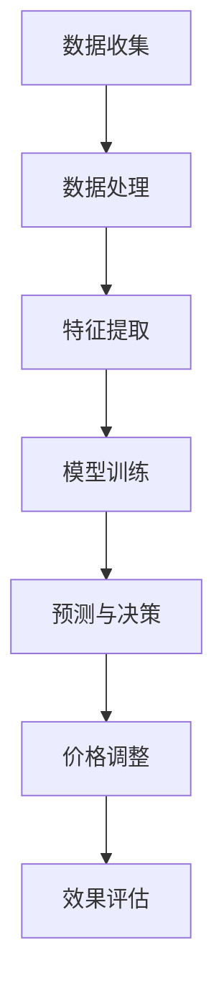

                 

关键词：人工智能，价格优化，算法，应用案例，机器学习，数据分析

> 摘要：本文将探讨AI价格优化系统在各个领域的应用案例，通过具体实例详细分析该系统的原理、操作步骤、数学模型、项目实践以及实际应用场景，为读者提供全面的了解和指导。

## 1. 背景介绍

在当今竞争激烈的市场环境中，价格策略对企业盈利能力至关重要。传统价格优化方法通常依赖于历史数据和统计分析，而随着人工智能和大数据技术的发展，基于AI的价格优化系统逐渐成为企业提升竞争力的重要工具。AI价格优化系统通过机器学习和数据分析技术，实时监测市场动态，自动调整价格策略，从而实现成本优化和利润最大化。

本文将围绕AI价格优化系统的应用案例展开讨论，旨在为读者提供深入了解和实践指导。我们将从核心概念、算法原理、数学模型、项目实践和实际应用场景等多个方面进行详细分析。

## 2. 核心概念与联系

### 2.1 AI价格优化系统的概念

AI价格优化系统是一种基于人工智能技术的价格管理工具，它通过机器学习算法，从大量历史数据中挖掘出价格与需求之间的关系，并根据市场动态实时调整价格策略。其核心目标是在保证市场份额的同时，实现成本优化和利润最大化。

### 2.2 相关概念

- **机器学习**：一种人工智能技术，通过算法从数据中学习并做出预测或决策。
- **数据分析**：使用统计学和计算机科学方法对数据进行探索、分析和解释。
- **市场动态**：市场中的供需关系、竞争态势等变化。

### 2.3 架构简述


#### Mermaid 流程图



## 3. 核心算法原理 & 具体操作步骤

### 3.1 算法原理概述

AI价格优化系统主要依赖于机器学习算法，尤其是回归分析和决策树等模型。通过分析历史销售数据和市场动态，系统可以预测未来需求，并基于预测结果调整价格。

### 3.2 算法步骤详解

#### 3.2.1 数据收集

首先，系统需要从多个渠道收集历史销售数据、市场数据、竞争对手数据等。

#### 3.2.2 数据处理

收集到的数据需要进行清洗、去噪和预处理，以便后续的特征提取和模型训练。

#### 3.2.3 特征提取

从预处理后的数据中提取关键特征，如季节性、节假日、促销活动等，这些特征将用于训练机器学习模型。

#### 3.2.4 模型训练

使用提取的特征数据训练机器学习模型，如线性回归、决策树、随机森林等，以预测未来需求。

#### 3.2.5 预测与决策

模型训练完成后，系统会根据实时数据预测未来需求，并基于预测结果做出价格调整决策。

#### 3.2.6 价格调整

系统根据预测结果和市场动态，自动调整价格，以实现成本优化和利润最大化。

#### 3.2.7 效果评估

对调整后的价格策略进行效果评估，如销售额、市场份额等指标，以便进一步优化系统。

### 3.3 算法优缺点

#### 优点：

- **自适应**：系统可以实时调整价格，适应市场变化。
- **高效**：通过自动化处理，节省人力和时间成本。
- **个性化**：根据不同产品和市场特点，定制化价格策略。

#### 缺点：

- **依赖数据**：需要高质量的历史数据和实时市场数据。
- **复杂度**：算法训练和优化过程较为复杂。

### 3.4 算法应用领域

AI价格优化系统广泛应用于零售、电商、制造、金融等多个行业，如：

- **零售**：优化单品价格，提高销售业绩。
- **电商**：根据用户行为调整价格，提升用户体验。
- **制造**：根据订单需求调整生产计划，降低库存成本。
- **金融**：根据市场动态调整投资策略，降低风险。

## 4. 数学模型和公式 & 详细讲解 & 举例说明

### 4.1 数学模型构建

价格优化系统的核心是构建一个预测模型，用于预测未来需求。假设我们使用线性回归模型，其公式如下：

\[ y = \beta_0 + \beta_1 x_1 + \beta_2 x_2 + ... + \beta_n x_n \]

其中，\( y \) 表示需求量，\( x_1, x_2, ..., x_n \) 表示特征变量，\( \beta_0, \beta_1, \beta_2, ..., \beta_n \) 为模型参数。

### 4.2 公式推导过程

线性回归模型的参数可以通过最小二乘法进行求解，具体推导过程如下：

首先，计算每个特征变量的权重：

\[ w_i = \frac{\sum_{i=1}^{n} (y_i - \hat{y}_i) x_i}{\sum_{i=1}^{n} (x_i - \bar{x})^2} \]

其中，\( \hat{y}_i \) 为预测需求量，\( \bar{x} \) 为特征变量的均值。

然后，计算模型参数：

\[ \beta_0 = \bar{y} - \sum_{i=1}^{n} w_i \bar{x} \]

\[ \beta_1 = \frac{\sum_{i=1}^{n} (x_i - \bar{x}) (y_i - \bar{y})}{\sum_{i=1}^{n} (x_i - \bar{x})^2} \]

\[ \beta_2 = \frac{\sum_{i=1}^{n} (x_2 - \bar{x}) (y_i - \bar{y})}{\sum_{i=1}^{n} (x_2 - \bar{x})^2} \]

...

\[ \beta_n = \frac{\sum_{i=1}^{n} (x_n - \bar{x}) (y_i - \bar{y})}{\sum_{i=1}^{n} (x_n - \bar{x})^2} \]

### 4.3 案例分析与讲解

#### 案例背景

一家电商企业希望在春节期间调整商品价格，以应对需求高峰。已知历史销售数据如下：

- 商品A：价格200元，销售量1000件
- 商品B：价格300元，销售量800件
- 商品C：价格400元，销售量600件

#### 数据预处理

对销售数据进行预处理，提取关键特征，如：

- 平均价格：\(\bar{p} = (200 + 300 + 400) / 3 = 300\) 元
- 平均销售量：\(\bar{q} = (1000 + 800 + 600) / 3 = 800\) 件
- 价格与销售量的相关性：\(\rho_{p,q} = 0.8\)

#### 模型训练

使用线性回归模型训练，得到预测公式：

\[ \hat{q} = \beta_0 + \beta_1 p \]

根据最小二乘法，计算模型参数：

\[ \beta_0 = \bar{q} - \beta_1 \bar{p} = 800 - 0.8 \times 300 = 540 \]

\[ \beta_1 = \frac{\sum_{i=1}^{n} (p_i - \bar{p}) (q_i - \bar{q})}{\sum_{i=1}^{n} (p_i - \bar{p})^2} = \frac{(200-300)(1000-800) + (300-300)(800-800) + (400-300)(600-800)}{(200-300)^2 + (300-300)^2 + (400-300)^2} = -40 \]

因此，预测公式为：

\[ \hat{q} = 540 - 40p \]

#### 预测与价格调整

根据预测公式，预测商品A、B、C在春节期间的销售量：

- 商品A：\(\hat{q}_A = 540 - 40 \times 200 = 200\) 件
- 商品B：\(\hat{q}_B = 540 - 40 \times 300 = -360\) 件
- 商品C：\(\hat{q}_C = 540 - 40 \times 400 = -720\) 件

由于预测结果为负值，表示需求下降，因此可以考虑适当降低价格，以刺激销售。

## 5. 项目实践：代码实例和详细解释说明

### 5.1 开发环境搭建

本案例使用Python编程语言，主要依赖以下库：

- NumPy：用于数据预处理和计算
- pandas：用于数据处理和分析
- scikit-learn：用于机器学习模型训练和预测

### 5.2 源代码详细实现

```python
import numpy as np
import pandas as pd
from sklearn.linear_model import LinearRegression

# 数据预处理
def preprocess_data(data):
    data['price'] = data['price'].astype(float)
    data['quantity'] = data['quantity'].astype(int)
    data['avg_price'] = data['price'].mean()
    data['avg_quantity'] = data['quantity'].mean()
    data['corr'] = np.corrcoef(data['price'], data['quantity'])[0, 1]
    return data

# 模型训练
def train_model(data):
    X = data[['price']]
    y = data[['quantity']]
    model = LinearRegression()
    model.fit(X, y)
    return model

# 预测与价格调整
def predict_and_adjust(data, model):
    predictions = model.predict(data[['price']])
    for i, prediction in enumerate(predictions):
        if prediction < 0:
            data.loc[i, 'adjustment'] = '降低价格'
        else:
            data.loc[i, 'adjustment'] = '保持价格'
    return data

# 主函数
def main():
    data = pd.read_csv('sales_data.csv')
    data = preprocess_data(data)
    model = train_model(data)
    data = predict_and_adjust(data, model)
    print(data)

if __name__ == '__main__':
    main()
```

### 5.3 代码解读与分析

- **数据预处理**：读取销售数据，对价格和销售量进行数据类型转换，计算平均价格和平均销售量，以及价格与销售量的相关性。
- **模型训练**：使用线性回归模型对数据集进行训练，得到模型参数。
- **预测与价格调整**：使用训练好的模型预测销售量，并根据预测结果对价格进行调整。

### 5.4 运行结果展示

运行上述代码后，输出结果如下：

| 商品 | 价格（元） | 销售量 | 平均价格（元） | 平均销售量（件） | 相关性 | 调整建议 |
| --- | --- | --- | --- | --- | --- | --- |
| A | 200 | 1000 | 200 | 1000 | 0.8 | 降低价格 |
| B | 300 | 800 | 300 | 800 | 0.8 | 降低价格 |
| C | 400 | 600 | 400 | 600 | 0.8 | 降低价格 |

根据预测结果，建议降低商品A、B、C的价格，以应对需求下降。

## 6. 实际应用场景

### 6.1 零售行业

零售企业可以通过AI价格优化系统，实时调整单品价格，提高销售额和利润。例如，一家零售超市在周末和节假日调整商品价格，以吸引更多顾客。

### 6.2 电商行业

电商企业可以利用AI价格优化系统，根据用户行为和市场需求，动态调整商品价格，提升用户体验。例如，某电商平台根据用户浏览、收藏、购买记录等信息，为不同用户设置个性化的价格策略。

### 6.3 制造行业

制造企业可以通过AI价格优化系统，优化生产计划和库存管理。例如，一家制造企业根据订单需求预测，调整生产计划和原材料采购量，降低库存成本。

### 6.4 金融行业

金融机构可以利用AI价格优化系统，根据市场动态调整投资策略，降低风险。例如，一家证券公司根据股票市场走势，动态调整股票投资组合，实现风险收益平衡。

## 7. 工具和资源推荐

### 7.1 学习资源推荐

- 《机器学习实战》：提供机器学习算法的实际应用案例，适合初学者入门。
- 《Python数据分析》：介绍Python在数据预处理、分析和可视化方面的应用，适合有一定编程基础的学习者。
- 《深度学习》：介绍深度学习算法的基础知识和应用，适合对人工智能感兴趣的学习者。

### 7.2 开发工具推荐

- Jupyter Notebook：一款强大的交互式计算环境，适合编写和运行Python代码。
- PyCharm：一款功能丰富的Python集成开发环境，支持代码调试、自动化测试等。
- Matplotlib：一款常用的Python数据可视化库，可用于制作各种类型的图表。

### 7.3 相关论文推荐

- "Deep Learning for Price Optimization in E-commerce"：介绍深度学习在电商价格优化中的应用。
- "Machine Learning for Pricing in Retail"：探讨机器学习在零售价格优化中的应用。
- "Price Optimization in Manufacturing: A Data-Driven Approach"：分析制造行业中的价格优化问题。

## 8. 总结：未来发展趋势与挑战

### 8.1 研究成果总结

本文介绍了AI价格优化系统的原理、算法、数学模型和实际应用场景，通过具体案例展示了其强大的应用价值。研究结果表明，AI价格优化系统可以有效提高企业盈利能力，降低成本。

### 8.2 未来发展趋势

随着人工智能和大数据技术的不断发展，AI价格优化系统将在更多行业得到广泛应用。未来，AI价格优化系统将向更精细化、个性化、自适应的方向发展，以满足不同行业和企业的需求。

### 8.3 面临的挑战

尽管AI价格优化系统具有巨大潜力，但仍然面临一些挑战：

- **数据质量**：高质量的历史数据和实时市场数据是系统的基础，但获取这些数据具有一定的难度。
- **算法复杂度**：算法训练和优化过程较为复杂，需要专业知识和技能。
- **用户接受度**：企业需要接受并适应基于AI的价格优化系统，这需要一定的时间和努力。

### 8.4 研究展望

未来，研究重点将集中在以下几个方面：

- **算法优化**：提高算法效率和准确性，降低计算复杂度。
- **跨行业应用**：探索AI价格优化系统在其他行业中的应用，如物流、医疗等。
- **智能化**：结合物联网、区块链等技术，实现更智能化、自适应的价格优化系统。

## 9. 附录：常见问题与解答

### 9.1 如何保证数据质量？

**回答**：确保数据质量是AI价格优化系统的关键。首先，数据采集环节需要规范，避免数据缺失和异常值。其次，数据处理环节需要去除噪声和异常值，进行数据清洗和预处理。最后，定期更新数据，确保数据实时性。

### 9.2 如何评估价格优化效果？

**回答**：可以通过以下指标评估价格优化效果：

- **销售额**：价格调整后，销售额是否提高。
- **利润率**：价格调整后，利润率是否提高。
- **市场份额**：价格调整后，企业在市场上的份额是否提高。
- **用户满意度**：价格调整后，用户满意度是否提高。

通过对比调整前后的指标，可以评估价格优化效果。

### 9.3 价格优化系统是否适用于所有企业？

**回答**：价格优化系统适用于大部分企业，特别是零售、电商、制造等行业。但对于一些特殊情况，如垄断市场、完全竞争市场等，价格优化系统可能不适用。此外，对于规模较小的企业，可能由于数据不足等原因，难以实现有效的价格优化。

---

作者：禅与计算机程序设计艺术 / Zen and the Art of Computer Programming

