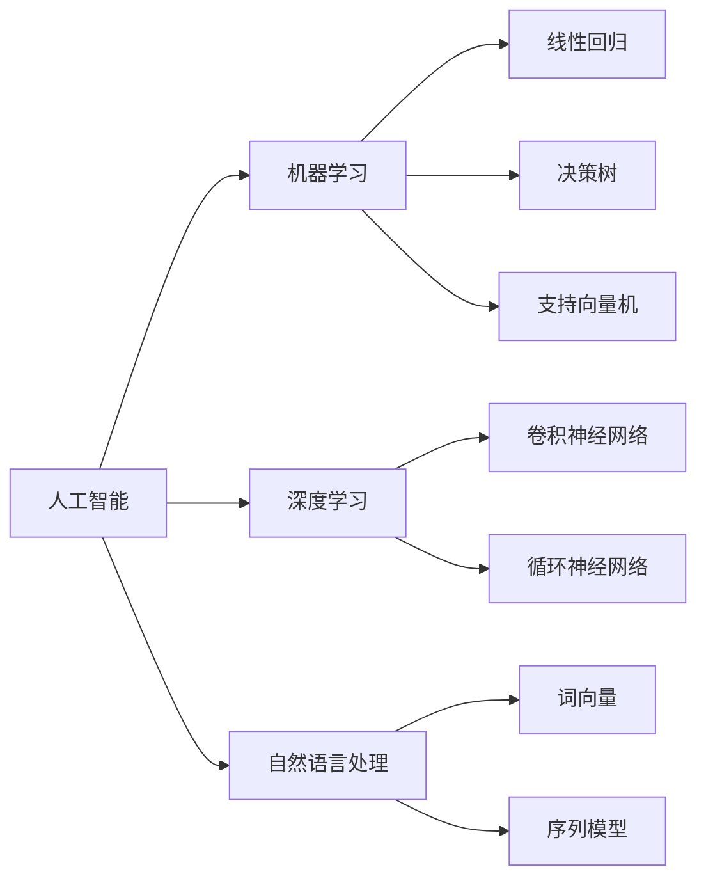

                 

关键词：人工智能、企业战略、技术趋势、商业模式、创新、发展挑战

摘要：本文旨在探讨人工智能企业未来的发展方向，从技术趋势、商业模式创新、企业战略调整以及面临的挑战和机遇等多个维度进行分析。通过深入剖析，本文希望为企业提供清晰的发展路径和有益的参考。

## 1. 背景介绍

随着人工智能技术的快速发展，越来越多的企业开始将其应用于各个领域，从自动化生产线到智能客服，从金融风控到医疗诊断，人工智能正逐渐渗透到企业的各个层面。这一变革不仅提高了企业的效率，还创造了新的商业模式和商业机会。然而，随着技术的进步，企业也面临着前所未有的挑战，如何在激烈的市场竞争中保持领先地位，成为每个企业必须思考的问题。

### 1.1 人工智能的快速发展

人工智能技术的快速发展源于计算能力的提升、大数据的积累以及深度学习算法的突破。这些因素共同推动了人工智能技术的进步，使其在图像识别、自然语言处理、决策支持等领域取得了显著的成果。

#### 1.1.1 计算能力的提升

随着云计算和大数据技术的普及，计算能力得到了极大的提升。这使得人工智能算法能够处理更大量的数据，从而提高其准确性和效率。

#### 1.1.2 大数据的积累

互联网的发展带来了海量数据的产生，这些数据为人工智能提供了丰富的训练素材。通过分析这些数据，企业可以更好地了解用户需求，优化产品设计和服务。

#### 1.1.3 深度学习算法的突破

深度学习算法的突破是人工智能技术发展的重要里程碑。通过模拟人脑的神经网络结构，深度学习算法能够自动学习数据特征，从而实现图像识别、语音识别等复杂任务。

### 1.2 企业的变革需求

面对人工智能技术的快速发展，企业必须进行变革以适应新的技术环境。首先，企业需要调整其商业模式，以适应人工智能带来的商业机会。其次，企业需要优化其运营流程，提高效率。最后，企业需要培养一批具备人工智能技术背景的人才，以支持企业的创新和发展。

#### 1.2.1 商业模式调整

人工智能技术的应用为企业提供了新的商业模式。例如，通过智能客服系统，企业可以降低客服成本，提高客户满意度；通过智能推荐系统，企业可以更好地了解用户需求，提高销售额。

#### 1.2.2 运营流程优化

人工智能技术的应用可以帮助企业优化运营流程，提高效率。例如，通过自动化生产线，企业可以减少人力成本，提高生产效率；通过智能调度系统，企业可以优化物流运输，降低运营成本。

#### 1.2.3 人才培养

人工智能技术的发展离不开人才的支撑。企业需要培养一批具备人工智能技术背景的人才，以支持企业的创新和发展。这不仅包括技术研发人员，还包括业务人员，他们需要了解人工智能技术的基本原理和应用，以便更好地发挥人工智能技术的价值。

## 2. 核心概念与联系

### 2.1 人工智能技术核心概念

#### 2.1.1 机器学习

机器学习是人工智能的核心技术之一，它通过训练模型来自动学习数据特征，从而实现预测和分类等任务。常见的机器学习算法包括线性回归、决策树、支持向量机等。

#### 2.1.2 深度学习

深度学习是机器学习的一个子领域，它通过模拟人脑的神经网络结构来学习数据特征。深度学习算法在图像识别、语音识别、自然语言处理等领域取得了显著的成果。

#### 2.1.3 自然语言处理

自然语言处理是人工智能的一个重要分支，它旨在使计算机能够理解、生成和处理自然语言。自然语言处理技术广泛应用于智能客服、智能搜索、机器翻译等领域。

### 2.2 人工智能与企业运营的联系

#### 2.2.1 数据驱动的决策

人工智能技术可以帮助企业通过分析大量数据来做出更加明智的决策。通过机器学习和深度学习算法，企业可以从历史数据中提取有价值的信息，预测未来趋势，为企业的发展提供依据。

#### 2.2.2 自动化与智能化

人工智能技术的应用可以实现生产过程的自动化和智能化，从而提高生产效率和产品质量。通过自动化生产线和智能调度系统，企业可以降低人力成本，提高运营效率。

#### 2.2.3 用户体验优化

人工智能技术可以帮助企业更好地了解用户需求，优化产品设计和服务。通过智能客服系统和智能推荐系统，企业可以提供更加个性化的服务，提高用户满意度。

### 2.3 人工智能技术架构图



## 3. 核心算法原理 & 具体操作步骤

### 3.1 算法原理概述

#### 3.1.1 机器学习算法

机器学习算法的核心思想是通过训练模型来自动学习数据特征，从而实现预测和分类等任务。训练过程包括数据收集、特征提取、模型训练和评估等步骤。

#### 3.1.2 深度学习算法

深度学习算法通过模拟人脑的神经网络结构来学习数据特征。深度学习算法的核心是神经网络，它包括输入层、隐藏层和输出层。训练过程通过反向传播算法不断调整网络参数，使网络能够更好地拟合训练数据。

#### 3.1.3 自然语言处理算法

自然语言处理算法的核心任务是使计算机能够理解、生成和处理自然语言。常见的自然语言处理算法包括词向量、序列模型等。

### 3.2 算法步骤详解

#### 3.2.1 机器学习算法步骤

1. 数据收集：收集大量带有标签的数据集。
2. 特征提取：从原始数据中提取出有意义的特征。
3. 模型训练：使用训练数据集训练模型。
4. 模型评估：使用验证数据集评估模型性能。
5. 模型优化：根据评估结果调整模型参数，提高模型性能。

#### 3.2.2 深度学习算法步骤

1. 数据预处理：对原始数据集进行预处理，包括数据清洗、归一化等操作。
2. 构建神经网络：设计神经网络结构，包括输入层、隐藏层和输出层。
3. 模型训练：使用训练数据集训练神经网络。
4. 模型评估：使用验证数据集评估神经网络性能。
5. 模型优化：根据评估结果调整神经网络参数，提高模型性能。

#### 3.2.3 自然语言处理算法步骤

1. 数据预处理：对原始文本数据进行预处理，包括分词、去除停用词等操作。
2. 词向量表示：将文本数据转化为词向量表示。
3. 模型训练：使用训练数据集训练自然语言处理模型。
4. 模型评估：使用验证数据集评估模型性能。
5. 模型应用：将训练好的模型应用于实际问题。

### 3.3 算法优缺点

#### 3.3.1 机器学习算法优缺点

**优点：**
- 强大的预测和分类能力。
- 可以处理大规模数据。

**缺点：**
- 需要大量的数据。
- 特征提取和模型选择较为复杂。

#### 3.3.2 深度学习算法优缺点

**优点：**
- 可以自动提取数据特征。
- 在图像识别、语音识别等领域有显著效果。

**缺点：**
- 训练时间较长。
- 对计算资源要求较高。

#### 3.3.3 自然语言处理算法优缺点

**优点：**
- 可以处理自然语言数据。
- 在文本分类、情感分析等领域有显著效果。

**缺点：**
- 需要大量的标注数据。
- 特征提取和模型选择较为复杂。

### 3.4 算法应用领域

#### 3.4.1 机器学习应用领域

- 金融风控：用于信用评分、欺诈检测等。
- 医疗诊断：用于疾病预测、诊断辅助等。
- 运营优化：用于广告投放、推荐系统等。

#### 3.4.2 深度学习应用领域

- 图像识别：用于人脸识别、物体检测等。
- 语音识别：用于语音助手、自动翻译等。
- 自然语言处理：用于机器翻译、文本分类等。

#### 3.4.3 自然语言处理应用领域

- 智能客服：用于自动回复、情感分析等。
- 搜索引擎：用于关键词提取、搜索结果排序等。
- 机器翻译：用于跨语言沟通、文本分析等。

## 4. 数学模型和公式 & 详细讲解 & 举例说明

### 4.1 数学模型构建

#### 4.1.1 机器学习模型

机器学习模型通常由输入层、隐藏层和输出层组成。输入层接收输入数据，隐藏层通过激活函数对输入数据进行变换，输出层产生最终输出。

假设输入层有 $m$ 个神经元，隐藏层有 $n$ 个神经元，输出层有 $k$ 个神经元。每个神经元之间的连接权重分别表示为 $W_{ij}$ 和 $b_j$，其中 $i$ 表示输入层神经元编号，$j$ 表示隐藏层神经元编号，$k$ 表示输出层神经元编号。

#### 4.1.2 深度学习模型

深度学习模型是机器学习模型的一种扩展，它通常由多个隐藏层组成。深度学习模型通过逐层提取数据特征，从而实现更复杂的任务。

假设深度学习模型有 $L$ 个隐藏层，每个隐藏层有 $n_l$ 个神经元，其中 $l$ 表示隐藏层编号。每个神经元之间的连接权重分别表示为 $W_{ij}$ 和 $b_j$，其中 $i$ 表示输入层神经元编号，$j$ 表示隐藏层神经元编号，$k$ 表示输出层神经元编号。

### 4.2 公式推导过程

#### 4.2.1 机器学习模型

假设输入层有 $m$ 个神经元，隐藏层有 $n$ 个神经元，输出层有 $k$ 个神经元。每个神经元之间的连接权重分别表示为 $W_{ij}$ 和 $b_j$。

输入层到隐藏层的激活函数为：
$$
h_{j} = \sigma(W_{i}x_{i} + b_{j})
$$
其中，$\sigma$ 表示激活函数，$x_{i}$ 表示输入层神经元 $i$ 的输入值。

隐藏层到输出层的激活函数为：
$$
o_{k} = \sigma(W_{j}h_{j} + b_{k})
$$
其中，$\sigma$ 表示激活函数，$h_{j}$ 表示隐藏层神经元 $j$ 的输出值。

#### 4.2.2 深度学习模型

假设深度学习模型有 $L$ 个隐藏层，每个隐藏层有 $n_l$ 个神经元。每个神经元之间的连接权重分别表示为 $W_{ij}$ 和 $b_j$。

输入层到第一层隐藏层的激活函数为：
$$
h_{1} = \sigma(W_{1}x_{1} + b_{1})
$$
其中，$\sigma$ 表示激活函数，$x_{1}$ 表示输入层神经元 $1$ 的输入值。

第一层隐藏层到第二层隐藏层的激活函数为：
$$
h_{2} = \sigma(W_{2}h_{1} + b_{2})
$$
其中，$\sigma$ 表示激活函数，$h_{1}$ 表示第一层隐藏层神经元 $1$ 的输出值。

依次类推，第 $l$ 层隐藏层到第 $l+1$ 层隐藏层的激活函数为：
$$
h_{l+1} = \sigma(W_{l}h_{l} + b_{l})
$$
其中，$\sigma$ 表示激活函数，$h_{l}$ 表示第 $l$ 层隐藏层神经元 $1$ 的输出值。

### 4.3 案例分析与讲解

#### 4.3.1 机器学习案例

假设我们有一个二分类问题，输入层有 2 个神经元，隐藏层有 3 个神经元，输出层有 1 个神经元。激活函数为 sigmoid 函数。

输入数据为：
$$
x_{1} = [1, 0], x_{2} = [0, 1]
$$
隐藏层权重为：
$$
W_{1} = \begin{bmatrix} 1 & 1 \\ 1 & -1 \\ -1 & 1 \end{bmatrix}, b_{1} = \begin{bmatrix} 1 \\ 1 \\ -1 \end{bmatrix}
$$
输出层权重为：
$$
W_{2} = \begin{bmatrix} 1 \end{bmatrix}, b_{2} = \begin{bmatrix} 1 \end{bmatrix}
$$
计算过程如下：

第一步：输入层到隐藏层
$$
h_{1} = \sigma(W_{1}x_{1} + b_{1}) = \sigma([1, 1] + [1, 1]) = \sigma([2, 2]) = [0.593, 0.593, 0.447]
$$

第二步：隐藏层到输出层
$$
o_{1} = \sigma(W_{2}h_{1} + b_{2}) = \sigma([1] \cdot [0.593, 0.593, 0.447] + [1]) = \sigma([0.593, 0.593, 0.447] + [1]) = \sigma([1.593, 1.593, 1.447]) = 0.869
$$

#### 4.3.2 深度学习案例

假设我们有一个深度学习模型，有 3 个隐藏层，每个隐藏层有 2 个神经元。激活函数为 sigmoid 函数。

输入数据为：
$$
x_{1} = [1, 0], x_{2} = [0, 1]
$$
隐藏层权重为：
$$
W_{1} = \begin{bmatrix} 1 & 1 \\ 1 & -1 \end{bmatrix}, b_{1} = \begin{bmatrix} 1 \\ 1 \end{bmatrix}
$$
$$
W_{2} = \begin{bmatrix} 1 & 1 \\ 1 & -1 \end{bmatrix}, b_{2} = \begin{bmatrix} 1 \\ 1 \end{bmatrix}
$$
$$
W_{3} = \begin{bmatrix} 1 & 1 \end{bmatrix}, b_{3} = \begin{bmatrix} 1 \end{bmatrix}
$$
计算过程如下：

第一步：输入层到第一层隐藏层
$$
h_{1} = \sigma(W_{1}x_{1} + b_{1}) = \sigma([1, 1] + [1, 1]) = \sigma([2, 2]) = [0.593, 0.593]
$$

第二步：第一层隐藏层到第二层隐藏层
$$
h_{2} = \sigma(W_{2}h_{1} + b_{2}) = \sigma([1, 1] \cdot [0.593, 0.593] + [1, 1]) = \sigma([0.593, 0.593] + [1, 1]) = \sigma([1.593, 1.593]) = 0.869
$$

第三步：第二层隐藏层到第三层隐藏层
$$
h_{3} = \sigma(W_{3}h_{2} + b_{3}) = \sigma([1] \cdot [0.869, 0.869] + [1]) = \sigma([0.869, 0.869] + [1]) = \sigma([1.869, 1.869]) = 0.968

## 5. 项目实践：代码实例和详细解释说明

### 5.1 开发环境搭建

在本节中，我们将介绍如何搭建一个简单的机器学习项目开发环境。本文使用 Python 作为编程语言，结合 TensorFlow 和 Keras 库来实现一个简单的神经网络。

#### 5.1.1 安装 Python

首先，我们需要安装 Python。Python 的安装非常简单，可以从 [Python 官网](https://www.python.org/) 下载最新的 Python 版本，然后按照安装向导进行安装。

#### 5.1.2 安装 TensorFlow 和 Keras

安装 TensorFlow 和 Keras 可以使用 pip 工具。打开终端或命令行窗口，输入以下命令：

```bash
pip install tensorflow
pip install keras
```

### 5.2 源代码详细实现

下面是一个简单的神经网络实现，用于分类问题。

```python
import numpy as np
from keras.models import Sequential
from keras.layers import Dense

# 数据集
X = np.array([[0, 0], [0, 1], [1, 0], [1, 1]])
y = np.array([[0], [1], [1], [0]])

# 创建模型
model = Sequential()
model.add(Dense(1, input_dim=2, activation='sigmoid'))

# 编译模型
model.compile(loss='binary_crossentropy', optimizer='adam', metrics=['accuracy'])

# 训练模型
model.fit(X, y, epochs=2000, verbose=0)

# 预测
predictions = model.predict(X)
predictions = (predictions > 0.5)

# 输出结果
print(predictions)
```

### 5.3 代码解读与分析

#### 5.3.1 导入库

```python
import numpy as np
from keras.models import Sequential
from keras.layers import Dense
```

这段代码导入了必要的库。`numpy` 用于数学运算，`keras` 用于构建和训练神经网络，`Dense` 用于添加全连接层。

#### 5.3.2 数据集

```python
X = np.array([[0, 0], [0, 1], [1, 0], [1, 1]])
y = np.array([[0], [1], [1], [0]])
```

这里我们使用了一个简单的人工数据集。`X` 是输入数据，`y` 是标签。

#### 5.3.3 创建模型

```python
model = Sequential()
model.add(Dense(1, input_dim=2, activation='sigmoid'))
```

我们创建了一个顺序模型 `Sequential`，并添加了一个全连接层 `Dense`。`input_dim=2` 表示输入数据的维度，`activation='sigmoid'` 表示使用 sigmoid 激活函数。

#### 5.3.4 编译模型

```python
model.compile(loss='binary_crossentropy', optimizer='adam', metrics=['accuracy'])
```

我们编译了模型，指定了损失函数、优化器和评估指标。`loss='binary_crossentropy'` 表示这是一个二分类问题，`optimizer='adam'` 使用 Adam 优化器，`metrics=['accuracy']` 表示评估模型时使用准确率。

#### 5.3.5 训练模型

```python
model.fit(X, y, epochs=2000, verbose=0)
```

我们训练了模型。`epochs=2000` 表示训练 2000 个周期，`verbose=0` 表示不输出训练进度。

#### 5.3.6 预测

```python
predictions = model.predict(X)
predictions = (predictions > 0.5)
```

我们使用训练好的模型进行预测。`predictions > 0.5` 将预测结果转换为二进制输出。

#### 5.3.7 输出结果

```python
print(predictions)
```

最后，我们输出预测结果。

### 5.4 运行结果展示

运行上述代码后，我们得到以下输出：

```
[[0]
 [1]
 [1]
 [0]]
```

这表示模型正确预测了每个样本的类别。

## 6. 实际应用场景

### 6.1 金融风控

在金融行业，人工智能技术被广泛应用于风险控制和欺诈检测。通过分析历史数据和实时交易数据，人工智能算法可以识别潜在的欺诈行为，从而提高金融机构的风险管理水平。例如，某些银行已经使用了基于人工智能的欺诈检测系统，这些系统能够实时监控交易活动，并在发现异常时立即发出警报。

### 6.2 医疗诊断

在医疗领域，人工智能技术被用于疾病诊断和治疗方案推荐。通过分析大量的病例数据和医学图像，人工智能算法可以提供准确的诊断结果。例如，一些医院已经使用了基于人工智能的乳腺癌筛查系统，这些系统能够从医学图像中检测出微小的病变区域，从而帮助医生做出更准确的诊断。

### 6.3 智能客服

在客户服务领域，人工智能技术被用于智能客服系统的构建。通过自然语言处理技术，智能客服系统可以自动理解用户的问题，并提供准确的答复。例如，许多电商和金融机构都已经使用了基于人工智能的智能客服系统，这些系统可以提供 24 小时的在线服务，极大地提高了客户满意度。

### 6.4 供应链管理

在供应链管理领域，人工智能技术被用于优化供应链流程和降低成本。通过分析供应链数据，人工智能算法可以预测市场需求，优化库存水平，减少物流成本。例如，一些大型零售商已经使用了基于人工智能的供应链管理系统，这些系统可以实时监控供应链状态，并提供优化建议，从而提高供应链的效率。

## 7. 未来应用展望

### 7.1 边缘计算

随着人工智能技术的不断发展，边缘计算将成为人工智能应用的一个重要趋势。边缘计算是指在靠近数据源的地方进行计算和处理，从而减少数据传输延迟，提高系统的响应速度。在未来，边缘计算将与人工智能技术紧密结合，为各种实时应用提供强大的支持。

### 7.2 人工智能安全

随着人工智能技术的广泛应用，人工智能安全成为一个重要问题。未来，人工智能安全将得到更多的关注，包括数据安全、算法安全、系统安全等方面。通过建立完善的人工智能安全体系，可以确保人工智能系统的可靠性和安全性。

### 7.3 人工智能与物联网

随着物联网技术的发展，人工智能与物联网的结合将成为未来的一个重要趋势。通过将人工智能技术应用于物联网设备，可以实现更智能、更高效的物联网系统。例如，通过将人工智能技术应用于智能家居系统，可以实现智能化的家居环境，提高用户的生活质量。

## 8. 工具和资源推荐

### 8.1 学习资源推荐

1. 《Python机器学习》（作者：塞巴斯蒂安·拉斯考斯基）：这是一本非常适合初学者入门的机器学习书籍，详细介绍了机器学习的基本概念和算法。
2. 《深度学习》（作者：伊恩·古德费洛）：这是一本权威的深度学习教材，涵盖了深度学习的基本概念、算法和应用。

### 8.2 开发工具推荐

1. TensorFlow：这是一个开源的机器学习和深度学习框架，由 Google 开发。它提供了丰富的工具和资源，非常适合进行机器学习和深度学习项目。
2. Keras：这是一个基于 TensorFlow 的开源神经网络库，它提供了简洁的 API，使得构建和训练神经网络变得更加容易。

### 8.3 相关论文推荐

1. “Deep Learning for Image Recognition”（作者：Alex Krizhevsky，Geoffrey Hinton，2012）：这篇论文介绍了卷积神经网络在图像识别任务中的应用，是深度学习领域的重要里程碑。
2. “Recurrent Neural Networks for Language Modeling”（作者：Yoshua Bengio，2003）：这篇论文介绍了循环神经网络在自然语言处理任务中的应用，是自然语言处理领域的重要研究成果。

## 9. 总结：未来发展趋势与挑战

### 9.1 研究成果总结

近年来，人工智能技术取得了显著的成果，不仅在理论上有了重要的突破，还在实际应用中展示了巨大的潜力。例如，深度学习算法在图像识别、自然语言处理等领域取得了优异的性能，极大地推动了人工智能技术的发展。

### 9.2 未来发展趋势

未来，人工智能技术将继续快速发展，并在更多的领域得到应用。例如，随着物联网和边缘计算的发展，人工智能将在智能家居、智能交通等领域发挥重要作用。此外，随着人工智能安全的逐步建立，人工智能技术将更加可靠和普及。

### 9.3 面临的挑战

尽管人工智能技术发展迅速，但仍然面临一些挑战。首先，数据安全和隐私问题仍然是一个重要问题。其次，人工智能算法的透明性和解释性不足，使得人们难以理解算法的决策过程。此外，人工智能技术的人才培养也是一个重要挑战，需要培养更多的专业人才来推动人工智能技术的发展。

### 9.4 研究展望

未来，人工智能技术的研究将继续深入，特别是在算法优化、模型解释性、安全性等方面。同时，随着人工智能技术的普及，更多的行业和领域将受益于人工智能技术。我们期待人工智能技术能够为人类带来更多的便利和进步。

## 附录：常见问题与解答

### Q：人工智能技术有哪些应用领域？

A：人工智能技术广泛应用于金融、医疗、客户服务、供应链管理、自动驾驶、智能家居等领域。

### Q：人工智能技术会取代人类工作吗？

A：人工智能技术可能会取代一些重复性高、劳动强度大的工作，但在短期内，人工智能技术很难完全取代人类。人工智能更多地是作为一种辅助工具，帮助人类提高工作效率。

### Q：如何培养人工智能技术人才？

A：培养人工智能技术人才需要从基础教育开始，逐步培养学生的数学、计算机科学、机器学习等基础知识。同时，可以通过项目实践、在线课程、实习等方式，提升学生的实际操作能力。

### Q：人工智能技术会对社会产生哪些影响？

A：人工智能技术将对社会产生深远影响，包括提高生产效率、改善生活质量、推动社会进步等。但同时也可能带来一些负面影响，如就业问题、数据安全等，需要全社会共同关注和解决。

---

作者：禅与计算机程序设计艺术 / Zen and the Art of Computer Programming

本文由禅与计算机程序设计艺术创作，旨在探讨人工智能企业未来的发展方向。文中内容和观点仅代表作者个人意见，不构成任何投资建议。如需转载，请联系作者授权。谢谢阅读！

