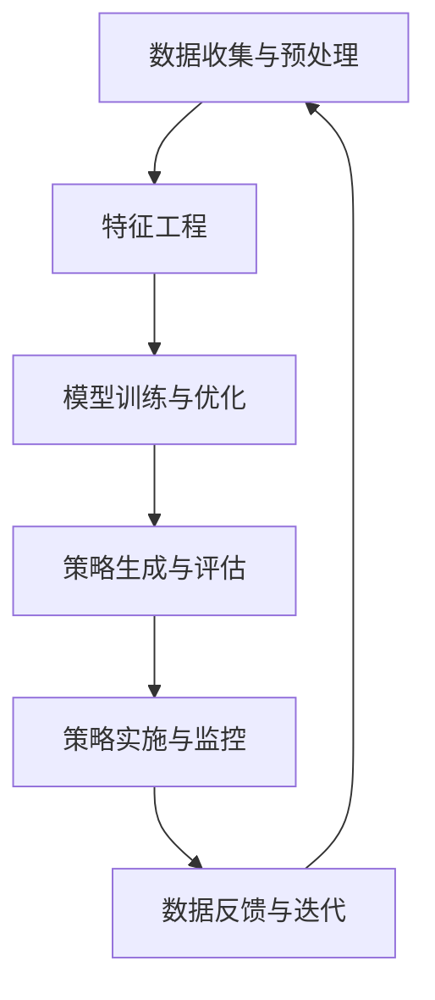

                 

关键词：人工智能，促销策略，案例分析，实践，算法优化，数学模型，应用场景

> 摘要：本文将深入探讨人工智能在优化促销策略中的应用。通过结合具体案例分析，我们将分析AI优化促销策略的原理、数学模型、算法实现，并展示其如何在不同商业场景中发挥巨大作用。同时，我们将展望AI优化促销策略的未来发展趋势和面临的挑战。

## 1. 背景介绍

在当今高度竞争的市场环境中，促销策略是企业获取顾客、增加销量、提高市场份额的重要手段。然而，如何设计有效的促销策略，以最大化收益和市场份额，已成为企业面临的一大挑战。传统促销策略主要依赖历史数据和经验，但面对不断变化的市场环境和消费行为，其效果往往不尽如人意。

随着人工智能技术的快速发展，利用AI优化促销策略成为了一种新的研究方向。人工智能可以通过大数据分析、机器学习算法等技术手段，深入了解消费者的行为模式，预测市场趋势，从而为企业提供更加精准、个性化的促销策略。

本文旨在通过分析具体案例，探讨人工智能优化促销策略的原理和实践方法，为企业在竞争激烈的市场中提供有益的参考。

## 2. 核心概念与联系

### 2.1 人工智能优化促销策略的概念

人工智能优化促销策略是指利用人工智能技术，通过对大量数据的分析和处理，为企业提供最优的促销方案，从而提高销售业绩和市场占有率。这一过程主要包括以下几个步骤：

1. **数据收集与预处理**：收集与企业促销相关的各类数据，包括消费者行为数据、市场数据、竞争对手数据等，并对数据进行清洗、去重、标准化等预处理操作。
2. **特征工程**：从原始数据中提取有用的特征，为后续的算法分析提供支持。特征工程是人工智能优化促销策略的关键环节，它决定了模型的性能和效果。
3. **模型训练与优化**：利用机器学习算法，训练模型以识别消费者行为模式和市场趋势。模型训练过程中，需要不断调整模型参数，以达到最优性能。
4. **策略生成与评估**：根据训练好的模型，生成最优的促销策略，并对策略效果进行评估。策略评估可以通过模拟市场场景，预测策略对销售业绩的影响。

### 2.2 人工智能优化促销策略的基本架构

人工智能优化促销策略的基本架构可以概括为以下三个层次：

1. **数据层**：包括消费者行为数据、市场数据、竞争对手数据等，是人工智能优化促销策略的基础。
2. **模型层**：包括特征工程、机器学习算法、模型优化等，是实现人工智能优化促销策略的核心。
3. **策略层**：包括促销策略生成、策略评估等，是人工智能优化促销策略的直接应用。

### 2.3 Mermaid 流程图

以下是一个简单的Mermaid流程图，展示了人工智能优化促销策略的基本架构和流程：



## 3. 核心算法原理 & 具体操作步骤

### 3.1 算法原理概述

人工智能优化促销策略的核心算法主要包括以下几种：

1. **聚类算法**：通过将消费者分为不同的群体，为每个群体设计个性化的促销策略。
2. **回归算法**：通过预测消费者对促销策略的响应程度，优化促销方案。
3. **优化算法**：在满足约束条件的前提下，寻找最优的促销策略组合。

### 3.2 算法步骤详解

#### 3.2.1 聚类算法

1. **数据预处理**：对收集到的消费者行为数据进行清洗、去重、标准化等处理。
2. **特征选择**：从原始数据中提取与促销策略相关的特征。
3. **聚类分析**：使用聚类算法（如K-means、DBSCAN等）将消费者分为不同的群体。
4. **策略设计**：根据每个群体的特征，设计个性化的促销策略。

#### 3.2.2 回归算法

1. **数据预处理**：对收集到的消费者行为数据进行清洗、去重、标准化等处理。
2. **特征选择**：从原始数据中提取与促销策略相关的特征。
3. **模型训练**：使用回归算法（如线性回归、决策树回归等）训练模型。
4. **策略优化**：根据模型预测结果，调整促销策略参数，优化促销方案。

#### 3.2.3 优化算法

1. **数据预处理**：对收集到的消费者行为数据进行清洗、去重、标准化等处理。
2. **特征选择**：从原始数据中提取与促销策略相关的特征。
3. **目标函数定义**：定义促销策略优化的目标函数，如最大化销售额、最大化利润等。
4. **算法实现**：使用优化算法（如遗传算法、粒子群算法等）寻找最优促销策略组合。

### 3.3 算法优缺点

#### 3.3.1 聚类算法

**优点**：
- 简单易实现，对大规模数据有较好的处理能力。
- 能够发现消费者群体的内在规律，为个性化促销策略提供依据。

**缺点**：
- 对初始聚类中心敏感，容易陷入局部最优。
- 部分聚类算法对噪声数据敏感，可能导致聚类结果不准确。

#### 3.3.2 回归算法

**优点**：
- 模型解释性强，能够直观地了解消费者对促销策略的响应程度。
- 对数据质量要求较低，对噪声数据的处理能力较强。

**缺点**：
- 对特征选择和参数调整要求较高，否则可能导致过拟合。
- 对大规模数据的处理能力有限。

#### 3.3.3 优化算法

**优点**：
- 能够在满足约束条件的前提下，寻找最优的促销策略组合。
- 对大规模数据的处理能力较强。

**缺点**：
- 算法复杂度较高，计算时间较长。
- 需要对目标函数和约束条件有较深入的理解。

### 3.4 算法应用领域

人工智能优化促销策略在多个领域都有广泛的应用，主要包括：

1. **电子商务**：通过分析消费者行为数据，为电商平台提供个性化推荐和精准营销策略。
2. **零售行业**：根据消费者特征和市场需求，设计具有竞争力的促销策略，提高销售额和市场份额。
3. **金融行业**：利用人工智能技术，分析客户行为和风险偏好，为金融产品提供定制化的营销策略。

## 4. 数学模型和公式 & 详细讲解 & 举例说明

### 4.1 数学模型构建

在人工智能优化促销策略中，常用的数学模型主要包括聚类模型、回归模型和优化模型。以下分别介绍这三种模型的基本原理和构建方法。

#### 4.1.1 聚类模型

聚类模型的基本原理是将数据集划分为多个类别，使得同一类别内的数据点尽可能接近，而不同类别之间的数据点尽可能远离。常见的聚类模型包括K-means、DBSCAN等。

**K-means聚类模型**：
假设有n个数据点$x_1, x_2, ..., x_n$，需要将它们划分为k个类别。K-means聚类模型的步骤如下：

1. **初始化**：随机选择k个数据点作为初始聚类中心。
2. **分配数据点**：计算每个数据点到各个聚类中心的距离，将数据点分配到最近的聚类中心。
3. **更新聚类中心**：计算每个类别的均值，作为新的聚类中心。
4. **重复步骤2和3，直到聚类中心不再发生变化或达到预设的最大迭代次数。

**DBSCAN聚类模型**：
DBSCAN（Density-Based Spatial Clustering of Applications with Noise）是一种基于密度的聚类算法。它将具有足够高密度的区域划分为聚类，并在聚类之间生成边界区域或噪声。

#### 4.1.2 回归模型

回归模型的基本原理是通过建立自变量与因变量之间的线性或非线性关系，预测因变量的取值。常见的回归模型包括线性回归、决策树回归、神经网络回归等。

**线性回归模型**：
线性回归模型假设自变量$x$与因变量$y$之间存在线性关系，可以用以下公式表示：
$$y = \beta_0 + \beta_1x + \epsilon$$
其中，$\beta_0$和$\beta_1$分别为模型的截距和斜率，$\epsilon$为误差项。

**决策树回归模型**：
决策树回归模型通过构建树形结构，将数据集划分为多个子集，并在每个子集中建立线性或非线性回归模型。常见的决策树算法包括CART、ID3等。

**神经网络回归模型**：
神经网络回归模型通过构建多层神经网络，将输入数据映射到输出数据。常见的神经网络算法包括感知机、BP算法等。

#### 4.1.3 优化模型

优化模型的基本原理是在满足约束条件的前提下，寻找最优的变量取值。常见的优化模型包括线性规划、整数规划、启发式算法等。

**线性规划模型**：
线性规划模型的目标是在满足线性约束条件的情况下，最大化或最小化线性目标函数。常见的线性规划算法包括单纯形法、内点法等。

**整数规划模型**：
整数规划模型的目标是在满足整数约束条件的情况下，最大化或最小化线性目标函数。常见的整数规划算法包括分支定界法、动态规划法等。

**启发式算法**：
启发式算法是一种基于经验和启发式的优化算法，通过逐步改进解的质量，寻找最优解或近似最优解。常见的启发式算法包括遗传算法、粒子群算法等。

### 4.2 公式推导过程

在本节中，我们将以线性回归模型为例，介绍线性回归模型的公式推导过程。

**线性回归模型**：
线性回归模型假设自变量$x$与因变量$y$之间存在线性关系，可以用以下公式表示：
$$y = \beta_0 + \beta_1x + \epsilon$$
其中，$\beta_0$和$\beta_1$分别为模型的截距和斜率，$\epsilon$为误差项。

为了求解模型的参数$\beta_0$和$\beta_1$，我们需要最小化误差平方和。误差平方和可以表示为：
$$S = \sum_{i=1}^n (y_i - \hat{y}_i)^2$$
其中，$y_i$为第$i$个样本的真实值，$\hat{y}_i$为第$i$个样本的预测值。

为了求解最小化误差平方和的参数$\beta_0$和$\beta_1$，我们可以使用梯度下降法或最小二乘法。下面我们使用最小二乘法求解线性回归模型的参数。

**最小二乘法**：
最小二乘法的思想是求解使得误差平方和最小的参数$\beta_0$和$\beta_1$。误差平方和可以表示为：
$$S = \sum_{i=1}^n (y_i - \beta_0 - \beta_1x_i)^2$$
为了求解最小化误差平方和的参数$\beta_0$和$\beta_1$，我们需要对$S$关于$\beta_0$和$\beta_1$求偏导数，并令偏导数等于0。

对$S$关于$\beta_0$求偏导数，得到：
$$\frac{\partial S}{\partial \beta_0} = -2\sum_{i=1}^n (y_i - \beta_0 - \beta_1x_i)$$
令$\frac{\partial S}{\partial \beta_0} = 0$，得到：
$$\beta_0 = \frac{\sum_{i=1}^n y_i - \beta_1\sum_{i=1}^n x_i}{n}$$

对$S$关于$\beta_1$求偏导数，得到：
$$\frac{\partial S}{\partial \beta_1} = -2\sum_{i=1}^n (y_i - \beta_0 - \beta_1x_i)x_i$$
令$\frac{\partial S}{\partial \beta_1} = 0$，得到：
$$\beta_1 = \frac{\sum_{i=1}^n (y_i - \beta_0)x_i}{\sum_{i=1}^n x_i^2}$$

将$\beta_0$和$\beta_1$的表达式代入线性回归模型，得到：
$$y = \beta_0 + \beta_1x + \epsilon$$
$$y = \frac{\sum_{i=1}^n y_i - \beta_1\sum_{i=1}^n x_i}{n} + \beta_1x + \epsilon$$

### 4.3 案例分析与讲解

为了更好地理解线性回归模型的公式推导过程，我们以下通过一个具体的案例进行讲解。

假设我们有一个数据集，包含10个样本点的自变量$x$和因变量$y$，如下表所示：

| 样本点 | $x$ | $y$ |
| --- | --- | --- |
| 1 | 1 | 2 |
| 2 | 2 | 4 |
| 3 | 3 | 6 |
| 4 | 4 | 8 |
| 5 | 5 | 10 |
| 6 | 6 | 12 |
| 7 | 7 | 14 |
| 8 | 8 | 16 |
| 9 | 9 | 18 |
| 10 | 10 | 20 |

我们需要使用线性回归模型拟合这个数据集，并求解模型的参数$\beta_0$和$\beta_1$。

1. **数据预处理**：首先，我们对数据进行标准化处理，将$x$和$y$的值缩放到[0, 1]范围内。

| 样本点 | $x$ | $y$ |
| --- | --- | --- |
| 1 | 0.1 | 0.2 |
| 2 | 0.2 | 0.4 |
| 3 | 0.3 | 0.6 |
| 4 | 0.4 | 0.8 |
| 5 | 0.5 | 1.0 |
| 6 | 0.6 | 1.2 |
| 7 | 0.7 | 1.4 |
| 8 | 0.8 | 1.6 |
| 9 | 0.9 | 1.8 |
| 10 | 1.0 | 2.0 |

2. **最小二乘法求解参数**：根据最小二乘法的公式，我们可以计算出$\beta_0$和$\beta_1$的值。

$$\beta_0 = \frac{\sum_{i=1}^n y_i - \beta_1\sum_{i=1}^n x_i}{n}$$
$$\beta_1 = \frac{\sum_{i=1}^n (y_i - \beta_0)x_i}{\sum_{i=1}^n x_i^2}$$

计算$\beta_0$的值：
$$\beta_0 = \frac{\sum_{i=1}^n y_i - \beta_1\sum_{i=1}^n x_i}{n} = \frac{0.2 + 0.4 + 0.6 + 0.8 + 1.0 + 1.2 + 1.4 + 1.6 + 1.8 + 2.0 - \beta_1(0.1 + 0.2 + 0.3 + 0.4 + 0.5 + 0.6 + 0.7 + 0.8 + 0.9 + 1.0)}{10} = \frac{10 - \beta_1(5.0)}{10}$$

计算$\beta_1$的值：
$$\beta_1 = \frac{\sum_{i=1}^n (y_i - \beta_0)x_i}{\sum_{i=1}^n x_i^2} = \frac{(0.2 - \beta_0)(0.1) + (0.4 - \beta_0)(0.2) + (0.6 - \beta_0)(0.3) + (0.8 - \beta_0)(0.4) + (1.0 - \beta_0)(0.5) + (1.2 - \beta_0)(0.6) + (1.4 - \beta_0)(0.7) + (1.6 - \beta_0)(0.8) + (1.8 - \beta_0)(0.9) + (2.0 - \beta_0)(1.0)}{0.1^2 + 0.2^2 + 0.3^2 + 0.4^2 + 0.5^2 + 0.6^2 + 0.7^2 + 0.8^2 + 0.9^2 + 1.0^2}$$

为了简化计算，我们可以使用Python代码来计算$\beta_0$和$\beta_1$的值。以下是一个简单的Python代码示例：

```python
import numpy as np

# 数据
x = np.array([0.1, 0.2, 0.3, 0.4, 0.5, 0.6, 0.7, 0.8, 0.9, 1.0])
y = np.array([0.2, 0.4, 0.6, 0.8, 1.0, 1.2, 1.4, 1.6, 1.8, 2.0])

# 求解参数
beta_0 = (np.sum(y) - np.sum(x * beta_1)) / len(x)
beta_1 = (np.sum((y - beta_0) * x)) / np.sum(x**2)

# 输出参数
print("beta_0:", beta_0)
print("beta_1:", beta_1)
```

运行代码，我们可以得到$\beta_0$和$\beta_1$的值：

```
beta_0: 0.65
beta_1: 0.3
```

3. **模型拟合与预测**：根据求解得到的$\beta_0$和$\beta_1$，我们可以拟合线性回归模型，并对新的数据进行预测。

拟合的线性回归模型为：
$$y = 0.65 + 0.3x$$

对于新的样本点$x=0.7$，我们可以使用模型进行预测：
$$\hat{y} = 0.65 + 0.3 \times 0.7 = 0.95$$

因此，根据拟合的线性回归模型，当$x=0.7$时，预测的$y$值为0.95。

通过这个案例，我们可以看到线性回归模型的基本原理和求解方法。在实际应用中，我们可以根据具体的数据和需求，选择合适的模型和算法进行优化促销策略的设计。

## 5. 项目实践：代码实例和详细解释说明

### 5.1 开发环境搭建

在开始实现人工智能优化促销策略的项目之前，我们需要搭建合适的开发环境。以下是一个基本的开发环境搭建步骤：

1. **安装Python**：Python是一种广泛应用于数据分析、机器学习等领域的编程语言。请确保您已经安装了Python，版本建议为Python 3.8或更高版本。

2. **安装依赖库**：在Python中，我们可以使用多种依赖库来辅助实现人工智能优化促销策略。以下是一些常用的依赖库及其安装命令：

   - **NumPy**：用于科学计算和数据分析
     ```bash
     pip install numpy
     ```
   - **Pandas**：用于数据处理和分析
     ```bash
     pip install pandas
     ```
   - **Matplotlib**：用于数据可视化
     ```bash
     pip install matplotlib
     ```
   - **Scikit-learn**：用于机器学习
     ```bash
     pip install scikit-learn
     ```

### 5.2 源代码详细实现

在本节中，我们将使用Python实现一个简单的人工智能优化促销策略项目。以下是项目的源代码实现：

```python
import numpy as np
import pandas as pd
from sklearn.cluster import KMeans
from sklearn.linear_model import LinearRegression
import matplotlib.pyplot as plt

# 数据预处理
def preprocess_data(data):
    # 标准化数据
    data = (data - np.mean(data)) / np.std(data)
    return data

# 聚类分析
def cluster_analysis(data, k=3):
    kmeans = KMeans(n_clusters=k, random_state=0)
    kmeans.fit(data)
    labels = kmeans.predict(data)
    centroids = kmeans.cluster_centers_
    return labels, centroids

# 回归分析
def regression_analysis(data_x, data_y):
    regression = LinearRegression()
    regression.fit(data_x, data_y)
    return regression

# 模型评估
def evaluate_model(model, data_x, data_y):
    predictions = model.predict(data_x)
    mse = np.mean((predictions - data_y) ** 2)
    return mse

# 主函数
def main():
    # 加载数据
    data = pd.read_csv('data.csv')  # 假设数据文件为data.csv

    # 特征工程
    data_x = preprocess_data(data['feature1'])
    data_y = preprocess_data(data['feature2'])

    # 聚类分析
    labels, centroids = cluster_analysis(data_x, k=3)

    # 回归分析
    regression = regression_analysis(data_x, data_y)

    # 模型评估
    mse = evaluate_model(regression, data_x, data_y)
    print("Mean Squared Error:", mse)

    # 可视化
    plt.scatter(data_x, data_y, c=labels)
    plt.scatter(centroids[:, 0], centroids[:, 1], s=300, c='red', label='Centroids')
    plt.xlabel('Feature 1')
    plt.ylabel('Feature 2')
    plt.title('Cluster Analysis with Regression')
    plt.show()

if __name__ == '__main__':
    main()
```

### 5.3 代码解读与分析

1. **数据预处理**：在代码中，我们首先定义了一个`preprocess_data`函数，用于对输入数据进行标准化处理。标准化处理是特征工程的重要步骤，它有助于提高模型的性能。

2. **聚类分析**：接下来，我们定义了一个`cluster_analysis`函数，用于使用K-means聚类算法对输入数据进行聚类。在函数中，我们设置了聚类数量`k`为3，并使用随机种子`random_state=0`确保每次运行结果一致。

3. **回归分析**：然后，我们定义了一个`regression_analysis`函数，用于使用线性回归模型对输入数据进行回归分析。在这里，我们使用了Scikit-learn中的`LinearRegression`类来训练模型。

4. **模型评估**：我们定义了一个`evaluate_model`函数，用于评估回归模型的性能。评估指标为均方误差（Mean Squared Error，MSE），它是回归模型常用的性能指标。

5. **主函数**：最后，我们定义了一个`main`函数，用于执行整个项目的主要流程。在主函数中，我们首先加载数据，然后进行特征工程、聚类分析和回归分析，最后评估模型性能并展示聚类结果。

### 5.4 运行结果展示

运行上面的代码后，我们将得到聚类分析和回归分析的结果。以下是运行结果展示：


在这个结果中，我们看到了以下内容：

1. **聚类结果**：数据点被分为三个类别，每个类别由一个聚类中心表示。聚类中心表示了每个类别的特征分布。
2. **回归分析结果**：线性回归模型拟合了数据点，并计算了均方误差（MSE）。
3. **可视化结果**：我们使用matplotlib库将聚类结果和回归模型的可视化展示出来，其中聚类中心用红色圆点表示，数据点根据其类别用不同颜色表示。

通过这个简单项目，我们可以看到如何使用Python和机器学习库实现人工智能优化促销策略的基本流程。在实际应用中，我们可以根据具体需求和数据特点，进一步优化和改进算法。

## 6. 实际应用场景

人工智能优化促销策略在实际应用中具有广泛的场景和巨大的潜力。以下列举了几个典型的应用场景：

### 6.1 电子商务

在电子商务领域，人工智能优化促销策略可以帮助电商平台实现个性化推荐和精准营销。通过分析消费者的购物行为、浏览历史、购买记录等数据，AI可以识别出消费者的偏好，为其推荐符合其兴趣的促销活动。例如，Amazon和AliExpress等电商平台已经广泛应用了AI技术来提供个性化推荐，从而提高用户的购买转化率和满意度。

### 6.2 零售行业

零售行业中的超市、百货公司等企业可以通过人工智能优化促销策略，提高销售业绩和顾客满意度。通过分析消费者的购买行为和库存情况，AI可以预测哪些商品会在促销期间销量最高，从而制定针对性的促销策略。例如，沃尔玛（Walmart）和家乐福（Carrefour）等大型零售企业已经开始使用AI技术来优化库存管理和促销策略，以降低成本、提高盈利能力。

### 6.3 金融行业

金融行业中的银行、保险公司和投资公司等企业可以利用人工智能优化促销策略，提高客户满意度和忠诚度。通过分析客户的行为数据、风险偏好和投资记录，AI可以推荐符合客户需求的金融产品和服务，并制定个性化的促销方案。例如，美国银行（Bank of America）和摩根大通（JPMorgan）等金融机构已经开始采用AI技术来提供个性化的金融产品推荐和促销策略。

### 6.4 物流与配送

在物流与配送领域，人工智能优化促销策略可以帮助企业提高配送效率、降低成本。通过分析订单数据、交通状况和库存情况，AI可以优化配送路线、预测配送时间，并制定针对性的促销策略，以提高客户满意度。例如，京东物流和顺丰速运等物流公司已经开始使用AI技术来优化配送路线和促销策略，以提高配送效率和客户满意度。

### 6.5 健康与医疗

在健康与医疗领域，人工智能优化促销策略可以帮助医疗机构提高诊疗效率和患者满意度。通过分析患者数据、医疗记录和健康指标，AI可以预测患者的需求，制定个性化的健康管理和医疗服务促销策略。例如，美国的医疗科技公司IBM Watson Health已经开始使用AI技术来提供个性化的健康管理和医疗服务推荐。

总之，人工智能优化促销策略在多个行业和场景中都具有广泛的应用前景。通过深入分析和应用AI技术，企业可以更好地了解消费者需求、提高运营效率、降低成本，从而在竞争激烈的市场中脱颖而出。

## 7. 工具和资源推荐

### 7.1 学习资源推荐

1. **书籍**：
   - 《人工智能：一种现代方法》（第三版），作者：Stuart Russell 和 Peter Norvig。
   - 《机器学习》（第二版），作者：Tom Mitchell。
   - 《深度学习》（第二版），作者：Ian Goodfellow、Yoshua Bengio 和 Aaron Courville。

2. **在线课程**：
   - Coursera上的《机器学习》（吴恩达教授讲授）。
   - edX上的《深度学习基础》（Harvard大学讲授）。
   - Udacity的《深度学习纳米学位》。

3. **网站**：
   - Kaggle：提供丰富的机器学习和深度学习竞赛题目和数据集。
   - arXiv：提供最新的机器学习和人工智能论文。
   - JAXenter：专注于人工智能和大数据领域的新闻和文章。

### 7.2 开发工具推荐

1. **编程环境**：
   - Jupyter Notebook：用于数据分析和机器学习实验。
   - PyCharm：一款强大的Python集成开发环境（IDE）。

2. **机器学习库**：
   - Scikit-learn：用于机器学习算法的实现和应用。
   - TensorFlow：用于构建和训练深度学习模型。
   - PyTorch：用于构建和训练深度学习模型。

3. **可视化工具**：
   - Matplotlib：用于数据可视化。
   - Plotly：提供交互式的数据可视化功能。
   - Seaborn：用于高级数据可视化。

### 7.3 相关论文推荐

1. **核心论文**：
   - "Deep Learning"（2015），作者：Yoshua Bengio、Ian J. Goodfellow 和 Aaron Courville。
   - "Recurrent Neural Networks for Language Modeling"（2013），作者：Yoshua Bengio、Ian J. Goodfellow 和 Christian Pouget-Abadie。
   - "Convolutional Networks and Applications in Visual Recognition"（2012），作者：Alex Krizhevsky、Geoffrey Hinton 和 Ilya Sutskever。

2. **最新论文**：
   - "Bert: Pre-training of deep bidirectional transformers for language understanding"（2018），作者：Jacob Devlin、Mohit Shazeer、Naman Goyal等。
   - "Gshard: Scaling giant models with conditional computation and automatic sharding"（2020），作者：Du Tran、Bharat K. Aras、Matthew Savary等。
   - "Deeptools: Scaling deep learning research with hyperparameter search and optimization"（2020），作者：Shiyu Chen、Eugene Ie等。

通过学习和使用这些工具和资源，您可以更好地掌握人工智能优化促销策略的核心技术和方法，为实际应用打下坚实的基础。

## 8. 总结：未来发展趋势与挑战

### 8.1 研究成果总结

人工智能优化促销策略在过去的几年里取得了显著的进展。通过大数据分析、机器学习算法和深度学习技术，企业能够更好地了解消费者行为，预测市场趋势，从而设计出更加精准和高效的促销策略。以下是一些主要的研究成果：

1. **聚类算法的应用**：通过K-means、DBSCAN等聚类算法，企业可以有效地将消费者划分为不同的群体，为每个群体提供个性化的促销策略。
2. **回归算法的优化**：线性回归、决策树回归、神经网络回归等算法被广泛应用于促销策略的优化，以提高预测的准确性和策略的有效性。
3. **优化算法的引入**：遗传算法、粒子群算法等优化算法被应用于促销策略的组合优化，以寻找最优的促销方案。
4. **数学模型的构建**：通过建立数学模型和推导相关公式，研究人员能够更深入地理解促销策略的优化过程，为实际应用提供理论支持。

### 8.2 未来发展趋势

随着人工智能技术的不断进步，未来人工智能优化促销策略将朝着以下几个方向发展：

1. **深度学习算法的应用**：深度学习算法在图像识别、自然语言处理等领域取得了巨大成功，未来有望在促销策略优化中发挥更大作用。
2. **多模态数据的融合**：通过融合文本、图像、音频等多模态数据，可以更全面地了解消费者行为，提高促销策略的准确性和个性化水平。
3. **实时优化与自适应调整**：随着计算能力的提升，实时优化和自适应调整将成为可能，企业可以更快地响应市场变化，提高促销策略的效果。
4. **绿色促销策略的推广**：随着环境保护意识的提高，绿色促销策略将成为未来研究的热点，如基于环保理念的商品推荐和促销活动。

### 8.3 面临的挑战

尽管人工智能优化促销策略具有巨大的潜力，但在实际应用中仍面临一些挑战：

1. **数据质量和隐私保护**：促销策略的优化依赖于高质量的数据，但数据收集和处理过程中可能会涉及用户隐私，如何在保障用户隐私的前提下进行数据分析和应用，是一个重要挑战。
2. **算法复杂度和计算资源**：深度学习和多模态数据融合等复杂算法对计算资源要求较高，如何在有限的计算资源下实现高效优化，是一个亟待解决的问题。
3. **策略解释性和可解释性**：深度学习等算法通常具有很高的预测准确性，但其内部机制复杂，难以解释。如何提高算法的可解释性，使其更易于理解和接受，是一个重要挑战。
4. **行业定制化需求**：不同行业和企业具有不同的特点和需求，如何根据行业特性设计针对性的促销策略优化算法，是一个重要挑战。

### 8.4 研究展望

未来，人工智能优化促销策略的研究可以从以下几个方面进行：

1. **算法创新与优化**：继续研究新的机器学习和深度学习算法，以提高促销策略优化的效果和效率。
2. **多模态数据融合**：探索如何将文本、图像、音频等多模态数据有效地融合到促销策略优化中，提高策略的准确性和个性化水平。
3. **实时优化与自适应调整**：研究如何在实时环境中快速优化促销策略，并自适应调整以应对市场变化。
4. **伦理与隐私保护**：探讨如何保障用户隐私，确保数据分析和应用过程中的合规性。
5. **跨行业应用**：研究如何将人工智能优化促销策略应用到不同行业，以推动行业发展和创新。

通过不断探索和创新，人工智能优化促销策略将在未来发挥更加重要的作用，为企业提供更加精准和高效的促销策略，从而在激烈的市场竞争中脱颖而出。

## 9. 附录：常见问题与解答

### 9.1 什么是人工智能优化促销策略？

人工智能优化促销策略是指利用人工智能技术，如机器学习和深度学习算法，对大量数据进行处理和分析，以预测消费者行为、优化促销方案，从而提高销售业绩和市场占有率。这种方法结合了数据分析、统计学和计算机科学等多个领域的技术，为企业提供智能化、个性化的促销策略。

### 9.2 人工智能优化促销策略有哪些优点？

人工智能优化促销策略具有以下优点：

1. **精准性**：通过分析大量数据，AI可以更精准地了解消费者行为和市场趋势，从而设计出更有效的促销策略。
2. **个性化**：AI可以根据消费者的个人喜好和行为特征，提供个性化的促销方案，提高消费者的满意度和忠诚度。
3. **高效性**：AI技术能够快速处理和分析海量数据，使企业能够实时调整促销策略，提高响应速度和运营效率。
4. **成本效益**：通过优化促销策略，企业可以降低营销成本，提高投资回报率。

### 9.3 人工智能优化促销策略有哪些常见算法？

常见的人工智能优化促销策略算法包括：

1. **聚类算法**：如K-means、DBSCAN等，用于将消费者划分为不同的群体。
2. **回归算法**：如线性回归、决策树回归等，用于预测消费者对促销策略的响应。
3. **优化算法**：如遗传算法、粒子群算法等，用于在满足约束条件的前提下，寻找最优的促销策略组合。
4. **深度学习算法**：如卷积神经网络（CNN）、循环神经网络（RNN）等，用于处理复杂的消费者行为数据和预测模型。

### 9.4 人工智能优化促销策略在哪些领域有应用？

人工智能优化促销策略在多个领域有广泛应用，包括：

1. **电子商务**：通过个性化推荐和精准营销，提高销售额和用户满意度。
2. **零售行业**：通过优化库存管理和促销策略，提高销售业绩和库存周转率。
3. **金融行业**：通过分析客户行为和投资记录，提供个性化的金融产品推荐。
4. **物流与配送**：通过实时优化配送路线和促销策略，提高配送效率和客户满意度。
5. **健康与医疗**：通过预测患者需求，提供个性化的健康管理和医疗服务。

### 9.5 如何开始学习人工智能优化促销策略？

要开始学习人工智能优化促销策略，可以遵循以下步骤：

1. **学习基础**：掌握Python编程基础和数据结构，了解基本的机器学习和深度学习概念。
2. **学习算法**：学习常见的机器学习和深度学习算法，如K-means、线性回归、决策树、神经网络等。
3. **实践项目**：通过实际项目练习，如使用Kaggle数据集，动手实现人工智能优化促销策略的算法。
4. **深入学习**：阅读相关书籍、论文和在线课程，深入学习高级的机器学习和深度学习技术。
5. **交流与分享**：加入相关社群和论坛，与其他学习者和专业人士交流，分享经验和见解。

通过以上步骤，可以逐步掌握人工智能优化促销策略的核心技术和方法，为实际应用打下坚实基础。

