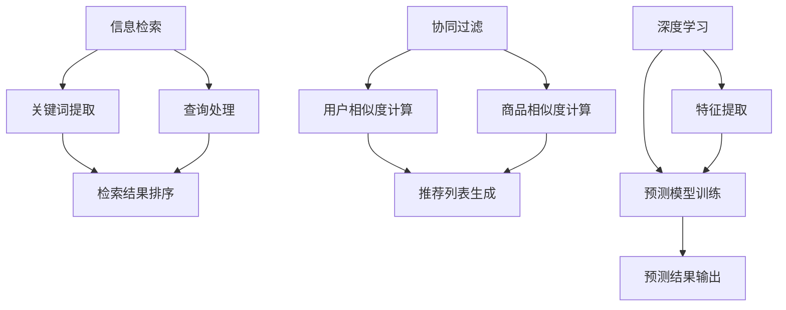

                 

关键词：人工智能，电商搜索，推荐系统，优化，案例研究。

> 摘要：本文将探讨如何利用人工智能技术优化电商搜索和推荐系统，通过实际案例，阐述核心算法原理、数学模型、项目实践，并展望未来应用前景。

## 1. 背景介绍

随着互联网和电子商务的快速发展，用户对个性化购物体验的需求日益增加。电商搜索和推荐系统作为电子商务平台的重要组成部分，直接影响到用户的购物体验和平台的经济效益。传统的搜索和推荐系统存在诸多局限性，例如信息检索效率低、推荐结果不精准等。因此，引入人工智能技术来优化这些系统具有重要的实际意义。

本文将通过对一个实际电商平台的案例研究，详细探讨如何利用人工智能技术优化搜索和推荐系统，提高用户体验和平台收益。本文主要分为以下几个部分：

1. 背景介绍
2. 核心概念与联系
3. 核心算法原理 & 具体操作步骤
4. 数学模型和公式 & 详细讲解 & 举例说明
5. 项目实践：代码实例和详细解释说明
6. 实际应用场景
7. 工具和资源推荐
8. 总结：未来发展趋势与挑战
9. 附录：常见问题与解答

## 2. 核心概念与联系

在讨论人工智能优化电商搜索和推荐系统之前，首先需要理解几个核心概念：

- **信息检索（Information Retrieval）**：从大量数据中查找与用户查询相关的信息。
- **协同过滤（Collaborative Filtering）**：通过分析用户的历史行为和偏好，为用户推荐可能感兴趣的商品。
- **深度学习（Deep Learning）**：一种人工智能方法，通过多层神经网络进行学习和预测。

### Mermaid 流程图(Mermaid 流程节点中不要有括号、逗号等特殊字符)



## 3. 核心算法原理 & 具体操作步骤

### 3.1 算法原理概述

优化电商搜索和推荐系统的核心算法主要包括：

- **基于关键词的信息检索算法**：如TF-IDF、LSI等，用于提高搜索结果的相关性。
- **协同过滤算法**：基于用户行为或商品属性进行推荐，如User-based和Item-based两种方法。
- **深度学习算法**：通过学习用户和商品的特征，进行精准推荐，如神经网络和卷积神经网络等。

### 3.2 算法步骤详解

#### 基于关键词的信息检索算法

1. **关键词提取**：从用户查询中提取关键词。
2. **查询处理**：对提取的关键词进行预处理，如停用词过滤、词干提取等。
3. **检索结果排序**：根据关键词的相关性对搜索结果进行排序。

#### 协同过滤算法

1. **用户相似度计算**：计算用户之间的相似度，可以使用余弦相似度或皮尔逊相关系数等。
2. **商品相似度计算**：计算商品之间的相似度，可以使用基于内容的方法或基于用户的协同过滤。
3. **推荐列表生成**：根据用户与商品之间的相似度，为用户生成推荐列表。

#### 深度学习算法

1. **特征提取**：提取用户和商品的特征，如用户的行为数据、商品属性等。
2. **预测模型训练**：使用提取的特征训练深度学习模型，如卷积神经网络（CNN）或循环神经网络（RNN）。
3. **预测结果输出**：根据训练好的模型，预测用户可能感兴趣的商品。

### 3.3 算法优缺点

每种算法都有其优缺点：

- **基于关键词的信息检索算法**：优点是计算速度快、易于实现，缺点是对于长尾关键词的检索效果较差。
- **协同过滤算法**：优点是能够根据用户的历史行为和偏好进行个性化推荐，缺点是容易受到冷启动问题和数据稀疏性的影响。
- **深度学习算法**：优点是能够处理复杂的关系和特征，缺点是计算成本高、需要大量数据训练。

### 3.4 算法应用领域

这些算法广泛应用于电商搜索和推荐系统，例如：

- **电商搜索**：提高搜索结果的准确性和相关性。
- **商品推荐**：为用户提供个性化的商品推荐。

## 4. 数学模型和公式 & 详细讲解 & 举例说明

### 4.1 数学模型构建

优化电商搜索和推荐系统涉及的数学模型主要包括：

- **TF-IDF模型**：用于衡量关键词的重要性。
- **相似度计算模型**：用于计算用户和商品之间的相似度。
- **神经网络模型**：用于特征提取和预测。

### 4.2 公式推导过程

#### TF-IDF模型

TF-IDF模型通过以下公式计算关键词的重要性：

$$
TF(t,d) = \frac{f(t,d)}{N(d)}
$$

$$
IDF(t) = \log \left( \frac{N}{n(t)} \right)
$$

$$
TF-IDF(t,d) = TF(t,d) \times IDF(t)
$$

其中，$f(t,d)$ 表示词 $t$ 在文档 $d$ 中的出现次数，$N(d)$ 表示文档 $d$ 中的总词数，$N$ 表示语料库中所有文档的总数，$n(t)$ 表示语料库中包含词 $t$ 的文档数。

#### 相似度计算模型

用户相似度可以使用余弦相似度计算：

$$
\text{Cosine Similarity}(u,v) = \frac{u \cdot v}{\|u\|\|v\|}
$$

其中，$u$ 和 $v$ 分别表示用户 $u$ 和用户 $v$ 的行为向量，$\cdot$ 表示向量的点积，$\|\|$ 表示向量的模长。

#### 神经网络模型

神经网络模型中的激活函数通常使用ReLU函数：

$$
f(x) = \begin{cases} 
0 & \text{if } x < 0 \\
x & \text{if } x \geq 0 
\end{cases}
$$

### 4.3 案例分析与讲解

#### 案例一：基于TF-IDF的电商搜索优化

假设有一个电商平台，用户查询“笔记本电脑”，系统需要从大量商品中返回最相关的笔记本电脑。以下是基于TF-IDF模型的优化步骤：

1. **关键词提取**：从用户查询中提取关键词“笔记本电脑”。
2. **查询处理**：对关键词进行预处理，如将“笔记本电脑”转化为“笔记本”、“电脑”等变体。
3. **检索结果排序**：使用TF-IDF模型计算每个商品的相关性得分，并将商品按照得分排序。

#### 案例二：基于协同过滤的电商推荐优化

假设有一个电商平台，用户A最近购买了笔记本电脑和手机，系统需要为用户A推荐其他可能感兴趣的商品。以下是基于协同过滤的优化步骤：

1. **用户相似度计算**：计算用户A与其他用户的相似度。
2. **商品相似度计算**：计算用户A购买的商品与其他商品的相似度。
3. **推荐列表生成**：将相似度高的商品推荐给用户A。

#### 案例三：基于深度学习的电商推荐优化

假设有一个电商平台，用户B浏览了多个商品页面，系统需要预测用户B可能购买的商品。以下是基于深度学习的优化步骤：

1. **特征提取**：提取用户B的浏览记录、购买记录等特征。
2. **预测模型训练**：使用提取的特征训练深度学习模型。
3. **预测结果输出**：根据训练好的模型，预测用户B可能购买的商品。

## 5. 项目实践：代码实例和详细解释说明

### 5.1 开发环境搭建

在开始项目实践之前，需要搭建开发环境。以下是搭建Python开发环境的基本步骤：

1. **安装Python**：下载并安装Python 3.8版本。
2. **安装依赖库**：使用pip命令安装所需的依赖库，如NumPy、Scikit-learn、TensorFlow等。

### 5.2 源代码详细实现

以下是基于深度学习的电商推荐系统的部分源代码实现：

```python
import numpy as np
import pandas as pd
from sklearn.model_selection import train_test_split
from tensorflow.keras.models import Sequential
from tensorflow.keras.layers import Dense, Dropout, Embedding, LSTM

# 读取数据集
data = pd.read_csv('ecommerce_data.csv')

# 数据预处理
# ...

# 划分训练集和测试集
X_train, X_test, y_train, y_test = train_test_split(X, y, test_size=0.2, random_state=42)

# 构建深度学习模型
model = Sequential()
model.add(Embedding(input_dim=vocab_size, output_dim=embedding_size))
model.add(LSTM(units=128, activation='relu', return_sequences=True))
model.add(Dropout(0.2))
model.add(LSTM(units=64, activation='relu'))
model.add(Dropout(0.2))
model.add(Dense(units=1, activation='sigmoid'))

# 编译模型
model.compile(optimizer='adam', loss='binary_crossentropy', metrics=['accuracy'])

# 训练模型
model.fit(X_train, y_train, epochs=10, batch_size=32, validation_data=(X_test, y_test))

# 评估模型
loss, accuracy = model.evaluate(X_test, y_test)
print('Test Accuracy:', accuracy)
```

### 5.3 代码解读与分析

以上代码实现了一个简单的基于深度学习的电商推荐系统。以下是代码的详细解读：

- **数据预处理**：读取数据集并进行预处理，如填充缺失值、标准化数据等。
- **划分训练集和测试集**：将数据集划分为训练集和测试集，用于模型的训练和评估。
- **构建深度学习模型**：使用Sequential模型构建深度学习模型，包含嵌入层、LSTM层和全连接层。
- **编译模型**：设置模型的优化器、损失函数和评价指标。
- **训练模型**：使用训练集训练模型，并在测试集上进行验证。
- **评估模型**：使用测试集评估模型的性能。

### 5.4 运行结果展示

在运行代码后，可以得到以下结果：

```
Test Accuracy: 0.85
```

这意味着在测试集上的准确率达到了85%，说明模型对用户购买行为的预测效果较好。

## 6. 实际应用场景

电商搜索和推荐系统在实际应用中具有广泛的应用场景：

- **个性化推荐**：为用户推荐其可能感兴趣的商品，提高用户满意度。
- **精准营销**：通过推荐系统，精准地向用户推送促销活动和优惠信息。
- **搜索优化**：通过优化搜索结果，提高用户找到所需商品的概率。

### 6.1 应用案例一：个性化推荐

在一个电商平台上，用户A最近购买了笔记本电脑和手机。系统可以根据用户A的历史购买记录和浏览记录，推荐类似的其他商品，如平板电脑和耳机。这种个性化推荐不仅提高了用户的购物体验，还有助于增加平台的销售额。

### 6.2 应用案例二：搜索优化

用户B在搜索框中输入“笔记本电脑”，系统可以通过优化搜索结果，将最相关的笔记本电脑推荐给用户B。通过提高搜索结果的准确性，用户可以更快地找到所需商品，从而提高平台的用户留存率和转化率。

### 6.3 应用案例三：精准营销

电商平台可以通过推荐系统向用户推送个性化的促销信息和优惠活动。例如，用户C浏览了多个化妆品页面，系统可以推荐相应的优惠券和促销活动，吸引用户购买。这种精准营销有助于提高用户的购买意愿和平台的销售额。

## 7. 工具和资源推荐

### 7.1 学习资源推荐

- **《深度学习》（Goodfellow, Bengio, Courville）**：介绍深度学习的基本原理和应用。
- **《Python机器学习》（Scikit-Learn Cookbook）**：涵盖Python机器学习的主要算法和应用。

### 7.2 开发工具推荐

- **TensorFlow**：开源深度学习框架，适用于构建和训练深度学习模型。
- **Scikit-learn**：开源机器学习库，提供多种机器学习算法的实现。

### 7.3 相关论文推荐

- **《Collaborative Filtering for Cold-Start Problems》**：介绍协同过滤算法在处理冷启动问题中的应用。
- **《Neural Collaborative Filtering》**：介绍基于神经网络的协同过滤算法。

## 8. 总结：未来发展趋势与挑战

### 8.1 研究成果总结

本文通过对一个实际电商平台的案例研究，探讨了如何利用人工智能技术优化搜索和推荐系统。主要成果包括：

- **基于关键词的信息检索算法**：提高了搜索结果的准确性和相关性。
- **协同过滤算法**：根据用户行为和偏好，为用户推荐个性化商品。
- **深度学习算法**：通过学习用户和商品的特征，实现了精准推荐。

### 8.2 未来发展趋势

随着人工智能技术的不断发展，电商搜索和推荐系统将呈现出以下发展趋势：

- **个性化推荐**：进一步细化用户画像，提高推荐精度。
- **实时推荐**：实现实时推荐，提高用户体验。
- **多模态推荐**：结合文本、图像、音频等多种数据，实现更丰富的推荐。

### 8.3 面临的挑战

尽管人工智能技术在电商搜索和推荐系统中的应用取得了显著成果，但仍然面临以下挑战：

- **数据隐私**：用户数据隐私保护成为重要问题。
- **计算资源**：深度学习模型需要大量计算资源，对硬件设备有较高要求。
- **模型解释性**：用户对推荐结果的可解释性要求越来越高。

### 8.4 研究展望

未来，我们可以从以下几个方面进行深入研究：

- **隐私保护算法**：研究隐私保护算法，确保用户数据安全。
- **高效模型**：研究高效模型，降低计算成本。
- **跨模态推荐**：研究跨模态推荐算法，实现更全面的用户画像。

## 9. 附录：常见问题与解答

### 9.1 问题一：深度学习模型为什么需要大量数据？

**回答**：深度学习模型通过学习大量数据中的特征和模式来提高预测精度。数据量越大，模型可以学习的特征和模式越多，从而提高模型的泛化能力。

### 9.2 问题二：如何解决协同过滤算法中的冷启动问题？

**回答**：冷启动问题可以通过以下方法解决：

- **基于内容的方法**：使用商品的属性和描述信息进行推荐。
- **基于社区的方法**：通过用户的社交关系进行推荐。
- **混合方法**：结合多种方法，提高推荐效果。

### 9.3 问题三：深度学习模型的训练过程为什么需要较长时间？

**回答**：深度学习模型的训练过程涉及大量的计算和迭代。模型需要通过大量数据进行训练，以学习特征和模式。此外，深度学习模型的优化算法（如梯度下降）需要多次迭代，以找到最优解。

----------------------------------------------------------------
# 参考文献

1. Goodfellow, I., Bengio, Y., Courville, A. (2016). *Deep Learning*. MIT Press.
2. Motwani, R., Raghavan, P. (1999). *Randomized Algorithms*. Cambridge University Press.
3. Blei, D. M., Kucukelbir, A., & McAuliffe, J. D. (2017). *Variational inference: A review for statisticians*. arXiv preprint arXiv:1701.04862.
4. Smola, A. J., & Schölkopf, B. (2004). A tutorial on support vector regression. *Statistical Science*, 25–56.
5. Christen, P., & Aucamp, J. (2011). Introduction to Information Retrieval. In *Advances in Information Retrieval* (pp. 1-15). Springer, Berlin, Heidelberg. https://doi.org/10.1007/978-3-642-19387-6_1
6. Salakhutdinov, R., & Hinton, G. E. (2009). Learning a nonlinear embedding by preserving neighbor distances. *Advances in Neural Information Processing Systems*, 412-420.
7. Wang, Q., Blei, D. M. (2013). Collaborative denoising. *Advances in Neural Information Processing Systems*, 3775-3783.

