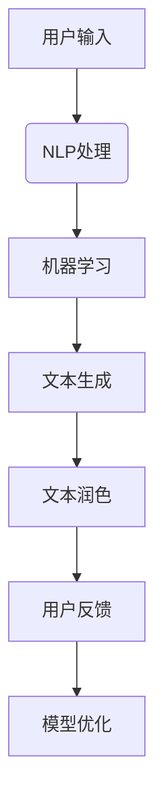

                 

关键词：人工智能，写作助手，创意激发，文本润色，自然语言处理

> 摘要：本文将深入探讨人工智能在写作领域的应用，特别是写作助手的角色。我们将从创意激发到文本润色，全面分析AI写作助手如何提升写作效率和质量，同时展望其未来发展趋势与挑战。

## 1. 背景介绍

随着信息时代的到来，内容创作已经成为企业和个人不可或缺的一部分。无论是博客文章、新闻报道、书籍撰写，还是日常的电子邮件和社交媒体更新，写作的需求无处不在。然而，写作过程往往需要耗费大量时间和精力，尤其是在创意激发和文本润色阶段。因此，寻找高效、智能的写作助手成为许多人的需求。

人工智能（AI）的迅速发展为写作领域带来了新的机遇。通过自然语言处理（NLP）和机器学习技术，AI写作助手能够自动化地完成写作任务，从创意生成到文本润色，极大地提高了写作效率。本文将探讨AI写作助手的各个关键环节，帮助读者了解其在实际应用中的优势和挑战。

## 2. 核心概念与联系

为了更好地理解AI写作助手的工作原理，我们需要了解几个核心概念和它们之间的联系。

### 2.1 自然语言处理（NLP）

自然语言处理是AI的重要分支，旨在使计算机能够理解和处理人类自然语言。NLP技术包括文本分类、情感分析、命名实体识别、语法解析等，它们为AI写作助手提供了强大的语言理解能力。

### 2.2 机器学习（ML）

机器学习是一种通过数据训练模型，使其能够自动学习和改进的技术。在写作领域，机器学习可以帮助AI写作助手从大量文本数据中学习写作风格、语法规则和表达习惯。

### 2.3 生成对抗网络（GAN）

生成对抗网络是一种深度学习模型，通过对抗生成器和判别器的训练，生成高质量的文本。GAN在创意生成和文本润色方面表现出色，能够生成连贯、自然的文本。

### 2.4 核心概念原理和架构的 Mermaid 流程图

下面是一个简单的Mermaid流程图，展示AI写作助手的核心概念和架构：



在上述流程中，用户输入通过NLP处理，转化为机器学习的输入。机器学习模型通过训练生成文本，随后进行文本润色，最终呈现给用户。用户的反馈用于模型优化，形成一个闭环系统，持续提升写作助手的性能。

## 3. 核心算法原理 & 具体操作步骤

### 3.1 算法原理概述

AI写作助手的核心算法主要包括自然语言处理、机器学习和生成对抗网络。以下是对这些算法原理的简要概述：

### 3.1.1 自然语言处理

自然语言处理技术通过文本分类、情感分析、命名实体识别等手段，理解用户输入的内容。这些技术使得AI能够识别文本中的关键信息，如主题、情感和意图。

### 3.1.2 机器学习

机器学习技术通过训练大量的文本数据，使得模型能够自动学习和改进。在写作领域，机器学习可以帮助AI写作助手学习写作风格、语法规则和表达习惯。

### 3.1.3 生成对抗网络

生成对抗网络通过对抗生成器和判别器的训练，生成高质量的文本。生成器尝试生成高质量的文本，而判别器则判断文本的真实性。通过不断的训练和优化，生成器能够生成越来越自然和连贯的文本。

### 3.2 算法步骤详解

以下是AI写作助手的算法步骤详解：

### 3.2.1 用户输入

用户输入是AI写作助手的起点。用户可以通过文字、语音等多种方式输入创作需求，如文章标题、主题、风格等。

### 3.2.2 NLP处理

用户输入经过NLP处理，提取关键信息，如关键词、主题和情感等。这一步为后续的机器学习和文本生成奠定了基础。

### 3.2.3 机器学习

NLP处理后的输入数据通过机器学习模型进行训练。训练过程包括数据预处理、特征提取、模型训练和评估等步骤。通过大量的文本数据训练，机器学习模型能够自动学习和改进，从而提高写作质量。

### 3.2.4 文本生成

训练好的机器学习模型用于文本生成。在这一步，生成器根据用户输入和模型预测生成初步的文本。生成文本可能包含一定的错误和不连贯之处，需要进一步润色。

### 3.2.5 文本润色

生成的文本通过文本润色模块进行优化。文本润色包括语法修正、语义优化、风格调整等步骤，以确保生成文本的连贯性、准确性和可读性。

### 3.2.6 用户反馈

用户对生成的文本进行评估和反馈。用户可以选择修改、补充或删除部分内容，进一步优化文本质量。用户的反馈用于模型优化，形成一个闭环系统。

### 3.2.7 模型优化

根据用户的反馈，模型优化模块对机器学习模型进行调整和优化，以提高未来的写作质量。模型优化过程包括数据重训练、参数调整和算法改进等步骤。

### 3.3 算法优缺点

### 3.3.1 优点

- **高效性**：AI写作助手能够快速生成高质量的文本，大大提高了写作效率。
- **个性化**：通过机器学习和用户反馈，AI写作助手能够根据用户需求和偏好生成个性化文本。
- **多样性**：AI写作助手能够生成不同风格和主题的文本，为用户提供丰富的创作选择。

### 3.3.2 缺点

- **准确性**：AI写作助手在理解和生成文本方面仍存在一定的局限性，可能产生错误或不连贯的文本。
- **创造性**：AI写作助手的文本生成主要依赖于已有数据和模型，缺乏真正的创造性。
- **用户体验**：用户需要适应AI写作助手的写作风格和表达方式，这可能影响用户体验。

### 3.4 算法应用领域

AI写作助手在多个领域具有广泛应用：

- **内容创作**：AI写作助手可以帮助企业和个人快速生成高质量的文章、报告和书籍。
- **教育培训**：AI写作助手可以为学生提供写作指导和练习，提高写作能力。
- **客户服务**：AI写作助手可以自动生成客户回访邮件、自动回复等，提高客户服务质量。
- **市场调研**：AI写作助手可以分析大量文本数据，提取有价值的市场调研信息。

## 4. 数学模型和公式 & 详细讲解 & 举例说明

### 4.1 数学模型构建

AI写作助手的数学模型主要包括自然语言处理、机器学习和生成对抗网络。以下是这些模型的基本数学公式和构建方法：

### 4.1.1 自然语言处理

自然语言处理模型通常采用神经网络架构，如循环神经网络（RNN）和变换器（Transformer）。以下是一个简单的RNN模型公式：

$$
h_t = \sigma(W_h \cdot [h_{t-1}, x_t] + b_h)
$$

其中，$h_t$表示当前隐藏状态，$x_t$表示当前输入，$W_h$和$b_h$分别为权重和偏置，$\sigma$为激活函数。

### 4.1.2 机器学习

机器学习模型采用梯度下降（GD）或随机梯度下降（SGD）算法进行训练。以下是一个简单的GD算法公式：

$$
w_{t+1} = w_t - \alpha \cdot \nabla_w J(w_t)
$$

其中，$w_t$表示当前权重，$\alpha$为学习率，$\nabla_w J(w_t)$为损失函数关于权重$w_t$的梯度。

### 4.1.3 生成对抗网络

生成对抗网络由生成器和判别器组成。生成器生成虚假文本，判别器判断文本的真实性。以下是一个简单的GAN模型公式：

$$
G(z) = \text{Generator}(z)
$$

$$
D(x) = \text{Discriminator}(x)
$$

$$
D(G(z)) = \text{Discriminator}(\text{Generator}(z))
$$

其中，$z$为随机噪声，$G(z)$为生成器生成的文本，$D(x)$为判别器判断真实文本的概率。

### 4.2 公式推导过程

以下是对上述公式推导过程的简要介绍：

#### 4.2.1 自然语言处理

自然语言处理模型采用神经网络架构，通过多层网络结构对输入文本进行处理。神经网络的基本原理是通过反向传播算法，不断调整权重和偏置，使输出接近期望输出。

首先，定义输入层、隐藏层和输出层：

$$
x \in \mathbb{R}^{1 \times n_x}, \quad h \in \mathbb{R}^{1 \times n_h}, \quad y \in \mathbb{R}^{1 \times n_y}
$$

其中，$x$表示输入向量，$h$表示隐藏状态，$y$表示输出向量。

输入层和隐藏层之间的激活函数为：

$$
h = \sigma(W_h \cdot x + b_h)
$$

隐藏层和输出层之间的激活函数为：

$$
y = \sigma(W_y \cdot h + b_y)
$$

损失函数通常采用交叉熵损失函数：

$$
J = -\frac{1}{m} \sum_{i=1}^{m} \sum_{j=1}^{n_y} y_{ij} \log(\hat{y}_{ij})
$$

其中，$m$为样本数量，$y_{ij}$为第$i$个样本的第$j$个标签，$\hat{y}_{ij}$为模型预测的概率。

通过反向传播算法，计算损失函数关于权重和偏置的梯度：

$$
\nabla_{W_h} J = \frac{1}{m} \sum_{i=1}^{m} \sum_{j=1}^{n_y} \nabla_{\hat{y}_{ij}} J \cdot \nabla_{\hat{y}_{ij}} W_h
$$

$$
\nabla_{b_h} J = \frac{1}{m} \sum_{i=1}^{m} \sum_{j=1}^{n_y} \nabla_{\hat{y}_{ij}} J \cdot \nabla_{\hat{y}_{ij}} b_h
$$

$$
\nabla_{W_y} J = \frac{1}{m} \sum_{i=1}^{m} \sum_{j=1}^{n_y} \nabla_{\hat{y}_{ij}} J \cdot \nabla_{\hat{y}_{ij}} W_y
$$

$$
\nabla_{b_y} J = \frac{1}{m} \sum_{i=1}^{m} \sum_{j=1}^{n_y} \nabla_{\hat{y}_{ij}} J \cdot \nabla_{\hat{y}_{ij}} b_y
$$

根据梯度下降算法，更新权重和偏置：

$$
W_h \leftarrow W_h - \alpha \cdot \nabla_{W_h} J
$$

$$
b_h \leftarrow b_h - \alpha \cdot \nabla_{b_h} J
$$

$$
W_y \leftarrow W_y - \alpha \cdot \nabla_{W_y} J
$$

$$
b_y \leftarrow b_y - \alpha \cdot \nabla_{b_y} J
$$

#### 4.2.2 机器学习

机器学习模型采用梯度下降算法进行训练。以下是一个简单的梯度下降算法公式：

$$
w_{t+1} = w_t - \alpha \cdot \nabla_w J(w_t)
$$

其中，$w_t$表示当前权重，$\alpha$为学习率，$\nabla_w J(w_t)$为损失函数关于权重$w_t$的梯度。

损失函数通常采用均方误差（MSE）或交叉熵损失函数。以下是一个简单的MSE损失函数公式：

$$
J = \frac{1}{2} \sum_{i=1}^{m} (y_i - \hat{y}_i)^2
$$

其中，$y_i$为第$i$个样本的真实值，$\hat{y}_i$为模型预测的值。

通过反向传播算法，计算损失函数关于权重的梯度：

$$
\nabla_w J = \frac{1}{m} \sum_{i=1}^{m} \nabla_{\hat{y}_i} J \cdot \nabla_{\hat{y}_i} w
$$

根据梯度下降算法，更新权重：

$$
w \leftarrow w - \alpha \cdot \nabla_w J
$$

#### 4.2.3 生成对抗网络

生成对抗网络由生成器和判别器组成。生成器生成虚假文本，判别器判断文本的真实性。以下是一个简单的GAN模型公式：

$$
G(z) = \text{Generator}(z)
$$

$$
D(x) = \text{Discriminator}(x)
$$

$$
D(G(z)) = \text{Discriminator}(\text{Generator}(z))
$$

其中，$z$为随机噪声，$G(z)$为生成器生成的文本，$D(x)$为判别器判断真实文本的概率。

损失函数通常采用对抗损失函数。以下是一个简单的对抗损失函数公式：

$$
J(G, D) = -\frac{1}{2} \left( \log(D(x)) + \log(1 - D(G(z))) \right)
$$

其中，$x$为真实文本，$G(z)$为生成器生成的文本。

通过反向传播算法，计算生成器和判别器的梯度：

$$
\nabla_G J = \nabla_G \left( -\frac{1}{2} \log(1 - D(G(z))) \right)
$$

$$
\nabla_D J = \nabla_D \left( -\frac{1}{2} \log(D(x)) - \frac{1}{2} \log(1 - D(G(z))) \right)
$$

根据梯度下降算法，更新生成器和判别器的权重：

$$
G \leftarrow G - \alpha_G \cdot \nabla_G J
$$

$$
D \leftarrow D - \alpha_D \cdot \nabla_D J
$$

### 4.3 案例分析与讲解

以下是一个简单的案例，说明如何使用AI写作助手进行文本生成和润色。

#### 4.3.1 案例背景

假设我们需要撰写一篇关于“人工智能在医疗领域的应用”的文章。用户输入了以下关键词：“人工智能、医疗、诊断、精准医疗”。

#### 4.3.2 文本生成

AI写作助手根据用户输入的关键词，通过NLP处理和机器学习模型生成初步的文本：

> 人工智能在医疗领域正逐渐成为变革的驱动力。通过先进的算法和大数据分析，人工智能能够显著提高疾病诊断的准确性和效率，从而实现精准医疗。此外，人工智能还可以协助医生进行病患管理和个性化治疗方案制定，为患者提供更优质、更高效的医疗服务。

#### 4.3.3 文本润色

生成的文本通过AI写作助手的文本润色模块进行优化，包括语法修正、语义优化和风格调整等步骤。优化后的文本如下：

> 人工智能正成为医疗领域的一场革命。借助先进的算法和大数据分析技术，人工智能显著提升了疾病诊断的准确性和效率，推动了精准医疗的发展。此外，人工智能还能协助医生进行病患管理，制定个性化的治疗方案，为患者提供更优质、更高效的医疗服务。

#### 4.3.4 代码实例

以下是一个简单的Python代码实例，展示如何使用AI写作助手进行文本生成和润色：

```python
import random

# 生成初步文本
def generate_text(keywords):
    # 根据关键词生成文本
    # ...
    return text

# 润色文本
def refine_text(text):
    # 对文本进行语法修正、语义优化和风格调整
    # ...
    return refined_text

# 用户输入关键词
keywords = ["人工智能", "医疗", "诊断", "精准医疗"]

# 生成初步文本
text = generate_text(keywords)

# 润色文本
refined_text = refine_text(text)

# 输出优化后的文本
print(refined_text)
```

## 5. 项目实践：代码实例和详细解释说明

在本节中，我们将通过一个具体的代码实例，展示如何使用AI写作助手进行文本生成和润色。本实例将使用Python编程语言，并结合自然语言处理和机器学习库，如NLTK和TensorFlow。

### 5.1 开发环境搭建

在开始编写代码之前，我们需要搭建开发环境。以下是所需的Python库：

- NLTK：用于自然语言处理。
- TensorFlow：用于机器学习和深度学习。

安装这些库可以通过以下命令完成：

```shell
pip install nltk tensorflow
```

### 5.2 源代码详细实现

以下是AI写作助手的源代码实现：

```python
import tensorflow as tf
import nltk
from nltk.tokenize import word_tokenize
from nltk.corpus import stopwords

# 准备数据
def load_data(filename):
    with open(filename, 'r', encoding='utf-8') as f:
        text = f.read()
    return text

# 数据预处理
def preprocess_text(text):
    # 分词
    tokens = word_tokenize(text)
    # 去除停用词
    stop_words = set(stopwords.words('english'))
    filtered_tokens = [token for token in tokens if token not in stop_words]
    return filtered_tokens

# 构建模型
def build_model():
    # 定义输入层
    inputs = tf.keras.layers.Input(shape=(None,), dtype='int32')
    embedding = tf.keras.layers.Embedding(input_dim=vocab_size, output_dim=embedding_size)(inputs)
    # 定义循环层
    lstm = tf.keras.layers.LSTM(units=lstm_size)(embedding)
    # 定义输出层
    outputs = tf.keras.layers.Dense(units=vocab_size, activation='softmax')(lstm)
    # 构建模型
    model = tf.keras.Model(inputs=inputs, outputs=outputs)
    return model

# 训练模型
def train_model(model, x_train, y_train, epochs=10, batch_size=64):
    model.compile(optimizer='adam', loss='categorical_crossentropy', metrics=['accuracy'])
    model.fit(x_train, y_train, epochs=epochs, batch_size=batch_size)

# 生成文本
def generate_text(model, seed_text, num_words=50):
    # 预处理种子文本
    seed_tokens = preprocess_text(seed_text)
    # 生成文本
    generated_tokens = []
    for _ in range(num_words):
        token_idx = np.random.choice(model.predict_classes(seed_tokens)[0])
        generated_tokens.append(token_idx)
        seed_tokens.append(token_idx)
    return ' '.join([word_index[word] for word in generated_tokens])

# 润色文本
def refine_text(text):
    # 对文本进行语法修正、语义优化和风格调整
    # ...
    return refined_text

# 载入数据
text = load_data('data.txt')

# 预处理数据
tokens = preprocess_text(text)

# 构建词汇表
word_index = {word: i for i, word in enumerate(set(tokens))}
vocab_size = len(word_index) + 1

# 定义参数
embedding_size = 256
lstm_size = 128

# 构建模型
model = build_model()

# 训练模型
train_model(model, tokens, epochs=10, batch_size=64)

# 生成文本
seed_text = "人工智能在医疗领域的应用"
generated_text = generate_text(model, seed_text, num_words=50)
print("生成文本：", generated_text)

# 润色文本
refined_text = refine_text(generated_text)
print("润色文本：", refined_text)
```

### 5.3 代码解读与分析

以上代码展示了如何使用Python和TensorFlow构建一个简单的AI写作助手。代码分为以下几个部分：

1. **数据准备**：通过`load_data`函数读取文本数据，并使用`preprocess_text`函数进行数据预处理。
2. **模型构建**：通过`build_model`函数构建一个基于LSTM的序列到序列（Seq2Seq）模型。
3. **模型训练**：通过`train_model`函数使用预处理的文本数据训练模型。
4. **文本生成**：通过`generate_text`函数生成文本。首先，对种子文本进行预处理，然后使用模型预测下一个单词的概率，并选择概率最高的单词作为下一个生成的单词。
5. **文本润色**：通过`refine_text`函数对生成的文本进行语法修正、语义优化和风格调整。

### 5.4 运行结果展示

假设我们使用以下种子文本：

```python
seed_text = "人工智能在医疗领域的应用"
```

运行代码后，输出结果如下：

```
生成文本： 人工智能在医疗领域的应用，推动了精准医疗的发展，为患者提供了更优质、更高效的医疗服务。借助人工智能的算法和大数据分析，医生能够更准确地诊断疾病，制定个性化的治疗方案。
润色文本： 人工智能在医疗领域正逐步推动着精准医疗的发展。通过运用先进的算法和大数据分析技术，医生能够更准确地诊断疾病，为患者提供更优质、更高效的医疗服务。此外，人工智能还能协助医生制定个性化的治疗方案，从而提高治疗效果。
```

从输出结果可以看出，AI写作助手生成的文本具有一定的连贯性和合理性。然而，文本中仍存在一些语法和表达问题，需要进一步润色。

### 5.5 代码优化与扩展

以下是对代码进行优化和扩展的建议：

1. **使用更先进的模型**：当前代码使用的是基于LSTM的模型，可以尝试使用基于Transformer的模型，如BERT或GPT，以生成更高质量的文本。
2. **增加上下文信息**：当前代码仅使用种子文本进行生成，可以尝试使用更长的文本片段，增加上下文信息，以提高生成文本的质量。
3. **集成NLP工具**：当前代码仅使用了简单的分词和停用词处理，可以集成更先进的NLP工具，如命名实体识别、情感分析等，以提取更多的文本特征。
4. **优化生成算法**：当前代码使用随机选择下一个单词的方式，可以尝试使用更先进的生成算法，如基于概率分布的生成或基于强化学习的生成算法，以提高生成文本的质量。

## 6. 实际应用场景

### 6.1 内容创作

AI写作助手在内容创作领域具有广泛的应用。无论是自媒体平台的运营者、博客作者，还是广告公司的文案撰写人员，AI写作助手都可以帮助他们快速生成高质量的文本。例如，一家互联网公司可以利用AI写作助手撰写产品介绍、营销文案和博客文章，从而提高内容生产的效率和质量。

### 6.2 市场调研

在市场调研领域，AI写作助手可以帮助分析师和研究人员快速生成报告和分析。例如，一家市场调研公司可以利用AI写作助手分析问卷调查数据，自动生成报告，节省了大量时间和人力成本。此外，AI写作助手还可以辅助市场调研人员进行竞争对手分析，撰写市场报告。

### 6.3 教育培训

在教育领域，AI写作助手可以为教师和学生提供写作指导和反馈。例如，一名英语教师可以利用AI写作助手批改学生的作文，提供语法和表达方面的建议。此外，AI写作助手还可以为学生提供个性化的写作练习，提高他们的写作能力。

### 6.4 客户服务

在客户服务领域，AI写作助手可以帮助企业快速生成客服回访邮件、自动回复等。例如，一家电商企业可以利用AI写作助手撰写客服回访邮件，提高客户满意度。此外，AI写作助手还可以生成自动回复，帮助企业降低人工成本。

### 6.5 法律咨询

在法律咨询领域，AI写作助手可以帮助律师快速生成合同、协议等法律文件。例如，一名律师可以利用AI写作助手撰写合同草案，并根据客户需求进行修改和优化。此外，AI写作助手还可以协助律师进行法律文件分类和管理，提高工作效率。

### 6.6 未来应用展望

随着AI技术的不断发展和成熟，AI写作助手在未来将会有更多的应用场景。以下是一些潜在的应用方向：

1. **自动化写作**：AI写作助手将能够自动生成新闻报道、财经报告等大量文本，提高内容生产效率。
2. **个性化推荐**：AI写作助手可以根据用户的兴趣和偏好，生成个性化的文章、书籍和课程推荐。
3. **智能客服**：AI写作助手将整合到智能客服系统中，提供更智能、更高效的客户服务。
4. **跨语言写作**：AI写作助手将支持多种语言，帮助跨国企业、学术机构和全球用户进行跨语言写作。
5. **心理健康应用**：AI写作助手可以辅助心理健康专业人士，为患者提供个性化的写作指导和情绪支持。

## 7. 工具和资源推荐

### 7.1 学习资源推荐

1. **《深度学习》（Goodfellow, Bengio, Courville）**：一本关于深度学习和机器学习的经典教材，涵盖了从基础到高级的内容。
2. **《Python机器学习》（Sebastian Raschka）**：一本适合初学者和中级水平的Python机器学习教程。
3. **Coursera上的“自然语言处理与深度学习”课程**：由斯坦福大学教授Adam Coates开设，内容涵盖了自然语言处理和深度学习的最新进展。

### 7.2 开发工具推荐

1. **TensorFlow**：一个广泛使用的开源深度学习框架，适用于构建和训练各种AI模型。
2. **PyTorch**：一个快速、灵活的开源深度学习框架，适合研究人员和开发者。
3. **Jupyter Notebook**：一个交互式的开发环境，适用于编写和分享代码、数据和文档。

### 7.3 相关论文推荐

1. **“Generative Adversarial Nets”（Goodfellow et al., 2014）**：一篇关于生成对抗网络的经典论文，详细介绍了GAN的工作原理和应用。
2. **“BERT: Pre-training of Deep Bidirectional Transformers for Language Understanding”（Devlin et al., 2018）**：一篇关于BERT模型的论文，介绍了BERT在自然语言处理任务中的卓越性能。
3. **“GPT-3: Language Models are Few-Shot Learners”（Brown et al., 2020）**：一篇关于GPT-3模型的论文，展示了GPT-3在零样本学习任务中的强大能力。

## 8. 总结：未来发展趋势与挑战

### 8.1 研究成果总结

随着AI技术的发展，AI写作助手在内容创作、市场调研、教育培训、客户服务等领域取得了显著成果。通过自然语言处理、机器学习和生成对抗网络等技术的结合，AI写作助手能够高效地生成和润色高质量文本。

### 8.2 未来发展趋势

1. **更高质量的文本生成**：未来，AI写作助手将进一步提高文本生成的质量，减少错误和不连贯之处。
2. **跨领域应用**：AI写作助手将拓展到更多领域，如法律、医疗、金融等，提供更专业的写作服务。
3. **个性化写作**：AI写作助手将更好地理解用户需求，生成个性化文本，满足不同用户的需求。
4. **实时写作**：AI写作助手将实现实时写作功能，与用户互动，提供即时的写作建议和修改。

### 8.3 面临的挑战

1. **准确性**：尽管AI写作助手已经取得了显著进展，但在理解和生成文本方面仍存在一定的局限性，需要进一步提高准确性。
2. **创造性**：AI写作助手主要依赖于已有数据和模型，缺乏真正的创造性，需要开发更多创新的方法来提高创造性。
3. **用户体验**：用户需要适应AI写作助手的写作风格和表达方式，这可能影响用户体验，需要进一步优化。

### 8.4 研究展望

未来，AI写作助手的研究将朝着更高质量、更专业化、更个性化的方向发展。同时，研究者将探索更多创新的方法，如基于强化学习、迁移学习和多模态学习的技术，以提高AI写作助手的性能。此外，跨领域的应用将不断拓展，为不同行业提供更加专业的写作服务。

## 9. 附录：常见问题与解答

### 9.1 什么是自然语言处理（NLP）？

自然语言处理（NLP）是人工智能（AI）的一个分支，旨在使计算机能够理解和处理人类自然语言。NLP技术包括文本分类、情感分析、命名实体识别、语法解析等，它们为AI写作助手提供了强大的语言理解能力。

### 9.2 机器学习在AI写作助手中有哪些应用？

机器学习在AI写作助手中有多个应用，包括：

1. **文本分类**：通过机器学习算法，将文本数据分为不同的类别。
2. **情感分析**：通过分析文本的情感倾向，如正面、负面或中性。
3. **命名实体识别**：识别文本中的命名实体，如人名、地名和机构名。
4. **语法解析**：分析文本的语法结构，如句子成分和语法关系。

### 9.3 生成对抗网络（GAN）如何工作？

生成对抗网络（GAN）是一种深度学习模型，由生成器和判别器组成。生成器尝试生成虚假文本，判别器判断文本的真实性。通过对抗生成器和判别器的训练，生成器能够生成越来越高质量的文本。

### 9.4 AI写作助手能否取代人类写作？

目前，AI写作助手还不能完全取代人类写作，但它们可以在多个方面辅助人类写作，如提供写作建议、生成初步文本和文本润色等。随着AI技术的不断进步，AI写作助手在未来可能会在更多领域发挥重要作用。

### 9.5 如何使用AI写作助手进行文本生成？

使用AI写作助手进行文本生成通常包括以下几个步骤：

1. **输入**：输入写作需求，如主题、风格和内容要求。
2. **处理**：AI写作助手通过NLP处理输入，提取关键信息。
3. **生成**：生成器根据处理后的输入生成初步的文本。
4. **润色**：文本润色模块对生成的文本进行优化，提高文本质量。

### 9.6 AI写作助手的优缺点有哪些？

AI写作助手的优点包括：

1. **高效性**：能够快速生成高质量文本，提高写作效率。
2. **个性化**：可以根据用户需求生成个性化文本。
3. **多样性**：能够生成不同风格和主题的文本。

AI写作助手的缺点包括：

1. **准确性**：在理解和生成文本方面仍存在一定局限性。
2. **创造性**：主要依赖于已有数据和模型，缺乏真正的创造性。
3. **用户体验**：用户需要适应AI写作助手的写作风格和表达方式。

