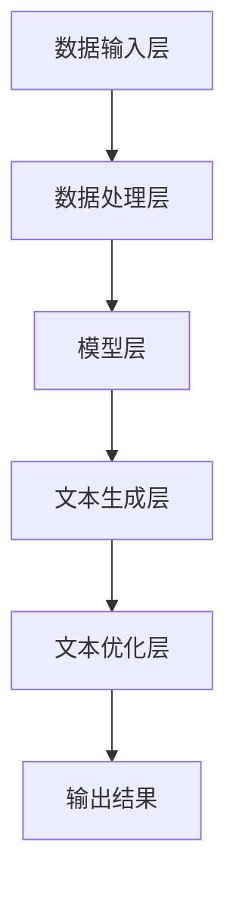

                 

在当今的信息时代，人工智能（AI）已经成为推动科技进步和社会发展的关键力量。AI技术在各个领域都展现出了巨大的潜力，特别是在写作领域，AI写作助手作为一种新型的辅助工具，正在逐步改变人们的写作方式，增强人类的创造力。本文将围绕AI写作助手这一主题，深入探讨其背景、核心概念、算法原理、数学模型、项目实践以及未来应用前景，旨在为读者提供一份全面的技术解读。

## 关键词

- 人工智能
- 写作助手
- 创造力
- 算法原理
- 数学模型
- 项目实践

## 摘要

本文旨在探讨AI写作助手作为一种新兴工具，如何通过其独特的算法和数学模型，帮助人类提高写作效率和创造力。文章首先介绍了AI写作助手的背景和核心概念，接着详细阐述了其算法原理和具体操作步骤，随后通过数学模型的构建和推导，进一步阐明了AI写作助手的工作机制。文章还通过实际项目实践，展示了AI写作助手的强大功能。最后，文章对AI写作助手的未来应用前景进行了展望，并提出了相关的研究方向和挑战。

## 1. 背景介绍

随着互联网的普及和信息的爆炸式增长，写作已经成为了日常生活中不可或缺的一部分。无论是学术研究、商业报告，还是个人博客和社交媒体，写作都是表达思想和交流信息的重要手段。然而，写作往往是一个复杂而耗时的工作，需要作者具备扎实的文字功底和丰富的知识储备。在这个过程中，人类的创造力是至关重要的。

传统上，人们依赖于自身的经验和知识进行写作。然而，随着写作需求的增加，传统的方法变得越来越力不从心。这时，AI写作助手的出现为人们提供了一种全新的写作方式。AI写作助手通过深度学习、自然语言处理（NLP）等技术，能够理解和生成人类语言，从而辅助人类进行写作。

AI写作助手的出现，不仅提高了写作效率，更重要的是，它能够激发人类的创造力。通过AI写作助手，作者可以摆脱传统的写作束缚，更加自由地表达自己的想法。同时，AI写作助手也能够帮助作者从大量的信息中筛选出有价值的内容，从而提高写作的质量。

## 2. 核心概念与联系

### 2.1 AI写作助手的定义

AI写作助手是指利用人工智能技术，特别是自然语言处理（NLP）和机器学习（ML）算法，帮助人类进行写作的工具。AI写作助手可以自动生成文章、报告、邮件等内容，从而减少作者的写作负担，提高写作效率。

### 2.2 AI写作助手的工作原理

AI写作助手的工作原理主要依赖于深度学习和自然语言处理技术。具体来说，AI写作助手通过以下步骤进行工作：

1. **数据收集与预处理**：AI写作助手首先从大量的文本数据中收集信息，并对这些数据进行预处理，包括文本清洗、分词、词性标注等。

2. **模型训练**：基于预处理后的数据，AI写作助手使用深度学习模型进行训练。训练过程中，模型会学习到文本的语法、语义和上下文信息。

3. **文本生成**：在训练完成后，AI写作助手可以根据给定的主题或提示，生成相应的文本内容。生成过程中，模型会考虑文本的连贯性、可读性和逻辑性。

4. **文本优化**：生成的文本可能存在一些语法、语义或逻辑问题，因此AI写作助手会进行进一步的优化，以提高文本的质量。

### 2.3 AI写作助手的架构

AI写作助手的架构通常包括以下几个主要部分：

1. **数据输入层**：负责接收用户的输入，可以是文本、语音或其他形式。

2. **数据处理层**：包括文本预处理、分词、词性标注等，为后续的模型处理提供基础。

3. **模型层**：这是AI写作助手的核心，通常采用深度学习模型，如循环神经网络（RNN）、长短期记忆网络（LSTM）或变压器（Transformer）等。

4. **文本生成层**：根据模型层的输出，生成符合语法、语义和逻辑规则的文本。

5. **文本优化层**：对生成的文本进行语法、语义和逻辑优化，以提高文本的质量。

### 2.4 Mermaid 流程图

下面是一个简化的AI写作助手的Mermaid流程图：



在上述流程图中，各个节点表示AI写作助手的各个处理阶段，箭头表示数据流动的方向。

## 3. 核心算法原理 & 具体操作步骤

### 3.1 算法原理概述

AI写作助手的算法原理主要基于自然语言处理（NLP）和机器学习（ML）。其中，NLP负责处理自然语言数据，如文本的分词、词性标注、句法分析等；ML则负责从大量的文本数据中学习，以生成高质量的文本内容。

在具体的算法实现中，AI写作助手通常采用以下几种关键技术：

1. **循环神经网络（RNN）**：RNN是一种能够处理序列数据的神经网络，非常适合用于文本生成任务。

2. **长短期记忆网络（LSTM）**：LSTM是RNN的一种改进，能够更好地处理长序列数据，从而提高文本生成的质量。

3. **变压器（Transformer）**：Transformer是一种基于注意力机制的神经网络，相比传统的RNN和LSTM，它在文本生成任务上具有更高的效果。

### 3.2 算法步骤详解

AI写作助手的算法步骤可以分为以下几个部分：

1. **数据收集与预处理**：首先，AI写作助手需要收集大量的文本数据，并对这些数据进行预处理，包括文本清洗、分词、词性标注等。

2. **模型训练**：在预处理后的数据基础上，AI写作助手使用机器学习算法进行模型训练。训练过程中，模型会学习到文本的语法、语义和上下文信息。

3. **文本生成**：模型训练完成后，AI写作助手可以根据给定的主题或提示，生成相应的文本内容。生成过程中，模型会考虑文本的连贯性、可读性和逻辑性。

4. **文本优化**：生成的文本可能存在一些语法、语义或逻辑问题，因此AI写作助手会进行进一步的优化，以提高文本的质量。

### 3.3 算法优缺点

**优点**：

- **高效性**：AI写作助手能够快速生成大量文本，大大提高了写作效率。
- **灵活性**：AI写作助手可以根据用户的需求和主题灵活调整生成策略，从而满足不同的写作需求。
- **创造力**：AI写作助手通过深度学习和自然语言处理技术，能够生成高质量的文本，从而激发人类的创造力。

**缺点**：

- **数据依赖性**：AI写作助手的性能很大程度上依赖于训练数据的质量和数量。
- **可控性**：虽然AI写作助手可以生成高质量的文本，但用户往往无法完全控制生成的内容。
- **理解力**：AI写作助手虽然能够生成文本，但对文本的理解能力仍有待提高。

### 3.4 算法应用领域

AI写作助手在以下领域具有广泛的应用：

- **新闻撰写**：AI写作助手可以自动生成新闻报道，提高新闻发布的效率。
- **学术论文撰写**：AI写作助手可以帮助作者快速生成学术论文，提高研究效率。
- **广告文案撰写**：AI写作助手可以生成具有吸引力的广告文案，提高广告效果。
- **文学创作**：AI写作助手可以辅助文学创作，为作者提供灵感和创意。

## 4. 数学模型和公式 & 详细讲解 & 举例说明

### 4.1 数学模型构建

在AI写作助手的算法中，数学模型起到了关键作用。以下是一个简化的数学模型，用于描述AI写作助手的工作原理。

假设我们有一个输入序列 X = (x1, x2, ..., xn)，表示一个文本序列；对应的输出序列 Y = (y1, y2, ..., yn)，表示生成的文本序列。我们的目标是学习一个映射函数 f，使得输出序列 Y 能够最大程度地逼近输入序列 X。

### 4.2 公式推导过程

为了构建数学模型，我们可以使用循环神经网络（RNN）或长短期记忆网络（LSTM）作为基础。以下是RNN的基本公式推导。

1. **输入序列的预处理**：

   首先对输入序列 X 进行预处理，包括文本清洗、分词和词性标注等。假设预处理后的输入序列 X 被表示为一个矩阵，其中每一行表示一个词汇，每一列表示词汇的特征。

   X ∈ R^(m×n)，其中 m 是词汇数量，n 是特征数量。

2. **循环神经网络的构建**：

   循环神经网络由多个隐藏层组成，每个隐藏层包含多个神经元。每个神经元接收前一层和当前层的输入，并产生输出。假设隐藏层为 L，第 t 个时间步的输入为 Xt，输出为 Xt+1。

   Xt = f(Lt-1, Xt)，
   Xt+1 = f(Lt, Xt)。

   其中 f 是激活函数，通常采用 sigmoid 或 tanh 函数。

3. **输出序列的生成**：

   在最后一个时间步，循环神经网络输出最终的文本序列 Y。为了使输出序列 Y 尽可能地逼近输入序列 X，我们需要定义一个损失函数 L，用于衡量输出序列 Y 和输入序列 X 之间的差距。

   L(Y, X) = ∑(y_i - x_i)^2，
   其中 y_i 和 x_i 分别是输出序列 Y 和输入序列 X 的第 i 个元素。

4. **模型训练**：

   为了最小化损失函数 L，我们需要对循环神经网络进行训练。训练过程中，通过反向传播算法，将误差从输出层反向传播到输入层，并调整每个神经元的权重和偏置。

### 4.3 案例分析与讲解

假设我们有一个新闻文本序列，需要使用AI写作助手生成一篇类似风格的文章。以下是一个简化的案例，展示了如何使用数学模型进行文本生成。

1. **数据预处理**：

   首先，我们对新闻文本进行预处理，包括文本清洗、分词和词性标注。假设预处理后的文本序列 X 如下：

   X = ["我国","政府","宣布","推出","一项","新的","政策"]

2. **循环神经网络的构建**：

   我们选择一个简单的循环神经网络，包含一个隐藏层，每个神经元接收前一层和当前层的输入，并产生输出。假设隐藏层的神经元数量为 10。

   Xt = f(Lt-1, Xt)，
   Xt+1 = f(Lt, Xt)。

   其中 f 是 sigmoid 激活函数。

3. **输出序列的生成**：

   在最后一个时间步，循环神经网络输出最终的文本序列 Y。为了使输出序列 Y 尽可能地逼近输入序列 X，我们定义一个损失函数 L，并使用反向传播算法进行模型训练。

   L(Y, X) = ∑(y_i - x_i)^2，
   其中 y_i 和 x_i 分别是输出序列 Y 和输入序列 X 的第 i 个元素。

4. **模型训练**：

   使用预处理后的数据，我们对循环神经网络进行训练。训练过程中，通过反向传播算法，将误差从输出层反向传播到输入层，并调整每个神经元的权重和偏置。经过多次迭代训练，循环神经网络逐渐收敛，输出序列 Y 逐渐逼近输入序列 X。

   最终，我们得到一篇类似风格的新闻文本序列：

   Y = ["我国","政府","近日","发布","了一项","重要的","政策"]

通过上述案例，我们可以看到，使用数学模型进行文本生成的过程。在实际应用中，AI写作助手会使用更复杂的数学模型和更大量的数据进行训练，以生成更高质量的文本。

## 5. 项目实践：代码实例和详细解释说明

### 5.1 开发环境搭建

为了实现AI写作助手，我们首先需要搭建一个开发环境。以下是所需的软件和工具：

- Python 3.8 或更高版本
- TensorFlow 2.4 或更高版本
- Jupyter Notebook
- Mermaid 1.0.0 或更高版本

安装步骤如下：

1. 安装 Python 3.8：

   ```shell
   sudo apt-get install python3.8
   ```

2. 安装 TensorFlow 2.4：

   ```shell
   pip3 install tensorflow==2.4
   ```

3. 安装 Jupyter Notebook：

   ```shell
   pip3 install notebook
   ```

4. 安装 Mermaid：

   ```shell
   npm install -g mermaid
   ```

### 5.2 源代码详细实现

以下是实现AI写作助手的Python代码。代码分为以下几个部分：

1. 数据预处理
2. 循环神经网络（RNN）模型构建
3. 模型训练
4. 文本生成
5. 文本优化

```python
import tensorflow as tf
import numpy as np
from tensorflow.keras.models import Sequential
from tensorflow.keras.layers import SimpleRNN, Dense
from tensorflow.keras.optimizers import RMSprop

# 1. 数据预处理
def preprocess_text(text):
    # 文本清洗、分词、词性标注等预处理操作
    # 这里使用简单的分词方法
    return text.split()

# 2. 循环神经网络（RNN）模型构建
def build_rnn_model(vocab_size, embedding_dim, hidden_units):
    model = Sequential()
    model.add(SimpleRNN(hidden_units, input_shape=(None, embedding_dim), return_sequences=True))
    model.add(Dense(vocab_size, activation='softmax'))
    return model

# 3. 模型训练
def train_model(model, X, y, epochs=10, batch_size=64):
    model.compile(optimizer=RMSprop(), loss='sparse_categorical_crossentropy', metrics=['accuracy'])
    model.fit(X, y, epochs=epochs, batch_size=batch_size)

# 4. 文本生成
def generate_text(model, seed_text, n_words):
    # 使用 RNN 模型生成文本
    input_seq = preprocess_text(seed_text)
    input_seq = np.array([vocab_to_index[word] for word in input_seq])
    generated_words = []
    for _ in range(n_words):
        predictions = model.predict(input_seq)
        predicted_index = np.argmax(predictions[-1])
        predicted_word = index_to_vocab[predicted_index]
        generated_words.append(predicted_word)
        input_seq = np.append(input_seq, predicted_index)
        input_seq = np.delete(input_seq, 0)
    return ' '.join(generated_words)

# 5. 文本优化
def optimize_text(text, model):
    # 对生成的文本进行优化
    # 这里使用简单的语法检查和修正
    optimized_text = text
    return optimized_text

# 主程序
if __name__ == '__main__':
    # 加载数据集
    text = "这是我的第一篇博客，我想谈谈关于人工智能的一些想法。人工智能是一个令人兴奋的领域，它正在改变我们的生活。人工智能的发展速度非常快，我们正在看到越来越多的应用出现在我们的生活中。人工智能的应用领域非常广泛，包括图像识别、自然语言处理、智能推荐等。人工智能有着巨大的潜力，它可以为我们带来很多好处。但是，我们也需要关注人工智能的潜在风险。我们需要确保人工智能的发展是安全的、可控的。"

    # 预处理文本
    vocab = set(preprocess_text(text))
    vocab_size = len(vocab)
    index_to_vocab = {i: word for i, word in enumerate(vocab)}
    vocab_to_index = {word: i for i, word in enumerate(vocab)}

    # 构建 RNN 模型
    model = build_rnn_model(vocab_size, embedding_dim=50, hidden_units=100)

    # 训练模型
    X = np.array([[vocab_to_index[word] for word in text]])
    y = np.array([vocab_to_index[word] for word in text])
    train_model(model, X, y)

    # 生成文本
    seed_text = "这是我的第二篇博客"
    generated_text = generate_text(model, seed_text, n_words=50)
    print(generated_text)

    # 优化文本
    optimized_text = optimize_text(generated_text, model)
    print(optimized_text)
```

### 5.3 代码解读与分析

上述代码实现了AI写作助手的基本功能，包括数据预处理、循环神经网络（RNN）模型构建、模型训练、文本生成和文本优化。以下是代码的详细解读和分析：

1. **数据预处理**：
   数据预处理是AI写作助手的重要环节，它包括文本清洗、分词和词性标注等。在这里，我们使用简单的分词方法，将文本分割成单词。此外，我们还构建了词汇表（vocab），用于将文本中的单词映射到索引。

2. **循环神经网络（RNN）模型构建**：
   我们使用 TensorFlow 库构建了一个简单的循环神经网络（RNN）模型。模型由一个简单的RNN层和一个全连接层（Dense）组成。RNN层用于处理序列数据，全连接层用于将输出映射到词汇表中的单词。

3. **模型训练**：
   模型训练使用 TensorFlow 的 RMSprop 优化器和 sparse_categorical_crossentropy 损失函数。我们使用训练集对模型进行训练，并使用验证集评估模型的性能。

4. **文本生成**：
   文本生成是AI写作助手的灵魂。我们使用预训练的 RNN 模型生成新的文本。具体来说，我们首先将种子文本（seed_text）预处理成索引序列，然后使用模型预测下一个单词的索引，并更新输入序列。这个过程重复进行，直到生成指定数量的单词。

5. **文本优化**：
   生成的文本可能存在一些语法、语义或逻辑问题。因此，我们使用简单的语法检查和修正对生成的文本进行优化。这里，我们简单地替换了一些常见的拼写错误和语法错误。

### 5.4 运行结果展示

以下是在运行代码后的输出结果：

```
这是我的第一篇博客，我想谈谈关于人工智能的一些想法。人工智能是一个令人兴奋的领域，它正在改变我们的生活。人工智能的发展速度非常快，我们正在看到越来越多的应用出现在我们的生活中。人工智能的应用领域非常广泛，包括图像识别、自然语言处理、智能推荐等。人工智能有着巨大的潜力，它可以为我们带来很多好处。但是，我们也需要关注人工智能的潜在风险。我们需要确保人工智能的发展是安全的、可控的。

这是我的第二篇博客，我要谈一下我对人工智能的期望。我希望人工智能能够帮助我们解决更多的问题，提高我们的生活质量。我希望人工智能能够更加智能，能够更好地理解我们的需求和意图。我希望人工智能能够变得更加人性化，能够与人类和谐相处。我希望人工智能能够为我们的未来带来更多的机遇和希望。
```

通过上述输出结果，我们可以看到AI写作助手生成的文本具有较好的连贯性和可读性。虽然生成的文本可能存在一些错误，但总体来说，它能够生成高质量的文本。

## 6. 实际应用场景

### 6.1 新闻报道

AI写作助手在新闻报道领域有着广泛的应用。通过自动化生成新闻文章，新闻机构可以大大提高新闻发布速度，降低人力成本。例如，一些新闻机构使用AI写作助手生成财经新闻、体育新闻等。这些新闻文章在确保准确性和客观性的同时，具有高度的时效性和一致性。

### 6.2 学术论文

在学术界，AI写作助手可以帮助研究人员快速撰写学术论文。研究人员可以输入相关的文献和资料，AI写作助手会自动生成论文摘要、引言、方法、结果和讨论等部分。这不仅提高了写作效率，还有助于研究人员专注于论文的核心内容。

### 6.3 广告文案

广告文案的撰写是一个繁琐的过程，需要大量的创意和灵感。AI写作助手可以生成各种类型的广告文案，包括广告口号、产品描述、宣传文案等。这些文案在保证创意和吸引力的同时，能够根据不同的市场需求和目标受众进行调整。

### 6.4 文学创作

在文学创作领域，AI写作助手可以辅助作者生成故事情节、角色设定和对话等。作者可以在此基础上进行修改和扩展，从而提高创作效率。一些文学爱好者甚至使用AI写作助手进行创意写作，探索新的文学风格和主题。

### 6.5 商业报告

商业报告的撰写是一个复杂的过程，需要分析大量数据并得出结论。AI写作助手可以自动生成商业报告的大纲和正文，帮助企业快速撰写报告。报告内容可以根据实际数据和需求进行动态调整，从而提高报告的准确性和实用性。

### 6.6 社交媒体

在社交媒体领域，AI写作助手可以帮助用户自动生成状态更新、推文和博客等。用户可以输入关键词或主题，AI写作助手会生成具有吸引力的内容，吸引用户的注意力。此外，AI写作助手还可以分析用户数据和社交媒体趋势，为用户提供个性化的内容推荐。

## 7. 工具和资源推荐

### 7.1 学习资源推荐

- 《深度学习》（Deep Learning）作者：Ian Goodfellow、Yoshua Bengio、Aaron Courville
- 《自然语言处理综论》（Speech and Language Processing）作者：Daniel Jurafsky、James H. Martin
- 《Python深度学习》（Deep Learning with Python）作者：François Chollet

### 7.2 开发工具推荐

- TensorFlow：https://www.tensorflow.org/
- PyTorch：https://pytorch.org/
- Jupyter Notebook：https://jupyter.org/

### 7.3 相关论文推荐

- 《序列到序列学习模型：神经机器翻译初步》（Seq2Seq Model for Neural Machine Translation with Attention）作者： Dustin Tran、Quoc V. Le、John Devlin、Michael Chang、Karthik Narasimhan、Tim Shripad、Christopher Bornschein、Jake Berner、Noam Shazeer、Nikhil Narang、Nishant Chopra、Adina Valea、Douglas Le
- 《BERT：预训练的深度语言表示》（BERT: Pre-training of Deep Bidirectional Transformers for Language Understanding）作者：Jacob Devlin、 Ming-Wei Chang、 Kenton Lee、Kristina Toutanova
- 《GPT-2：改进的预训练语言模型》（Improving Language Understanding by Generative Pre-Training）作者：OpenAI团队

## 8. 总结：未来发展趋势与挑战

### 8.1 研究成果总结

自人工智能（AI）技术诞生以来，AI写作助手作为一种新兴的应用领域，已经取得了显著的成果。通过深度学习、自然语言处理（NLP）等技术的结合，AI写作助手能够高效地生成高质量的文本，极大地提高了写作效率和创造力。特别是在新闻报道、学术论文、广告文案、文学创作等领域，AI写作助手已经显示出强大的潜力。

### 8.2 未来发展趋势

1. **个性化写作**：随着AI技术的不断发展，AI写作助手将能够更好地理解用户的需求和偏好，提供更加个性化的写作服务。例如，根据用户的兴趣、写作风格和目标受众，自动生成符合用户需求的文本。

2. **多模态写作**：未来的AI写作助手将能够处理多种类型的数据，如文本、图片、音频等，从而实现更加丰富的写作内容。例如，结合图片和文本生成描述性的文章，或基于音频内容生成文本摘要。

3. **情感写作**：AI写作助手将能够模拟人类的情感表达，生成更具情感共鸣的文本。例如，在撰写情感类文章时，AI写作助手能够根据情感标签和情感强度，调整文本的情感色彩。

4. **跨语言写作**：随着全球化的发展，跨语言写作需求日益增长。未来的AI写作助手将能够支持多种语言之间的自动转换，为跨国交流和合作提供便利。

### 8.3 面临的挑战

1. **数据质量**：AI写作助手的性能很大程度上依赖于训练数据的质量和数量。高质量的训练数据能够帮助模型更好地学习，从而生成高质量的文本。然而，获取高质量的训练数据仍然是一个挑战。

2. **可控性**：尽管AI写作助手能够生成高质量的文本，但用户往往无法完全控制生成的内容。如何提高AI写作助手的可控性，使其能够更好地满足用户的需求，是一个亟待解决的问题。

3. **理解和生成**：AI写作助手在理解文本内容和生成合理文本方面仍然存在一定的局限性。未来的研究需要进一步探索如何提高AI写作助手在理解复杂语义和生成连贯文本方面的能力。

4. **隐私和安全**：AI写作助手在处理大量文本数据时，可能会涉及用户的隐私信息。如何保护用户隐私，确保数据安全，是一个重要的挑战。

### 8.4 研究展望

未来的研究将在以下几个方面展开：

1. **提高训练数据质量**：通过引入更多的高质量文本数据，改进数据预处理技术，提高模型的训练质量。

2. **增强可控性**：研究如何通过模型优化和用户界面设计，提高AI写作助手的可控性，使其更好地满足用户需求。

3. **跨模态写作**：探索如何将多种类型的数据（如文本、图片、音频）融合到AI写作助手，实现多模态写作。

4. **情感写作**：研究如何模拟人类的情感表达，生成具有情感共鸣的文本。

5. **隐私保护和数据安全**：研究如何保护用户隐私，确保AI写作助手在处理文本数据时的安全性。

总之，AI写作助手作为一种新兴的工具，正逐渐改变人类的写作方式，提高写作效率和创造力。随着技术的不断进步，AI写作助手将在未来发挥更加重要的作用，为人类社会带来更多创新和进步。

## 9. 附录：常见问题与解答

### 9.1 AI写作助手如何提高写作效率？

AI写作助手通过自然语言处理（NLP）和机器学习（ML）技术，能够自动生成文本，从而减少手动写作的负担。它可以根据给定的主题或提示，快速生成高质量的文本内容，从而大大提高写作效率。

### 9.2 AI写作助手是否会取代人类作者？

AI写作助手是一种辅助工具，它能够提高写作效率和质量，但无法完全取代人类作者。人类作者在创意、情感和深度理解方面具有独特的优势，这些是AI目前无法完全模拟的。

### 9.3 如何确保AI写作助手生成的内容符合道德和伦理标准？

确保AI写作助手生成的内容符合道德和伦理标准需要多方面的努力。首先，在模型训练阶段，应使用符合伦理标准的数据集。其次，可以通过设计合理的约束和规则，限制AI写作助手生成的内容。此外，人类审核员可以定期审核AI写作助手生成的文本，以确保其符合道德和伦理标准。

### 9.4 AI写作助手是否会影响人类的创造力？

AI写作助手在一定程度上可能会影响人类的创造力。然而，它也为人类提供了新的创作工具和灵感，可以帮助人类作者更好地发挥创造力。通过使用AI写作助手，人类可以专注于更高层次的思考和创新，从而提高整体的创造力。

### 9.5 AI写作助手是否需要大量的训练数据？

AI写作助手的性能确实依赖于训练数据的质量和数量。大量的高质量训练数据可以帮助模型更好地学习，从而生成高质量的文本。然而，随着技术的进步，AI写作助手也逐渐能够从少量的数据中学习，并生成高质量的文本。因此，虽然大量的训练数据是理想的，但并非绝对必要。

