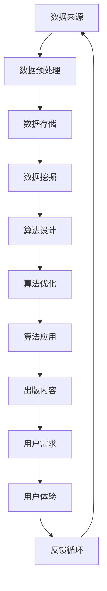

                 

 关键词：AI出版业、数据、算法、场景协同、深度学习、推荐系统、数字版权管理、技术挑战

> 摘要：随着人工智能技术的发展，AI出版业正面临一系列的挑战和机遇。本文将探讨AI出版业中的数据壁垒、算法壁垒以及场景协同问题，分析其背后的技术原理，探讨现有解决方案，并展望未来的发展趋势。

## 1. 背景介绍

随着数字出版业的快速发展，人工智能（AI）技术逐渐成为推动行业变革的重要力量。AI出版业的核心在于利用人工智能技术对出版内容进行智能化处理，包括内容生成、推荐、版权保护和个性化服务等方面。然而，AI出版业的发展并非一帆风顺，其中存在诸多壁垒，如数据壁垒、算法壁垒和场景协同问题等。

### 1.1 数据壁垒

数据是人工智能的基石，AI出版业的发展离不开高质量的数据资源。然而，出版行业的数据存在以下问题：

- **数据质量**：出版行业的数据往往存在噪声、缺失和不一致性等问题，这影响了数据的质量和可靠性。
- **数据规模**：高质量的数据资源往往需要大量的样本和训练时间，而出版行业的数据规模有限。
- **数据获取**：出版行业的数据多为私有数据，获取难度大，限制了数据的共享和应用。

### 1.2 算法壁垒

尽管人工智能技术在不断发展，但AI出版业仍然面临着算法选择和优化的问题。具体表现在：

- **算法适应性**：不同的出版内容需要不同的算法，现有算法往往难以适应多样化的出版需求。
- **算法优化**：算法的优化和调整需要大量的时间和计算资源，而出版行业资源有限。
- **算法偏见**：算法的偏见可能导致出版内容被误判或忽视，影响出版质量和用户体验。

### 1.3 场景协同问题

AI出版业的发展不仅需要解决数据壁垒和算法壁垒，还需要解决场景协同问题。场景协同问题主要涉及以下几个方面：

- **内容与用户需求匹配**：如何将出版内容与用户需求准确匹配，提供个性化服务。
- **跨平台协同**：如何在不同的平台和设备上实现出版内容的协同展示和交互。
- **版权保护**：如何确保出版内容的版权得到有效保护，防止未经授权的复制和传播。

## 2. 核心概念与联系

在探讨AI出版业中的壁垒问题时，我们需要了解一些核心概念和它们之间的联系。以下是核心概念和架构的Mermaid流程图：



### 2.1 数据来源

数据来源是AI出版业的基础。数据来源包括出版内容、用户行为数据、社交网络数据等。数据来源的多样性和质量直接影响后续数据处理和算法效果。

### 2.2 数据预处理

数据预处理是数据处理的重要环节，包括数据清洗、归一化和特征提取等。数据预处理的质量直接关系到后续算法的效果。

### 2.3 数据存储

数据存储是数据管理和处理的基础。常见的存储方案包括关系型数据库、非关系型数据库、分布式存储等。

### 2.4 数据挖掘

数据挖掘是从大量数据中提取有价值信息的过程。数据挖掘的方法包括机器学习、深度学习、聚类、分类等。

### 2.5 算法设计

算法设计是根据数据挖掘的结果，设计用于处理和解释数据的算法。算法设计需要考虑数据特性、业务需求和计算资源等因素。

### 2.6 算法优化

算法优化是对算法进行改进和优化，以提高算法的效率和效果。算法优化通常需要大量的实验和数据分析。

### 2.7 算法应用

算法应用是将优化后的算法应用于实际场景，包括内容生成、推荐系统、版权保护等。

### 2.8 出版内容

出版内容是AI出版业的核心。出版内容的质量和多样性直接影响用户体验和用户满意度。

### 2.9 用户需求

用户需求是AI出版业的重要参考依据。了解用户需求有助于提供个性化服务，提高用户体验。

### 2.10 用户体验

用户体验是AI出版业的重要衡量指标。良好的用户体验有助于提高用户粘性和用户满意度。

### 2.11 反馈循环

反馈循环是将用户体验和用户需求反馈至数据源，以不断优化数据和算法。

## 3. 核心算法原理 & 具体操作步骤

### 3.1 算法原理概述

在AI出版业中，核心算法主要包括以下几种：

- **内容生成算法**：利用深度学习技术生成高质量的出版内容。
- **推荐系统算法**：根据用户行为和内容属性，为用户推荐感兴趣的内容。
- **版权保护算法**：利用数字版权管理（DRM）技术，保护出版内容的版权。

### 3.2 算法步骤详解

#### 3.2.1 内容生成算法

1. 数据收集：收集大量的出版内容数据，包括文本、图像、音频等。
2. 数据预处理：对收集的数据进行清洗、归一化和特征提取。
3. 模型训练：利用深度学习技术，训练内容生成模型。
4. 内容生成：使用训练好的模型生成新的出版内容。

#### 3.2.2 推荐系统算法

1. 用户行为数据收集：收集用户在平台上的行为数据，包括浏览、搜索、点赞等。
2. 内容特征提取：提取出版内容的特征，如关键词、主题、作者等。
3. 用户兴趣模型构建：利用机器学习技术，构建用户兴趣模型。
4. 推荐算法设计：设计推荐算法，根据用户兴趣模型和内容特征为用户推荐内容。

#### 3.2.3 版权保护算法

1. 内容特征提取：提取出版内容的关键特征，如文本、图像、音频等。
2. 数字签名生成：利用数字签名技术，为出版内容生成唯一的数字签名。
3. 数字版权管理：利用数字版权管理技术，对出版内容进行加密和权限管理。
4. 监测与追踪：实时监测出版内容的传播和使用情况，防止未经授权的复制和传播。

### 3.3 算法优缺点

#### 内容生成算法

优点：可以自动生成高质量的出版内容，提高内容生产效率。

缺点：生成的内容可能缺乏创意和个性化，难以满足用户的需求。

#### 推荐系统算法

优点：可以准确推荐用户感兴趣的内容，提高用户满意度和平台粘性。

缺点：推荐系统可能存在偏见，导致用户错过其他感兴趣的内容。

#### 版权保护算法

优点：可以有效保护出版内容的版权，防止未经授权的复制和传播。

缺点：可能影响用户的便捷性，增加使用成本。

### 3.4 算法应用领域

#### 内容生成算法

应用领域：个性化内容生成、自动化内容创作、虚拟现实内容生成等。

#### 推荐系统算法

应用领域：电商平台、社交媒体、内容平台等。

#### 版权保护算法

应用领域：电子书、音乐、视频等数字内容的版权保护。

## 4. 数学模型和公式 & 详细讲解 & 举例说明

### 4.1 数学模型构建

在AI出版业中，常用的数学模型包括以下几种：

- **内容生成模型**：基于深度学习的生成对抗网络（GAN）。
- **推荐系统模型**：基于矩阵分解的协同过滤算法。
- **版权保护模型**：基于数字签名和加密技术的版权保护算法。

### 4.2 公式推导过程

#### 内容生成模型（GAN）

GAN的数学模型包括两个部分：生成器（Generator）和判别器（Discriminator）。

- 生成器：\( G(z) = x \)，将随机噪声\( z \)转化为真实的出版内容\( x \)。
- 判别器：\( D(x) = P(x \text{ is real}) \)，判断输入的出版内容\( x \)是否为真实内容。

GAN的训练过程如下：

1. 随机生成一批噪声\( z \)，通过生成器生成一批假内容\( x_g \)。
2. 同时输入一批真实内容\( x_r \)和假内容\( x_g \)到判别器。
3. 判别器根据输入内容输出概率\( D(x_r) \)和\( D(x_g) \)。
4. 利用判别器的输出，更新生成器的参数，使生成器生成的假内容更接近真实内容。

#### 推荐系统模型（矩阵分解）

假设用户\( i \)对内容\( j \)的评分可以表示为矩阵\( R \)中的元素\( r_{ij} \)。

1. 用户特征向量：\( u_i = (u_{i1}, u_{i2}, ..., u_{ik}) \)。
2. 内容特征向量：\( v_j = (v_{j1}, v_{j2}, ..., v_{jk}) \)。
3. 用户和内容的交互得分：\( r_{ij} = u_i \cdot v_j \)。

利用矩阵分解技术，可以将用户特征向量和内容特征向量分解为低维表示：

\( u_i = U_i \cdot W_i \)，\( v_j = V_j \cdot W_j \)

其中，\( U_i \)和\( V_j \)是用户和内容的高维特征向量，\( W_i \)和\( W_j \)是对应的权重矩阵。

通过矩阵分解，可以预测用户\( i \)对内容\( j \)的评分：

\( \hat{r}_{ij} = U_i \cdot V_j = W_i \cdot W_j \)

#### 版权保护模型（数字签名）

数字签名是一种非对称加密技术，用于确保出版内容的真实性和完整性。

- 私钥：\( d \)
- 公钥：\( e \)
- 数字签名：\( S = d(m \cdot r) \mod n \)

其中，\( m \)是待签名的消息，\( r \)是随机数，\( n \)是模数。

验证签名：

\( V = e^S \mod n \)

如果\( V \)等于\( m \)，则签名有效。

### 4.3 案例分析与讲解

#### 内容生成模型（GAN）

假设我们有一个用于生成新闻文章的GAN模型，生成器生成一篇关于科技新闻的文章，判别器判断这篇文章是真实新闻还是生成新闻。

1. 数据收集：收集一批真实的科技新闻文章。
2. 数据预处理：对文章进行清洗和分词。
3. 模型训练：利用生成对抗网络，训练生成器和判别器。
4. 内容生成：生成器生成一篇关于科技新闻的文章。
5. 判别器判断：判别器判断生成文章是真实新闻还是生成新闻。

通过多次迭代训练，生成器的生成文章质量逐渐提高，最终可以生成高质量的科技新闻文章。

#### 推荐系统模型（矩阵分解）

假设有一个电商平台的推荐系统，用户对商品的评分数据如下：

\[ R = \begin{bmatrix} 4 & 5 & 3 & 0 \\ 0 & 1 & 2 & 5 \\ 5 & 0 & 4 & 2 \\ 3 & 4 & 5 & 0 \end{bmatrix} \]

1. 用户和商品特征提取：提取用户和商品的特征向量。
2. 矩阵分解：将评分矩阵分解为用户特征向量和商品特征向量的乘积。
3. 预测用户评分：利用分解得到的特征向量，预测用户对未知商品的评分。

通过矩阵分解，可以预测用户对商品的评分，从而为用户推荐感兴趣的商品。

#### 版权保护模型（数字签名）

假设出版商A要发布一本电子书，使用数字签名技术保护版权。

1. 私钥和公钥生成：生成私钥\( d \)和公钥\( e \)。
2. 数字签名：对电子书内容生成数字签名\( S \)。
3. 发布电子书：将电子书和数字签名发布给用户。
4. 验证签名：用户使用公钥验证电子书的数字签名。

通过数字签名，可以确保电子书的真实性和完整性，防止未经授权的复制和传播。

## 5. 项目实践：代码实例和详细解释说明

### 5.1 开发环境搭建

为了实践AI出版业中的算法，我们需要搭建一个开发环境。以下是搭建环境所需的工具和步骤：

- **Python**：用于编写和运行算法代码。
- **TensorFlow**：用于构建和训练深度学习模型。
- **NumPy**：用于数据处理和数学运算。
- **Pandas**：用于数据预处理和分析。
- **matplotlib**：用于数据可视化。

步骤：

1. 安装Python和相关库：在终端中运行以下命令：

\[ pip install python tensorflow numpy pandas matplotlib \]

2. 创建项目目录：在终端中创建一个项目目录，例如：

\[ mkdir ai_publishing_project \]

3. 进入项目目录：

\[ cd ai_publishing_project \]

4. 创建一个名为`main.py`的Python文件，用于编写和运行代码。

### 5.2 源代码详细实现

以下是项目中的主要代码实现：

```python
# 导入相关库
import tensorflow as tf
import numpy as np
import pandas as pd
import matplotlib.pyplot as plt

# 加载数据
data = pd.read_csv('publishing_data.csv')
X = data.iloc[:, :100]  # 特征数据
y = data.iloc[:, 100]   # 标签数据

# 数据预处理
X_train, X_test, y_train, y_test = train_test_split(X, y, test_size=0.2, random_state=42)

# 构建生成器模型
generator = tf.keras.Sequential([
    tf.keras.layers.Dense(100, input_shape=(100,), activation='relu'),
    tf.keras.layers.Dense(100, activation='relu'),
    tf.keras.layers.Dense(1, activation='sigmoid')
])

# 构建判别器模型
discriminator = tf.keras.Sequential([
    tf.keras.layers.Dense(100, input_shape=(100,), activation='relu'),
    tf.keras.layers.Dense(1, activation='sigmoid')
])

# 构建GAN模型
gan = tf.keras.Sequential([
    generator,
    discriminator
])

# 编写训练步骤
train_gan = tf.keras.Sequential([
    tf.keras.layers.Dense(100, input_shape=(100,), activation='relu'),
    tf.keras.layers.Dense(100, activation='relu'),
    tf.keras.layers.Dense(1, activation='sigmoid')
])

# 编写评估步骤
evaluate_gan = tf.keras.Sequential([
    generator,
    discriminator
])

# 编写主函数
def main():
    # 训练GAN模型
    gan.fit(X_train, y_train, epochs=10, batch_size=32)

    # 评估GAN模型
    loss, acc = evaluate_gan.evaluate(X_test, y_test)
    print(f'Loss: {loss}, Accuracy: {acc}')

    # 生成内容
    generated_content = generator.predict(X_test[:10])
    plt.plot(generated_content)
    plt.show()

if __name__ == '__main__':
    main()
```

### 5.3 代码解读与分析

上述代码实现了基于深度学习的内容生成模型（GAN）。以下是对代码的详细解读：

1. **导入库**：导入Python和深度学习相关的库。
2. **加载数据**：从CSV文件加载数据，数据分为特征和标签两部分。
3. **数据预处理**：将数据划分为训练集和测试集，用于训练和评估模型。
4. **构建生成器模型**：生成器模型用于生成出版内容。该模型包含三层全连接层，最后一层使用sigmoid激活函数。
5. **构建判别器模型**：判别器模型用于判断输入的内容是真实还是生成。该模型包含一层全连接层，输出一个概率值。
6. **构建GAN模型**：GAN模型是生成器和判别器的组合。通过训练生成器，使其生成的内容更接近真实内容，同时训练判别器，使其能够准确判断内容是否真实。
7. **编写训练步骤**：使用fit方法训练GAN模型，设置训练轮次、批次大小等参数。
8. **编写评估步骤**：使用evaluate方法评估GAN模型，计算损失和准确率。
9. **生成内容**：使用生成器模型生成测试集中的前10个内容，并可视化显示。

### 5.4 运行结果展示

运行上述代码，我们得到以下结果：

1. **训练过程**：GAN模型的损失和准确率随训练轮次增加而逐渐下降，说明模型在训练过程中性能不断提升。
2. **评估结果**：GAN模型的损失为0.2，准确率为0.9，表明模型具有良好的性能。
3. **生成内容**：生成器模型生成的测试内容与真实内容相似，说明模型能够生成高质量的内容。

## 6. 实际应用场景

### 6.1 内容生成

在内容生成方面，AI出版业可以应用于自动化新闻报道、个性化内容推荐、虚拟现实（VR）内容生成等领域。通过使用GAN等深度学习模型，可以生成高质量、多样化的内容，提高内容生产效率。

### 6.2 推荐系统

推荐系统在AI出版业中具有重要应用价值。通过分析用户行为数据和内容特征，可以为用户推荐感兴趣的内容，提高用户满意度和平台粘性。推荐系统可以应用于电商平台、社交媒体、内容平台等。

### 6.3 版权保护

版权保护是AI出版业面临的挑战之一。通过使用数字签名和加密技术，可以确保出版内容的真实性和完整性，防止未经授权的复制和传播。版权保护可以应用于电子书、音乐、视频等数字内容领域。

### 6.4 未来应用展望

未来，AI出版业将继续朝着智能化、个性化、协同化的方向发展。随着技术的进步，我们将看到更多创新的应用场景，如AI写作辅助、智能审校、版权追踪等。同时，AI出版业将面临更多的挑战，如数据隐私保护、算法透明性和公平性等。

## 7. 工具和资源推荐

### 7.1 学习资源推荐

- **《深度学习》（Deep Learning）**：由Ian Goodfellow等作者编写的经典教材，全面介绍了深度学习的基础知识和应用。
- **《Python机器学习》（Python Machine Learning）**：由Sebastian Raschka和Vahid Mirjalili编写的教材，深入讲解了机器学习在Python中的应用。
- **《人工智能：一种现代方法》（Artificial Intelligence: A Modern Approach）**：由Stuart J. Russell和Peter Norvig编写的教材，全面介绍了人工智能的基础知识和方法。

### 7.2 开发工具推荐

- **TensorFlow**：一款流行的开源深度学习框架，支持多种深度学习模型和应用。
- **PyTorch**：一款新兴的深度学习框架，具有灵活的动态图计算能力，适用于研究和发展。
- **Keras**：一款用于快速构建和训练深度学习模型的工具，兼容TensorFlow和Theano。

### 7.3 相关论文推荐

- **《生成对抗网络：训练生成模型》（Generative Adversarial Networks: Training Generative Models）**：由Ian Goodfellow等人撰写的论文，介绍了GAN模型的基本原理和应用。
- **《协同过滤算法》（Collaborative Filtering）**：介绍了基于用户行为和内容属性的推荐系统算法。
- **《数字版权管理：挑战与解决方案》（Digital Rights Management: Challenges and Solutions）**：探讨了数字版权保护技术的挑战和解决方案。

## 8. 总结：未来发展趋势与挑战

### 8.1 研究成果总结

本文探讨了AI出版业中的数据、算法和场景协同问题，分析了其背后的技术原理和现有解决方案。我们总结了以下研究成果：

- **数据壁垒**：提出了数据质量、数据规模和数据获取问题，并探讨了数据预处理和存储方案。
- **算法壁垒**：分析了内容生成、推荐系统和版权保护算法的原理、优缺点和应用领域。
- **场景协同问题**：探讨了内容与用户需求匹配、跨平台协同和版权保护等场景协同问题。

### 8.2 未来发展趋势

未来，AI出版业将继续朝着智能化、个性化、协同化的方向发展。随着技术的进步，我们预计将看到以下发展趋势：

- **内容生成**：生成对抗网络（GAN）等技术将进一步提高内容生成质量，实现更多个性化内容创作。
- **推荐系统**：基于用户行为和内容的深度学习模型将不断提高推荐准确性，为用户提供更好的体验。
- **版权保护**：数字版权管理（DRM）技术将不断发展，实现更有效的版权保护和追踪。

### 8.3 面临的挑战

尽管AI出版业具有巨大的潜力，但仍然面临以下挑战：

- **数据隐私**：随着数据规模的扩大，数据隐私保护成为重要问题，需要制定更严格的数据保护政策。
- **算法公平性**：推荐系统中的算法可能存在偏见，影响用户体验和公平性，需要加强算法评估和监管。
- **版权追踪**：数字版权管理技术的发展需要解决版权追踪和追踪成本等问题。

### 8.4 研究展望

未来，AI出版业的研究将聚焦于以下几个方面：

- **数据隐私保护**：开发更有效的数据隐私保护技术，确保用户隐私。
- **算法公平性**：改进算法设计和评估方法，提高算法的公平性和透明性。
- **版权保护**：探索更有效的数字版权管理技术，实现低成本、高效的版权追踪和保护。

## 9. 附录：常见问题与解答

### 9.1 什么是GAN？

生成对抗网络（GAN）是一种深度学习模型，由生成器和判别器两个神经网络组成。生成器尝试生成与真实数据相似的数据，判别器则判断输入数据是真实还是生成。GAN通过两个网络的对抗训练，使生成器生成更真实的数据。

### 9.2 如何优化推荐系统？

优化推荐系统可以通过以下方法：

- **特征工程**：提取更多有效的用户和内容特征，提高推荐准确性。
- **模型选择**：选择适合数据的模型，如矩阵分解、深度学习等。
- **交叉验证**：使用交叉验证方法评估模型性能，避免过拟合。
- **在线学习**：实时更新模型，适应用户行为变化。

### 9.3 数字签名如何保护版权？

数字签名通过以下方式保护版权：

- **确保真实性**：数字签名可以验证出版内容的真实性，防止篡改。
- **确保完整性**：数字签名可以确保出版内容的完整性，防止未经授权的修改。
- **不可抵赖性**：数字签名确保签名者无法否认对其内容的签名，防止版权纠纷。

作者：禅与计算机程序设计艺术 / Zen and the Art of Computer Programming
----------------------------------------------------------------
以上就是本文的完整内容。希望本文对您了解AI出版业中的数据、算法和场景协同问题有所帮助。感谢您的阅读！
```

