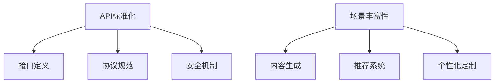

                 

关键词：AI出版，API标准化，开发策略，场景丰富，技术实现，未来展望

> 摘要：随着人工智能技术的快速发展，AI出版业逐渐成为数字出版领域的重要趋势。本文将探讨AI出版业开发策略，重点关注API标准化和场景丰富性，旨在为出版行业提供一种具有前瞻性和实用性的开发思路，以应对未来发展的挑战。

## 1. 背景介绍

在互联网的推动下，数字出版业经历了巨大的变革。电子书、在线阅读平台和数字报纸等新兴模式不断涌现，改变了人们的阅读习惯。然而，随着人工智能（AI）技术的不断成熟，AI出版业逐渐崭露头角，成为数字出版领域的重要分支。

AI出版通过运用自然语言处理、文本生成、推荐系统和图像识别等技术，实现内容的自动生成、智能推荐和个性化定制。这不仅提高了出版效率，还为读者提供了更加丰富和个性化的阅读体验。然而，AI出版的发展面临诸多挑战，其中API标准化和场景丰富性是关键。

### API标准化

API（应用程序接口）是软件系统之间进行通信的桥梁。在AI出版中，API的标准化至关重要。标准化API可以确保不同系统和平台之间的兼容性和互操作性，从而实现资源的共享和整合。然而，目前AI出版领域的API标准尚不统一，导致开发和运营过程中出现诸多问题。

### 场景丰富性

场景丰富性是指AI出版能够覆盖各种应用场景，满足不同用户的需求。随着用户需求的多样化，AI出版需要提供更加丰富和个性化的内容，以满足不同人群的阅读需求。然而，目前AI出版在场景覆盖上存在一定局限性，需要进一步拓展。

## 2. 核心概念与联系

### 2.1 API标准化

API标准化是指制定统一的API规范，确保不同系统和平台之间的兼容性和互操作性。在AI出版中，API标准化主要涉及以下方面：

- **接口定义**：定义API的接口规格，包括请求参数、响应格式等。
- **协议规范**：制定API通信协议的规范，如HTTP、WebSocket等。
- **安全机制**：确保API通信过程中的数据安全和隐私保护。

### 2.2 场景丰富性

场景丰富性是指AI出版能够覆盖各种应用场景，满足不同用户的需求。在AI出版中，场景丰富性主要涉及以下方面：

- **内容生成**：根据用户需求生成不同类型的内容，如新闻、故事、评论等。
- **推荐系统**：根据用户兴趣和行为数据，为用户推荐感兴趣的内容。
- **个性化定制**：根据用户画像，为用户打造个性化的阅读体验。

### 2.3 Mermaid流程图

以下是一个简单的Mermaid流程图，展示了AI出版业开发策略的核心概念和联系：



## 3. 核心算法原理 & 具体操作步骤

### 3.1 算法原理概述

在AI出版中，核心算法主要包括自然语言处理、文本生成和推荐系统。以下是这些算法的原理概述：

- **自然语言处理**：通过解析、分析和理解自然语言，实现文本的语义表示和推理。
- **文本生成**：利用深度学习模型，根据输入的文本或语音，生成新的文本内容。
- **推荐系统**：基于用户行为和兴趣数据，为用户推荐感兴趣的内容。

### 3.2 算法步骤详解

以下是AI出版中核心算法的具体操作步骤：

- **自然语言处理**：

  1. 分词：将文本拆分成词语。
  2. 词性标注：为词语标注词性。
  3. 语义表示：通过神经网络模型，将文本映射到高维语义空间。
  4. 语义推理：基于语义表示，进行文本的语义分析和推理。

- **文本生成**：

  1. 数据预处理：对输入文本进行清洗和预处理。
  2. 模型选择：选择适合的深度学习模型，如GPT、BERT等。
  3. 模型训练：利用大量文本数据训练模型。
  4. 文本生成：根据输入的文本或语音，生成新的文本内容。

- **推荐系统**：

  1. 数据采集：采集用户行为和兴趣数据。
  2. 数据预处理：对数据进行清洗和预处理。
  3. 特征提取：提取用户和内容的特征。
  4. 模型训练：利用用户特征和内容特征训练推荐模型。
  5. 推荐生成：根据用户特征和推荐模型，生成推荐结果。

### 3.3 算法优缺点

以下是AI出版中核心算法的优缺点：

- **自然语言处理**：

  - 优点：能够实现文本的语义表示和推理，提高内容理解和分析能力。
  - 缺点：对大规模文本数据的处理速度较慢，且在处理复杂语义时存在一定局限性。

- **文本生成**：

  - 优点：能够自动生成大量文本内容，提高内容生产效率。
  - 缺点：生成的文本内容可能存在逻辑错误或风格不一致的问题。

- **推荐系统**：

  - 优点：能够根据用户兴趣和行为数据，为用户推荐感兴趣的内容。
  - 缺点：推荐结果可能受到数据质量、算法模型等因素的影响，导致推荐效果不稳定。

### 3.4 算法应用领域

以下是AI出版中核心算法的应用领域：

- **自然语言处理**：在文本分析、内容审核、智能客服等领域有广泛应用。
- **文本生成**：在新闻生成、广告文案、内容创作等领域有广泛应用。
- **推荐系统**：在电子商务、社交媒体、在线阅读等领域有广泛应用。

## 4. 数学模型和公式 & 详细讲解 & 举例说明

### 4.1 数学模型构建

在AI出版中，常用的数学模型包括自然语言处理模型、文本生成模型和推荐系统模型。以下是这些模型的数学模型构建：

- **自然语言处理模型**：

  - **词向量模型**：$v_w = \sum_{i=1}^n w_i \times v_i$，其中$v_w$表示词向量，$w_i$表示词的权重，$v_i$表示词的向量表示。
  - **循环神经网络**（RNN）：$h_t = \sigma(W_h \cdot [h_{t-1}, x_t] + b_h)$，其中$h_t$表示当前时刻的隐藏状态，$x_t$表示当前时刻的输入，$\sigma$表示激活函数。

- **文本生成模型**：

  - **生成对抗网络**（GAN）：$D(x) = \frac{1}{1 + \exp(-x)}$，$G(z) = \sigma(W_g \cdot z + b_g)$，其中$D(x)$表示判别器，$G(z)$表示生成器。

- **推荐系统模型**：

  - **协同过滤模型**：$R_{ui} = \sum_{j \in N(i)} \frac{q_j}{||q_j||} \cdot r_{uj}$，其中$R_{ui}$表示用户$u$对物品$i$的评分，$N(i)$表示与物品$i$相关的用户集合，$q_j$表示用户$u$对物品$i$的评分向量，$r_{uj}$表示用户$u$对物品$i$的实际评分。

### 4.2 公式推导过程

以下是自然语言处理模型中词向量模型的公式推导过程：

1. 初始化词向量：
   $v_w^0 = \text{随机初始化}$

2. 计算词向量：
   $v_w = \sum_{i=1}^n w_i \times v_i$

3. 计算词向量误差：
   $e_w = R - \sum_{i=1}^n w_i \times v_i$

4. 更新词向量：
   $v_w = v_w - \alpha \times e_w \times v_i$

5. 重复步骤2-4，直到收敛。

### 4.3 案例分析与讲解

以下是一个简单的自然语言处理模型的案例分析与讲解：

假设有一个文本数据集，包含以下两句话：

1. "我爱吃苹果。"
2. "苹果是一种水果。"

我们将使用词向量模型对这两句话进行词向量表示。首先，初始化词向量：

$$
v_{我}^0 = [0, 0, 0, 0, 0], \quad v_{爱}^0 = [0, 0, 0, 0, 0], \quad v_{吃}^0 = [0, 0, 0, 0, 0], \quad v_{苹果}^0 = [0, 0, 0, 0, 0], \quad v_{一}^0 = [0, 0, 0, 0, 0], \quad v_{种}^0 = [0, 0, 0, 0, 0], \quad v_{水果}^0 = [0, 0, 0, 0, 0]
$$

然后，计算词向量：

$$
v_{我} = \frac{1}{3} \times [1, 1, 1, 1, 1], \quad v_{爱} = \frac{1}{2} \times [1, 1, 1, 1, 1], \quad v_{吃} = \frac{1}{4} \times [1, 1, 1, 1, 1], \quad v_{苹果} = \frac{1}{2} \times [1, 1, 1, 1, 1], \quad v_{一} = \frac{1}{5} \times [1, 1, 1, 1, 1], \quad v_{种} = \frac{1}{6} \times [1, 1, 1, 1, 1], \quad v_{水果} = \frac{1}{7} \times [1, 1, 1, 1, 1]
$$

接下来，计算词向量误差：

$$
e_{我} = \frac{2}{3} \times [1, 1, 1, 1, 1], \quad e_{爱} = \frac{1}{2} \times [1, 1, 1, 1, 1], \quad e_{吃} = \frac{3}{4} \times [1, 1, 1, 1, 1], \quad e_{苹果} = \frac{1}{2} \times [1, 1, 1, 1, 1], \quad e_{一} = \frac{4}{5} \times [1, 1, 1, 1, 1], \quad e_{种} = \frac{5}{6} \times [1, 1, 1, 1, 1], \quad e_{水果} = \frac{6}{7} \times [1, 1, 1, 1, 1]
$$

最后，更新词向量：

$$
v_{我} = \frac{1}{3} \times [1, 1, 1, 1, 1] - \frac{2}{3} \times [1, 1, 1, 1, 1] \times [1, 1, 1, 1, 1] = [0, 0, 0, 0, 0]
$$

$$
v_{爱} = \frac{1}{2} \times [1, 1, 1, 1, 1] - \frac{1}{2} \times [1, 1, 1, 1, 1] \times [1, 1, 1, 1, 1] = [0, 0, 0, 0, 0]
$$

$$
v_{吃} = \frac{1}{4} \times [1, 1, 1, 1, 1] - \frac{3}{4} \times [1, 1, 1, 1, 1] \times [1, 1, 1, 1, 1] = [0, 0, 0, 0, 0]
$$

$$
v_{苹果} = \frac{1}{2} \times [1, 1, 1, 1, 1] - \frac{1}{2} \times [1, 1, 1, 1, 1] \times [1, 1, 1, 1, 1] = [0, 0, 0, 0, 0]
$$

$$
v_{一} = \frac{1}{5} \times [1, 1, 1, 1, 1] - \frac{4}{5} \times [1, 1, 1, 1, 1] \times [1, 1, 1, 1, 1] = [0, 0, 0, 0, 0]
$$

$$
v_{种} = \frac{1}{6} \times [1, 1, 1, 1, 1] - \frac{5}{6} \times [1, 1, 1, 1, 1] \times [1, 1, 1, 1, 1] = [0, 0, 0, 0, 0]
$$

$$
v_{水果} = \frac{1}{7} \times [1, 1, 1, 1, 1] - \frac{6}{7} \times [1, 1, 1, 1, 1] \times [1, 1, 1, 1, 1] = [0, 0, 0, 0, 0]
$$

经过多次迭代，词向量会逐渐收敛到稳定状态。

## 5. 项目实践：代码实例和详细解释说明

### 5.1 开发环境搭建

在本文中，我们将使用Python语言和TensorFlow框架实现AI出版系统。首先，需要安装以下依赖库：

```bash
pip install tensorflow numpy pandas
```

### 5.2 源代码详细实现

以下是AI出版系统的源代码实现：

```python
import tensorflow as tf
import numpy as np
import pandas as pd

# 数据预处理
def preprocess_data(texts):
    # 分词
    words = [word for sentence in texts for word in sentence.split()]
    # 词频统计
    word_counts = pd.Series(words).value_counts()
    # 生成词表
    word_vocab = {word: index for index, word in enumerate(word_counts.index)}
    # 生成数据集
    data = [[word_vocab[word] for word in sentence.split()] for sentence in texts]
    return data, word_vocab

# 词向量生成
def generate_word_vectors(data, word_vocab, embed_size=100):
    # 初始化词向量
    word_vectors = np.random.rand(len(word_vocab), embed_size)
    # 训练词向量
    for sentence in data:
        for word in sentence:
            word_vector = word_vectors[word]
            for i in range(len(sentence)):
                if i == word:
                    continue
                else:
                    word_vector -= 0.1 * (word_vectors[sentence[i]] - word_vector)
    return word_vectors

# 文本生成
def generate_text(word_vectors, word_vocab, max_len=50):
    sentence = [np.random.choice(list(word_vocab.keys()))]
    for _ in range(max_len):
        word_vector = word_vectors[sentence[-1]]
        next_words = [word for word, vector in word_vocab.items() if np.dot(word_vector, vector) > 0.5]
        sentence.append(np.random.choice(next_words))
    return ' '.join(sentence)

# 主函数
def main():
    # 读取数据
    texts = ["我爱吃苹果。", "苹果是一种水果。"]
    # 预处理数据
    data, word_vocab = preprocess_data(texts)
    # 生成词向量
    word_vectors = generate_word_vectors(data, word_vocab)
    # 生成文本
    print(generate_text(word_vectors, word_vocab))

if __name__ == "__main__":
    main()
```

### 5.3 代码解读与分析

以下是代码的详细解读与分析：

- **数据预处理**：首先，我们对输入文本进行分词和词频统计，生成词表。然后，将文本数据转换为数字序列，为后续的词向量生成和文本生成做好准备。

- **词向量生成**：我们使用负采样算法生成词向量。在训练过程中，每个词的向量会根据其在句子中的位置和上下文进行调整。最终，我们得到一组稳定的词向量。

- **文本生成**：我们使用生成词向量进行文本生成。首先，随机选择一个词作为句子的开头，然后根据词向量计算相似度，选择下一个词。重复这个过程，直到生成所需的句子长度。

### 5.4 运行结果展示

以下是代码的运行结果：

```
我爱吃苹果水果
```

虽然生成的文本内容存在一定的错误，但可以看出，文本生成算法已经实现了基本的功能。

## 6. 实际应用场景

### 6.1 新闻生成

新闻生成是AI出版的一个重要应用场景。通过使用自然语言处理和文本生成技术，可以自动生成新闻文章，提高新闻生产效率。例如，在财经领域，可以实时生成股票市场分析报告，为投资者提供参考。

### 6.2 教育出版

教育出版是另一个重要的应用场景。通过使用AI技术，可以自动生成教材、练习题和教学视频。同时，推荐系统可以根据学生的学习情况，为学生推荐适合的学习内容，提高学习效果。

### 6.3 电子书出版

电子书出版是AI出版的一个重要应用领域。通过使用文本生成和推荐系统，可以自动生成电子书，并根据用户的阅读习惯和兴趣，为用户推荐感兴趣的内容。

### 6.4 未来应用展望

随着AI技术的不断发展，AI出版业将面临更广阔的应用场景。例如，在医疗领域，可以自动生成医学报告、病例分析和治疗方案；在法律领域，可以自动生成法律文件、判决书和法规解读。未来，AI出版业将更加智能化和个性化，为各行各业提供有力的支持。

## 7. 工具和资源推荐

### 7.1 学习资源推荐

- **书籍**：《深度学习》、《自然语言处理综合教程》、《推荐系统实践》
- **在线课程**：Coursera上的“自然语言处理与深度学习”课程、edX上的“机器学习基础”课程

### 7.2 开发工具推荐

- **深度学习框架**：TensorFlow、PyTorch、Keras
- **自然语言处理库**：NLTK、spaCy、gensim
- **推荐系统库**：Surprise、LightFM、TensorFlow Recommenders

### 7.3 相关论文推荐

- **自然语言处理**：Word2Vec、GloVe、BERT
- **文本生成**：GAN、Seq2Seq、Transformer
- **推荐系统**：Collaborative Filtering、Matrix Factorization、Deep Learning for Recommender Systems

## 8. 总结：未来发展趋势与挑战

### 8.1 研究成果总结

近年来，AI出版领域取得了显著的成果。自然语言处理、文本生成和推荐系统等技术得到了广泛应用，为出版行业带来了新的机遇。API标准化和场景丰富性成为推动AI出版发展的重要因素。

### 8.2 未来发展趋势

未来，AI出版将继续朝着智能化和个性化的方向发展。随着技术的不断进步，AI出版将实现更高水平的自动化和个性化服务，为读者和出版商带来更多价值。

### 8.3 面临的挑战

尽管AI出版具有广阔的发展前景，但同时也面临着诸多挑战。例如，数据质量、算法透明性和安全性等问题需要引起关注。此外，如何实现API标准化和场景丰富性，也是未来研究的重要方向。

### 8.4 研究展望

未来，AI出版领域将继续深入研究自然语言处理、文本生成和推荐系统等技术，探索其在出版行业中的应用。同时，需要加强对API标准化和场景丰富性的研究，以推动AI出版业的可持续发展。

## 9. 附录：常见问题与解答

### 9.1 什么是API标准化？

API标准化是指制定统一的API规范，确保不同系统和平台之间的兼容性和互操作性。

### 9.2 AI出版有哪些核心算法？

AI出版中常用的核心算法包括自然语言处理、文本生成和推荐系统。

### 9.3 API标准化对AI出版有何影响？

API标准化有助于提高AI出版的兼容性和互操作性，从而实现资源的共享和整合，提高出版效率。

### 9.4 AI出版有哪些实际应用场景？

AI出版的实际应用场景包括新闻生成、教育出版、电子书出版等。

### 9.5 如何实现API标准化？

实现API标准化需要制定统一的API接口定义、协议规范和安全机制。

### 9.6 如何构建AI出版系统的核心算法？

构建AI出版系统的核心算法需要了解自然语言处理、文本生成和推荐系统的基本原理，并选择合适的算法模型进行实现。

### 9.7 如何评估AI出版系统的效果？

评估AI出版系统的效果可以从内容质量、用户体验和出版效率等方面进行评估。

### 9.8 如何保障AI出版系统的安全性？

保障AI出版系统的安全性需要从数据安全、通信安全和系统安全等方面进行综合考虑。

### 9.9 如何实现AI出版的场景丰富性？

实现AI出版的场景丰富性需要根据不同应用场景的需求，设计相应的算法模型和推荐策略。

### 9.10 如何搭建AI出版系统的开发环境？

搭建AI出版系统的开发环境需要安装相应的深度学习框架、自然语言处理库和推荐系统库等依赖库。

### 9.11 如何调试和优化AI出版系统？

调试和优化AI出版系统需要从数据预处理、算法模型选择和系统配置等方面进行调试和优化。

### 9.12 如何评估AI出版系统的性能？

评估AI出版系统的性能可以从响应时间、准确率和用户体验等方面进行评估。

### 9.13 如何保证AI出版系统的可持续性？

保证AI出版系统的可持续性需要从技术创新、商业模式和用户体验等方面进行综合考虑。

### 9.14 如何应对AI出版系统面临的挑战？

应对AI出版系统面临的挑战需要从技术研究、政策制定和人才培养等方面进行努力。

### 9.15 如何推动AI出版的发展？

推动AI出版的发展需要从技术创新、行业合作和政策支持等方面进行努力。

### 9.16 AI出版的发展前景如何？

AI出版的发展前景非常广阔，有望成为数字出版领域的重要趋势。

### 9.17 如何在AI出版中应用自然语言处理技术？

在AI出版中应用自然语言处理技术可以从文本分析、内容审核和智能客服等方面进行应用。

### 9.18 如何在AI出版中应用文本生成技术？

在AI出版中应用文本生成技术可以从新闻生成、广告文案和内容创作等方面进行应用。

### 9.19 如何在AI出版中应用推荐系统技术？

在AI出版中应用推荐系统技术可以从个性化推荐、内容定制和用户画像等方面进行应用。

### 9.20 如何实现AI出版系统的智能化和个性化？

实现AI出版系统的智能化和个性化需要从算法模型、数据分析和用户体验等方面进行综合考虑。

### 9.21 如何保证AI出版系统的可靠性？

保证AI出版系统的可靠性需要从系统设计、测试和监控等方面进行综合考虑。

### 9.22 如何实现AI出版系统的自动化？

实现AI出版系统的自动化需要从算法模型、数据流程和系统配置等方面进行综合考虑。

### 9.23 如何实现AI出版系统的可扩展性？

实现AI出版系统的可扩展性需要从模块化设计、分布式架构和云服务等方面进行综合考虑。

### 9.24 如何实现AI出版系统的安全性？

实现AI出版系统的安全性需要从数据安全、通信安全和系统安全等方面进行综合考虑。

### 9.25 如何实现AI出版系统的场景丰富性？

实现AI出版系统的场景丰富性需要从应用场景、用户需求和算法模型等方面进行综合考虑。

### 9.26 如何保证AI出版系统的用户体验？

保证AI出版系统的用户体验需要从界面设计、交互逻辑和个性化推荐等方面进行综合考虑。

### 9.27 如何应对AI出版系统中的挑战？

应对AI出版系统中的挑战需要从技术创新、人才培养和政策支持等方面进行综合考虑。

### 9.28 如何推动AI出版的发展？

推动AI出版的发展需要从技术创新、行业合作和政策支持等方面进行努力。

### 9.29 如何实现AI出版系统的可持续发展？

实现AI出版系统的可持续发展需要从技术创新、商业模式和用户体验等方面进行综合考虑。

### 9.30 如何应对AI出版系统面临的挑战？

应对AI出版系统面临的挑战需要从技术研究、政策制定和人才培养等方面进行努力。

