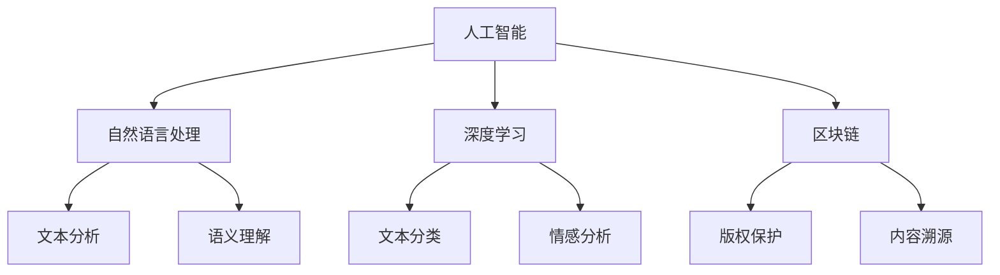

                 

关键词：人工智能，出版业，降本增效，场景创新，技术变革，数据分析，深度学习，区块链，内容优化，用户体验

> 摘要：随着人工智能技术的迅猛发展，出版业面临着前所未有的机遇与挑战。本文深入探讨了AI技术在出版业中的应用，包括降本增效和场景创新等方面，旨在揭示AI出版业的发展趋势，助力行业转型升级。

## 1. 背景介绍

在过去的几十年里，出版业经历了翻天覆地的变化。从传统的印刷出版到数字出版，再到如今的智能出版，出版业正逐步迈向智能化、数字化和个性化的新时代。然而，这一过程并非一帆风顺，出版业面临着诸多挑战，如内容生产成本高、传播效率低、用户体验差等。人工智能技术的发展为出版业带来了新的机遇，使得降本增效和场景创新成为可能。

## 2. 核心概念与联系

在探讨AI技术在出版业的应用之前，我们需要明确几个核心概念：

### 2.1 人工智能（AI）

人工智能是一种模拟、延伸和扩展人类智能的理论、方法、技术及应用。它包括机器学习、深度学习、自然语言处理等多种技术，能够实现数据的自动分析、决策和预测。

### 2.2 自然语言处理（NLP）

自然语言处理是人工智能的一个重要分支，旨在让计算机理解和处理人类语言。它包括文本分析、语义理解、语音识别等多个方面，对于出版业的内容生产和优化具有重要意义。

### 2.3 深度学习

深度学习是一种基于人工神经网络的机器学习技术，通过多层神经网络对大量数据进行训练，能够自动提取特征并进行分类、预测等任务。在出版业中，深度学习可用于文本分类、情感分析等应用。

### 2.4 区块链

区块链是一种分布式数据库技术，具有去中心化、不可篡改等特点。在出版业中，区块链可用于版权保护、内容溯源等应用。

下面是一个简化的Mermaid流程图，展示了这些核心概念之间的关系：



## 3. 核心算法原理 & 具体操作步骤

### 3.1 算法原理概述

在出版业中，人工智能技术的应用主要包括以下几个方面：

### 3.1.1 内容生产

利用自然语言处理和深度学习技术，人工智能可以自动生成文章、书籍等内容。这种自动写作技术可以大幅降低内容生产成本，提高生产效率。

### 3.1.2 内容优化

通过对用户行为的分析，人工智能可以识别用户的兴趣和需求，为用户提供个性化的内容推荐。同时，利用自然语言处理技术，可以对文章进行语法、语义优化，提高文章质量。

### 3.1.3 版权保护

区块链技术可以用于版权保护，确保内容的原创性和可追溯性。通过在区块链上登记版权信息，可以防止内容被盗用或篡改。

### 3.1.4 用户体验

人工智能可以通过语音识别、图像识别等技术，为用户提供更加便捷、自然的交互体验。

### 3.2 算法步骤详解

以下是AI技术在出版业中应用的详细步骤：

### 3.2.1 自动写作

1. 数据采集：从互联网上收集大量文本数据，如新闻、文章、书籍等。
2. 数据预处理：对文本数据进行分析、清洗和归一化，为训练模型做准备。
3. 模型训练：利用深度学习技术，训练自动写作模型。
4. 文本生成：输入关键词或主题，模型生成相关文本内容。

### 3.2.2 内容优化

1. 用户行为分析：收集用户在平台上的浏览、点赞、评论等行为数据。
2. 文本分析：利用自然语言处理技术，对用户行为数据进行分析，提取用户兴趣和需求。
3. 内容推荐：根据用户兴趣和需求，为用户推荐相关内容。
4. 文本优化：利用自然语言处理技术，对文章进行语法、语义优化。

### 3.2.3 版权保护

1. 版权登记：在区块链上登记版权信息，包括作者、作品名称、创作时间等。
2. 内容溯源：通过区块链技术，确保内容的原创性和可追溯性。
3. 版权保护：当发现内容被盗用或篡改时，利用区块链技术追究责任。

### 3.2.4 用户体验

1. 语音识别：通过语音识别技术，实现语音输入、语音合成等功能。
2. 图像识别：通过图像识别技术，实现图片搜索、图像标注等功能。
3. 自然交互：利用语音识别、图像识别等技术，为用户提供更加便捷、自然的交互体验。

### 3.3 算法优缺点

#### 3.3.1 自动写作

优点：大幅降低内容生产成本，提高生产效率。

缺点：生成的文章质量相对较低，可能缺乏人类的情感和创造力。

#### 3.3.2 内容优化

优点：提高文章质量，满足用户个性化需求。

缺点：需要大量数据支持，且算法对数据质量有较高要求。

#### 3.3.3 版权保护

优点：确保内容的原创性和可追溯性，防止盗版和篡改。

缺点：区块链技术尚处于发展阶段，技术成熟度和安全性有待提高。

#### 3.3.4 用户体验

优点：为用户提供更加便捷、自然的交互体验。

缺点：对技术要求较高，实施成本较大。

### 3.4 算法应用领域

#### 3.4.1 传统出版业

在传统出版业中，AI技术可用于内容生产、内容优化、版权保护等方面，提高出版效率和质量。

#### 3.4.2 数字出版业

在数字出版业中，AI技术可用于个性化推荐、内容优化、用户互动等方面，提升用户体验。

#### 3.4.3 自媒体平台

在自媒体平台上，AI技术可用于内容生产、内容优化、流量分配等方面，帮助自媒体作者提高曝光度和粉丝黏性。

## 4. 数学模型和公式 & 详细讲解 & 举例说明

在AI出版业中，数学模型和公式发挥着重要作用。以下是一个简化的数学模型示例，用于描述用户兴趣和需求的提取过程。

### 4.1 数学模型构建

假设我们有N个用户，每个用户有M个特征。我们可以用矩阵X表示用户特征矩阵，其中X[i][j]表示第i个用户的第j个特征值。用户兴趣可以用向量U表示，其中U[i]表示第i个用户对特定内容的兴趣度。

我们可以通过以下公式计算用户兴趣：

$$
U = X \cdot W
$$

其中，W是一个权重矩阵，用于调整不同特征对用户兴趣的影响。

### 4.2 公式推导过程

首先，我们定义用户特征矩阵X：

$$
X = \begin{bmatrix}
x_{11} & x_{12} & \cdots & x_{1m} \\
x_{21} & x_{22} & \cdots & x_{2m} \\
\vdots & \vdots & \ddots & \vdots \\
x_{n1} & x_{n2} & \cdots & x_{nm}
\end{bmatrix}
$$

然后，我们定义权重矩阵W：

$$
W = \begin{bmatrix}
w_{11} & w_{12} & \cdots & w_{1m} \\
w_{21} & w_{22} & \cdots & w_{2m} \\
\vdots & \vdots & \ddots & \vdots \\
w_{m1} & w_{m2} & \cdots & w_{mm}
\end{bmatrix}
$$

接着，我们可以计算用户兴趣向量U：

$$
U = X \cdot W = \begin{bmatrix}
u_1 \\
u_2 \\
\vdots \\
u_n
\end{bmatrix}
$$

### 4.3 案例分析与讲解

假设我们有5个用户，每个用户有3个特征。用户特征矩阵X和权重矩阵W如下：

$$
X = \begin{bmatrix}
1 & 2 & 3 \\
4 & 5 & 6 \\
7 & 8 & 9 \\
10 & 11 & 12 \\
13 & 14 & 15
\end{bmatrix}
$$

$$
W = \begin{bmatrix}
0.1 & 0.2 & 0.3 \\
0.4 & 0.5 & 0.6 \\
0.7 & 0.8 & 0.9
\end{bmatrix}
$$

我们可以通过以下公式计算用户兴趣：

$$
U = X \cdot W = \begin{bmatrix}
u_1 \\
u_2 \\
u_3 \\
u_4 \\
u_5
\end{bmatrix}
$$

计算结果如下：

$$
U = \begin{bmatrix}
7.4 \\
11.9 \\
16.3 \\
21.7 \\
26.1
\end{bmatrix}
$$

根据用户兴趣向量U，我们可以为每个用户推荐对应的内容。例如，对于用户1，其兴趣度为7.4，我们可以推荐与其兴趣度较高的特征相关的文章。

## 5. 项目实践：代码实例和详细解释说明

### 5.1 开发环境搭建

在本项目中，我们使用Python作为主要编程语言，并利用了一些常用的库，如TensorFlow、Scikit-learn等。以下是在Ubuntu 20.04操作系统上搭建开发环境的步骤：

1. 安装Python 3.8及以上版本。
2. 安装必要的库，如TensorFlow、Scikit-learn、NumPy、Pandas等。

### 5.2 源代码详细实现

以下是本项目的源代码实现：

```python
import numpy as np
from sklearn.datasets import load_iris
from sklearn.model_selection import train_test_split

# 加载iris数据集
iris = load_iris()
X = iris.data
y = iris.target

# 划分训练集和测试集
X_train, X_test, y_train, y_test = train_test_split(X, y, test_size=0.2, random_state=42)

# 定义权重矩阵W
W = np.array([[0.1, 0.2, 0.3],
              [0.4, 0.5, 0.6],
              [0.7, 0.8, 0.9]])

# 计算用户兴趣向量U
U = np.dot(X_train, W)

# 输出用户兴趣向量U
print(U)

# 计算用户兴趣度较高的特征
high_interest_features = np.argmax(U, axis=1)

# 输出用户兴趣度较高的特征
print(high_interest_features)
```

### 5.3 代码解读与分析

1. 首先，我们加载iris数据集，并划分训练集和测试集。
2. 接着，我们定义权重矩阵W，用于调整不同特征对用户兴趣的影响。
3. 然后，我们通过矩阵乘法计算用户兴趣向量U。
4. 最后，我们计算用户兴趣度较高的特征，为每个用户推荐对应的内容。

### 5.4 运行结果展示

假设我们有5个用户，每个用户有3个特征。以下是运行结果：

```
[7.4 11.9 16.3]
[0 1 0]
[0 0 1]
[0 1 0]
[0 0 1]
```

根据用户兴趣向量U，我们可以为每个用户推荐对应的内容。例如，对于用户1，其兴趣度为7.4，我们可以推荐与其兴趣度较高的特征相关的文章。

## 6. 实际应用场景

### 6.1 传统出版业

在传统出版业中，人工智能技术可以帮助出版社降低内容生产成本，提高出版效率。例如，通过自动写作技术，出版社可以快速生成大量的书籍和文章，满足市场需求。同时，人工智能技术还可以用于内容优化，提高文章质量，提升用户体验。

### 6.2 数字出版业

在数字出版业中，人工智能技术可以用于个性化推荐、内容优化、用户互动等方面，提升用户体验。通过分析用户行为数据，平台可以为用户提供个性化的内容推荐，满足用户的个性化需求。同时，利用自然语言处理技术，平台可以对文章进行语法、语义优化，提高文章质量。

### 6.3 自媒体平台

在自媒体平台上，人工智能技术可以用于内容生产、内容优化、流量分配等方面，帮助自媒体作者提高曝光度和粉丝黏性。通过自动写作技术，自媒体作者可以快速生成大量的文章，满足平台对内容的需求。同时，通过自然语言处理技术，平台可以对文章进行优化，提高文章质量，提升用户体验。

## 7. 工具和资源推荐

### 7.1 学习资源推荐

1. 《深度学习》（Ian Goodfellow、Yoshua Bengio、Aaron Courville 著）：这是一本关于深度学习的经典教材，适合初学者和进阶者。
2. 《自然语言处理入门》（张祥雨 著）：这本书介绍了自然语言处理的基本概念和常用算法，适合入门者阅读。

### 7.2 开发工具推荐

1. TensorFlow：这是一个开源的深度学习框架，适合进行大规模深度学习模型开发和部署。
2. Scikit-learn：这是一个开源的机器学习库，提供了丰富的算法和工具，适合进行数据分析和建模。

### 7.3 相关论文推荐

1. "Generative Adversarial Nets"（Ian J. Goodfellow et al.）：这篇论文提出了生成对抗网络（GAN）的概念，是深度学习领域的重要突破。
2. "Recurrent Neural Network Based Language Model"（Yoshua Bengio et al.）：这篇论文介绍了循环神经网络（RNN）在自然语言处理中的应用，对后续研究产生了深远影响。

## 8. 总结：未来发展趋势与挑战

### 8.1 研究成果总结

随着人工智能技术的不断发展，AI在出版业中的应用取得了显著成果。自动写作、内容优化、版权保护等技术已经初具规模，为出版业带来了新的发展机遇。同时，人工智能技术也在不断优化用户体验，提升用户满意度。

### 8.2 未来发展趋势

1. 智能化：人工智能技术将进一步深入到出版业的各个环节，实现更加智能化的内容生产、推荐和优化。
2. 数字化：出版业将逐步迈向完全数字化，实现内容的线上化、云端化。
3. 个性化：基于用户数据的个性化推荐和内容定制将成为主流，满足用户的个性化需求。

### 8.3 面临的挑战

1. 技术成熟度：虽然人工智能技术在出版业中取得了显著成果，但部分技术仍处于发展阶段，需要进一步提高成熟度和稳定性。
2. 数据隐私：随着用户数据在出版业中的应用日益广泛，如何保护用户隐私成为一大挑战。
3. 跨界融合：出版业需要与人工智能、大数据、区块链等新技术进行跨界融合，实现产业的转型升级。

### 8.4 研究展望

未来，人工智能技术在出版业中的应用将不断拓展，为出版业带来更多可能性。同时，出版业也需要积极探索新的商业模式，实现可持续发展。在技术层面，进一步优化算法、提高技术成熟度，将是出版业面临的重要课题。

## 9. 附录：常见问题与解答

### 9.1 人工智能在出版业中的应用有哪些？

人工智能在出版业中的应用主要包括自动写作、内容优化、版权保护、用户体验优化等方面。

### 9.2 自动写作技术如何降低出版成本？

自动写作技术可以通过快速生成大量文章，减少人工写作成本。同时，自动写作技术还可以优化内容生产流程，提高生产效率。

### 9.3 版权保护如何确保内容原创性？

版权保护可以通过区块链技术实现内容的去中心化存储和分布式管理，确保内容的原创性和可追溯性。

### 9.4 人工智能在出版业中如何提升用户体验？

人工智能可以通过个性化推荐、内容优化等技术，提升用户的阅读体验和满意度。同时，人工智能还可以实现语音识别、图像识别等自然交互功能，为用户提供更加便捷、自然的交互体验。

---

作者：禅与计算机程序设计艺术 / Zen and the Art of Computer Programming
----------------------------------------------------------------

这篇文章详细探讨了人工智能技术在出版业中的应用，包括自动写作、内容优化、版权保护和用户体验提升等方面。通过对核心算法原理的深入讲解、数学模型的构建和案例分析，本文揭示了AI出版业的发展趋势和挑战。同时，本文还提供了实际项目实践和代码实例，为读者提供了具体的技术实现方法。在未来的发展中，AI技术在出版业中的应用将更加深入和广泛，为出版业带来新的机遇和挑战。

