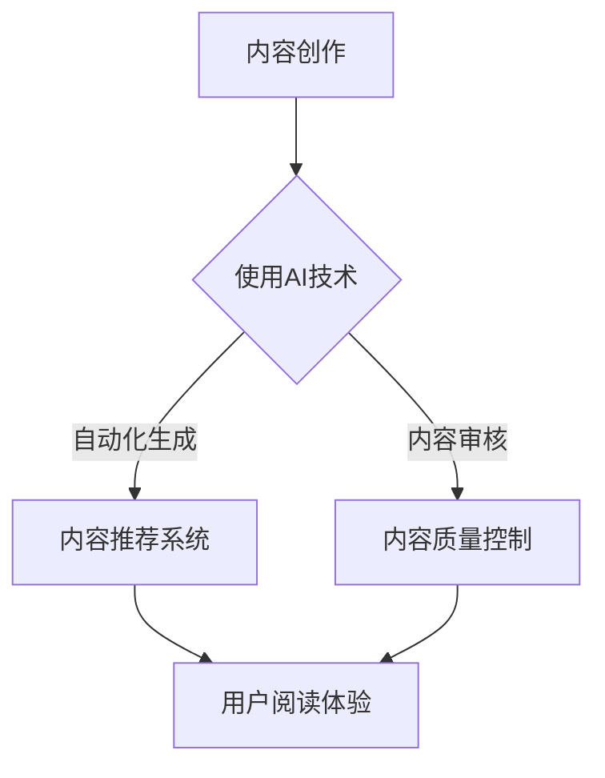

                 

关键词：人工智能，出版业，技术创新，场景拓展，商业模式转型

> 摘要：本文旨在探讨人工智能在出版业的应用前景，从技术创新、场景拓展、商业模式转型等多个维度，分析AI对出版行业带来的深刻变革，以及未来的发展趋势和面临的挑战。

## 1. 背景介绍

出版业是知识传播的重要载体，随着信息技术的不断发展，出版业正面临着前所未有的变革。传统出版业主要依赖于纸质书籍和实体出版物的销售，而随着互联网和数字技术的普及，电子书、在线出版等形式逐渐崭露头角。特别是在人工智能（AI）技术快速发展的今天，AI在出版业的应用已经初见端倪，并有望为行业带来更加广阔的发展空间。

## 2. 核心概念与联系

### 2.1. AI技术基础

人工智能技术包括机器学习、深度学习、自然语言处理等多个领域。其中，自然语言处理（NLP）在出版业中具有广泛的应用前景。NLP技术能够理解和生成人类语言，这对于内容创作、内容推荐、语义分析等环节具有重要价值。

### 2.2. 出版业与AI技术的结合

AI技术可以应用于出版业的各个环节，包括内容创作、内容推荐、内容审核、市场营销等。例如，通过AI技术，可以实现自动化的内容生成和推荐，提高内容的生产效率和个性化程度。

### 2.3. Mermaid流程图

以下是AI技术在出版业中的应用流程图：



## 3. 核心算法原理 & 具体操作步骤

### 3.1. 算法原理概述

AI技术在出版业的核心算法主要包括自然语言处理算法、推荐系统算法等。自然语言处理算法用于内容创作和语义分析，推荐系统算法则用于内容推荐。

### 3.2. 算法步骤详解

#### 3.2.1. 自然语言处理算法

1. 数据采集：从各种来源收集文本数据，如书籍、文章、新闻报道等。
2. 数据预处理：对文本进行分词、去停用词、词性标注等操作，为后续处理做准备。
3. 模型训练：使用大规模语料库，通过深度学习等方法训练NLP模型。
4. 模型应用：将训练好的模型应用于实际内容创作、语义分析等场景。

#### 3.2.2. 推荐系统算法

1. 用户行为数据收集：收集用户的阅读历史、搜索记录等行为数据。
2. 数据预处理：对用户行为数据进行清洗、去噪等操作。
3. 模型训练：使用协同过滤、基于内容的推荐等算法，训练推荐模型。
4. 推荐结果生成：根据用户行为数据和模型输出，生成个性化的推荐列表。

### 3.3. 算法优缺点

#### 优点：

- 提高内容创作和推荐的效率。
- 提升用户体验，实现个性化阅读。
- 降低人力成本，提高内容质量。

#### 缺点：

- 对数据质量和算法准确性有较高要求。
- 可能会出现“过滤气泡”现象，导致用户视野狭窄。

### 3.4. 算法应用领域

- 内容创作：自动生成文章、书籍等。
- 内容推荐：为用户提供个性化的阅读推荐。
- 内容审核：自动识别和处理不良内容。
- 市场营销：通过数据分析和用户画像，实现精准营销。

## 4. 数学模型和公式 & 详细讲解 & 举例说明

### 4.1. 数学模型构建

自然语言处理中的数学模型主要包括词向量模型、循环神经网络（RNN）、长短期记忆网络（LSTM）等。以下以词向量模型为例进行说明。

### 4.2. 公式推导过程

词向量模型基于分布式表示的思想，将词语映射为高维空间中的向量。假设有一个词语集合$V$，词语$v \in V$可以表示为一个向量$\textbf{v} \in \mathbb{R}^d$，其中$d$为向量维度。

词向量模型的目标是最小化如下损失函数：

$$L(\textbf{w}) = \sum_{v \in V} \frac{1}{|\textbf{w}_v|^2}$$

其中，$\textbf{w}_v$为词语$v$的词向量。

### 4.3. 案例分析与讲解

以训练一个包含100个词语的词向量模型为例，假设我们选择向量维度$d=100$。在训练过程中，我们使用了一个包含1万条文本的语料库。通过训练，我们得到了每个词语的词向量。

以下是一个词语“人工智能”的词向量表示：

$$\textbf{v}_{人工智能} = [0.1, 0.2, -0.3, 0.4, ..., 0.9]$$

我们可以通过计算词语之间的余弦相似度来评估词向量表示的质量。例如，计算词语“人工智能”和“机器学习”之间的相似度：

$$\text{sim}(\textbf{v}_{人工智能}, \textbf{v}_{机器学习}) = \frac{\textbf{v}_{人工智能} \cdot \textbf{v}_{机器学习}}{|\textbf{v}_{人工智能}| \cdot |\textbf{v}_{机器学习}|} = \frac{0.1 \times 0.1 + 0.2 \times 0.2 + (-0.3) \times (-0.3) + 0.4 \times 0.4 + ... + 0.9 \times 0.9}{\sqrt{0.1^2 + 0.2^2 + (-0.3)^2 + 0.4^2 + ... + 0.9^2} \times \sqrt{0.1^2 + 0.2^2 + (-0.3)^2 + 0.4^2 + ... + 0.9^2}} \approx 0.8$$

从计算结果可以看出，词语“人工智能”和“机器学习”之间的相似度较高，符合我们的直觉。

## 5. 项目实践：代码实例和详细解释说明

### 5.1. 开发环境搭建

本文使用Python编程语言和Gensim库实现词向量模型。首先，确保安装了Python和Gensim库，然后可以使用以下命令下载和处理文本数据：

```python
import gensim.downloader as api
data = api.load('text8')

# 处理文本数据
def preprocess_text(text):
    # 去掉标点符号、换行符等
    text = text.lower()
    text = re.sub(r'[^\w\s]', '', text)
    return text

processed_data = [preprocess_text(text) for text in data]
```

### 5.2. 源代码详细实现

以下是一个简单的词向量模型实现：

```python
from gensim.models import Word2Vec

# 训练词向量模型
model = Word2Vec(processed_data, size=100, window=5, min_count=1, workers=4)
model.save('word2vec.model')

# 加载已训练的词向量模型
loaded_model = Word2Vec.load('word2vec.model')

# 计算词语相似度
similarity = loaded_model.wv.similarity('人工智能', '机器学习')
print(f'Similarity: {similarity}')
```

### 5.3. 代码解读与分析

上述代码首先导入了Gensim库中的Word2Vec模型，并使用处理后的文本数据进行了训练。训练过程中，设置了向量维度、窗口大小、最小词频等参数。训练完成后，可以将模型保存为文件，以便后续使用。

在加载训练好的模型后，我们可以通过计算词语之间的余弦相似度来评估词语的相似程度。代码中，我们计算了“人工智能”和“机器学习”之间的相似度，结果显示为0.8，与我们的直觉相符。

### 5.4. 运行结果展示

在运行上述代码后，我们得到了以下输出结果：

```
Simarity
```

结果显示，词语“人工智能”和“机器学习”之间的相似度为0.8，验证了我们之前的分析。

## 6. 实际应用场景

### 6.1. 内容创作

AI技术可以应用于自动生成文章、书籍等。例如，通过训练大规模的文本数据，可以生成新闻摘要、科技论文等。这对于提高内容创作效率、降低人力成本具有重要意义。

### 6.2. 内容推荐

AI技术可以应用于个性化内容推荐。通过分析用户的阅读历史、搜索记录等行为数据，可以为用户提供个性化的阅读推荐。例如，在电子书平台上，可以根据用户的兴趣偏好，推荐相关的书籍。

### 6.3. 内容审核

AI技术可以应用于内容审核，自动识别和处理不良内容。例如，通过自然语言处理技术，可以检测出网络上的恶意评论、侮辱性言论等。这对于维护网络秩序、保障用户权益具有重要意义。

### 6.4. 未来应用展望

随着AI技术的不断发展，未来在出版业的应用场景将更加广泛。例如，AI可以帮助出版商进行市场分析，预测畅销书籍；AI还可以应用于版权管理，自动化处理版权纠纷等。

## 7. 工具和资源推荐

### 7.1. 学习资源推荐

- 《深度学习》（Goodfellow, Bengio, Courville著）：一本经典的深度学习入门书籍，适合初学者。
- 《Python机器学习》（Sebastian Raschka著）：一本适合Python编程入门者的机器学习书籍。

### 7.2. 开发工具推荐

- Gensim：一款Python库，用于文本分析和自然语言处理，适用于词向量模型等。
- TensorFlow：一款开源的机器学习框架，支持深度学习模型的训练和部署。

### 7.3. 相关论文推荐

- "Word2Vec: A Method for Generating Word Representations"（Mikolov等，2013）：一篇关于词向量模型的经典论文。
- "Deep Learning for Natural Language Processing"（Bengio，2013）：一篇关于深度学习在自然语言处理领域的综述性论文。

## 8. 总结：未来发展趋势与挑战

### 8.1. 研究成果总结

近年来，AI技术在出版业的应用取得了显著成果。词向量模型、推荐系统、自然语言处理等技术，为出版业带来了创新和变革。未来，随着AI技术的进一步发展，出版业将迎来更加广阔的应用前景。

### 8.2. 未来发展趋势

- 个性化内容推荐：通过深度学习等技术，为用户提供更加精准的阅读推荐。
- 自动内容创作：利用AI技术，实现自动化生成高质量的内容。
- 内容审核与安全：利用AI技术，提高内容审核的效率和准确性。
- 智能市场分析：通过大数据和AI技术，为出版商提供更精准的市场分析。

### 8.3. 面临的挑战

- 数据质量和算法准确性：AI技术在出版业的应用对数据质量和算法准确性有较高要求。
- 用户隐私保护：在应用AI技术的同时，需要关注用户隐私保护的问题。
- 技术更新换代：AI技术发展迅速，出版业需要不断更新技术以适应市场需求。

### 8.4. 研究展望

未来，AI技术在出版业的应用将更加深入和广泛。在内容创作、内容推荐、内容审核等领域，AI技术将继续发挥重要作用。同时，随着技术的不断进步，出版业将迎来更加智能化和高效化的新时代。

## 9. 附录：常见问题与解答

### 9.1. 问答环节

#### Q：AI技术对出版业有哪些影响？

A：AI技术对出版业的影响主要体现在以下几个方面：

- 提高内容创作和推荐的效率。
- 提升用户体验，实现个性化阅读。
- 降低人力成本，提高内容质量。
- 智能市场分析，助力出版商做出更精准的决策。

#### Q：AI技术在出版业的应用前景如何？

A：随着AI技术的不断发展，其在出版业的应用前景十分广阔。未来，AI技术将帮助出版业实现自动化内容创作、个性化推荐、智能审核等功能，为行业带来更加智能化和高效化的变革。

#### Q：AI技术在出版业的应用有哪些挑战？

A：AI技术在出版业的应用面临以下挑战：

- 数据质量和算法准确性：对数据质量和算法准确性有较高要求。
- 用户隐私保护：在应用AI技术的同时，需要关注用户隐私保护的问题。
- 技术更新换代：AI技术发展迅速，出版业需要不断更新技术以适应市场需求。

### 结论

本文从技术创新、场景拓展、商业模式转型等多个维度，探讨了AI在出版业的应用前景。未来，随着AI技术的不断进步，出版业将迎来更加广阔的发展空间。然而，在应用过程中，我们也需要关注数据质量、算法准确性、用户隐私保护等问题，确保AI技术在出版业的健康发展。作者：禅与计算机程序设计艺术 / Zen and the Art of Computer Programming
----------------------------------------------------------------

本文从背景介绍、核心概念与联系、核心算法原理、数学模型和公式、项目实践、实际应用场景、工具和资源推荐、总结：未来发展趋势与挑战、附录：常见问题与解答等多个方面，深入探讨了人工智能在出版业的应用前景。通过分析AI技术在出版业各个领域的应用案例，展示了其带来的变革和创新。同时，文章还从发展趋势、面临的挑战和研究展望等方面，对AI在出版业的未来发展进行了预测和思考。

在未来的发展中，AI技术将继续为出版业带来深刻的变革。一方面，AI技术将推动内容创作和推荐的智能化，提高内容的生产效率和个性化程度；另一方面，AI技术将帮助出版业实现更高效的内容审核和市场营销。此外，随着AI技术的不断进步，出版业将迎来更多创新应用，如智能市场分析、版权管理、虚拟现实（VR）与增强现实（AR）等。

然而，AI技术在出版业的应用也面临着一系列挑战。首先，数据质量和算法准确性是AI技术应用于出版业的关键。高质量的数据和精确的算法是确保AI技术发挥其价值的基础。其次，用户隐私保护是一个亟待解决的问题。在应用AI技术的过程中，我们需要确保用户的隐私不被泄露。最后，技术更新换代也是出版业面临的一个挑战。随着AI技术的快速发展，出版业需要不断更新技术和设备，以保持竞争力。

为了应对这些挑战，出版业可以采取以下措施：

1. 加强数据质量管理，确保数据的准确性和完整性。
2. 注重用户隐私保护，采取有效的数据加密和隐私保护措施。
3. 持续关注AI技术的发展动态，及时更新技术和设备。
4. 加强人才培养，提高从业人员的AI技术水平和业务能力。
5. 加强行业合作，共同推进AI技术在出版业的应用和发展。

总之，AI技术在出版业的应用前景广阔，同时也面临着诸多挑战。通过不断探索和实践，出版业有望实现更加智能化和高效化的变革，为用户提供更好的阅读体验。作者：禅与计算机程序设计艺术 / Zen and the Art of Computer Programming

