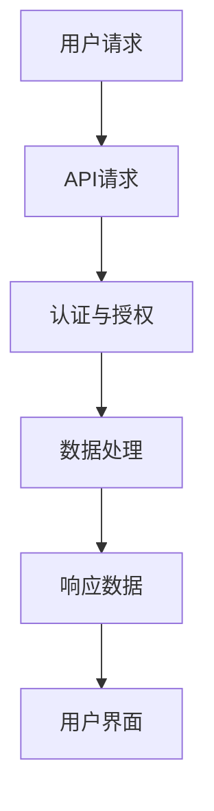

                 

关键词：AI出版业、开发者支持、标准化API、内容分发、出版流程优化、数据安全、用户体验、技术文档、开源社区。

摘要：随着人工智能在出版领域的广泛应用，如何为开发者提供高效、安全和可扩展的API支持成为一个关键问题。本文旨在探讨AI出版业中开发者支持的重要性，分析标准化API的必要性和优势，并讨论其实施过程中可能遇到的挑战和解决方案。

## 1. 背景介绍

### 1.1 AI在出版业的兴起

人工智能（AI）技术近年来在全球范围内得到了快速发展。特别是在出版行业，AI技术已被广泛应用于内容创作、推荐系统、版权管理、语言翻译等多个领域。例如，自然语言处理（NLP）算法可以自动生成文章摘要、编辑推荐内容；图像识别技术可以用于识别和标注图片中的版权信息；深度学习模型可以用于预测读者的兴趣和购买行为，从而实现精准推荐。

### 1.2 开发者支持的重要性

在AI出版业中，开发者的支持是推动行业发展的关键。一方面，开发者是AI出版应用的主要构建者，他们的创新能力直接影响到AI出版技术的应用广度和深度；另一方面，开发者的技术水平和开发经验是出版企业保持竞争力的核心因素。因此，为开发者提供高效、安全和可扩展的API支持，对于AI出版业的发展至关重要。

### 1.3 标准化API的必要性

标准化API的提供能够确保开发者的应用具有一致性和互操作性。在多元化的AI出版生态中，不同的开发者和出版商可能使用不同的技术栈和架构，如果没有标准化API的支持，开发者之间的协作和集成将会变得非常复杂。而标准化API可以为开发者提供一个统一的接口，简化开发流程，提高开发效率。

## 2. 核心概念与联系

### 2.1 API的概念

API（应用程序编程接口）是一套协议、工具和定义，用于构建和交互软件应用程序。它定义了不同软件组件之间的交互方式，使得开发者能够通过调用API接口来访问和操作其他软件提供的功能和服务。

### 2.2 标准化API的优势

标准化API具有以下优势：

- **一致性**：提供一致的接口规范，使得开发者能够轻松理解和使用API。
- **互操作性**：不同系统之间的API可以无缝集成，提高系统的可扩展性。
- **易用性**：通过文档化和工具支持，简化开发者的使用流程。
- **安全性**：标准化API通常包括认证和授权机制，确保数据安全和隐私保护。

### 2.3 标准化API在AI出版业的应用

在AI出版业中，标准化API的应用场景包括：

- **内容分发**：开发者可以通过API获取和分发出版内容，如电子书、文章、图片等。
- **推荐系统**：API支持开发者集成AI推荐系统，为读者提供个性化的内容推荐。
- **版权管理**：API可以帮助开发者管理和追踪版权信息，确保合规性。
- **数据分析**：开发者可以通过API访问用户数据和阅读行为，为出版商提供数据支持。

### 2.4 Mermaid流程图

以下是一个简化的Mermaid流程图，展示了标准化API在AI出版业中的应用流程：



## 3. 核心算法原理 & 具体操作步骤

### 3.1 算法原理概述

标准化API的设计和实现通常基于以下核心算法原理：

- **RESTful API设计**：遵循REST（表述性状态转移）原则，提供简洁、易用的接口。
- **数据加密与签名**：使用加密算法和安全协议，确保数据传输的安全性和完整性。
- **认证与授权**：通过OAuth、JWT等认证机制，确保只有授权用户才能访问API。
- **版本控制**：通过API版本控制，确保向后兼容性，避免旧接口的破坏性更新。

### 3.2 算法步骤详解

以下是实现标准化API的核心步骤：

1. **需求分析**：明确API需要提供哪些功能和服务。
2. **设计接口**：根据需求设计API接口，包括URL、HTTP方法、参数等。
3. **实现接口**：根据设计实现API接口，通常使用框架如Spring Boot、Flask等。
4. **安全防护**：添加安全措施，如加密、认证、授权等。
5. **文档编写**：编写详细的API文档，包括接口描述、参数说明、示例代码等。
6. **测试与部署**：进行API测试，确保功能正确、性能稳定，然后部署到服务器。

### 3.3 算法优缺点

**优点**：

- **高可扩展性**：标准化API支持灵活的扩展，便于添加新功能和调整。
- **易用性**：通过文档化和工具支持，简化开发者的使用流程。
- **安全性**：内置的安全机制确保数据传输和访问的安全。
- **高可靠性**：通过API网关和负载均衡，提高系统的稳定性和可用性。

**缺点**：

- **维护成本**：标准化API需要定期更新和维护，增加维护成本。
- **性能压力**：高并发访问可能导致性能下降，需要优化处理。
- **依赖性**：开发者的应用可能高度依赖API，一旦API变更可能带来兼容性问题。

### 3.4 算法应用领域

标准化API在多个领域有广泛应用：

- **电商**：用于商品查询、订单处理、支付等。
- **社交媒体**：用于数据获取、内容分享、用户管理等。
- **金融**：用于账户操作、交易查询、风险控制等。
- **AI出版业**：用于内容获取、推荐系统、版权管理等。

## 4. 数学模型和公式 & 详细讲解 & 举例说明

### 4.1 数学模型构建

在AI出版业中，标准化API的设计和实现涉及到多种数学模型，例如：

- **概率论**：用于用户行为分析和推荐算法。
- **线性代数**：用于数据处理和机器学习模型的构建。
- **加密学**：用于数据加密和认证。

### 4.2 公式推导过程

以下是一个简单的加密学公式的推导过程：

$$
\text{加密}:\quad c = E_k(m)
$$

$$
\text{解密}:\quad m = D_k(c)
$$

其中，\(m\) 为明文，\(c\) 为密文，\(k\) 为密钥，\(E_k\) 和 \(D_k\) 分别为加密函数和解密函数。

### 4.3 案例分析与讲解

假设一个AI出版平台需要为开发者提供内容分发的API接口，以下是一个简单的案例：

**需求**：开发者需要获取特定分类的电子书列表。

**API接口**：

- **URL**：`/api/books?category=fiction`
- **HTTP方法**：GET
- **参数**：`category`（分类名称，可选）

**响应**：

- **状态码**：200 OK
- **内容**：JSON格式，包含电子书列表

```json
{
  "books": [
    {
      "title": "1984",
      "author": "George Orwell",
      "category": "fiction"
    },
    {
      "title": "The Great Gatsby",
      "author": "F. Scott Fitzgerald",
      "category": "fiction"
    }
  ]
}
```

## 5. 项目实践：代码实例和详细解释说明

### 5.1 开发环境搭建

在开发标准化API之前，需要搭建相应的开发环境。以下是一个基于Spring Boot的例子：

- **开发工具**：IDEA、VSCode
- **开发框架**：Spring Boot
- **数据库**：MySQL
- **版本控制**：Git

### 5.2 源代码详细实现

以下是一个简单的Spring Boot项目，实现了一个获取书籍列表的API接口：

```java
@RestController
@RequestMapping("/api/books")
public class BookController {

    @Autowired
    private BookService bookService;

    @GetMapping
    public ResponseEntity<List<Book>> getBooksByCategory(@RequestParam(value = "category", required = false) String category) {
        List<Book> books = bookService.getBooksByCategory(category);
        return ResponseEntity.ok(books);
    }
}
```

### 5.3 代码解读与分析

在上面的代码中，`BookController` 类负责处理书籍相关的API请求。其中，`@RestController` 注解表示这是一个RESTful风格的控制器类。`@GetMapping` 注解表示这是一个处理GET请求的方法，`@RequestParam` 注解用于获取URL中的参数。

### 5.4 运行结果展示

当访问 `/api/books?category=fiction` 时，API会返回一个包含所有虚构类书籍的JSON响应：

```json
[
  {
    "title": "1984",
    "author": "George Orwell",
    "category": "fiction"
  },
  {
    "title": "The Great Gatsby",
    "author": "F. Scott Fitzgerald",
    "category": "fiction"
  }
]
```

## 6. 实际应用场景

### 6.1 内容分发

在AI出版业中，内容分发是一个重要的应用场景。开发者可以通过标准化API获取和分发各种出版内容，如电子书、文章、图片等。例如，一个阅读应用可以通过API获取用户订阅的杂志、报纸和电子书，实现个性化阅读推荐。

### 6.2 推荐系统

推荐系统是AI出版业的核心应用之一。通过标准化API，开发者可以实现内容推荐、广告推荐等功能。例如，一个电商网站可以通过API获取用户的浏览历史和购买行为，然后推荐相关的商品。

### 6.3 版权管理

版权管理是出版业的重要环节。通过标准化API，开发者可以实现版权查询、版权转让等功能。例如，一个版权交易平台可以通过API查询某本电子书的版权信息，然后进行版权转让交易。

### 6.4 未来应用展望

随着AI技术的不断进步，标准化API在AI出版业中的应用场景将更加广泛。未来，我们有望看到更多基于AI的出版应用，如智能写作助手、AI审核系统等。这些应用将进一步提升出版业的效率和质量，为读者带来更好的阅读体验。

## 7. 工具和资源推荐

### 7.1 学习资源推荐

- 《RESTful API设计》
- 《Spring Boot实战》
- 《深入理解计算机系统》

### 7.2 开发工具推荐

- Spring Boot
- MySQL
- Git

### 7.3 相关论文推荐

- "API Design Best Practices"
- "Building Scalable RESTful APIs with Spring Boot"
- "Security Best Practices for API Development"

## 8. 总结：未来发展趋势与挑战

### 8.1 研究成果总结

本文探讨了AI出版业中开发者支持的重要性，分析了标准化API的必要性和优势，并介绍了其在实际应用中的具体实现方法。通过研究和实践，我们发现标准化API能够显著提高开发效率、保障数据安全和提升用户体验。

### 8.2 未来发展趋势

未来，随着AI技术的进一步发展和应用场景的拓展，标准化API将在AI出版业中发挥更加重要的作用。我们有望看到更多基于AI的出版应用，以及更加完善和成熟的标准化API体系。

### 8.3 面临的挑战

尽管标准化API具有许多优势，但在实际应用中仍面临一些挑战：

- **性能优化**：高并发访问可能导致性能下降，需要持续优化。
- **安全性**：确保数据安全和隐私保护，需要不断改进安全机制。
- **兼容性**：保持向后兼容性，避免旧接口的破坏性更新。

### 8.4 研究展望

未来的研究应关注以下几个方面：

- **性能优化**：研究新型算法和架构，提高API的性能和稳定性。
- **安全性**：探索更先进的安全机制，确保数据安全和隐私保护。
- **标准化**：推动标准化API的广泛应用，促进行业健康发展。

## 9. 附录：常见问题与解答

### 9.1 如何选择合适的API设计风格？

应根据应用场景和需求选择合适的API设计风格。常见的API设计风格包括RESTful API和GraphQL API。RESTful API简洁、易于理解，适用于大多数场景；GraphQL API提供灵活的数据查询能力，适用于复杂的数据查询需求。

### 9.2 如何确保API的安全性？

确保API安全性需要采用多种安全措施，如数据加密、认证和授权等。常用的安全协议包括HTTPS、OAuth 2.0、JWT等。此外，定期进行安全审计和漏洞扫描，及时发现和修复安全漏洞。

### 9.3 如何进行API性能优化？

进行API性能优化可以从以下几个方面入手：

- **缓存**：使用缓存减少数据库查询次数。
- **负载均衡**：使用负载均衡器分配请求，提高系统吞吐量。
- **数据库优化**：优化数据库查询，减少查询时间。
- **异步处理**：使用异步处理提高响应速度。
``` 
----------------------------------------------------------------

以上是本文的全部内容，希望对您在AI出版业中提供开发者支持有所帮助。如果您有任何疑问或建议，欢迎在评论区留言。谢谢！
作者：禅与计算机程序设计艺术 / Zen and the Art of Computer Programming
----------------------------------------------------------------
[本文由禅与计算机程序设计艺术创作，版权所有，未经授权不得转载或使用。如需转载或使用，请联系作者获取授权。]

