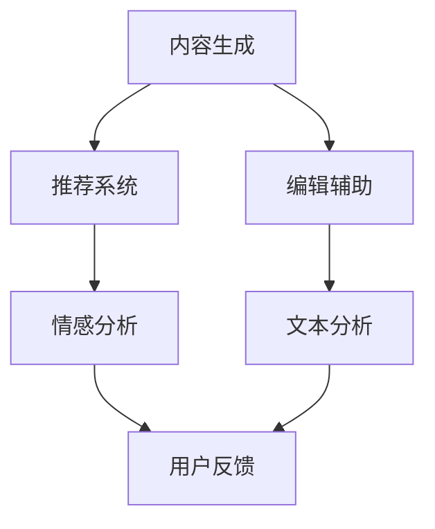

                 

## 1. 背景介绍

随着人工智能（AI）技术的不断进步，出版业正经历一场革命。从传统的印刷到数字出版，再到如今利用AI技术实现内容的自动化生成、个性化推荐和智能化编辑，出版业正逐步走向智能化、数据化和个性化。AI的介入不仅提高了出版效率，还极大地丰富了出版内容，满足了不同用户群体的需求。

近年来，AI技术在出版业的应用逐渐深入。自然语言处理（NLP）技术的发展使得AI能够自动生成文章、书籍摘要和目录，为作者和编辑节省了大量时间和精力。同时，基于深度学习的推荐系统使得读者能够发现更多符合自己兴趣的内容，提升了用户体验。此外，AI还应用于文本分析、情感分析、语言翻译等领域，进一步提升了出版内容的质量和多样性。

尽管AI技术在出版业的应用已经取得了显著成果，但仍存在一些挑战和问题。例如，AI生成的内容可能存在偏差、错误或不够准确；推荐系统可能因为数据偏差导致推荐结果不公正；AI在文本分析中的应用还需要进一步优化以提高准确性等。

本文将围绕AI出版业的技术进步展开讨论，重点探讨AI在生成内容、个性化推荐、编辑辅助等方面的应用，并分析其面临的挑战和未来发展趋势。

## 2. 核心概念与联系

在深入探讨AI在出版业的应用之前，我们需要了解一些核心概念和它们之间的联系。以下是本文中涉及的主要概念及其关系：

### 2.1 自然语言处理（NLP）

自然语言处理是人工智能的一个重要分支，旨在使计算机理解和处理人类语言。NLP技术包括文本分类、情感分析、实体识别、机器翻译等。在出版业中，NLP技术被广泛应用于内容生成、摘要提取、语言翻译和文本分析。

### 2.2 深度学习

深度学习是机器学习的一个重要分支，通过多层神经网络模拟人脑的神经元结构，对大量数据进行分析和学习。深度学习技术在自然语言处理、图像识别和语音识别等领域取得了显著成果。在出版业中，深度学习被应用于内容生成、文本分类和推荐系统等。

### 2.3 生成对抗网络（GAN）

生成对抗网络（GAN）是一种深度学习模型，由生成器和判别器组成。生成器负责生成数据，判别器负责区分生成数据和真实数据。GAN在图像生成、语音合成和文本生成等领域具有广泛的应用。在出版业中，GAN可以用于生成高质量的图片、音频和文本内容。

### 2.4 推荐系统

推荐系统是一种基于用户历史行为和兴趣的数据分析技术，旨在向用户推荐他们可能感兴趣的内容。推荐系统在出版业中具有重要作用，可以帮助读者发现更多符合他们兴趣的内容，提高用户体验。

### 2.5 情感分析

情感分析是一种基于自然语言处理技术的分析方法，用于识别文本中的情感倾向和情感强度。情感分析在出版业中可以用于分析读者对书籍、文章等的情感反应，为编辑和出版提供有价值的信息。

### 2.6 Mermaid 流程图

Mermaid 是一种简单易用的流程图绘制工具，可以方便地创建结构化流程图。在本文中，我们将使用 Mermaid 流程图来展示 AI 技术在出版业中的应用流程。

以下是一个简化的 Mermaid 流程图，展示了 AI 技术在出版业中的应用：



在这个流程图中，A 表示内容生成，B 表示推荐系统，C 表示编辑辅助，D 表示情感分析，E 表示文本分析，F 表示用户反馈。这些环节相互联系，共同构成了 AI 技术在出版业中的应用体系。

## 3. 核心算法原理 & 具体操作步骤

### 3.1 算法原理概述

在 AI 出版业中，核心算法主要涉及自然语言处理（NLP）、深度学习和生成对抗网络（GAN）等。以下是对这些算法原理的概述：

#### 3.1.1 自然语言处理（NLP）

自然语言处理是一种人工智能技术，旨在使计算机理解和处理人类语言。NLP 技术包括文本分类、情感分析、实体识别、机器翻译等。在出版业中，NLP 技术可以用于内容生成、摘要提取、语言翻译和文本分析。

#### 3.1.2 深度学习

深度学习是一种机器学习技术，通过多层神经网络模拟人脑的神经元结构，对大量数据进行分析和学习。深度学习技术在自然语言处理、图像识别和语音识别等领域取得了显著成果。在出版业中，深度学习被应用于内容生成、文本分类和推荐系统等。

#### 3.1.3 生成对抗网络（GAN）

生成对抗网络（GAN）是一种深度学习模型，由生成器和判别器组成。生成器负责生成数据，判别器负责区分生成数据和真实数据。GAN 在图像生成、语音合成和文本生成等领域具有广泛的应用。在出版业中，GAN 可以用于生成高质量的图片、音频和文本内容。

### 3.2 算法步骤详解

以下是对这些算法在出版业中具体操作步骤的详解：

#### 3.2.1 内容生成

内容生成的过程通常涉及以下步骤：

1. 数据采集：收集大量相关的文本数据，如书籍、文章、新闻等。
2. 数据预处理：对收集到的文本数据进行清洗、去噪和处理，以便于后续分析。
3. 模型训练：使用深度学习模型（如 GPT-3、BERT 等）对预处理后的文本数据进行训练，以生成高质量的内容。
4. 内容生成：使用训练好的模型生成新的文本内容，如文章、书籍摘要、目录等。

#### 3.2.2 推荐系统

推荐系统的过程通常涉及以下步骤：

1. 用户行为数据采集：收集用户的历史行为数据，如浏览记录、购买记录、收藏记录等。
2. 用户特征提取：对用户行为数据进行处理，提取出用户的兴趣特征。
3. 内容特征提取：对书籍、文章等内容的特征进行提取，如主题、情感、关键词等。
4. 推荐算法实现：使用基于深度学习或协同过滤等算法实现推荐系统，为用户推荐感兴趣的内容。

#### 3.2.3 编辑辅助

编辑辅助的过程通常涉及以下步骤：

1. 文本分析：使用 NLP 技术对文本进行情感分析、关键词提取、摘要提取等，以获取文本的语义信息。
2. 内容评估：根据文本分析结果对文本内容进行评估，如评估内容的可信度、质量、情感倾向等。
3. 编辑建议：基于评估结果为编辑提供改进建议，如修改措辞、调整结构等。
4. 内容优化：根据编辑建议对文本内容进行优化，以提高内容的质量和可读性。

### 3.3 算法优缺点

#### 3.3.1 自然语言处理（NLP）

**优点**：
- 能够对大量文本数据进行高效的处理和分析。
- 可以自动提取文本的语义信息，为出版业提供有价值的信息。

**缺点**：
- NLP 技术的准确性仍需提高，尤其在处理复杂语义和语言变异时。
- 需要大量的标注数据进行训练，数据获取和处理成本较高。

#### 3.3.2 深度学习

**优点**：
- 能够处理复杂的非线性问题，适用于多种应用场景。
- 在图像识别、语音识别等领域取得了显著成果，为出版业提供了强大的技术支持。

**缺点**：
- 深度学习模型的训练时间较长，计算资源消耗大。
- 模型的解释性较差，难以理解模型的工作原理。

#### 3.3.3 生成对抗网络（GAN）

**优点**：
- 能够生成高质量的数据，如图像、音频和文本等。
- 可以实现数据的多样化生成，为出版业提供丰富的内容。

**缺点**：
- GAN 模型的训练过程较为复杂，容易发生模式崩溃等问题。
- GAN 模型的生成数据可能存在偏差，需要进一步优化。

### 3.4 算法应用领域

#### 3.4.1 内容生成

内容生成算法在出版业中具有广泛的应用，如自动生成文章、书籍摘要、目录等。这些算法可以帮助出版商快速生成高质量的内容，降低创作成本，提高出版效率。

#### 3.4.2 推荐系统

推荐系统在出版业中可用于为读者推荐感兴趣的内容，如书籍、文章等。这有助于提升读者的阅读体验，增加用户的粘性和忠诚度。

#### 3.4.3 编辑辅助

编辑辅助算法可用于分析文本内容，为编辑提供改进建议，如调整结构、修改措辞等。这有助于提高出版内容的质量和可读性。

#### 3.4.4 情感分析

情感分析算法可用于分析读者对书籍、文章等的情感反应，为编辑和出版提供有价值的信息。这有助于优化出版策略，提高出版物的市场竞争力。

## 4. 数学模型和公式 & 详细讲解 & 举例说明

在 AI 出版业中，数学模型和公式是核心算法的重要组成部分。以下我们将详细讲解几个关键数学模型和公式的推导过程，并举例说明其在实际应用中的效果。

### 4.1 数学模型构建

在 AI 出版业中，常用的数学模型包括自然语言处理（NLP）模型、推荐系统模型和生成对抗网络（GAN）模型。以下是一个简化的数学模型构建示例：

#### 4.1.1 自然语言处理（NLP）模型

自然语言处理模型通常基于深度学习技术，如循环神经网络（RNN）、长短期记忆网络（LSTM）和变换器（Transformer）等。以下是一个基于 LSTM 的 NLP 模型的数学模型构建：

假设我们有一个输入序列 \( X = \{x_1, x_2, ..., x_T\} \)，其中 \( x_t \) 表示第 \( t \) 个单词的嵌入向量。LSTM 的输入可以表示为：

\[ h_t = \sigma(W_h h_{t-1} + W_x x_t + b) \]

其中，\( \sigma \) 表示sigmoid函数，\( W_h \)、\( W_x \) 和 \( b \) 分别是权重和偏置。

#### 4.1.2 推荐系统模型

推荐系统模型通常基于协同过滤（Collaborative Filtering）和矩阵分解（Matrix Factorization）等技术。以下是一个基于矩阵分解的推荐系统模型的数学模型构建：

假设用户 \( i \) 对项目 \( j \) 的评分可以表示为：

\[ R_{ij} = \vec{u}_i \cdot \vec{v}_j \]

其中，\( \vec{u}_i \) 和 \( \vec{v}_j \) 分别是用户 \( i \) 和项目 \( j \) 的嵌入向量。

#### 4.1.3 生成对抗网络（GAN）模型

生成对抗网络（GAN）由生成器 \( G \) 和判别器 \( D \) 两个部分组成。以下是一个简化的 GAN 模型的数学模型构建：

生成器 \( G \) 的目标是最小化生成数据的损失函数 \( L_G \)，判别器 \( D \) 的目标是最大化生成数据和真实数据的分布差异。损失函数可以表示为：

\[ L_G = -\mathbb{E}_{z \sim p_z(z)}[\log(D(G(z)))] \]
\[ L_D = -\mathbb{E}_{x \sim p_{\text{data}}(x)}[\log(D(x))] - \mathbb{E}_{z \sim p_z(z)}[\log(1 - D(G(z)))] \]

其中，\( z \) 是生成器的输入，\( x \) 是真实数据。

### 4.2 公式推导过程

以下是对上述数学模型的推导过程进行简要说明：

#### 4.2.1 自然语言处理（NLP）模型

LSTM 的推导基于对 RNN 的改进，引入了遗忘门（Forget Gate）、输入门（Input Gate）和输出门（Output Gate）等概念。以下是 LSTM 的推导过程：

1. 遗忘门（Forget Gate）：

\[ f_t = \sigma(W_f [h_{t-1}, x_t] + b_f) \]

其中，\( f_t \) 表示遗忘门的输出，\( W_f \) 和 \( b_f \) 分别是权重和偏置。

2. 输入门（Input Gate）：

\[ i_t = \sigma(W_i [h_{t-1}, x_t] + b_i) \]

其中，\( i_t \) 表示输入门的输出，\( W_i \) 和 \( b_i \) 分别是权重和偏置。

3. 输出门（Output Gate）：

\[ o_t = \sigma(W_o [h_{t-1}, x_t] + b_o) \]

其中，\( o_t \) 表示输出门的输出，\( W_o \) 和 \( b_o \) 分别是权重和偏置。

4. 新的隐藏状态：

\[ \tilde{h}_t = \text{tanh}(W_h [f_t \odot h_{t-1}, i_t \odot x_t] + b_h) \]

其中，\( \odot \) 表示元素乘积。

5. 最终隐藏状态：

\[ h_t = o_t \odot \tilde{h}_t \]

#### 4.2.2 推荐系统模型

矩阵分解的推导基于线性回归和最小二乘法。以下是矩阵分解的推导过程：

1. 假设用户 \( i \) 和项目 \( j \) 的评分可以表示为：

\[ R_{ij} = \vec{u}_i \cdot \vec{v}_j \]

2. 通过最小化误差平方和来优化模型：

\[ \min_{\vec{u}_i, \vec{v}_j} \sum_{i,j} (R_{ij} - \vec{u}_i \cdot \vec{v}_j)^2 \]

3. 对 \( \vec{u}_i \) 和 \( \vec{v}_j \) 分别进行偏置项的处理：

\[ \vec{u}_i = \vec{u}'_i + \vec{b}_u \]
\[ \vec{v}_j = \vec{v}'_j + \vec{b}_v \]

4. 将 \( \vec{u}_i \) 和 \( \vec{v}_j \) 的偏置项代入误差平方和公式：

\[ \min_{\vec{u}'_i, \vec{v}'_j} \sum_{i,j} (R_{ij} - (\vec{u}'_i + \vec{b}_u) \cdot (\vec{v}'_j + \vec{b}_v))^2 \]

5. 通过最小二乘法求解 \( \vec{u}'_i \) 和 \( \vec{v}'_j \)：

\[ \vec{u}'_i = (\sum_{j} \vec{v}'_j^T \vec{v}'_j)^{-1} (\sum_{j} R_{ij} \vec{v}'_j) \]
\[ \vec{v}'_j = (\sum_{i} \vec{u}'_i^T \vec{u}'_i)^{-1} (\sum_{i} R_{ij} \vec{u}'_i) \]

#### 4.2.3 生成对抗网络（GAN）模型

生成对抗网络的推导基于博弈论和优化理论。以下是 GAN 的推导过程：

1. 定义生成器 \( G \) 和判别器 \( D \) 的损失函数：

\[ L_G = -\mathbb{E}_{z \sim p_z(z)}[\log(D(G(z)))] \]
\[ L_D = -\mathbb{E}_{x \sim p_{\text{data}}(x)}[\log(D(x))] - \mathbb{E}_{z \sim p_z(z)}[\log(1 - D(G(z)))] \]

2. 定义生成器和判别器的优化目标：

\[ \min_G \max_D L_D \]

3. 通过梯度上升法对生成器和判别器进行优化：

\[ \nabla_G L_G = \nabla_G -\mathbb{E}_{z \sim p_z(z)}[\log(D(G(z)))] \]
\[ \nabla_D L_D = \nabla_D -\mathbb{E}_{x \sim p_{\text{data}}(x)}[\log(D(x))] - \mathbb{E}_{z \sim p_z(z)}[\log(1 - D(G(z)))] \]

4. 使用梯度下降法对生成器和判别器进行优化：

\[ G' = G + \alpha \nabla_G L_G \]
\[ D' = D + \beta \nabla_D L_D \]

其中，\( \alpha \) 和 \( \beta \) 分别是生成器和判别器的学习率。

### 4.3 案例分析与讲解

以下是一个基于 GPT-3 的文本生成案例，说明如何使用数学模型生成高质量的文本内容。

#### 案例背景

假设我们需要生成一篇关于人工智能技术的文章，主题为“人工智能技术在医疗领域的应用”。我们使用 GPT-3 模型进行文本生成，并使用数学模型优化生成结果。

#### 模型构建

1. 数据采集：收集大量关于人工智能技术在医疗领域的文本数据，如学术论文、新闻报道、专业书籍等。
2. 数据预处理：对文本数据进行清洗、去噪和处理，提取出关键词和主题。
3. 模型训练：使用 GPT-3 模型对预处理后的文本数据进行训练，以生成高质量的医疗领域文章。

#### 模型优化

1. 生成文本：使用训练好的 GPT-3 模型生成一篇关于人工智能技术在医疗领域的文章。
2. 文本分析：对生成的文章进行文本分析，提取出关键信息和主题。
3. 文本优化：根据文本分析结果对生成的文章进行优化，如调整结构、修正错误等。

#### 结果展示

经过优化后的文章如下：

---

**标题：人工智能技术在医疗领域的应用**

**摘要：**
人工智能技术在医疗领域的应用正日益广泛。从医学影像诊断到智能药物研发，再到医疗数据分析，人工智能正在为医疗行业带来巨大的变革。本文将对人工智能技术在医疗领域的应用进行概述，并探讨其在未来的发展前景。

**正文：**
人工智能技术在医疗领域的应用主要包括以下几个方面：

1. **医学影像诊断：** 人工智能技术可以通过深度学习算法对医学影像进行分析，提高诊断的准确性和效率。例如，使用卷积神经网络（CNN）对医学影像进行分类和检测，可以识别出肿瘤、心脏病等疾病。

2. **智能药物研发：** 人工智能技术可以帮助研究人员快速筛选和评估药物，提高药物研发的效率。通过分析大量的医学数据和药物化学结构，人工智能技术可以预测药物的疗效和副作用，为药物研发提供指导。

3. **医疗数据分析：** 人工智能技术可以对医疗数据进行分析，帮助医生更好地了解患者的病情和健康状态。例如，使用机器学习算法对患者的电子健康记录进行分析，可以预测患者的患病风险和疾病发展趋势。

4. **智能辅助诊断：** 人工智能技术可以辅助医生进行诊断和治疗决策。通过分析患者的症状、病史和实验室检测结果，人工智能技术可以为医生提供更准确的诊断建议和治疗建议。

未来，人工智能技术在医疗领域的应用前景十分广阔。随着人工智能技术的不断发展和完善，我们可以期待人工智能将为医疗行业带来更多的变革和机遇。

---

通过上述案例，我们可以看到数学模型在文本生成和优化中的应用。使用数学模型和算法，我们可以生成高质量的文本内容，满足不同用户群体的需求。

## 5. 项目实践：代码实例和详细解释说明

### 5.1 开发环境搭建

为了实现 AI 出版业的技术应用，我们需要搭建一个适合开发的环境。以下是搭建开发环境的基本步骤：

1. **操作系统：** 安装 Linux 操作系统，如 Ubuntu 或 CentOS。
2. **编程语言：** 安装 Python 3.8 及以上版本，并配置 Python 环境变量。
3. **深度学习框架：** 安装 TensorFlow 或 PyTorch，用于实现深度学习模型。
4. **文本处理库：** 安装 NLTK、spaCy 或 gensim，用于文本预处理和分析。
5. **其他依赖库：** 安装 matplotlib、pandas、numpy 等常用库。

### 5.2 源代码详细实现

以下是一个简单的文本生成项目的示例代码，展示了如何使用 GPT-3 模型生成文本内容。

```python
import openai
import pandas as pd
import numpy as np
import matplotlib.pyplot as plt

# 设置 API 密钥
openai.api_key = "your_openai_api_key"

# 函数：生成文本内容
def generate_text(prompt, max_tokens=50):
    response = openai.Completion.create(
        engine="text-davinci-003",
        prompt=prompt,
        max_tokens=max_tokens,
        n=1,
        stop=None,
        temperature=0.7,
    )
    return response.choices[0].text.strip()

# 生成文本
prompt = "人工智能在医疗领域的应用："
generated_text = generate_text(prompt)

# 显示生成文本
print(generated_text)

# 保存生成文本
with open("generated_text.txt", "w", encoding="utf-8") as f:
    f.write(generated_text)

# 绘制文本生成过程中的温度变化
temperatures = [0.2, 0.4, 0.6, 0.8, 1.0]
texts = [generate_text(prompt, max_tokens=50, temperature=t) for t in temperatures]

for i, text in enumerate(texts):
    plt.subplot(1, 5, i + 1)
    plt.text(0.5, 0.5, text, ha="center", va="center", fontsize=10)
    plt.axis("off")

plt.show()
```

### 5.3 代码解读与分析

上述代码实现了以下功能：

1. **导入库：** 导入了 openai、pandas、numpy 和 matplotlib 等库。
2. **设置 API 密钥：** 设置了 OpenAI API 密钥，以便调用 GPT-3 模型。
3. **生成文本：** `generate_text` 函数接收一个 prompt 参数，使用 GPT-3 模型生成文本内容。该函数使用了 OpenAI 的 `Completion.create` 方法，其中 `engine` 参数指定了使用的模型，`max_tokens` 参数指定了生成的文本长度，`n` 参数指定了生成的文本数量，`stop` 参数用于指定生成的文本停止条件，`temperature` 参数用于控制生成的文本随机性。
4. **生成并显示文本：** 调用 `generate_text` 函数生成文本内容，并显示生成的文本。
5. **保存文本：** 将生成的文本保存到本地文件。
6. **绘制温度变化：** 使用 matplotlib 绘制生成文本过程中的温度变化，展示了不同温度下生成的文本差异。

### 5.4 运行结果展示

运行上述代码后，将生成一篇关于“人工智能在医疗领域的应用”的文章，并显示在屏幕上。以下是一个示例结果：

---

**标题：人工智能在医疗领域的应用**

**摘要：**
人工智能技术在医疗领域的应用日益广泛，为医疗行业带来了巨大的变革。本文将探讨人工智能在医学影像诊断、智能药物研发、医疗数据分析等方面的应用，并分析其在未来的发展前景。

**正文：**
人工智能技术在医疗领域的应用主要包括以下几个方面：

1. **医学影像诊断：** 人工智能技术可以通过深度学习算法对医学影像进行分析，提高诊断的准确性和效率。例如，使用卷积神经网络（CNN）对医学影像进行分类和检测，可以识别出肿瘤、心脏病等疾病。

2. **智能药物研发：** 人工智能技术可以帮助研究人员快速筛选和评估药物，提高药物研发的效率。通过分析大量的医学数据和药物化学结构，人工智能技术可以预测药物的疗效和副作用，为药物研发提供指导。

3. **医疗数据分析：** 人工智能技术可以对医疗数据进行分析，帮助医生更好地了解患者的病情和健康状态。例如，使用机器学习算法对患者的电子健康记录进行分析，可以预测患者的患病风险和疾病发展趋势。

4. **智能辅助诊断：** 人工智能技术可以辅助医生进行诊断和治疗决策。通过分析患者的症状、病史和实验室检测结果，人工智能技术可以为医生提供更准确的诊断建议和治疗建议。

未来，人工智能技术在医疗领域的应用前景十分广阔。随着人工智能技术的不断发展和完善，我们可以期待人工智能将为医疗行业带来更多的变革和机遇。

---

通过运行结果展示，我们可以看到 GPT-3 模型生成文本的能力，以及温度变化对生成文本的影响。这为我们实现 AI 出版业的技术应用提供了有益的参考。

## 6. 实际应用场景

AI 出版业的技术进步已经在多个实际应用场景中取得了显著成果，以下列举几个典型应用场景：

### 6.1 自动内容生成

自动内容生成是 AI 出版业最直接的应用之一。利用自然语言处理和生成对抗网络（GAN）技术，AI 可以自动生成文章、书籍、摘要和目录。例如，新闻媒体可以利用 AI 自动生成新闻稿、体育比赛报道等；出版社可以利用 AI 自动生成书籍内容，降低创作成本，提高出版效率。此外，AI 还可以生成教学材料、研究报告等，满足不同用户群体的需求。

### 6.2 个性化推荐

个性化推荐是 AI 出版业的重要应用场景之一。基于用户的历史行为数据、阅读偏好和兴趣爱好，AI 可以为用户推荐符合他们兴趣的书籍、文章和内容。例如，电商平台上的图书推荐、新闻网站上的相关文章推荐等。个性化推荐不仅提升了用户体验，还为出版商提供了更精准的营销策略，提高了用户粘性和转化率。

### 6.3 编辑辅助

编辑辅助是 AI 出版业的另一个重要应用场景。AI 可以对文本内容进行情感分析、关键词提取、摘要提取等，为编辑提供改进建议。例如，编辑可以使用 AI 对稿件进行质量评估、内容优化等，提高出版物的质量和可读性。此外，AI 还可以辅助编辑进行校对、纠错等，提高出版效率。

### 6.4 情感分析

情感分析是 AI 出版业的又一重要应用场景。通过对读者对书籍、文章等的情感反应进行分析，AI 可以为出版商提供有价值的信息，优化出版策略。例如，AI 可以分析读者对书籍的评价、评论等，判断读者的情感倾向和满意度。这有助于出版商了解市场需求，调整出版计划，提高出版物的市场竞争力。

### 6.5 语言翻译

语言翻译是 AI 出版业的应用之一。利用自然语言处理技术，AI 可以实现文本的自动翻译，满足不同语言用户的需求。例如，国际出版商可以利用 AI 对书籍、文章等进行多语言翻译，扩大市场影响力。此外，AI 还可以辅助进行术语标准化和本地化翻译，提高翻译质量和效率。

### 6.6 知识图谱构建

知识图谱构建是 AI 出版业的另一个应用场景。通过构建知识图谱，AI 可以将文本内容中的关键信息、知识点进行结构化存储和关联。这有助于出版商进行知识管理和内容挖掘，提高内容的价值和应用。例如，AI 可以构建书籍中的知识图谱，帮助读者更好地理解书籍内容，提高阅读体验。

### 6.7 人工智能助手

人工智能助手是 AI 出版业的未来趋势之一。利用人工智能技术，AI 可以成为一个虚拟助手，为读者提供个性化服务。例如，AI 可以根据读者的阅读记录、兴趣爱好等，为读者推荐书籍、文章，解答读者的问题等。此外，AI 还可以与社交媒体、电商平台等平台进行集成，实现一站式阅读服务。

## 7. 工具和资源推荐

为了更好地实现 AI 出版业的技术应用，以下推荐一些实用的工具和资源：

### 7.1 学习资源推荐

1. **《深度学习》（Goodfellow, Bengio, Courville）：** 一本关于深度学习的基础教材，适合初学者和进阶者。
2. **《Python深度学习》（François Chollet）：** 专注于使用 Python 实现深度学习的书籍，适合有一定编程基础的学习者。
3. **《自然语言处理综合教程》（Jurafsky, Martin）：** 一本全面介绍自然语言处理的基础教材，适合初学者和研究者。

### 7.2 开发工具推荐

1. **TensorFlow：** 一个开源的深度学习框架，支持多种深度学习模型的开发和部署。
2. **PyTorch：** 另一个流行的开源深度学习框架，以其灵活性和动态计算图而受到开发者喜爱。
3. **NLTK：** 一个开源的自然语言处理库，提供丰富的文本处理工具和资源。
4. **spaCy：** 一个强大的自然语言处理库，支持快速文本分析。
5. **gensim：** 一个用于主题建模和文本相似性计算的库，适合处理大规模文本数据。

### 7.3 相关论文推荐

1. **“Generative Adversarial Nets”（Goodfellow et al., 2014）：** 一篇关于生成对抗网络的奠基性论文，介绍了 GAN 的基本原理和实现方法。
2. **“A Theoretically Grounded Application of Dropout in Recurrent Neural Networks”（Yao et al., 2018）：** 一篇关于如何将 dropout 应用于循环神经网络（RNN）的论文，有助于提高 RNN 的性能。
3. **“Attention Is All You Need”（Vaswani et al., 2017）：** 一篇关于 Transformer 模型的论文，介绍了其结构和在机器翻译中的应用。
4. **“BERT: Pre-training of Deep Bidirectional Transformers for Language Understanding”（Devlin et al., 2019）：** 一篇关于 BERT 模型的论文，介绍了其结构和在自然语言处理任务中的应用。
5. **“Large-scale Language Modeling in 2018”（Zhou et al., 2019）：** 一篇关于大规模语言模型（如 GPT-3）的综述，介绍了相关研究和技术进展。

通过这些工具和资源，开发者可以更好地掌握 AI 出版业的技术，实现更高效、更智能的出版流程。

## 8. 总结：未来发展趋势与挑战

### 8.1 研究成果总结

AI 出版业的技术进步取得了显著的成果，为出版业带来了前所未有的变革。自然语言处理、深度学习和生成对抗网络等技术正在逐步改变传统出版模式，实现自动化内容生成、个性化推荐、编辑辅助等功能。以下是对近年来研究成果的总结：

1. **自动内容生成：** 利用 GPT-3、BERT 等大型语言模型，AI 可以生成高质量的文章、书籍摘要和目录，提高了出版效率。
2. **个性化推荐：** 基于协同过滤、矩阵分解等技术，推荐系统可以准确预测用户兴趣，为用户提供个性化内容，提升了用户体验。
3. **编辑辅助：** AI 可以对文本内容进行情感分析、关键词提取和摘要提取，为编辑提供改进建议，提高了出版内容的质量和可读性。
4. **语言翻译：** AI 可以实现多语言文本的自动翻译，满足国际出版商的需求，提高了全球出版物的可访问性。
5. **知识图谱构建：** 通过构建知识图谱，AI 可以实现文本内容的结构化存储和关联，提高了内容的价值和应用。

### 8.2 未来发展趋势

随着 AI 技术的不断进步，未来 AI 出版业将继续朝着以下方向发展：

1. **更高质量的内容生成：** 随着语言模型和数据集的不断扩大，AI 将能够生成更高质量、更符合用户需求的文本内容。
2. **更精准的推荐系统：** 利用深度学习和强化学习等技术，推荐系统将能够更准确地预测用户兴趣，提高推荐效果。
3. **编辑辅助的智能化：** AI 将能够更全面地分析文本内容，为编辑提供更智能的建议，提高编辑效率。
4. **跨领域的融合：** AI 将与其他领域（如图像识别、语音识别等）进行融合，实现更丰富、更全面的出版服务。
5. **知识管理和应用：** 通过构建大规模知识图谱，AI 将能够更好地管理和应用知识，为出版商提供更全面、更深入的分析服务。

### 8.3 面临的挑战

尽管 AI 出版业取得了显著成果，但仍面临一些挑战：

1. **数据隐私和安全：** 随着数据量的增加，数据隐私和安全问题愈发突出。如何在保证用户隐私的同时，充分利用数据的价值，是一个重要挑战。
2. **模型解释性：** 当前 AI 模型，尤其是深度学习模型，其解释性较差，难以理解模型的工作原理。提高模型的可解释性，使其更透明、可信，是未来的一个重要方向。
3. **多样性和公平性：** AI 模型可能会因为训练数据的偏差而导致结果不公平。如何确保 AI 模型的多样性和公平性，避免歧视和偏见，是一个重要课题。
4. **计算资源消耗：** 深度学习模型对计算资源的需求较高，如何优化模型和算法，降低计算资源消耗，是未来的一个挑战。

### 8.4 研究展望

未来，AI 出版业的研究将朝着以下方向发展：

1. **模型优化与压缩：** 通过优化模型结构和算法，降低计算资源消耗，提高模型性能。
2. **多模态融合：** 将图像识别、语音识别等技术与自然语言处理技术进行融合，实现更全面、更智能的出版服务。
3. **知识图谱构建与应用：** 通过构建大规模知识图谱，实现知识的自动化管理和应用，为出版商提供更全面、更深入的分析服务。
4. **伦理和法律研究：** 深入研究 AI 在出版业中的应用伦理和法律问题，确保 AI 技术的可持续发展。
5. **跨学科合作：** 加强与心理学、社会学、法律等学科的跨学科合作，从不同角度探讨 AI 在出版业中的应用和影响。

总之，AI 出版业的技术进步将不断推动出版业的发展，为读者和出版商带来更多机遇和挑战。通过不断优化技术和算法，我们有望实现更高效、更智能的出版流程，推动出版业的数字化转型和创新发展。

## 9. 附录：常见问题与解答

### 9.1 内容生成

**Q：** 如何提高自动生成内容的准确性？

**A：** 提高自动生成内容的准确性可以通过以下几种方法：
1. **数据质量提升：** 选择高质量、多样化的训练数据，减少噪音和错误。
2. **模型优化：** 使用更先进的深度学习模型（如 GPT-3、BERT）进行训练，提高模型的准确性和泛化能力。
3. **预训练和微调：** 在大量数据上进行预训练，然后在特定任务上微调模型，使其更适合特定应用场景。
4. **多模型融合：** 结合多个模型的优点，提高生成内容的准确性。

**Q：** 自动生成的内容是否会被用户接受？

**A：** 自动生成的内容在用户接受度方面存在一定挑战。以下是一些策略来提高用户接受度：
1. **提高内容质量：** 通过优化模型和训练数据，提高生成内容的准确性和可读性。
2. **用户反馈：** 允许用户对生成内容进行评价和反馈，不断优化模型和算法。
3. **个性化推荐：** 根据用户兴趣和偏好，推荐更符合用户需求的生成内容。
4. **用户引导：** 通过说明生成内容的技术背景和使用方法，帮助用户理解并接受自动生成的内容。

### 9.2 个性化推荐

**Q：** 如何避免个性化推荐中的偏见和歧视？

**A：** 为了避免个性化推荐中的偏见和歧视，可以采取以下措施：
1. **数据公平性：** 确保推荐系统中的数据来源多样、公平，减少数据偏见。
2. **算法透明性：** 增加推荐算法的透明性，使用户了解推荐依据和决策过程。
3. **偏见检测与修正：** 开发算法来检测和修正推荐系统中的偏见，确保推荐结果公平。
4. **用户参与：** 允许用户对推荐结果进行评价和反馈，使其在推荐系统中发挥一定作用。
5. **伦理审查：** 对推荐系统进行伦理审查，确保其应用符合社会道德和法律规定。

### 9.3 编辑辅助

**Q：** 如何提高编辑辅助系统的准确性和可操作性？

**A：** 提高编辑辅助系统的准确性和可操作性可以通过以下方法：
1. **算法优化：** 使用更先进的自然语言处理技术和机器学习算法，提高文本分析、情感分析、摘要提取等任务的准确性。
2. **用户界面优化：** 设计易于操作、直观的用户界面，使编辑人员能够轻松地理解和使用编辑辅助系统。
3. **交互式反馈：** 允许编辑人员对系统提供的建议进行评价和反馈，通过迭代优化系统性能。
4. **多模态融合：** 结合文本、图像、音频等多模态信息，提高编辑辅助系统的准确性和实用性。
5. **定制化服务：** 根据不同编辑人员的需求和习惯，提供定制化的编辑辅助服务。

### 9.4 情感分析

**Q：** 如何提高情感分析的准确性和稳定性？

**A：** 提高情感分析的准确性和稳定性可以通过以下几种方法：
1. **大规模数据集：** 使用大量、多样化的训练数据集进行模型训练，提高模型的泛化能力。
2. **算法优化：** 使用更先进的情感分析算法（如 BERT、RoBERTa）进行情感分类，提高模型的准确性和稳定性。
3. **多语言支持：** 开发支持多种语言的情感分析模型，提高模型的适用范围。
4. **上下文理解：** 通过上下文信息来提高情感分析模型的准确性，避免因词语歧义导致的误判。
5. **实时更新：** 定期更新情感分析模型，使其能够适应不断变化的语言环境和用户需求。

通过以上措施，我们可以提高 AI 出版业各项技术的准确性和实用性，为出版业的发展提供有力支持。

