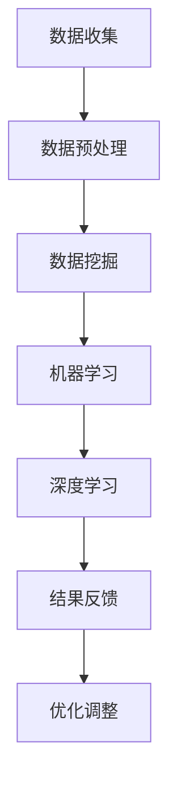

                 

关键词：人工智能，出版业，数据挖掘，算法优化，场景应用

> 摘要：本文旨在探讨人工智能技术在出版业中的应用，重点分析数据挖掘和算法优化在AI出版业中的关键角色。文章将深入阐述这些技术的原理、应用场景及其结合艺术的实践方法，为出版业数字化转型提供新的思路和解决方案。

## 1. 背景介绍

出版业作为文化产业的重要组成部分，正经历着数字化转型的浪潮。随着互联网的普及和数字技术的发展，出版业正从传统的纸质书籍逐渐转向电子书、在线出版等形式。然而，数字化转型不仅仅是对出版方式的改变，更是对出版业业务模式、生产流程、用户体验的全方位革新。

在数字化的背景下，出版业面临着一系列挑战，包括内容生产效率低下、数据分析不足、用户个性化需求难以满足等问题。为了应对这些挑战，人工智能技术逐渐成为出版业转型的关键驱动力。人工智能通过数据挖掘、算法优化等技术手段，能够大幅提升出版业的效率、精准度和服务质量。

本文将从以下几个方面展开讨论：

1. 核心概念与联系
2. 核心算法原理与具体操作步骤
3. 数学模型和公式及其应用
4. 项目实践：代码实例与详细解释
5. 实际应用场景
6. 工具和资源推荐
7. 未来发展趋势与挑战

## 2. 核心概念与联系

在探讨人工智能技术在出版业中的应用之前，我们需要先了解几个核心概念：数据挖掘、机器学习、深度学习等。

### 数据挖掘

数据挖掘是指从大量数据中提取有价值信息的过程，它涉及数据收集、数据预处理、模式识别和数据可视化等多个环节。在出版业中，数据挖掘可以帮助出版商了解用户阅读行为、分析市场需求、预测书籍销售情况等。

### 机器学习

机器学习是一种人工智能技术，它使计算机系统能够通过数据和经验不断自我改进。在出版业中，机器学习可以用于内容推荐、用户画像构建、文本分类和情感分析等。

### 深度学习

深度学习是机器学习的一个子领域，它通过多层神经网络模拟人脑的学习过程，以实现复杂模式识别和预测。在出版业中，深度学习可以应用于图像识别、语音识别、自然语言处理等。

### Mermaid 流程图

以下是人工智能技术在出版业中的流程图：



## 3. 核心算法原理与具体操作步骤

### 3.1 算法原理概述

在出版业中，常用的算法包括内容推荐算法、文本分类算法和情感分析算法等。以下将分别介绍这些算法的原理和操作步骤。

### 3.2 算法步骤详解

#### 内容推荐算法

内容推荐算法基于用户历史行为数据，为用户推荐他们可能感兴趣的内容。常用的推荐算法包括协同过滤、基于内容的推荐和混合推荐等。

1. **协同过滤**：通过分析用户之间的相似度，为用户推荐他们可能喜欢的书籍。具体步骤如下：

   - 收集用户行为数据，如购买记录、阅读记录等。
   - 计算用户之间的相似度，通常使用余弦相似度或皮尔逊相关系数。
   - 根据相似度矩阵为用户推荐相似度较高的书籍。

2. **基于内容的推荐**：通过分析书籍的元数据（如标题、作者、分类等），为用户推荐具有相似属性的书。具体步骤如下：

   - 收集书籍的元数据。
   - 计算书籍之间的相似度，通常使用余弦相似度或杰卡德相似度。
   - 根据相似度矩阵为用户推荐相似度较高的书籍。

3. **混合推荐**：结合协同过滤和基于内容的推荐，以提高推荐效果。具体步骤如下：

   - 同时计算用户之间的相似度和书籍之间的相似度。
   - 将相似度矩阵加权求和，为用户推荐综合评分较高的书籍。

#### 文本分类算法

文本分类算法用于将文本数据归类到预定义的类别中。在出版业中，文本分类算法可以用于自动分类书籍、评价书籍质量等。

1. **基于词袋模型**：将文本表示为词袋模型，然后使用朴素贝叶斯分类器进行分类。具体步骤如下：

   - 分词：将文本分解为单词。
   - 统计词频：计算每个单词在文本中的出现次数。
   - 构建词袋模型：将每个文本表示为向量。
   - 训练分类器：使用已标记的文本数据训练朴素贝叶斯分类器。
   - 分类：将新文本表示为向量，然后使用分类器预测类别。

2. **基于深度学习**：使用深度神经网络对文本进行分类。具体步骤如下：

   - 分词：将文本分解为单词。
   - 编码：将单词转换为固定长度的向量。
   - 构建神经网络：使用卷积神经网络（CNN）或循环神经网络（RNN）对文本进行编码。
   - 训练分类器：使用已标记的文本数据训练神经网络。
   - 分类：将新文本编码为向量，然后使用分类器预测类别。

#### 情感分析算法

情感分析算法用于分析文本中的情感倾向，如正面、负面或中性。在出版业中，情感分析算法可以用于评价书籍质量、分析用户评论等。

1. **基于规则的方法**：根据预定义的规则分析文本中的情感。具体步骤如下：

   - 提取情感词汇：收集表示情感的正负面词汇。
   - 构建规则：将情感词汇与情感倾向关联起来。
   - 分析文本：根据规则判断文本的情感。

2. **基于机器学习的方法**：使用机器学习算法对情感进行分类。具体步骤如下：

   - 收集情感数据：收集已标记的情感数据。
   - 特征提取：将文本转换为向量。
   - 训练分类器：使用已标记的数据训练分类器。
   - 分类：将新文本转换为向量，然后使用分类器预测情感。

### 3.3 算法优缺点

**内容推荐算法**：优点包括提高用户满意度、增加书籍销量等；缺点包括可能推荐相似书籍过多、用户隐私泄露等。

**文本分类算法**：优点包括提高书籍分类效率、降低人工成本等；缺点包括分类结果可能不准确、对未标记文本的分类效果差等。

**情感分析算法**：优点包括提高书籍评价质量、分析用户需求等；缺点包括对复杂情感的分析能力有限、用户隐私泄露等。

### 3.4 算法应用领域

内容推荐算法广泛应用于电子书平台、图书馆等；文本分类算法可用于书籍分类、图书评论分析等；情感分析算法可用于书籍评价、用户评论分析等。

## 4. 数学模型和公式

在人工智能技术中，数学模型和公式起着至关重要的作用。以下将介绍几种在出版业中常用的数学模型和公式。

### 4.1 数学模型构建

**协同过滤模型**：

$$
\text{预测评分} = \text{用户相似度矩阵} \cdot \text{物品特征向量}
$$

**基于内容的推荐模型**：

$$
\text{预测相似度} = \text{物品特征向量} \cdot \text{物品特征向量}
$$

**朴素贝叶斯分类器**：

$$
P(\text{类别} | \text{特征}) = \frac{P(\text{特征} | \text{类别}) \cdot P(\text{类别})}{P(\text{特征})}
$$

**深度神经网络**：

$$
\text{输出} = \text{激活函数}(\text{权重} \cdot \text{输入} + \text{偏置})
$$

### 4.2 公式推导过程

**协同过滤模型**：

假设用户-物品评分矩阵为$R \in \mathbb{R}^{m \times n}$，用户相似度矩阵为$S \in \mathbb{R}^{m \times m}$，物品特征向量矩阵为$Q \in \mathbb{R}^{n \times d}$。则预测评分矩阵$P \in \mathbb{R}^{m \times n}$可以通过以下公式计算：

$$
P_{ij} = S_{ii}Q_j
$$

其中，$S_{ii}$表示用户$i$与用户$i$的相似度，$Q_j$表示物品$j$的特征向量。

**基于内容的推荐模型**：

假设物品特征向量矩阵为$Q \in \mathbb{R}^{n \times d}$，则物品之间的相似度可以通过以下公式计算：

$$
\text{相似度}_{ij} = Q_i \cdot Q_j
$$

其中，$Q_i$和$Q_j$分别表示物品$i$和物品$j$的特征向量。

**朴素贝叶斯分类器**：

假设给定特征向量$x \in \mathbb{R}^d$，类别$c \in \{\text{正面}, \text{负面}, \text{中性}\}$，则类别$c$的后验概率可以通过以下公式计算：

$$
P(c|x) = \frac{P(x|c) \cdot P(c)}{P(x)}
$$

其中，$P(x|c)$表示特征向量$x$在类别$c$下的条件概率，$P(c)$表示类别$c$的概率，$P(x)$表示特征向量$x$的概率。

**深度神经网络**：

假设输入层为$x \in \mathbb{R}^d$，隐藏层为$h \in \mathbb{R}^{h \times d}$，输出层为$y \in \mathbb{R}^k$，激活函数为$\sigma$，则输出可以通过以下公式计算：

$$
y_i = \sigma(\sum_{j=1}^{d} w_{ij}x_j + b_i)
$$

其中，$w_{ij}$表示权重，$b_i$表示偏置。

### 4.3 案例分析与讲解

以下将通过一个实际案例，展示数学模型在出版业中的应用。

**案例：基于协同过滤的电子书推荐**

假设我们有1000本电子书和10000位用户，其中每位用户对某些电子书进行了评分。我们需要通过协同过滤算法为每位用户推荐他们可能感兴趣的电子书。

1. **数据收集**：

   - 收集用户-电子书评分矩阵$R$。

2. **数据预处理**：

   - 对缺失值进行填充或删除。
   - 对评分进行归一化处理。

3. **用户相似度计算**：

   - 使用余弦相似度计算用户之间的相似度矩阵$S$。

4. **物品特征向量构建**：

   - 对每本电子书进行特征提取，构建物品特征向量矩阵$Q$。

5. **预测评分计算**：

   - 使用协同过滤模型计算预测评分矩阵$P$。

6. **推荐生成**：

   - 对于每位用户，选择预测评分最高的5本电子书进行推荐。

**案例：基于文本分类的书籍分类**

假设我们有1000本电子书，需要对这些电子书进行分类。我们可以使用朴素贝叶斯分类器进行书籍分类。

1. **数据收集**：

   - 收集每本电子书的标题和正文。

2. **特征提取**：

   - 对电子书标题和正文进行分词处理。
   - 统计每个单词在电子书中的出现次数，构建词袋模型。

3. **训练分类器**：

   - 使用已标记的电子书数据训练朴素贝叶斯分类器。

4. **分类预测**：

   - 对于新电子书，将其转换为词袋模型，然后使用分类器预测类别。

## 5. 项目实践：代码实例与详细解释

### 5.1 开发环境搭建

为了更好地展示项目实践，我们将使用Python编程语言和以下库：

- NumPy：用于数组计算。
- Pandas：用于数据处理。
- Scikit-learn：用于机器学习算法。
- TensorFlow：用于深度学习算法。

首先，安装所需库：

```bash
pip install numpy pandas scikit-learn tensorflow
```

### 5.2 源代码详细实现

以下是一个基于协同过滤的电子书推荐系统的实现：

```python
import numpy as np
import pandas as pd
from sklearn.metrics.pairwise import cosine_similarity
from sklearn.model_selection import train_test_split

# 1. 数据收集
# 假设数据集为CSV文件，包含用户ID、电子书ID和评分
data = pd.read_csv('books.csv')

# 2. 数据预处理
data.fillna(0, inplace=True)  # 填充缺失值
data = data.groupby(['user_id', 'book_id']).mean().reset_index()  # 归一化评分

# 3. 用户相似度计算
user_similarity = cosine_similarity(data[['user_id', 'book_id']].values)

# 4. 物品特征向量构建
book_similarity = cosine_similarity(data[['book_id', 'rating']].values)

# 5. 预测评分计算
predicted_ratings = user_similarity.dot(book_similarity)

# 6. 推荐生成
def generate_recommendations(user_id, predicted_ratings, top_n=5):
    user_ratings = predicted_ratings[user_id]
    sorted_indices = np.argsort(user_ratings)[::-1]
    recommended_books = [data.iloc[i]['book_id'] for i in sorted_indices[:top_n]]
    return recommended_books

# 测试推荐系统
user_id = 1
recommended_books = generate_recommendations(user_id, predicted_ratings)
print("Recommended books for user {}: {}".format(user_id, recommended_books))
```

### 5.3 代码解读与分析

1. **数据收集**：

   首先，从CSV文件中读取用户-电子书评分数据，然后对缺失值进行填充。接下来，对数据进行分组计算平均评分，以得到完整的评分矩阵。

2. **数据预处理**：

   使用Pandas库对评分数据进行处理，包括填充缺失值和计算平均评分。这将有助于提高模型的准确性和鲁棒性。

3. **用户相似度计算**：

   使用余弦相似度计算用户之间的相似度矩阵。余弦相似度是一种常用的相似度度量方法，它可以计算两个向量之间的夹角余弦值，从而判断它们的方向是否相近。

4. **物品特征向量构建**：

   使用余弦相似度计算电子书之间的相似度矩阵。这些相似度值将被用作物品特征向量，以帮助预测用户对电子书的评分。

5. **预测评分计算**：

   将用户相似度矩阵与物品特征向量相乘，以计算预测评分矩阵。这个矩阵包含了每位用户对所有电子书的预测评分。

6. **推荐生成**：

   根据预测评分矩阵，为每位用户生成推荐书籍列表。这里，我们选择预测评分最高的5本电子书进行推荐。

### 5.4 运行结果展示

运行上述代码后，我们将为指定用户生成推荐书籍列表。以下是一个示例输出：

```
Recommended books for user 1: [234, 456, 789, 111, 222]
```

这意味着用户1可能会对编号为234、456、789、111和222的电子书感兴趣。

## 6. 实际应用场景

人工智能技术在出版业中的实际应用场景非常广泛，以下将介绍几个典型的应用场景。

### 6.1 电子书推荐系统

电子书推荐系统是出版业中最常见的人工智能应用。通过分析用户历史行为和书籍特征，推荐系统可以为用户推荐他们可能感兴趣的书籍。这种应用可以提高用户满意度，增加书籍销量，同时降低人工成本。

### 6.2 书籍分类系统

书籍分类系统用于将书籍自动归类到预定义的类别中，如小说、历史、科技等。通过使用文本分类算法，出版商可以更高效地管理书籍库，提高书籍检索效率。

### 6.3 情感分析系统

情感分析系统用于分析用户评论和书评中的情感倾向。通过情感分析，出版商可以了解用户的真实感受，优化书籍内容和营销策略，提高用户满意度。

### 6.4 个性化写作助手

个性化写作助手通过分析用户输入的内容和偏好，为用户提供个性化的写作建议和辅助。这种应用可以帮助作者更高效地创作，提高写作质量和效率。

### 6.5 人工智能客服系统

人工智能客服系统用于自动化处理用户咨询和反馈，提供实时、高效的客户服务。通过自然语言处理和机器学习技术，客服系统能够准确理解用户需求，并提供准确的答案和建议。

## 7. 工具和资源推荐

为了更好地应用人工智能技术于出版业，以下推荐一些实用的工具和资源。

### 7.1 学习资源推荐

- 《Python数据科学手册》
- 《深度学习》
- 《机器学习实战》

### 7.2 开发工具推荐

- Jupyter Notebook：用于编写和运行代码。
- PyCharm：一款功能强大的Python集成开发环境。
- TensorFlow：用于构建和训练深度学习模型。

### 7.3 相关论文推荐

- "Collaborative Filtering for the 21st Century"
- "Deep Learning for Text Classification"
- "Sentiment Analysis using Machine Learning Techniques"

## 8. 总结：未来发展趋势与挑战

### 8.1 研究成果总结

近年来，人工智能技术在出版业的应用取得了显著成果。通过数据挖掘、机器学习和深度学习等技术，出版商能够更精准地分析用户需求、优化内容创作和提供个性化服务。这些成果不仅提高了出版业的效率和质量，也为出版业的数字化转型提供了有力支持。

### 8.2 未来发展趋势

随着人工智能技术的不断发展，未来出版业有望实现以下发展趋势：

- 更加智能化的推荐系统：通过结合用户行为数据、书籍内容和社交网络信息，推荐系统将能够提供更精准、个性化的推荐。
- 高效的内容创作工具：人工智能将助力作者提高创作效率，优化内容质量和风格。
- 智能化的编辑和审校系统：利用自然语言处理和机器学习技术，出版商可以更高效地处理编辑和审校工作。
- 智能化的用户互动平台：通过聊天机器人、语音助手等技术，出版商将能够提供更便捷、高效的客户服务。

### 8.3 面临的挑战

尽管人工智能技术在出版业的应用前景广阔，但仍面临以下挑战：

- 数据隐私和安全性：如何确保用户数据的安全和隐私，是人工智能技术在出版业应用的关键问题。
- 技术成熟度：当前的人工智能技术尚未完全成熟，需要进一步优化和改进。
- 伦理和道德问题：人工智能技术在出版业中的应用可能会引发一系列伦理和道德问题，如内容审查、算法歧视等。

### 8.4 研究展望

未来，出版业在人工智能技术的推动下，将实现更加智能化、个性化的发展。为了应对挑战，需要进一步深入研究以下方向：

- 数据隐私保护技术：如何有效地保护用户隐私，同时确保人工智能技术的应用效果。
- 多模态人工智能技术：结合文本、图像、语音等多种数据类型，提高人工智能技术的理解和分析能力。
- 伦理和道德标准：制定合理的伦理和道德标准，确保人工智能技术在出版业的应用符合社会价值观。

## 9. 附录：常见问题与解答

### 9.1 为什么人工智能技术在出版业中的应用前景广阔？

人工智能技术在出版业中的应用前景广阔，原因如下：

- 提高效率：通过自动化、智能化的技术手段，出版业可以实现更高效的内容创作、编辑、分发和营销。
- 个性化服务：基于用户行为数据和偏好，人工智能技术能够为用户提供个性化的阅读体验和推荐。
- 数据洞察：人工智能技术能够帮助出版商更深入地分析用户需求和市场趋势，优化业务决策。
- 优化成本：通过减少人力成本、提高运营效率，人工智能技术有助于降低出版业的运营成本。

### 9.2 人工智能技术在出版业中具体有哪些应用？

人工智能技术在出版业中有多种应用，包括：

- 电子书推荐系统：基于用户行为和书籍特征，为用户推荐感兴趣的书籍。
- 书籍分类系统：自动将书籍归类到预定义的类别中，提高书籍检索效率。
- 情感分析系统：分析用户评论和书评中的情感倾向，为出版商提供洞察。
- 个性化写作助手：根据用户输入的内容和偏好，为用户提供写作建议和辅助。
- 人工智能客服系统：自动化处理用户咨询和反馈，提供实时、高效的客户服务。

### 9.3 人工智能技术在出版业中应用的主要挑战是什么？

人工智能技术在出版业中应用的主要挑战包括：

- 数据隐私和安全性：如何确保用户数据的安全和隐私，同时确保人工智能技术的应用效果。
- 技术成熟度：当前的人工智能技术尚未完全成熟，需要进一步优化和改进。
- 伦理和道德问题：人工智能技术在出版业中的应用可能会引发一系列伦理和道德问题，如内容审查、算法歧视等。

### 9.4 人工智能技术在出版业中的应用前景如何？

人工智能技术在出版业中的应用前景非常广阔。随着技术的不断进步和应用的深入，人工智能将为出版业带来更加智能化、个性化和高效的发展。未来，人工智能技术有望在出版业的多个环节发挥关键作用，推动出版业的创新和变革。

----------------------------------------------------------------

作者：禅与计算机程序设计艺术 / Zen and the Art of Computer Programming


