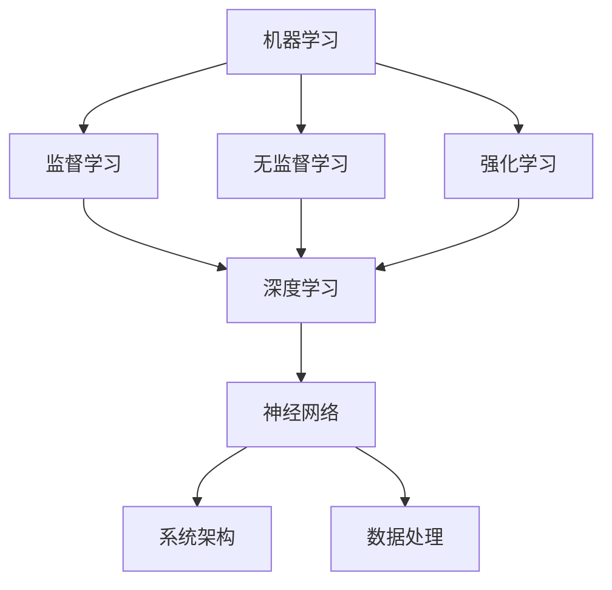

                 

关键词：人工智能、创业、技术、数据、机器学习、深度学习、算法、神经网络、架构、框架、模型、开发工具、应用场景、未来展望。

> 摘要：本文将深入探讨人工智能（AI）创业中所面临的技术挑战与数据问题。通过分析AI创业的核心技术、数据处理方法、算法原理，以及数学模型的构建与推导，我们将展示如何将这些技术应用于实际项目中，并探讨其未来的发展方向与面临的挑战。

## 1. 背景介绍

随着信息技术的飞速发展，人工智能（AI）已经成为各行各业关注的热点。无论是传统行业转型升级，还是新兴产业的创新突破，AI都扮演着至关重要的角色。对于创业者来说，AI不仅是一个强大的工具，更是潜在的巨大商机。

在AI创业的浪潮中，技术选择和数据管理成为了关键因素。创业者需要在海量数据中挖掘有价值的信息，运用先进的算法和模型来构建智能系统，同时确保系统的稳定性和可扩展性。然而，这并非易事，AI创业面临着诸多技术挑战，包括数据质量、算法选择、系统架构等。

本文将围绕以下主题展开：

- 核心概念与联系
- 核心算法原理与操作步骤
- 数学模型与公式推导
- 项目实践与代码实例
- 实际应用场景
- 未来展望与挑战

## 2. 核心概念与联系

在AI创业中，我们首先需要理解几个核心概念，它们是理解后续内容的基础。

### 2.1 机器学习

机器学习是AI的核心技术之一，它通过训练模型来自动地从数据中学习规律。机器学习可以分为监督学习、无监督学习和强化学习。监督学习有标记的数据集，模型通过学习这些数据来预测未知数据的标签。无监督学习则没有标记的数据集，模型旨在发现数据中的结构和模式。强化学习则是通过与环境的交互来学习最优策略。

### 2.2 深度学习

深度学习是机器学习的一种特殊形式，它使用多层神经网络来学习和提取数据中的复杂特征。深度学习在图像识别、自然语言处理等领域取得了显著的成果。卷积神经网络（CNN）和循环神经网络（RNN）是深度学习的两种重要架构。

### 2.3 神经网络

神经网络是深度学习的基础，它由多个神经元（节点）组成，每个神经元接收输入并产生输出。神经网络通过前向传播和反向传播来训练模型，不断调整权重和偏置，以最小化损失函数。

### 2.4 系统架构

系统架构是确保AI系统能够稳定运行、扩展性和可维护性的关键。常见的系统架构包括分层架构、微服务架构等。在AI创业中，系统架构的选择需要根据业务需求和资源限制来决定。

### 2.5 数据处理

数据处理是AI创业中的另一个核心问题。数据预处理、数据清洗、特征工程等步骤对于模型的训练效果至关重要。创业者需要确保数据的质量和完整性，以便构建高质量的AI模型。

以下是核心概念的Mermaid流程图：



## 3. 核心算法原理与具体操作步骤

在AI创业中，选择合适的算法并正确地实施是关键。以下将介绍几个核心算法的原理和操作步骤。

### 3.1 算法原理概述

#### 3.1.1 卷积神经网络（CNN）

CNN是一种用于图像识别和处理的深度学习模型。它通过卷积层、池化层和全连接层来提取图像特征并进行分类。

#### 3.1.2 循环神经网络（RNN）

RNN是一种用于序列数据处理的深度学习模型。它通过循环结构来处理前后依赖的数据，常用于自然语言处理。

#### 3.1.3 支持向量机（SVM）

SVM是一种用于分类和回归的监督学习算法。它通过找到一个最佳的超平面来分隔数据。

### 3.2 算法步骤详解

#### 3.2.1 卷积神经网络（CNN）

1. 输入层：接收图像数据。
2. 卷积层：通过卷积操作提取图像特征。
3. 池化层：降低特征图的维度，提高模型泛化能力。
4. 全连接层：将特征映射到分类结果。

#### 3.2.2 循环神经网络（RNN）

1. 输入层：接收序列数据。
2. 隐藏层：通过循环结构处理序列数据，提取特征。
3. 输出层：根据隐藏层特征生成预测结果。

#### 3.2.3 支持向量机（SVM）

1. 输入层：接收数据特征。
2. 超平面计算：计算最佳超平面，使分类边界最大化。
3. 分类决策：根据数据点到超平面的距离进行分类。

### 3.3 算法优缺点

#### 卷积神经网络（CNN）

- 优点：适合图像和视频处理，能够自动提取复杂特征。
- 缺点：计算资源消耗大，训练时间较长。

#### 循环神经网络（RNN）

- 优点：适合序列数据处理，能够捕捉长时依赖关系。
- 缺点：容易产生梯度消失和梯度爆炸问题。

#### 支持向量机（SVM）

- 优点：分类效果较好，适用于小样本数据。
- 缺点：对高维数据效果较差，训练时间较长。

### 3.4 算法应用领域

#### 卷积神经网络（CNN）

- 应用领域：图像识别、目标检测、图像生成。

#### 循环神经网络（RNN）

- 应用领域：自然语言处理、语音识别、时间序列预测。

#### 支持向量机（SVM）

- 应用领域：文本分类、生物信息学、金融风险评估。

## 4. 数学模型与公式推导

在AI创业中，数学模型和公式推导是理解和实现算法的关键。以下将介绍几个核心数学模型的构建和推导。

### 4.1 数学模型构建

#### 4.1.1 损失函数

损失函数用于衡量模型预测值与真实值之间的差异。常见的损失函数有均方误差（MSE）和交叉熵损失（Cross-Entropy Loss）。

$$
MSE = \frac{1}{n}\sum_{i=1}^{n}(y_i - \hat{y}_i)^2
$$

$$
Cross-Entropy Loss = -\sum_{i=1}^{n}y_i\log(\hat{y}_i)
$$

#### 4.1.2 优化算法

优化算法用于调整模型参数以最小化损失函数。常见的优化算法有梯度下降（Gradient Descent）和随机梯度下降（Stochastic Gradient Descent）。

$$
\theta_{t+1} = \theta_t - \alpha \nabla_{\theta_t}J(\theta_t)
$$

$$
\theta_{t+1} = \theta_t - \frac{1}{n}\alpha \sum_{i=1}^{n}\nabla_{\theta_t}J(\theta_t)
$$

### 4.2 公式推导过程

#### 4.2.1 梯度下降

梯度下降的核心思想是沿着损失函数的负梯度方向更新参数，以最小化损失函数。

1. 计算损失函数关于参数的梯度。
2. 沿着负梯度方向更新参数。
3. 重复步骤1和2，直到损失函数收敛。

#### 4.2.2 随机梯度下降

随机梯度下降是对梯度下降的改进，它使用样本梯度而不是整体梯度进行更新。

1. 从数据集中随机抽取一个小批量样本。
2. 计算批量样本的梯度。
3. 沿着负梯度方向更新参数。
4. 重复步骤1-3，直到损失函数收敛。

### 4.3 案例分析与讲解

#### 4.3.1 机器学习项目

假设我们有一个机器学习项目，目标是预测股票价格的涨跌。我们可以使用深度学习模型来构建预测模型。

1. 数据收集：收集历史股票价格数据。
2. 数据预处理：对数据进行清洗和归一化处理。
3. 模型构建：构建一个深度神经网络，包括输入层、隐藏层和输出层。
4. 模型训练：使用训练数据训练模型，优化模型参数。
5. 模型评估：使用验证数据评估模型性能。
6. 模型部署：将训练好的模型部署到生产环境中。

#### 4.3.2 自然语言处理项目

假设我们有一个自然语言处理项目，目标是构建一个情感分析模型。

1. 数据收集：收集社交媒体上的用户评论。
2. 数据预处理：对评论进行分词、去停用词等处理。
3. 模型构建：构建一个循环神经网络，包括嵌入层、循环层和输出层。
4. 模型训练：使用训练数据训练模型，优化模型参数。
5. 模型评估：使用验证数据评估模型性能。
6. 模型部署：将训练好的模型部署到生产环境中。

## 5. 项目实践：代码实例与详细解释

### 5.1 开发环境搭建

在开始项目实践之前，我们需要搭建一个合适的开发环境。以下是使用Python和TensorFlow构建深度学习模型的步骤：

1. 安装Python（推荐版本3.7以上）。
2. 安装TensorFlow库。
3. 安装其他必要的依赖库（如NumPy、Pandas等）。

```python
!pip install tensorflow
```

### 5.2 源代码详细实现

以下是一个简单的深度学习项目，用于预测股票价格的涨跌。代码实现如下：

```python
import tensorflow as tf
from tensorflow.keras.models import Sequential
from tensorflow.keras.layers import Dense, LSTM

# 数据预处理
# ...

# 构建模型
model = Sequential([
    LSTM(units=50, activation='relu', input_shape=(time_steps, features)),
    Dense(units=1, activation='sigmoid')
])

# 编译模型
model.compile(optimizer='adam', loss='binary_crossentropy', metrics=['accuracy'])

# 训练模型
model.fit(x_train, y_train, epochs=10, batch_size=32, validation_split=0.2)

# 评估模型
model.evaluate(x_test, y_test)
```

### 5.3 代码解读与分析

上述代码首先进行了数据预处理，然后使用Sequential模型构建了一个包含一个LSTM层和一个Dense层的深度学习模型。LSTM层用于处理时间序列数据，Dense层用于输出预测结果。模型使用adam优化器和binary_crossentropy损失函数进行编译，并使用训练数据进行了10个epoch的训练。最后，使用测试数据评估了模型性能。

## 6. 实际应用场景

AI技术在各个行业都取得了显著的成果，以下是几个实际应用场景的例子：

### 6.1 医疗

AI在医疗领域的应用包括疾病预测、诊断辅助、个性化治疗等。通过深度学习模型，AI可以分析患者的医疗数据，提供准确的诊断和治疗方案。

### 6.2 金融

AI在金融领域的应用包括风险控制、交易策略、信用评估等。通过机器学习模型，AI可以分析金融数据，预测市场趋势，为投资决策提供支持。

### 6.3 教育

AI在教育领域的应用包括智能辅导、学习分析、个性化推荐等。通过智能算法，AI可以为学生提供个性化的学习资源，提高学习效果。

### 6.4 未来展望

随着技术的不断进步，AI在各个领域的应用将越来越广泛。未来，我们将看到更多的AI解决方案被应用于生产、物流、零售等行业，带来更高的效率和更好的用户体验。

## 7. 工具和资源推荐

### 7.1 学习资源推荐

- 《深度学习》（Goodfellow, Bengio, Courville著）
- 《Python机器学习》（Sebastian Raschka著）
- 《自然语言处理与深度学习》（张天宇著）

### 7.2 开发工具推荐

- TensorFlow：用于构建和训练深度学习模型的强大框架。
- PyTorch：另一个流行的深度学习框架，易于使用和调试。
- Jupyter Notebook：用于编写和运行代码的交互式环境。

### 7.3 相关论文推荐

- “Deep Learning for Text Classification” （Keras Team，2016）
- “Recurrent Neural Network Based Language Model” （Yoshua Bengio，2003）
- “Support Vector Machines for Classification and Regression” （Vapnik, 1998）

## 8. 总结：未来发展趋势与挑战

AI创业正面临着前所未有的机遇和挑战。随着技术的不断进步，AI在各个领域的应用将越来越广泛，创业者将有更多的机会通过AI技术实现创新和突破。

然而，AI创业也面临着一些挑战，包括数据隐私、算法偏见、技术壁垒等。创业者需要在技术创新的同时，关注伦理和社会影响，确保AI技术的可持续发展和广泛应用。

未来，我们将看到更多的AI解决方案被应用于实际场景，带来更高的效率和更好的用户体验。同时，AI创业也将面临更多的挑战，需要创业者不断学习和探索，以应对不断变化的市场需求。

### 8.1 研究成果总结

本文总结了AI创业中的核心技术、数据处理方法、算法原理、数学模型构建和实际应用场景。通过分析这些核心内容，我们展示了如何将AI技术应用于实际项目中，并探讨了未来的发展趋势与挑战。

### 8.2 未来发展趋势

随着技术的不断进步，AI创业将在各个领域取得更广泛的成果。深度学习、神经网络、自然语言处理等核心技术将继续发展，带来更多的创新应用。同时，跨学科合作、开源社区的发展也将推动AI技术的进步。

### 8.3 面临的挑战

AI创业面临着数据隐私、算法偏见、技术壁垒等挑战。如何确保数据的安全性和隐私性，避免算法偏见，以及降低技术壁垒，是创业者需要关注的重要问题。

### 8.4 研究展望

未来，AI创业将朝着更智能、更高效、更人性化的方向发展。创业者需要不断学习和探索，以适应市场的变化。同时，也需要关注伦理和社会影响，确保AI技术的可持续发展和广泛应用。

## 9. 附录：常见问题与解答

### 9.1 什么是机器学习？

机器学习是一种通过训练模型来自动从数据中学习规律的方法。它分为监督学习、无监督学习和强化学习等类型。

### 9.2 什么是深度学习？

深度学习是一种特殊的机器学习形式，它使用多层神经网络来学习和提取数据中的复杂特征。

### 9.3 什么是神经网络？

神经网络是一种由多个神经元组成的计算模型，每个神经元接收输入并产生输出。神经网络通过前向传播和反向传播来训练模型。

### 9.4 如何选择合适的算法？

选择合适的算法需要根据具体应用场景和数据特点来决定。常见的算法有卷积神经网络（CNN）、循环神经网络（RNN）和支持向量机（SVM）等。

### 9.5 数据处理的重要步骤有哪些？

数据处理的重要步骤包括数据预处理、数据清洗、特征工程等。这些步骤对于模型的训练效果至关重要。

### 9.6 如何评估模型性能？

评估模型性能可以使用多种指标，如准确率、召回率、F1值等。通过交叉验证等方法，可以更准确地评估模型性能。

### 9.7 如何部署训练好的模型？

训练好的模型可以通过模型保存和加载等方法进行部署。在实际应用中，可以使用API接口、模型服务等方式将模型部署到生产环境中。

----------------------------------------------------------------

本文由禅与计算机程序设计艺术撰写，旨在为AI创业者和从业者提供全面的技术指导和思考。通过深入探讨AI创业中的技术与数据问题，本文希望能够为创业者带来启发和帮助。在未来的AI创业浪潮中，让我们一起携手前行，探索AI的无尽可能！作者：禅与计算机程序设计艺术 / Zen and the Art of Computer Programming。

