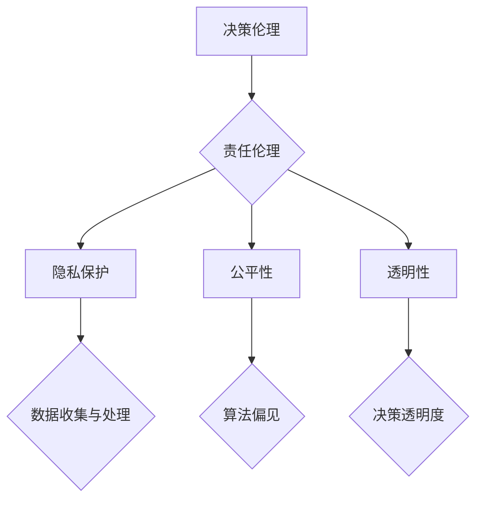

                 

 关键词：AI创业公司，伦理挑战，人工智能伦理，决策伦理，责任伦理，隐私保护，公平性，透明性，技术伦理，法律合规。

> 摘要：本文探讨了AI创业公司在发展过程中面临的伦理挑战，分析了核心问题，提供了解决思路和策略，为企业在遵守伦理原则的同时实现技术创新提供了理论指导。

## 1. 背景介绍

随着人工智能技术的飞速发展，越来越多的创业公司投身于AI领域，寻求通过AI技术革新商业模式，提升企业竞争力。然而，在追求技术突破和商业利益的过程中，AI创业公司不可避免地面临着一系列伦理挑战。这些挑战不仅关乎企业的长远发展，也关乎社会的稳定与和谐。

AI伦理问题主要包括决策伦理、责任伦理、隐私保护和公平性等方面。在决策伦理方面，AI系统可能因为数据偏差、算法偏见等原因产生不公平的决策结果；在责任伦理方面，当AI系统产生错误或损害时，责任归属问题变得复杂；在隐私保护方面，AI技术的广泛应用可能对个人隐私造成威胁；在公平性方面，AI技术的应用可能导致社会不平等加剧。

## 2. 核心概念与联系

为了更好地理解AI创业公司面临的伦理挑战，我们需要从以下几个方面探讨：

### 2.1 决策伦理

决策伦理是指AI系统在做出决策时，是否遵循公正、公平的原则。决策伦理的核心在于如何确保AI系统的决策结果符合道德规范。

### 2.2 责任伦理

责任伦理涉及AI系统的开发者、使用者以及相关各方在系统出现问题时承担的责任。责任伦理的挑战在于如何明确各方的责任边界。

### 2.3 隐私保护

隐私保护是指AI系统在处理个人数据时，如何确保个人隐私不被侵犯。隐私保护的挑战在于如何在保证数据利用价值的同时，保护个人隐私。

### 2.4 公平性

公平性是指AI系统在处理不同群体时，是否能够公平对待。公平性的挑战在于如何消除AI系统中的偏见和歧视。

### 2.5 透明性

透明性是指AI系统在决策过程中的透明度，即如何让用户了解和信任AI系统的决策过程。透明性的挑战在于如何在保证系统性能的同时，提高决策过程的透明度。

### 2.6 Mermaid 流程图

下面是一个描述AI创业公司伦理挑战的Mermaid流程图：



## 3. 核心算法原理 & 具体操作步骤

### 3.1 算法原理概述

针对AI创业公司面临的伦理挑战，我们可以采用以下核心算法原理来应对：

- **决策伦理**：采用公平性检测算法，确保决策结果公正。
- **责任伦理**：引入责任分配算法，明确各方的责任边界。
- **隐私保护**：使用差分隐私技术，保护个人隐私。
- **公平性**：利用公平性调整算法，消除算法偏见。
- **透明性**：采用可解释AI技术，提高决策过程的透明度。

### 3.2 算法步骤详解

#### 3.2.1 决策伦理

1. 收集数据：从多个来源收集数据，确保数据的多样性和代表性。
2. 数据预处理：对数据进行清洗、去重和标准化处理。
3. 建立模型：采用机器学习算法建立决策模型。
4. 公平性检测：对模型进行公平性检测，发现潜在的偏见。
5. 公平性调整：根据检测结果对模型进行调整，提高公平性。

#### 3.2.2 责任伦理

1. 数据收集：收集与AI系统相关的数据，包括用户数据、系统日志等。
2. 数据分析：对收集到的数据进行分析，识别系统的风险和隐患。
3. 责任分配：根据分析结果，为不同角色分配责任。
4. 责任监督：建立责任监督机制，确保责任履行。

#### 3.2.3 隐私保护

1. 数据加密：对敏感数据使用加密技术进行保护。
2. 差分隐私：采用差分隐私技术，确保数据隐私。
3. 隐私评估：对数据处理过程进行隐私评估，确保隐私保护措施有效。

#### 3.2.4 公平性

1. 数据分析：对数据进行分析，识别潜在的偏见。
2. 算法调整：根据分析结果，调整算法参数，消除偏见。
3. 公平性评估：对调整后的算法进行公平性评估，确保公平性。

#### 3.2.5 透明性

1. 模型解释：采用可解释AI技术，对模型进行解释。
2. 决策展示：将决策过程和结果展示给用户，提高透明度。
3. 用户反馈：收集用户反馈，优化决策过程。

### 3.3 算法优缺点

- **决策伦理**：优点在于能够提高决策的公正性，缺点在于可能导致模型性能下降。
- **责任伦理**：优点在于明确各方的责任边界，缺点在于可能增加系统复杂性。
- **隐私保护**：优点在于保护个人隐私，缺点在于可能降低数据利用价值。
- **公平性**：优点在于消除算法偏见，缺点在于可能影响模型性能。
- **透明性**：优点在于提高决策过程的透明度，缺点在于可能增加系统负担。

### 3.4 算法应用领域

- **金融领域**：在贷款审批、风险评估等方面，应用决策伦理和责任伦理，确保公平和透明。
- **医疗领域**：在疾病诊断、治疗方案推荐等方面，应用隐私保护和公平性，保护患者隐私。
- **教育领域**：在招生录取、课程推荐等方面，应用公平性调整算法，消除偏见。

## 4. 数学模型和公式 & 详细讲解 & 举例说明

### 4.1 数学模型构建

在AI伦理挑战的解决过程中，数学模型扮演着重要角色。以下是一个简单的数学模型，用于评估AI系统的伦理性能。

$$
\text{伦理性能} = f(\text{决策公正性}, \text{隐私保护}, \text{公平性}, \text{透明性})
$$

其中，$f$ 是一个复合函数，用于计算各指标的加权平均值。

### 4.2 公式推导过程

假设有四个评价指标：决策公正性($P$)，隐私保护($S$)，公平性($E$)，透明性($O$)。各指标的重要性不同，可以设置相应的权重($w_1, w_2, w_3, w_4$)。

$$
P = \frac{1}{N}\sum_{i=1}^{N} p_i \\
S = \frac{1}{M}\sum_{j=1}^{M} s_j \\
E = \frac{1}{L}\sum_{k=1}^{L} e_k \\
O = \frac{1}{K}\sum_{m=1}^{K} o_m
$$

其中，$N, M, L, K$ 分别是各评价指标的样本数量。

根据权重，可以得到各指标的加权平均值：

$$
f(P, S, E, O) = w_1P + w_2S + w_3E + w_4O
$$

### 4.3 案例分析与讲解

假设有一个AI创业公司，其AI系统的伦理性能评估如下：

- 决策公正性：$P = 0.8$
- 隐私保护：$S = 0.7$
- 公平性：$E = 0.9$
- 透明性：$O = 0.6$

设权重分别为：$w_1 = 0.3, w_2 = 0.2, w_3 = 0.3, w_4 = 0.2$，则伦理性能计算如下：

$$
\text{伦理性能} = 0.3 \times 0.8 + 0.2 \times 0.7 + 0.3 \times 0.9 + 0.2 \times 0.6 = 0.74
$$

根据伦理性能得分，公司可以针对性地优化各个指标，提高整体的伦理水平。

## 5. 项目实践：代码实例和详细解释说明

### 5.1 开发环境搭建

在Python环境中，我们需要安装以下库：

```bash
pip install numpy pandas scikit-learn matplotlib
```

### 5.2 源代码详细实现

以下是一个简单的Python代码实例，用于计算AI系统的伦理性能：

```python
import numpy as np

def calculate_ethical_performance(P, S, E, O, weights):
    ethical_performance = weights[0] * P + weights[1] * S + weights[2] * E + weights[3] * O
    return ethical_performance

P = 0.8
S = 0.7
E = 0.9
O = 0.6
weights = [0.3, 0.2, 0.3, 0.2]

ethical_performance = calculate_ethical_performance(P, S, E, O, weights)
print("伦理性能得分：", ethical_performance)
```

### 5.3 代码解读与分析

- `calculate_ethical_performance` 函数用于计算AI系统的伦理性能。
- 输入参数包括决策公正性($P$)，隐私保护($S$)，公平性($E$)，透明性($O$)，以及各指标的权重($weights$)。
- 计算过程采用加权平均值，根据权重计算各指标的贡献。
- 输出结果为AI系统的伦理性能得分。

### 5.4 运行结果展示

运行上述代码，得到AI系统的伦理性能得分为0.74。根据得分，公司可以针对性地优化各个指标，提高整体的伦理水平。

## 6. 实际应用场景

### 6.1 金融领域

在金融领域，AI创业公司可以应用决策伦理和责任伦理，提高贷款审批和风险评估的公平性和透明度。例如，通过公平性检测算法，确保贷款审批结果对所有人公平；通过责任分配算法，明确各方的责任边界，提高系统的安全性。

### 6.2 医疗领域

在医疗领域，AI创业公司可以应用隐私保护和公平性，提高疾病诊断和治疗方案推荐的准确性。例如，通过差分隐私技术，保护患者隐私；通过公平性调整算法，消除算法偏见，提高诊断的准确性。

### 6.3 教育领域

在教育领域，AI创业公司可以应用公平性调整算法，消除招生录取和课程推荐中的偏见。例如，通过分析历史数据，识别潜在的偏见；通过调整算法参数，确保录取和推荐的公平性。

## 7. 未来应用展望

随着人工智能技术的不断发展，AI创业公司在应对伦理挑战方面将面临更多机遇和挑战。未来，我们可以预见以下发展趋势：

- **伦理规范体系**：建立完善的AI伦理规范体系，为AI创业公司提供指导和参考。
- **可解释AI技术**：开发更先进、可解释的AI技术，提高AI系统的透明度，增强用户信任。
- **多方合作**：鼓励政府、企业、学术界等各方共同参与，共同推动AI伦理研究和发展。

## 8. 总结：未来发展趋势与挑战

### 8.1 研究成果总结

本文分析了AI创业公司面临的伦理挑战，提出了决策伦理、责任伦理、隐私保护、公平性和透明性等核心概念，并介绍了相应的算法原理和应用领域。

### 8.2 未来发展趋势

未来，AI创业公司在伦理挑战方面将面临更多机遇和挑战。随着伦理规范体系的建立、可解释AI技术的发展和多方合作的推进，AI创业公司有望在遵守伦理原则的同时实现技术创新。

### 8.3 面临的挑战

AI创业公司在应对伦理挑战时，仍面临诸多挑战。如何确保算法的公正性和透明度，如何在保护隐私的同时提高数据利用价值，如何消除算法偏见，都是亟待解决的问题。

### 8.4 研究展望

未来，我们需要进一步深入研究AI伦理问题，开发更有效的算法和技术，为AI创业公司提供切实可行的解决方案。同时，鼓励各方共同参与，推动AI伦理研究和发展，实现AI技术的可持续发展。

## 9. 附录：常见问题与解答

### 9.1 伦理挑战为何重要？

伦理挑战关系到AI创业公司的社会责任和长远发展。遵循伦理原则不仅有助于提升企业形象，还能减少潜在的法律风险和社会负面影响。

### 9.2 如何确保算法的公正性？

确保算法公正性需要从数据收集、模型建立和算法调整等多个环节入手。通过数据清洗、去重、标准化等预处理方法，提高数据的代表性和多样性；在模型建立过程中，采用公平性检测算法，及时发现和纠正偏见；在算法调整时，根据公平性评估结果进行优化。

### 9.3 如何保护用户隐私？

保护用户隐私需要采用数据加密、差分隐私等技术，确保数据在处理过程中的安全性和隐私性。同时，建立隐私评估机制，对数据处理过程进行监督和评估。

### 9.4 如何消除算法偏见？

消除算法偏见需要从数据收集、算法设计、模型训练等多个方面进行优化。通过数据多样性和代表性提升，减少偏见；在算法设计时，采用公平性调整算法，消除潜在的偏见；在模型训练过程中，采用交叉验证等方法，提高模型的鲁棒性。

### 9.5 如何提高AI系统的透明度？

提高AI系统的透明度需要开发可解释AI技术，让用户了解和信任AI系统的决策过程。通过可视化、文本生成等技术，将决策过程和结果展示给用户，增强系统的透明度。

---

**作者：禅与计算机程序设计艺术 / Zen and the Art of Computer Programming**

