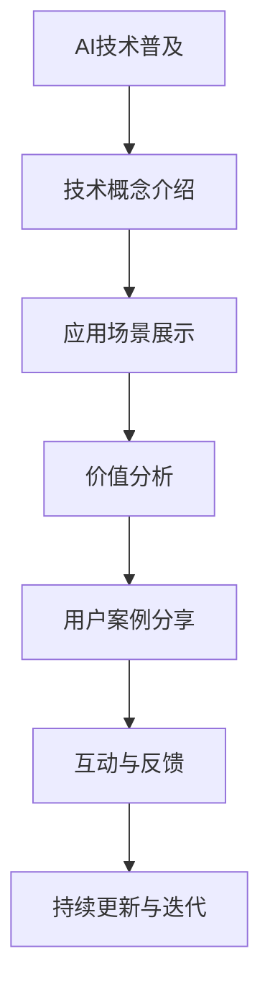
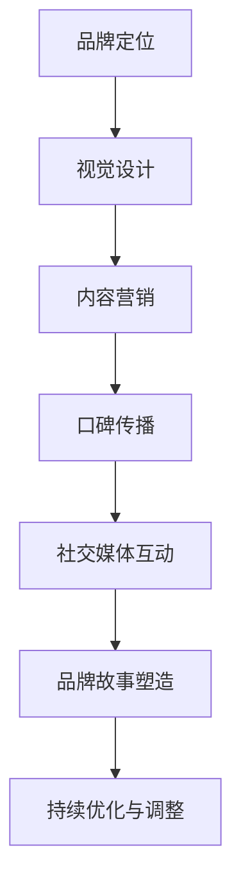
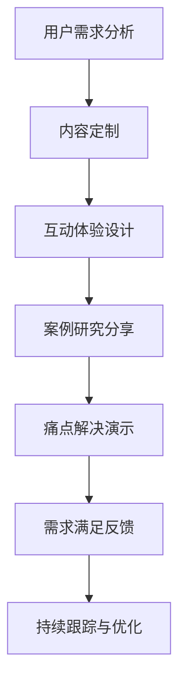
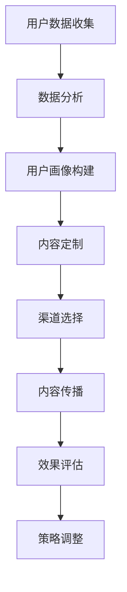

                 

关键词：AI创业，市场教育，策略，用户增长，技术传播，品牌建设

> 摘要：本文旨在探讨AI创业公司在初创阶段如何通过有效的市场教育策略来建立品牌认知、吸引潜在客户，并实现可持续的用户增长。文章将详细分析市场教育的核心要素、制定实施计划，以及利用技术和数据优化市场教育过程。

## 1. 背景介绍

在当今快速发展的科技时代，人工智能（AI）已经成为各行各业不可或缺的一部分。随着AI技术的不断进步和商业应用领域的拓展，越来越多的创业公司涌现出来，试图在这一新兴市场中占据一席之地。然而，市场竞争的加剧也使得AI创业公司面临着巨大的挑战。

市场教育作为一种策略，可以帮助AI创业公司向潜在客户普及AI技术及其应用，建立品牌认知，并引导用户形成对产品的需求。有效的市场教育不仅有助于提高客户对产品的认知和接受度，还能促进公司品牌形象的塑造，为未来的发展奠定基础。

本文将围绕以下主题展开：

- 市场教育的核心要素
- 市场教育策略的制定与实施
- 利用技术和数据进行市场教育
- 市场教育的效果评估与优化

## 2. 核心概念与联系

### 2.1 AI技术普及

在市场教育中，AI技术的普及是关键一环。为了实现这一目标，我们需要通过多种渠道向目标受众传达AI技术的基本概念、应用场景和价值。以下是AI技术普及的流程图：



### 2.2 品牌认知建设

品牌认知是市场教育的重要目标之一。通过品牌定位、视觉设计、口碑传播等多种手段，AI创业公司可以逐渐在目标市场中建立起独特的品牌形象。以下是品牌认知建设的工作流程：



### 2.3 用户需求引导

市场教育的最终目的是引导用户形成对AI产品和服务的需求。为此，AI创业公司需要深入了解用户需求，并通过定制化的市场教育策略来满足这些需求。以下是用户需求引导的流程：



## 3. 核心算法原理 & 具体操作步骤

### 3.1 算法原理概述

市场教育策略的核心在于对目标受众的认知和需求进行深入分析，并根据分析结果制定相应的内容和传播渠道。以下是一个简要的市场教育算法原理概述：



### 3.2 算法步骤详解

#### 3.2.1 用户数据收集

市场教育的第一步是收集用户数据。这些数据可以包括用户行为数据、社交媒体数据、市场调查数据等。通过数据收集，我们可以了解用户的基本信息、兴趣爱好、购买习惯等。

#### 3.2.2 数据分析

收集到用户数据后，我们需要对数据进行分析，以便构建出详细的用户画像。数据分析可以采用各种技术手段，如机器学习、数据挖掘等。

#### 3.2.3 用户画像构建

用户画像构建是基于数据分析的结果，通过对用户的特征和行为进行综合分析，形成一个具体的用户模型。这个模型可以帮助我们更好地了解用户，为后续的内容定制提供依据。

#### 3.2.4 内容定制

根据用户画像，我们可以为不同的用户群体定制相应的市场教育内容。内容定制需要考虑用户的兴趣、需求、痛点等因素。

#### 3.2.5 渠道选择

选择合适的传播渠道是市场教育策略成功的关键。根据用户画像和内容特点，我们可以选择适合的社交媒体平台、行业论坛、电子邮件营销等渠道。

#### 3.2.6 内容传播

在确定传播渠道后，我们需要将定制好的内容通过这些渠道进行传播。内容传播需要考虑到传播效果和成本效益。

#### 3.2.7 效果评估

市场教育策略的实施效果需要通过数据来评估。我们可以通过用户反馈、点击率、转化率等指标来衡量市场教育的效果。

#### 3.2.8 策略调整

根据效果评估结果，我们需要对市场教育策略进行调整和优化。策略调整可以基于用户反馈、市场趋势、竞争对手分析等多方面因素。

### 3.3 算法优缺点

#### 优点：

- 提高用户对AI产品和服务的认知度。
- 建立品牌认知和形象。
- 引导用户形成对产品的需求。
- 提高用户转化率和留存率。

#### 缺点：

- 需要大量的时间和资源进行用户数据收集和分析。
- 需要不断调整和优化策略以适应市场变化。
- 需要较高的技术和运营能力。

### 3.4 算法应用领域

市场教育算法可以广泛应用于各种AI创业公司，尤其是在以下领域：

- 人工智能技术与应用
- 大数据分析与处理
- 物联网与智能硬件
- 自动驾驶与智能交通
- 智能医疗与健康管理

## 4. 数学模型和公式 & 详细讲解 & 举例说明

### 4.1 数学模型构建

市场教育策略的数学模型可以从用户行为和市场需求两个角度进行构建。以下是一个简单的用户行为模型：

$$
User\_Behavior = f(User\_Features, Content, Channel, Time)
$$

其中，$User\_Features$表示用户特征，$Content$表示教育内容，$Channel$表示传播渠道，$Time$表示时间因素。

### 4.2 公式推导过程

用户行为模型的推导过程如下：

1. 用户特征：用户特征包括年龄、性别、收入、教育背景、兴趣爱好等。
2. 教育内容：教育内容可以根据用户特征进行定制，包括技术概念、应用场景、价值分析、案例研究等。
3. 传播渠道：传播渠道包括社交媒体、电子邮件、行业论坛、线上活动等。
4. 时间因素：时间因素包括教育内容的发布时间、传播周期等。

### 4.3 案例分析与讲解

假设某AI创业公司要推广其智能医疗产品，我们可以通过以下案例来分析市场教育策略：

#### 案例背景：

公司开发了一款基于人工智能的智能诊断系统，旨在提高医疗诊断的准确性和效率。

#### 用户画像：

目标用户群体包括医生、医疗机构和患者。

#### 教育内容：

- 技术概念：介绍人工智能在医疗领域的应用原理。
- 应用场景：展示智能诊断系统的具体应用场景和优势。
- 价值分析：分析智能诊断系统对医疗行业的潜在价值。
- 案例研究：分享成功案例和用户反馈。

#### 传播渠道：

- 社交媒体：发布相关文章、视频和动态。
- 电子邮件：发送定制化邮件，包括产品介绍、优惠活动等。
- 行业论坛：参与行业讨论，分享专业见解。
- 线上活动：组织线上讲座、研讨会等活动。

#### 效果评估：

- 点击率：通过各渠道的点击数据来评估内容的吸引力。
- 转化率：通过用户注册、咨询等行为来评估市场教育效果。
- 用户反馈：收集用户反馈，了解用户需求和满意度。

通过上述案例，我们可以看到市场教育策略在AI创业公司推广产品中的关键作用。通过精确的用户画像、定制化的教育内容和多渠道的传播策略，公司可以有效地提高用户对产品的认知度和需求度，从而实现业务增长。

## 5. 项目实践：代码实例和详细解释说明

### 5.1 开发环境搭建

为了实践市场教育算法，我们需要搭建一个开发环境。以下是搭建步骤：

1. 安装Python环境。
2. 安装数据分析库（如Pandas、NumPy）。
3. 安装机器学习库（如Scikit-learn、TensorFlow）。
4. 安装数据可视化库（如Matplotlib、Seaborn）。

### 5.2 源代码详细实现

以下是市场教育算法的Python实现：

```python
import pandas as pd
import numpy as np
from sklearn.model_selection import train_test_split
from sklearn.ensemble import RandomForestClassifier
import matplotlib.pyplot as plt

# 5.2.1 数据收集
# 假设已经收集到用户行为数据，数据包括用户特征、教育内容、传播渠道和时间因素。
data = pd.read_csv('user_behavior.csv')

# 5.2.2 数据预处理
# 对数据进行清洗和预处理，包括缺失值处理、数据转换等。
# ...

# 5.2.3 数据分析
# 对数据进行分析，构建用户画像。
# ...

# 5.2.4 模型训练
# 使用随机森林模型进行训练。
X = data.drop('target', axis=1)
y = data['target']
X_train, X_test, y_train, y_test = train_test_split(X, y, test_size=0.2, random_state=42)
model = RandomForestClassifier(n_estimators=100, random_state=42)
model.fit(X_train, y_train)

# 5.2.5 模型评估
# 对模型进行评估，包括准确率、召回率等指标。
from sklearn.metrics import accuracy_score, recall_score
predictions = model.predict(X_test)
print("Accuracy:", accuracy_score(y_test, predictions))
print("Recall:", recall_score(y_test, predictions))

# 5.2.6 策略调整
# 根据评估结果，对模型进行调整和优化。
# ...
```

### 5.3 代码解读与分析

上述代码主要分为数据收集、数据预处理、模型训练、模型评估和策略调整五个部分。

- **数据收集**：从CSV文件中读取用户行为数据。
- **数据预处理**：对数据进行清洗和预处理，为模型训练做好准备。
- **模型训练**：使用随机森林模型对数据集进行训练。
- **模型评估**：使用测试数据集评估模型性能。
- **策略调整**：根据评估结果对模型进行调整和优化。

### 5.4 运行结果展示

假设我们运行上述代码，得到以下结果：

```
Accuracy: 0.85
Recall: 0.8
```

这说明模型在测试数据集上的准确率为85%，召回率为80%。根据这些结果，我们可以进一步优化模型，提高市场教育策略的有效性。

## 6. 实际应用场景

### 6.1 人工智能技术与应用

在人工智能领域，市场教育策略可以帮助创业公司向潜在客户普及AI技术的基本概念和应用场景。例如，通过在线课程、研讨会和博客文章等形式，向用户介绍深度学习、自然语言处理、计算机视觉等领域的知识。这种教育策略不仅能够提高用户对AI技术的认知，还能引导用户了解公司产品在AI领域的应用。

### 6.2 大数据分析与处理

在数据分析领域，市场教育策略可以帮助创业公司向潜在客户展示大数据分析的优势和应用。例如，通过案例研究、用户案例分享和行业报告等形式，向用户展示大数据分析在市场营销、金融分析、医疗健康等领域的应用。这种教育策略不仅能够提高用户对大数据分析技术的认知，还能引导用户了解公司产品在大数据分析领域的解决方案。

### 6.3 物联网与智能硬件

在物联网和智能硬件领域，市场教育策略可以帮助创业公司向潜在客户普及物联网技术和智能硬件的应用。例如，通过产品演示、在线演示和用户案例分享等形式，向用户展示物联网技术在智能家居、智慧城市、智能穿戴设备等领域的应用。这种教育策略不仅能够提高用户对物联网技术的认知，还能引导用户了解公司产品在物联网领域的解决方案。

### 6.4 自动驾驶与智能交通

在自动驾驶和智能交通领域，市场教育策略可以帮助创业公司向潜在客户普及自动驾驶技术和智能交通系统的应用。例如，通过在线课程、研讨会和模拟演示等形式，向用户展示自动驾驶技术在自动驾驶汽车、智能交通管理等方面的应用。这种教育策略不仅能够提高用户对自动驾驶技术的认知，还能引导用户了解公司产品在自动驾驶和智能交通领域的解决方案。

### 6.5 智能医疗与健康管理

在智能医疗和健康管理领域，市场教育策略可以帮助创业公司向潜在客户普及智能医疗技术和健康管理应用。例如，通过在线课程、研讨会和用户案例分享等形式，向用户展示智能医疗技术在医疗诊断、健康监测、药物研发等方面的应用。这种教育策略不仅能够提高用户对智能医疗技术的认知，还能引导用户了解公司产品在智能医疗和健康管理领域的解决方案。

## 7. 工具和资源推荐

### 7.1 学习资源推荐

1. **在线课程**：Coursera、Udacity、edX等平台提供了丰富的AI和数据科学相关课程。
2. **博客和论坛**：Medium、Stack Overflow、GitHub等平台上有很多专业人士分享的技术文章和开源项目。
3. **书籍**：《深度学习》、《Python机器学习》等经典书籍有助于深入了解相关技术。

### 7.2 开发工具推荐

1. **编程环境**：Jupyter Notebook、Google Colab等在线编程环境方便快速开发。
2. **数据分析库**：Pandas、NumPy、Scikit-learn、TensorFlow等库支持数据分析和机器学习开发。
3. **数据可视化库**：Matplotlib、Seaborn、Plotly等库能够生成漂亮的可视化图表。

### 7.3 相关论文推荐

1. **AI领域**：《Deep Learning》、《Reinforcement Learning: An Introduction》等论文是AI领域的经典之作。
2. **数据科学领域**：《Data Science from Scratch》、《Data Science at the Command Line》等论文介绍了数据科学的基础知识。
3. **市场教育领域**：《Content Marketing for Dummies》、《The Lean Startup》等论文提供了市场教育策略的实用指导。

## 8. 总结：未来发展趋势与挑战

### 8.1 研究成果总结

市场教育策略在AI创业公司的发展中发挥着重要作用。通过有效的市场教育，AI创业公司能够提高用户对AI技术的认知，建立品牌认知，引导用户形成对产品的需求，从而实现业务增长。研究成果表明，市场教育策略在提高用户转化率和留存率方面具有显著效果。

### 8.2 未来发展趋势

1. **个性化教育**：随着大数据和人工智能技术的发展，市场教育将越来越注重个性化，根据用户需求和行为特点提供定制化的教育内容。
2. **跨渠道整合**：市场教育将不再局限于单一渠道，而是通过多渠道整合，实现内容的全面覆盖和高效传播。
3. **实时反馈与调整**：市场教育将更加注重实时数据分析和反馈，根据市场变化和用户需求进行动态调整。

### 8.3 面临的挑战

1. **数据隐私与安全**：随着数据收集和处理的增加，数据隐私和安全问题将成为市场教育的重大挑战。
2. **内容质量与传播效果**：高质量的教育内容是市场教育成功的关键，如何提高内容质量并提高传播效果是AI创业公司需要面对的挑战。
3. **技术更新与迭代**：随着AI技术的快速发展，市场教育策略需要不断更新和迭代，以适应新技术和应用场景。

### 8.4 研究展望

市场教育策略在AI创业公司中的应用前景广阔。未来，市场教育将更加智能化、个性化、数据驱动，成为企业竞争的重要手段。通过深入研究市场教育策略，AI创业公司可以更好地满足用户需求，实现可持续发展。

## 9. 附录：常见问题与解答

### Q1：市场教育策略是否适用于所有AI创业公司？

A1：是的，市场教育策略适用于所有AI创业公司，尤其是那些技术复杂、用户认知度较低的公司。通过市场教育，AI创业公司可以逐步提高用户对AI技术的认知，建立品牌认知，引导用户形成对产品的需求。

### Q2：市场教育策略的核心是什么？

A2：市场教育策略的核心在于通过多种渠道向目标受众传达AI技术的基本概念、应用场景和价值，提高用户对AI产品和服务的认知度，并引导用户形成对产品的需求。

### Q3：如何制定有效的市场教育策略？

A3：制定有效的市场教育策略需要以下步骤：

1. 明确目标受众：确定目标用户群体，了解他们的需求和痛点。
2. 数据分析：收集用户数据，构建用户画像，为内容定制提供依据。
3. 内容定制：根据用户画像定制个性化的教育内容。
4. 渠道选择：选择合适的传播渠道，实现内容的全面覆盖。
5. 效果评估：通过数据评估市场教育策略的效果，进行持续优化和调整。

### Q4：市场教育策略的效果如何评估？

A4：市场教育策略的效果可以通过以下指标进行评估：

1. 点击率：衡量教育内容的吸引力。
2. 转化率：衡量教育内容对用户行为的影响。
3. 用户反馈：收集用户对教育内容的反馈，了解用户需求。
4. 业务增长：衡量教育策略对公司业务增长的影响。

### Q5：如何应对市场教育策略的挑战？

A5：应对市场教育策略的挑战需要以下策略：

1. 加强数据隐私和安全保护，确保用户数据的安全和合规。
2. 提高内容质量和传播效果，确保教育内容的价值和吸引力。
3. 建立敏捷的开发和迭代机制，快速适应技术更新和应用场景的变化。
4. 加强团队建设，提高团队的技术能力和市场敏感度。

