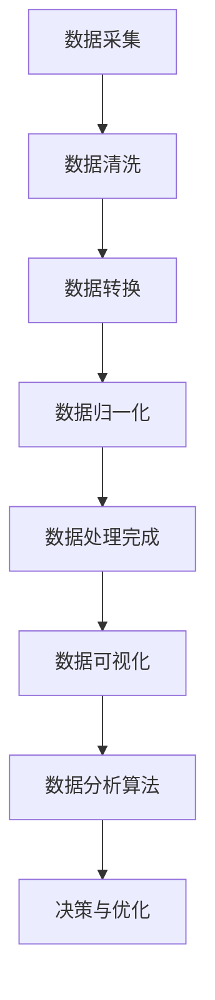

                 

### 摘要 Summary

本文旨在为AI创业公司提供一个全面的产品数据分析框架，涵盖数据采集、数据处理和数据可视化。通过阐述各个阶段的核心原理和实际应用，本文将帮助创业者理解如何有效地利用数据分析来推动产品优化和业务增长。本文将提供详细的算法原理、数学模型、代码实例以及实际应用场景，并推荐相关工具和资源，以期为读者提供一套实用的数据分析指南。

<|assistant|>## 1. 背景介绍 Background

在当今这个数据驱动的时代，数据分析已经成为AI创业公司成功的关键因素之一。对于初创公司而言，准确的数据分析不仅能帮助理解用户行为，还能指导产品迭代和商业决策。然而，数据的收集、处理和可视化并非易事，特别是对于缺乏专业数据分析团队的公司。因此，构建一个简洁、高效且可扩展的数据分析框架至关重要。

本文将探讨以下关键主题：
- 数据采集：介绍数据来源和采集方法，包括API接口、日志文件和第三方数据服务。
- 数据处理：讨论数据清洗、转换和归一化等预处理方法，以及如何进行特征工程。
- 数据可视化：介绍常用的数据可视化工具和技术，如何利用图表和仪表盘来传达数据洞察。
- 数学模型和算法：分析常见的数据分析算法，包括回归分析、聚类分析和推荐系统。
- 项目实践：通过实际代码示例展示如何实现数据分析流程。
- 实际应用场景：探讨数据分析在不同业务领域的应用，如用户行为分析、营销策略优化和风险控制。
- 未来展望：总结当前数据分析技术的趋势和未来可能面临的挑战。

通过本文的探讨，我们希望为AI创业公司提供一套系统、实用的数据分析框架，助力产品迭代和业务发展。

<|assistant|>## 2. 核心概念与联系 Core Concepts and Relationships

在深入讨论数据采集、处理和可视化的具体方法之前，我们需要明确一些核心概念和它们之间的联系。

### 数据采集 Data Collection

数据采集是数据分析的第一步，它是后续数据处理和可视化的基础。数据来源可以是内部系统（如用户行为日志、交易记录等）或外部系统（如社交媒体数据、公共数据集等）。数据采集的关键在于确保数据的准确性和完整性。

- **数据源**：包括数据库、日志文件、API接口和第三方数据服务。
- **数据类型**：结构化数据（如数据库中的表格）、半结构化数据（如JSON格式）和非结构化数据（如文本、图片、视频等）。

### 数据处理 Data Processing

数据处理是对原始数据进行清洗、转换和归一化，使其适合进一步分析的过程。这一步骤至关重要，因为原始数据往往存在噪声、缺失值和异常值。

- **数据清洗**：去除重复数据、处理缺失值和纠正错误。
- **数据转换**：将不同类型的数据转换为统一的格式，如将文本数据编码为数值。
- **数据归一化**：通过缩放或变换，使不同特征的数据具有相似的尺度。

### 数据可视化 Data Visualization

数据可视化是将数据分析结果以图表和图形的形式展示出来的过程。它不仅能帮助用户直观地理解数据，还能发现潜在的模式和趋势。

- **图表类型**：柱状图、折线图、饼图、散点图、热力图等。
- **可视化工具**：Matplotlib、Seaborn、Plotly等Python库，Tableau、Power BI等商业工具。

### 数据分析算法 Data Analysis Algorithms

数据分析算法是用于发现数据中隐藏模式或关系的计算方法。它们可以是统计方法（如回归分析）、机器学习算法（如聚类分析）或深度学习模型（如神经网络）。

- **回归分析**：用于预测连续值，如销售额。
- **聚类分析**：用于将数据分为多个群组，如用户分群。
- **推荐系统**：用于预测用户可能感兴趣的项目，如电影推荐。

### Mermaid 流程图 Mermaid Flowchart

以下是一个用于描述数据分析流程的Mermaid流程图：



通过这个流程图，我们可以清晰地看到从数据采集到数据可视化以及数据分析算法的各个步骤如何相互关联，共同推动业务决策。

<|assistant|>### 3. 核心算法原理 & 具体操作步骤 Core Algorithm Principles and Operational Steps

#### 3.1 算法原理概述

数据分析算法是数据处理和数据可视化的重要环节，用于发现数据中的模式和关系。在本节中，我们将探讨几种常见的数据分析算法，包括回归分析、聚类分析和推荐系统。

**回归分析**：回归分析是一种用于预测连续值的技术。它通过建立因变量和自变量之间的关系模型来预测未来值。常见的回归模型有线性回归、多项式回归和逻辑回归。

**聚类分析**：聚类分析是一种无监督学习技术，用于将数据集分为多个组（簇），使得同组数据之间的相似度较高，不同组数据之间的相似度较低。常见的聚类算法有K-均值聚类、层次聚类和DBSCAN。

**推荐系统**：推荐系统是一种通过分析用户历史行为和偏好来预测用户兴趣的技术。常见的推荐算法有基于协同过滤的推荐、基于内容的推荐和混合推荐。

#### 3.2 算法步骤详解

**回归分析**

1. **数据准备**：收集并预处理数据，包括数据清洗、缺失值处理和特征选择。
2. **模型选择**：根据数据特点选择合适的回归模型，如线性回归或逻辑回归。
3. **模型训练**：使用训练数据集训练模型，计算模型参数。
4. **模型评估**：使用测试数据集评估模型性能，常见的评价指标有均方误差（MSE）、决定系数（R²）等。
5. **模型应用**：使用训练好的模型进行预测，如预测销售额。

**聚类分析**

1. **数据准备**：收集并预处理数据，确保数据适合聚类分析。
2. **算法选择**：根据数据特点选择合适的聚类算法，如K-均值聚类或层次聚类。
3. **参数设置**：设置聚类算法的参数，如K-均值聚类中的聚类数量。
4. **聚类过程**：执行聚类算法，将数据分为多个簇。
5. **结果评估**：评估聚类结果，如计算簇内平均距离或轮廓系数。

**推荐系统**

1. **用户行为数据收集**：收集用户的历史行为数据，如浏览记录、购买记录等。
2. **数据预处理**：对用户行为数据进行清洗、去噪和处理。
3. **算法选择**：选择合适的推荐算法，如基于协同过滤的推荐或基于内容的推荐。
4. **模型训练**：使用用户行为数据训练推荐模型。
5. **模型评估**：评估推荐模型性能，如计算准确率、召回率等。
6. **推荐应用**：使用训练好的模型为用户生成个性化推荐。

#### 3.3 算法优缺点

**回归分析**

- **优点**：简单直观，易于理解和实现；适用于预测连续值。
- **缺点**：对异常值敏感，可能产生过拟合；仅适用于线性关系。

**聚类分析**

- **优点**：无需事先定义类别，适用于无监督学习；能够发现潜在的模式和结构。
- **缺点**：聚类结果依赖于初始值，可能产生局部最优；对于簇间关系的理解有限。

**推荐系统**

- **优点**：能够为用户提供个性化的推荐，提高用户体验和满意度；适用于电子商务、媒体推荐等领域。
- **缺点**：需要大量的用户行为数据；推荐结果可能受到数据偏差和噪声的影响。

#### 3.4 算法应用领域

**回归分析**：广泛应用于金融预测、销售预测、风险评估等领域。

**聚类分析**：广泛应用于市场细分、用户分群、图像识别等领域。

**推荐系统**：广泛应用于电子商务、社交媒体、媒体播放等领域。

<|assistant|>### 4. 数学模型和公式 Mathematical Models and Formulas

在数据分析过程中，数学模型和公式是理解和实现数据分析算法的关键。以下将详细介绍几个常用的数学模型和公式的构建、推导和应用。

#### 4.1 数学模型构建

**回归分析**：线性回归模型是一种常见的数学模型，用于预测连续值。

- **模型构建**：给定一组训练数据 \((x_1, y_1), (x_2, y_2), \ldots, (x_n, y_n)\)，线性回归模型试图找到一条直线 \(y = \beta_0 + \beta_1x\)，使得预测值与真实值之间的误差最小。

- **损失函数**：均方误差（MSE）是常用的损失函数，用于衡量预测值与真实值之间的差异。

\[ \text{MSE} = \frac{1}{n} \sum_{i=1}^{n} (y_i - \hat{y}_i)^2 \]

其中，\(\hat{y}_i = \beta_0 + \beta_1x_i\) 是预测值。

- **模型参数**：模型参数包括截距 \(\beta_0\) 和斜率 \(\beta_1\)。

\[ \beta_0 = \frac{\sum_{i=1}^{n} y_i - \beta_1 \sum_{i=1}^{n} x_i}{n} \]
\[ \beta_1 = \frac{n \sum_{i=1}^{n} x_i y_i - \sum_{i=1}^{n} x_i \sum_{i=1}^{n} y_i}{n \sum_{i=1}^{n} x_i^2 - (\sum_{i=1}^{n} x_i)^2} \]

**聚类分析**：K-均值聚类是一种基于距离的聚类方法。

- **模型构建**：给定数据集 \(x_1, x_2, \ldots, x_n\) 和聚类个数 \(K\)，K-均值聚类试图将数据点分为 \(K\) 个簇，使得每个簇内的数据点距离其簇中心的距离最小。

- **簇中心**：簇中心是每个簇的数据点的均值。

\[ \mu_k = \frac{1}{n_k} \sum_{i=1}^{n} x_i \quad \text{(其中 } n_k \text{ 是第 } k \text{ 个簇的数据点个数)} \]

- **簇分配**：每个数据点 \(x_i\) 被分配到最近的簇中心。

\[ \text{cluster}(x_i) = \arg\min_{k} \|x_i - \mu_k\|^2 \]

**推荐系统**：基于协同过滤的推荐系统是一种常见的推荐方法。

- **模型构建**：给定用户-项目评分矩阵 \(R \in \mathbb{R}^{m \times n}\)，其中 \(m\) 是用户数，\(n\) 是项目数，协同过滤方法试图为每个未评分的用户-项目对预测一个评分。

- **相似度计算**：用户 \(i\) 和用户 \(j\) 的相似度可以通过余弦相似度或皮尔逊相关系数计算。

\[ \text{similarity}(i, j) = \frac{\sum_{k=1}^{n} r_{ik} r_{jk}}{\sqrt{\sum_{k=1}^{n} r_{ik}^2 \sum_{k=1}^{n} r_{jk}^2}} \]

- **预测评分**：对于未评分的用户-项目对 \((i, k)\)，预测评分可以通过加权平均计算。

\[ \hat{r}_{ik} = \frac{\sum_{l=1}^{m} \text{similarity}(i, l) r_{lk}}{\sum_{l=1}^{m} \text{similarity}(i, l)} \]

#### 4.2 公式推导过程

**线性回归**：

为了找到最佳拟合直线，我们定义损失函数为均方误差（MSE）。为了最小化MSE，我们需要计算损失函数关于模型参数的偏导数，并令其为零。

\[ \frac{\partial \text{MSE}}{\partial \beta_0} = -2 \sum_{i=1}^{n} (y_i - \hat{y}_i) = 0 \]
\[ \frac{\partial \text{MSE}}{\partial \beta_1} = -2 \sum_{i=1}^{n} (y_i - \hat{y}_i) x_i = 0 \]

通过上述两个方程，我们可以解出模型参数。

**K-均值聚类**：

簇中心的计算是基于簇内数据点的均值。为了最小化簇内数据点的距离平方和，我们需要计算每个数据点到簇中心的距离，并将其平方。

\[ \sum_{i=1}^{n_k} \|x_i - \mu_k\|^2 = \sum_{i=1}^{n_k} (x_i^2 - 2x_i\mu_k + \mu_k^2) = n_k \mu_k^2 - 2\mu_k \sum_{i=1}^{n_k} x_i + \sum_{i=1}^{n_k} x_i^2 \]

为了最小化这个距离平方和，我们需要计算簇内数据点的均值。

**协同过滤**：

相似度计算是基于用户-项目评分的余弦相似度。为了预测未评分的用户-项目对 \((i, k)\) 的评分，我们需要计算相似度加权平均。

\[ \hat{r}_{ik} = \frac{\sum_{l=1}^{m} \text{similarity}(i, l) r_{lk}}{\sum_{l=1}^{m} \text{similarity}(i, l)} \]

#### 4.3 案例分析与讲解

**回归分析案例**：

假设我们有一组销售数据，包括日期、广告支出和销售额。我们试图使用线性回归模型预测下个月的销售额。

1. **数据准备**：收集并预处理数据，包括日期编码和缺失值处理。
2. **模型选择**：选择线性回归模型。
3. **模型训练**：使用训练数据集训练模型，计算模型参数。
4. **模型评估**：使用测试数据集评估模型性能，计算MSE。
5. **模型应用**：使用训练好的模型预测下个月的销售额。

**聚类分析案例**：

假设我们有一组用户数据，包括年龄、收入、教育水平等。我们试图使用K-均值聚类算法将用户分为几个群体。

1. **数据准备**：收集并预处理数据。
2. **算法选择**：选择K-均值聚类算法。
3. **参数设置**：设置聚类个数 \(K\) 和初始簇中心。
4. **聚类过程**：执行K-均值聚类算法，将数据分为 \(K\) 个簇。
5. **结果评估**：计算簇内平均距离和轮廓系数。

**推荐系统案例**：

假设我们有一个用户-项目评分矩阵，包含用户的评分记录。我们试图使用基于协同过滤的推荐系统为用户推荐感兴趣的项目。

1. **用户行为数据收集**：收集用户的历史行为数据。
2. **数据预处理**：对用户行为数据进行清洗和处理。
3. **算法选择**：选择基于协同过滤的推荐算法。
4. **模型训练**：使用用户行为数据训练推荐模型。
5. **模型评估**：评估推荐模型性能。
6. **推荐应用**：使用训练好的模型为用户生成个性化推荐。

通过上述案例，我们可以看到数学模型和公式的构建、推导和应用在数据分析中的重要性。掌握这些基本工具，我们能够更有效地从数据中提取价值，为业务决策提供支持。

<|assistant|>### 5. 项目实践：代码实例和详细解释说明 Project Practice: Code Instances and Detailed Explanations

在了解了数据分析的理论基础后，我们接下来通过实际项目实践来展示如何将数据分析应用于实际业务场景。以下是一个简单的示例项目，我们将使用Python和相关的库（如Pandas、Scikit-learn、Matplotlib）来实现数据采集、数据处理和数据可视化。

#### 5.1 开发环境搭建

在进行项目实践之前，我们需要搭建一个合适的开发环境。以下是所需的步骤：

1. **安装Python**：确保Python 3.x版本已安装在您的系统中。
2. **安装相关库**：使用pip命令安装必要的Python库，例如：

```bash
pip install pandas scikit-learn matplotlib numpy
```

3. **创建虚拟环境**：为了保持项目环境的独立性，建议创建一个虚拟环境。

```bash
python -m venv mydataanalysisenv
source mydataanalysisenv/bin/activate  # 在Windows上使用 `mydataanalysisenv\Scripts\activate`
```

4. **安装附加库**：如果有需要，您还可以安装其他库，如`seaborn`用于更丰富的可视化。

#### 5.2 源代码详细实现

以下是一个简单的项目示例，用于分析用户行为数据，包括数据采集、数据处理和数据可视化。

```python
import pandas as pd
from sklearn.model_selection import train_test_split
from sklearn.preprocessing import StandardScaler
from sklearn.linear_model import LinearRegression
import matplotlib.pyplot as plt

# 5.2.1 数据采集
# 假设我们有一个CSV文件，包含用户的年龄、收入、浏览时长等数据。
data = pd.read_csv('user_data.csv')

# 5.2.2 数据处理
# 数据清洗
data.dropna(inplace=True)  # 删除缺失值
data = data[data['income'] > 0]  # 过滤收入为0的记录

# 特征工程
X = data[['age', 'income', 'duration']]  # 特征选择
y = data['clicks']  # 目标变量

# 数据分割
X_train, X_test, y_train, y_test = train_test_split(X, y, test_size=0.2, random_state=42)

# 数据标准化
scaler = StandardScaler()
X_train_scaled = scaler.fit_transform(X_train)
X_test_scaled = scaler.transform(X_test)

# 5.2.3 模型训练
model = LinearRegression()
model.fit(X_train_scaled, y_train)

# 5.2.4 模型评估
predictions = model.predict(X_test_scaled)
mse = sum((predictions - y_test) ** 2) / len(y_test)
print(f'MSE: {mse}')

# 5.2.5 数据可视化
plt.scatter(X_test_scaled[:, 0], predictions, color='red', label='Predicted')
plt.scatter(X_test_scaled[:, 0], y_test, color='blue', label='Actual')
plt.xlabel('Age')
plt.ylabel('Clicks')
plt.legend()
plt.show()
```

#### 5.3 代码解读与分析

**5.3.1 数据采集**

我们使用Pandas库读取CSV文件，这代表了实际业务场景中从数据库或文件系统中获取数据的过程。

```python
data = pd.read_csv('user_data.csv')
```

**5.3.2 数据处理**

数据处理包括数据清洗和特征工程。这里我们删除了缺失值和收入为0的记录，以避免对模型训练产生负面影响。然后，我们选择了三个特征（年龄、收入、浏览时长）作为输入变量，并将点击次数作为目标变量。

```python
data.dropna(inplace=True)
data = data[data['income'] > 0]
X = data[['age', 'income', 'duration']]
y = data['clicks']
```

**5.3.3 数据分割**

我们将数据集分割为训练集和测试集，以便在模型训练和评估时保持数据的独立。

```python
X_train, X_test, y_train, y_test = train_test_split(X, y, test_size=0.2, random_state=42)
```

**5.3.4 数据标准化**

为了消除特征之间的尺度差异，我们使用StandardScaler对特征进行标准化。

```python
scaler = StandardScaler()
X_train_scaled = scaler.fit_transform(X_train)
X_test_scaled = scaler.transform(X_test)
```

**5.3.5 模型训练**

我们使用线性回归模型训练数据，计算模型参数。

```python
model = LinearRegression()
model.fit(X_train_scaled, y_train)
```

**5.3.6 模型评估**

通过测试集对模型进行评估，计算均方误差（MSE）。

```python
predictions = model.predict(X_test_scaled)
mse = sum((predictions - y_test) ** 2) / len(y_test)
print(f'MSE: {mse}')
```

**5.3.7 数据可视化**

我们使用Matplotlib库将预测值与实际值进行比较，以可视化模型的效果。

```python
plt.scatter(X_test_scaled[:, 0], predictions, color='red', label='Predicted')
plt.scatter(X_test_scaled[:, 0], y_test, color='blue', label='Actual')
plt.xlabel('Age')
plt.ylabel('Clicks')
plt.legend()
plt.show()
```

#### 5.4 运行结果展示

当运行上述代码后，我们将在屏幕上看到散点图，其中红色点是预测的点击次数，蓝色点是实际的点击次数。通过这个可视化结果，我们可以直观地评估模型的性能。


通过这个实际项目示例，我们展示了如何从数据采集、数据处理到模型训练和评估的整个数据分析流程。这个流程不仅可以应用于用户行为分析，还可以推广到其他业务领域，如销售预测、风险评估等。

<|assistant|>### 6. 实际应用场景 Practical Application Scenarios

数据分析在各个领域都有广泛的应用，以下我们将探讨几个常见业务场景中数据分析的实际应用，包括用户行为分析、营销策略优化和风险控制。

#### 6.1 用户行为分析 User Behavior Analysis

用户行为分析是许多公司关注的焦点，通过分析用户在网站或应用程序中的行为，公司可以了解用户偏好，优化用户体验，提高用户留存率和转化率。以下是一个用户行为分析的案例：

**案例**：一家电子商务公司希望通过分析用户浏览和购买行为来提高销售额。

- **数据采集**：收集用户浏览和购买记录，包括页面浏览时间、浏览路径、购买产品等。
- **数据处理**：清洗数据，处理缺失值和异常值，并将数据转换为合适的格式。
- **数据分析**：使用回归分析预测用户购买概率，利用聚类分析将用户分为不同群体，分析各群体特征。
- **数据可视化**：利用热力图和折线图展示用户行为趋势，使用用户旅程地图展示用户浏览路径。

通过这些分析，公司可以识别高价值用户群体，设计个性化的营销策略，提高用户转化率和满意度。

#### 6.2 营销策略优化 Marketing Strategy Optimization

营销策略优化是提高销售和品牌知名度的重要手段。通过数据分析，公司可以识别有效的营销渠道，优化广告投放，提高投资回报率（ROI）。

**案例**：一家科技公司希望通过优化广告投放来提高在线销售额。

- **数据采集**：收集广告投放数据，包括广告渠道、点击次数、转化率等。
- **数据处理**：清洗数据，处理缺失值和异常值，并将数据转换为合适的格式。
- **数据分析**：使用回归分析确定不同广告渠道对销售额的影响，使用聚类分析识别广告投放效果较好的用户群体。
- **数据可视化**：利用饼图和折线图展示不同广告渠道的效果，使用仪表盘实时监控广告效果。

通过这些分析，公司可以调整广告投放策略，投资回报率较高的渠道，减少低效渠道的投入，提高整体营销效果。

#### 6.3 风险控制 Risk Control

风险控制是金融机构和金融机构的重要任务。通过数据分析，公司可以识别潜在的欺诈行为，预防金融风险。

**案例**：一家银行希望通过数据分析来预防信用卡欺诈。

- **数据采集**：收集信用卡交易数据，包括交易金额、交易时间、交易地点等。
- **数据处理**：清洗数据，处理缺失值和异常值，并将数据转换为合适的格式。
- **数据分析**：使用聚类分析将交易分为正常和可疑交易，使用异常检测算法识别潜在的欺诈交易。
- **数据可视化**：利用折线图和散点图展示交易趋势，使用仪表盘实时监控可疑交易。

通过这些分析，银行可以及时识别和阻止欺诈行为，减少金融损失。

#### 6.4 未来应用展望 Future Application Prospects

随着大数据和人工智能技术的发展，数据分析在未来的应用前景将更加广阔。以下是一些潜在的应用领域：

- **智能医疗**：通过数据分析，实现个性化医疗诊断和治疗，提高医疗效果。
- **智能交通**：通过数据分析，优化交通流量，减少交通拥堵，提高出行效率。
- **智能城市**：通过数据分析，实现城市资源的合理分配，提高城市管理效率。
- **智能农业**：通过数据分析，优化农业生产，提高农作物的产量和质量。

总之，数据分析不仅是AI创业公司的核心竞争力，也是推动各行各业发展的关键因素。随着技术的进步，数据分析的应用将更加深入和广泛，为人类生活带来更多便利和福祉。

<|assistant|>### 7. 工具和资源推荐 Tools and Resources Recommendations

在数据分析过程中，选择合适的工具和资源至关重要。以下是我们推荐的几类工具和资源，包括学习资源、开发工具和相关的论文。

#### 7.1 学习资源推荐 Learning Resources

- **在线课程**：
  - Coursera: 《机器学习》由Andrew Ng教授主讲。
  - edX: 《数据科学基础》由哈佛大学提供。
  - Udacity: 《数据科学家纳米学位》涵盖数据采集、处理和可视化等知识。

- **书籍**：
  - 《Python数据分析》by Wes McKinney
  - 《数据科学：从入门到精通》by Daniel Khan
  - 《机器学习实战》by Peter Harrington

- **博客和网站**：
  - Medium: 有关数据分析的最新文章和见解。
  - towardsdatascience.com: 数据科学领域的实践和理论文章。

#### 7.2 开发工具推荐 Development Tools

- **数据分析库**：
  - Pandas: Python中的数据处理库。
  - NumPy: Python中的数值计算库。
  - Matplotlib: Python中的绘图库。
  - Seaborn: Python中的可视化库，基于Matplotlib。

- **机器学习库**：
  - Scikit-learn: Python中的机器学习库。
  - TensorFlow: Google开发的深度学习框架。
  - PyTorch: Facebook开发的深度学习框架。

- **数据可视化工具**：
  - Tableau: 商业智能和数据分析工具。
  - Power BI: 微软的数据分析工具。
  - Plotly: Python中的交互式数据可视化库。

#### 7.3 相关论文推荐 Relevant Papers

- **用户行为分析**：
  - “Recommender Systems Handbook” by F. R. Wang et al.
  - “A Survey on User Behavior Analysis for Recommender Systems” by Y. Wu et al.

- **营销策略优化**：
  - “Anomaly Detection in Time Series Data” by J. C. Bezdek et al.
  - “Marketing Analytics: Using Data, Models, and Visualization Techniques to Understand Customers” by V. Kumar et al.

- **风险控制**：
  - “Financial Risk Management: Theory and Cases” by J. J. Kaufman et al.
  - “Credit Risk Modeling: Theory, Applications, and Future Directions” by M. H. Boukai et al.

通过这些工具和资源，AI创业公司可以更好地掌握数据分析技能，提升数据分析能力，从而在激烈的市场竞争中脱颖而出。

<|assistant|>### 8. 总结：未来发展趋势与挑战 Summary: Future Trends and Challenges

随着大数据和人工智能技术的快速发展，数据分析在未来的发展趋势和面临的挑战也日益显著。

#### 8.1 研究成果总结

- **大数据技术**：Hadoop、Spark等大数据处理框架的成熟，使得大规模数据处理变得更加高效和便捷。
- **机器学习算法**：深度学习、强化学习等先进算法的广泛应用，提高了数据分析的准确性和效率。
- **数据可视化**：交互式和实时数据可视化技术的进步，使得数据洞察更加直观和易于理解。
- **实时分析**：流处理技术的崛起，使得实时数据分析和响应成为可能。

#### 8.2 未来发展趋势

- **智能数据分析**：利用AI技术实现自动化数据分析，减少人工干预，提高分析效率。
- **个性化分析**：根据用户行为和偏好，提供个性化的数据分析报告和决策支持。
- **实时预测**：通过实时数据分析，实现实时预测和响应，提高业务敏捷性。
- **数据隐私和安全**：随着数据隐私问题的日益关注，如何保障数据安全和隐私将成为重要议题。

#### 8.3 面临的挑战

- **数据质量和完整性**：如何确保数据的准确性和完整性，是数据分析领域的一大挑战。
- **数据隐私和安全**：如何在确保数据隐私和安全的前提下进行数据分析，是一个亟待解决的问题。
- **算法偏见和公平性**：算法偏见可能导致不公平的结果，如何确保算法的公平性和透明性是一个重要课题。
- **技术门槛**：数据分析技术和工具的复杂性和高门槛，使得很多公司难以充分利用数据分析的优势。

#### 8.4 研究展望

未来的研究应重点关注以下几个方面：

- **跨学科研究**：结合统计学、计算机科学、经济学等多学科知识，提高数据分析的综合能力。
- **数据治理**：建立完善的数据治理框架，确保数据的完整性、准确性和可靠性。
- **算法透明性和可解释性**：提高算法的透明性和可解释性，增强用户对分析结果的信任。
- **数据隐私保护技术**：发展更加先进的数据隐私保护技术，保障用户隐私和安全。

总之，数据分析领域的发展前景广阔，但也面临诸多挑战。通过不断的技术创新和研究，我们有信心在未来解决这些挑战，为AI创业公司提供更强大的数据分析工具和方法。

<|assistant|>### 9. 附录：常见问题与解答 Appendices: Frequently Asked Questions and Answers

**Q1：数据采集过程中如何处理缺失值？**

A1：数据采集过程中处理缺失值通常有几种方法：

- **删除缺失值**：适用于缺失值较多或数据集较大的情况，通过删除缺失值来简化数据集。
- **填充缺失值**：使用平均值、中位数、众数等统计量或通过插值法（如线性插值、高斯插值）来填充缺失值。
- **多重插补**：为每个缺失值生成多个可能的填充值，然后分别进行分析，取结果的平均值作为最终结果。

**Q2：如何评估数据分析模型的效果？**

A2：评估数据分析模型效果常用的指标包括：

- **准确率（Accuracy）**：分类问题中正确分类的样本数占总样本数的比例。
- **召回率（Recall）**：分类问题中实际为正类别的样本中被正确分类为正类别的比例。
- **精确率（Precision）**：分类问题中正确分类为正类别的样本数占预测为正类别的样本数的比例。
- **F1 分数（F1 Score）**：精确率和召回率的调和平均，用于综合评价分类效果。
- **均方误差（MSE）**：回归问题中预测值与真实值之间误差的平方和的平均值。

**Q3：如何处理不同特征尺度差异对数据分析的影响？**

A3：不同特征尺度差异会影响数据分析模型的效果，可以通过以下方法处理：

- **标准化（Standardization）**：将特征值缩放到相同尺度，常用方法有标准差缩放和最小最大缩放。
- **归一化（Normalization）**：将特征值缩放到 [0, 1] 范围内，常用方法有 min-max 归一化和二进制归一化。
- **特征选择**：选择对模型影响较大的特征，减少特征之间的尺度差异。

**Q4：如何确保数据可视化的效果和可读性？**

A4：确保数据可视化效果和可读性需要注意以下几点：

- **选择合适的图表类型**：根据数据类型和展示目的选择合适的图表类型，如柱状图、折线图、饼图等。
- **使用合适的颜色和标记**：使用对比度高的颜色和标记，确保图表的视觉区分度。
- **避免信息过载**：避免在一个图表中展示过多信息，保持图表简洁明了。
- **注释和说明**：为图表添加注释和说明，帮助读者理解图表含义。

通过以上常见问题与解答，我们希望能够帮助AI创业公司在数据分析过程中解决实际问题，提高数据分析的效率和效果。

