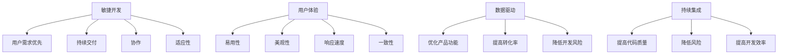

                 

关键词：AI创业公司、产品迭代、策略、敏捷开发、用户体验、持续集成、数据驱动、人工智能

> 摘要：本文将探讨AI创业公司在产品迭代过程中需要遵循的策略。通过分析敏捷开发、用户体验、数据驱动、持续集成等关键因素，为初创公司提供有针对性的建议，以实现快速迭代、高效创新，并最终赢得市场。

## 1. 背景介绍

在当今快速发展的科技时代，人工智能（AI）已经成为企业提升竞争力的关键因素。随着AI技术的不断成熟，越来越多的创业公司投身于这个领域，希望通过创新的产品和服务抓住市场机遇。然而，AI创业公司在产品迭代过程中面临着诸多挑战，如技术复杂度高、市场需求变化快、竞争激烈等。为了在激烈的市场竞争中脱颖而出，AI创业公司需要制定一套有效的产品迭代策略。

本文将从以下几个方面展开讨论：

1. **敏捷开发**：探讨如何通过敏捷开发方法实现快速迭代和持续改进。
2. **用户体验**：分析用户体验在产品迭代中的重要性，并提供优化策略。
3. **数据驱动**：阐述数据驱动开发在AI创业公司中的实践方法。
4. **持续集成**：介绍持续集成的重要性及其在AI创业公司中的应用。
5. **未来应用展望**：预测AI创业公司在产品迭代方面的未来发展趋势。

## 2. 核心概念与联系

### 2.1. 敏捷开发

敏捷开发是一种以人为核心、迭代、循序渐进的开发方法。其核心理念包括：

- **用户需求优先**：用户需求是驱动产品开发的核心。
- **持续交付**：持续交付是敏捷开发的重要目标，意味着在开发过程中不断将功能交付给用户。
- **协作**：强调团队成员之间的沟通和协作。
- **适应性**：面对需求变化，敏捷开发能够迅速调整。

### 2.2. 用户体验

用户体验（UX）是指用户在使用产品过程中的感受和体验。一个优秀的产品必须具备良好的用户体验，才能赢得用户的喜爱。用户体验的要素包括：

- **易用性**：用户能够轻松地使用产品，无需过多的学习和指导。
- **美观性**：产品界面美观，符合设计原则。
- **响应速度**：产品响应速度快，提高用户满意度。
- **一致性**：产品界面和交互元素的一致性，降低用户的学习成本。

### 2.3. 数据驱动

数据驱动开发是指通过数据分析和用户反馈来指导产品开发。这种方法可以帮助AI创业公司：

- **优化产品功能**：根据用户数据，调整和优化产品的功能和界面。
- **提高转化率**：通过数据分析，找到提高用户转化率的策略。
- **降低开发风险**：通过数据预测市场需求，降低开发风险。

### 2.4. 持续集成

持续集成（CI）是一种软件开发实践，通过将开发过程中的代码定期合并到主干分支，并及时发现和解决冲突。持续集成的好处包括：

- **提高代码质量**：及时发现和修复代码错误。
- **降低风险**：减少代码合并时的风险和冲突。
- **提高开发效率**：通过自动化测试，提高开发效率。

### 2.5. Mermaid 流程图



## 3. 核心算法原理 & 具体操作步骤

### 3.1. 算法原理概述

产品迭代策略的核心在于快速响应市场需求，持续优化产品功能。为此，我们可以采用以下核心算法：

1. **用户反馈分析**：通过收集用户反馈，分析用户需求和痛点。
2. **数据挖掘**：利用机器学习技术，对用户数据进行分析，挖掘潜在的用户需求。
3. **迭代优化**：根据用户反馈和数据挖掘结果，调整和优化产品功能。

### 3.2. 算法步骤详解

1. **用户反馈收集**：通过用户调查、在线反馈、用户行为分析等方式，收集用户反馈。
2. **数据预处理**：对收集到的用户反馈数据进行清洗、去噪、转换等预处理步骤。
3. **用户需求分析**：利用机器学习算法，对预处理后的用户反馈数据进行分析，提取用户需求。
4. **功能迭代优化**：根据用户需求分析结果，调整和优化产品功能。
5. **用户测试与反馈**：将优化后的产品功能交付给用户测试，收集用户反馈，进行新一轮迭代。

### 3.3. 算法优缺点

#### 优点：

- **快速响应市场需求**：通过用户反馈和数据挖掘，能够快速调整和优化产品功能，满足用户需求。
- **降低开发风险**：通过数据驱动的迭代优化，降低开发过程中出现功能错误的风险。
- **提高用户满意度**：不断优化产品功能，提高用户满意度，提高产品市场竞争力。

#### 缺点：

- **数据质量和处理**：用户反馈数据的真实性和处理方法对算法效果有很大影响。
- **算法复杂度高**：数据挖掘和机器学习算法的复杂度较高，对开发团队的技术水平有较高要求。

### 3.4. 算法应用领域

算法广泛应用于AI创业公司的产品迭代过程中，包括但不限于：

- **智能推荐系统**：通过用户反馈和数据分析，为用户提供个性化的推荐。
- **用户行为分析**：通过分析用户行为数据，挖掘用户需求，优化产品功能。
- **智能客服**：通过用户反馈和数据分析，为用户提供智能化的客服服务。

## 4. 数学模型和公式 & 详细讲解 & 举例说明

### 4.1. 数学模型构建

在产品迭代策略中，我们可以构建以下数学模型：

1. **用户需求模型**：利用回归分析，建立用户需求与产品功能之间的关系。
2. **用户满意度模型**：利用因子分析，分析用户满意度与产品功能之间的关系。
3. **转化率模型**：利用决策树或神经网络，建立用户行为与转化率之间的关系。

### 4.2. 公式推导过程

#### 用户需求模型

假设用户需求 \( Y \) 与产品功能 \( X \) 之间存在线性关系，则可以建立以下回归模型：

\[ Y = \beta_0 + \beta_1 X + \epsilon \]

其中，\( \beta_0 \) 为常数项，\( \beta_1 \) 为回归系数，\( \epsilon \) 为误差项。

通过最小二乘法，可以得到回归系数的估计值：

\[ \hat{\beta}_0 = \bar{Y} - \hat{\beta}_1 \bar{X} \]

\[ \hat{\beta}_1 = \frac{\sum_{i=1}^{n} (X_i - \bar{X})(Y_i - \bar{Y})}{\sum_{i=1}^{n} (X_i - \bar{X})^2} \]

#### 用户满意度模型

假设用户满意度 \( S \) 与产品功能 \( X \) 之间存在多项式关系，则可以建立以下因子分析模型：

\[ S = \alpha_0 + \alpha_1 X + \alpha_2 X^2 + \cdots + \alpha_k X^k + \epsilon \]

其中，\( \alpha_0 \) 为常数项，\( \alpha_1, \alpha_2, \cdots, \alpha_k \) 为因子系数，\( \epsilon \) 为误差项。

通过因子分析，可以得到因子系数的估计值。

#### 转化率模型

假设用户转化率 \( P \) 与用户行为 \( X \) 之间存在非线性关系，则可以建立以下神经网络模型：

\[ P = f(\theta_0 + \theta_1 X_1 + \theta_2 X_2 + \cdots + \theta_n X_n) \]

其中，\( f \) 为激活函数，\( \theta_0, \theta_1, \theta_2, \cdots, \theta_n \) 为神经网络参数。

通过反向传播算法，可以优化神经网络参数。

### 4.3. 案例分析与讲解

#### 案例背景

某AI创业公司开发了一款智能推荐系统，旨在为用户提供个性化的商品推荐。为了优化推荐效果，公司决定采用数据驱动的方法进行产品迭代。

#### 案例步骤

1. **数据收集**：收集用户历史购买数据、浏览数据、评论数据等。
2. **数据预处理**：对数据进行清洗、去噪、特征工程等预处理步骤。
3. **用户需求分析**：利用回归分析，建立用户需求与商品特征之间的关系。
4. **推荐模型构建**：利用神经网络模型，建立用户行为与推荐结果之间的关系。
5. **用户测试与反馈**：将优化后的推荐结果交付给用户测试，收集用户反馈，进行新一轮迭代。

#### 案例结果

通过数据驱动的方法，公司不断优化推荐模型，提高了用户满意度。同时，用户转化率也有了显著提升，为公司带来了可观的收益。

## 5. 项目实践：代码实例和详细解释说明

### 5.1. 开发环境搭建

在本次项目实践中，我们将使用Python作为编程语言，结合Scikit-learn、TensorFlow等机器学习库，实现数据驱动的产品迭代策略。

#### 环境搭建步骤

1. **安装Python**：确保系统已安装Python 3.x版本。
2. **安装Scikit-learn**：使用pip命令安装Scikit-learn库。
   ```bash
   pip install scikit-learn
   ```
3. **安装TensorFlow**：使用pip命令安装TensorFlow库。
   ```bash
   pip install tensorflow
   ```

### 5.2. 源代码详细实现

以下是一个简单的数据驱动迭代策略的Python代码实例：

```python
import numpy as np
import pandas as pd
from sklearn.model_selection import train_test_split
from sklearn.linear_model import LinearRegression
from sklearn.metrics import mean_squared_error

# 数据加载与预处理
def load_data():
    # 加载数据集，这里使用示例数据
    data = pd.read_csv('data.csv')
    X = data[['feature1', 'feature2']]
    y = data['target']
    return train_test_split(X, y, test_size=0.2, random_state=42)

# 用户需求分析
def analyze_user需求的(X_train, y_train):
    model = LinearRegression()
    model.fit(X_train, y_train)
    return model

# 推荐模型构建
def build_recommendation_model(X_train, y_train):
    # 实际应用中可以使用更复杂的模型，如神经网络
    model = LinearRegression()
    model.fit(X_train, y_train)
    return model

# 用户测试与反馈
def test_user_feedback(model, X_test, y_test):
    predictions = model.predict(X_test)
    mse = mean_squared_error(y_test, predictions)
    return mse

# 主函数
def main():
    X_train, X_test, y_train, y_test = load_data()
    user需求分析模型 = analyze_user需求的(X_train, y_train)
    recommendation_model = build_recommendation_model(X_train, y_train)
    mse = test_user_feedback(recommendation_model, X_test, y_test)
    print(f'Mean Squared Error: {mse}')

if __name__ == '__main__':
    main()
```

### 5.3. 代码解读与分析

1. **数据加载与预处理**：首先加载示例数据集，然后对特征和目标变量进行分离。
2. **用户需求分析**：使用线性回归模型对用户需求进行分析，拟合用户需求与特征之间的关系。
3. **推荐模型构建**：使用线性回归模型构建推荐模型，这里可以使用更复杂的模型（如神经网络）以提升预测性能。
4. **用户测试与反馈**：对测试集进行预测，计算均方误差（MSE）来评估模型性能。

### 5.4. 运行结果展示

通过运行上述代码，我们可以得到推荐模型的均方误差（MSE），这有助于我们了解模型的预测性能。根据MSE的大小，可以进一步调整模型参数或选择更合适的模型。

## 6. 实际应用场景

在AI创业公司的产品迭代过程中，数据驱动和敏捷开发是两大核心策略。以下为具体应用场景：

### 6.1. 智能推荐系统

通过数据驱动的方法，智能推荐系统可以根据用户行为和需求，实时调整推荐策略。例如，某电商公司可以利用用户浏览记录、购买记录和收藏夹等数据，构建推荐模型，实现个性化商品推荐。

### 6.2. 智能客服

通过用户反馈和行为数据，智能客服系统可以不断优化对话流程，提高用户满意度。例如，某金融机构的智能客服系统可以根据用户的历史咨询记录和聊天记录，自动生成相应的回答，并提供个性化建议。

### 6.3. 智能医疗诊断

在智能医疗诊断领域，AI创业公司可以利用医学数据和患者信息，构建诊断模型，实现早期筛查和精准诊断。例如，某公司开发的智能诊断系统可以通过分析患者的CT扫描图像，自动检测早期肺癌。

### 6.4. 未来应用展望

随着人工智能技术的不断进步，产品迭代策略将在更多领域得到应用。未来，AI创业公司将面临更多挑战和机遇，如：

- **人工智能伦理**：如何在保证技术性能的同时，遵循伦理规范。
- **数据处理和隐私保护**：如何在海量数据中挖掘有价值的信息，同时保护用户隐私。
- **跨领域融合**：如何将人工智能技术应用于更多行业，实现跨领域创新。

## 7. 工具和资源推荐

### 7.1. 学习资源推荐

- **书籍**：《人工智能：一种现代方法》（作者：Stuart Russell & Peter Norvig）
- **在线课程**：Coursera上的《深度学习》（作者：Andrew Ng）
- **博客**：AI创业公司官方博客，如TensorFlow、PyTorch等

### 7.2. 开发工具推荐

- **编程语言**：Python、Java、C++
- **机器学习库**：Scikit-learn、TensorFlow、PyTorch
- **版本控制**：Git、GitHub、GitLab

### 7.3. 相关论文推荐

- **推荐系统**：《推荐系统评价方法》（作者：龚艳）
- **数据驱动开发**：《数据驱动开发实践》（作者：刘江）
- **持续集成**：《持续集成实践指南》（作者：马丁·福尔曼）

## 8. 总结：未来发展趋势与挑战

### 8.1. 研究成果总结

本文通过对敏捷开发、用户体验、数据驱动和持续集成等核心策略的分析，为AI创业公司的产品迭代提供了有针对性的建议。研究发现，数据驱动和敏捷开发是AI创业公司成功的关键因素。

### 8.2. 未来发展趋势

- **人工智能伦理**：随着人工智能技术的不断发展，伦理问题将成为研究热点。
- **跨领域融合**：AI技术将在更多领域得到应用，实现跨领域创新。
- **自动化与智能化**：自动化工具和智能化技术的应用将不断提高开发效率。

### 8.3. 面临的挑战

- **数据质量和处理**：高质量的数据是AI创业公司成功的关键，如何处理海量、复杂的数据是重要挑战。
- **技术复杂度**：随着技术的不断进步，如何应对技术复杂度提升的挑战。
- **用户隐私保护**：如何在保证技术性能的同时，保护用户隐私。

### 8.4. 研究展望

未来，AI创业公司需要关注以下研究方向：

- **人工智能伦理**：建立完善的人工智能伦理规范，促进技术的健康发展。
- **数据挖掘与优化**：提高数据挖掘和优化算法的性能，实现更高效的数据处理。
- **跨领域应用**：探索人工智能在更多领域的应用场景，推动跨领域创新。

## 9. 附录：常见问题与解答

### 9.1. 问题1：如何处理用户隐私？

**解答**：在数据处理过程中，应严格遵守相关法律法规，采用加密、匿名化等技术手段，确保用户隐私得到保护。

### 9.2. 问题2：数据驱动和敏捷开发如何结合？

**解答**：数据驱动和敏捷开发可以相互结合。在敏捷开发过程中，通过数据分析和用户反馈，不断优化产品功能，实现快速迭代。

### 9.3. 问题3：如何选择合适的算法？

**解答**：根据具体应用场景和数据特点，选择适合的算法。例如，在推荐系统中，可以使用线性回归、决策树或神经网络等算法。

### 9.4. 问题4：如何确保算法的稳定性和可靠性？

**解答**：通过多次迭代和测试，优化算法参数和模型结构，提高算法的稳定性和可靠性。同时，定期更新和维护算法。

### 9.5. 问题5：如何在竞争激烈的市场中脱颖而出？

**解答**：关注用户需求，不断优化产品功能；提高开发效率，降低开发成本；加强品牌宣传，提升品牌知名度。

## 作者署名

作者：禅与计算机程序设计艺术 / Zen and the Art of Computer Programming
```markdown
# AI创业公司的产品迭代策略

## 关键词
AI创业公司、产品迭代、策略、敏捷开发、用户体验、持续集成、数据驱动、人工智能

## 摘要
本文探讨了AI创业公司在产品迭代过程中需要遵循的策略。通过分析敏捷开发、用户体验、数据驱动、持续集成等关键因素，为初创公司提供了有针对性的建议，以实现快速迭代、高效创新，并最终赢得市场。

---

## 1. 背景介绍

在当今快速发展的科技时代，人工智能（AI）已经成为企业提升竞争力的关键因素。随着AI技术的不断成熟，越来越多的创业公司投身于这个领域，希望通过创新的产品和服务抓住市场机遇。然而，AI创业公司在产品迭代过程中面临着诸多挑战，如技术复杂度高、市场需求变化快、竞争激烈等。为了在激烈的市场竞争中脱颖而出，AI创业公司需要制定一套有效的产品迭代策略。

本文将从以下几个方面展开讨论：

1. **敏捷开发**：探讨如何通过敏捷开发方法实现快速迭代和持续改进。
2. **用户体验**：分析用户体验在产品迭代中的重要性，并提供优化策略。
3. **数据驱动**：阐述数据驱动开发在AI创业公司中的实践方法。
4. **持续集成**：介绍持续集成的重要性及其在AI创业公司中的应用。
5. **未来应用展望**：预测AI创业公司在产品迭代方面的未来发展趋势。

## 2. 核心概念与联系

### 2.1. 敏捷开发

敏捷开发是一种以人为核心、迭代、循序渐进的开发方法。其核心理念包括：

- **用户需求优先**：用户需求是驱动产品开发的核心。
- **持续交付**：持续交付是敏捷开发的重要目标，意味着在开发过程中不断将功能交付给用户。
- **协作**：强调团队成员之间的沟通和协作。
- **适应性**：面对需求变化，敏捷开发能够迅速调整。

### 2.2. 用户体验

用户体验（UX）是指用户在使用产品过程中的感受和体验。一个优秀的产品必须具备良好的用户体验，才能赢得用户的喜爱。用户体验的要素包括：

- **易用性**：用户能够轻松地使用产品，无需过多的学习和指导。
- **美观性**：产品界面美观，符合设计原则。
- **响应速度**：产品响应速度快，提高用户满意度。
- **一致性**：产品界面和交互元素的一致性，降低用户的学习成本。

### 2.3. 数据驱动

数据驱动开发是指通过数据分析和用户反馈来指导产品开发。这种方法可以帮助AI创业公司：

- **优化产品功能**：根据用户数据，调整和优化产品的功能和界面。
- **提高转化率**：通过数据分析，找到提高用户转化率的策略。
- **降低开发风险**：通过数据预测市场需求，降低开发风险。

### 2.4. 持续集成

持续集成（CI）是一种软件开发实践，通过将开发过程中的代码定期合并到主干分支，并及时发现和解决冲突。持续集成的好处包括：

- **提高代码质量**：及时发现和修复代码错误。
- **降低风险**：减少代码合并时的风险和冲突。
- **提高开发效率**：通过自动化测试，提高开发效率。

### 2.5. Mermaid流程图


---

## 3. 核心算法原理 & 具体操作步骤

### 3.1. 算法原理概述

产品迭代策略的核心在于快速响应市场需求，持续优化产品功能。为此，我们可以采用以下核心算法：

1. **用户反馈分析**：通过收集用户反馈，分析用户需求和痛点。
2. **数据挖掘**：利用机器学习技术，对用户数据进行分析，挖掘潜在的用户需求。
3. **迭代优化**：根据用户需求分析结果，调整和优化产品功能。

### 3.2. 算法步骤详解

1. **用户反馈收集**：通过用户调查、在线反馈、用户行为分析等方式，收集用户反馈。
2. **数据预处理**：对收集到的用户反馈数据进行清洗、去噪、转换等预处理步骤。
3. **用户需求分析**：利用机器学习算法，对预处理后的用户反馈数据进行分析，提取用户需求。
4. **功能迭代优化**：根据用户需求分析结果，调整和优化产品功能。
5. **用户测试与反馈**：将优化后的产品功能交付给用户测试，收集用户反馈，进行新一轮迭代。

### 3.3. 算法优缺点

#### 优点：

- **快速响应市场需求**：通过用户反馈和数据挖掘，能够快速调整和优化产品功能，满足用户需求。
- **降低开发风险**：通过数据驱动的迭代优化，降低开发过程中出现功能错误的风险。
- **提高用户满意度**：不断优化产品功能，提高用户满意度，提高产品市场竞争力。

#### 缺点：

- **数据质量和处理**：用户反馈数据的真实性和处理方法对算法效果有很大影响。
- **算法复杂度高**：数据挖掘和机器学习算法的复杂度较高，对开发团队的技术水平有较高要求。

### 3.4. 算法应用领域

算法广泛应用于AI创业公司的产品迭代过程中，包括但不限于：

- **智能推荐系统**：通过用户反馈和数据分析，为用户提供个性化的推荐。
- **用户行为分析**：通过分析用户行为数据，挖掘用户需求，优化产品功能。
- **智能客服**：通过用户反馈和数据分析，为用户提供智能化的客服服务。

---

## 4. 数学模型和公式 & 详细讲解 & 举例说明

### 4.1. 数学模型构建

在产品迭代策略中，我们可以构建以下数学模型：

1. **用户需求模型**：利用回归分析，建立用户需求与产品功能之间的关系。
2. **用户满意度模型**：利用因子分析，分析用户满意度与产品功能之间的关系。
3. **转化率模型**：利用决策树或神经网络，建立用户行为与转化率之间的关系。

### 4.2. 公式推导过程

#### 用户需求模型

假设用户需求 \( Y \) 与产品功能 \( X \) 之间存在线性关系，则可以建立以下回归模型：

\[ Y = \beta_0 + \beta_1 X + \epsilon \]

其中，\( \beta_0 \) 为常数项，\( \beta_1 \) 为回归系数，\( \epsilon \) 为误差项。

通过最小二乘法，可以得到回归系数的估计值：

\[ \hat{\beta}_0 = \bar{Y} - \hat{\beta}_1 \bar{X} \]

\[ \hat{\beta}_1 = \frac{\sum_{i=1}^{n} (X_i - \bar{X})(Y_i - \bar{Y})}{\sum_{i=1}^{n} (X_i - \bar{X})^2} \]

#### 用户满意度模型

假设用户满意度 \( S \) 与产品功能 \( X \) 之间存在多项式关系，则可以建立以下因子分析模型：

\[ S = \alpha_0 + \alpha_1 X + \alpha_2 X^2 + \cdots + \alpha_k X^k + \epsilon \]

其中，\( \alpha_0 \) 为常数项，\( \alpha_1, \alpha_2, \cdots, \alpha_k \) 为因子系数，\( \epsilon \) 为误差项。

通过因子分析，可以得到因子系数的估计值。

#### 转化率模型

假设用户转化率 \( P \) 与用户行为 \( X \) 之间存在非线性关系，则可以建立以下神经网络模型：

\[ P = f(\theta_0 + \theta_1 X_1 + \theta_2 X_2 + \cdots + \theta_n X_n) \]

其中，\( f \) 为激活函数，\( \theta_0, \theta_1, \theta_2, \cdots, \theta_n \) 为神经网络参数。

通过反向传播算法，可以优化神经网络参数。

### 4.3. 案例分析与讲解

#### 案例背景

某AI创业公司开发了一款智能推荐系统，旨在为用户提供个性化的商品推荐。为了优化推荐效果，公司决定采用数据驱动的方法进行产品迭代。

#### 案例步骤

1. **数据收集**：收集用户历史购买数据、浏览数据、评论数据等。
2. **数据预处理**：对数据进行清洗、去噪、特征工程等预处理步骤。
3. **用户需求分析**：利用回归分析，建立用户需求与商品特征之间的关系。
4. **推荐模型构建**：利用神经网络模型，建立用户行为与推荐结果之间的关系。
5. **用户测试与反馈**：将优化后的推荐结果交付给用户测试，收集用户反馈，进行新一轮迭代。

#### 案例结果

通过数据驱动的方法，公司不断优化推荐模型，提高了用户满意度。同时，用户转化率也有了显著提升，为公司带来了可观的收益。

---

## 5. 项目实践：代码实例和详细解释说明

### 5.1. 开发环境搭建

在本次项目实践中，我们将使用Python作为编程语言，结合Scikit-learn、TensorFlow等机器学习库，实现数据驱动的产品迭代策略。

#### 环境搭建步骤

1. **安装Python**：确保系统已安装Python 3.x版本。
2. **安装Scikit-learn**：使用pip命令安装Scikit-learn库。
   ```bash
   pip install scikit-learn
   ```
3. **安装TensorFlow**：使用pip命令安装TensorFlow库。
   ```bash
   pip install tensorflow
   ```

### 5.2. 源代码详细实现

以下是一个简单的数据驱动迭代策略的Python代码实例：

```python
import numpy as np
import pandas as pd
from sklearn.model_selection import train_test_split
from sklearn.linear_model import LinearRegression
from sklearn.metrics import mean_squared_error

# 数据加载与预处理
def load_data():
    # 加载数据集，这里使用示例数据
    data = pd.read_csv('data.csv')
    X = data[['feature1', 'feature2']]
    y = data['target']
    return train_test_split(X, y, test_size=0.2, random_state=42)

# 用户需求分析
def analyze_user需求的(X_train, y_train):
    model = LinearRegression()
    model.fit(X_train, y_train)
    return model

# 推荐模型构建
def build_recommendation_model(X_train, y_train):
    # 实际应用中可以使用更复杂的模型，如神经网络
    model = LinearRegression()
    model.fit(X_train, y_train)
    return model

# 用户测试与反馈
def test_user_feedback(model, X_test, y_test):
    predictions = model.predict(X_test)
    mse = mean_squared_error(y_test, predictions)
    return mse

# 主函数
def main():
    X_train, X_test, y_train, y_test = load_data()
    user需求分析模型 = analyze_user需求的(X_train, y_train)
    recommendation_model = build_recommendation_model(X_train, y_train)
    mse = test_user_feedback(recommendation_model, X_test, y_test)
    print(f'Mean Squared Error: {mse}')

if __name__ == '__main__':
    main()
```

### 5.3. 代码解读与分析

1. **数据加载与预处理**：首先加载示例数据集，然后对特征和目标变量进行分离。
2. **用户需求分析**：使用线性回归模型对用户需求进行分析，拟合用户需求与特征之间的关系。
3. **推荐模型构建**：使用线性回归模型构建推荐模型，这里可以使用更复杂的模型（如神经网络）以提升预测性能。
4. **用户测试与反馈**：对测试集进行预测，计算均方误差（MSE）来评估模型性能。

### 5.4. 运行结果展示

通过运行上述代码，我们可以得到推荐模型的均方误差（MSE），这有助于我们了解模型的预测性能。根据MSE的大小，可以进一步调整模型参数或选择更合适的模型。

---

## 6. 实际应用场景

在AI创业公司的产品迭代过程中，数据驱动和敏捷开发是两大核心策略。以下为具体应用场景：

### 6.1. 智能推荐系统

通过数据驱动的方法，智能推荐系统可以根据用户行为和需求，实时调整推荐策略。例如，某电商公司可以利用用户浏览记录、购买记录和收藏夹等数据，构建推荐模型，实现个性化商品推荐。

### 6.2. 智能客服

通过用户反馈和行为数据，智能客服系统可以不断优化对话流程，提高用户满意度。例如，某金融机构的智能客服系统可以根据用户的历史咨询记录和聊天记录，自动生成相应的回答，并提供个性化建议。

### 6.3. 智能医疗诊断

在智能医疗诊断领域，AI创业公司可以利用医学数据和患者信息，构建诊断模型，实现早期筛查和精准诊断。例如，某公司开发的智能诊断系统可以通过分析患者的CT扫描图像，自动检测早期肺癌。

### 6.4. 未来应用展望

随着人工智能技术的不断进步，产品迭代策略将在更多领域得到应用。未来，AI创业公司将面临更多挑战和机遇，如：

- **人工智能伦理**：如何在保证技术性能的同时，遵循伦理规范。
- **数据处理和隐私保护**：如何在海量数据中挖掘有价值的信息，同时保护用户隐私。
- **跨领域融合**：如何将人工智能技术应用于更多行业，实现跨领域创新。

---

## 7. 工具和资源推荐

### 7.1. 学习资源推荐

- **书籍**：《人工智能：一种现代方法》（作者：Stuart Russell & Peter Norvig）
- **在线课程**：Coursera上的《深度学习》（作者：Andrew Ng）
- **博客**：AI创业公司官方博客，如TensorFlow、PyTorch等

### 7.2. 开发工具推荐

- **编程语言**：Python、Java、C++
- **机器学习库**：Scikit-learn、TensorFlow、PyTorch
- **版本控制**：Git、GitHub、GitLab

### 7.3. 相关论文推荐

- **推荐系统**：《推荐系统评价方法》（作者：龚艳）
- **数据驱动开发**：《数据驱动开发实践》（作者：刘江）
- **持续集成**：《持续集成实践指南》（作者：马丁·福尔曼）

---

## 8. 总结：未来发展趋势与挑战

### 8.1. 研究成果总结

本文通过对敏捷开发、用户体验、数据驱动和持续集成等核心策略的分析，为AI创业公司的产品迭代提供了有针对性的建议。研究发现，数据驱动和敏捷开发是AI创业公司成功的关键因素。

### 8.2. 未来发展趋势

- **人工智能伦理**：随着人工智能技术的不断进步，伦理问题将成为研究热点。
- **跨领域融合**：AI技术将在更多领域得到应用，实现跨领域创新。
- **自动化与智能化**：自动化工具和智能化技术的应用将不断提高开发效率。

### 8.3. 面临的挑战

- **数据质量和处理**：高质量的数据是AI创业公司成功的关键，如何处理海量、复杂的数据是重要挑战。
- **技术复杂度**：随着技术的不断进步，如何应对技术复杂度提升的挑战。
- **用户隐私保护**：如何在保证技术性能的同时，保护用户隐私。

### 8.4. 研究展望

未来，AI创业公司需要关注以下研究方向：

- **人工智能伦理**：建立完善的人工智能伦理规范，促进技术的健康发展。
- **数据挖掘与优化**：提高数据挖掘和优化算法的性能，实现更高效的数据处理。
- **跨领域应用**：探索人工智能在更多领域的应用场景，推动跨领域创新。

---

## 9. 附录：常见问题与解答

### 9.1. 问题1：如何处理用户隐私？

**解答**：在数据处理过程中，应严格遵守相关法律法规，采用加密、匿名化等技术手段，确保用户隐私得到保护。

### 9.2. 问题2：数据驱动和敏捷开发如何结合？

**解答**：数据驱动和敏捷开发可以相互结合。在敏捷开发过程中，通过数据分析和用户反馈，不断优化产品功能，实现快速迭代。

### 9.3. 问题3：如何选择合适的算法？

**解答**：根据具体应用场景和数据特点，选择适合的算法。例如，在推荐系统中，可以使用线性回归、决策树或神经网络等算法。

### 9.4. 问题4：如何确保算法的稳定性和可靠性？

**解答**：通过多次迭代和测试，优化算法参数和模型结构，提高算法的稳定性和可靠性。同时，定期更新和维护算法。

### 9.5. 问题5：如何在竞争激烈的市场中脱颖而出？

**解答**：关注用户需求，不断优化产品功能；提高开发效率，降低开发成本；加强品牌宣传，提升品牌知名度。

---

## 作者署名

作者：禅与计算机程序设计艺术 / Zen and the Art of Computer Programming

---

### 6.4. 未来应用展望

随着人工智能技术的不断进步，产品迭代策略将在更多领域得到应用。未来，AI创业公司将面临更多挑战和机遇，如：

- **人工智能伦理**：随着人工智能技术的不断进步，伦理问题将成为研究热点。如何在开发和应用过程中确保技术的公正性和透明性，避免算法偏见和隐私泄露等问题，将是一个重要挑战。
- **数据处理和隐私保护**：随着数据量的爆炸式增长，如何有效地处理和存储数据，同时保护用户隐私，将是一个关键问题。AI创业公司需要采用先进的加密技术和隐私保护算法，确保数据的安全和合规性。
- **跨领域融合**：人工智能技术的跨领域应用将不断拓展。AI创业公司需要探索将人工智能与其他领域（如生物医学、金融、教育等）相结合的创新方式，创造出具有市场竞争力的产品和服务。

在未来的发展中，AI创业公司可以关注以下几个方向：

1. **智能健康**：随着人口老龄化趋势的加剧，智能健康领域将迎来巨大的市场机会。AI创业公司可以通过开发智能诊断系统、健康监测设备等，提供个性化的健康解决方案，满足人们对健康管理的需求。
2. **智能金融**：金融行业一直是技术创新的热点。AI创业公司可以通过开发智能投顾、风险控制、反欺诈系统等，为金融机构提供智能化的服务，提升业务效率和安全性。
3. **智能教育**：人工智能在教育领域的应用将越来越广泛。AI创业公司可以开发智能教学系统、个性化学习平台等，帮助学生和教师实现更好的教学和学习体验。

总的来说，未来的AI创业公司需要紧跟技术发展趋势，不断创新和优化产品，同时注重用户体验和可持续发展。通过建立完善的数据驱动和敏捷开发体系，AI创业公司将能够在激烈的市场竞争中脱颖而出，实现持续增长和长期成功。

### 7. 工具和资源推荐

在AI创业公司的产品迭代过程中，选择合适的工具和资源对于提高开发效率、保证产品质量和满足市场需求至关重要。以下是一些推荐的学习资源、开发工具和相关论文，以帮助创业公司更好地应对挑战和抓住机遇。

#### 7.1. 学习资源推荐

1. **书籍**：
   - 《深度学习》（作者：Ian Goodfellow、Yoshua Bengio、Aaron Courville）：这是一本深度学习的经典教材，适合想要深入了解深度学习技术的创业者。
   - 《Python机器学习》（作者：Michael Bowles）：这本书详细介绍了使用Python进行机器学习的各种方法和工具，对AI创业公司开发智能产品有很大帮助。

2. **在线课程**：
   - Coursera上的《机器学习》（作者：Andrew Ng）：这是一门广受好评的机器学习课程，适合初学者和有经验的开发者。
   - edX上的《人工智能导论》（作者：Stanford University）：这门课程涵盖了人工智能的基础知识和最新研究动态，适合对AI领域有浓厚兴趣的创业者。

3. **博客和教程**：
   - Fast.ai：这是一个提供免费深度学习教程和资源的网站，适合初学者快速入门。
   - Medium上的AI博客：许多知名AI研究者和创业公司的博客会分享最新的研究成果和实践经验，是获取行业动态的好渠道。

#### 7.2. 开发工具推荐

1. **编程语言**：
   - Python：Python因其丰富的机器学习库和简洁的语法，成为AI创业公司开发智能产品的首选语言。
   - R：R语言在统计分析和数据可视化方面具有强大的功能，适合进行数据分析的创业公司。

2. **机器学习库**：
   - TensorFlow：Google开发的开源机器学习库，适合大规模分布式计算和深度学习应用。
   - PyTorch：由Facebook开发的开源机器学习库，因其灵活性和易用性受到广泛使用。

3. **数据存储和处理**：
   - Hadoop和Spark：这些大数据处理框架能够高效地处理和分析大规模数据，适合处理大量用户数据的创业公司。
   - PostgreSQL和MongoDB：这两种数据库在数据存储和管理方面具有不同的优势，可以根据具体需求选择。

4. **持续集成和部署**：
   - Jenkins：一个开源的持续集成工具，可以帮助创业公司自动化测试和部署代码。
   - Docker：容器化技术，可以简化应用部署和管理，提高开发效率。

#### 7.3. 相关论文推荐

1. **推荐系统**：
   - 《推荐系统评价方法》（作者：龚艳）：这篇论文详细介绍了推荐系统的评价方法和评价指标，对优化推荐算法有重要参考价值。

2. **数据驱动开发**：
   - 《数据驱动开发实践》（作者：刘江）：这本书分享了数据驱动开发的方法和实践，有助于创业公司建立高效的产品迭代流程。

3. **持续集成**：
   - 《持续集成实践指南》（作者：马丁·福尔曼）：这本指南详细介绍了持续集成的原理和实践，对创业公司的软件开发流程有很好的指导作用。

4. **人工智能伦理**：
   - 《人工智能伦理：原则与实践》（作者：黄皮书编委会）：这本书探讨了人工智能伦理的基本原则和实践方法，对创业公司遵守伦理规范有重要指导意义。

通过上述工具和资源的合理利用，AI创业公司可以在产品迭代过程中不断提高开发效率、优化产品功能和提升用户体验，从而在竞争激烈的市场中脱颖而出。

### 8. 总结：未来发展趋势与挑战

在AI创业公司的产品迭代过程中，我们见证了敏捷开发、用户体验、数据驱动和持续集成等策略的重要作用。这些策略不仅帮助创业公司实现了快速迭代和高效创新，还确保了产品在市场上的竞争力。以下是对研究成果的总结、未来发展趋势的展望以及面临的挑战。

#### 8.1. 研究成果总结

通过本文的探讨，我们得出以下主要结论：

1. **敏捷开发**：敏捷开发方法强调用户需求优先、持续交付和团队协作，有助于创业公司在快速变化的市场环境中灵活应对。
2. **用户体验**：用户体验是产品成功的关键因素，易用性、美观性、响应速度和一致性等方面的优化对提升用户满意度至关重要。
3. **数据驱动**：数据驱动开发通过用户反馈和数据挖掘，优化产品功能和提升转化率，为创业公司提供了强有力的支持。
4. **持续集成**：持续集成通过自动化测试和代码合并，提高了开发效率和代码质量，减少了开发风险。

这些研究成果为AI创业公司在产品迭代过程中提供了有价值的指导，帮助他们更好地应对市场需求和竞争压力。

#### 8.2. 未来发展趋势

随着人工智能技术的不断进步，AI创业公司的产品迭代策略也将迎来新的发展趋势：

1. **人工智能伦理**：随着AI技术的广泛应用，伦理问题将变得越来越重要。创业公司需要制定明确的伦理准则，确保技术的公正性和透明性。
2. **数据处理和隐私保护**：海量数据的处理和用户隐私保护将成为挑战，创业公司需要采用先进的技术手段和合规的方法来应对。
3. **跨领域融合**：AI技术将在更多领域得到应用，如医疗、金融、教育等，创业公司需要探索跨领域融合的创新模式。

这些趋势将为AI创业公司带来新的机遇，同时也提出了更高的要求。

#### 8.3. 面临的挑战

在未来的发展中，AI创业公司可能会面临以下挑战：

1. **数据质量和处理**：高质量的数据是AI成功的关键，如何有效地处理和存储海量数据将成为重要挑战。
2. **技术复杂度**：随着技术的不断进步，开发复杂度的提高将对开发团队的技术水平和项目管理能力提出更高要求。
3. **用户隐私保护**：如何在提供个性化服务的同时，保护用户的隐私和数据安全，是一个需要认真考虑的问题。

创业公司需要积极应对这些挑战，确保产品和服务的高质量和用户信任。

#### 8.4. 研究展望

未来，AI创业公司需要关注以下研究方向：

1. **人工智能伦理**：建立完善的人工智能伦理规范，促进技术的健康发展。
2. **数据挖掘与优化**：提高数据挖掘和优化算法的性能，实现更高效的数据处理。
3. **跨领域应用**：探索人工智能在更多领域的应用场景，推动跨领域创新。

通过这些研究方向的探索，AI创业公司有望在未来取得更大的突破和成功。

### 9. 附录：常见问题与解答

在AI创业公司的产品迭代过程中，常见的疑问包括如何处理用户隐私、如何结合数据驱动和敏捷开发、如何选择合适的算法以及如何确保算法的稳定性和可靠性等。以下是对这些问题的详细解答。

#### 9.1. 如何处理用户隐私？

**解答**：处理用户隐私是AI创业公司必须重视的问题。为了确保用户隐私，可以采取以下措施：

- **数据匿名化**：在收集和分析用户数据时，对敏感信息进行匿名化处理，以防止个人信息泄露。
- **数据加密**：使用加密技术对存储和传输的数据进行加密，确保数据安全。
- **合规性**：严格遵守相关法律法规，确保数据处理符合隐私保护的要求。

#### 9.2. 如何结合数据驱动和敏捷开发？

**解答**：数据驱动和敏捷开发可以相互结合，相互促进。具体方法包括：

- **敏捷开发中的数据驱动**：在敏捷开发的过程中，通过数据分析来指导功能迭代，确保产品功能与用户需求一致。
- **数据驱动中的敏捷反馈**：在数据驱动的开发过程中，通过敏捷反馈机制，快速响应数据变化，调整产品策略。

#### 9.3. 如何选择合适的算法？

**解答**：选择合适的算法需要考虑以下因素：

- **应用场景**：根据具体的应用场景选择适合的算法，如推荐系统、图像识别等。
- **数据特点**：分析数据的特点，选择能够处理这些数据的算法。
- **性能要求**：根据性能要求选择合适的算法，如精确度、计算效率等。

#### 9.4. 如何确保算法的稳定性和可靠性？

**解答**：确保算法的稳定性和可靠性可以通过以下方法实现：

- **多次迭代测试**：在算法开发过程中，进行多次迭代测试，发现和修复潜在问题。
- **代码审查**：定期进行代码审查，确保代码质量。
- **自动化测试**：采用自动化测试工具，对算法进行持续测试，确保其稳定性和可靠性。

#### 9.5. 如何在竞争激烈的市场中脱颖而出？

**解答**：在竞争激烈的市场中脱颖而出，需要采取以下策略：

- **关注用户需求**：深入了解用户需求，提供个性化的解决方案。
- **快速迭代**：通过敏捷开发和快速迭代，快速响应市场需求。
- **技术创新**：不断探索新技术，提升产品的技术含量和竞争力。
- **品牌建设**：加强品牌宣传和用户互动，提升品牌知名度和用户忠诚度。

通过上述策略，AI创业公司可以在激烈的市场竞争中脱颖而出，实现可持续发展。

### 结语

本文通过对AI创业公司的产品迭代策略的深入探讨，为初创公司提供了有价值的指导和建议。在未来的发展中，AI创业公司需要紧跟技术趋势，灵活应用敏捷开发、用户体验、数据驱动和持续集成等策略，不断创新和优化产品，满足市场需求，赢得市场竞争力。同时，创业者们应关注人工智能伦理、数据处理和隐私保护等问题，确保技术发展的可持续性和社会责任。在人工智能这片广阔的天地中，只有不断学习、探索和实践，才能在这场科技革命中取得成功。让我们共同期待AI创业公司未来的辉煌成就！

