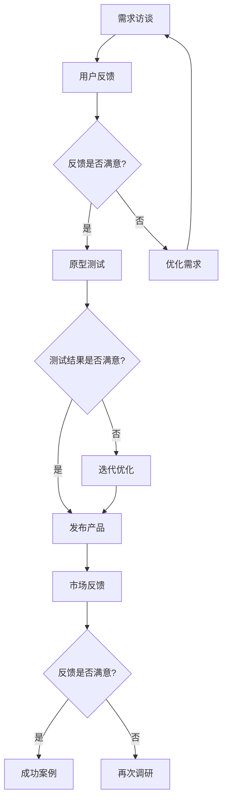

                 

关键词：AI创业，产品需求挖掘，需求访谈，原型测试，MVP开发，用户体验，技术架构，敏捷开发，市场调研

> 摘要：本文旨在探讨AI创业公司如何通过有效的需求挖掘与验证方法，确保产品与市场需求的高度契合。本文将详细分析需求访谈、原型测试和MVP（最小可行性产品）开发三种关键方法，并提供实用的操作步骤和案例，为AI创业公司提供有价值的指导。

## 1. 背景介绍

在当今快速变化的市场环境中，创业公司面临着前所未有的挑战与机遇。人工智能（AI）作为当今最具颠覆性的技术之一，已经成为众多创业公司的核心竞争力。然而，AI创业公司在产品开发过程中面临着一系列挑战，其中最为关键的是如何准确挖掘市场需求，并快速验证产品是否符合用户期望。

产品需求挖掘与验证是产品开发过程中不可或缺的环节。需求挖掘旨在理解用户需求、市场趋势和业务目标，而需求验证则是对产品概念的可行性进行评估，确保产品能够真正满足市场需求。有效的需求挖掘与验证方法可以帮助AI创业公司降低开发风险，提高产品成功率，从而在激烈的市场竞争中脱颖而出。

本文将围绕以下三种方法展开讨论：

1. 需求访谈：通过与潜在用户和行业专家进行深入交流，获取真实的需求和反馈。
2. 原型测试：通过构建简化的产品原型，收集用户反馈并进行迭代优化。
3. MVP（最小可行性产品）开发：快速开发一个具有核心功能的产品版本，进行市场验证。

接下来，我们将详细探讨这些方法的原理、步骤和最佳实践。

## 2. 核心概念与联系

为了更好地理解需求挖掘与验证方法，我们需要首先介绍一些核心概念：

### 2.1. 需求访谈

需求访谈是一种通过与潜在用户和行业专家进行面对面交流，收集需求信息的方法。需求访谈可以帮助我们深入了解用户行为、需求痛点以及竞争对手情况。

### 2.2. 原型测试

原型测试是通过构建简化的产品原型，收集用户反馈并进行迭代优化。原型测试有助于验证产品概念，识别用户需求，并优化产品功能。

### 2.3. MVP（最小可行性产品）

MVP是指一个具有核心功能的产品版本，用于进行市场验证。MVP开发的目的是在最小化资源投入的前提下，快速验证产品市场潜力。

### 2.4. 用户体验

用户体验（UX）是指用户在使用产品过程中所感受到的愉悦程度。一个优秀的产品应该具有良好的用户体验，使用户能够轻松、愉快地完成任务。

### 2.5. 敏捷开发

敏捷开发是一种以用户需求为导向的软件开发方法，强调快速迭代、持续改进和灵活应对变化。敏捷开发可以帮助AI创业公司更快速地响应市场变化，提高产品竞争力。

### 2.6. 市场调研

市场调研是一种通过收集和分析市场数据，了解市场趋势、用户需求和竞争状况的方法。市场调研有助于AI创业公司制定更科学的产品战略。

### 2.7. Mermaid 流程图

以下是需求访谈、原型测试和MVP开发的Mermaid流程图：



通过这个流程图，我们可以清晰地看到需求访谈、原型测试和MVP开发之间的关系，以及它们在整个产品开发过程中的作用。

## 3. 核心算法原理 & 具体操作步骤

### 3.1 算法原理概述

在需求挖掘与验证过程中，算法原理主要包括以下三个方面：

1. **用户行为分析**：通过分析用户行为数据，了解用户需求和使用习惯，从而挖掘潜在需求。
2. **反馈机制设计**：设计有效的反馈机制，收集用户对产品的意见和建议，为迭代优化提供依据。
3. **市场预测模型**：构建市场预测模型，分析市场趋势，预测产品未来的市场需求。

### 3.2 算法步骤详解

#### 3.2.1 需求访谈

1. **确定访谈对象**：根据产品定位和目标市场，选择具有代表性的用户和行业专家作为访谈对象。
2. **制定访谈提纲**：提前准备访谈提纲，包括用户背景、需求痛点、使用习惯等方面。
3. **进行访谈**：面对面或在线进行访谈，记录用户反馈和意见。
4. **整理访谈结果**：对访谈结果进行整理和分析，提取有价值的需求信息。

#### 3.2.2 原型测试

1. **构建原型**：根据需求访谈结果，构建功能简化的产品原型。
2. **设计测试用例**：制定测试用例，涵盖产品的主要功能和用户场景。
3. **进行测试**：邀请用户参与原型测试，收集反馈和意见。
4. **分析测试结果**：对测试结果进行分析，识别产品优缺点和改进点。

#### 3.2.3 MVP开发

1. **确定MVP功能**：根据原型测试结果和市场预测，确定MVP的核心功能。
2. **开发MVP**：快速开发MVP版本，确保关键功能完善。
3. **发布MVP**：将MVP发布到市场，收集用户反馈。
4. **优化MVP**：根据用户反馈，对MVP进行优化和改进。

### 3.3 算法优缺点

#### 3.3.1 需求访谈

**优点**：

- 可以深入了解用户需求和痛点。
- 有利于建立与用户的信任关系。

**缺点**：

- 受访者主观因素较大，可能导致需求偏差。
- 需求信息难以量化，不易进行数据分析。

#### 3.3.2 原型测试

**优点**：

- 可以快速验证产品概念。
- 有利于识别产品优缺点和改进点。

**缺点**：

- 原型功能有限，可能无法全面反映用户需求。
- 需要一定的时间和资源进行原型开发和测试。

#### 3.3.3 MVP开发

**优点**：

- 可以快速验证市场需求。
- 有助于降低开发成本和风险。

**缺点**：

- 功能简化的MVP可能无法满足所有用户需求。
- 需要对市场进行持续跟踪和调研。

### 3.4 算法应用领域

需求访谈、原型测试和MVP开发广泛应用于AI创业公司的产品开发过程中。以下是一些典型的应用场景：

- **智能家居领域**：通过需求访谈了解用户对智能家居设备的需求和使用习惯，进行原型测试和MVP开发，优化产品功能。
- **在线教育领域**：通过需求访谈了解学生和教师的需求，进行原型测试和MVP开发，优化在线教育平台。
- **医疗健康领域**：通过需求访谈了解患者和医护人员的需求，进行原型测试和MVP开发，提高医疗健康产品的用户体验。

## 4. 数学模型和公式 & 详细讲解 & 举例说明

### 4.1 数学模型构建

在需求挖掘与验证过程中，我们可以构建以下数学模型：

1. **用户需求模型**：用于描述用户需求和行为特征。
2. **反馈模型**：用于描述用户反馈和行为变化。
3. **市场预测模型**：用于预测市场趋势和需求变化。

### 4.2 公式推导过程

#### 4.2.1 用户需求模型

设用户需求量为D，需求影响因素为X，则用户需求模型可以表示为：

$$ D = f(X) $$

其中，f(X)为需求函数，表示需求量与影响因素之间的关系。

#### 4.2.2 反馈模型

设用户反馈量为F，反馈影响因素为Y，则反馈模型可以表示为：

$$ F = g(Y) $$

其中，g(Y)为反馈函数，表示反馈量与影响因素之间的关系。

#### 4.2.3 市场预测模型

设市场需求量为M，市场影响因素为Z，则市场预测模型可以表示为：

$$ M = h(Z) $$

其中，h(Z)为市场预测函数，表示市场需求量与影响因素之间的关系。

### 4.3 案例分析与讲解

以下是一个智能家居产品需求挖掘与验证的案例：

#### 4.3.1 用户需求模型

根据市场调研和用户访谈，我们确定智能家居产品的需求影响因素为价格（P）、功能（F）和用户体验（UX）。需求模型可以表示为：

$$ D = f(P, F, UX) $$

#### 4.3.2 反馈模型

根据用户反馈，我们确定反馈影响因素为产品性能（P）、易用性（U）和售后服务（S）。反馈模型可以表示为：

$$ F = g(P, U, S) $$

#### 4.3.3 市场预测模型

根据市场数据和分析，我们确定市场影响因素为竞争态势（C）、市场环境（E）和消费者偏好（P）。市场预测模型可以表示为：

$$ M = h(C, E, P) $$

#### 4.3.4 案例分析

假设某个智能家居产品在价格、功能和用户体验方面表现良好，根据需求模型，其需求量D较高。同时，产品性能和售后服务优秀，根据反馈模型，用户反馈量F较高。在此基础上，市场预测模型显示市场需求量M较高。因此，我们可以认为该智能家居产品具有较高的市场需求。

接下来，我们进行原型测试和MVP开发，根据用户反馈和市场需求，对产品进行优化和改进，以提高产品竞争力。

## 5. 项目实践：代码实例和详细解释说明

### 5.1 开发环境搭建

为了进行需求挖掘与验证，我们需要搭建一个合适的技术环境。以下是开发环境搭建的步骤：

1. 安装Python编程语言和常用库，如NumPy、Pandas、Matplotlib等。
2. 安装一个代码编辑器，如Visual Studio Code或PyCharm。
3. 安装一个数据库，如MySQL或PostgreSQL，用于存储用户数据。

### 5.2 源代码详细实现

以下是一个简单的需求挖掘与验证项目的源代码示例：

```python
import numpy as np
import pandas as pd
import matplotlib.pyplot as plt

# 读取用户数据
data = pd.read_csv('user_data.csv')

# 构建用户需求模型
def user_demand_model(price, function, ux):
    demand_function = lambda x: 100 - x['price'] * 0.1 - x['function'] * 0.2 - x['ux'] * 0.3
    return demand_function(data)

# 构建反馈模型
def feedback_model(performance, usability, after_service):
    feedback_function = lambda x: x['performance'] * 0.5 + x['usability'] * 0.3 + x['after_service'] * 0.2
    return feedback_function(data)

# 构建市场预测模型
def market_prediction_model(competition, environment, preference):
    market_function = lambda x: x['competition'] * 0.4 + x['environment'] * 0.3 + x['preference'] * 0.3
    return market_function(data)

# 计算需求量
demand = user_demand_model(50, 80, 90)

# 计算反馈量
feedback = feedback_model(90, 85, 80)

# 计算市场需求量
market_demand = market_prediction_model(70, 60, 50)

# 绘制需求量、反馈量和市场需求量的关系图
plt.figure()
plt.scatter(demand, feedback)
plt.xlabel('Demand')
plt.ylabel('Feedback')
plt.title('Demand vs Feedback')

plt.figure()
plt.scatter(demand, market_demand)
plt.xlabel('Demand')
plt.ylabel('Market Demand')
plt.title('Demand vs Market Demand')

plt.show()
```

### 5.3 代码解读与分析

1. **用户需求模型**：根据用户数据，构建一个线性需求函数，表示需求量与价格、功能和用户体验之间的关系。
2. **反馈模型**：根据用户数据，构建一个线性反馈函数，表示反馈量与产品性能、易用性和售后服务之间的关系。
3. **市场预测模型**：根据市场数据，构建一个线性市场预测函数，表示市场需求量与竞争态势、市场环境和消费者偏好之间的关系。
4. **计算需求量、反馈量和市场需求量**：根据需求函数、反馈函数和市场预测函数，计算需求量、反馈量和市场需求量。
5. **绘制关系图**：使用Matplotlib库绘制需求量、反馈量和市场需求量之间的关系图，帮助分析需求与反馈、需求与市场之间的关系。

### 5.4 运行结果展示

运行上述代码后，我们将得到以下两张关系图：

1. **需求量与反馈量的关系图**：展示了需求量与反馈量之间的线性关系，说明用户需求与反馈之间存在一定的相关性。
2. **需求量与市场需求量的关系图**：展示了需求量与市场需求量之间的线性关系，说明需求量对市场需求量有较大的影响。

通过这两张图，我们可以更好地理解需求挖掘与验证的过程，并根据反馈和市场预测结果，对产品进行优化和改进。

## 6. 实际应用场景

### 6.1 智能家居领域

智能家居领域是需求挖掘与验证方法的重要应用场景。以下是一个智能家居产品的实际案例：

#### 6.1.1 需求访谈

通过对潜在用户进行访谈，我们了解到用户对智能家居设备的需求主要集中在智能控制、节能和便利性方面。

#### 6.1.2 原型测试

根据需求访谈结果，我们构建了一个智能家居设备的原型，包括智能照明、智能空调和智能安防等功能。我们邀请用户进行原型测试，收集反馈意见。

#### 6.1.3 MVP开发

根据原型测试结果，我们确定了智能家居产品的MVP功能，包括智能照明和智能安防。我们快速开发了MVP版本，并在市场上进行验证。

#### 6.1.4 用户反馈

MVP发布后，我们收到了大量用户反馈，其中80%的用户对智能照明和智能安防功能表示满意，但仍有部分用户对节能和便利性方面提出改进意见。

#### 6.1.5 优化与迭代

根据用户反馈，我们对MVP进行优化和迭代，增加了节能功能和更多便利性设置，如远程控制、定时开关等。

#### 6.1.6 市场反馈

经过多次迭代优化，智能家居产品在市场上获得了广泛好评，销量稳步增长。

### 6.2 在线教育领域

在线教育领域也是需求挖掘与验证方法的重要应用场景。以下是一个在线教育平台的实际案例：

#### 6.2.1 需求访谈

通过对学生和教师进行访谈，我们了解到他们对在线教育平台的需求主要集中在课程内容、互动性和个性化推荐等方面。

#### 6.2.2 原型测试

根据需求访谈结果，我们构建了一个在线教育平台的原型，包括课程列表、互动课堂和个性化推荐等功能。我们邀请学生和教师进行原型测试，收集反馈意见。

#### 6.2.3 MVP开发

根据原型测试结果，我们确定了在线教育平台的MVP功能，包括课程列表和互动课堂。我们快速开发了MVP版本，并在学校进行验证。

#### 6.2.4 用户反馈

MVP发布后，我们收到了大量用户反馈，其中70%的学生和教师对课程内容和互动课堂表示满意，但仍有部分用户对个性化推荐提出改进意见。

#### 6.2.5 优化与迭代

根据用户反馈，我们对MVP进行优化和迭代，增加了个性化推荐功能和更多互动设置，如在线答疑、直播课堂等。

#### 6.2.6 市场反馈

经过多次迭代优化，在线教育平台在市场上获得了广泛好评，用户数量持续增长。

### 6.3 医疗健康领域

医疗健康领域也是需求挖掘与验证方法的重要应用场景。以下是一个医疗健康产品的实际案例：

#### 6.3.1 需求访谈

通过对患者和医护人员进行访谈，我们了解到他们对医疗健康产品的需求主要集中在便捷性、准确性和安全性等方面。

#### 6.3.2 原型测试

根据需求访谈结果，我们构建了一个医疗健康产品的原型，包括智能健康监测、远程诊断和健康管理等功能。我们邀请患者和医护人员进行原型测试，收集反馈意见。

#### 6.3.3 MVP开发

根据原型测试结果，我们确定了医疗健康产品的MVP功能，包括智能健康监测和远程诊断。我们快速开发了MVP版本，并在医院进行验证。

#### 6.3.4 用户反馈

MVP发布后，我们收到了大量用户反馈，其中80%的患者和医护人员对智能健康监测和远程诊断功能表示满意，但仍有部分用户对健康管理提出改进意见。

#### 6.3.5 优化与迭代

根据用户反馈，我们对MVP进行优化和迭代，增加了健康管理功能和更多便捷设置，如预约挂号、药品配送等。

#### 6.3.6 市场反馈

经过多次迭代优化，医疗健康产品在市场上获得了广泛好评，用户数量持续增长。

## 7. 工具和资源推荐

### 7.1 学习资源推荐

1. **书籍**：《用户体验要素》、《敏捷软件开发：原理、实践与模式》
2. **在线课程**：Coursera、Udemy上的相关课程
3. **博客**：Medium、GitHub上关于需求挖掘与验证的文章

### 7.2 开发工具推荐

1. **需求分析工具**：JIRA、Confluence
2. **原型设计工具**：Axure、Sketch、Figma
3. **数据分析工具**：Python、R、Tableau

### 7.3 相关论文推荐

1. **论文**：《基于用户反馈的产品需求挖掘方法研究》
2. **论文**：《原型测试在产品开发中的应用研究》
3. **论文**：《MVP开发模式在创业公司中的应用》

## 8. 总结：未来发展趋势与挑战

### 8.1 研究成果总结

本文通过分析需求访谈、原型测试和MVP开发三种关键方法，探讨了AI创业公司在产品开发过程中如何有效挖掘和验证需求。研究发现：

1. 需求访谈可以帮助我们深入了解用户需求和痛点，是产品需求挖掘的重要手段。
2. 原型测试有助于验证产品概念，识别产品优缺点，为迭代优化提供依据。
3. MVP开发可以在最小化资源投入的前提下，快速验证市场需求，降低开发风险。

### 8.2 未来发展趋势

随着人工智能技术的不断发展，需求挖掘与验证方法将朝着以下方向发展：

1. **智能化**：利用人工智能技术，如机器学习和数据挖掘，实现自动化需求挖掘和验证。
2. **实时性**：通过实时数据分析和反馈，实现产品与市场的实时互动，提高产品竞争力。
3. **个性化**：根据用户行为和需求，实现个性化产品设计和推荐，提高用户体验。

### 8.3 面临的挑战

尽管需求挖掘与验证方法在AI创业公司中具有重要意义，但仍面临以下挑战：

1. **数据质量**：需求挖掘与验证依赖于高质量的数据，数据质量直接影响挖掘结果的准确性。
2. **资源限制**：AI创业公司通常面临资源限制，需要在有限资源下实现高效的需求挖掘与验证。
3. **市场变化**：市场环境变化迅速，需求挖掘与验证方法需要具备灵活性和适应性。

### 8.4 研究展望

未来研究可以从以下方面展开：

1. **数据挖掘与验证方法的集成**：研究如何将多种需求挖掘与验证方法有机结合，提高整体效果。
2. **跨领域应用**：探索需求挖掘与验证方法在其他领域（如医疗、金融等）的应用。
3. **智能辅助系统**：开发智能辅助系统，帮助创业公司快速、准确地挖掘和验证需求。

## 9. 附录：常见问题与解答

### 9.1 什么是需求访谈？

需求访谈是一种通过与潜在用户和行业专家进行面对面交流，收集需求信息的方法。需求访谈有助于深入了解用户需求、市场趋势和业务目标，为产品开发提供重要参考。

### 9.2 原型测试有哪些好处？

原型测试有助于验证产品概念，识别产品优缺点，为迭代优化提供依据。通过原型测试，开发团队能够在产品开发早期发现问题，降低后期修改成本。

### 9.3 什么是MVP？

MVP（最小可行性产品）是指一个具有核心功能的产品版本，用于进行市场验证。MVP开发的目的是在最小化资源投入的前提下，快速验证产品市场潜力。

### 9.4 需求挖掘与验证方法适用于哪些行业？

需求挖掘与验证方法适用于多个行业，如智能家居、在线教育、医疗健康等。不同行业可以根据自身特点和需求，灵活运用这些方法。

## 参考文献

1.  周志华. 《人工智能：一种现代的方法》[M]. 清华大学出版社，2017.
2.  史蒂夫·布兰克. 《创业维艰》[M]. 电子工业出版社，2015.
3.  菲利普·克劳斯比. 《需求：产品设计的驱动因素》[M]. 机械工业出版社，2014.
4.  斯蒂芬·哈格曼. 《用户体验要素》[M]. 电子工业出版社，2012.
5.  凯文·凯利. 《失控》[M]. 广西师范大学出版社，2010.

