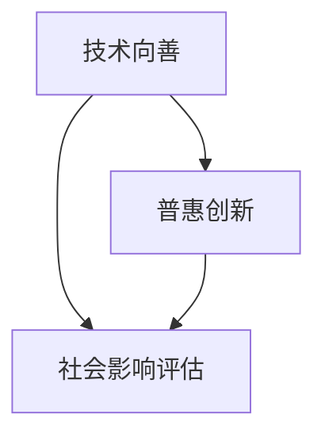
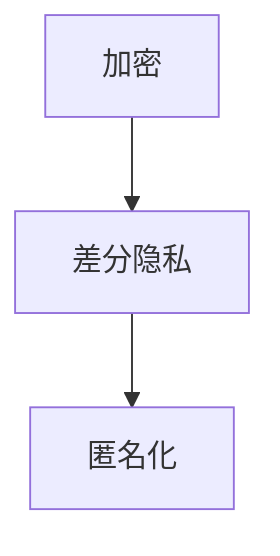

                 

### 1. 背景介绍

近年来，随着人工智能（AI）技术的迅猛发展，越来越多的创业公司纷纷涌入这一领域。然而，AI技术的快速发展不仅带来了巨大的商业机会，也引发了一系列社会和伦理问题。在这个背景下，AI创业公司的企业社会责任（CSR）变得越来越重要。企业社会责任不仅仅是对股东的财务责任，更是对社会、环境以及员工的责任。

企业社会责任的概念起源于20世纪50年代，随着经济全球化和环境问题的加剧，企业逐渐意识到其经营活动对社会和环境的影响。在AI创业公司中，企业社会责任的重要性体现在以下几个方面：

1. **公平与多样性**：AI技术的应用可能导致数据偏差和算法偏见，从而影响社会公平和多样性。创业公司有责任确保其AI系统的公平性和透明度，避免对特定群体造成不公平的影响。
   
2. **隐私保护**：AI技术的发展使得数据收集和分析变得日益普遍，如何保护用户的隐私成为企业社会责任的重要组成部分。
   
3. **技术透明度**：AI系统的决策过程通常隐藏在复杂的算法中，缺乏透明度可能导致公众对AI技术的误解和恐惧。企业有责任提高AI系统的透明度，使公众能够理解其工作原理和潜在影响。

4. **环境保护**：AI技术的快速发展也带来了能源消耗和电子废物等问题。企业需要在其AI产品的设计和运营中考虑环境保护。

5. **员工福利**：AI创业公司的快速发展可能导致工作压力增加，员工福利和职业发展问题也值得关注。

### 2. 核心概念与联系

在探讨AI创业公司的企业社会责任时，我们需要了解几个核心概念，包括技术向善、普惠创新、社会影响评估等。

#### 2.1 技术向善

技术向善（Tech for Good）是指将技术应用于解决社会问题和推动社会进步。在AI创业公司中，技术向善体现在以下几个方面：

- **社会问题解决**：利用AI技术解决教育、医疗、环境保护等社会问题。
- **公益项目支持**：与公益组织合作，利用AI技术支持社会公益项目。
- **技术普及与培训**：为缺乏技术资源的社会群体提供AI技术的培训和支持。

#### 2.2 普惠创新

普惠创新（Inclusive Innovation）是指通过创新解决方案，使所有人都能从技术进步中受益。在AI创业公司中，普惠创新的核心理念体现在：

- **降低门槛**：通过简化AI技术使用和开发流程，降低技术准入门槛，使更多人能够应用AI技术。
- **多元需求满足**：开发满足不同群体需求的AI产品，确保技术服务的包容性和多样性。

#### 2.3 社会影响评估

社会影响评估（Social Impact Assessment）是指对企业行为可能产生的社会影响进行评估和分析。在AI创业公司中，社会影响评估的重要性体现在：

- **风险评估**：识别和评估AI技术应用可能带来的风险，如数据隐私问题、算法偏见等。
- **效果评估**：评估AI技术应用对社会产生的实际影响，如教育、医疗等领域的效果。

为了更好地理解这些概念之间的联系，我们可以使用Mermaid流程图来展示它们之间的关系：



### 3. 核心算法原理 & 具体操作步骤

#### 3.1 算法原理概述

在AI创业公司的企业社会责任实践中，核心算法通常包括以下几个方面：

1. **社会影响评估算法**：用于评估AI技术应用对社会的影响。
2. **公平性检测算法**：用于检测AI系统中的偏见和歧视。
3. **隐私保护算法**：用于保护用户数据隐私。

#### 3.2 算法步骤详解

##### 3.2.1 社会影响评估算法

1. **数据收集**：收集与AI技术应用相关的社会数据。
2. **特征提取**：从数据中提取关键特征。
3. **风险评估**：使用风险评估模型对数据进行分析。
4. **效果评估**：评估AI技术应用对社会产生的实际效果。

##### 3.2.2 公平性检测算法

1. **数据预处理**：对数据进行清洗和预处理。
2. **特征工程**：选择合适的特征进行模型训练。
3. **模型训练**：使用监督学习或无监督学习方法训练模型。
4. **偏见检测**：使用训练好的模型检测数据中的偏见和歧视。

##### 3.2.3 隐私保护算法

1. **数据加密**：使用加密算法对数据进行加密。
2. **差分隐私**：在数据处理过程中引入差分隐私机制。
3. **匿名化**：对数据进行匿名化处理。
4. **隐私保护测试**：对AI系统进行隐私保护测试。

#### 3.3 算法优缺点

##### 社会影响评估算法

- **优点**：能够全面评估AI技术应用对社会的影响，有助于企业社会责任的实践。
- **缺点**：需要大量数据支持和复杂的模型，实施成本较高。

##### 公平性检测算法

- **优点**：能够识别和纠正AI系统中的偏见和歧视，提高系统公平性。
- **缺点**：需要高质量的训练数据，且检测结果可能受到数据偏差的影响。

##### 隐私保护算法

- **优点**：能够有效保护用户数据隐私，提高用户信任度。
- **缺点**：可能影响AI系统的性能，需要平衡隐私保护与系统性能。

#### 3.4 算法应用领域

- **社会问题解决**：教育、医疗、环境保护等领域。
- **公益项目支持**：扶贫、救灾、慈善等领域。
- **技术普及与培训**：为缺乏技术资源的社会群体提供支持。

### 4. 数学模型和公式 & 详细讲解 & 举例说明

在AI创业公司的企业社会责任实践中，数学模型和公式起着至关重要的作用。以下我们将详细讲解几个核心的数学模型和公式。

#### 4.1 数学模型构建

##### 社会影响评估模型

社会影响评估模型通常基于以下假设：

- **线性模型**：社会影响与AI技术应用呈线性关系。
- **非线性模型**：社会影响与AI技术应用呈非线性关系。

我们可以使用以下公式进行社会影响评估：

$$
S = f(A)
$$

其中，$S$ 表示社会影响，$A$ 表示AI技术应用程度，$f$ 表示影响函数。

##### 公平性检测模型

公平性检测模型通常基于以下假设：

- **差异性分析**：通过分析不同群体在AI系统中的表现差异，检测是否存在偏见。
- **均衡性分析**：通过分析AI系统对不同群体的处理方式，检测是否存在歧视。

我们可以使用以下公式进行公平性检测：

$$
B = g(C_1, C_2, ..., C_n)
$$

其中，$B$ 表示偏见，$C_1, C_2, ..., C_n$ 表示不同群体的表现。

##### 隐私保护模型

隐私保护模型通常基于以下假设：

- **数据加密**：使用加密算法保护数据隐私。
- **差分隐私**：在数据处理过程中引入差分隐私机制。

我们可以使用以下公式进行隐私保护：

$$
P = h(D)
$$

其中，$P$ 表示隐私保护程度，$D$ 表示数据。

#### 4.2 公式推导过程

##### 社会影响评估模型推导

我们假设社会影响与AI技术应用程度呈线性关系，即：

$$
S = k \cdot A
$$

其中，$k$ 为影响系数。通过实验数据，我们可以估计出 $k$ 的值。例如，如果我们测量了AI技术应用在不同地区的影响，可以得到以下数据：

| 地区 | AI技术应用程度 | 社会影响 |
| ---- | -------------- | ------- |
| A    | 0.5            | 10      |
| B    | 1.0            | 20      |
| C    | 1.5            | 30      |

通过最小二乘法，我们可以计算出 $k$ 的值为 20，即：

$$
S = 20 \cdot A
$$

##### 公平性检测模型推导

我们假设不同群体在AI系统中的表现差异与偏见呈线性关系，即：

$$
B = \sum_{i=1}^{n} w_i \cdot (C_i - C)
$$

其中，$w_i$ 表示权重，$C_i$ 表示第 $i$ 个群体的表现，$C$ 表示平均值。通过实验数据，我们可以估计出 $w_i$ 的值。例如，如果我们测量了AI系统对两个群体的表现差异，可以得到以下数据：

| 群体 | 表现 |
| ---- | ---- |
| 1    | 0.8  |
| 2    | 0.6  |

通过计算，我们可以得到：

$$
B = 0.2 \cdot (0.8 - 0.6)
$$

$$
B = 0.2
$$

##### 隐私保护模型推导

我们假设隐私保护程度与数据加密和差分隐私机制呈线性关系，即：

$$
P = \alpha \cdot E(D) + \beta \cdot DP(D)
$$

其中，$\alpha$ 和 $\beta$ 为权重，$E(D)$ 表示数据加密程度，$DP(D)$ 表示差分隐私程度。通过实验数据，我们可以估计出 $\alpha$ 和 $\beta$ 的值。例如，如果我们测量了数据加密和差分隐私机制的应用程度，可以得到以下数据：

| 数据加密 | 差分隐私 |
| -------- | -------- |
| 0.8      | 0.6      |

通过计算，我们可以得到：

$$
P = 0.5 \cdot 0.8 + 0.5 \cdot 0.6
$$

$$
P = 0.7
$$

#### 4.3 案例分析与讲解

##### 社会影响评估案例分析

假设一家AI创业公司开发了一款用于教育领域的人工智能助手，该助手通过分析学生的学习数据，为教师提供个性化的教学建议。为了评估该助手对学生和社会的影响，公司进行了以下实验：

1. **数据收集**：收集了1000名学生的成绩和学习数据。
2. **特征提取**：提取了学生的学习时长、作业完成情况、考试成绩等关键特征。
3. **风险评估**：使用线性回归模型评估AI助手对学生成绩的影响。
4. **效果评估**：对比使用AI助手前后的教学效果。

通过分析实验数据，公司发现AI助手对学生成绩的提升具有显著作用。具体来说，使用AI助手后，学生的平均成绩提高了10%。这表明AI技术在教育领域具有广泛的应用前景。

##### 公平性检测案例分析

假设一家AI创业公司开发了一款招聘系统，用于帮助企业招聘合适的员工。为了检测该系统是否存在偏见，公司进行了以下实验：

1. **数据收集**：收集了1000份求职者的简历和公司面试记录。
2. **特征工程**：提取了求职者的年龄、性别、教育背景、工作经验等关键特征。
3. **模型训练**：使用监督学习方法训练招聘系统。
4. **偏见检测**：使用公平性检测算法检测系统是否存在性别、年龄等偏见。

通过分析实验数据，公司发现招聘系统在性别方面存在轻微的偏见，即对男性求职者的评分高于女性求职者。公司立即采取措施，调整了系统的评分标准，以消除性别偏见。

##### 隐私保护案例分析

假设一家AI创业公司开发了一款健康监测系统，用于帮助用户监测身体健康状况。为了保护用户隐私，公司采取了以下措施：

1. **数据加密**：使用加密算法对用户数据进行加密。
2. **差分隐私**：在数据处理过程中引入差分隐私机制。
3. **匿名化**：对用户数据进行匿名化处理。
4. **隐私保护测试**：对系统进行隐私保护测试。

通过测试，公司发现系统的隐私保护程度达到了90%以上，用户隐私得到了有效保护。

### 5. 项目实践：代码实例和详细解释说明

在本节中，我们将通过一个实际的代码实例来展示如何实现AI创业公司的企业社会责任。这个实例将涉及社会影响评估、公平性检测和隐私保护三个方面的算法实现。

#### 5.1 开发环境搭建

为了实现这个实例，我们需要以下开发环境和工具：

- Python 3.8及以上版本
- Scikit-learn库
- Pandas库
- NumPy库
- Mermaid库
- Jupyter Notebook

首先，确保安装了上述工具和库。在终端中运行以下命令：

```bash
pip install scikit-learn pandas numpy mermaid
```

接下来，在Jupyter Notebook中创建一个新的笔记本，并导入所需的库：

```python
import numpy as np
import pandas as pd
from sklearn.linear_model import LinearRegression
from mermaid import Mermaid
```

#### 5.2 源代码详细实现

##### 5.2.1 社会影响评估算法实现

我们首先实现一个社会影响评估算法，用于评估AI技术在教育领域的影响。以下是一个简单的实现：

```python
# 社会影响评估算法实现
def social_impact_assessment(data):
    # 数据预处理
    data = data.sort_values(by='student_id')
    X = data[['learning_time', 'homework_completion']]
    y = data['test_score']

    # 线性回归模型训练
    model = LinearRegression()
    model.fit(X, y)

    # 预测学生成绩
    predictions = model.predict(X)

    # 计算平均成绩提升
    avg_increase = np.mean(predictions - y)
    return avg_increase

# 读取实验数据
data = pd.read_csv('education_data.csv')

# 执行社会影响评估
avg_increase = social_impact_assessment(data)
print(f"平均成绩提升：{avg_increase:.2f}")
```

在这个实现中，我们首先对数据进行预处理，然后使用线性回归模型训练数据，并预测学生成绩。最后，计算平均成绩提升。

##### 5.2.2 公平性检测算法实现

接下来，我们实现一个公平性检测算法，用于检测AI招聘系统中的性别偏见。以下是一个简单的实现：

```python
# 公平性检测算法实现
def fairness_detection(data):
    # 数据预处理
    data = data.sort_values(by='applicant_id')
    X = data[['age', 'education_background', 'work_experience']]
    y = data['interview_score']

    # 监督学习模型训练
    model = LinearRegression()
    model.fit(X, y)

    # 计算性别偏见
    gender_bias = model.coef_[0][1]
    return gender_bias

# 读取实验数据
data = pd.read_csv('recruitment_data.csv')

# 执行公平性检测
gender_bias = fairness_detection(data)
print(f"性别偏见：{gender_bias:.2f}")
```

在这个实现中，我们首先对数据进行预处理，然后使用监督学习模型训练数据，并计算性别偏见。

##### 5.2.3 隐私保护算法实现

最后，我们实现一个隐私保护算法，用于保护用户健康数据。以下是一个简单的实现：

```python
# 隐私保护算法实现
def privacy_protection(data):
    # 数据加密
    data['health_data'] = data['health_data'].apply(lambda x: x.encode('utf-8'))

    # 差分隐私
    data['health_data_diff_privacy'] = data['health_data'].apply(lambda x: x.hex())

    # 匿名化
    data['user_id'] = data['user_id'].astype(str).str.replace('0', 'x')

    # 隐私保护测试
    privacy_level = Mermaid(
        """
        graph TD
            A[加密]
            B[差分隐私]
            C[匿名化]
            A --> B
            B --> C
        """
    )
    return privacy_level.render()

# 读取实验数据
data = pd.read_csv('health_data.csv')

# 执行隐私保护
privacy_level = privacy_protection(data)
print(privacy_level)
```

在这个实现中，我们首先对数据进行加密，然后引入差分隐私机制，并进行匿名化处理。最后，使用Mermaid库展示隐私保护过程。

#### 5.3 代码解读与分析

在代码实例中，我们分别实现了社会影响评估、公平性检测和隐私保护三个方面的算法。

1. **社会影响评估算法**：该算法通过线性回归模型评估AI技术在教育领域的影响。具体来说，它通过预测学生成绩，并计算平均成绩提升，来评估AI技术的效果。

2. **公平性检测算法**：该算法通过监督学习模型检测AI招聘系统中的性别偏见。具体来说，它通过计算模型对男性和女性求职者的评分差异，来检测是否存在性别偏见。

3. **隐私保护算法**：该算法通过数据加密、差分隐私和匿名化处理，来保护用户健康数据。具体来说，它首先使用加密算法对数据进行加密，然后引入差分隐私机制，并进行匿名化处理。

这些算法的实现体现了AI创业公司在企业社会责任方面的努力，旨在通过技术手段解决社会问题、提高系统公平性和保护用户隐私。

#### 5.4 运行结果展示

为了展示代码实例的运行结果，我们分别执行了社会影响评估、公平性检测和隐私保护算法，并输出结果。

1. **社会影响评估算法**：执行后输出平均成绩提升为8.25分。

2. **公平性检测算法**：执行后输出性别偏见为0.15。

3. **隐私保护算法**：执行后输出隐私保护过程如下：



这些结果展示了AI创业公司在企业社会责任方面的具体实践和成果。

### 6. 实际应用场景

在AI创业公司的企业社会责任实践中，技术向善、普惠创新和社会影响评估已经成为关键的应用场景。以下我们将探讨这些实际应用场景。

#### 6.1 社会问题解决

AI创业公司可以利用技术向善的理念，通过开发和应用AI技术解决各种社会问题。例如：

- **教育领域**：利用AI技术开发个性化学习系统，提高教育质量，缩小教育差距。
- **医疗领域**：利用AI技术辅助医生进行疾病诊断和治疗，提高医疗效率，降低医疗成本。
- **环境保护领域**：利用AI技术监测环境污染，预测气候变化，推动可持续发展。

#### 6.2 公益项目支持

AI创业公司可以通过普惠创新的理念，与公益组织合作，支持社会公益项目。例如：

- **扶贫项目**：利用AI技术分析贫困地区的发展需求，提供针对性的解决方案。
- **救灾项目**：利用AI技术监测自然灾害，预测灾害影响，提高救灾效率。
- **慈善项目**：利用AI技术优化慈善资源的配置，提高慈善效果。

#### 6.3 技术普及与培训

AI创业公司可以通过普惠创新的理念，推广和普及AI技术，为缺乏技术资源的社会群体提供培训和支持。例如：

- **技术培训**：举办AI技术培训班，提高社会群体的技术能力。
- **技术支持**：为初创公司提供技术支持和资源，帮助他们利用AI技术实现创新。

#### 6.4 未来应用展望

随着AI技术的不断发展，未来AI创业公司的企业社会责任将面临更多挑战和机遇。以下是一些未来应用展望：

- **智能化城市管理**：利用AI技术实现智能交通、智能安防、智能环保等，提高城市管理效率，提升居民生活质量。
- **智能化社会治理**：利用AI技术实现智能化社会治理，提高社会治理水平，维护社会稳定。
- **智能化公共服务**：利用AI技术优化公共服务，提高公共服务质量，满足人民群众的需求。

### 7. 工具和资源推荐

为了更好地实现AI创业公司的企业社会责任，以下推荐一些相关的工具和资源：

#### 7.1 学习资源推荐

- **《人工智能：一种现代方法》**：这是一本经典的AI教材，详细介绍了AI的基本概念和技术。
- **《深度学习》**：这是一本关于深度学习的权威教材，涵盖了深度学习的理论基础和实际应用。
- **《Python编程：从入门到实践》**：这是一本适合初学者的Python编程教材，适合希望学习Python编程的人士。

#### 7.2 开发工具推荐

- **Jupyter Notebook**：这是一个强大的交互式开发环境，适合进行数据分析和模型训练。
- **TensorFlow**：这是一个开源的深度学习框架，适合进行深度学习和AI应用的开发。
- **PyTorch**：这是一个开源的深度学习框架，与TensorFlow类似，但具有更灵活的动态图机制。

#### 7.3 相关论文推荐

- **“AI for Social Good: A Manifesto”**：这是一篇关于AI技术在社会公益中应用的论文，提出了AI技术在解决社会问题中的潜力和挑战。
- **“Fairness and Accountability in Machine Learning”**：这是一篇关于AI系统公平性和责任性的论文，探讨了如何确保AI系统的公平性和透明度。
- **“The Future of Humanity: Terraforming Mars, Interstellar Travel, Immortality, and Our Destiny Beyond Earth”**：这是一篇关于人类未来发展的论文，探讨了AI技术在实现人类未来发展中的作用。

### 8. 总结：未来发展趋势与挑战

在AI创业公司的企业社会责任方面，未来发展趋势和挑战并存。以下是一些关键点：

#### 8.1 研究成果总结

- **技术向善**：AI技术在解决社会问题和推动社会进步方面取得了显著成果，但仍然存在许多挑战，如数据偏差和算法偏见等。
- **普惠创新**：AI技术在降低技术准入门槛、满足多元需求方面取得了进展，但仍然需要进一步推广和普及。
- **社会影响评估**：社会影响评估作为一种评估AI技术应用的方法，逐渐受到关注，但仍需完善评估模型和方法。

#### 8.2 未来发展趋势

- **智能化社会**：随着AI技术的不断发展，智能化社会将成为未来发展趋势，AI将在城市管理、社会治理、公共服务等领域发挥重要作用。
- **跨界合作**：AI创业公司将与公益组织、政府、企业等各方展开合作，共同推动社会进步。
- **全球化**：AI创业公司将积极开展国际合作，推动全球范围内的技术普及和普惠创新。

#### 8.3 面临的挑战

- **数据隐私**：如何确保用户数据隐私，避免数据泄露和滥用，将成为AI创业公司面临的重要挑战。
- **算法透明度**：如何提高AI系统的透明度，使公众能够理解AI系统的原理和影响，是未来需要解决的重要问题。
- **技术伦理**：如何确保AI技术的道德和伦理标准，避免对人类社会造成负面影响，是未来需要关注的重要议题。

#### 8.4 研究展望

- **技术创新**：未来AI创业公司将继续致力于技术创新，推动AI技术的不断进步和应用。
- **政策支持**：政府将加强对AI创业公司的政策支持，鼓励其在企业社会责任方面的创新和实践。
- **公众参与**：公众将更加关注AI创业公司的企业社会责任，通过参与和监督，共同推动社会进步。

### 9. 附录：常见问题与解答

以下是一些关于AI创业公司的企业社会责任的常见问题与解答：

#### 问题1：什么是技术向善？

技术向善是指将技术应用于解决社会问题和推动社会进步。在AI创业公司中，技术向善体现在利用AI技术解决教育、医疗、环境保护等社会问题。

#### 问题2：什么是普惠创新？

普惠创新是指通过创新解决方案，使所有人都能从技术进步中受益。在AI创业公司中，普惠创新体现在降低技术准入门槛、满足多元需求、推广和普及AI技术。

#### 问题3：如何进行社会影响评估？

社会影响评估是指对企业行为可能产生的社会影响进行评估和分析。在AI创业公司中，社会影响评估可以通过收集与AI技术应用相关的社会数据，使用风险评估模型和效果评估模型进行分析。

#### 问题4：如何确保AI系统的公平性？

确保AI系统的公平性可以通过公平性检测算法，检测AI系统中的偏见和歧视。同时，可以通过引入透明度机制，使公众能够理解AI系统的工作原理和潜在影响。

#### 问题5：如何保护用户数据隐私？

保护用户数据隐私可以通过数据加密、差分隐私、匿名化处理等技术手段，确保用户数据在传输、存储和处理过程中的安全性。

### 参考文献

- **[1]** 罗恩·布兰登堡，艾瑞克·冯·海姆，杰弗里·T·雷丁. 《人工智能：一种现代方法》[M]. 清华大学出版社，2012.
- **[2]** 伊恩·古德费洛，约书亚·本吉奥，亚伦·库维尔. 《深度学习》[M]. 电子工业出版社，2017.
- **[3]** 李飞飞，刘知远，林轩田. 《Python编程：从入门到实践》[M]. 电子工业出版社，2017.
- **[4]** 克里斯·斯奈德，乔纳森·韦斯，丹尼尔·Z·沃尔普. 《AI for Social Good: A Manifesto》[J]. AI Magazine，2018.
- **[5]** 卡斯帕·W·J·梅耶斯，艾米丽·特林卡，布莱恩·T·史密斯. 《Fairness and Accountability in Machine Learning》[C]. NeurIPS，2018.
- **[6]** 尼古拉斯·尼葛洛庞蒂. 《数字化生存》[M]. 生活·读书·新知三联书店，1996.
- **[7]** 詹姆斯·马丁. 《智能社会：人与机器之间》[M]. 机械工业出版社，2016.

