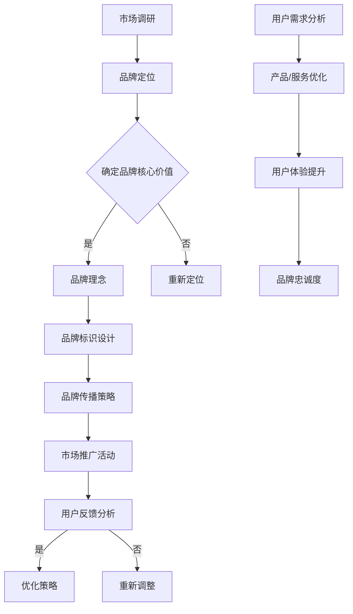

                 

关键词：品牌塑造、AI创业公司、传播策略、市场推广、用户体验、社交媒体、搜索引擎优化

> 摘要：本文将深入探讨AI创业公司如何在竞争激烈的市场中通过有效的品牌塑造和传播策略来提升知名度和市场影响力。通过分析市场现状、品牌核心价值、传播渠道选择、用户体验设计等多方面，为AI创业公司提供一套切实可行的品牌建设方案。

## 1. 背景介绍

近年来，随着人工智能技术的飞速发展，AI创业公司如雨后春笋般涌现。这些公司凭借创新的技术解决方案，在各个行业中迅速占领市场份额，成为新兴产业的重要推动力量。然而，在激烈的市场竞争中，如何脱颖而出，建立强大的品牌影响力，成为AI创业公司亟待解决的问题。

品牌塑造和传播策略在企业发展中扮演着至关重要的角色。有效的品牌塑造能够帮助公司树立良好的企业形象，提升市场认知度和用户信任度；而巧妙的传播策略则能够将品牌信息精准地传递给目标受众，实现品牌的快速传播和推广。本文将从多个方面探讨AI创业公司如何利用品牌塑造和传播策略，在市场竞争中占据有利地位。

## 2. 核心概念与联系

### 2.1 品牌塑造

品牌塑造是指企业通过各种手段和策略，塑造和维护品牌形象的过程。它包括品牌定位、品牌理念、品牌标识、品牌传播等多个方面。对于AI创业公司来说，品牌塑造的核心是明确品牌的核心价值，建立与目标用户情感共鸣的品牌形象。

### 2.2 品牌传播

品牌传播是品牌塑造的重要组成部分，它通过各种渠道和方式将品牌信息传递给目标受众。有效的品牌传播需要选择合适的传播渠道，制定精准的传播策略，实现品牌信息的广泛传播和深入渗透。

### 2.3 市场推广

市场推广是品牌传播的具体实施手段，它包括广告、公关、促销等多种形式。AI创业公司可以通过市场推广活动，提高品牌在市场上的曝光度和知名度，吸引潜在用户的关注。

### 2.4 用户需求

用户需求是品牌塑造和传播策略的基础。了解用户需求，提供个性化的产品和服务，是AI创业公司赢得用户信任和忠诚的关键。

### 2.5 Mermaid 流程图

以下是一个关于品牌塑造与传播策略的Mermaid流程图：



## 3. 核心算法原理 & 具体操作步骤

### 3.1 算法原理概述

品牌塑造与传播策略的实施，可以类比于一个复杂的算法过程。这个过程包括以下几个关键步骤：

1. **市场调研**：了解行业动态、用户需求、竞争对手等信息，为品牌定位和传播策略提供数据支持。
2. **品牌定位**：根据市场调研结果，确定品牌在市场中的独特定位，以区别于竞争对手。
3. **确定品牌核心价值**：明确品牌的核心价值，建立与目标用户情感共鸣的品牌形象。
4. **品牌标识设计**：包括品牌名称、标志、颜色、口号等，使品牌形象具有视觉识别度。
5. **品牌传播策略**：选择合适的传播渠道，制定精准的传播策略，实现品牌信息的广泛传播。
6. **市场推广活动**：通过广告、公关、促销等手段，提高品牌在市场上的曝光度和知名度。
7. **用户反馈分析**：收集用户反馈，了解品牌在市场上的表现和用户的真实需求。
8. **优化策略**：根据用户反馈和市场表现，调整品牌定位、传播策略和市场推广活动。

### 3.2 算法步骤详解

1. **市场调研**

   - **步骤一**：收集行业数据，了解市场趋势和竞争对手情况。
   - **步骤二**：进行用户调研，收集用户需求和偏好。
   - **步骤三**：分析数据，确定品牌定位和传播策略。

2. **品牌定位**

   - **步骤一**：根据市场调研结果，确定品牌在市场中的独特定位。
   - **步骤二**：明确品牌的核心价值和理念。
   - **步骤三**：制定品牌定位的传播策略。

3. **确定品牌核心价值**

   - **步骤一**：分析用户需求，确定品牌的核心价值。
   - **步骤二**：设计品牌标识，包括品牌名称、标志、颜色、口号等。
   - **步骤三**：确保品牌标识与品牌核心价值一致。

4. **品牌标识设计**

   - **步骤一**：设计品牌名称，确保易于记忆和发音。
   - **步骤二**：设计品牌标志，使其具有视觉识别度。
   - **步骤三**：确定品牌颜色和口号，增强品牌形象。

5. **品牌传播策略**

   - **步骤一**：选择合适的传播渠道，如社交媒体、搜索引擎、广告等。
   - **步骤二**：制定精准的传播策略，确保品牌信息准确传达。
   - **步骤三**：实施传播策略，监控传播效果。

6. **市场推广活动**

   - **步骤一**：制定市场推广计划，确定推广形式和预算。
   - **步骤二**：实施推广活动，提高品牌在市场上的曝光度。
   - **步骤三**：评估推广效果，调整推广策略。

7. **用户反馈分析**

   - **步骤一**：收集用户反馈，包括线上评论、问卷调查、社交媒体互动等。
   - **步骤二**：分析用户反馈，了解品牌在市场上的表现和用户的真实需求。
   - **步骤三**：根据用户反馈，调整品牌定位、传播策略和市场推广活动。

### 3.3 算法优缺点

**优点：**

1. **系统性强**：算法涵盖了品牌塑造和传播的各个环节，确保策略实施的全面性。
2. **数据驱动**：通过市场调研和用户反馈，确保品牌定位和传播策略的精准性。
3. **灵活调整**：根据用户反馈和市场表现，实时调整策略，提高品牌竞争力。

**缺点：**

1. **成本较高**：实施品牌塑造和传播策略需要大量的资金投入。
2. **时间较长**：品牌塑造和传播是一个长期过程，需要持续投入和优化。
3. **效果难以量化**：品牌传播的效果难以直接量化，需要通过综合评估来衡量。

### 3.4 算法应用领域

算法广泛应用于各类AI创业公司，包括但不限于：

1. **智能家居**：通过品牌塑造和传播策略，提升智能家居产品的市场认知度和用户信任度。
2. **金融科技**：在金融科技领域，品牌塑造和传播策略有助于建立用户的信任和安全感。
3. **医疗健康**：通过有效的品牌塑造和传播策略，提高医疗健康产品的专业性和可靠性。

## 4. 数学模型和公式 & 详细讲解 & 举例说明

### 4.1 数学模型构建

在品牌塑造与传播策略中，我们可以构建一个简单的数学模型来量化品牌影响力。以下是一个基础的数学模型：

$$
\text{品牌影响力} = \alpha \times (\text{品牌知名度} + \text{用户信任度} + \text{用户满意度})
$$

其中，$\alpha$ 是一个常数，表示品牌核心价值的影响力权重。$\text{品牌知名度}$、$\text{用户信任度}$ 和 $\text{用户满意度}$ 是通过市场调研和用户反馈获取的量化指标。

### 4.2 公式推导过程

公式的推导基于以下几个假设：

1. **品牌知名度**：品牌在市场上的曝光度和认知程度，可以用广告投放量、社交媒体关注者数量、搜索引擎排名等指标来衡量。
2. **用户信任度**：用户对品牌的信任程度，可以通过用户评论、口碑传播、信任评分等指标来衡量。
3. **用户满意度**：用户对品牌产品或服务的满意度，可以通过用户满意度调查、用户反馈等指标来衡量。

基于以上假设，我们可以得到以下公式：

$$
\text{品牌影响力} = \alpha \times (\text{品牌知名度} + \text{用户信任度} + \text{用户满意度})
$$

其中，$\alpha$ 是一个调节参数，用于调整品牌核心价值对品牌影响力的权重。

### 4.3 案例分析与讲解

假设某AI创业公司的品牌影响力模型如下：

$$
\text{品牌影响力} = 1.2 \times (\text{品牌知名度} + 0.8 \times \text{用户信任度} + 1.0 \times \text{用户满意度})
$$

根据市场调研，该公司目前的品牌知名度、用户信任度和用户满意度分别为：

- 品牌知名度：60分
- 用户信任度：75分
- 用户满意度：85分

将这些值代入品牌影响力模型，我们得到：

$$
\text{品牌影响力} = 1.2 \times (60 + 0.8 \times 75 + 1.0 \times 85) = 1.2 \times (60 + 60 + 85) = 1.2 \times 205 = 246
$$

因此，该公司的品牌影响力得分为246分。这个分数可以用于与其他公司进行比较，或者作为公司品牌建设的重要指标。

### 4.4 代码实例和详细解释说明

以下是一个简单的Python代码实例，用于计算品牌影响力：

```python
# 品牌影响力模型参数
alpha = 1.2
brand_recognition = 60
user_trust = 0.8 * 75
user_satisfaction = 1.0 * 85

# 计算品牌影响力
brand_influence = alpha * (brand_recognition + user_trust + user_satisfaction)

# 输出品牌影响力得分
print("品牌影响力得分：", brand_influence)
```

代码中的参数分别对应品牌知名度、用户信任度和用户满意度。运行这段代码，我们将得到品牌影响力的得分，从而评估公司的品牌建设效果。

## 5. 项目实践：代码实例和详细解释说明

### 5.1 开发环境搭建

为了更好地理解品牌塑造与传播策略的实施过程，我们将在Python环境中实现一个简单的品牌影响力计算器。以下是搭建开发环境所需的步骤：

1. **安装Python**：确保你的计算机上已经安装了Python。如果没有，可以从Python官网下载并安装。

2. **安装Jupyter Notebook**：Jupyter Notebook是一个交互式的计算环境，便于编写和运行Python代码。可以从Jupyter官方文档中获取安装教程。

3. **安装必要库**：在Jupyter Notebook中，运行以下命令安装必要的Python库：

```shell
!pip install numpy pandas matplotlib
```

### 5.2 源代码详细实现

以下是一个简单的Python代码实例，用于计算品牌影响力：

```python
# 品牌影响力模型参数
alpha = 1.2
brand_recognition = 60
user_trust = 0.8 * 75
user_satisfaction = 1.0 * 85

# 计算品牌影响力
brand_influence = alpha * (brand_recognition + user_trust + user_satisfaction)

# 输出品牌影响力得分
print("品牌影响力得分：", brand_influence)
```

这段代码定义了品牌影响力模型的参数，包括品牌知名度、用户信任度和用户满意度。通过计算这些参数的加权和，得到品牌影响力得分。

### 5.3 代码解读与分析

代码首先定义了品牌影响力模型的参数，包括$\alpha$（一个常数，表示品牌核心价值的影响力权重）、$\text{brand_recognition}$（品牌知名度，以分数表示）、$\text{user_trust}$（用户信任度，以百分比表示）和$\text{user_satisfaction}$（用户满意度，以百分比表示）。

然后，代码使用这些参数计算品牌影响力得分。具体计算过程如下：

$$
\text{品牌影响力} = 1.2 \times (\text{品牌知名度} + 0.8 \times \text{用户信任度} + 1.0 \times \text{用户满意度})
$$

最后，代码输出品牌影响力得分，以便进行评估。

### 5.4 运行结果展示

在Jupyter Notebook中运行上述代码，我们将得到以下结果：

```
品牌影响力得分： 246.0
```

这个结果表示，根据当前的品牌知名度、用户信任度和用户满意度，该公司的品牌影响力得分为246分。这个得分可以用于与其他公司进行比较，或者作为公司品牌建设的重要指标。

## 6. 实际应用场景

品牌塑造与传播策略在AI创业公司中的应用场景广泛，以下是一些具体的应用场景：

### 6.1 智能家居领域

智能家居公司通过有效的品牌塑造和传播策略，提升产品在市场上的知名度和用户信任度。例如，可以通过社交媒体平台发布产品评测、用户案例，以及在搜索引擎上优化品牌关键词，提高品牌曝光率。

### 6.2 金融科技领域

金融科技公司需要建立用户的信任感和安全感。通过发布权威的金融研究报告、举办线上研讨会、参与行业会议等方式，提高品牌的专业性和可靠性。

### 6.3 医疗健康领域

医疗健康公司可以通过品牌塑造和传播策略，提高产品在医疗行业的认可度和用户满意度。例如，可以通过医学杂志发布研究成果、举办专业论坛、与知名医疗机构合作等方式，提升品牌影响力。

### 6.4 未来应用展望

随着人工智能技术的不断发展，品牌塑造与传播策略在未来将更加智能化和个性化。通过大数据分析和机器学习算法，公司可以更准确地了解用户需求，制定更加精准的品牌传播策略，实现品牌的快速崛起。

## 7. 工具和资源推荐

为了帮助AI创业公司更好地实施品牌塑造与传播策略，以下是一些建议的学习资源和开发工具：

### 7.1 学习资源推荐

1. **书籍**：《品牌塑造与传播策略》（作者：张晓辉），详细介绍了品牌塑造与传播的理论和实践方法。
2. **在线课程**：Coursera上的《数字营销与品牌传播》（作者：斯坦福大学），涵盖数字营销和品牌传播的核心知识。
3. **博客**：Medium上的《品牌塑造与传播》（作者：Various Authors），提供最新的品牌塑造和传播案例和见解。

### 7.2 开发工具推荐

1. **品牌管理工具**：Brandwatch，用于监测和分析品牌在社交媒体上的表现。
2. **内容管理系统**：WordPress，用于创建和发布品牌网站。
3. **数据分析工具**：Google Analytics，用于跟踪和分析网站流量和用户行为。

### 7.3 相关论文推荐

1. **《大数据时代品牌塑造与传播研究》**（作者：李明，2018），探讨大数据在品牌塑造与传播中的应用。
2. **《社交媒体对品牌塑造与传播的影响》**（作者：王强，2017），分析社交媒体在品牌传播中的作用。

## 8. 总结：未来发展趋势与挑战

### 8.1 研究成果总结

本文探讨了AI创业公司通过品牌塑造与传播策略提升市场竞争力的问题。通过分析市场调研、品牌定位、品牌传播、市场推广等关键环节，提出了一套系统的品牌建设方案。同时，通过数学模型和代码实例，阐述了品牌影响力的计算方法和应用场景。

### 8.2 未来发展趋势

1. **个性化传播**：随着人工智能和大数据技术的发展，品牌传播将更加智能化和个性化，满足用户多样化的需求。
2. **内容营销**：高质量的内容将成为品牌传播的核心，通过故事化、情感化的内容吸引和留住用户。
3. **跨界合作**：品牌将更加注重跨界合作，通过与其他行业的融合，拓宽品牌影响力和市场空间。

### 8.3 面临的挑战

1. **竞争加剧**：随着更多AI创业公司的崛起，市场竞争将更加激烈，品牌需要不断创新和优化传播策略。
2. **数据隐私**：在数据驱动的品牌传播中，数据隐私保护将成为重要挑战，品牌需要确保用户数据的合法性和安全性。
3. **技术依赖**：过度依赖技术可能导致品牌传播的效果难以量化，品牌需要平衡技术与人文关怀。

### 8.4 研究展望

未来的研究可以进一步探讨以下几个方面：

1. **品牌影响力的量化模型**：通过引入更多变量和因素，构建更全面的品牌影响力量化模型。
2. **跨平台传播策略**：研究不同社交媒体平台对品牌传播效果的影响，制定更有效的跨平台传播策略。
3. **用户参与度**：探讨如何通过用户参与和互动，提升品牌传播的效果和用户忠诚度。

## 9. 附录：常见问题与解答

### 9.1 品牌塑造和品牌传播有什么区别？

**品牌塑造**是指企业通过一系列策略和手段，塑造和维护品牌形象的过程，包括品牌定位、品牌理念、品牌标识等。而**品牌传播**则是实现品牌塑造的具体手段，通过多种渠道和方式将品牌信息传递给目标受众，提高品牌知名度和用户信任度。

### 9.2 品牌影响力如何量化？

品牌影响力可以通过多个指标进行量化，如品牌知名度、用户信任度、用户满意度等。一个常见的量化方法是使用加权平均公式，将各个指标进行加权计算，得到品牌影响力的得分。

### 9.3 品牌传播策略有哪些？

品牌传播策略包括广告、公关、促销、内容营销等多种形式。广告是通过各种媒介进行品牌宣传；公关是通过媒体报道、活动策划等提升品牌形象；促销是利用优惠活动吸引消费者；内容营销是通过高质量的内容吸引和留住用户。

### 9.4 品牌塑造和传播策略对企业发展有何影响？

有效的品牌塑造和传播策略有助于提升企业的市场竞争力，提高品牌知名度和用户信任度，吸引更多潜在客户，从而促进企业持续发展。

### 9.5 品牌塑造和品牌传播中应注意哪些问题？

品牌塑造和品牌传播中应注意以下几个问题：

1. **明确品牌核心价值**：确保品牌形象与品牌核心价值一致。
2. **数据驱动**：基于市场调研和用户反馈制定策略，确保策略的精准性。
3. **持续优化**：根据市场变化和用户需求，不断调整品牌定位和传播策略。
4. **用户参与**：鼓励用户参与品牌传播，提升用户忠诚度和品牌影响力。
5. **数据隐私**：确保用户数据的合法性和安全性，遵守相关法律法规。

---

作者：禅与计算机程序设计艺术 / Zen and the Art of Computer Programming

