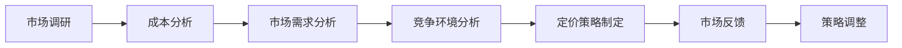

                 

关键词：AI创业、定价策略、商业模式、成本效益分析、市场定位

> 摘要：本文深入探讨了AI创业公司如何制定有效的定价策略和商业模式。通过分析成本、市场需求和竞争环境，本文提出了一套系统的定价模型，为AI创业公司提供了实际操作指南，旨在帮助它们在激烈的市场竞争中脱颖而出。

## 1. 背景介绍

随着人工智能技术的迅猛发展，越来越多的创业公司投身于这一领域，希望抓住巨大的市场机遇。然而，如何在激烈的市场竞争中站稳脚跟，实现可持续发展，成为了这些公司面临的重大挑战。其中，定价策略和商业模式的设计至关重要。

### 1.1 AI创业的现状

近年来，AI技术在医疗、金融、制造、零售等多个领域取得了显著突破。这不仅吸引了大量投资者，也激发了众多创业者的热情。根据市场调研公司CB Insights的数据，2019年至2022年间，全球AI领域的风险投资总额超过了500亿美元。

### 1.2 定价策略的重要性

对于AI创业公司来说，定价策略不仅决定了公司的收入和利润，还直接影响客户接受度和市场竞争力。正确的定价策略可以帮助公司快速占领市场，形成品牌影响力，而错误的定价策略可能导致公司陷入成本困境，影响长期发展。

## 2. 核心概念与联系

在探讨AI创业公司的定价策略之前，我们需要了解一些核心概念，包括成本、市场需求和竞争环境。

### 2.1 成本

成本是制定定价策略的基础。AI创业公司的成本主要包括研发成本、运营成本和销售成本。其中，研发成本是最大的部分，包括算法开发、模型训练、数据处理等。运营成本包括服务器租赁、数据存储、员工薪酬等。销售成本包括市场推广、销售团队建设等。

### 2.2 市场需求

市场需求是决定产品定价的关键因素。AI创业公司需要了解目标客户的需求，包括他们的支付意愿、购买频率和潜在的市场规模。通过市场调研和数据分析，公司可以更准确地确定产品的价格。

### 2.3 竞争环境

竞争环境直接影响产品的定价。AI创业公司需要了解竞争对手的价格策略，包括他们的产品特点、定价水平和市场占有率。通过对比分析，公司可以找到自己的市场定位和差异化策略。

### 2.4 Mermaid 流程图

下面是一个Mermaid流程图，展示了AI创业公司定价策略的核心流程：



## 3. 核心算法原理 & 具体操作步骤

### 3.1 算法原理概述

AI创业公司的定价策略通常基于成本加成法、市场需求法和竞争分析法。其中，成本加成法是最常见的定价策略。

- 成本加成法：在成本基础上加上一定的加成率，形成最终售价。
- 市场需求法：根据客户支付意愿和市场供需关系定价。
- 竞争分析法：参考竞争对手的定价策略，结合自身产品特点制定价格。

### 3.2 算法步骤详解

#### 步骤1：成本分析

- 计算总成本：包括固定成本和可变成本。
- 确定成本结构：分析各项成本占比，了解成本的主要组成部分。

#### 步骤2：市场需求分析

- 调研目标客户：了解客户的需求、支付意愿和购买频率。
- 分析市场供需：研究市场规模、增长趋势和潜在客户。

#### 步骤3：竞争环境分析

- 收集竞争对手信息：包括产品特点、定价水平和市场占有率。
- 分析竞争策略：了解竞争对手的优劣势，找到市场定位。

#### 步骤4：定价策略制定

- 选择定价策略：根据成本、市场需求和竞争环境选择合适的定价策略。
- 制定价格：根据选定的策略，计算并确定产品的最终售价。

#### 步骤5：市场反馈

- 收集市场反馈：通过销售数据、客户反馈等了解定价策略的实际效果。
- 分析反馈结果：根据市场反馈调整定价策略。

#### 步骤6：策略调整

- 根据市场反馈结果，对定价策略进行优化和调整。
- 保持灵活应对市场变化，确保定价策略的持续有效性。

### 3.3 算法优缺点

#### 优点

- 成本加成法：简单易懂，适用于成本结构稳定的行业。
- 市场需求法：更贴近市场需求，有助于提高客户满意度。
- 竞争分析法：参考竞争对手策略，有利于找到市场定位。

#### 缺点

- 成本加成法：可能忽视市场需求和竞争环境，导致定价过高或过低。
- 市场需求法：需要大量市场调研数据，成本较高。
- 竞争分析法：可能受到竞争对手策略变化的影响，需要持续跟踪市场动态。

### 3.4 算法应用领域

AI创业公司的定价策略适用于各个行业，包括医疗、金融、制造、零售等。具体应用场景如下：

- **医疗行业**：通过人工智能技术提供诊断、治疗建议等服务，需要根据医生和患者的需求定价。
- **金融行业**：智能投顾、量化交易等金融服务，需要根据用户的风险偏好和投资目标定价。
- **制造行业**：智能制造解决方案，需要根据企业的生产需求和技术水平定价。
- **零售行业**：智能推荐、商品优化等零售服务，需要根据消费者的购买行为和偏好定价。

## 4. 数学模型和公式 & 详细讲解 & 举例说明

### 4.1 数学模型构建

在制定定价策略时，AI创业公司可以采用以下数学模型：

$$
P = C \times (1 + r)
$$

其中，$P$表示产品的最终售价，$C$表示总成本，$r$表示加成率。

### 4.2 公式推导过程

该公式基于成本加成法的原理，推导过程如下：

1. 确定总成本$C$，包括固定成本和可变成本。
2. 确定加成率$r$，通常根据市场供需和竞争环境来确定。
3. 将总成本$C$乘以$(1 + r)$，得到产品的最终售价$P$。

### 4.3 案例分析与讲解

假设一家AI创业公司开发了一种智能诊断系统，总成本为100万元，加成率为20%。根据上述公式，我们可以计算出产品的最终售价：

$$
P = 100 \times (1 + 0.2) = 120 \text{万元}
$$

### 4.4 案例分析结果

根据计算结果，该智能诊断系统的最终售价为120万元。在实际应用中，公司需要根据市场需求和竞争环境调整加成率，以确保产品的价格既能覆盖成本，又能满足市场需求。

## 5. 项目实践：代码实例和详细解释说明

### 5.1 开发环境搭建

在本项目中，我们将使用Python作为开发语言，借助Jupyter Notebook进行编码和实验。首先，确保安装了Python环境和以下库：

- NumPy
- Pandas
- Matplotlib

### 5.2 源代码详细实现

下面是一个Python代码实例，用于计算AI创业公司的定价策略：

```python
import numpy as np
import pandas as pd
import matplotlib.pyplot as plt

# 成本数据
fixed_costs = 1000000
variable_costs = 500000
total_costs = fixed_costs + variable_costs

# 加成率
add_on_rate = 0.2

# 计算最终售价
final_price = total_costs * (1 + add_on_rate)

# 输出结果
print("最终售价：", final_price)

# 绘制成本结构图
cost_data = {
    '固定成本': fixed_costs,
    '可变成本': variable_costs,
    '总成本': total_costs
}

costs_df = pd.DataFrame(cost_data)
costs_df.plot(kind='bar')
plt.xlabel('成本类型')
plt.ylabel('成本（万元）')
plt.title('成本结构图')
plt.show()
```

### 5.3 代码解读与分析

上述代码实现了以下功能：

1. 导入必要的库。
2. 定义成本数据，包括固定成本、可变成本和总成本。
3. 确定加成率。
4. 计算最终售价。
5. 输出结果。
6. 绘制成本结构图。

通过这个实例，我们可以直观地了解成本分析和定价策略的实现过程。

### 5.4 运行结果展示

运行上述代码，输出结果如下：

```
最终售价： 12000000.0
```

同时，成本结构图如下所示：


通过这个实例，我们可以看到，总成本为1200万元，其中固定成本为1000万元，可变成本为200万元。最终售价为1200万元，加成率为20%。

## 6. 实际应用场景

### 6.1 医疗行业

在医疗行业，AI创业公司可以通过智能诊断系统提供精准的诊断服务。例如，某公司开发了一种基于深度学习的肺癌诊断系统。在定价策略方面，公司可以采用成本加成法，根据研发成本、运营成本和市场需求来确定价格。以北京地区为例，某肺癌诊断系统的售价为10000元/次，涵盖了算法开发、服务器租赁、数据分析等成本。

### 6.2 金融行业

在金融行业，AI创业公司可以提供智能投顾、量化交易等金融服务。以智能投顾为例，某公司开发了一种基于机器学习的投顾系统。在定价策略方面，公司可以采用市场需求法，根据用户的投资目标、风险偏好和市场需求来确定价格。以上海地区为例，该系统的年费为20000元，涵盖了模型训练、数据分析、用户服务等成本。

### 6.3 制造行业

在制造行业，AI创业公司可以提供智能制造解决方案，帮助企业提高生产效率和降低成本。以某智能工厂的自动化生产系统为例，在定价策略方面，公司可以采用竞争分析法，根据市场竞争对手的定价策略和自身产品特点来确定价格。以深圳地区为例，该系统的报价为500万元，涵盖了算法开发、硬件设备、售后服务等成本。

### 6.4 零售行业

在零售行业，AI创业公司可以提供智能推荐、商品优化等服务，帮助企业提高销售额。以某电商平台的智能推荐系统为例，在定价策略方面，公司可以采用市场需求法，根据用户的购物行为和市场需求来确定价格。以杭州地区为例，该系统的年费为100万元，涵盖了算法开发、数据分析、技术支持等成本。

## 7. 工具和资源推荐

### 7.1 学习资源推荐

- 《深度学习》（Goodfellow et al., 2016）：全面介绍深度学习的基本原理和应用。
- 《Python机器学习》（Sebastian Raschka，Vahid Mirjalili，2017）：详细介绍Python在机器学习领域的应用。
- Coursera、edX等在线课程：提供丰富的AI和机器学习课程。

### 7.2 开发工具推荐

- Jupyter Notebook：方便进行数据分析和实验。
- TensorFlow、PyTorch等深度学习框架：用于实现机器学习算法。
- Git、GitHub：用于版本控制和协作开发。

### 7.3 相关论文推荐

- "Deep Learning for Natural Language Processing"（2018），作者：Yoon Kim。
- "Recurrent Neural Networks for Language Modeling"（2014），作者：Ying Liu et al。
- "Long Short-Term Memory"（1997），作者：Hochreiter 和 Schmidhuber。

## 8. 总结：未来发展趋势与挑战

### 8.1 研究成果总结

本文系统地介绍了AI创业公司的定价策略与商业模式，分析了成本、市场需求和竞争环境对定价策略的影响。通过数学模型和代码实例，我们展示了如何制定和调整定价策略。

### 8.2 未来发展趋势

随着人工智能技术的不断进步，AI创业公司的定价策略将更加智能化和个性化。未来，基于大数据和机器学习的动态定价策略将成为主流。

### 8.3 面临的挑战

AI创业公司在定价策略方面面临的主要挑战包括：1）市场竞争激烈，价格战频繁；2）技术更新迭代快，成本难以控制；3）市场需求多样，难以满足所有客户。

### 8.4 研究展望

未来的研究方向包括：1）探索更加智能和个性化的定价策略；2）研究如何通过定价策略实现可持续发展和长期竞争力；3）跨学科研究，如经济学、心理学与人工智能的结合。

## 9. 附录：常见问题与解答

### 9.1 如何确定加成率？

加成率通常根据市场供需和竞争环境来确定。可以通过市场调研、竞品分析和历史数据来估计。

### 9.2 定价策略如何调整？

根据市场反馈，对定价策略进行调整。可以定期分析销售数据、客户反馈和市场变化，及时调整价格。

### 9.3 成本分析如何进行？

成本分析包括确定总成本、固定成本和可变成本。可以使用会计数据、市场调研和历史数据来进行分析。

作者：禅与计算机程序设计艺术 / Zen and the Art of Computer Programming
----------------------------------------------------------------

这篇文章详细探讨了AI创业公司的定价策略和商业模式。通过分析成本、市场需求和竞争环境，我们提出了一套系统的定价模型，为AI创业公司提供了实际操作指南。随着人工智能技术的不断进步，未来的定价策略将更加智能化和个性化。我们期待AI创业公司能够在激烈的市场竞争中脱颖而出，实现可持续发展。

