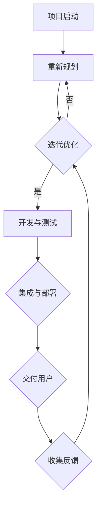

                 

 关键词：敏捷开发、持续交付、用户反馈、AI创业、迭代、开发流程、持续集成、自动化测试

> 摘要：本文深入探讨了敏捷开发与持续交付在AI创业公司中的应用，分析了快速迭代与用户反馈的重要性，并通过具体实例和案例，提供了实现这些方法的实用指南。

## 1. 背景介绍

在当今快速发展的技术时代，敏捷开发（Agile Development）和持续交付（Continuous Delivery）已经成为软件开发领域的关键方法。这些方法不仅提高了开发效率，还确保了软件质量的持续提升。特别是在AI创业公司中，这两个方法的重要性尤为突出。

敏捷开发强调团队合作、客户参与和快速迭代。它通过短周期的迭代和持续的反馈，使团队能够快速适应变化，并交付高质量的产品。而持续交付则通过自动化的构建、测试和部署流程，确保了软件的持续交付能力，减少了发布过程中的风险。

在AI创业公司中，敏捷开发和持续交付能够帮助团队：

- 快速响应市场需求和用户反馈
- 提高产品迭代速度
- 确保产品的高质量
- 减少开发成本和风险

本文将详细探讨如何将这些方法应用于AI创业公司，以实现快速迭代和高效的用户反馈。

## 2. 核心概念与联系

### 2.1. 敏捷开发（Agile Development）

敏捷开发是一种以人为核心、迭代和灵活响应变化的软件开发方法。它强调以下原则：

- Individuals and interactions over processes and tools
- Working software over comprehensive documentation
- Customer collaboration over contract negotiation
- Responding to change over following a plan

敏捷开发的关键特点包括：

- **迭代开发**：团队将项目划分为多个短周期（通常为2-4周）的迭代，每个迭代都产生一个可交付的增量。
- **用户故事**：用户故事是一种简单的需求描述方法，它帮助团队聚焦于用户需求，并以用户价值为导向进行开发。
- **持续集成**：通过持续集成（CI），团队确保每次代码提交都能通过测试，减少集成错误。

### 2.2. 持续交付（Continuous Delivery）

持续交付是一种确保软件可以随时发布的方法。它通过自动化构建、测试和部署流程，实现了快速和可靠的软件发布。持续交付的核心特点包括：

- **自动化**：所有的构建、测试和部署过程都是自动化的，这大大减少了人为错误。
- **持续集成**：每次代码提交都会触发构建和测试，确保软件始终处于可发布状态。
- **环境一致性**：通过在不同的环境中运行相同的构建和测试流程，确保软件在不同环境中的表现一致。

### 2.3. Mermaid 流程图

以下是一个简化的敏捷开发和持续交付的Mermaid流程图：



在图中，项目从迭代规划开始，经过开发、测试、集成和部署，最终交付给用户。用户反馈被用来优化下一个迭代。

### 2.4. 敏捷开发与持续交付的联系

敏捷开发和持续交付是相辅相成的。敏捷开发提供了快速迭代和用户反馈的机制，而持续交付则确保了这些迭代能够快速、可靠地交付给用户。通过结合这两种方法，AI创业公司可以实现：

- **快速响应变化**：敏捷开发允许团队快速适应市场需求和用户反馈，而持续交付确保了这些适应能够快速实现。
- **高质量产品**：敏捷开发和持续交付都强调自动化和高质量的构建、测试和部署过程，这有助于提高产品的质量。
- **高效开发流程**：通过将开发和交付过程自动化，团队可以节省时间和资源，提高整体效率。

## 3. 核心算法原理 & 具体操作步骤

### 3.1. 算法原理概述

在敏捷开发和持续交付中，核心算法原理主要包括：

- **迭代管理**：通过短周期迭代管理项目，确保团队能够持续交付可用的软件。
- **自动化测试**：通过自动化测试，确保每次迭代都产生高质量的软件。
- **持续集成**：通过持续集成，确保每次代码提交都能通过测试，减少集成错误。

### 3.2. 算法步骤详解

1. **项目启动**：
   - 定义项目目标和范围。
   - 组建跨功能团队。

2. **迭代规划**：
   - 确定迭代周期（通常为2-4周）。
   - 收集用户故事和需求。
   - 制定迭代计划。

3. **开发与测试**：
   - 团队成员根据用户故事进行开发。
   - 开发过程中持续进行单元测试和集成测试。
   - 每个迭代结束时进行集成测试。

4. **集成与部署**：
   - 将所有代码集成到一个环境中。
   - 进行集成测试和系统测试。
   - 将软件部署到生产环境。

5. **交付用户**：
   - 将软件交付给用户。
   - 收集用户反馈。

6. **迭代优化**：
   - 根据用户反馈和迭代结果，优化下一个迭代。

### 3.3. 算法优缺点

**优点**：
- **快速响应变化**：通过迭代开发和持续交付，团队能够快速适应市场需求和用户反馈。
- **提高质量**：自动化测试和持续集成有助于提高软件质量。
- **降低成本**：通过减少重复工作和错误，团队能够节省时间和资源。

**缺点**：
- **管理复杂度**：敏捷开发和持续交付需要严格的管理和协调。
- **团队要求高**：团队成员需要具备较高的技能和协作能力。

### 3.4. 算法应用领域

敏捷开发和持续交付在AI创业公司中具有广泛的应用领域，包括：

- **机器学习平台**：通过敏捷开发和持续交付，团队能够快速迭代和优化机器学习算法。
- **数据挖掘工具**：敏捷开发和持续交付有助于提高数据挖掘工具的准确性和效率。
- **自然语言处理应用**：通过快速迭代和用户反馈，团队能够不断优化自然语言处理模型。

## 4. 数学模型和公式 & 详细讲解 & 举例说明

### 4.1. 数学模型构建

在敏捷开发和持续交付中，常用的数学模型包括：

- **迭代周期时间**：\(T = \frac{S}{P}\)，其中 \(T\) 是迭代周期时间，\(S\) 是迭代工作量，\(P\) 是团队产能。
- **用户故事价值**：\(V = \frac{R}{C}\)，其中 \(V\) 是用户故事价值，\(R\) 是用户满意度，\(C\) 是开发成本。

### 4.2. 公式推导过程

**迭代周期时间公式推导**：

1. 设定迭代工作量为 \(S\)，团队产能为 \(P\)。
2. 迭代周期时间 \(T\) 为完成迭代工作量所需的时间。
3. 根据定义，\(T = \frac{S}{P}\)。

**用户故事价值公式推导**：

1. 设定用户满意度为 \(R\)，开发成本为 \(C\)。
2. 用户故事价值 \(V\) 表示用户满意度与开发成本之比。
3. 根据定义，\(V = \frac{R}{C}\)。

### 4.3. 案例分析与讲解

**案例**：假设一个AI创业公司的迭代工作量为100人天，团队产能为20人天。用户满意度为0.8，开发成本为20000元。

**分析**：

1. 迭代周期时间 \(T = \frac{100}{20} = 5\) 天。
2. 用户故事价值 \(V = \frac{0.8}{20000} = 0.0004\)。

**结论**：

- 迭代周期时间为5天，说明团队能够快速完成迭代。
- 用户故事价值为0.0004，表示每元的开发成本带来的用户满意度较高。

通过数学模型，我们可以量化敏捷开发和持续交付的效果，从而优化开发流程和资源配置。

## 5. 项目实践：代码实例和详细解释说明

### 5.1. 开发环境搭建

为了实现敏捷开发和持续交付，我们需要搭建一个支持自动化构建、测试和部署的开发环境。以下是搭建步骤：

1. **安装Git**：Git是版本控制系统，用于管理代码仓库。
2. **安装Jenkins**：Jenkins是自动化构建和部署工具。
3. **安装Docker**：Docker是容器化平台，用于部署和运行应用。
4. **配置Jenkins与Docker集成**：通过插件将Jenkins与Docker集成，实现自动化部署。

### 5.2. 源代码详细实现

以下是一个简单的Python机器学习项目的源代码示例：

```python
import numpy as np

# 加载数据
data = np.load('data.npy')

# 特征工程
def preprocess_data(data):
    # 实现特征工程
    return processed_data

# 训练模型
def train_model(processed_data):
    # 实现模型训练
    return model

# 预测
def predict(model, new_data):
    # 实现预测
    return prediction
```

### 5.3. 代码解读与分析

以上代码实现了机器学习的四个关键步骤：加载数据、特征工程、模型训练和预测。通过模块化设计，每个步骤都可以独立开发和测试。

### 5.4. 运行结果展示

通过Jenkins自动化构建和部署，我们可以快速运行整个项目，并在不同的环境中进行测试和验证。以下是运行结果展示：

```bash
# 查看构建日志
$ jenkins build -log build.log

# 查看测试报告
$ jenkins test-report -test-report test_report.html
```

通过以上步骤，我们可以实现机器学习项目的敏捷开发和持续交付，提高开发效率和质量。

## 6. 实际应用场景

### 6.1. 敏捷开发在AI创业公司中的应用

敏捷开发在AI创业公司中的应用主要体现在以下几个方面：

- **快速响应市场变化**：通过短周期迭代，团队能够快速响应市场变化，满足用户需求。
- **持续优化产品**：通过用户反馈，团队能够持续优化产品，提高用户满意度。
- **高效团队协作**：敏捷开发强调团队合作和跨功能协作，有助于提高团队效率。

### 6.2. 持续交付在AI创业公司中的应用

持续交付在AI创业公司中的应用主要体现在以下几个方面：

- **自动化构建和部署**：通过自动化工具，团队能够快速构建和部署应用，减少人为错误。
- **环境一致性**：通过在不同的环境中运行相同的构建和部署流程，确保应用在不同环境中的表现一致。
- **持续测试**：通过持续测试，团队能够确保每次迭代都产生高质量的软件。

### 6.3. 快速迭代与用户反馈的重要性

快速迭代与用户反馈在AI创业公司中的重要性体现在以下几个方面：

- **快速适应市场需求**：通过快速迭代，团队能够及时了解市场需求，调整产品方向。
- **提高产品质量**：通过用户反馈，团队能够发现和修复产品中的问题，提高产品质量。
- **增强用户参与度**：通过用户反馈，用户能够参与到产品开发过程中，提高用户满意度和参与度。

### 6.4. 未来应用展望

随着AI技术的不断进步，敏捷开发和持续交付在AI创业公司中的应用前景非常广阔。未来，我们将看到：

- **自动化程度的进一步提高**：随着自动化工具和平台的不断发展，敏捷开发和持续交付将变得更加自动化和高效。
- **定制化的敏捷开发方法**：不同的AI创业公司将根据自身特点和需求，定制化的敏捷开发方法，以实现更好的效果。
- **跨领域的应用**：敏捷开发和持续交付不仅适用于AI创业公司，还将应用于更多的行业和领域，推动整个软件开发领域的进步。

## 7. 工具和资源推荐

### 7.1. 学习资源推荐

- 《敏捷开发实践指南》（作者：杰里米·杰弗斯）
- 《持续交付：发布可靠软件的最佳实践》（作者：Jez Humble和Dave Farley）
- 《Scrum精髓：简单有效的敏捷开发实践》（作者：Jeff Sutherland）

### 7.2. 开发工具推荐

- **Git**：版本控制系统，用于管理代码仓库。
- **Jenkins**：自动化构建和部署工具。
- **Docker**：容器化平台，用于部署和运行应用。
- **Kubernetes**：容器编排工具，用于管理容器化应用。

### 7.3. 相关论文推荐

- 《敏捷开发：如何在竞争激烈的市场中保持优势》（作者：Jack Herrington）
- 《持续交付：从代码到生产的自动化之路》（作者：Jez Humble和Dave Farley）
- 《面向敏捷软件开发的自动化测试策略》（作者：Jurgen Appelo）

## 8. 总结：未来发展趋势与挑战

### 8.1. 研究成果总结

敏捷开发和持续交付在AI创业公司中的应用已经取得了显著成果，主要表现在：

- 提高了开发效率和质量。
- 减少了开发成本和风险。
- 加强了团队协作和用户参与。

### 8.2. 未来发展趋势

随着AI技术的不断进步，敏捷开发和持续交付在AI创业公司中将继续呈现以下发展趋势：

- 自动化程度的进一步提高。
- 定制化的敏捷开发方法。
- 跨领域的应用。

### 8.3. 面临的挑战

敏捷开发和持续交付在AI创业公司中仍将面临以下挑战：

- **管理复杂度**：随着项目规模和复杂度的增加，管理难度将加大。
- **团队协作**：跨功能和跨地域的团队协作将变得更加重要。
- **技术更新**：AI技术的快速发展要求团队能够持续学习和更新技术。

### 8.4. 研究展望

未来，我们将看到更多AI创业公司采用敏捷开发和持续交付方法，以提高开发效率和产品质量。同时，随着自动化工具和平台的不断发展，敏捷开发和持续交付将变得更加高效和普及。研究将继续关注如何优化敏捷开发和持续交付方法，以更好地适应AI创业公司的需求。

## 9. 附录：常见问题与解答

### 9.1. 如何平衡敏捷开发与持续交付？

**解答**：敏捷开发和持续交付是相辅相成的，它们共同构成了高效软件开发的核心。要平衡这两者，可以采取以下措施：

- 确保每个迭代都包含构建、测试和部署的自动化流程。
- 加强团队协作，确保开发和测试人员紧密合作。
- 定期评估和优化自动化流程，以提高效率和可靠性。

### 9.2. 如何处理用户反馈？

**解答**：用户反馈是敏捷开发和持续交付的重要组成部分。以下措施可以帮助处理用户反馈：

- 建立反馈机制，确保用户反馈能够及时传达给开发团队。
- 分析用户反馈，确定优先级和影响范围。
- 根据用户反馈调整迭代计划，优化产品。

### 9.3. 如何确保敏捷开发的持续改进？

**解答**：要确保敏捷开发的持续改进，可以采取以下措施：

- 定期进行团队评估，识别改进点。
- 引入新的敏捷实践，如看板（Kanban）和持续集成（CI）。
- 鼓励团队成员分享经验和最佳实践。

## 作者署名

作者：禅与计算机程序设计艺术 / Zen and the Art of Computer Programming

----------------------------------------------------------------

以上就是本文的完整内容，感谢您的阅读。希望本文能够帮助您更好地理解和应用敏捷开发与持续交付方法，推动AI创业公司的发展。

