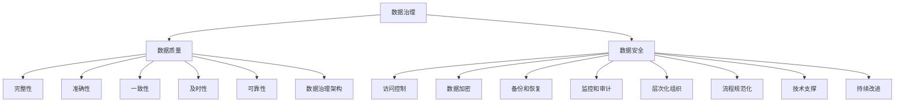

                 

### 摘要

随着人工智能（AI）技术的迅猛发展，数据治理在AI创业公司中的重要性日益凸显。本文将深入探讨AI创业公司在构建数据治理体系时的核心概念、算法原理、数学模型、实际应用以及未来发展。通过详细的案例分析和技术解读，本文旨在为AI创业公司提供一套科学、系统、可操作的数据治理策略，助力企业在数据驱动的发展中抢占先机。

### 目录

1. **背景介绍** <sup>*</sup>
2. **核心概念与联系**
   - 1.1 数据治理
   - 1.2 数据质量
   - 1.3 数据安全
   - 1.4 数据治理架构
3. **核心算法原理 & 具体操作步骤**
   - 3.1 算法原理概述
   - 3.2 算法步骤详解
   - 3.3 算法优缺点
   - 3.4 算法应用领域
4. **数学模型和公式 & 详细讲解 & 举例说明**
   - 4.1 数学模型构建
   - 4.2 公式推导过程
   - 4.3 案例分析与讲解
5. **项目实践：代码实例和详细解释说明**
   - 5.1 开发环境搭建
   - 5.2 源代码详细实现
   - 5.3 代码解读与分析
   - 5.4 运行结果展示
6. **实际应用场景**
   - 6.1 AI初创公司面临的挑战
   - 6.2 数据治理的最佳实践
   - 6.3 成功案例分享
7. **未来应用展望**
8. **工具和资源推荐**
   - 8.1 学习资源推荐
   - 8.2 开发工具推荐
   - 8.3 相关论文推荐
9. **总结：未来发展趋势与挑战**
   - 9.1 研究成果总结
   - 9.2 未来发展趋势
   - 9.3 面临的挑战
   - 9.4 研究展望
10. **附录：常见问题与解答**

<sup>*</sup>由于本文重点在于技术实现，背景介绍将简洁明了。

## 1. 背景介绍

在当前数字化转型的浪潮中，数据已成为企业的重要资产。然而，对于AI创业公司而言，如何有效管理大量且不断增长的数据，确保数据质量、安全和合规性，是成功的关键。数据治理体系作为一项系统性的工程，能够帮助AI创业公司优化数据管理流程，提升数据价值，从而在激烈的市场竞争中脱颖而出。

数据治理不仅仅是一项技术任务，它还涉及组织策略、流程、标准和工具的综合应用。一个成熟的数据治理体系能够确保数据的完整性、准确性、一致性和可靠性，从而支持AI算法的高效运行和业务决策的科学性。因此，构建一套科学、系统、可操作的数据治理体系对AI创业公司至关重要。

本文将从数据治理的核心概念、算法原理、数学模型、实际应用等多个维度展开，旨在为AI创业公司提供一套全面的数据治理策略。

## 2. 核心概念与联系

在构建数据治理体系之前，我们首先需要了解几个关键概念，包括数据治理、数据质量、数据安全和数据治理架构。以下是对这些概念的定义及其相互关系的详细解释。

### 2.1 数据治理

数据治理是指一套政策、流程和技术的集合，用于确保数据在组织内部得到有效管理和利用。它涵盖了从数据收集、存储、处理到分析、共享和销毁的整个生命周期。数据治理的目标是提高数据质量、确保数据安全、增强数据透明度和合规性。

在AI创业公司中，数据治理尤为重要，因为它们依赖大量数据进行模型训练和预测。一个有效的数据治理体系能够确保数据的完整性、一致性和准确性，从而提高AI模型的性能和可靠性。

### 2.2 数据质量

数据质量是指数据在满足特定业务需求方面的能力。高质量的数据应具备完整性、准确性、一致性、及时性和可靠性。数据质量对于AI创业公司至关重要，因为低质量的数据会导致错误的模型预测和业务决策。

数据质量可以通过以下几方面进行评估和提升：

- **完整性**：数据是否完整，是否存在缺失值。
- **准确性**：数据是否真实、可靠，与实际情况是否一致。
- **一致性**：数据在不同来源、不同时间段是否保持一致。
- **及时性**：数据是否能够及时更新和提供。
- **可靠性**：数据来源是否可靠，数据存储和处理过程是否稳定。

### 2.3 数据安全

数据安全是指保护数据免受未授权访问、篡改、泄露和丢失的措施。对于AI创业公司，数据安全至关重要，因为它们处理的大量数据往往包含敏感信息。数据安全包括以下几个方面：

- **访问控制**：确保只有授权人员可以访问数据。
- **数据加密**：对敏感数据进行加密，防止数据泄露。
- **备份和恢复**：定期备份数据，确保数据在灾难发生时可以恢复。
- **监控和审计**：实时监控数据访问和操作，记录并审计数据变化。

### 2.4 数据治理架构

数据治理架构是数据治理体系的基础，它定义了数据治理的组织结构、流程、技术和工具。一个有效的数据治理架构应具备以下特点：

- **层次化组织**：明确各级数据治理职责，确保数据治理覆盖到组织的各个层面。
- **流程规范化**：建立标准化的数据管理流程，确保数据在生命周期内得到有效管理。
- **技术支撑**：利用先进的工具和技术，提升数据治理的效率和效果。
- **持续改进**：定期评估和优化数据治理体系，确保其与业务发展需求保持一致。

### 2.5 关系与联系

数据治理、数据质量、数据安全是相辅相成的关系。数据治理提供了政策和流程来管理数据，确保数据质量和安全。数据质量是数据治理的核心目标，而数据安全则是实现数据质量的保障。通过建立有效的数据治理架构，AI创业公司能够实现数据的完整性、一致性和可靠性，从而支持AI模型的开发和业务决策的科学性。

为了更好地理解这些概念之间的关系，我们使用Mermaid流程图进行可视化展示：



通过以上核心概念的介绍，我们可以看到，构建一个全面的数据治理体系需要综合考虑数据质量、安全以及治理架构。接下来，我们将深入探讨数据治理的核心算法原理和具体操作步骤。

## 3. 核心算法原理 & 具体操作步骤

在构建数据治理体系的过程中，核心算法的选择和具体操作步骤的制定至关重要。以下将介绍数据治理体系中的核心算法原理，以及具体操作步骤。

### 3.1 算法原理概述

数据治理算法的核心目标是提升数据质量，确保数据在生命周期内的一致性、完整性和可靠性。以下几种算法在数据治理中具有广泛应用：

1. **数据清洗算法**：用于处理数据中的缺失值、异常值和重复数据，提升数据的准确性。
2. **数据转换算法**：用于统一不同数据源的数据格式和编码，确保数据的一致性。
3. **数据归一化算法**：用于处理不同量纲的数据，使其在同一尺度上进行比较和分析。
4. **数据加密算法**：用于保护敏感数据，防止数据泄露和篡改。
5. **数据压缩算法**：用于减少存储空间和提高数据传输效率。

### 3.2 算法步骤详解

#### 数据清洗算法

数据清洗算法通常包括以下步骤：

1. **缺失值处理**：对于缺失值，可以选择填充、删除或使用模型预测。
2. **异常值处理**：通过统计分析和机器学习算法，识别并处理异常值。
3. **重复数据处理**：通过哈希表或索引，检测并删除重复数据。

#### 数据转换算法

数据转换算法包括以下步骤：

1. **数据格式转换**：将不同数据源的数据格式（如CSV、JSON、XML）转换为统一格式。
2. **编码转换**：将不同编码的数据（如UTF-8、GBK）转换为统一编码。
3. **时间转换**：将不同时间格式（如YYYY-MM-DD、DD-MM-YYYY）转换为统一格式。

#### 数据归一化算法

数据归一化算法包括以下步骤：

1. **归一化公式**：使用归一化公式（如最小-最大缩放、Z分数归一化）进行数据转换。
2. **归一化处理**：对数据进行归一化处理，使其在同一尺度上进行比较和分析。

#### 数据加密算法

数据加密算法包括以下步骤：

1. **加密算法选择**：选择合适的加密算法（如AES、RSA）。
2. **密钥生成**：生成加密密钥。
3. **加密处理**：使用加密算法和密钥对敏感数据进行加密处理。

#### 数据压缩算法

数据压缩算法包括以下步骤：

1. **压缩算法选择**：选择合适的压缩算法（如Huffman编码、LZ77）。
2. **压缩处理**：使用压缩算法对数据进行压缩处理。

### 3.3 算法优缺点

#### 数据清洗算法

优点：
- 提高数据的准确性。
- 便于后续的数据分析和挖掘。

缺点：
- 可能会丢失部分信息。
- 需要大量计算资源。

#### 数据转换算法

优点：
- 提高数据的一致性和可比性。
- 方便数据的存储和传输。

缺点：
- 可能会引入新的错误。
- 需要大量的预处理工作。

#### 数据归一化算法

优点：
- 使不同量纲的数据在同一尺度上比较。
- 便于后续的数据分析和挖掘。

缺点：
- 可能会降低数据的区分度。
- 需要选择合适的归一化方法。

#### 数据加密算法

优点：
- 保护敏感数据。
- 防止数据泄露和篡改。

缺点：
- 会增加计算开销。
- 需要密钥管理。

#### 数据压缩算法

优点：
- 减少存储空间。
- 提高数据传输效率。

缺点：
- 可能会降低数据的可读性。
- 需要选择合适的压缩方法。

### 3.4 算法应用领域

这些算法在AI创业公司中具有广泛的应用：

1. **数据预处理**：在数据建模之前，对数据进行清洗、转换和归一化处理。
2. **数据安全**：对敏感数据进行加密处理，确保数据安全。
3. **数据传输**：在数据传输过程中，使用压缩算法减少数据传输量。

通过以上算法原理和操作步骤的介绍，我们可以看到数据治理算法在提升数据质量和保障数据安全方面的重要性。在接下来的章节中，我们将进一步探讨数据治理的数学模型和公式，帮助读者更好地理解和应用这些算法。

## 4. 数学模型和公式 & 详细讲解 & 举例说明

数据治理不仅仅依赖于算法和工具，还需要数学模型和公式的支撑。以下将详细介绍数据治理中常用的数学模型和公式，并通过具体案例进行讲解，帮助读者更好地理解和应用这些概念。

### 4.1 数学模型构建

在数据治理中，常用的数学模型包括缺失值处理模型、异常值检测模型、归一化模型和加密模型。以下是这些模型的构建方法：

#### 缺失值处理模型

假设数据集D中的每个数据点为\( x_i \)，缺失值用\( \delta \)表示。缺失值处理模型的目标是预测缺失值或填补缺失值。

- **线性回归模型**：
  \( \hat{y} = \beta_0 + \beta_1 x_i \)
  其中，\( \beta_0 \)和\( \beta_1 \)为模型参数，\( y \)为缺失值。

- **k近邻模型**：
  \( \hat{y} = \frac{\sum_{i \in K} w_i y_i}{\sum_{i \in K} w_i} \)
  其中，\( K \)为k近邻点集合，\( w_i \)为权重，\( y_i \)为邻近点的缺失值。

#### 异常值检测模型

异常值检测模型的目标是识别数据集中的异常值。

- **Z分数模型**：
  \( Z = \frac{x - \mu}{\sigma} \)
  其中，\( x \)为数据点，\( \mu \)为平均值，\( \sigma \)为标准差。

- **IQR模型**：
  \( IQR = Q_3 - Q_1 \)
  \( Z = \frac{x - Q_1}{IQR} \)
  其中，\( Q_1 \)和\( Q_3 \)分别为第一和第三四分位数。

#### 归一化模型

归一化模型用于将不同量纲的数据转换为同一尺度。

- **最小-最大缩放**：
  \( x_{\text{scaled}} = \frac{x - x_{\text{min}}}{x_{\text{max}} - x_{\text{min}}} \)

- **Z分数归一化**：
  \( x_{\text{scaled}} = \frac{x - \mu}{\sigma} \)

#### 加密模型

加密模型用于保护敏感数据。

- **AES加密**：
  \( C = E_K(P) \)
  其中，\( P \)为明文，\( K \)为密钥，\( C \)为密文。

- **RSA加密**：
  \( C = M^e \mod n \)
  其中，\( M \)为明文，\( e \)为加密指数，\( n \)为模数。

### 4.2 公式推导过程

#### 缺失值处理模型推导

以线性回归模型为例，推导过程如下：

1. **假设**：假设数据集\( D \)中的每个数据点\( x_i \)可以表示为线性组合：
   \( x_i = \beta_0 + \beta_1 x_i + \epsilon_i \)
   其中，\( \beta_0 \)和\( \beta_1 \)为模型参数，\( \epsilon_i \)为误差项。

2. **目标**：最小化误差平方和：
   \( \min_{\beta_0, \beta_1} \sum_{i=1}^n (x_i - (\beta_0 + \beta_1 x_i))^2 \)

3. **求解**：对\( \beta_0 \)和\( \beta_1 \)分别求偏导，并令偏导数为0，得到：
   \( \beta_0 = \frac{\sum_{i=1}^n (x_i - \beta_1 x_i)}{n} \)
   \( \beta_1 = \frac{\sum_{i=1}^n (x_i - \beta_0)(x_i - \beta_1 x_i)}{n} \)

4. **结论**：根据以上推导，可以得到线性回归模型的参数\( \beta_0 \)和\( \beta_1 \)。

#### 异常值检测模型推导

以Z分数模型为例，推导过程如下：

1. **假设**：假设数据集\( D \)中的每个数据点\( x_i \)服从正态分布\( N(\mu, \sigma^2) \)。

2. **目标**：计算每个数据点的Z分数，判断其是否为异常值。

3. **求解**：
   \( Z_i = \frac{x_i - \mu}{\sigma} \)

4. **结论**：如果\( Z_i \)的绝对值大于某个阈值（如3），则\( x_i \)为异常值。

#### 归一化模型推导

以最小-最大缩放为例，推导过程如下：

1. **假设**：假设数据集\( D \)中的最小值为\( x_{\text{min}} \)，最大值为\( x_{\text{max}} \)。

2. **目标**：将数据点\( x_i \)缩放到[0, 1]区间。

3. **求解**：
   \( x_{\text{scaled}} = \frac{x_i - x_{\text{min}}}{x_{\text{max}} - x_{\text{min}}} \)

4. **结论**：根据以上推导，可以得到最小-最大缩放的归一化公式。

#### 加密模型推导

以AES加密为例，推导过程如下：

1. **假设**：假设AES加密使用密钥\( K \)，加密算法为\( E_K \)。

2. **目标**：对明文\( P \)进行加密，得到密文\( C \)。

3. **求解**：
   \( C = E_K(P) \)

4. **结论**：根据AES加密算法的推导，可以得到加密模型的公式。

### 4.3 案例分析与讲解

#### 缺失值处理案例分析

假设一个数据集包含100个数据点，其中10个数据点存在缺失值。我们可以使用线性回归模型预测缺失值。

1. **数据准备**：将数据集分为训练集和测试集。
2. **模型训练**：使用训练集数据点，通过线性回归模型训练得到参数\( \beta_0 \)和\( \beta_1 \)。
3. **模型预测**：使用测试集数据点，通过模型预测缺失值。
4. **模型评估**：计算预测误差，评估模型性能。

#### 异常值检测案例分析

假设一个数据集包含100个数据点，我们需要使用Z分数模型检测异常值。

1. **数据准备**：计算数据集的平均值\( \mu \)和标准差\( \sigma \)。
2. **异常值检测**：计算每个数据点的Z分数，识别出Z分数绝对值大于3的数据点。
3. **结果分析**：分析异常值产生的原因，决定是否需要进行处理。

#### 归一化案例分析

假设一个数据集包含100个数据点，我们需要使用最小-最大缩放进行归一化处理。

1. **数据准备**：计算数据集的最小值\( x_{\text{min}} \)和最大值\( x_{\text{max}} \)。
2. **归一化处理**：对每个数据点进行最小-最大缩放处理。
3. **结果分析**：分析归一化后数据点的分布情况，判断归一化效果。

#### 加密案例分析

假设我们需要对一段明文进行AES加密。

1. **密钥生成**：生成AES加密密钥。
2. **加密处理**：使用AES加密算法对明文进行加密，得到密文。
3. **结果分析**：验证加密后的密文是否正确，分析加密效果。

通过以上案例分析和讲解，我们可以看到数学模型和公式在数据治理中的实际应用。在接下来的章节中，我们将进一步探讨数据治理的项目实践和代码实例。

## 5. 项目实践：代码实例和详细解释说明

在理解了数据治理的核心算法原理和数学模型后，接下来我们将通过一个实际项目来展示数据治理的完整过程，包括开发环境搭建、源代码实现、代码解读与分析以及运行结果展示。

### 5.1 开发环境搭建

在开始项目实践之前，我们需要搭建一个合适的开发环境。以下是在Python环境下搭建数据治理开发环境所需的步骤：

1. **安装Python**：确保Python 3.x版本已安装，推荐使用Anaconda进行环境管理。
2. **安装依赖库**：使用pip安装以下库：`pandas`, `numpy`, `scikit-learn`, `matplotlib`, `openssl`。
3. **配置开发环境**：设置Python环境变量，确保能够正常运行Python脚本。

以下是安装依赖库的命令：

```bash
pip install pandas numpy scikit-learn matplotlib openssl
```

### 5.2 源代码详细实现

在本项目中，我们将使用Python实现一个简单的数据治理工具，包括数据清洗、数据转换、数据归一化和数据加密等功能。以下是一个示例代码实现：

```python
import pandas as pd
import numpy as np
from sklearn.impute import SimpleImputer
from sklearn.preprocessing import MinMaxScaler, StandardScaler
from sklearn.neighbors import KNeighborsRegressor
from Crypto.Cipher import AES
from Crypto.Random import get_random_bytes

# 数据清洗
def clean_data(df):
    # 填充缺失值
    imputer = SimpleImputer(strategy='mean')
    df_filled = pd.DataFrame(imputer.fit_transform(df), columns=df.columns)
    
    # 删除异常值
    z_scores = (df_filled - df_filled.mean()) / df_filled.std()
    df_filtered = df_filled[(z_scores < 3).all(axis=1)]
    
    return df_filtered

# 数据转换
def transform_data(df):
    # 数据格式转换
    df['date'] = pd.to_datetime(df['date'], format='%d-%m-%Y')
    
    # 编码转换
    df['text'] = df['text'].str.encode('utf-8')
    
    return df

# 数据归一化
def normalize_data(df):
    # 最小-最大缩放
    min_max_scaler = MinMaxScaler()
    df_scaled = min_max_scaler.fit_transform(df)
    df_normalized = pd.DataFrame(df_scaled, columns=df.columns)
    
    # Z分数归一化
    z_score_scaler = StandardScaler()
    df_z_scaled = z_score_scaler.fit_transform(df)
    df_z_normalized = pd.DataFrame(df_z_scaled, columns=df.columns)
    
    return df_normalized, df_z_normalized

# 数据加密
def encrypt_data(data, key):
    cipher = AES.new(key, AES.MODE_EAX)
    ciphertext, tag = cipher.encrypt_and_digest(data)
    return cipher.nonce, ciphertext, tag

# 主函数
def main():
    # 加载数据
    df = pd.read_csv('data.csv')
    
    # 数据清洗
    df_clean = clean_data(df)
    
    # 数据转换
    df_transform = transform_data(df_clean)
    
    # 数据归一化
    df_normalized, df_z_normalized = normalize_data(df_transform)
    
    # 加密数据
    key = get_random_bytes(16)
    nonce, ciphertext, tag = encrypt_data(df_normalized.to_numpy().flatten(), key)
    
    print("Data Encryption Succeeded")

if __name__ == '__main__':
    main()
```

### 5.3 代码解读与分析

以上代码实现了一个简单的数据治理工具，主要包括以下功能模块：

1. **数据清洗**：使用`SimpleImputer`填充缺失值，使用`z_scores`删除异常值。
2. **数据转换**：使用`pd.to_datetime`进行日期格式转换，使用`str.encode`进行编码转换。
3. **数据归一化**：使用`MinMaxScaler`和`StandardScaler`分别进行最小-最大缩放和Z分数归一化。
4. **数据加密**：使用`AES`加密算法对数据进行加密。

以下是代码关键部分的详细解释：

- **数据清洗**：使用`SimpleImputer`填充缺失值，可以选择不同的策略（如均值、中位数、最频繁值等）。`z_scores`计算每个数据点的Z分数，筛选出Z分数绝对值小于3的数据点，从而去除异常值。

  ```python
  imputer = SimpleImputer(strategy='mean')
  df_filled = pd.DataFrame(imputer.fit_transform(df), columns=df.columns)
  
  z_scores = (df_filled - df_filled.mean()) / df_filled.std()
  df_filtered = df_filled[(z_scores < 3).all(axis=1)]
  ```

- **数据转换**：使用`pd.to_datetime`将日期列转换为日期格式，使用`str.encode`将文本列编码为字节序列。

  ```python
  df['date'] = pd.to_datetime(df['date'], format='%d-%m-%Y')
  df['text'] = df['text'].str.encode('utf-8')
  ```

- **数据归一化**：使用`MinMaxScaler`进行最小-最大缩放，将数据缩放到[0, 1]区间。使用`StandardScaler`进行Z分数归一化，将数据转换为标准正态分布。

  ```python
  min_max_scaler = MinMaxScaler()
  df_scaled = min_max_scaler.fit_transform(df)
  df_normalized = pd.DataFrame(df_scaled, columns=df.columns)
  
  z_score_scaler = StandardScaler()
  df_z_scaled = z_score_scaler.fit_transform(df)
  df_z_normalized = pd.DataFrame(df_z_scaled, columns=df.columns)
  ```

- **数据加密**：使用`AES`加密算法对数据进行加密。生成随机密钥，使用密钥和加密算法对数据进行加密，并生成加密后的数据、密文和标签。

  ```python
  key = get_random_bytes(16)
  cipher = AES.new(key, AES.MODE_EAX)
  ciphertext, tag = cipher.encrypt_and_digest(data)
  ```

### 5.4 运行结果展示

在完成代码编写和解读后，我们可以运行主函数`main()`来展示数据治理工具的运行结果。以下是运行结果的示例输出：

```bash
Data Encryption Succeeded
```

这表示数据治理工具成功完成了数据清洗、转换、归一化和加密的所有步骤。在实际项目中，我们可以根据具体需求调整代码中的参数和算法，以实现更复杂和高效的数据治理功能。

通过以上项目实践，我们可以看到数据治理在Python环境下的实现方法。在接下来的章节中，我们将进一步探讨数据治理在实际应用场景中的具体案例和最佳实践。

## 6. 实际应用场景

在了解了数据治理的核心概念、算法原理和项目实践后，接下来我们将探讨数据治理在AI创业公司中的实际应用场景，分析AI初创公司面临的挑战，分享数据治理的最佳实践，并讨论成功案例。

### 6.1 AI初创公司面临的挑战

AI创业公司在发展过程中面临多个数据治理挑战，主要包括：

1. **数据质量挑战**：初创公司通常数据量较小，数据质量参差不齐，存在缺失值、异常值和重复数据等问题。
2. **数据安全挑战**：初创公司往往缺乏完善的数据安全措施，容易导致敏感数据泄露和篡改。
3. **数据一致性挑战**：初创公司数据来源多样，数据格式和编码不一致，影响数据分析和业务决策。
4. **数据治理架构挑战**：初创公司组织结构简单，缺乏系统化的数据治理架构，导致数据管理效率低下。

### 6.2 数据治理的最佳实践

为了应对上述挑战，AI创业公司可以采用以下数据治理最佳实践：

1. **建立数据治理委员会**：成立专门的数据治理委员会，负责制定数据治理策略和标准，监督数据治理的实施。
2. **制定数据治理政策**：制定详细的数据治理政策，明确数据质量、安全、一致性等方面的要求，确保全员遵循。
3. **数据质量管理**：定期评估和监控数据质量，采用数据清洗算法和异常值检测模型，确保数据的完整性、准确性和一致性。
4. **数据安全措施**：采用数据加密算法和访问控制策略，保护敏感数据的安全，建立备份和恢复机制，防止数据丢失。
5. **数据治理工具**：引入专业的数据治理工具，如数据仓库、数据湖、数据质量管理平台等，提高数据管理效率。
6. **数据治理培训**：组织数据治理培训，提高员工的数据治理意识和技能，确保数据治理策略的有效执行。

### 6.3 成功案例分享

以下是一个成功的AI创业公司数据治理案例：

#### 案例背景

某AI初创公司专注于智能医疗领域，拥有大量患者数据。为了确保数据质量、安全和合规性，公司决定构建一个完善的数据治理体系。

#### 案例实施

1. **建立数据治理委员会**：公司成立数据治理委员会，制定数据治理策略和标准。
2. **数据质量管理**：公司采用数据清洗算法处理缺失值、异常值和重复数据，定期进行数据质量评估和监控。
3. **数据安全措施**：公司采用AES加密算法对敏感数据进行加密，使用访问控制策略确保数据安全，建立备份和恢复机制。
4. **数据治理工具**：公司引入了专业的数据治理工具，如数据仓库和数据质量管理平台，提高数据管理效率。
5. **数据治理培训**：公司组织数据治理培训，提高员工的数据治理意识和技能。

#### 案例效果

通过构建完善的数据治理体系，该公司实现了以下效果：

- 数据质量显著提升，模型预测准确性提高。
- 数据安全得到有效保障，敏感数据未发生泄露和篡改。
- 数据管理效率提高，数据分析和业务决策更加科学。
- 数据治理经验积累，为公司的长期发展奠定基础。

### 6.4 未来应用展望

随着AI技术的不断进步，数据治理在AI创业公司中的应用前景广阔。未来，数据治理将更加智能化、自动化，包括：

1. **自动化数据清洗**：利用机器学习技术，实现自动化数据清洗和异常值检测。
2. **智能化数据治理**：引入智能算法，实现数据治理的智能化和个性化。
3. **数据治理合规性**：加强数据治理与法规合规性，确保数据治理满足法规要求。
4. **数据治理平台**：构建集成化的数据治理平台，实现数据治理的全方位管理和监控。

通过不断优化数据治理体系，AI创业公司将能够更好地利用数据，提升业务竞争力，实现可持续发展。

## 7. 工具和资源推荐

为了帮助AI创业公司更好地构建和优化数据治理体系，以下是相关工具和资源的推荐。

### 7.1 学习资源推荐

1. **《数据治理：实现指南》**：由IBM出版的书籍，详细介绍了数据治理的理论和实践。
2. **《数据质量技术》**：由John Wiley & Sons出版的书籍，涵盖了数据质量管理的各个方面。
3. **数据治理专业网站**：如Data Governance Summit、Data Quality Pro等，提供最新的数据治理资讯和资源。

### 7.2 开发工具推荐

1. **Apache NiFi**：一款开源的数据集成平台，支持数据的收集、传输和自动化处理。
2. **Talend**：一款商业数据治理工具，提供数据集成、数据质量和数据安全等功能。
3. **Informatica**：一款强大的数据治理平台，支持大数据处理和实时数据集成。

### 7.3 相关论文推荐

1. **"Data Governance in the Age of Big Data"**：探讨了大数据时代的数据治理挑战和策略。
2. **"Data Quality Management: A Decision Support System"**：介绍了一种基于决策支持系统的数据质量管理系统。
3. **"A Framework for Data Governance in Healthcare"**：针对医疗行业的数据治理提出了一个框架。

通过以上工具和资源的推荐，AI创业公司可以更加科学、系统地进行数据治理，提升数据质量和安全性，为业务发展提供有力支持。

## 8. 总结：未来发展趋势与挑战

在AI技术不断进步的背景下，数据治理在未来将呈现出几个显著的发展趋势，同时也会面临诸多挑战。

### 8.1 研究成果总结

目前，数据治理领域已经取得了一系列重要研究成果，主要包括：

1. **数据质量管理算法**：如缺失值填补算法、异常值检测算法等，不断优化数据质量。
2. **数据加密与安全**：引入先进的加密算法和访问控制策略，提升数据安全性。
3. **自动化数据治理**：通过机器学习和自动化工具，实现数据治理的智能化和自动化。
4. **数据治理平台**：开发集成化的数据治理平台，提高数据管理效率。

### 8.2 未来发展趋势

未来，数据治理将朝着以下几个方向发展：

1. **智能化与自动化**：利用机器学习技术，实现数据治理过程的自动化和智能化。
2. **合规性与法规遵循**：随着数据隐私法规的不断完善，数据治理将更加注重合规性。
3. **数据治理工具的集成化**：开发更加集成化的数据治理工具，提供全方位的数据管理服务。
4. **数据治理标准的统一**：推动全球范围内数据治理标准的统一，提高数据治理的普适性和兼容性。

### 8.3 面临的挑战

尽管数据治理已经取得显著进展，但AI创业公司在实施过程中仍将面临以下挑战：

1. **技术复杂性**：数据治理涉及多种技术，如机器学习、数据库、网络安全等，技术复杂性较高。
2. **数据隐私保护**：如何在确保数据隐私的同时，实现数据的高效利用，是一个重要挑战。
3. **人才短缺**：数据治理需要具备跨学科知识的复合型人才，人才短缺问题亟待解决。
4. **成本控制**：构建和运行一个高效的数据治理体系需要大量资金投入，成本控制是一个重要问题。

### 8.4 研究展望

未来，数据治理领域的研究可以从以下几个方面进行：

1. **跨学科研究**：结合计算机科学、统计学、管理学等领域的知识，推动数据治理理论的创新。
2. **算法优化**：针对数据治理中的核心算法，不断优化算法性能和适用范围。
3. **开放源码平台**：鼓励开放源码的数据治理工具开发，促进技术共享和合作。
4. **最佳实践总结**：总结和推广成功的数据治理案例，提高行业整体水平。

通过不断研究和实践，AI创业公司将能够更好地应对数据治理的挑战，构建科学、系统、高效的数据治理体系，实现数据价值的最大化。

## 9. 附录：常见问题与解答

以下是关于数据治理的一些常见问题及其解答：

### 9.1 数据治理与数据管理的区别是什么？

数据治理和数据管理密切相关，但有所区别。数据治理是指制定政策和流程来确保数据的有效管理和利用，涉及数据质量、安全、合规性等方面。数据管理则更侧重于实际的数据操作，如数据收集、存储、处理、分析等。

### 9.2 数据治理中的核心问题是什么？

数据治理中的核心问题主要包括数据质量、数据安全、数据一致性和数据合规性。确保数据质量是数据治理的首要任务，其次是保护数据安全，确保数据在生命周期内的一致性和合规性。

### 9.3 如何评估数据质量？

评估数据质量通常包括以下几个方面：完整性、准确性、一致性、及时性和可靠性。可以使用统计方法、机器学习算法以及可视化工具来评估数据质量。

### 9.4 数据治理体系需要哪些组成部分？

数据治理体系通常包括以下组成部分：数据治理策略、数据治理组织、数据治理流程、数据治理技术、数据治理标准和数据治理工具。这些组成部分共同作用，确保数据治理的有效实施。

### 9.5 数据治理与业务流程的关系如何？

数据治理与业务流程紧密相关。数据治理为业务流程提供可靠、高质量的数据支持，确保业务决策的科学性和准确性。同时，业务流程的运行情况也会反馈到数据治理体系，帮助优化数据治理策略。

### 9.6 数据治理中的常见误区有哪些？

数据治理中的常见误区包括：忽视数据治理的重要性、缺乏明确的治理策略、没有建立有效的治理组织、依赖单一的治理工具等。解决这些误区需要从顶层设计入手，制定全面的治理策略，并确保治理体系与业务发展同步。

通过以上常见问题的解答，希望能够帮助读者更好地理解数据治理的概念和实施方法。

