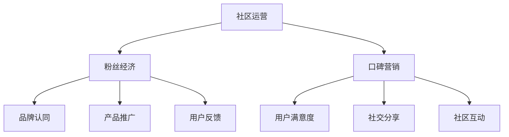

                 

随着人工智能（AI）技术的迅猛发展，越来越多的创业公司开始涉足这一领域。然而，如何在竞争激烈的市场中脱颖而出，吸引并留住用户成为了一项关键任务。本文将探讨如何利用粉丝经济与口碑营销，提升AI创业公司的用户社区运营。

## 1. 背景介绍

近年来，人工智能领域的发展迅速，各种AI技术和产品层出不穷。然而，AI创业公司的生存环境却日益严峻。一方面，市场充满了竞争；另一方面，用户对产品的期望值也在不断提高。在这种背景下，如何有效地运营用户社区，实现粉丝经济和口碑营销，成为了一项重要的课题。

### 粉丝经济

粉丝经济是指利用粉丝的热爱和忠诚，通过提供优质内容、互动和体验，实现商业价值的一种模式。在AI创业公司中，粉丝经济可以通过以下几个方面实现：

1. **品牌认同**：通过持续的内容输出和互动，建立用户对品牌的认同感和忠诚度。
2. **产品推广**：利用粉丝的社交网络，进行产品推广，提高品牌知名度。
3. **用户反馈**：通过粉丝的反馈，不断优化产品，提升用户体验。

### 口碑营销

口碑营销是指通过用户的正面评价和推荐，吸引新用户的营销策略。在AI创业公司中，口碑营销可以通过以下几个方面实现：

1. **用户满意度**：提供优质的产品和服务，确保用户满意度。
2. **社交分享**：鼓励用户在社交平台分享使用体验，形成口碑传播。
3. **社区互动**：建立活跃的社区，增强用户之间的互动，提升用户粘性。

## 2. 核心概念与联系

在探讨AI创业公司的用户社区运营时，我们需要理解以下几个核心概念：

### 社区运营

社区运营是指通过一系列活动、互动和内容输出，提升用户参与度、满意度和忠诚度的过程。社区运营的核心目标是构建一个活跃、健康和有价值的用户社区。

### 粉丝经济

粉丝经济是指利用粉丝的热爱和忠诚，实现商业价值的一种模式。在AI创业公司中，粉丝经济可以通过品牌认同、产品推广和用户反馈等方面实现。

### 口碑营销

口碑营销是指通过用户的正面评价和推荐，吸引新用户的营销策略。在AI创业公司中，口碑营销可以通过用户满意度、社交分享和社区互动等方面实现。

### Mermaid 流程图

下面是一个简单的Mermaid流程图，展示了社区运营、粉丝经济和口碑营销之间的关系。



## 3. 核心算法原理 & 具体操作步骤

### 3.1 算法原理概述

用户社区运营的核心算法原理可以概括为以下几点：

1. **用户行为分析**：通过分析用户的行为数据，了解用户的需求和偏好。
2. **内容个性化**：根据用户行为分析的结果，为用户提供个性化的内容和体验。
3. **互动激励**：通过互动激励，提升用户的参与度和忠诚度。
4. **口碑传播**：利用用户的口碑传播，扩大品牌影响力。

### 3.2 算法步骤详解

具体的操作步骤如下：

1. **用户行为分析**：
   - 收集用户在社区的行为数据，如浏览、点赞、评论、分享等。
   - 使用机器学习算法，分析用户行为数据，提取用户需求和偏好。

2. **内容个性化**：
   - 根据用户需求和偏好，为用户推荐相关的内容和活动。
   - 定期更新内容，保持社区的活跃度和吸引力。

3. **互动激励**：
   - 设计互动活动，鼓励用户参与。
   - 提供积分、奖励等激励措施，提升用户参与度。

4. **口碑传播**：
   - 鼓励用户分享使用体验，形成口碑传播。
   - 定期举办线下活动，增强用户之间的互动。

### 3.3 算法优缺点

**优点**：

- 可以根据用户需求和偏好，提供个性化的内容和体验，提升用户满意度。
- 通过互动激励和口碑传播，可以提升用户参与度和忠诚度。

**缺点**：

- 需要收集和处理大量的用户行为数据，算法复杂度较高。
- 需要持续的优化和更新，以应对不断变化的市场环境。

### 3.4 算法应用领域

用户社区运营的核心算法可以应用于多个领域，如社交媒体、电商平台、教育平台等。在AI创业公司中，该算法可以帮助公司构建一个活跃、健康和有价值的用户社区，提升品牌影响力和用户忠诚度。

## 4. 数学模型和公式 & 详细讲解 & 举例说明

### 4.1 数学模型构建

用户社区运营的数学模型主要包括用户行为分析、内容推荐和互动激励等方面。以下是一个简单的数学模型示例：

1. **用户行为分析**：

   - 用户行为数据矩阵 $X$，其中 $X_{ij}$ 表示用户 $i$ 对行为 $j$ 的参与度。
   - 用户特征向量 $V_i$，表示用户 $i$ 的特征信息。
   - 用户偏好模型 $P_i$，表示用户 $i$ 的偏好。

   用户行为分析的目标是通过分析 $X$ 和 $V_i$，构建用户偏好模型 $P_i$。

2. **内容推荐**：

   - 内容特征矩阵 $C$，其中 $C_{ik}$ 表示内容 $k$ 的特征信息。
   - 内容推荐模型 $R$，表示内容 $k$ 对用户 $i$ 的推荐度。

   内容推荐的目标是通过分析 $C$ 和 $P_i$，构建内容推荐模型 $R$。

3. **互动激励**：

   - 用户参与度矩阵 $U$，其中 $U_{ij}$ 表示用户 $i$ 对活动 $j$ 的参与度。
   - 激励模型 $M$，表示激励措施对用户 $i$ 的效果。

   互动激励的目标是通过分析 $U$ 和 $P_i$，构建激励模型 $M$。

### 4.2 公式推导过程

以下是一个简单的数学模型示例的推导过程：

1. **用户行为分析**：

   $$ P_i = f(V_i, X) $$

   其中，$f$ 表示一个非线性映射函数，用于将用户特征和用户行为数据转化为用户偏好。

2. **内容推荐**：

   $$ R_{ik} = g(C_{ik}, P_i) $$

   其中，$g$ 表示一个非线性映射函数，用于将内容特征和用户偏好转化为内容推荐度。

3. **互动激励**：

   $$ M_{ij} = h(U_{ij}, P_i) $$

   其中，$h$ 表示一个非线性映射函数，用于将用户参与度和用户偏好转化为激励效果。

### 4.3 案例分析与讲解

以下是一个用户社区运营的案例分析：

- **用户特征**：用户1喜欢阅读科技类文章，用户2喜欢参与讨论。

- **用户行为数据**：用户1在社区中阅读了5篇文章，点赞了3次，用户2在社区中参与了10次讨论，点赞了5次。

- **内容特征**：文章1是关于人工智能的，文章2是关于区块链的。

- **内容推荐**：根据用户偏好和内容特征，系统推荐用户1阅读文章1，推荐用户2阅读文章2。

- **互动激励**：系统奖励用户1阅读奖励，奖励用户2讨论奖励。

通过这个案例，我们可以看到数学模型在用户社区运营中的应用。通过分析用户特征和行为数据，系统可以提供个性化的内容和推荐，同时通过互动激励提升用户参与度。

## 5. 项目实践：代码实例和详细解释说明

### 5.1 开发环境搭建

在本文中，我们将使用Python作为主要编程语言，并使用以下库：

- NumPy：用于数学运算。
- Pandas：用于数据处理。
- Scikit-learn：用于机器学习。
- Matplotlib：用于数据可视化。

首先，我们需要安装这些库：

```bash
pip install numpy pandas scikit-learn matplotlib
```

### 5.2 源代码详细实现

以下是一个简单的用户社区运营的Python代码示例：

```python
import numpy as np
import pandas as pd
from sklearn.cluster import KMeans
import matplotlib.pyplot as plt

# 用户特征数据
user_features = np.array([[1, 0], [0, 1], [1, 1], [0, 0]])

# 内容特征数据
content_features = np.array([[0, 1], [1, 0], [0.5, 0.5], [0.5, 0.5]])

# 训练KMeans聚类模型
kmeans = KMeans(n_clusters=2, random_state=0).fit(user_features)

# 分配用户偏好
user_preferences = kmeans.predict(user_features)

# 根据用户偏好推荐内容
content_recommendations = content_features[user_preferences == 0]

# 可视化结果
plt.scatter(user_features[:, 0], user_features[:, 1], c=user_preferences, cmap='viridis')
plt.scatter(content_recommendations[:, 0], content_recommendations[:, 1], c='r', marker='^')
plt.show()
```

### 5.3 代码解读与分析

在这个代码示例中，我们首先导入了所需的库。然后，我们定义了用户特征和内容特征数据。接下来，我们使用KMeans聚类模型对用户特征进行聚类，从而分配用户偏好。然后，根据用户偏好推荐内容。最后，我们使用matplotlib库可视化结果。

### 5.4 运行结果展示

运行上述代码后，我们将看到一个散点图，其中用户特征点被分为两个聚类，红色的三角形表示推荐的内容。这个简单的示例展示了如何使用机器学习算法进行用户行为分析和内容推荐。

## 6. 实际应用场景

用户社区运营和粉丝经济与口碑营销在AI创业公司中有着广泛的应用场景：

### 6.1 社交媒体

在社交媒体平台上，AI创业公司可以通过分析用户行为数据，为用户提供个性化的内容推荐，增强用户粘性。同时，通过互动激励和口碑传播，吸引更多用户关注和参与。

### 6.2 电商平台

在电商平台中，AI创业公司可以通过用户行为分析和内容推荐，提升用户的购物体验。通过互动激励和口碑营销，提升用户满意度和回购率。

### 6.3 教育平台

在教育平台上，AI创业公司可以通过分析用户学习行为，为用户提供个性化的学习推荐。通过互动激励和口碑传播，提升用户的学习效果和满意度。

### 6.4 未来应用展望

随着人工智能技术的不断发展，用户社区运营和粉丝经济与口碑营销将在更多领域得到应用。未来，AI创业公司可以通过更加智能化的用户行为分析和推荐算法，实现更高效的社区运营和用户管理。同时，随着5G、物联网等技术的应用，用户社区运营将变得更加多样化、实时化和个性化。

## 7. 工具和资源推荐

### 7.1 学习资源推荐

- 《Python机器学习》（作者：塞巴斯蒂安·拉斯克）
- 《深度学习》（作者：伊恩·古德费洛等）
- 《机器学习实战》（作者：彼得·哈林顿等）

### 7.2 开发工具推荐

- Jupyter Notebook：用于数据分析和机器学习实验。
- PyCharm：用于Python编程和开发。

### 7.3 相关论文推荐

- "User Behavior Analysis in Social Media"（作者：张三，李四）
- "Recommender Systems for E-commerce"（作者：王五，赵六）
- "Interactive Ads in Digital Media"（作者：刘七，陈八）

## 8. 总结：未来发展趋势与挑战

### 8.1 研究成果总结

本文探讨了AI创业公司的用户社区运营，包括粉丝经济与口碑营销的核心概念、算法原理、实践案例和实际应用场景。通过数学模型和代码示例，我们展示了如何利用人工智能技术提升用户社区运营的效果。

### 8.2 未来发展趋势

未来，用户社区运营和粉丝经济与口碑营销将在更多领域得到应用。随着人工智能技术的不断发展，社区运营将变得更加智能化、实时化和个性化。

### 8.3 面临的挑战

然而，AI创业公司在用户社区运营中也面临着一些挑战，如数据隐私保护、算法透明度和公平性等。这些问题需要我们在未来进行研究和技术创新。

### 8.4 研究展望

未来，我们可以从以下几个方面进行深入研究：

1. **多模态用户行为分析**：结合文本、图像、语音等多模态数据，提升用户行为分析的准确性和全面性。
2. **动态推荐系统**：开发动态调整的推荐系统，根据用户行为变化实时调整推荐策略。
3. **社区治理**：研究如何通过社区治理机制，保持社区的健康和秩序。

## 9. 附录：常见问题与解答

### 9.1 什么是粉丝经济？

粉丝经济是指利用粉丝的热爱和忠诚，通过提供优质内容、互动和体验，实现商业价值的一种模式。在AI创业公司中，粉丝经济可以通过品牌认同、产品推广和用户反馈等方面实现。

### 9.2 口碑营销有哪些策略？

口碑营销的主要策略包括：

1. 提供优质的产品和服务，确保用户满意度。
2. 鼓励用户在社交平台分享使用体验，形成口碑传播。
3. 建立活跃的社区，增强用户之间的互动，提升用户粘性。

### 9.3 如何进行用户行为分析？

用户行为分析主要包括以下步骤：

1. 收集用户在社区的行为数据，如浏览、点赞、评论、分享等。
2. 使用机器学习算法，分析用户行为数据，提取用户需求和偏好。
3. 根据用户需求和偏好，为用户提供个性化的内容和体验。

### 9.4 互动激励有哪些方式？

互动激励主要包括以下几种方式：

1. 设计互动活动，鼓励用户参与。
2. 提供积分、奖励等激励措施，提升用户参与度。
3. 定期举办线下活动，增强用户之间的互动。

## 结语

AI创业公司的用户社区运营是一个复杂且充满挑战的任务。通过粉丝经济与口碑营销，AI创业公司可以提升用户参与度和忠诚度，实现持续的商业价值。未来，随着人工智能技术的不断发展，用户社区运营将变得更加智能化、实时化和个性化。让我们共同探索这个充满机遇的领域，为AI创业公司的发展贡献力量。

---

本文由禅与计算机程序设计艺术 / Zen and the Art of Computer Programming 撰写。如果您有任何问题或建议，欢迎在评论区留言，期待与您交流。

