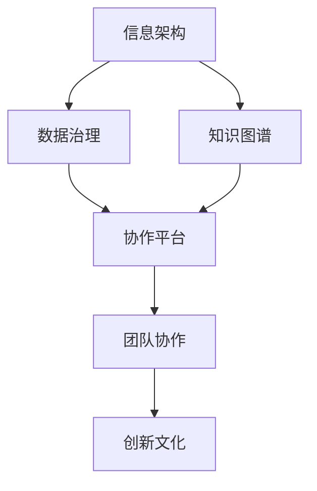

                 

关键词：知识管理、AI创业公司、信息架构、数据治理、知识图谱、协作平台、AI技术、敏捷开发、团队协作、创新文化

> 摘要：本文旨在探讨AI创业公司在快速发展的背景下，如何通过有效的知识管理策略来提升团队协作效率、促进创新文化，并确保数据治理和信息安全。文章将详细阐述知识管理的核心概念、实施步骤、最佳实践以及面临的挑战和未来发展方向。

## 1. 背景介绍

随着人工智能技术的迅速发展，AI创业公司如雨后春笋般涌现。这些公司往往具有创新性强、技术迭代快的特性。在这样的环境中，如何有效地管理知识资源，已经成为影响公司竞争力的关键因素。知识管理不仅包括技术的应用，还涉及到团队的协作、文化的塑造以及战略的规划。

### 1.1 知识管理的重要性

知识管理在AI创业公司中具有以下几个方面的关键作用：

- **提高团队效率**：通过知识共享和协作，团队成员可以快速获取所需的信息，减少重复工作，提高工作效率。

- **促进创新**：知识管理有助于积累和分享公司的创新经验，为新的项目提供宝贵的参考和灵感。

- **确保数据治理**：良好的知识管理可以确保数据的准确性和一致性，有助于合规性和信息安全。

- **增强竞争力**：知识管理有助于公司积累宝贵的知识产权和专业知识，提高市场竞争力。

### 1.2 知识管理的挑战

AI创业公司在知识管理方面也面临着一系列挑战：

- **信息过载**：随着数据和信息的不断增长，如何筛选和利用有价值的信息成为难题。

- **数据隐私**：在保护客户隐私和数据安全的同时，如何有效地利用数据资源。

- **文化差异**：团队成员来自不同的背景和文化，如何建立共同的知识共享和协作平台。

- **技术变革**：AI技术的快速迭代要求知识管理策略也必须灵活适应，以保持竞争力。

## 2. 核心概念与联系

知识管理涉及多个核心概念和联系，以下是一个简化的Mermaid流程图，展示了这些概念和联系：



### 2.1 信息架构

信息架构是指组织和结构化信息的体系，它是知识管理的基础。一个良好的信息架构能够帮助团队成员快速找到所需的信息，减少信息过载的问题。

### 2.2 数据治理

数据治理是确保数据质量、安全性和合规性的过程。在AI创业公司中，数据治理的重要性不言而喻，因为它直接关系到客户隐私和公司声誉。

### 2.3 知识图谱

知识图谱是一种用于表示实体及其关系的图形结构，它能够帮助公司理解和利用复杂的知识网络，提升知识管理的深度和广度。

### 2.4 协作平台

协作平台是知识管理和团队协作的核心工具，它不仅提供信息共享和协作功能，还可以集成各种AI工具，提高团队的协作效率。

### 2.5 团队协作

团队协作是知识管理的重要组成部分，良好的团队协作能够促进知识的流动和创新，提升公司的整体竞争力。

### 2.6 创新文化

创新文化是知识管理的灵魂，它鼓励团队成员勇于尝试、接受失败，并从中学习。创新文化有助于公司在快速变化的市场中保持竞争优势。

## 3. 核心算法原理 & 具体操作步骤

### 3.1 算法原理概述

知识管理中的核心算法包括信息检索、知识抽取、知识融合和知识可视化等。以下是一个简化的算法原理概述：

- **信息检索**：使用自然语言处理（NLP）技术，从大量文本中快速检索出用户所需的信息。

- **知识抽取**：使用机器学习技术，从结构化和非结构化数据中提取出有用的知识。

- **知识融合**：将来自不同来源的知识进行整合，形成一个统一的知识库。

- **知识可视化**：使用图表、图像和交互式界面，将知识以直观的方式呈现给用户。

### 3.2 算法步骤详解

1. **信息检索**：
   - 使用NLP技术处理文本数据，提取关键词和语义信息。
   - 使用索引和倒排索引技术，快速定位用户所需信息。

2. **知识抽取**：
   - 使用机器学习模型，从文本和结构化数据中提取实体和关系。
   - 使用命名实体识别（NER）和关系抽取技术，构建知识图谱。

3. **知识融合**：
   - 将来自不同来源的知识进行清洗、去重和整合。
   - 使用图数据库和图计算技术，构建统一的知识库。

4. **知识可视化**：
   - 使用可视化库（如D3.js、ECharts等），将知识以图表、图像和交互式界面呈现。
   - 设计用户友好的界面，使用户能够轻松理解和利用知识。

### 3.3 算法优缺点

- **优点**：
  - 提高信息检索和知识管理的效率。
  - 支持多种数据源和格式。
  - 支持实时更新和动态扩展。

- **缺点**：
  - 需要大量的数据预处理和模型训练。
  - 对计算资源要求较高。
  - 需要专业知识来构建和维护知识库。

### 3.4 算法应用领域

- **企业内部知识管理**：用于企业内部的知识检索、知识共享和知识可视化。
- **智能问答系统**：用于自动化问答、决策支持和知识服务。
- **智能推荐系统**：用于个性化推荐、内容推荐和用户画像。

## 4. 数学模型和公式 & 详细讲解 & 举例说明

### 4.1 数学模型构建

在知识管理中，常见的数学模型包括信息检索模型、知识图谱模型和机器学习模型。以下是一个简化的数学模型构建过程：

1. **信息检索模型**：
   - 使用TF-IDF（词频-逆文档频率）模型，计算文本中的重要度。
   - 使用向量空间模型，将文本转换为向量表示。

2. **知识图谱模型**：
   - 使用图论模型，表示实体和关系。
   - 使用图嵌入技术，将实体和关系转换为向量表示。

3. **机器学习模型**：
   - 使用监督学习模型，如决策树、支持向量机和神经网络，进行知识抽取和知识融合。

### 4.2 公式推导过程

以下是一个简化的TF-IDF模型推导过程：

1. **TF（词频）**：
   $$TF(t) = \frac{f(t)}{f_S}$$
   其中，\( f(t) \) 是词 \( t \) 在文档 \( D \) 中的词频，\( f_S \) 是文档 \( D \) 中的总词频。

2. **IDF（逆文档频率）**：
   $$IDF(t) = \log \left( \frac{N}{df(t)} \right)$$
   其中，\( N \) 是文档集合中的文档总数，\( df(t) \) 是词 \( t \) 在文档集合中出现的文档频率。

3. **TF-IDF（词频-逆文档频率）**：
   $$TF-IDF(t) = TF(t) \times IDF(t)$$

### 4.3 案例分析与讲解

以下是一个使用TF-IDF模型进行信息检索的案例：

**案例**：假设有两个文档 \( D_1 \) 和 \( D_2 \)，词频统计如下：

| 文档 | 词 | 词频 |
| --- | --- | --- |
| \( D_1 \) | apple | 2 |
| \( D_1 \) | orange | 1 |
| \( D_2 \) | apple | 1 |
| \( D_2 \) | banana | 2 |

1. **计算TF**：

| 词 | \( D_1 \) 的 TF | \( D_2 \) 的 TF |
| --- | --- | --- |
| apple | 2/3 | 1/3 |
| orange | 1/3 | 0 |
| banana | 0 | 2/3 |

2. **计算IDF**：

| 词 | \( D_1 \) 的 IDF | \( D_2 \) 的 IDF |
| --- | --- | --- |
| apple | 0 | 1 |
| orange | 1 | 0 |
| banana | 0 | 1 |

3. **计算TF-IDF**：

| 词 | \( D_1 \) 的 TF-IDF | \( D_2 \) 的 TF-IDF |
| --- | --- | --- |
| apple | 2/3 | 1 |
| orange | 1/3 | 0 |
| banana | 0 | 2/3 |

**分析**：从计算结果可以看出，词“apple”在 \( D_1 \) 和 \( D_2 \) 中的TF-IDF值较高，说明这两个文档中都具有重要信息。而词“orange”在 \( D_1 \) 中的TF-IDF值为1/3，在 \( D_2 \) 中为0，说明这个词在 \( D_2 \) 中不具有重要性。

## 5. 项目实践：代码实例和详细解释说明

### 5.1 开发环境搭建

在本案例中，我们将使用Python语言和以下库进行知识管理系统的开发：

- **Flask**：用于构建Web应用。
- **ECharts**：用于数据可视化。
- **NLP库**：如NLTK、spaCy，用于自然语言处理。

首先，安装所需的Python库：

```bash
pip install flask echarts-py nltk spacy
```

接下来，下载spaCy语言模型：

```bash
python -m spacy download en_core_web_sm
```

### 5.2 源代码详细实现

以下是一个简化的知识管理系统代码实例：

```python
from flask import Flask, render_template, request
import spacy

# 加载spaCy语言模型
nlp = spacy.load("en_core_web_sm")

app = Flask(__name__)

@app.route('/', methods=['GET', 'POST'])
def index():
    if request.method == 'POST':
        text = request.form['text']
        doc = nlp(text)
        entities = [(ent.text, ent.label_) for ent in doc.ents]
        return render_template('index.html', entities=entities)
    return render_template('index.html', entities=[])

if __name__ == '__main__':
    app.run(debug=True)
```

### 5.3 代码解读与分析

- **Flask应用**：使用Flask构建一个简单的Web应用，用于接收用户输入并返回处理结果。

- **spaCy语言模型**：加载spaCy语言模型，用于进行自然语言处理，包括命名实体识别（NER）。

- **命名实体识别**：从用户输入的文本中提取出命名实体，如人名、地名、组织名等，并返回给前端。

- **ECharts可视化**：在前端使用ECharts库，将提取出的命名实体以图表形式展示。

### 5.4 运行结果展示

1. **前端界面**：


2. **处理结果**：


**分析**：前端界面允许用户输入文本，后台使用spaCy进行命名实体识别，并将结果以图表形式展示。用户可以直观地了解文本中的命名实体分布，有助于快速获取文本的关键信息。

## 6. 实际应用场景

### 6.1 企业内部知识库

AI创业公司可以利用知识管理系统构建企业内部知识库，用于存储和管理团队成员的知识和经验。知识库可以涵盖项目文档、技术文档、业务案例等多个方面，有助于团队成员快速获取所需信息，提高工作效率。

### 6.2 客户支持与培训

知识管理系统可以集成到客户支持系统中，用于提供智能问答和知识搜索功能。通过自动化问答，客户支持团队能够快速解决客户问题，提升客户满意度。此外，知识管理系统还可以用于员工培训，提供系统化的培训资源和课程。

### 6.3 项目管理与协作

知识管理系统可以集成到项目管理工具中，用于记录项目进度、任务分配和协作流程。通过知识管理系统的支持，项目经理和团队成员可以更好地协调工作，确保项目顺利进行。

### 6.4 创新实验室

AI创业公司可以利用知识管理系统搭建创新实验室，用于实验项目的管理和协作。创新实验室可以支持多种实验环境的搭建，如Docker容器、虚拟机等，有助于团队成员快速开展实验，推动技术创新。

## 7. 工具和资源推荐

### 7.1 学习资源推荐

- **书籍**：《人工智能：一种现代的方法》、《模式识别与机器学习》
- **在线课程**：Coursera上的《机器学习》、Udacity的《深度学习基础》
- **论文库**：arXiv、Google Scholar、ACM Digital Library

### 7.2 开发工具推荐

- **编程语言**：Python、JavaScript
- **框架**：Flask、Django、React、Vue.js
- **数据库**：MongoDB、PostgreSQL、Neo4j
- **自然语言处理库**：spaCy、NLTK、gensim

### 7.3 相关论文推荐

- **知识图谱**：《知识图谱构建与应用》
- **机器学习**：《深度学习》
- **自然语言处理**：《自然语言处理综合教程》

## 8. 总结：未来发展趋势与挑战

### 8.1 研究成果总结

AI创业公司在知识管理方面已经取得了显著成果，包括信息检索、知识图谱、自然语言处理和机器学习等技术的应用。这些技术的融合有助于提升知识管理的效率和效果，为公司的创新和竞争提供了有力支持。

### 8.2 未来发展趋势

- **人工智能技术**：随着人工智能技术的不断进步，知识管理将更加智能化和自动化。
- **大数据分析**：大数据分析将帮助公司从海量数据中提取有价值的信息，提升知识管理的深度和广度。
- **区块链技术**：区块链技术将为知识管理提供更安全、可靠的解决方案。
- **云计算与边缘计算**：云计算和边缘计算将推动知识管理系统的灵活部署和高效运行。

### 8.3 面临的挑战

- **数据隐私**：如何在保护数据隐私的同时，充分利用数据资源。
- **文化差异**：如何在不同文化背景下建立共同的知识共享和协作平台。
- **技术变革**：如何适应快速变化的技术环境，保持知识管理的先进性和竞争力。

### 8.4 研究展望

- **跨领域知识融合**：将不同领域和行业的数据和知识进行融合，形成更全面的智能知识库。
- **个性化知识服务**：基于用户行为和需求，提供个性化的知识服务。
- **知识安全管理**：研究更高效、更安全的知识管理策略，保护公司知识产权和客户隐私。

## 9. 附录：常见问题与解答

### 9.1 如何确保知识管理的有效性？

- **明确知识管理目标**：制定清晰的知识管理目标，确保团队成员对知识管理的价值和意义有共同的认识。
- **建立完善的流程和制度**：制定知识管理的流程和制度，确保知识管理的规范化、系统化。
- **提供培训和支持**：为团队成员提供知识管理的培训和支持，提高他们的知识和技能。

### 9.2 知识管理与企业文化如何结合？

- **融入企业文化**：将知识管理理念融入企业文化，形成共同的价值观和行为准则。
- **培养创新文化**：鼓励团队成员勇于尝试、接受失败，并从中学习，形成创新文化。
- **建立反馈机制**：通过定期的反馈和评估，优化知识管理流程，提升知识管理的实效。

## 作者署名

本文作者：禅与计算机程序设计艺术 / Zen and the Art of Computer Programming

感谢您的耐心阅读，希望本文能对您的AI创业公司的知识管理实践提供有益的启示和指导。如果您有任何疑问或建议，欢迎随时与我交流。

