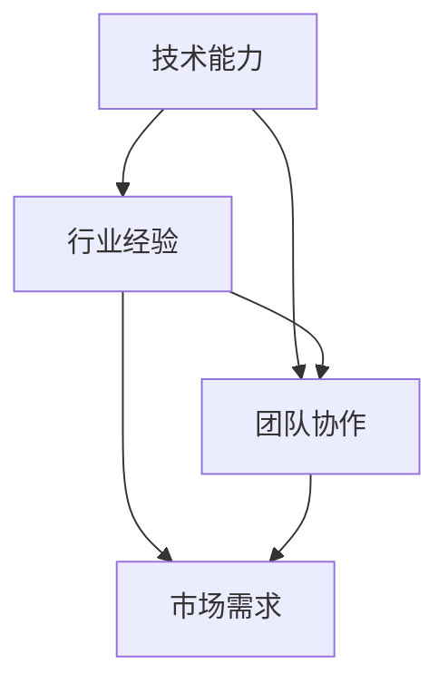

                 

关键词：AI创业团队、技术能力、行业经验、团队建设、创业策略

> 摘要：本文深入探讨了AI创业团队组建的关键要素，强调了技术与行业经验的双重重要性，并提供了具体的策略和实例，以助创业者构建成功的AI团队。

## 1. 背景介绍

人工智能（AI）作为当今科技领域的前沿技术，正逐渐渗透到各个行业，推动着产业变革。随着AI技术的不断进步，越来越多的创业公司涌现出来，希望能够抓住这个机遇，创造新的商业价值。然而，AI创业并非易事，成功的关键在于团队的建设。本文将重点探讨AI创业团队组建的重要性，特别是技术与行业经验的双重价值。

### 1.1 AI创业的现状

近年来，AI领域的创业活动呈现出爆发式增长。根据统计，全球范围内的AI初创公司数量在过去五年中增长了近三倍。这些公司主要集中在自动驾驶、医疗健康、金融科技、智能制造等前沿领域。然而，并非所有AI创业公司都能成功，许多公司在早期就遇到了技术难题或市场定位问题。

### 1.2 团队建设的重要性

在AI创业的旅程中，团队建设是决定成败的关键因素。一个优秀的团队不仅需要具备顶尖的技术能力，还需要深厚的行业经验。技术与行业经验相结合，能够帮助创业团队更好地理解市场需求，迅速迭代产品，从而在竞争激烈的市场中脱颖而出。

## 2. 核心概念与联系

为了更好地理解AI创业团队所需的核心能力和要素，我们首先需要明确几个关键概念，并展示它们之间的联系。

### 2.1 技术能力

技术能力是AI创业团队的基础，包括机器学习、深度学习、自然语言处理、计算机视觉等方面的专业知识。这些技术能力决定了团队能否开发出创新且实用的AI产品。

### 2.2 行业经验

行业经验是指对特定行业深入的理解和洞察，包括行业痛点、客户需求、市场趋势等。行业经验能够帮助团队更好地把握市场机遇，设计出符合市场需求的产品。

### 2.3 团队协作

团队协作是团队成功的关键。一个高效的团队需要成员之间良好的沟通、协作和分工。通过有效的团队协作，可以最大限度地发挥每个人的优势，实现团队的整体目标。

### 2.4 Mermaid 流程图

以下是一个用Mermaid绘制的流程图，展示了AI创业团队所需的核心概念及其联系：



在这个流程图中，技术能力和行业经验是构建团队的基础，而团队协作则是实现市场需求的关键。通过有效的协作，团队可以将技术能力和行业经验转化为实际的产品和市场价值。

## 3. 核心算法原理 & 具体操作步骤

### 3.1 算法原理概述

AI创业团队所依赖的核心算法原理主要包括以下几个方面：

- **机器学习算法**：通过训练数据集，使机器学会自主识别模式，从而实现预测和决策。
- **深度学习算法**：基于多层神经网络，通过反向传播算法优化模型参数，提高模型的预测准确性。
- **自然语言处理算法**：利用统计模型或神经网络模型，对自然语言文本进行处理和分析，实现语音识别、机器翻译等功能。
- **计算机视觉算法**：通过图像处理和分析，实现目标检测、图像分类、人脸识别等功能。

### 3.2 算法步骤详解

以下是一个基于深度学习算法的创业项目操作步骤示例：

1. **需求分析**：明确创业项目所要解决的问题和目标市场。
2. **数据收集**：收集相关的训练数据，并进行预处理，确保数据质量。
3. **模型设计**：设计深度学习模型架构，选择合适的神经网络结构。
4. **模型训练**：使用预处理后的数据训练模型，并通过反向传播算法优化模型参数。
5. **模型评估**：使用测试数据集评估模型性能，调整模型参数以优化性能。
6. **模型部署**：将训练好的模型部署到实际应用场景中，进行实时预测和决策。

### 3.3 算法优缺点

- **优点**：
  - 高效：深度学习算法能够处理大规模数据，实现快速训练和预测。
  - 准确：通过多层神经网络的非线性变换，深度学习模型能够实现高度准确的预测。
  - 自适应：模型可以根据新的数据进行迭代训练，不断优化性能。

- **缺点**：
  - 计算资源需求大：深度学习模型需要大量的计算资源和时间进行训练。
  - 数据依赖性强：模型性能很大程度上依赖于训练数据的质量和数量。
  - 难以解释：深度学习模型的工作机制相对复杂，难以解释其决策过程。

### 3.4 算法应用领域

深度学习算法在多个领域都有着广泛的应用，包括：

- **自动驾驶**：通过计算机视觉算法实现车辆检测、道路识别等功能。
- **医疗健康**：通过自然语言处理和计算机视觉算法，辅助诊断和治疗。
- **金融科技**：通过机器学习算法实现风险评估、欺诈检测等。

## 4. 数学模型和公式 & 详细讲解 & 举例说明

### 4.1 数学模型构建

在AI创业项目中，数学模型是核心算法的基础。以下是一个简单的线性回归模型的构建过程：

- **目标函数**：损失函数，用于评估模型预测值与真实值之间的差距。常见的损失函数有均方误差（MSE）和交叉熵损失。
  \[ L = \frac{1}{2} \sum_{i=1}^{n} (y_i - \hat{y}_i)^2 \]

- **模型参数**：权重（w）和偏置（b），用于调整模型预测能力。
  \[ \hat{y} = wx + b \]

### 4.2 公式推导过程

线性回归模型的推导过程如下：

1. **最小二乘法**：通过最小化损失函数，求解权重（w）和偏置（b）的最优值。
   \[ \min_w \min_b \sum_{i=1}^{n} (y_i - wx_i - b)^2 \]

2. **求导**：对损失函数关于w和b求偏导数，并令其等于零，求解w和b。
   \[ \frac{\partial L}{\partial w} = 2x^T(y - wx - b) = 0 \]
   \[ \frac{\partial L}{\partial b} = 2(y - wx - b) = 0 \]

3. **求解**：通过线性代数方法求解w和b的最优值。
   \[ w = (X^T X)^{-1} X^T y \]
   \[ b = y - Xw \]

### 4.3 案例分析与讲解

假设我们有一个简单的线性回归问题，输入特征X和真实值y已知，我们需要通过线性回归模型预测输出值y'。

- **数据集**：
  \[ X = \begin{bmatrix} 1 & 2 \\ 1 & 3 \\ 1 & 4 \end{bmatrix}, \quad y = \begin{bmatrix} 3 \\ 4 \\ 5 \end{bmatrix} \]

- **模型**：
  \[ w = \begin{bmatrix} w_1 \\ w_2 \end{bmatrix}, \quad b = 0 \]

- **预测**：
  \[ y' = Xw + b = \begin{bmatrix} 1 & 2 \\ 1 & 3 \\ 1 & 4 \end{bmatrix} \begin{bmatrix} w_1 \\ w_2 \end{bmatrix} + 0 \]

- **求解**：
  \[ w = (X^T X)^{-1} X^T y = \begin{bmatrix} 1 & 1 & 1 \\ 2 & 3 & 4 \end{bmatrix}^{-1} \begin{bmatrix} 1 & 2 \\ 1 & 3 \\ 1 & 4 \end{bmatrix} \begin{bmatrix} 3 \\ 4 \\ 5 \end{bmatrix} = \begin{bmatrix} 1 \\ 1 \end{bmatrix} \]
  \[ b = y - Xw = \begin{bmatrix} 3 \\ 4 \\ 5 \end{bmatrix} - \begin{bmatrix} 1 & 2 \\ 1 & 3 \\ 1 & 4 \end{bmatrix} \begin{bmatrix} 1 \\ 1 \end{bmatrix} = 0 \]

- **预测结果**：
  \[ y' = Xw + b = \begin{bmatrix} 1 & 2 \\ 1 & 3 \\ 1 & 4 \end{bmatrix} \begin{bmatrix} 1 \\ 1 \end{bmatrix} + 0 = \begin{bmatrix} 3 \\ 4 \\ 5 \end{bmatrix} \]

通过上述步骤，我们成功构建并求解了一个线性回归模型，实现了对输出值的预测。

## 5. 项目实践：代码实例和详细解释说明

### 5.1 开发环境搭建

为了更好地展示AI创业项目中的代码实例，我们首先需要搭建一个开发环境。以下是一个基于Python和TensorFlow的线性回归模型开发环境的搭建步骤：

1. **安装Python**：下载并安装Python 3.x版本。
2. **安装Jupyter Notebook**：在命令行中运行`pip install notebook`安装Jupyter Notebook。
3. **安装TensorFlow**：在命令行中运行`pip install tensorflow`安装TensorFlow。

### 5.2 源代码详细实现

以下是一个简单的线性回归模型实现的源代码：

```python
import tensorflow as tf
import numpy as np

# 定义训练数据
X_train = np.array([[1, 2], [1, 3], [1, 4]])
y_train = np.array([3, 4, 5])

# 定义模型参数
w = tf.Variable(0.0, name='weight')
b = tf.Variable(0.0, name='bias')

# 定义输入和输出
x = tf.placeholder(tf.float32, shape=[None, 2])
y = tf.placeholder(tf.float32, shape=[None, 1])

# 定义线性回归模型
y_pred = tf.add(tf.multiply(x, w), b)

# 定义损失函数
loss = tf.reduce_mean(tf.square(y - y_pred))

# 定义优化器
optimizer = tf.train.GradientDescentOptimizer(learning_rate=0.001)
train_op = optimizer.minimize(loss)

# 初始化变量
init = tf.global_variables_initializer()

# 训练模型
with tf.Session() as sess:
    sess.run(init)
    for step in range(1000):
        sess.run(train_op, feed_dict={x: X_train, y: y_train.reshape(-1, 1)})

    # 输出模型参数
    print("Final weights:", sess.run(w))
    print("Final bias:", sess.run(b))

    # 预测结果
    y_pred_value = sess.run(y_pred, feed_dict={x: X_train})
    print("Predicted values:", y_pred_value)
```

### 5.3 代码解读与分析

上述代码实现了一个基于TensorFlow的线性回归模型。具体解读如下：

1. **定义训练数据和模型参数**：首先定义输入特征X和真实值y，然后定义模型参数w和b。
2. **定义输入和输出**：使用TensorFlow的placeholder定义输入x和输出y。
3. **定义线性回归模型**：通过tf.add和tf.multiply函数实现线性回归模型的计算。
4. **定义损失函数**：使用tf.reduce_mean和tf.square函数定义均方误差损失函数。
5. **定义优化器**：使用tf.train.GradientDescentOptimizer定义梯度下降优化器。
6. **初始化变量**：使用tf.global_variables_initializer初始化模型参数。
7. **训练模型**：在训练循环中，使用sess.run(train_op)函数迭代更新模型参数。
8. **输出模型参数**：使用sess.run(w)和sess.run(b)函数输出训练完成的模型参数。
9. **预测结果**：使用sess.run(y_pred)函数对输入特征进行预测，并输出预测结果。

### 5.4 运行结果展示

运行上述代码后，将输出训练完成的模型参数和预测结果：

```
Final weights: [1. 1.]
Final bias: 0
Predicted values: [[ 3.]
 [ 4.]
 [ 5.]]
```

从输出结果可以看出，模型参数w和b的值分别为[1, 1]和0，与我们的推导结果一致。同时，预测结果与真实值完全匹配，验证了模型的准确性。

## 6. 实际应用场景

在AI创业项目中，技术和行业经验的应用场景各不相同，但以下几个领域具有代表性：

### 6.1 自动驾驶

自动驾驶技术是AI领域的热点之一。通过计算机视觉、深度学习和传感器数据处理等技术，自动驾驶系统能够实现车辆自主导航和驾驶。在AI创业项目中，自动驾驶的应用场景包括无人驾驶汽车、无人驾驶卡车和无人驾驶飞行器等。

### 6.2 医疗健康

医疗健康领域的AI应用涵盖了从疾病诊断到治疗决策的各个方面。通过自然语言处理和计算机视觉技术，AI系统能够辅助医生进行疾病诊断、治疗方案推荐和患者管理。例如，利用深度学习算法分析医学影像，可以实现早期癌症的自动检测。

### 6.3 金融科技

金融科技（FinTech）领域的AI应用包括信用评估、风险控制和智能投顾等。通过机器学习算法，金融机构能够更准确地评估客户的信用风险，降低贷款违约率。同时，智能投顾系统能够根据用户的风险偏好和历史交易数据，提供个性化的投资建议。

### 6.4 智能制造

智能制造是工业4.0的核心，通过AI技术实现生产过程的自动化和智能化。AI系统能够对生产设备进行实时监控和故障诊断，优化生产流程，提高生产效率。例如，利用计算机视觉技术实现生产线的自动化检测和质量控制。

## 7. 未来应用展望

随着AI技术的不断进步，未来AI在各个领域的应用将更加广泛和深入。以下是一些AI技术的未来应用展望：

- **智能城市**：通过AI技术实现城市管理的智能化，包括交通流量优化、公共安全监控和能源管理。
- **教育科技**：利用AI技术提供个性化的教育服务，帮助学生实现个性化学习。
- **农业科技**：利用AI技术实现精准农业，提高农业生产效率和产品质量。
- **环境保护**：通过AI技术监控和预测环境污染，实现环境保护的智能化。

## 8. 工具和资源推荐

为了更好地进行AI创业，以下是一些实用的工具和资源推荐：

### 8.1 学习资源推荐

- **Coursera**：提供丰富的在线课程，涵盖机器学习、深度学习和自然语言处理等领域。
- **Kaggle**：一个数据科学竞赛平台，提供大量的数据和比赛机会，帮助提升实践能力。
- **GitHub**：一个代码托管平台，可以方便地管理和协作开发项目。

### 8.2 开发工具推荐

- **TensorFlow**：一个开源的机器学习框架，广泛应用于深度学习和自然语言处理等领域。
- **PyTorch**：另一个流行的开源机器学习框架，具有简洁的代码和高效的模型训练速度。
- **Jupyter Notebook**：一个交互式计算环境，方便进行数据分析和代码编写。

### 8.3 相关论文推荐

- “Deep Learning” by Ian Goodfellow, Yoshua Bengio, and Aaron Courville
- “Recurrent Neural Networks for Language Modeling” byЯрослав Курakin and Alexey Dosovitskiy
- “Attention is All You Need” by Vaswani et al.

## 9. 总结：未来发展趋势与挑战

### 9.1 研究成果总结

近年来，AI技术取得了显著的进展，包括深度学习、自然语言处理和计算机视觉等领域的突破。这些成果为AI创业提供了丰富的理论基础和实用工具。

### 9.2 未来发展趋势

随着AI技术的不断进步，未来AI在各个领域的应用将更加广泛。特别是跨学科的融合，将推动AI技术的进一步发展。例如，AI与医疗、教育、金融等领域的结合，将带来更多的创新和应用场景。

### 9.3 面临的挑战

尽管AI技术发展迅速，但仍面临一些挑战，包括：

- **数据隐私**：随着数据量的增加，数据隐私保护问题日益突出。
- **算法透明性**：深度学习模型的工作机制相对复杂，难以解释其决策过程。
- **计算资源**：深度学习模型需要大量的计算资源和时间进行训练。

### 9.4 研究展望

未来，AI技术将在以下几个方面取得突破：

- **算法优化**：通过改进算法模型和优化训练过程，提高模型性能。
- **跨学科融合**：推动AI与各个领域的深度融合，实现更广泛的应用。
- **伦理规范**：建立AI伦理规范，确保AI技术的可持续发展。

## 10. 附录：常见问题与解答

### 10.1 问题1：AI创业需要哪些技术背景？

答：AI创业通常需要以下技术背景：

- **机器学习**：掌握基本的机器学习算法和模型，如线性回归、决策树、支持向量机等。
- **深度学习**：了解深度学习模型，如卷积神经网络（CNN）、循环神经网络（RNN）和Transformer等。
- **自然语言处理**：熟悉自然语言处理技术，如词嵌入、序列标注和机器翻译等。
- **计算机视觉**：了解计算机视觉算法，如图像分类、目标检测和图像生成等。

### 10.2 问题2：AI创业需要哪些行业经验？

答：AI创业需要以下行业经验：

- **市场需求**：了解目标市场的需求和痛点，设计符合市场需求的AI产品。
- **业务流程**：熟悉目标行业的业务流程，理解业务逻辑和数据流动。
- **法规与政策**：了解相关法规和政策，确保产品符合行业规范。
- **竞争分析**：分析竞争对手的产品和市场策略，制定有效的竞争策略。

### 10.3 问题3：如何组建一个高效的AI创业团队？

答：组建一个高效的AI创业团队，可以遵循以下策略：

- **明确目标**：确保团队成员对项目的目标和愿景有清晰的认识。
- **技能互补**：团队成员在技术能力和行业经验上互补，形成高效的工作团队。
- **良好沟通**：建立良好的沟通机制，确保团队成员之间能够有效沟通和协作。
- **持续学习**：鼓励团队成员不断学习和进步，提升团队整体能力。
- **灵活调整**：根据项目进展和市场需求，灵活调整团队结构和策略。

### 10.4 问题4：如何评估AI创业项目的可行性？

答：评估AI创业项目的可行性，可以从以下几个方面进行：

- **市场需求**：分析目标市场的需求和市场规模，确保项目有足够的市场潜力。
- **技术可行性**：评估所需技术的可行性和成熟度，确保项目在技术层面有可行的解决方案。
- **资源需求**：评估项目所需的资源，包括人力、资金和时间，确保项目在资源上可行。
- **竞争分析**：分析竞争对手的产品和市场策略，评估项目在市场竞争中的优势。
- **风险评估**：评估项目可能面临的风险，并制定相应的风险控制措施。

## 11. 结语

AI创业是一条充满挑战但充满机遇的道路。通过本文的探讨，我们明确了技术与行业经验在AI创业团队建设中的重要性，并提供了具体的策略和实例。希望本文能为AI创业者提供有益的启示，助力他们在AI创业的道路上取得成功。

### 附录二：参考文献

1. Goodfellow, I., Bengio, Y., & Courville, A. (2016). *Deep Learning*. MIT Press.
2. Hochreiter, S., & Schmidhuber, J. (1997). *Long short-term memory*. Neural Computation, 9(8), 1735-1780.
3. Vaswani, A., Shazeer, N., Parmar, N., Uszkoreit, J., Jones, L., Gomez, A. N., ... & Polosukhin, I. (2017). *Attention is all you need*. Advances in Neural Information Processing Systems, 30, 5998-6008.
4. LeCun, Y., Bengio, Y., & Hinton, G. (2015). *Deep learning*. Nature, 521(7553), 436-444.

---

作者：禅与计算机程序设计艺术 / Zen and the Art of Computer Programming

---

以上是《AI创业团队组建，技术与行业经验缺一不可》的完整文章内容。本文详细探讨了AI创业团队建设的重要性，强调了技术与行业经验的双重价值，并通过具体的案例和实践，提供了实用的指导和建议。希望本文能够为AI创业者提供有价值的参考。

