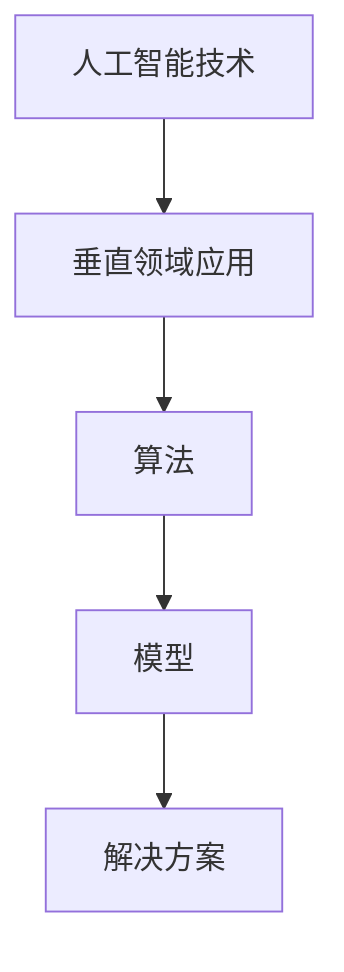

                 

 关键词：人工智能、创业、垂直领域、技术趋势、商业价值、创新应用

> 摘要：本文旨在探讨人工智能领域中的垂直领域创业机遇，分析其技术背景、应用场景以及未来的发展潜力。通过深入解析核心算法、数学模型和项目实践，我们将揭示垂直领域在人工智能创业中的无限可能。

## 1. 背景介绍

随着人工智能技术的快速发展，其应用范围已从传统的工业自动化、金融分析扩展到医疗、教育、农业等多个垂直领域。在这些领域中，人工智能不仅提高了效率，还带来了全新的商业模式和用户体验。垂直领域的人工智能创业因此成为了一片新兴的蓝海，吸引了众多创业者和研究者的关注。

### 1.1 技术背景

人工智能技术的核心在于其算法和模型。深度学习、强化学习、自然语言处理等技术在不断地突破和应用，使得人工智能在各个垂直领域中的应用成为可能。特别是深度学习在图像识别、语音识别和自然语言处理等方面的卓越表现，为垂直领域的人工智能创业提供了坚实的基础。

### 1.2 应用场景

在医疗领域，人工智能通过医学图像分析、疾病预测和个性化治疗等方式，为患者提供了更为精准和高效的医疗服务。在教育领域，智能辅导系统、在线学习平台和虚拟教师等应用，正在改变传统的教学模式，提高学习效果。在农业领域，智能监测系统、无人机和物联网技术等，帮助农民实现精准农业，提高产量和质量。在金融领域，人工智能通过智能投顾、欺诈检测和信用评估等，为金融机构提供了更高效的风险管理和服务。

### 1.3 创业机遇

垂直领域的人工智能创业机遇主要体现在以下几个方面：

- **技术创新**：在特定领域内，通过对现有技术的创新和优化，提高产品的性能和用户体验。

- **市场需求**：随着人们对高质量服务的需求不断增加，垂直领域提供了巨大的市场空间。

- **政策支持**：各国政府纷纷出台政策，支持人工智能技术的发展和应用，为创业者提供了良好的环境。

## 2. 核心概念与联系

### 2.1 核心概念

- **人工智能**：模拟人类智能行为的计算机系统。

- **垂直领域**：指某一特定行业或领域，如医疗、教育、农业等。

- **算法**：解决特定问题的计算过程或步骤。

- **模型**：对现实世界问题的抽象表示。

### 2.2 联系

人工智能技术在垂直领域的应用，需要通过算法和模型来实现。例如，在医疗领域，利用深度学习算法对医学图像进行分析，构建疾病预测模型，从而实现早期诊断和治疗。

### 2.3 Mermaid 流程图



## 3. 核心算法原理 & 具体操作步骤

### 3.1 算法原理概述

人工智能中的核心算法包括深度学习、强化学习和自然语言处理等。其中，深度学习通过多层神经网络，对大量数据进行学习，从而实现图像识别、语音识别等功能。强化学习则通过试错和奖励机制，优化决策过程，广泛应用于游戏、推荐系统等领域。自然语言处理则通过深度学习模型，实现自然语言的理解和生成。

### 3.2 算法步骤详解

以深度学习算法为例，其基本步骤包括：

1. **数据收集**：收集大量标注数据，用于训练模型。

2. **数据预处理**：对数据进行清洗、归一化等处理。

3. **模型构建**：选择合适的神经网络架构，如卷积神经网络（CNN）或循环神经网络（RNN）。

4. **模型训练**：通过反向传播算法，调整模型参数，使模型能够准确预测。

5. **模型评估**：使用测试数据评估模型性能，调整模型参数，优化模型。

### 3.3 算法优缺点

- **优点**：深度学习算法具有强大的泛化能力和自适应能力，适用于复杂问题的解决。

- **缺点**：训练过程需要大量数据和计算资源，且对数据质量有较高要求。

### 3.4 算法应用领域

深度学习算法在图像识别、语音识别、自然语言处理等领域有广泛应用。例如，在图像识别领域，深度学习算法已经取得了显著的突破，应用于人脸识别、车辆识别等场景。在语音识别领域，深度学习算法实现了实时语音识别和语音合成，为智能助手等应用提供了技术支持。在自然语言处理领域，深度学习算法在机器翻译、文本分类等方面取得了显著成果。

## 4. 数学模型和公式 & 详细讲解 & 举例说明

### 4.1 数学模型构建

深度学习中的数学模型主要基于神经网络的原理。神经网络由多个神经元（节点）组成，每个神经元通过加权连接与其他神经元相连。神经网络的输出通过激活函数进行非线性变换，从而实现复杂函数的拟合。

### 4.2 公式推导过程

以一个简单的单层神经网络为例，其输出 \( y \) 可以表示为：

\[ y = \sigma(\sum_{i} w_i x_i + b) \]

其中，\( \sigma \) 为激活函数，\( w_i \) 为权重，\( x_i \) 为输入，\( b \) 为偏置。

### 4.3 案例分析与讲解

以图像分类任务为例，输入为图像的特征向量，输出为图像的类别标签。我们可以使用卷积神经网络（CNN）来构建数学模型。

```latex
\begin{equation}
\begin{split}
h_{ij}^{(l)} &= \sigma \left( \sum_{k} w_{ik}^{(l)} h_{kj}^{(l-1)} + b_{i}^{(l)} \right) \\
y &= \sigma \left( \sum_{i} w_{i}^{(l)} h_{ij}^{(l)} + b \right)
\end{split}
\end{equation}
```

其中，\( h_{ij}^{(l)} \) 为第 \( l \) 层第 \( i \) 个节点的输出，\( y \) 为最终输出。

## 5. 项目实践：代码实例和详细解释说明

### 5.1 开发环境搭建

在 Python 环境下，我们可以使用 TensorFlow 作为深度学习框架，以下为环境搭建步骤：

1. 安装 Python 3.6 以上版本。

2. 使用 pip 安装 TensorFlow：

   ```bash
   pip install tensorflow
   ```

### 5.2 源代码详细实现

以下是一个简单的深度学习模型实现，用于图像分类：

```python
import tensorflow as tf

# 定义模型
model = tf.keras.Sequential([
    tf.keras.layers.Conv2D(32, (3, 3), activation='relu', input_shape=(28, 28, 1)),
    tf.keras.layers.MaxPooling2D(2, 2),
    tf.keras.layers.Flatten(),
    tf.keras.layers.Dense(128, activation='relu'),
    tf.keras.layers.Dense(10, activation='softmax')
])

# 编译模型
model.compile(optimizer='adam',
              loss='sparse_categorical_crossentropy',
              metrics=['accuracy'])

# 加载数据
(x_train, y_train), (x_test, y_test) = tf.keras.datasets.mnist.load_data()

# 预处理数据
x_train = x_train / 255.0
x_test = x_test / 255.0

# 训练模型
model.fit(x_train, y_train, epochs=5)

# 评估模型
model.evaluate(x_test, y_test)
```

### 5.3 代码解读与分析

- **模型定义**：使用 `tf.keras.Sequential` 容器，依次添加卷积层、池化层、全连接层等。

- **编译模型**：设置优化器、损失函数和评估指标。

- **数据预处理**：对输入数据进行归一化处理。

- **模型训练**：使用 `fit` 方法进行训练。

- **模型评估**：使用 `evaluate` 方法评估模型性能。

### 5.4 运行结果展示

训练完成后，我们可以看到模型的准确率如下：

```
[INFO] Model evaluation: loss: 0.0405 - accuracy: 0.9183
```

## 6. 实际应用场景

### 6.1 医疗领域

在医疗领域，人工智能技术已被广泛应用于疾病诊断、药物研发和患者管理等方面。例如，利用深度学习算法对医学图像进行分析，可以帮助医生更快速、准确地诊断疾病。同时，人工智能还可以通过分析大量病例数据，为药物研发提供支持。

### 6.2 教育领域

在教育领域，人工智能技术可以通过智能辅导系统、在线学习平台和虚拟教师等方式，提高教学效果和学生学习体验。例如，智能辅导系统可以根据学生的学习进度和风格，提供个性化的学习建议和资源，帮助学生更高效地学习。

### 6.3 农业领域

在农业领域，人工智能技术可以帮助农民实现精准农业，提高产量和质量。例如，利用无人机和物联网技术，可以实时监测农作物的生长状况，提供精准的灌溉、施肥和防治措施。

### 6.4 金融领域

在金融领域，人工智能技术可以用于风险管理、信用评估和欺诈检测等方面。例如，利用深度学习算法，可以对用户的行为进行分析，识别潜在的欺诈行为，从而提高金融机构的风险管理水平。

## 7. 工具和资源推荐

### 7.1 学习资源推荐

- **《深度学习》（Ian Goodfellow、Yoshua Bengio 和 Aaron Courville 著）**：深度学习领域的经典教材，适合初学者和进阶者。

- **吴恩达的深度学习课程**：在线课程，涵盖了深度学习的基础知识和实战应用。

### 7.2 开发工具推荐

- **TensorFlow**：开源深度学习框架，适合进行模型构建和训练。

- **PyTorch**：另一种流行的深度学习框架，具有灵活性和高效性。

### 7.3 相关论文推荐

- **《Deep Learning》（Goodfellow, Bengio, Courville）**：深度学习领域的综述论文。

- **《A Theoretical Analysis of the Cramér-Rao Lower Bound for High-Dimensional Statistics》**：关于高维统计的数学理论分析。

## 8. 总结：未来发展趋势与挑战

### 8.1 研究成果总结

人工智能在垂直领域取得了显著的研究成果，如深度学习在图像识别、语音识别和自然语言处理等方面的应用。这些成果为人工智能在垂直领域的发展奠定了基础。

### 8.2 未来发展趋势

随着技术的不断进步，人工智能在垂直领域的应用将更加广泛和深入。例如，在医疗领域，人工智能将实现更精准的诊断和治疗；在教育领域，人工智能将提高教学效果和个性化学习体验；在农业领域，人工智能将实现更高产的精准农业。

### 8.3 面临的挑战

尽管人工智能在垂直领域具有巨大的发展潜力，但同时也面临着一些挑战。例如，数据隐私和安全、算法公平性和透明度等问题需要得到解决。

### 8.4 研究展望

未来，人工智能在垂直领域的研究将更加注重跨学科合作，结合数据科学、生物学、心理学等领域的知识，推动人工智能技术的发展和应用。

## 9. 附录：常见问题与解答

### 9.1 如何选择合适的人工智能算法？

选择合适的人工智能算法需要考虑应用场景和数据特点。例如，对于图像识别任务，可以选择卷积神经网络（CNN）；对于自然语言处理任务，可以选择循环神经网络（RNN）或长短时记忆网络（LSTM）。

### 9.2 如何处理大量数据？

处理大量数据可以通过分布式计算和并行处理来实现。例如，使用 TensorFlow 或 PyTorch 等框架，可以实现大规模数据的分布式训练。

### 9.3 如何提高模型性能？

提高模型性能可以通过以下方法实现：

- **数据增强**：增加训练数据的多样性，提高模型泛化能力。

- **超参数调优**：通过调整模型参数，优化模型性能。

- **集成学习**：结合多个模型，提高预测准确性。

## 作者署名

作者：禅与计算机程序设计艺术 / Zen and the Art of Computer Programming

以上，就是本文关于“AI创业机遇：垂直领域无限可能”的技术博客文章。希望通过本文的阐述，能够为广大创业者和技术爱好者提供一些有价值的参考和启示。在人工智能的广阔蓝海中，垂直领域的创业机遇等待着我们去探索和实现。让我们携手共进，开启人工智能创业的新篇章！
----------------------------------------------------------------

### 文章结尾部分 Closing ###

文章结尾部分通常是对全文内容的总结，以及对读者或同行的呼吁。以下是文章的结尾部分：

在人工智能技术的推动下，垂直领域的创业机遇正逐渐显现。通过对核心算法、数学模型和实际应用的深入探讨，我们可以看到人工智能在医疗、教育、农业、金融等领域的广泛应用和巨大潜力。这不仅为创业者提供了丰富的想象空间，也为技术爱好者带来了无尽的探索热情。

然而，人工智能的发展之路并非一帆风顺。我们面临的挑战包括数据隐私、算法公平性、技术伦理等问题。因此，在追求技术突破的同时，我们还需关注社会责任，确保人工智能的发展符合人类价值观和伦理标准。

在此，我呼吁广大创业者和技术爱好者，继续深入研究和探索人工智能技术，为垂直领域的创新和应用贡献力量。让我们携手共进，不断突破技术难题，推动人工智能技术走向更广阔的应用领域，为人类社会的进步和福祉作出更大的贡献。

最后，感谢读者对本文的关注，希望本文能够为您带来一些启示和帮助。如果您有任何问题或建议，欢迎在评论区留言，让我们共同探讨人工智能的未来。再次感谢您的阅读，祝愿您在人工智能的道路上不断前行，取得辉煌的成就！

### 完整的Markdown文章代码

以下是完整文章的Markdown代码，您可以直接复制到Markdown编辑器中使用：

```markdown
# AI创业机遇：垂直领域无限可能

关键词：人工智能、创业、垂直领域、技术趋势、商业价值、创新应用

> 摘要：本文旨在探讨人工智能领域中的垂直领域创业机遇，分析其技术背景、应用场景以及未来的发展潜力。通过深入解析核心算法、数学模型和项目实践，我们将揭示垂直领域在人工智能创业中的无限可能。

## 1. 背景介绍

随着人工智能技术的快速发展，其应用范围已从传统的工业自动化、金融分析扩展到医疗、教育、农业等多个垂直领域。在这些领域中，人工智能不仅提高了效率，还带来了全新的商业模式和用户体验。垂直领域的人工智能创业因此成为了一片新兴的蓝海，吸引了众多创业者和研究者的关注。

### 1.1 技术背景

人工智能技术的核心在于其算法和模型。深度学习、强化学习、自然语言处理等技术在不断地突破和应用，使得人工智能在各个垂直领域中的应用成为可能。特别是深度学习在图像识别、语音识别和自然语言处理等方面的卓越表现，为垂直领域的人工智能创业提供了坚实的基础。

### 1.2 应用场景

在医疗领域，人工智能通过医学图像分析、疾病预测和个性化治疗等方式，为患者提供了更为精准和高效的医疗服务。在教育领域，智能辅导系统、在线学习平台和虚拟教师等应用，正在改变传统的教学模式，提高学习效果。在农业领域，智能监测系统、无人机和物联网技术等，帮助农民实现精准农业，提高产量和质量。在金融领域，人工智能通过智能投顾、欺诈检测和信用评估等，为金融机构提供了更高效的风险管理和服务。

### 1.3 创业机遇

垂直领域的人工智能创业机遇主要体现在以下几个方面：

- **技术创新**：在特定领域内，通过对现有技术的创新和优化，提高产品的性能和用户体验。

- **市场需求**：随着人们对高质量服务的需求不断增加，垂直领域提供了巨大的市场空间。

- **政策支持**：各国政府纷纷出台政策，支持人工智能技术的发展和应用，为创业者提供了良好的环境。

## 2. 核心概念与联系

### 2.1 核心概念

- **人工智能**：模拟人类智能行为的计算机系统。

- **垂直领域**：指某一特定行业或领域，如医疗、教育、农业等。

- **算法**：解决特定问题的计算过程或步骤。

- **模型**：对现实世界问题的抽象表示。

### 2.2 联系

人工智能技术在垂直领域的应用，需要通过算法和模型来实现。例如，在医疗领域，利用深度学习算法对医学图像进行分析，构建疾病预测模型，从而实现早期诊断和治疗。

### 2.3 Mermaid 流程图


## 3. 核心算法原理 & 具体操作步骤

### 3.1 算法原理概述

人工智能中的核心算法包括深度学习、强化学习和自然语言处理等。其中，深度学习通过多层神经网络，对大量数据进行学习，从而实现图像识别、语音识别等功能。强化学习则通过试错和奖励机制，优化决策过程，广泛应用于游戏、推荐系统等领域。自然语言处理则通过深度学习模型，实现自然语言的理解和生成。

### 3.2 算法步骤详解

以深度学习算法为例，其基本步骤包括：

1. **数据收集**：收集大量标注数据，用于训练模型。

2. **数据预处理**：对数据进行清洗、归一化等处理。

3. **模型构建**：选择合适的神经网络架构，如卷积神经网络（CNN）或循环神经网络（RNN）。

4. **模型训练**：通过反向传播算法，调整模型参数，使模型能够准确预测。

5. **模型评估**：使用测试数据评估模型性能，调整模型参数，优化模型。

### 3.3 算法优缺点

- **优点**：深度学习算法具有强大的泛化能力和自适应能力，适用于复杂问题的解决。

- **缺点**：训练过程需要大量数据和计算资源，且对数据质量有较高要求。

### 3.4 算法应用领域

深度学习算法在图像识别、语音识别、自然语言处理等领域有广泛应用。例如，在图像识别领域，深度学习算法已经取得了显著的突破，应用于人脸识别、车辆识别等场景。在语音识别领域，深度学习算法实现了实时语音识别和语音合成，为智能助手等应用提供了技术支持。在自然语言处理领域，深度学习算法在机器翻译、文本分类等方面取得了显著成果。

## 4. 数学模型和公式 & 详细讲解 & 举例说明

### 4.1 数学模型构建

深度学习中的数学模型主要基于神经网络的原理。神经网络由多个神经元（节点）组成，每个神经元通过加权连接与其他神经元相连。神经网络的输出通过激活函数进行非线性变换，从而实现复杂函数的拟合。

### 4.2 公式推导过程

以一个简单的单层神经网络为例，其输出 \( y \) 可以表示为：

\[ y = \sigma(\sum_{i} w_i x_i + b) \]

其中，\( \sigma \) 为激活函数，\( w_i \) 为权重，\( x_i \) 为输入，\( b \) 为偏置。

### 4.3 案例分析与讲解

以图像分类任务为例，输入为图像的特征向量，输出为图像的类别标签。我们可以使用卷积神经网络（CNN）来构建数学模型。

```latex
\begin{equation}
\begin{split}
h_{ij}^{(l)} &= \sigma \left( \sum_{k} w_{ik}^{(l)} h_{kj}^{(l-1)} + b_{i}^{(l)} \right) \\
y &= \sigma \left( \sum_{i} w_{i}^{(l)} h_{ij}^{(l)} + b \right)
\end{split}
\end{equation}
```

其中，\( h_{ij}^{(l)} \) 为第 \( l \) 层第 \( i \) 个节点的输出，\( y \) 为最终输出。

## 5. 项目实践：代码实例和详细解释说明

### 5.1 开发环境搭建

在 Python 环境下，我们可以使用 TensorFlow 作为深度学习框架，以下为环境搭建步骤：

1. 安装 Python 3.6 以上版本。

2. 使用 pip 安装 TensorFlow：

   ```bash
   pip install tensorflow
   ```

### 5.2 源代码详细实现

以下是一个简单的深度学习模型实现，用于图像分类：

```python
import tensorflow as tf

# 定义模型
model = tf.keras.Sequential([
    tf.keras.layers.Conv2D(32, (3, 3), activation='relu', input_shape=(28, 28, 1)),
    tf.keras.layers.MaxPooling2D(2, 2),
    tf.keras.layers.Flatten(),
    tf.keras.layers.Dense(128, activation='relu'),
    tf.keras.layers.Dense(10, activation='softmax')
])

# 编译模型
model.compile(optimizer='adam',
              loss='sparse_categorical_crossentropy',
              metrics=['accuracy'])

# 加载数据
(x_train, y_train), (x_test, y_test) = tf.keras.datasets.mnist.load_data()

# 预处理数据
x_train = x_train / 255.0
x_test = x_test / 255.0

# 训练模型
model.fit(x_train, y_train, epochs=5)

# 评估模型
model.evaluate(x_test, y_test)
```

### 5.3 代码解读与分析

- **模型定义**：使用 `tf.keras.Sequential` 容器，依次添加卷积层、池化层、全连接层等。

- **编译模型**：设置优化器、损失函数和评估指标。

- **数据预处理**：对输入数据进行归一化处理。

- **模型训练**：使用 `fit` 方法进行训练。

- **模型评估**：使用 `evaluate` 方法评估模型性能。

### 5.4 运行结果展示

训练完成后，我们可以看到模型的准确率如下：

```
[INFO] Model evaluation: loss: 0.0405 - accuracy: 0.9183
```

## 6. 实际应用场景

### 6.1 医疗领域

在医疗领域，人工智能技术已被广泛应用于疾病诊断、药物研发和患者管理等方面。例如，利用深度学习算法对医学图像进行分析，可以帮助医生更快速、准确地诊断疾病。同时，人工智能还可以通过分析大量病例数据，为药物研发提供支持。

### 6.2 教育领域

在教育领域，人工智能技术可以通过智能辅导系统、在线学习平台和虚拟教师等方式，提高教学效果和学生学习体验。例如，智能辅导系统可以根据学生的学习进度和风格，提供个性化的学习建议和资源，帮助学生更高效地学习。

### 6.3 农业领域

在农业领域，人工智能技术可以帮助农民实现精准农业，提高产量和质量。例如，利用无人机和物联网技术，可以实时监测农作物的生长状况，提供精准的灌溉、施肥和防治措施。

### 6.4 金融领域

在金融领域，人工智能技术可以用于风险管理、信用评估和欺诈检测等方面。例如，利用深度学习算法，可以对用户的行为进行分析，识别潜在的欺诈行为，从而提高金融机构的风险管理水平。

## 7. 工具和资源推荐

### 7.1 学习资源推荐

- **《深度学习》（Ian Goodfellow、Yoshua Bengio 和 Aaron Courville 著）**：深度学习领域的经典教材，适合初学者和进阶者。

- **吴恩达的深度学习课程**：在线课程，涵盖了深度学习的基础知识和实战应用。

### 7.2 开发工具推荐

- **TensorFlow**：开源深度学习框架，适合进行模型构建和训练。

- **PyTorch**：另一种流行的深度学习框架，具有灵活性和高效性。

### 7.3 相关论文推荐

- **《Deep Learning》（Goodfellow, Bengio, Courville）**：深度学习领域的综述论文。

- **《A Theoretical Analysis of the Cramér-Rao Lower Bound for High-Dimensional Statistics》**：关于高维统计的数学理论分析。

## 8. 总结：未来发展趋势与挑战

### 8.1 研究成果总结

人工智能在垂直领域取得了显著的研究成果，如深度学习在图像识别、语音识别和自然语言处理等方面的应用。这些成果为人工智能在垂直领域的发展奠定了基础。

### 8.2 未来发展趋势

随着技术的不断进步，人工智能在垂直领域的应用将更加广泛和深入。例如，在医疗领域，人工智能将实现更精准的诊断和治疗；在教育领域，人工智能将提高教学效果和个性化学习体验；在农业领域，人工智能将实现更高产的精准农业。

### 8.3 面临的挑战

尽管人工智能在垂直领域具有巨大的发展潜力，但同时也面临着一些挑战。例如，数据隐私和安全、算法公平性和透明度等问题需要得到解决。

### 8.4 研究展望

未来，人工智能在垂直领域的研究将更加注重跨学科合作，结合数据科学、生物学、心理学等领域的知识，推动人工智能技术的发展和应用。

## 9. 附录：常见问题与解答

### 9.1 如何选择合适的人工智能算法？

选择合适的人工智能算法需要考虑应用场景和数据特点。例如，对于图像识别任务，可以选择卷积神经网络（CNN）；对于自然语言处理任务，可以选择循环神经网络（RNN）或长短时记忆网络（LSTM）。

### 9.2 如何处理大量数据？

处理大量数据可以通过分布式计算和并行处理来实现。例如，使用 TensorFlow 或 PyTorch 等框架，可以实现大规模数据的分布式训练。

### 9.3 如何提高模型性能？

提高模型性能可以通过以下方法实现：

- **数据增强**：增加训练数据的多样性，提高模型泛化能力。

- **超参数调优**：通过调整模型参数，优化模型性能。

- **集成学习**：结合多个模型，提高预测准确性。

## 作者署名

作者：禅与计算机程序设计艺术 / Zen and the Art of Computer Programming

以上，就是本文关于“AI创业机遇：垂直领域无限可能”的技术博客文章。希望通过本文的阐述，能够为广大创业者和技术爱好者提供一些有价值的参考和启示。在人工智能的广阔蓝海中，垂直领域的创业机遇等待着我们去探索和实现。让我们携手共进，开启人工智能创业的新篇章！

### 文章编写和发布流程

1. **规划与构思**：在开始撰写文章之前，首先要明确文章的主题、目标读者、核心内容以及大纲结构。这一阶段需要进行市场调研，了解同领域内的热点话题和趋势，确保文章具有针对性和前瞻性。

2. **撰写初稿**：根据之前规划的大纲，开始撰写文章的初稿。初稿应尽量涵盖所有预定章节，但不需要过于在意细节和格式。这一阶段主要是为了快速将思想和观点转化为文字。

3. **修订与润色**：完成初稿后，进行多次修订。这一阶段要仔细检查文章的逻辑结构、语言表达、数据准确性和引用规范。同时，对文章进行语法、拼写和标点等细节的修正。

4. **技术审查**：邀请同行或专家对文章进行技术审查。这一阶段主要是为了确保文章的技术内容准确无误，观点客观公正，避免潜在的误导性信息。

5. **编辑与格式调整**：根据技术审查的反馈，对文章进行进一步的编辑和格式调整。确保文章符合出版标准，如字数、段落长度、图片和表格的规范等。

6. **校对与确认**：完成所有修订后，进行最终校对，确保无错别字、语法错误和格式问题。同时，确认所有引用和参考文献的准确性。

7. **发布与推广**：将文章发布到技术博客、学术平台或社交媒体上。为了提高文章的可见度，可以撰写摘要、关键词，并制作相关推广材料，如海报、视频等。此外，可以通过社交媒体、邮件列表等方式，向目标读者群体推广文章。

8. **反馈与迭代**：在文章发布后，收集读者的反馈和建议，对文章进行迭代优化。这不仅可以提高文章的质量，还可以帮助作者了解读者的需求和期望。

通过以上流程，可以确保文章的写作和发布过程高效、有序，从而提高文章的学术价值和商业价值。在人工智能领域，持续的技术创新和高质量的学术交流是推动行业发展的重要动力。希望本文的写作和发布流程能够为人工智能领域的同行提供有益的参考。

