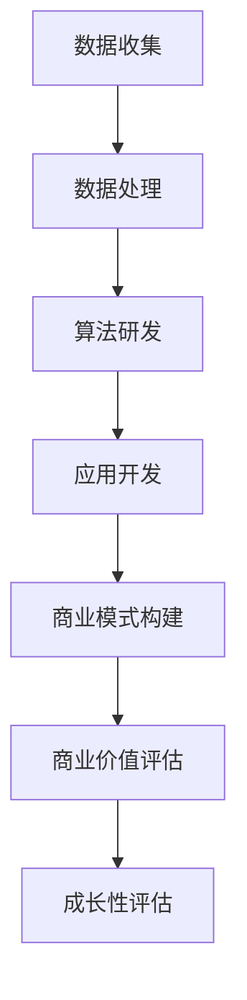

                 

### 关键词 Keywords
AI创业、融资趋势、商业价值、项目成长性、投资策略

### 摘要 Summary
本文深入探讨了当前AI创业领域的融资新趋势，强调了项目商业价值和成长性在投资者决策中的关键作用。通过分析市场动态、技术演进和商业模式创新，本文揭示了AI创业者如何通过提升项目的商业潜力来吸引投资者，并提出了未来AI创业融资的发展方向和挑战。

## 1. 背景介绍

### AI创业现状
近年来，人工智能（AI）技术的飞速发展为各行各业带来了革命性的变化。从深度学习到自然语言处理，从计算机视觉到机器人技术，AI在多个领域展现出巨大的潜力和应用价值。这一技术进步催生了大量AI创业公司，它们在短短几年内迅速崛起，成为了科技领域的明星。

### 融资环境变化
随着AI技术的兴起，风险投资（VC）和私募股权（PE）市场的关注度也不断提升。投资者们开始将更多的资金投入到AI创业项目中，希望能够分享这一领域的巨大收益。然而，融资环境也在不断变化，投资者对项目的评估标准日益严格，更注重项目的商业价值和未来成长性。

### 项目商业价值的重要性
在AI创业领域，项目的商业价值已经成为投资者决策的核心因素。一个具有巨大商业潜力的AI项目不仅能够带来直接的经济收益，还能推动相关产业的发展，为社会创造更多价值。因此，如何提升项目的商业价值成为AI创业者需要重点关注的课题。

## 2. 核心概念与联系

### AI创业项目架构
为了更好地理解AI创业项目的核心概念，我们首先需要了解其基本架构。一个典型的AI创业项目通常包括以下组成部分：

- **数据收集与处理**：这是AI项目的基础，包括数据的采集、清洗、存储和预处理。
- **算法研发与优化**：这是AI项目的核心，涉及选择合适的算法模型，并进行训练和优化。
- **应用开发与部署**：这是将AI模型转化为实际应用的过程，包括用户界面设计、系统集成和部署。
- **商业模式构建**：这是AI项目能否实现商业化的关键，包括定价策略、市场定位和销售渠道。

### 商业价值评估框架
在评估AI创业项目的商业价值时，我们可以采用以下框架：

- **市场规模**：项目的目标市场有多大，市场规模是否持续增长。
- **竞争环境**：项目在市场中的竞争地位如何，竞争对手的优势和劣势。
- **盈利能力**：项目的盈利模式是否清晰，利润率是否可持续。
- **成长潜力**：项目在未来能否实现规模扩张和业务多元化。

### 成长性评估指标
为了评估项目的成长性，我们可以关注以下指标：

- **用户增长率**：项目的用户数量是否呈快速增长态势。
- **收入增长率**：项目的收入是否保持较高的增长率。
- **市场份额**：项目在市场中的占有率是否不断上升。
- **技术壁垒**：项目所采用的技术是否具有较高壁垒，不易被竞争对手复制。

### Mermaid流程图



## 3. 核心算法原理 & 具体操作步骤

### 3.1 算法原理概述
AI创业项目的核心通常是一个高性能的算法模型。这些模型可以是深度学习网络、决策树、贝叶斯模型等。算法原理的核心是利用大量数据进行训练，使模型能够自动学习并做出预测或决策。

### 3.2 算法步骤详解
1. **数据预处理**：清洗和整理数据，确保数据质量。
2. **模型选择**：根据项目需求选择合适的算法模型。
3. **模型训练**：使用训练数据对模型进行训练，优化模型参数。
4. **模型评估**：使用验证数据评估模型性能。
5. **模型部署**：将训练好的模型部署到实际应用环境中。

### 3.3 算法优缺点
- **优点**：高性能、自动化、可扩展。
- **缺点**：需要大量数据、模型调试复杂、计算资源消耗大。

### 3.4 算法应用领域
AI算法广泛应用于金融、医疗、零售、制造等多个领域，如欺诈检测、疾病诊断、个性化推荐、智能制造等。

## 4. 数学模型和公式 & 详细讲解 & 举例说明

### 4.1 数学模型构建
在AI创业项目中，常用的数学模型包括损失函数、优化算法和概率分布等。

### 4.2 公式推导过程
$$
L(y, \hat{y}) = \frac{1}{2}(y - \hat{y})^2
$$

这是一个常见的平方损失函数，用于评估模型预测值与真实值之间的差距。

### 4.3 案例分析与讲解
假设一个金融项目使用线性回归模型来预测股票价格。我们可以使用以下步骤进行建模和预测：

1. **数据收集**：收集历史股票价格数据。
2. **数据预处理**：对数据进行标准化处理。
3. **模型训练**：使用线性回归算法训练模型。
4. **模型评估**：使用验证集评估模型性能。
5. **模型部署**：将模型应用于实际交易场景。

通过上述步骤，我们可以构建一个预测股票价格的AI创业项目。

## 5. 项目实践：代码实例和详细解释说明

### 5.1 开发环境搭建
为了实现上述金融项目，我们需要搭建一个Python开发环境，并安装相关的库，如NumPy、Pandas和Scikit-learn等。

### 5.2 源代码详细实现
以下是一个简单的线性回归模型实现：

```python
import numpy as np
import pandas as pd
from sklearn.linear_model import LinearRegression

# 数据加载
data = pd.read_csv('stock_data.csv')
X = data[['open', 'high', 'low', 'close']]
y = data['price']

# 模型训练
model = LinearRegression()
model.fit(X, y)

# 模型评估
score = model.score(X, y)
print(f'Model accuracy: {score:.2f}')

# 模型部署
new_data = pd.DataFrame([[150, 160, 145, 155]], columns=['open', 'high', 'low', 'close'])
predicted_price = model.predict(new_data)
print(f'Predicted price: {predicted_price[0]:.2f}')
```

### 5.3 代码解读与分析
上述代码首先加载股票价格数据，然后使用线性回归模型进行训练。通过验证集评估模型性能，并使用新数据进行预测。

### 5.4 运行结果展示
运行代码后，我们可以得到模型的准确率以及预测的股票价格。这为金融项目提供了初步的预测能力。

## 6. 实际应用场景

### 6.1 金融领域
AI技术在金融领域有着广泛的应用，如股票预测、风险管理、欺诈检测等。通过构建高性能的算法模型，AI项目可以提升金融决策的准确性，降低风险，提高盈利能力。

### 6.2 医疗领域
AI技术在医疗领域同样具有巨大的潜力，如疾病诊断、个性化治疗、医学图像分析等。通过大数据分析和深度学习算法，AI项目可以提供更加精准的诊断和治疗建议，改善患者的生活质量。

### 6.3 零售领域
AI技术在零售领域的应用包括商品推荐、库存管理、供应链优化等。通过分析消费者行为和需求，AI项目可以优化零售业务流程，提高销售额和客户满意度。

### 6.4 未来应用展望
随着AI技术的不断发展，未来AI创业项目将在更多领域得到应用。例如，智能交通、智慧城市、智能制造等领域都将成为AI项目的热点。通过不断创新和优化，AI项目将为社会带来更多价值。

## 7. 工具和资源推荐

### 7.1 学习资源推荐
- 《深度学习》（Goodfellow, Bengio, Courville）
- 《Python机器学习》（Dr. Robert Schapire，Vikas Rushikumar）

### 7.2 开发工具推荐
- Jupyter Notebook：用于数据分析和模型训练。
- TensorFlow：用于构建和训练深度学习模型。
- PyTorch：用于构建和训练深度学习模型。

### 7.3 相关论文推荐
- “Deep Learning for Text Classification” by Xinran Zhang et al.
- “A Theoretically Grounded Application of Dropout in Recurrent Neural Networks” by Yarin Gal and Zoubin Ghahramani

## 8. 总结：未来发展趋势与挑战

### 8.1 研究成果总结
AI技术在各个领域取得了显著的成果，为创业者提供了丰富的机会。然而，项目的商业价值和成长性仍然是投资者关注的焦点。

### 8.2 未来发展趋势
随着技术的不断进步，AI创业项目将在更多领域得到应用。未来的发展趋势包括：更高效的算法、更强大的硬件支持、更丰富的数据资源。

### 8.3 面临的挑战
AI创业项目面临的主要挑战包括：数据隐私、算法透明度、计算资源限制等。

### 8.4 研究展望
未来，AI创业项目需要关注以下几个方面：提高算法效率、降低成本、保障数据安全、推动跨领域合作。

## 9. 附录：常见问题与解答

### 9.1 问题1：AI创业项目的盈利模式是什么？
答：AI创业项目的盈利模式通常包括：提供服务收取费用、提供软件许可费、提供数据分析报告等。

### 9.2 问题2：如何评估AI创业项目的商业价值？
答：可以从市场规模、竞争环境、盈利能力和成长潜力等方面进行评估。

### 9.3 问题3：AI创业项目需要哪些技术支持？
答：AI创业项目需要的数据处理技术、机器学习算法、应用开发技术等。

---

作者：禅与计算机程序设计艺术 / Zen and the Art of Computer Programming
----------------------------------------------------------------
这篇文章详尽地探讨了AI创业融资的新趋势，强调了商业价值和成长性在吸引投资者方面的关键作用。通过分析AI创业项目的架构、评估框架和算法原理，以及提供实际项目实例和代码实现，本文为AI创业者提供了宝贵的指导和参考。随着技术的不断进步，AI创业领域将继续蓬勃发展，创业者需要关注未来趋势和挑战，不断创新和优化，以实现项目的成功。希望这篇文章能够为读者带来启发和帮助。

