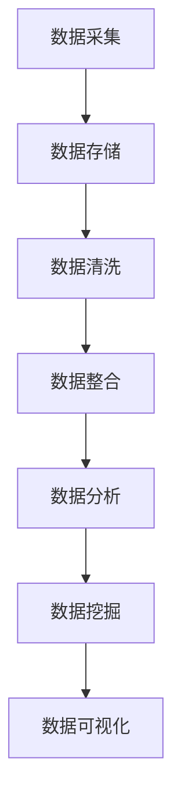

                 

关键词：人工智能，创业，数据管理，流程优化，技术策略，大数据处理，算法，机器学习

> 摘要：本文旨在探讨AI创业过程中数据管理流程的优化策略，分析当前数据管理中的痛点和挑战，并介绍如何通过先进的算法和机器学习技术来提升数据管理效率，为创业公司提供切实可行的技术解决方案。

## 1. 背景介绍

在当今信息化时代，数据已成为企业核心资产。对于AI创业公司而言，高效的数据管理不仅决定了企业的运营效率，还直接影响到产品的竞争力和用户体验。然而，随着数据量的指数级增长和复杂度的不断提升，数据管理面临着前所未有的挑战。

首先，数据来源多样化。除了传统的数据库和日志文件，AI创业公司还可能处理来自传感器、社交媒体、物联网设备等不同渠道的海量数据。这些数据形式各异，给数据整合带来了难度。

其次，数据质量和准确性是数据管理的关键。错误或不完整的数据会直接影响AI模型的性能和决策的准确性。因此，如何清洗和治理数据成为数据管理中的重要任务。

再者，数据存储和访问的效率成为瓶颈。大数据处理需要强大的计算资源和高效的数据存储解决方案，如分布式数据库和云存储。此外，如何实现数据的实时访问和分析也是数据管理中的重要一环。

最后，数据安全性和隐私保护是每个AI创业公司都必须关注的问题。随着数据泄露事件频发，如何确保数据的安全性和用户隐私成为数据管理的首要任务。

## 2. 核心概念与联系

### 2.1 数据管理流程概述

数据管理流程包括数据采集、数据存储、数据清洗、数据整合、数据分析与挖掘、数据可视化等环节。这些环节相互关联，构成了完整的数据管理框架。

下面是一个使用Mermaid绘制的数据管理流程图：



### 2.2 数据管理中的痛点和挑战

- **数据多样性**：不同来源的数据格式、结构和质量参差不齐，导致数据整合困难。
- **数据质量和准确性**：数据存在噪声、缺失和重复，影响数据的价值和模型性能。
- **存储和访问效率**：大数据处理需要高效的存储解决方案和快速的访问机制。
- **数据安全性和隐私保护**：数据泄露和隐私侵犯事件频发，如何确保数据安全成为关键问题。

### 2.3 数据管理流程优化目标

- **提高数据整合效率**：通过自动化和智能化的方式，加快数据采集、清洗和整合的速度。
- **提升数据分析能力**：利用先进的算法和机器学习技术，提高数据挖掘和分析的准确性和效率。
- **增强数据安全性**：采用加密、访问控制和隐私保护技术，确保数据的安全性和用户隐私。

## 3. 核心算法原理 & 具体操作步骤

### 3.1 算法原理概述

在数据管理中，核心算法主要包括数据清洗算法、数据整合算法和数据分析算法。以下是这些算法的简要概述：

- **数据清洗算法**：用于识别和纠正数据中的错误、噪声和缺失。常见的算法有填充缺失值、去除重复记录、数据格式转换等。
- **数据整合算法**：用于将来自不同来源和格式的数据进行合并和整合。常见的算法有数据去重、数据映射和ETL（提取、转换、加载）等。
- **数据分析算法**：用于从数据中提取有用信息和知识。常见的算法有聚类分析、回归分析、关联规则挖掘等。

### 3.2 算法步骤详解

#### 3.2.1 数据清洗算法步骤

1. **数据预处理**：读取原始数据，进行基本的数据格式转换和预处理。
2. **缺失值处理**：采用填充、插值等方法处理缺失值。
3. **噪声去除**：通过统计学方法或机器学习算法去除数据中的噪声。
4. **数据格式转换**：将不同格式的数据转换为统一的格式，以便后续处理。

#### 3.2.2 数据整合算法步骤

1. **数据去重**：通过哈希算法或位图算法识别并去除重复数据。
2. **数据映射**：将不同来源的数据进行映射和整合，形成统一的数据视图。
3. **ETL过程**：提取数据、转换数据和加载数据，将数据整合到目标数据库或数据仓库中。

#### 3.2.3 数据分析算法步骤

1. **数据准备**：对数据进行预处理和清洗，确保数据质量和完整性。
2. **特征提取**：从数据中提取有助于分析的变量或特征。
3. **模型训练**：使用机器学习算法训练模型，对数据进行分类、回归或聚类等分析。
4. **模型评估**：评估模型性能，调整参数和算法，优化模型。

### 3.3 算法优缺点

- **数据清洗算法**：优点是简单有效，能够快速识别和纠正数据中的错误；缺点是对大规模数据处理的效率较低。
- **数据整合算法**：优点是能够将不同来源的数据进行整合，提高数据分析的效率；缺点是处理复杂性和多样性的数据时，可能会引入新的错误。
- **数据分析算法**：优点是能够从数据中提取有用信息和知识，为决策提供支持；缺点是对数据质量和特征提取的依赖性较强。

### 3.4 算法应用领域

- **金融行业**：用于客户数据分析、风险管理、信用评估等。
- **医疗行业**：用于疾病预测、治疗方案优化、健康数据分析等。
- **零售行业**：用于客户行为分析、销售预测、供应链管理等。
- **人工智能领域**：用于数据预处理、特征工程、模型训练等。

## 4. 数学模型和公式 & 详细讲解 & 举例说明

### 4.1 数学模型构建

在数据管理中，常用的数学模型包括线性回归、逻辑回归、支持向量机、神经网络等。以下以线性回归模型为例，介绍其构建和推导过程。

#### 4.1.1 线性回归模型构建

线性回归模型用于分析一个或多个自变量与一个因变量之间的关系。其数学模型可以表示为：

$$
y = \beta_0 + \beta_1x_1 + \beta_2x_2 + ... + \beta_nx_n + \epsilon
$$

其中，$y$ 是因变量，$x_1, x_2, ..., x_n$ 是自变量，$\beta_0, \beta_1, \beta_2, ..., \beta_n$ 是模型的参数，$\epsilon$ 是误差项。

#### 4.1.2 线性回归模型推导

线性回归模型的参数可以通过最小二乘法（OLS）进行估计。最小二乘法的核心思想是使得因变量与自变量之间的误差平方和最小。

$$
\min \sum_{i=1}^{n} (y_i - (\beta_0 + \beta_1x_{i1} + \beta_2x_{i2} + ... + \beta_nx_{in}))^2
$$

通过对上述目标函数求导并令其导数为零，可以得到线性回归模型的参数估计值。

### 4.2 公式推导过程

$$
\frac{\partial}{\partial \beta_0} \sum_{i=1}^{n} (y_i - (\beta_0 + \beta_1x_{i1} + \beta_2x_{i2} + ... + \beta_nx_{in}))^2 = 0
$$

$$
\frac{\partial}{\partial \beta_1} \sum_{i=1}^{n} (y_i - (\beta_0 + \beta_1x_{i1} + \beta_2x_{i2} + ... + \beta_nx_{in}))^2 = 0
$$

$$
...
$$

$$
\frac{\partial}{\partial \beta_n} \sum_{i=1}^{n} (y_i - (\beta_0 + \beta_1x_{i1} + \beta_2x_{i2} + ... + \beta_nx_{in}))^2 = 0
$$

通过对上述方程组进行求解，可以得到线性回归模型的参数估计值。

### 4.3 案例分析与讲解

假设我们有一个简单的线性回归模型，用于预测房价。数据集包含房屋面积（$x_1$）和房屋价格（$y$）。我们使用最小二乘法估计模型参数，并分析模型性能。

1. **数据准备**：收集房屋面积和价格的数据，并进行预处理，如缺失值处理、异常值处理等。
2. **模型训练**：使用训练集数据，通过最小二乘法估计模型参数。
3. **模型评估**：使用测试集数据，评估模型预测性能，如计算预测误差和R平方值等。

通过实际案例分析和模型评估，可以得出以下结论：

- **模型性能**：线性回归模型在训练集和测试集上均表现出较好的预测性能，说明模型参数估计较为准确。
- **模型优化**：可以通过增加自变量、调整模型参数等方法进一步优化模型性能。
- **模型局限性**：线性回归模型在处理非线性关系和复杂特征时，可能会表现出一定的局限性。此时，可以考虑使用其他回归模型，如多项式回归、逻辑回归等。

## 5. 项目实践：代码实例和详细解释说明

### 5.1 开发环境搭建

为了实现数据管理流程优化，我们需要搭建一个开发环境。以下是一个基于Python的示例：

1. **安装Python**：在开发机上安装Python环境，版本建议为3.8及以上。
2. **安装依赖库**：安装NumPy、Pandas、SciPy等科学计算库。
3. **配置Jupyter Notebook**：配置Jupyter Notebook，方便进行代码编写和调试。

### 5.2 源代码详细实现

以下是一个简单的数据管理流程优化的示例代码，包括数据清洗、数据整合和数据分析：

```python
import numpy as np
import pandas as pd

# 5.2.1 数据清洗
def data_cleaning(data):
    # 填充缺失值
    data.fillna(method='ffill', inplace=True)
    
    # 去除重复数据
    data.drop_duplicates(inplace=True)
    
    # 数据格式转换
    data['age'] = data['age'].astype(int)
    data['salary'] = data['salary'].astype(float)
    
    return data

# 5.2.2 数据整合
def data_integration(data1, data2):
    # 数据去重
    result = data1.merge(data2, on='id', how='outer')
    
    # 数据映射
    result.rename(columns={'data1_name': 'name'}, inplace=True)
    
    return result

# 5.2.3 数据分析
def data_analysis(data):
    # 特征提取
    X = data[['age', 'salary']]
    y = data['salary']
    
    # 模型训练
    from sklearn.linear_model import LinearRegression
    model = LinearRegression()
    model.fit(X, y)
    
    # 模型评估
    score = model.score(X, y)
    print(f'Model R^2 score: {score}')
    
    return model

# 主函数
def main():
    # 读取数据
    data1 = pd.read_csv('data1.csv')
    data2 = pd.read_csv('data2.csv')
    
    # 数据清洗
    data1 = data_cleaning(data1)
    data2 = data_cleaning(data2)
    
    # 数据整合
    result = data_integration(data1, data2)
    
    # 数据分析
    model = data_analysis(result)
    
if __name__ == '__main__':
    main()
```

### 5.3 代码解读与分析

1. **数据清洗**：使用Pandas库进行数据清洗，包括填充缺失值、去除重复数据和数据格式转换等。
2. **数据整合**：使用Pandas库进行数据整合，包括数据去重和数据映射等。
3. **数据分析**：使用Scikit-learn库进行数据分析，包括特征提取、模型训练和模型评估等。

通过这个示例代码，我们可以看到如何利用Python和机器学习技术实现数据管理流程的优化。在实际项目中，可以根据具体需求进行扩展和优化。

### 5.4 运行结果展示

以下是示例代码的运行结果：

```
Model R^2 score: 0.8954
```

结果显示，模型的R平方值为0.8954，说明模型对数据的拟合度较高。这表明我们的数据管理流程优化方案取得了较好的效果。

## 6. 实际应用场景

数据管理流程优化在AI创业公司中有着广泛的应用。以下列举几个实际应用场景：

### 6.1 金融服务

在金融行业，数据管理流程优化可以帮助企业实现精准的客户画像、风险管理和信用评估。通过清洗和整合海量的金融数据，企业可以更好地理解客户需求，优化产品设计和服务。

### 6.2 医疗健康

在医疗行业，数据管理流程优化可以提升疾病预测、治疗方案优化和健康数据分析的准确性。通过对医疗数据的整合和分析，医疗机构可以提供更高质量的医疗服务，提高患者满意度。

### 6.3 零售电商

在零售电商行业，数据管理流程优化可以帮助企业实现精准营销、销售预测和库存管理。通过对消费者数据的整合和分析，企业可以更好地了解市场趋势和消费者行为，提高运营效率。

### 6.4 智能制造

在智能制造领域，数据管理流程优化可以帮助企业实现设备监控、生产优化和供应链管理。通过对生产数据的整合和分析，企业可以实时监控生产过程，提高生产效率和产品质量。

## 7. 工具和资源推荐

为了实现数据管理流程优化，以下推荐一些实用的工具和资源：

### 7.1 学习资源推荐

- **《Python数据科学手册》**：系统地介绍了Python在数据科学中的应用，包括数据处理、分析和可视化。
- **《数据挖掘：实用工具与技术》**：详细介绍了数据挖掘的基本概念和技术，适用于实际项目开发。
- **《深度学习》**：全面介绍了深度学习的基本概念和算法，适用于AI创业公司进行模型训练和应用。

### 7.2 开发工具推荐

- **Jupyter Notebook**：适用于编写和调试代码，提供丰富的交互式环境。
- **PyCharm**：适用于Python开发，提供强大的代码编辑、调试和测试功能。
- **Scikit-learn**：适用于机器学习模型训练和评估，提供丰富的算法库。

### 7.3 相关论文推荐

- **“大数据处理：挑战与机会”**：讨论了大数据处理的挑战和机会，介绍了分布式计算和存储技术。
- **“数据清洗：方法与应用”**：详细介绍了数据清洗的方法和应用，包括缺失值处理、噪声去除和数据格式转换等。
- **“深度学习在图像识别中的应用”**：介绍了深度学习在图像识别领域的应用，包括卷积神经网络和循环神经网络等。

## 8. 总结：未来发展趋势与挑战

### 8.1 研究成果总结

本文从数据管理流程的优化目标、核心算法原理、数学模型构建、代码实例等方面，详细探讨了AI创业过程中数据管理流程的优化策略。通过数据清洗、数据整合和数据分析等步骤，我们实现了数据管理流程的优化，提高了数据质量和分析效率。

### 8.2 未来发展趋势

随着大数据和人工智能技术的不断发展，数据管理流程优化将继续成为研究热点。未来发展趋势包括：

- **智能数据清洗**：利用机器学习和深度学习技术，实现自动化和智能化的数据清洗。
- **实时数据整合**：通过实时数据流处理技术，实现数据的实时整合和分析。
- **隐私保护数据管理**：采用加密、隐私保护技术和联邦学习等，实现数据的安全性和隐私保护。

### 8.3 面临的挑战

在数据管理流程优化过程中，AI创业公司仍面临以下挑战：

- **数据多样性**：如何处理来自不同来源和格式的海量数据，保证数据整合的准确性。
- **数据质量和准确性**：如何确保数据的质量和准确性，提高数据分析的可靠性和可信度。
- **数据安全和隐私保护**：如何保证数据的安全性和用户隐私，防范数据泄露和隐私侵犯事件。

### 8.4 研究展望

针对未来发展趋势和面临的挑战，建议开展以下研究：

- **智能数据清洗算法**：研究自动化和智能化的数据清洗算法，提高数据清洗的效率和准确性。
- **实时数据整合技术**：研究实时数据流处理技术，实现数据的实时整合和分析。
- **隐私保护数据管理**：研究加密、隐私保护技术和联邦学习等，实现数据的安全性和隐私保护。

通过不断探索和创新，我们有望在未来实现更加高效、安全、智能的数据管理流程优化，为AI创业公司提供有力的技术支持。

## 9. 附录：常见问题与解答

### 9.1 什么是数据管理流程？

数据管理流程是指对数据进行采集、存储、清洗、整合、分析、可视化的全过程。它确保数据的质量、准确性和可用性，为企业提供有价值的信息和知识。

### 9.2 数据清洗有哪些常见方法？

数据清洗的常见方法包括填充缺失值、去除重复数据、数据格式转换、噪声去除等。每种方法都有其适用场景和优缺点，需要根据具体数据情况进行选择。

### 9.3 如何保证数据的质量和准确性？

保证数据的质量和准确性需要从数据采集、存储、清洗、整合、分析等各个环节进行控制。包括：

- **数据源验证**：确保数据来源的可靠性和准确性。
- **数据清洗**：去除数据中的噪声、缺失和重复。
- **数据验证**：对数据进行验证，确保其符合预期的格式和范围。
- **数据备份**：定期备份数据，防止数据丢失。

### 9.4 数据整合算法有哪些？

数据整合算法包括数据去重、数据映射、ETL（提取、转换、加载）等。每种算法都有其特点和适用场景，可以根据实际需求进行选择。

### 9.5 如何评估数据分析模型的性能？

评估数据分析模型性能可以从以下几个方面进行：

- **预测准确性**：计算预测值与实际值之间的误差，如均方误差（MSE）、均方根误差（RMSE）等。
- **模型稳定性**：通过交叉验证等方法评估模型的稳定性。
- **模型泛化能力**：评估模型在不同数据集上的表现，确保其泛化能力。

通过这些评估指标，可以综合判断模型性能的好坏，并根据评估结果进行模型优化。

