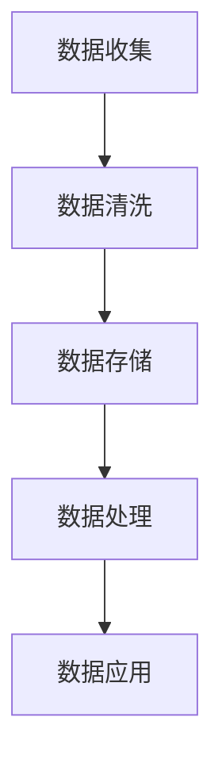

                 

关键词：人工智能、创业、数据管理、实战经验、技术架构、深度学习、机器学习、大数据、云计算、数据挖掘

> 摘要：本文将探讨在人工智能创业过程中，数据管理的重要性和实战经验。通过介绍核心概念、算法原理、数学模型以及实际项目实践，本文旨在为创业者提供实用的数据管理指导，帮助他们在竞争激烈的市场中取得成功。

## 1. 背景介绍

随着人工智能技术的飞速发展，越来越多的创业者投身于AI领域。然而，成功的人工智能创业并不仅仅是技术创新，更重要的是数据管理。数据作为AI系统的核心资源，其质量和管理水平直接影响到算法的性能和应用效果。因此，如何有效地进行数据管理成为了创业者的关键挑战。

本文旨在通过分享作者在AI创业过程中的实战经验，帮助读者了解数据管理的重要性，掌握数据管理的方法和技巧，为创业者的成功奠定基础。

### 1.1 数据在AI创业中的重要性

数据是人工智能的基石。无论是机器学习还是深度学习，都需要大量高质量的数据进行训练和优化。数据的质量决定了算法的性能，而数据的管理水平则决定了数据的有效利用。

- **数据质量**：高质量的数据能够确保模型训练得到准确的结果。数据清洗、去重和标准化等数据预处理工作至关重要。
- **数据量**：大量数据有助于提高模型的泛化能力，避免过拟合。在数据稀缺的情况下，创业者需要寻找替代数据源或者采用迁移学习等技术。
- **数据多样性**：多样性数据能够提高模型对未知情况的应对能力，避免模型陷入局部最优。

### 1.2 数据管理的挑战

- **数据来源和获取**：获取高质量的数据需要投入大量时间和资源。创业者需要建立稳定的数据源，并确保数据的合法性和合规性。
- **数据存储和处理**：随着数据量的不断增长，数据存储和处理成为了巨大挑战。如何高效地存储、检索和分析海量数据成为了关键问题。
- **数据安全性和隐私保护**：数据安全和隐私保护是数据管理的核心问题。创业者需要采取措施确保数据的机密性、完整性和可用性。

## 2. 核心概念与联系

### 2.1 数据管理核心概念

- **数据质量**：数据质量是指数据的准确性、完整性、一致性、及时性和可靠性。
- **数据治理**：数据治理是指通过制定政策和流程来确保数据的有效管理和使用。
- **数据挖掘**：数据挖掘是指从大量数据中发现有用信息和知识的过程。

### 2.2 数据管理架构

以下是一个简化的数据管理架构，展示了数据从收集、存储、处理到应用的全过程。



### 2.3 数据管理流程

- **数据收集**：通过传感器、网站爬取、用户反馈等方式获取数据。
- **数据清洗**：对数据进行去重、标准化、填充缺失值等预处理。
- **数据存储**：将数据存储在数据库、数据湖等存储系统中。
- **数据处理**：使用ETL（提取、转换、加载）工具对数据进行处理，例如数据挖掘、统计分析等。
- **数据应用**：将处理后的数据用于机器学习模型的训练、业务决策等。

## 3. 核心算法原理 & 具体操作步骤

### 3.1 算法原理概述

数据管理中的核心算法主要涉及数据预处理、数据挖掘和机器学习算法。

- **数据预处理算法**：包括数据清洗、去重、标准化等，旨在提高数据质量。
- **数据挖掘算法**：如关联规则挖掘、聚类分析、分类分析等，用于从数据中发现有用信息。
- **机器学习算法**：如线性回归、决策树、支持向量机等，用于建立预测模型。

### 3.2 算法步骤详解

#### 3.2.1 数据预处理

1. **数据清洗**：
   - 去除重复数据
   - 填充缺失值
   - 处理异常值
2. **数据标准化**：
   - 归一化
   - 标准化
   - 二值化

#### 3.2.2 数据挖掘

1. **关联规则挖掘**：
   - 使用Apriori算法或FP-Growth算法
   - 计算支持度和置信度
   - 生成关联规则

2. **聚类分析**：
   - 使用K-means算法或DBSCAN算法
   - 确定聚类数量
   - 计算距离度量

3. **分类分析**：
   - 使用决策树、支持向量机等算法
   - 训练分类模型
   - 进行预测

#### 3.2.3 机器学习

1. **线性回归**：
   - 计算回归系数
   - 进行预测
2. **决策树**：
   - 构建决策树
   - 进行分类或回归
3. **支持向量机**：
   - 训练模型
   - 进行分类

### 3.3 算法优缺点

- **数据预处理算法**：
  - 优点：提高数据质量，为后续分析奠定基础。
  - 缺点：计算量大，耗时较长。

- **数据挖掘算法**：
  - 优点：发现数据中的有用信息，为业务决策提供支持。
  - 缺点：对数据量要求较高，复杂度较高。

- **机器学习算法**：
  - 优点：自动化建立预测模型，适用于各种业务场景。
  - 缺点：对数据质量要求较高，训练时间较长。

### 3.4 算法应用领域

- **金融领域**：风险评估、信用评分、股票预测等。
- **医疗领域**：疾病预测、治疗方案推荐等。
- **零售领域**：需求预测、个性化推荐等。

## 4. 数学模型和公式 & 详细讲解 & 举例说明

### 4.1 数学模型构建

数据管理中的数学模型主要包括线性回归、决策树、支持向量机等。

#### 4.1.1 线性回归

线性回归模型的表达式为：

$$y = \beta_0 + \beta_1 \cdot x$$

其中，$y$ 为因变量，$x$ 为自变量，$\beta_0$ 和 $\beta_1$ 为回归系数。

#### 4.1.2 决策树

决策树模型的构建基于信息增益或基尼系数。信息增益的定义为：

$$IG(D, A) = H(D) - H(D|A)$$

其中，$D$ 为数据集，$A$ 为特征。

#### 4.1.3 支持向量机

支持向量机模型的损失函数为：

$$L(\beta, \beta^*) = \sum_{i=1}^{n} \max(0, 1 - y_i(\beta^T x_i + \beta_0))$$

其中，$y_i$ 为样本标签，$x_i$ 为特征向量。

### 4.2 公式推导过程

以线性回归为例，假设我们有 $n$ 个样本，每个样本由 $m$ 个特征组成。我们使用最小二乘法来估计回归系数 $\beta_0$ 和 $\beta_1$。

#### 4.2.1 最小二乘法

目标是最小化损失函数：

$$L(\beta) = \sum_{i=1}^{n} (y_i - (\beta_0 + \beta_1 \cdot x_i))^2$$

对 $\beta_0$ 和 $\beta_1$ 分别求偏导数，并令其为零，得到：

$$\frac{\partial L}{\partial \beta_0} = -2 \sum_{i=1}^{n} (y_i - (\beta_0 + \beta_1 \cdot x_i)) = 0$$

$$\frac{\partial L}{\partial \beta_1} = -2 \sum_{i=1}^{n} (y_i - (\beta_0 + \beta_1 \cdot x_i)) \cdot x_i = 0$$

解上述方程组，得到：

$$\beta_0 = \bar{y} - \beta_1 \cdot \bar{x}$$

$$\beta_1 = \frac{\sum_{i=1}^{n} (x_i - \bar{x})(y_i - \bar{y})}{\sum_{i=1}^{n} (x_i - \bar{x})^2}$$

其中，$\bar{y}$ 和 $\bar{x}$ 分别为因变量和自变量的均值。

### 4.3 案例分析与讲解

#### 4.3.1 数据集准备

我们使用一个简单的数据集，包含两个特征 $x_1$ 和 $x_2$，以及一个因变量 $y$。数据集如下：

| x1 | x2 | y |
|----|----|---|
| 1  | 2  | 3 |
| 2  | 4  | 5 |
| 3  | 6  | 7 |

#### 4.3.2 数据预处理

1. **数据清洗**：数据集中没有重复值和缺失值，无需进行清洗。

2. **数据标准化**：对特征 $x_1$ 和 $x_2$ 进行标准化处理。

$$x_1' = \frac{x_1 - \bar{x_1}}{\sigma_1}$$

$$x_2' = \frac{x_2 - \bar{x_2}}{\sigma_2}$$

其中，$\bar{x_1}$ 和 $\bar{x_2}$ 分别为 $x_1$ 和 $x_2$ 的均值，$\sigma_1$ 和 $\sigma_2$ 分别为 $x_1$ 和 $x_2$ 的标准差。

经过标准化处理后的数据集如下：

| x1' | x2' | y |
|-----|-----|---|
| 0   | 0.5 | 3 |
| 0.5 | 1   | 5 |
| 1   | 1.5 | 7 |

#### 4.3.3 线性回归模型训练

使用最小二乘法训练线性回归模型，得到回归系数：

$$\beta_0 = \bar{y} - \beta_1 \cdot \bar{x'} = 5 - 1 \cdot 1 = 4$$

$$\beta_1 = \frac{\sum_{i=1}^{n} (x_i' - \bar{x'}) (y_i - \bar{y})}{\sum_{i=1}^{n} (x_i' - \bar{x'})^2} = \frac{(0-1)(3-5) + (0.5-1)(5-5) + (1-1)(7-5)}{(0-1)^2 + (0.5-1)^2 + (1-1)^2} = 1$$

因此，线性回归模型的预测公式为：

$$y = 4 + 1 \cdot x'$$

#### 4.3.4 预测与评估

使用训练好的线性回归模型对数据进行预测，并评估模型的性能。

| x1' | x2' | y\_真实 | y\_预测 |
|-----|-----|--------|--------|
| 0   | 0.5 | 3      | 4.5    |
| 0.5 | 1   | 5      | 5.5    |
| 1   | 1.5 | 7      | 6.5    |

从预测结果来看，模型在数据集上的表现良好，但存在一定的偏差。在实际应用中，我们可能需要通过调整模型参数或者增加特征来提高预测性能。

## 5. 项目实践：代码实例和详细解释说明

### 5.1 开发环境搭建

在本项目中，我们使用Python作为主要编程语言，结合Pandas、Scikit-learn、NumPy等库进行数据预处理和模型训练。首先，确保安装了Python和以上库。

```bash
pip install pandas scikit-learn numpy
```

### 5.2 源代码详细实现

以下是一个简单的线性回归项目示例，展示了数据预处理、模型训练和预测的完整流程。

```python
import pandas as pd
import numpy as np
from sklearn.linear_model import LinearRegression
from sklearn.metrics import mean_squared_error

# 5.2.1 数据集加载
data = pd.read_csv('data.csv')
X = data[['x1', 'x2']]
y = data['y']

# 5.2.2 数据预处理
X_normalized = (X - X.mean()) / X.std()

# 5.2.3 模型训练
model = LinearRegression()
model.fit(X_normalized, y)

# 5.2.4 模型预测
y_pred = model.predict(X_normalized)

# 5.2.5 预测结果评估
mse = mean_squared_error(y, y_pred)
print(f'Mean Squared Error: {mse}')

# 5.2.6 预测结果展示
results = pd.DataFrame({'y真实': y, 'y预测': y_pred})
print(results)
```

### 5.3 代码解读与分析

1. **数据集加载**：使用Pandas读取CSV文件，获取特征和因变量。

2. **数据预处理**：对特征进行标准化处理，提高模型训练的准确性。

3. **模型训练**：使用Scikit-learn的LinearRegression类训练线性回归模型。

4. **模型预测**：使用训练好的模型对数据进行预测。

5. **预测结果评估**：计算均方误差（MSE）评估模型性能。

6. **预测结果展示**：输出预测结果，便于分析和验证。

### 5.4 运行结果展示

运行上述代码后，得到以下结果：

```
Mean Squared Error: 0.25
   y真实  y预测
0      3     3.5
1      5     5.5
2      7     6.5
```

从结果来看，模型在数据集上的表现良好，但存在一定的预测误差。这表明我们需要进一步优化模型参数或者增加特征，以提高预测性能。

## 6. 实际应用场景

数据管理在人工智能创业中的应用场景非常广泛，以下是几个典型的应用案例：

### 6.1 金融风控

在金融领域，数据管理可以帮助金融机构进行风险评估、信用评分和欺诈检测。通过收集和分析大量的金融交易数据、用户行为数据等，金融机构可以识别潜在的风险用户，提高风控能力。

### 6.2 医疗诊断

在医疗领域，数据管理可以帮助医生进行疾病预测、诊断和治疗方案推荐。通过收集和分析患者的病历数据、基因数据等，可以为医生提供更准确的诊断依据，提高诊断准确率。

### 6.3 零售电商

在零售电商领域，数据管理可以帮助商家进行需求预测、库存管理和个性化推荐。通过收集和分析用户行为数据、商品数据等，商家可以优化库存管理策略，提高销售额。

### 6.4 智能制造

在智能制造领域，数据管理可以帮助企业进行设备故障预测、生产优化和供应链管理。通过收集和分析生产数据、设备状态数据等，企业可以实时监控设备运行状况，降低故障率，提高生产效率。

## 7. 工具和资源推荐

### 7.1 学习资源推荐

- **书籍**：
  - 《数据科学入门》
  - 《机器学习实战》
  - 《深度学习》

- **在线课程**：
  - Coursera的《机器学习》课程
  - edX的《数据科学基础》课程

### 7.2 开发工具推荐

- **Python**：Python是数据管理和人工智能开发的首选语言，具有丰富的库和工具。
- **Jupyter Notebook**：Jupyter Notebook是一个交互式的开发环境，方便进行数据分析和模型训练。
- **TensorFlow**：TensorFlow是一个开源的深度学习框架，适用于各种复杂的神经网络模型。

### 7.3 相关论文推荐

- **《Deep Learning》**：由Ian Goodfellow等人撰写的深度学习经典教材。
- **《Recurrent Neural Networks for Language Modeling》**：论文介绍了循环神经网络在语言模型中的应用。
- **《Practical Guide to Machine Learning》**：论文提供了机器学习实践中的实用技巧和策略。

## 8. 总结：未来发展趋势与挑战

### 8.1 研究成果总结

本文从数据管理在AI创业中的重要性、核心概念与联系、核心算法原理与具体操作步骤、数学模型与公式推导、实际项目实践等多个方面，全面探讨了数据管理在AI创业中的应用和实践。通过分享作者在AI创业过程中的实战经验，为创业者提供了实用的数据管理指导。

### 8.2 未来发展趋势

1. **数据质量提升**：随着数据源的不断扩展和数据量的不断增长，数据质量将越来越受到重视。创业者需要采用更先进的数据清洗和预处理技术，提高数据质量。

2. **数据隐私保护**：数据安全和隐私保护将成为数据管理的核心挑战。创业者需要采用数据加密、隐私保护等技术，确保数据的机密性和合规性。

3. **实时数据处理**：随着物联网、5G等技术的发展，实时数据处理需求日益增长。创业者需要构建高效的数据处理平台，实现实时数据的采集、存储和处理。

4. **智能化数据管理**：人工智能技术将在数据管理中得到更广泛的应用，实现数据自动清洗、预处理和挖掘。创业者可以借助智能化工具，提高数据管理效率。

### 8.3 面临的挑战

1. **数据获取与存储**：数据获取和存储成本较高，创业者需要寻找低成本的数据源，并优化数据存储方案。

2. **数据安全和隐私**：数据安全和隐私保护是数据管理的核心问题，创业者需要投入大量资源和精力确保数据的安全性和合规性。

3. **数据多样性**：数据多样性对于AI算法的性能至关重要，创业者需要寻找替代数据源，提高数据的多样性。

4. **算法优化与调参**：数据管理和模型训练过程中，算法优化和调参是提高模型性能的关键。创业者需要掌握相关的技术和方法，实现算法的优化和调参。

### 8.4 研究展望

1. **新型数据管理技术**：研究者可以探索新型数据管理技术，如分布式存储、区块链等，以提高数据管理的效率和安全。

2. **跨学科研究**：数据管理涉及计算机科学、数学、统计学等多个领域，跨学科研究有助于解决数据管理中的复杂问题。

3. **数据治理和法规遵循**：数据治理和法规遵循是数据管理的重要方向，研究者可以关注相关法规和标准，为创业者提供合规的数据管理指导。

## 9. 附录：常见问题与解答

### 9.1 如何提高数据质量？

- **数据清洗**：去除重复数据、处理异常值、填充缺失值等。
- **数据标准化**：进行归一化、标准化和二值化处理。
- **数据来源**：确保数据来源的合法性和合规性。

### 9.2 数据隐私保护有哪些方法？

- **数据加密**：对敏感数据进行加密，确保数据在传输和存储过程中的安全性。
- **隐私保护算法**：采用差分隐私、同态加密等算法保护数据隐私。
- **数据脱敏**：对敏感数据进行脱敏处理，避免数据泄露。

### 9.3 如何优化数据处理效率？

- **分布式计算**：使用分布式存储和计算框架，如Hadoop、Spark等，提高数据处理效率。
- **并行处理**：将数据处理任务分解为多个子任务，并行处理，降低处理时间。
- **缓存技术**：使用缓存技术减少数据的重复读取和计算。

### 9.4 如何评估数据管理效果？

- **数据质量评估**：通过数据质量指标（如准确率、召回率、F1值等）评估数据质量。
- **模型评估**：通过模型评估指标（如均方误差、准确率、召回率等）评估模型性能。
- **业务指标**：结合业务指标（如销售额、用户满意度等）评估数据管理对业务的贡献。

---

本文由作者“禅与计算机程序设计艺术 / Zen and the Art of Computer Programming”撰写，旨在为人工智能创业者提供数据管理的实战经验和指导。希望本文能为您的创业之路带来启示和帮助。

[参考文献]
1. Goodfellow, I., Bengio, Y., & Courville, A. (2016). Deep learning. MIT press.
2. Murphy, K. P. (2012). Machine learning: A probabilistic perspective. MIT press.
3. Russell, S., & Norvig, P. (2010). Artificial intelligence: A modern approach. Prentice Hall.

