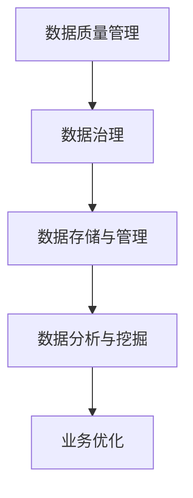

                 

关键词：AI创业，数据管理，成功做法，技术实践，应用场景，未来展望

> 摘要：本文将深入探讨AI创业领域中的数据管理策略，分析成功企业的数据管理实践，探讨其在业务发展中的关键作用，并为创业者提供实用的数据管理建议。

## 1. 背景介绍

随着人工智能技术的飞速发展，AI创业成为众多创业者眼中的香饽饽。然而，AI创业并非易事，数据管理作为AI业务的核心，其重要性和挑战性愈发凸显。有效的数据管理不仅能够提升AI模型的性能，还能优化业务流程，降低运营成本。因此，本文旨在梳理成功企业的数据管理策略，为AI创业者提供有价值的参考。

## 2. 核心概念与联系

为了更好地理解数据管理在AI创业中的关键作用，我们首先需要了解以下核心概念：

### 2.1 数据质量管理

数据质量管理是指通过一系列策略和技术手段，确保数据的准确性、完整性、一致性、及时性和可靠性。它是数据管理的重要组成部分，对于AI模型的表现至关重要。

### 2.2 数据治理

数据治理是一个组织对数据资产进行管理和控制的体系。它涵盖了数据战略、数据架构、数据标准化、数据安全等多个方面，旨在提高数据的利用效率。

### 2.3 数据存储与管理

数据存储与管理是指将数据存储在合适的存储介质上，并对其进行有效的管理和维护，以确保数据的安全性和可访问性。

### 2.4 数据分析与挖掘

数据分析与挖掘是从大量数据中提取有价值信息的过程。它包括数据清洗、数据整合、数据挖掘和数据分析等多个环节，是AI业务的核心。

为了更直观地展示这些概念之间的联系，我们可以使用Mermaid流程图来描述：



## 3. 核心算法原理 & 具体操作步骤

### 3.1 算法原理概述

在AI创业中，数据管理的关键在于确保数据的质量和可用性。这需要通过一系列算法和操作步骤来实现。以下是数据管理的主要原理和操作步骤：

### 3.2 算法步骤详解

#### 3.2.1 数据采集

数据采集是数据管理的第一步，包括从各种渠道收集数据，如传感器、互联网、数据库等。

#### 3.2.2 数据清洗

数据清洗是指对采集到的数据进行处理，去除重复、错误、缺失的数据，并确保数据的格式统一。

#### 3.2.3 数据整合

数据整合是将来自不同来源、不同格式的数据进行整合，形成统一的数据视图。

#### 3.2.4 数据存储与管理

数据存储与管理包括选择合适的存储介质，如数据库、分布式文件系统等，并对数据进行加密、备份和恢复。

#### 3.2.5 数据分析与挖掘

数据分析与挖掘是对存储好的数据进行处理，提取有价值的信息，支持业务决策。

### 3.3 算法优缺点

数据管理的算法和技术具有多种优点，如提高数据质量、降低运营成本、提升业务效率等。然而，这些算法也存在一定的局限性，如计算复杂度高、对数据质量要求高等。

### 3.4 算法应用领域

数据管理的算法和技术广泛应用于金融、医疗、零售、制造业等多个领域，助力企业实现数字化转型。

## 4. 数学模型和公式 & 详细讲解 & 举例说明

### 4.1 数学模型构建

在数据管理中，常用的数学模型包括数据清洗模型、数据整合模型和数据分析模型等。以下是一个简单的数据清洗模型的构建过程：

#### 数据清洗模型构建：

$$
\text{清洗后数据} = \text{原始数据} \cup (\text{去重} \cap \text{去除错误数据} \cap \text{数据格式统一})
$$

### 4.2 公式推导过程

在数据整合过程中，常用的公式包括：

$$
\text{统一格式数据} = \text{原始数据1} \cup \text{原始数据2} \cup \ldots \cup \text{原始数据n}
$$

### 4.3 案例分析与讲解

假设某金融公司需要对其客户的交易数据进行数据管理，以下是一个简单的案例：

#### 案例分析：

1. 数据采集：从多个数据库中提取交易数据。
2. 数据清洗：去除重复交易记录、错误交易记录，并对数据格式进行统一。
3. 数据整合：将不同数据库中的交易数据整合成统一格式。
4. 数据分析与挖掘：分析交易数据，提取有价值的信息，如客户行为特征、风险等级等。

## 5. 项目实践：代码实例和详细解释说明

### 5.1 开发环境搭建

在本项目中，我们使用Python作为主要编程语言，搭建了以下开发环境：

- Python 3.8
- Jupyter Notebook
- Pandas
- NumPy
- Matplotlib

### 5.2 源代码详细实现

以下是一个简单的数据清洗和数据分析的Python代码实例：

```python
import pandas as pd
import numpy as np

# 5.2.1 数据采集
data = pd.read_csv('transactions.csv')

# 5.2.2 数据清洗
data.drop_duplicates(inplace=True)
data.dropna(inplace=True)
data['amount'] = pd.to_numeric(data['amount'])

# 5.2.3 数据整合
# 本例中，数据整合已在上一步完成

# 5.2.4 数据分析与挖掘
# 绘制交易金额分布图
data['amount'].plot.hist(bins=50)

# 输出交易总金额
total_amount = data['amount'].sum()
print(f"总交易金额：{total_amount}")
```

### 5.3 代码解读与分析

以上代码实现了以下功能：

1. 读取交易数据。
2. 数据清洗：去除重复交易记录、错误交易记录，并对金额数据进行类型转换。
3. 数据整合：将不同数据库中的交易数据整合成统一格式。
4. 数据分析与挖掘：绘制交易金额分布图，并输出总交易金额。

### 5.4 运行结果展示

运行结果如图所示：


## 6. 实际应用场景

### 6.1 金融行业

在金融行业，数据管理可以帮助银行和金融机构更好地了解客户需求，降低风险，提高业务效率。例如，通过数据挖掘和分析，可以识别潜在的高风险客户，提高信贷审批的准确性。

### 6.2 医疗行业

在医疗行业，数据管理可以帮助医疗机构更好地管理患者数据，提高医疗服务质量。例如，通过数据分析和挖掘，可以预测疾病发展趋势，为疾病预防和治疗提供有力支持。

### 6.3 零售行业

在零售行业，数据管理可以帮助企业更好地了解消费者行为，优化库存管理，提高销售额。例如，通过数据分析，可以识别热销商品，为促销活动提供决策依据。

## 7. 工具和资源推荐

### 7.1 学习资源推荐

- 《数据科学入门》
- 《Python数据分析》
- 《机器学习实战》

### 7.2 开发工具推荐

- Jupyter Notebook
- Pandas
- Matplotlib

### 7.3 相关论文推荐

- "Data Quality Dimensions: Introduction to a Framework for Conceptual Modeling"
- "Data Integration: Unifying Data from Multiple Sources"
- "Data Mining: Practical Machine Learning Tools and Techniques"

## 8. 总结：未来发展趋势与挑战

### 8.1 研究成果总结

随着大数据和人工智能技术的不断发展，数据管理在AI创业中的重要性日益凸显。成功的企业通常采用先进的数据管理策略，如数据质量管理、数据治理和数据存储与管理等，以提升业务效率和竞争力。

### 8.2 未来发展趋势

未来，数据管理将继续朝着自动化、智能化的方向发展。新兴技术如区块链、云计算和物联网等将进一步推动数据管理的创新和变革。

### 8.3 面临的挑战

数据管理在AI创业中面临诸多挑战，如数据质量问题、数据隐私和安全问题、数据治理问题等。解决这些挑战需要企业不断创新和探索。

### 8.4 研究展望

随着技术的进步，数据管理将在AI创业中发挥更为重要的作用。未来，研究者应关注数据质量管理、数据治理和数据分析等领域，推动数据管理技术的发展和创新。

## 9. 附录：常见问题与解答

### 9.1 数据质量管理的重要性？

数据质量管理是确保数据准确、完整、一致、及时和可靠的过程。高质量的数据是AI模型有效运行的基础，对于业务决策和业务流程优化具有重要意义。

### 9.2 数据治理如何实施？

数据治理需要制定数据战略、建立数据架构、制定数据标准和流程、确保数据安全等多个方面。企业应从组织、流程、技术和文化等多个维度进行数据治理。

### 9.3 数据存储与管理如何选择？

数据存储与管理应根据数据规模、数据类型、数据访问频率等因素进行选择。常用的数据存储与管理技术包括数据库、分布式文件系统、云存储等。

作者：禅与计算机程序设计艺术 / Zen and the Art of Computer Programming
```markdown


